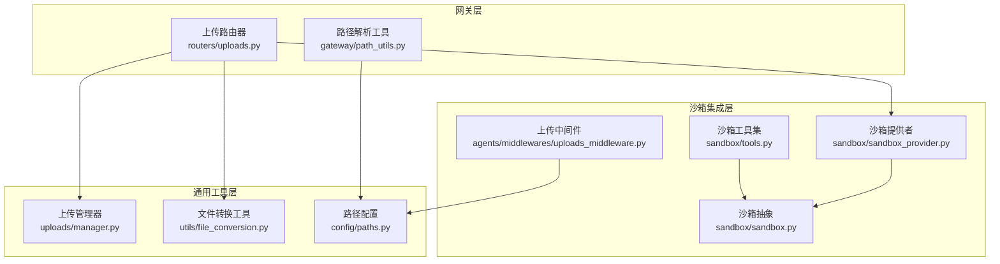
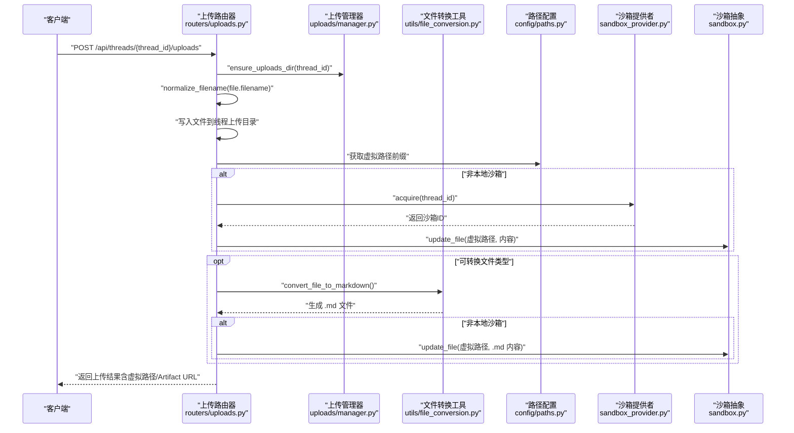
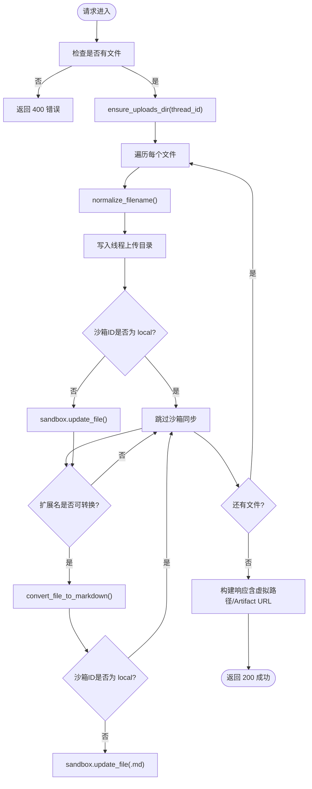
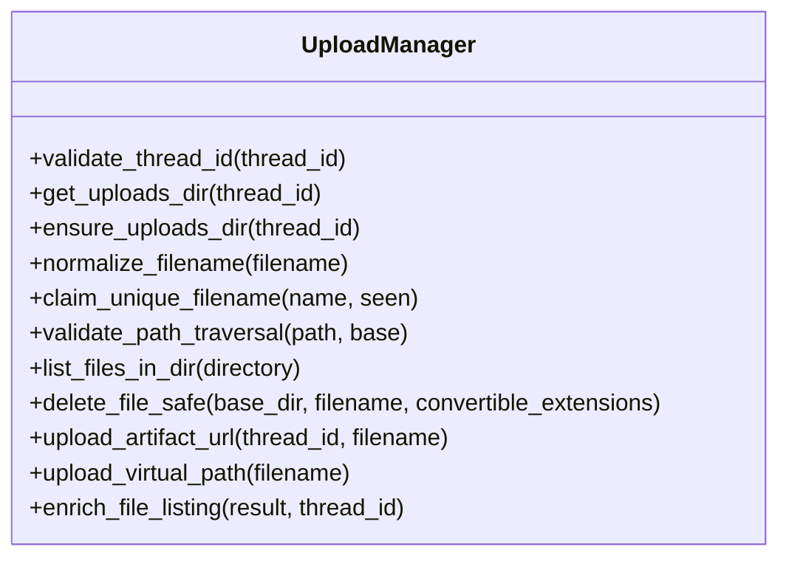
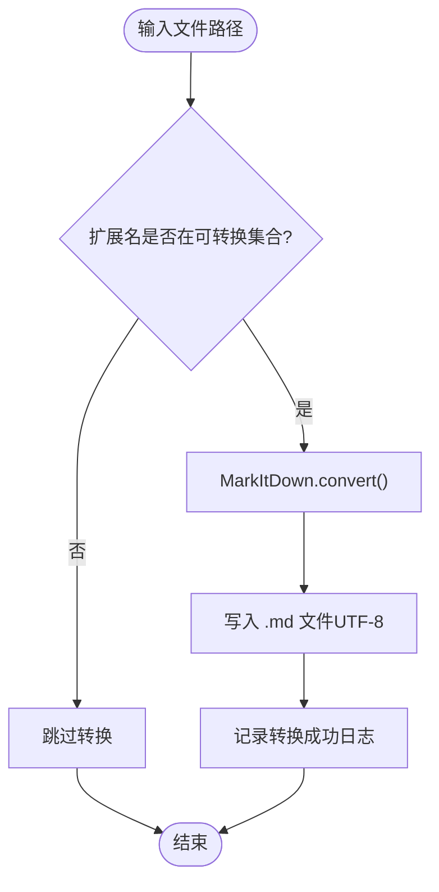
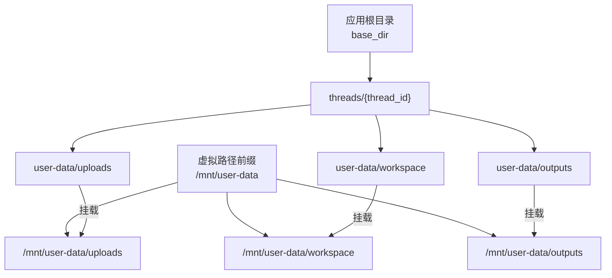
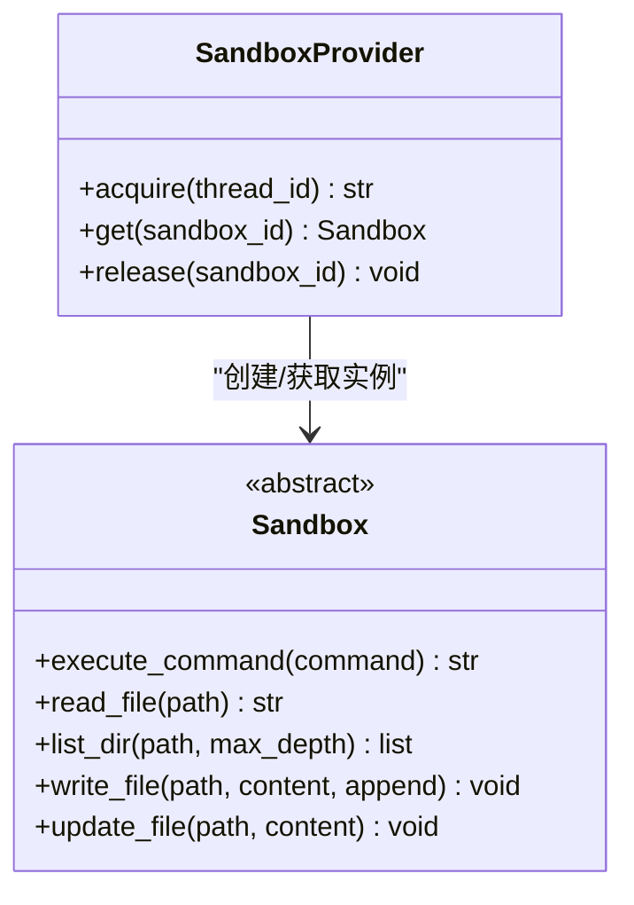
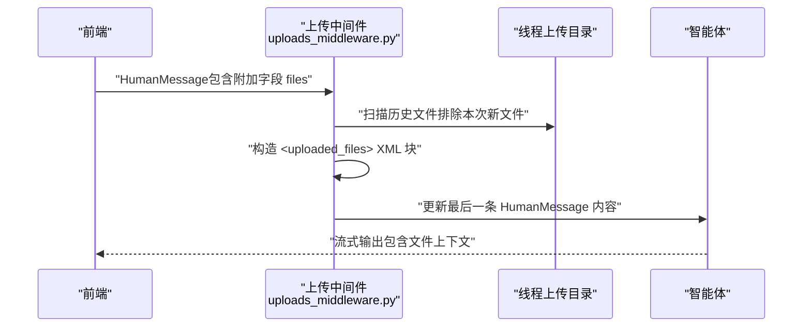
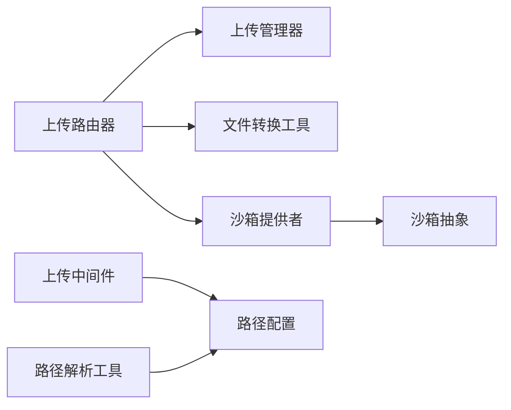

# 文件上传管理

<cite>
**本文引用的文件**
- [文件上传功能](file://backend/docs/FILE_UPLOAD.md)
- [上传路由器](file://backend/app/gateway/routers/uploads.py)
- [上传管理器](file://backend/packages/harness/deerflow/uploads/manager.py)
- [文件转换工具](file://backend/packages/harness/deerflow/utils/file_conversion.py)
- [上传中间件](file://backend/packages/harness/deerflow/agents/middlewares/uploads_middleware.py)
- [路径配置](file://backend/packages/harness/deerflow/config/paths.py)
- [沙箱抽象](file://backend/packages/harness/deerflow/sandbox/sandbox.py)
- [沙箱提供者](file://backend/packages/harness/deerflow/sandbox/sandbox_provider.py)
- [沙箱工具集](file://backend/packages/harness/deerflow/sandbox/tools.py)
- [路径解析工具](file://backend/app/gateway/path_utils.py)
- [上传管理器测试](file://backend/tests/test_uploads_manager.py)
- [上传路由测试](file://backend/tests/test_uploads_router.py)
- [项目配置](file://backend/pyproject.toml)
- [配置指南](file://backend/docs/CONFIGURATION.md)
</cite>

## 目录
1. [简介](#简介)
2. [项目结构](#项目结构)
3. [核心组件](#核心组件)
4. [架构总览](#架构总览)
5. [详细组件分析](#详细组件分析)
6. [依赖关系分析](#依赖关系分析)
7. [性能考虑](#性能考虑)
8. [故障排查指南](#故障排查指南)
9. [结论](#结论)
10. [附录](#附录)

## 简介
本技术文档面向 DeerFlow 文件上传管理系统，系统性阐述其架构设计、文件管理器实现、路径安全控制机制、文件转换工具、文件类型处理与存储策略，以及与沙箱、智能体的集成关系。文档还包含上传配置、安全验证、性能优化建议、文件处理示例与自定义文件处理器开发指南。

## 项目结构
文件上传子系统主要分布在后端网关层、通用工具层与沙箱集成层：
- 网关层：提供 REST API 路由，负责接收上传、列出与删除操作
- 通用工具层：封装上传管理逻辑、文件转换与路径解析
- 沙箱集成层：将上传文件同步至沙箱环境，供智能体读取

**图表来源**
- [上传路由器:1-147](file://backend/app/gateway/routers/uploads.py#L1-L147)
- [上传管理器:1-202](file://backend/packages/harness/deerflow/uploads/manager.py#L1-L202)
- [文件转换工具:1-48](file://backend/packages/harness/deerflow/utils/file_conversion.py#L1-L48)
- [路径配置:1-243](file://backend/packages/harness/deerflow/config/paths.py#L1-L243)
- [沙箱提供者:1-97](file://backend/packages/harness/deerflow/sandbox/sandbox_provider.py#L1-L97)
- [沙箱抽象:1-73](file://backend/packages/harness/deerflow/sandbox/sandbox.py#L1-L73)
- [沙箱工具集:1-880](file://backend/packages/harness/deerflow/sandbox/tools.py#L1-L880)
- [路径解析工具:1-29](file://backend/app/gateway/path_utils.py#L1-L29)
- [上传中间件:1-205](file://backend/packages/harness/deerflow/agents/middlewares/uploads_middleware.py#L1-L205)

**章节来源**
- [文件上传功能:1-294](file://backend/docs/FILE_UPLOAD.md#L1-L294)
- [上传路由器:1-147](file://backend/app/gateway/routers/uploads.py#L1-L147)
- [上传管理器:1-202](file://backend/packages/harness/deerflow/uploads/manager.py#L1-L202)
- [文件转换工具:1-48](file://backend/packages/harness/deerflow/utils/file_conversion.py#L1-L48)
- [路径配置:1-243](file://backend/packages/harness/deerflow/config/paths.py#L1-L243)
- [沙箱提供者:1-97](file://backend/packages/harness/deerflow/sandbox/sandbox_provider.py#L1-L97)
- [沙箱抽象:1-73](file://backend/packages/harness/deerflow/sandbox/sandbox.py#L1-L73)
- [沙箱工具集:1-880](file://backend/packages/harness/deerflow/sandbox/tools.py#L1-L880)
- [路径解析工具:1-29](file://backend/app/gateway/path_utils.py#L1-L29)
- [上传中间件:1-205](file://backend/packages/harness/deerflow/agents/middlewares/uploads_middleware.py#L1-L205)

## 核心组件
- 上传路由器：提供上传、列出与删除接口，负责文件写入与沙箱同步
- 上传管理器：提供路径校验、文件名规范化、唯一性保证、文件列表与删除等纯业务逻辑
- 文件转换工具：基于 markitdown 将 PDF/PPT/Excel/Word 转换为 Markdown
- 路径配置：统一管理虚拟路径前缀与线程隔离目录布局
- 沙箱提供者与抽象：抽象不同执行环境（本地/容器），提供命令执行、文件读写与目录列举能力
- 沙箱工具集：在本地沙箱模式下进行路径替换、访问控制与输出掩码
- 上传中间件：在智能体请求前注入已上传文件信息，形成上下文提示

**章节来源**
- [上传路由器:1-147](file://backend/app/gateway/routers/uploads.py#L1-L147)
- [上传管理器:1-202](file://backend/packages/harness/deerflow/uploads/manager.py#L1-L202)
- [文件转换工具:1-48](file://backend/packages/harness/deerflow/utils/file_conversion.py#L1-L48)
- [路径配置:1-243](file://backend/packages/harness/deerflow/config/paths.py#L1-L243)
- [沙箱提供者:1-97](file://backend/packages/harness/deerflow/sandbox/sandbox_provider.py#L1-L97)
- [沙箱抽象:1-73](file://backend/packages/harness/deerflow/sandbox/sandbox.py#L1-L73)
- [沙箱工具集:1-880](file://backend/packages/harness/deerflow/sandbox/tools.py#L1-L880)
- [上传中间件:1-205](file://backend/packages/harness/deerflow/agents/middlewares/uploads_middleware.py#L1-L205)

## 架构总览
文件上传从网关进入，经过安全校验与路径解析，写入线程隔离目录；根据沙箱类型决定是否同步到沙箱；随后可被智能体通过中间件感知并读取。

**图表来源**
- [上传路由器:36-110](file://backend/app/gateway/routers/uploads.py#L36-L110)
- [上传管理器:33-43](file://backend/packages/harness/deerflow/uploads/manager.py#L33-L43)
- [文件转换工具:24-47](file://backend/packages/harness/deerflow/utils/file_conversion.py#L24-L47)
- [路径配置:6-7](file://backend/packages/harness/deerflow/config/paths.py#L6-L7)
- [沙箱提供者:12-27](file://backend/packages/harness/deerflow/sandbox/sandbox_provider.py#L12-L27)
- [沙箱抽象:65-72](file://backend/packages/harness/deerflow/sandbox/sandbox.py#L65-L72)

**章节来源**
- [文件上传功能:15-138](file://backend/docs/FILE_UPLOAD.md#L15-L138)
- [上传路由器:36-110](file://backend/app/gateway/routers/uploads.py#L36-L110)
- [上传管理器:33-43](file://backend/packages/harness/deerflow/uploads/manager.py#L33-L43)
- [文件转换工具:24-47](file://backend/packages/harness/deerflow/utils/file_conversion.py#L24-L47)
- [路径配置:6-7](file://backend/packages/harness/deerflow/config/paths.py#L6-L7)
- [沙箱提供者:12-27](file://backend/packages/harness/deerflow/sandbox/sandbox_provider.py#L12-L27)
- [沙箱抽象:65-72](file://backend/packages/harness/deerflow/sandbox/sandbox.py#L65-L72)

## 详细组件分析

### 上传路由器（API 层）
- 职责：接收 multipart/form-data，调用上传管理器与转换工具，按沙箱类型同步文件，返回标准化响应
- 关键流程：
  - 校验 thread_id 并创建上传目录
  - 规范化文件名，写入线程上传目录
  - 对可转换类型触发转换，生成 .md 文件
  - 非本地沙箱时同步到沙箱虚拟路径
  - 列表与删除接口复用上传管理器能力

**图表来源**
- [上传路由器:36-110](file://backend/app/gateway/routers/uploads.py#L36-L110)

**章节来源**
- [上传路由器:36-110](file://backend/app/gateway/routers/uploads.py#L36-L110)

### 上传管理器（业务层）
- 职责：纯业务逻辑，不依赖 HTTP/FastAPI
- 安全与路径控制：
  - 线程 ID 字符集校验，防止路径注入
  - 文件名规范化，剥离路径组件，拒绝危险字符
  - 路径遍历检测，确保目标文件位于基目录内
  - 唯一文件名生成，避免同名冲突
- 文件操作：
  - 列表扫描目录，统计文件信息
  - 删除文件并清理配套 .md（可选）
  - 生成 Artifact URL 与虚拟路径

**图表来源**
- [上传管理器:23-202](file://backend/packages/harness/deerflow/uploads/manager.py#L23-L202)

**章节来源**
- [上传管理器:23-202](file://backend/packages/harness/deerflow/uploads/manager.py#L23-L202)

### 文件转换工具（文档处理层）
- 职责：将 PDF、PPT、Excel、Word 转换为 Markdown
- 扩展名集合：.pdf、.ppt、.pptx、.xls、.xlsx、.doc、.docx
- 失败处理：记录错误日志，不影响原文件保存

**图表来源**
- [文件转换工具:24-47](file://backend/packages/harness/deerflow/utils/file_conversion.py#L24-L47)

**章节来源**
- [文件转换工具:12-48](file://backend/packages/harness/deerflow/utils/file_conversion.py#L12-L48)

### 路径配置与虚拟路径（沙箱与线程隔离）
- 虚拟路径前缀：/mnt/user-data
- 线程隔离目录布局：
  - {base_dir}/threads/{thread_id}/user-data/{workspace, uploads, outputs}
  - 挂载到沙箱内的 /mnt/user-data/{workspace, uploads, outputs}
- 路径解析：将虚拟路径解析为宿主绝对路径，严格校验遍历攻击

**图表来源**
- [路径配置:12-151](file://backend/packages/harness/deerflow/config/paths.py#L12-L151)
- [路径解析工具:10-28](file://backend/app/gateway/path_utils.py#L10-L28)

**章节来源**
- [路径配置:12-151](file://backend/packages/harness/deerflow/config/paths.py#L12-L151)
- [路径解析工具:10-28](file://backend/app/gateway/path_utils.py#L10-L28)

### 沙箱集成与安全控制
- 沙箱提供者：抽象 acquire/get/release，支持本地与容器两种模式
- 本地沙箱安全：
  - 命令与路径替换：将 /mnt/user-data 替换为实际宿主路径
  - 访问控制：仅允许 /mnt/user-data、只读允许 /mnt/skills、/mnt/acp-workspace
  - 输出掩码：屏蔽宿主绝对路径，避免泄露
- 容器沙箱：通过挂载实现 /mnt/user-data 与宿主目录一致

**图表来源**
- [沙箱提供者:8-36](file://backend/packages/harness/deerflow/sandbox/sandbox_provider.py#L8-L36)
- [沙箱抽象:4-72](file://backend/packages/harness/deerflow/sandbox/sandbox.py#L4-L72)

**章节来源**
- [沙箱提供者:1-97](file://backend/packages/harness/deerflow/sandbox/sandbox_provider.py#L1-L97)
- [沙箱抽象:1-73](file://backend/packages/harness/deerflow/sandbox/sandbox.py#L1-L73)
- [沙箱工具集:368-440](file://backend/packages/harness/deerflow/sandbox/tools.py#L368-L440)

### 上传中间件（智能体感知）
- 在每次智能体请求前，自动注入已上传文件列表
- 从当前消息附加字段提取新文件，扫描历史文件，生成 <uploaded_files> 上下文
- 保持原始附加字段，便于前端流式展示

**图表来源**
- [上传中间件:119-204](file://backend/packages/harness/deerflow/agents/middlewares/uploads_middleware.py#L119-L204)

**章节来源**
- [上传中间件:1-205](file://backend/packages/harness/deerflow/agents/middlewares/uploads_middleware.py#L1-L205)

## 依赖关系分析
- 组件耦合：
  - 上传路由器依赖上传管理器与文件转换工具，耦合度低，职责清晰
  - 沙箱提供者与抽象解耦，便于切换执行环境
  - 上传中间件依赖路径配置，用于虚拟路径映射
- 外部依赖：
  - markitdown：文档转换
  - python-multipart：multipart 解析
  - FastAPI：Web 框架

**图表来源**
- [上传路由器:8-21](file://backend/app/gateway/routers/uploads.py#L8-L21)
- [上传管理器](file://backend/packages/harness/deerflow/uploads/manager.py#L12)
- [文件转换工具:34-47](file://backend/packages/harness/deerflow/utils/file_conversion.py#L34-L47)
- [沙箱提供者:42-56](file://backend/packages/harness/deerflow/sandbox/sandbox_provider.py#L42-L56)
- [沙箱抽象:1-73](file://backend/packages/harness/deerflow/sandbox/sandbox.py#L1-L73)
- [上传中间件](file://backend/packages/harness/deerflow/agents/middlewares/uploads_middleware.py#L12)
- [路径配置:12-230](file://backend/packages/harness/deerflow/config/paths.py#L12-L230)
- [路径解析工具:10-28](file://backend/app/gateway/path_utils.py#L10-L28)

**章节来源**
- [项目配置:7-19](file://backend/pyproject.toml#L7-L19)
- [上传路由器:8-21](file://backend/app/gateway/routers/uploads.py#L8-L21)
- [上传管理器](file://backend/packages/harness/deerflow/uploads/manager.py#L12)
- [文件转换工具:34-47](file://backend/packages/harness/deerflow/utils/file_conversion.py#L34-L47)
- [沙箱提供者:42-56](file://backend/packages/harness/deerflow/sandbox/sandbox_provider.py#L42-L56)
- [沙箱抽象:1-73](file://backend/packages/harness/deerflow/sandbox/sandbox.py#L1-L73)
- [上传中间件](file://backend/packages/harness/deerflow/agents/middlewares/uploads_middleware.py#L12)
- [路径配置:12-230](file://backend/packages/harness/deerflow/config/paths.py#L12-L230)
- [路径解析工具:10-28](file://backend/app/gateway/path_utils.py#L10-L28)

## 性能考虑
- I/O 优化
  - 使用异步转换工具，避免阻塞上传流程
  - 列表扫描使用 os.scandir，减少系统调用开销
- 存储策略
  - 线程隔离目录避免锁竞争，提升并发上传性能
  - 非本地沙箱仅同步必要文件，减少网络传输
- 缓存与懒加载
  - 沙箱提供者单例缓存，避免重复初始化
  - 路径解析与映射结果在本地沙箱中进行字符串替换，避免频繁计算
- 建议
  - 大文件上传建议配合反向代理限流与超时设置
  - 可引入上传队列与进度回调，改善用户体验

[本节为通用性能建议，无需特定文件引用]

## 故障排查指南
- 上传失败
  - 检查文件大小是否超过服务端限制
  - 确认网关进程运行状态与磁盘空间
  - 查看网关日志定位异常
- 转换失败
  - 确认 markitdown 已正确安装
  - 检查文档是否损坏或加密
- 智能体看不到文件
  - 确认上传中间件已在智能体配置中启用
  - 核对 thread_id 与上传目录一致性
  - 非本地沙箱需确认同步成功

**章节来源**
- [文件上传功能:232-253](file://backend/docs/FILE_UPLOAD.md#L232-L253)
- [上传路由器:102-104](file://backend/app/gateway/routers/uploads.py#L102-L104)
- [上传管理器:144-175](file://backend/packages/harness/deerflow/uploads/manager.py#L144-L175)

## 结论
DeerFlow 文件上传系统通过清晰的分层设计与严格的路径安全控制，实现了多文件上传、自动文档转换与线程隔离存储。结合沙箱与智能体中间件，系统既保证了安全性，又提供了良好的可扩展性与易用性。建议在生产环境中采用容器沙箱模式，并结合配置指南与测试用例持续优化性能与稳定性。

[本节为总结性内容，无需特定文件引用]

## 附录

### API 定义与示例
- 上传文件
  - 方法与路径：POST /api/threads/{thread_id}/uploads
  - 请求体：multipart/form-data，files 字段可为多个文件
  - 响应：包含 success、files 列表与消息
- 列出文件
  - 方法与路径：GET /api/threads/{thread_id}/uploads/list
  - 响应：files 数组与 count
- 删除文件
  - 方法与路径：DELETE /api/threads/{thread_id}/uploads/{filename}
  - 响应：success 与 message

**章节来源**
- [文件上传功能:15-85](file://backend/docs/FILE_UPLOAD.md#L15-L85)

### 文件类型与转换策略
- 支持转换的扩展名：.pdf、.ppt、.pptx、.xls、.xlsx、.doc、.docx
- 转换后文件命名：与原文件同名 + .md
- 删除策略：删除原文件时，若原文件属于可转换类型，则同时删除配套 .md

**章节来源**
- [文件转换工具:12-21](file://backend/packages/harness/deerflow/utils/file_conversion.py#L12-L21)
- [上传路由器:86-98](file://backend/app/gateway/routers/uploads.py#L86-L98)
- [上传管理器:144-175](file://backend/packages/harness/deerflow/uploads/manager.py#L144-L175)

### 路径安全控制机制
- 线程 ID 校验：仅允许字母、数字、下划线、连字符与点
- 文件名规范化：剥离路径组件，拒绝空名、.、.. 与过长文件名
- 路径遍历检测：使用 resolve().relative_to() 确保路径不越界
- 虚拟路径映射：/mnt/user-data 映射到线程隔离目录
- 本地沙箱访问控制：仅允许 user-data 读写，skills 与 ACP workspace 只读

**章节来源**
- [上传管理器:23-71](file://backend/packages/harness/deerflow/uploads/manager.py#L23-L71)
- [路径配置:9-108](file://backend/packages/harness/deerflow/config/paths.py#L9-L108)
- [沙箱工具集:368-440](file://backend/packages/harness/deerflow/sandbox/tools.py#L368-L440)

### 沙箱与智能体集成
- 本地沙箱：命令与路径替换，输出掩码，严格访问控制
- 容器沙箱：通过挂载实现 /mnt/user-data 与宿主目录一致
- 智能体感知：中间件自动注入已上传文件列表，便于工具调用

**章节来源**
- [沙箱工具集:224-356](file://backend/packages/harness/deerflow/sandbox/tools.py#L224-L356)
- [上传中间件:119-204](file://backend/packages/harness/deerflow/agents/middlewares/uploads_middleware.py#L119-L204)

### 自定义文件处理器开发指南
- 扩展转换类型
  - 在文件转换工具中增加扩展名集合
  - 实现新的转换函数并返回 .md 文件路径
  - 在上传路由器中调用新转换函数
- 自定义存储策略
  - 在上传管理器中扩展文件名唯一性策略
  - 在路径配置中调整虚拟路径前缀或目录布局
- 安全加固
  - 在上传管理器中增加更严格的文件名校验规则
  - 在沙箱工具集中增加命令与路径白名单

**章节来源**
- [文件转换工具:12-47](file://backend/packages/harness/deerflow/utils/file_conversion.py#L12-L47)
- [上传路由器:86-98](file://backend/app/gateway/routers/uploads.py#L86-L98)
- [上传管理器:74-96](file://backend/packages/harness/deerflow/uploads/manager.py#L74-L96)
- [路径配置:6-7](file://backend/packages/harness/deerflow/config/paths.py#L6-L7)

### 配置与部署要点
- 沙箱模式选择：本地执行或容器隔离
- 环境变量与密钥管理：通过配置文件与环境变量注入
- Docker/Kubernetes：容器沙箱与 Kubernetes Pod 部署

**章节来源**
- [配置指南:203-254](file://backend/docs/CONFIGURATION.md#L203-L254)
- [项目配置:7-19](file://backend/pyproject.toml#L7-L19)