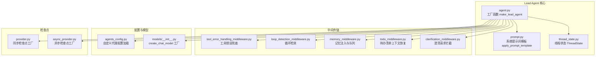
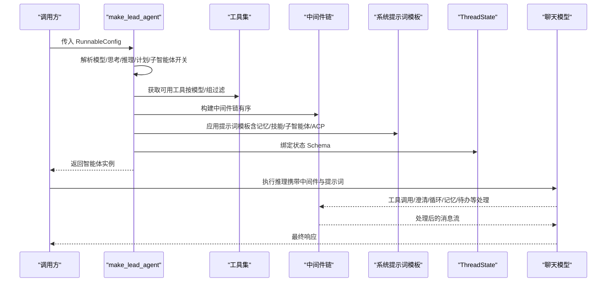
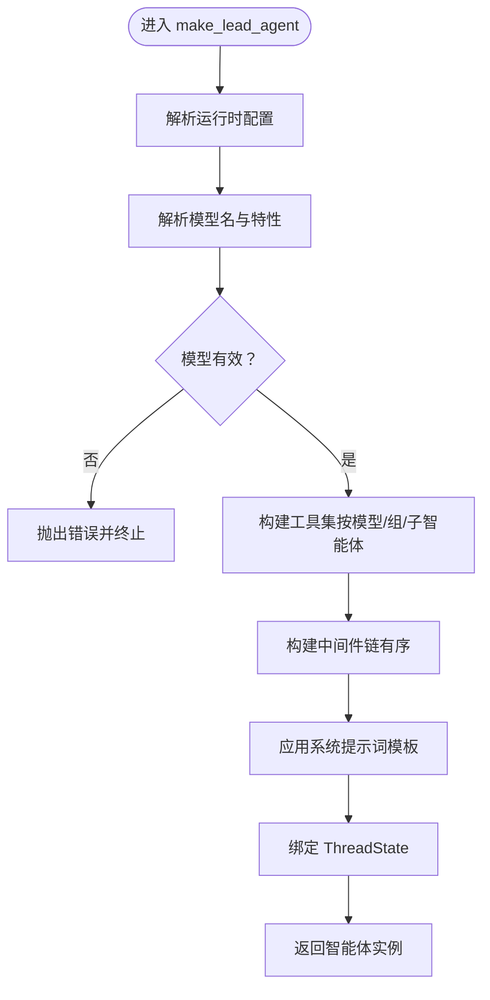
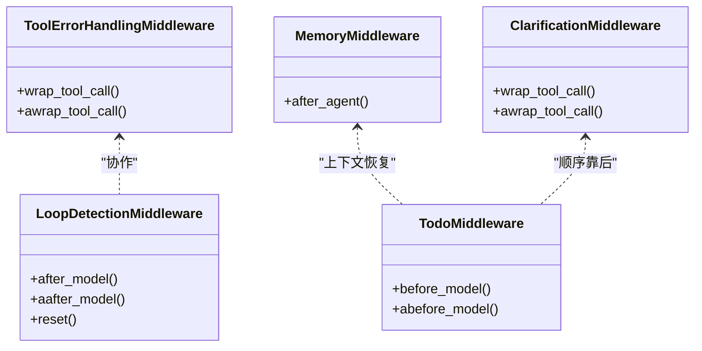
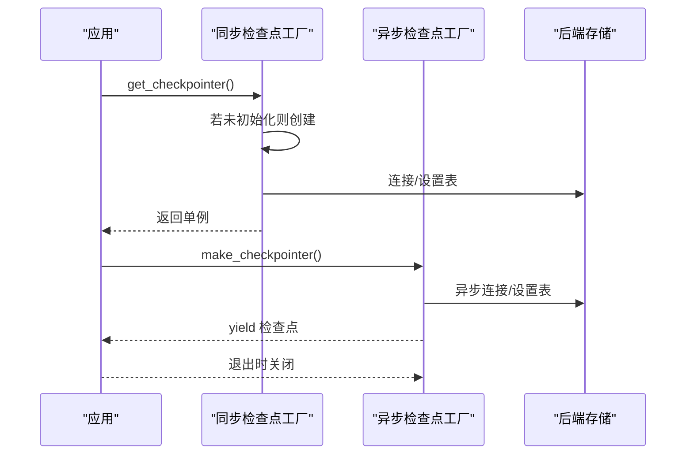
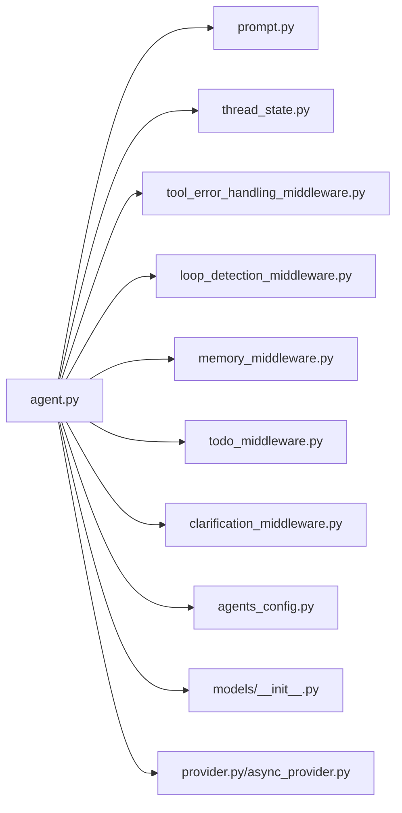

# Lead Agent 主控制器

<cite>
**本文引用的文件**
- [agent.py](file://backend/packages/harness/deerflow/agents/lead_agent/agent.py)
- [prompt.py](file://backend/packages/harness/deerflow/agents/lead_agent/prompt.py)
- [__init__.py](file://backend/packages/harness/deerflow/agents/lead_agent/__init__.py)
- [provider.py](file://backend/packages/harness/deerflow/agents/checkpointer/provider.py)
- [async_provider.py](file://backend/packages/harness/deerflow/agents/checkpointer/async_provider.py)
- [thread_state.py](file://backend/packages/harness/deerflow/agents/thread_state.py)
- [agents_config.py](file://backend/packages/harness/deerflow/config/agents_config.py)
- [models/__init__.py](file://backend/packages/harness/deerflow/models/__init__.py)
- [tool_error_handling_middleware.py](file://backend/packages/harness/deerflow/agents/middlewares/tool_error_handling_middleware.py)
- [clarification_middleware.py](file://backend/packages/harness/deerflow/agents/middlewares/clarification_middleware.py)
- [memory_middleware.py](file://backend/packages/harness/deerflow/agents/middlewares/memory_middleware.py)
- [todo_middleware.py](file://backend/packages/harness/deerflow/agents/middlewares/todo_middleware.py)
- [loop_detection_middleware.py](file://backend/packages/harness/deerflow/agents/middlewares/loop_detection_middleware.py)
</cite>

## 目录
1. [简介](#简介)
2. [项目结构](#项目结构)
3. [核心组件](#核心组件)
4. [架构总览](#架构总览)
5. [详细组件分析](#详细组件分析)
6. [依赖关系分析](#依赖关系分析)
7. [性能与可扩展性](#性能与可扩展性)
8. [故障排查指南](#故障排查指南)
9. [结论](#结论)
10. [附录：配置与使用示例](#附录配置与使用示例)

## 简介
本文件为 DeerFlow Lead Agent 主控制器的权威技术文档。内容覆盖 Lead Agent 的架构设计、核心功能、工作原理与运行时行为；深入解析智能体编排逻辑、决策流程与任务分发机制；详述初始化过程、配置参数与中间件链；并提供提示词工程、检查点机制与异步处理的实现细节。文档同时解释 Lead Agent 如何协调子智能体、管理中间件链与处理异常情况，并给出实际代码路径与配置模板指引。

## 项目结构
Lead Agent 位于后端 harness 包中，围绕“工厂函数 + 提示词模板 + 中间件链 + 检查点”的模式组织，便于按需启用/禁用能力（如计划模式、子智能体并发、记忆注入、工具错误兜底等）。

图表来源
- [agent.py:1-344](file://backend/packages/harness/deerflow/agents/lead_agent/agent.py#L1-L344)
- [prompt.py:1-517](file://backend/packages/harness/deerflow/agents/lead_agent/prompt.py#L1-L517)
- [thread_state.py:1-56](file://backend/packages/harness/deerflow/agents/thread_state.py#L1-L56)
- [tool_error_handling_middleware.py:1-138](file://backend/packages/harness/deerflow/agents/middlewares/tool_error_handling_middleware.py#L1-L138)
- [loop_detection_middleware.py:1-228](file://backend/packages/harness/deerflow/agents/middlewares/loop_detection_middleware.py#L1-L228)
- [memory_middleware.py:1-150](file://backend/packages/harness/deerflow/agents/middlewares/memory_middleware.py#L1-L150)
- [todo_middleware.py:1-101](file://backend/packages/harness/deerflow/agents/middlewares/todo_middleware.py#L1-L101)
- [clarification_middleware.py:1-174](file://backend/packages/harness/deerflow/agents/middlewares/clarification_middleware.py#L1-L174)
- [agents_config.py:1-121](file://backend/packages/harness/deerflow/config/agents_config.py#L1-L121)
- [models/__init__.py:1-4](file://backend/packages/harness/deerflow/models/__init__.py#L1-L4)
- [provider.py:1-204](file://backend/packages/harness/deerflow/agents/checkpointer/provider.py#L1-L204)
- [async_provider.py:1-110](file://backend/packages/harness/deerflow/agents/checkpointer/async_provider.py#L1-L110)

章节来源
- [agent.py:1-344](file://backend/packages/harness/deerflow/agents/lead_agent/agent.py#L1-L344)
- [prompt.py:1-517](file://backend/packages/harness/deerflow/agents/lead_agent/prompt.py#L1-L517)
- [thread_state.py:1-56](file://backend/packages/harness/deerflow/agents/thread_state.py#L1-L56)
- [tool_error_handling_middleware.py:1-138](file://backend/packages/harness/deerflow/agents/middlewares/tool_error_handling_middleware.py#L1-L138)
- [loop_detection_middleware.py:1-228](file://backend/packages/harness/deerflow/agents/middlewares/loop_detection_middleware.py#L1-L228)
- [memory_middleware.py:1-150](file://backend/packages/harness/deerflow/agents/middlewares/memory_middleware.py#L1-L150)
- [todo_middleware.py:1-101](file://backend/packages/harness/deerflow/agents/middlewares/todo_middleware.py#L1-L101)
- [clarification_middleware.py:1-174](file://backend/packages/harness/deerflow/agents/middlewares/clarification_middleware.py#L1-L174)
- [agents_config.py:1-121](file://backend/packages/harness/deerflow/config/agents_config.py#L1-L121)
- [models/__init__.py:1-4](file://backend/packages/harness/deerflow/models/__init__.py#L1-L4)
- [provider.py:1-204](file://backend/packages/harness/deerflow/agents/checkpointer/provider.py#L1-L204)
- [async_provider.py:1-110](file://backend/packages/harness/deerflow/agents/checkpointer/async_provider.py#L1-L110)

## 核心组件
- Lead Agent 工厂函数：负责根据运行时配置解析模型、构建工具集、装配中间件链与系统提示词，并返回可执行的智能体实例。
- 系统提示词模板：动态注入记忆、技能、延迟加载工具、子智能体并发限制与 ACP 代理说明等上下文。
- 线程状态：统一承载沙箱信息、线程数据路径、标题、工件列表、待办清单、上传文件与已查看图像等。
- 中间件链：按严格顺序串联，覆盖工具错误兜底、循环检测、记忆注入、待办上下文恢复、澄清拦截等。
- 检查点：支持内存、SQLite、PostgreSQL 后端，提供同步/异步工厂与上下文管理器，保障长对话可恢复。
- 配置与模型：支持全局模型解析、自定义代理配置（含 SOUL 人格）、工具组过滤与模型特性校验。

章节来源
- [agent.py:268-344](file://backend/packages/harness/deerflow/agents/lead_agent/agent.py#L268-L344)
- [prompt.py:468-517](file://backend/packages/harness/deerflow/agents/lead_agent/prompt.py#L468-L517)
- [thread_state.py:48-56](file://backend/packages/harness/deerflow/agents/thread_state.py#L48-L56)
- [provider.py:114-174](file://backend/packages/harness/deerflow/agents/checkpointer/provider.py#L114-L174)
- [async_provider.py:89-110](file://backend/packages/harness/deerflow/agents/checkpointer/async_provider.py#L89-L110)
- [agents_config.py:27-69](file://backend/packages/harness/deerflow/config/agents_config.py#L27-L69)
- [models/__init__.py:1-4](file://backend/packages/harness/deerflow/models/__init__.py#L1-L4)

## 架构总览
Lead Agent 的运行时由“配置解析 → 模型选择 → 工具集装配 → 中间件链构建 → 系统提示词注入 → 状态 Schema 绑定”构成。其核心是可插拔的中间件链，确保在不同场景下（计划模式、子智能体并发、记忆注入、澄清交互、循环防护）具备一致且可控的行为。

图表来源
- [agent.py:268-344](file://backend/packages/harness/deerflow/agents/lead_agent/agent.py#L268-L344)
- [prompt.py:468-517](file://backend/packages/harness/deerflow/agents/lead_agent/prompt.py#L468-L517)
- [thread_state.py:48-56](file://backend/packages/harness/deerflow/agents/thread_state.py#L48-L56)
- [tool_error_handling_middleware.py:68-138](file://backend/packages/harness/deerflow/agents/middlewares/tool_error_handling_middleware.py#L68-L138)
- [loop_detection_middleware.py:69-228](file://backend/packages/harness/deerflow/agents/middlewares/loop_detection_middleware.py#L69-L228)
- [memory_middleware.py:86-150](file://backend/packages/harness/deerflow/agents/middlewares/memory_middleware.py#L86-L150)
- [todo_middleware.py:47-101](file://backend/packages/harness/deerflow/agents/middlewares/todo_middleware.py#L47-L101)
- [clarification_middleware.py:20-174](file://backend/packages/harness/deerflow/agents/middlewares/clarification_middleware.py#L20-L174)

## 详细组件分析

### Lead Agent 工厂函数：make_lead_agent
- 职责
  - 解析运行时配置（是否启用思考/推理/计划/子智能体、并发上限、引导模式、代理名称等）。
  - 解析模型名与特性（是否支持思考），回退策略与日志提示。
  - 注入运行元数据（用于追踪标签）。
  - 构建工具集（支持按代理工具组过滤与子智能体开关）。
  - 构建中间件链（严格顺序，见下节）。
  - 应用系统提示词模板（动态注入记忆、技能、延迟工具、子智能体并发限制、ACP 说明）。
  - 绑定状态 Schema（ThreadState）。
- 关键流程
  - 模型解析与特性校验（支持思考则启用，否则回退非思考模式）。
  - 计划模式开关与待办中间件注入。
  - 子智能体并发限制中间件注入。
  - 视觉模型检测与图片中间件注入。
  - 循环检测中间件注入。
  - 澄清中间件最后注入。
- 异常与回退
  - 无可用模型时抛出明确错误。
  - 思考模式不被当前模型支持时自动回退。

图表来源
- [agent.py:268-344](file://backend/packages/harness/deerflow/agents/lead_agent/agent.py#L268-L344)

章节来源
- [agent.py:268-344](file://backend/packages/harness/deerflow/agents/lead_agent/agent.py#L268-L344)

### 系统提示词模板：apply_prompt_template
- 动态注入内容
  - 记忆上下文（可选，受配置控制）。
  - 技能列表（按启用状态与容器路径）。
  - 延迟加载工具清单（当工具搜索开启时）。
  - 子智能体并发限制与编排策略（仅在启用子智能体时）。
  - ACP 代理说明（当存在 ACP 配置时）。
  - 当前日期（便于时间敏感任务）。
- 设计要点
  - 将“澄清优先”“技能优先”“子智能体编排”等原则固化到模板中，确保模型遵循一致的工作流。
  - 对引用来源进行格式化约束，保证研究类输出的可溯源性。

章节来源
- [prompt.py:468-517](file://backend/packages/harness/deerflow/agents/lead_agent/prompt.py#L468-L517)
- [prompt.py:339-369](file://backend/packages/harness/deerflow/agents/lead_agent/prompt.py#L339-L369)
- [prompt.py:371-413](file://backend/packages/harness/deerflow/agents/lead_agent/prompt.py#L371-L413)
- [prompt.py:423-446](file://backend/packages/harness/deerflow/agents/lead_agent/prompt.py#L423-L446)
- [prompt.py:448-466](file://backend/packages/harness/deerflow/agents/lead_agent/prompt.py#L448-L466)

### 线程状态：ThreadState
- 字段与语义
  - 沙箱状态：沙箱 ID。
  - 线程数据：工作区/上传/输出路径。
  - 标题：会话标题。
  - 工件列表：去重合并。
  - 待办清单：计划模式下的任务跟踪。
  - 上传文件：用户上传的文件列表。
  - 已查看图像：图像 base64 与 MIME 类型映射。
- 合并与清理
  - 工件列表合并去重。
  - 图像字典合并，空字典表示清空。

章节来源
- [thread_state.py:48-56](file://backend/packages/harness/deerflow/agents/thread_state.py#L48-L56)

### 中间件链：顺序与职责
- 顺序规则（从上到下）
  - 共享基础中间件：线程数据、沙箱、上传、悬空工具调用修复、守卫护栏、工具错误兜底。
  - 可选中间件：摘要中间件（早期减少上下文）、计划模式待办中间件、令牌用量中间件、标题生成、记忆注入、视觉图片注入、延迟工具过滤、子智能体并发限制、循环检测、澄清拦截。
- 关键中间件
  - 工具错误兜底：捕获工具异常并转换为 ToolMessage，保持运行。
  - 循环检测：对相同工具调用集合进行滑动窗口统计，超限时强制停止并产出最终答案。
  - 记忆注入：过滤消息，仅保留用户输入与最终助手回复，异步队列汇总并摘要写入记忆。
  - 待办上下文恢复：当 write_todos 被截断时注入提醒消息，维持计划连续性。
  - 澄清拦截：拦截 ask_clarification 工具调用，中断执行并以命令形式等待用户回复。

图表来源
- [tool_error_handling_middleware.py:19-138](file://backend/packages/harness/deerflow/agents/middlewares/tool_error_handling_middleware.py#L19-L138)
- [loop_detection_middleware.py:69-228](file://backend/packages/harness/deerflow/agents/middlewares/loop_detection_middleware.py#L69-L228)
- [memory_middleware.py:86-150](file://backend/packages/harness/deerflow/agents/middlewares/memory_middleware.py#L86-L150)
- [todo_middleware.py:47-101](file://backend/packages/harness/deerflow/agents/middlewares/todo_middleware.py#L47-L101)
- [clarification_middleware.py:20-174](file://backend/packages/harness/deerflow/agents/middlewares/clarification_middleware.py#L20-L174)

章节来源
- [agent.py:208-265](file://backend/packages/harness/deerflow/agents/lead_agent/agent.py#L208-L265)
- [tool_error_handling_middleware.py:68-138](file://backend/packages/harness/deerflow/agents/middlewares/tool_error_handling_middleware.py#L68-L138)
- [loop_detection_middleware.py:69-228](file://backend/packages/harness/deerflow/agents/middlewares/loop_detection_middleware.py#L69-L228)
- [memory_middleware.py:86-150](file://backend/packages/harness/deerflow/agents/middlewares/memory_middleware.py#L86-L150)
- [todo_middleware.py:47-101](file://backend/packages/harness/deerflow/agents/middlewares/todo_middleware.py#L47-L101)
- [clarification_middleware.py:20-174](file://backend/packages/harness/deerflow/agents/middlewares/clarification_middleware.py#L20-L174)

### 检查点机制：同步与异步
- 同步工厂
  - 单例模式：首次调用创建并缓存，后续复用；支持重置。
  - 支持内存、SQLite、PostgreSQL 三种后端；SQLite/PG 缺包或连接字符串缺失时抛出明确错误。
- 异步工厂
  - 异步上下文管理器：生命周期内打开/关闭资源，适合长连接服务。
- 使用建议
  - 后台脚本/CLI 使用同步单例；Web 服务在 lifespan 中注入异步检查点。

图表来源
- [provider.py:114-174](file://backend/packages/harness/deerflow/agents/checkpointer/provider.py#L114-L174)
- [provider.py:181-204](file://backend/packages/harness/deerflow/agents/checkpointer/provider.py#L181-L204)
- [async_provider.py:89-110](file://backend/packages/harness/deerflow/agents/checkpointer/async_provider.py#L89-L110)

章节来源
- [provider.py:114-174](file://backend/packages/harness/deerflow/agents/checkpointer/provider.py#L114-L174)
- [provider.py:181-204](file://backend/packages/harness/deerflow/agents/checkpointer/provider.py#L181-L204)
- [async_provider.py:89-110](file://backend/packages/harness/deerflow/agents/checkpointer/async_provider.py#L89-L110)

### 模型与配置
- 模型解析
  - 优先级：请求指定模型 → 自定义代理配置模型 → 全局默认模型。
  - 特性校验：若启用思考但模型不支持，则回退非思考模式并记录警告。
- 自定义代理配置
  - 支持读取代理目录下的 config.yaml 与 SOUL.md，注入到系统提示词。
  - 列举所有自定义代理，用于路由与展示。

章节来源
- [agent.py:26-38](file://backend/packages/harness/deerflow/agents/lead_agent/agent.py#L26-L38)
- [agent.py:284-286](file://backend/packages/harness/deerflow/agents/lead_agent/agent.py#L284-L286)
- [agents_config.py:27-69](file://backend/packages/harness/deerflow/config/agents_config.py#L27-L69)
- [agents_config.py:72-89](file://backend/packages/harness/deerflow/config/agents_config.py#L72-L89)

## 依赖关系分析
- 组件耦合
  - Lead Agent 工厂函数对配置、模型工厂、工具集、中间件与提示词模板存在直接依赖。
  - 中间件之间通过消息流与状态 Schema 协作，避免强耦合。
- 外部依赖
  - LangChain/LangGraph 的 AgentState、中间件接口、检查点接口。
  - 配置模块提供模型、记忆、工具搜索、守卫护栏等配置读取。
- 潜在风险
  - 中间件顺序不当可能导致上下文丢失或循环无法检测。
  - 模型特性与配置不匹配可能引发回退或异常。

图表来源
- [agent.py:1-344](file://backend/packages/harness/deerflow/agents/lead_agent/agent.py#L1-L344)
- [prompt.py:1-517](file://backend/packages/harness/deerflow/agents/lead_agent/prompt.py#L1-L517)
- [thread_state.py:1-56](file://backend/packages/harness/deerflow/agents/thread_state.py#L1-L56)
- [tool_error_handling_middleware.py:1-138](file://backend/packages/harness/deerflow/agents/middlewares/tool_error_handling_middleware.py#L1-L138)
- [loop_detection_middleware.py:1-228](file://backend/packages/harness/deerflow/agents/middlewares/loop_detection_middleware.py#L1-L228)
- [memory_middleware.py:1-150](file://backend/packages/harness/deerflow/agents/middlewares/memory_middleware.py#L1-L150)
- [todo_middleware.py:1-101](file://backend/packages/harness/deerflow/agents/middlewares/todo_middleware.py#L1-L101)
- [clarification_middleware.py:1-174](file://backend/packages/harness/deerflow/agents/middlewares/clarification_middleware.py#L1-L174)
- [agents_config.py:1-121](file://backend/packages/harness/deerflow/config/agents_config.py#L1-L121)
- [models/__init__.py:1-4](file://backend/packages/harness/deerflow/models/__init__.py#L1-L4)
- [provider.py:1-204](file://backend/packages/harness/deerflow/agents/checkpointer/provider.py#L1-L204)
- [async_provider.py:1-110](file://backend/packages/harness/deerflow/agents/checkpointer/async_provider.py#L1-L110)

## 性能与可扩展性
- 上下文压缩
  - 可选摘要中间件在早期阶段对历史进行压缩，降低后续推理成本。
- 并发与批处理
  - 子智能体并发限制防止一次性过多并行任务导致资源争用；建议结合批处理策略。
- 记忆异步更新
  - 记忆注入采用队列与去抖动策略，批量更新，避免频繁 I/O。
- 模型选择
  - 摘要中间件可使用轻量模型以降低成本；主推理仍使用高性能模型。

[本节为通用指导，无需列出章节来源]

## 故障排查指南
- “无可用模型”
  - 现象：启动时报错，提示未配置任何聊天模型。
  - 排查：确认 config.yaml 中至少配置一个模型；或在请求中提供有效的 model_name/model。
  - 参考路径：[agent.py:294-296](file://backend/packages/harness/deerflow/agents/lead_agent/agent.py#L294-L296)
- “思考模式回退”
  - 现象：启用 thinking_enabled 但模型不支持思考，自动回退为非思考模式。
  - 排查：检查模型配置的 supports_thinking；必要时关闭思考或更换模型。
  - 参考路径：[agent.py:296-298](file://backend/packages/harness/deerflow/agents/lead_agent/agent.py#L296-L298)
- “工具调用异常”
  - 现象：工具执行失败导致中断。
  - 排查：查看工具错误中间件的日志；确认工具参数与权限；必要时增加重试或降级方案。
  - 参考路径：[tool_error_handling_middleware.py:19-66](file://backend/packages/harness/deerflow/agents/middlewares/tool_error_handling_middleware.py#L19-L66)
- “重复工具调用循环”
  - 现象：模型陷入重复调用同一工具。
  - 排查：查看循环检测中间件日志；适当提高硬限制或优化任务分解。
  - 参考路径：[loop_detection_middleware.py:69-228](file://backend/packages/harness/deerflow/agents/middlewares/loop_detection_middleware.py#L69-L228)
- “记忆未更新”
  - 现象：会话结束后记忆未生效。
  - 排查：确认记忆中间件已启用；检查队列是否正常；核对线程 ID 是否正确。
  - 参考路径：[memory_middleware.py:86-150](file://backend/packages/harness/deerflow/agents/middlewares/memory_middleware.py#L86-L150)
- “待办上下文丢失”
  - 现象：摘要中间件截断后，write_todos 不可见。
  - 排查：确认待办中间件已启用；检查消息历史是否被截断。
  - 参考路径：[todo_middleware.py:47-101](file://backend/packages/harness/deerflow/agents/middlewares/todo_middleware.py#L47-L101)
- “澄清请求未触发”
  - 现象：模型调用 ask_clarification 但前端未显示。
  - 排查：确认澄清中间件顺序正确；检查命令返回是否到达 END。
  - 参考路径：[clarification_middleware.py:20-174](file://backend/packages/harness/deerflow/agents/middlewares/clarification_middleware.py#L20-L174)

章节来源
- [agent.py:294-298](file://backend/packages/harness/deerflow/agents/lead_agent/agent.py#L294-L298)
- [tool_error_handling_middleware.py:19-66](file://backend/packages/harness/deerflow/agents/middlewares/tool_error_handling_middleware.py#L19-L66)
- [loop_detection_middleware.py:69-228](file://backend/packages/harness/deerflow/agents/middlewares/loop_detection_middleware.py#L69-L228)
- [memory_middleware.py:86-150](file://backend/packages/harness/deerflow/agents/middlewares/memory_middleware.py#L86-L150)
- [todo_middleware.py:47-101](file://backend/packages/harness/deerflow/agents/middlewares/todo_middleware.py#L47-L101)
- [clarification_middleware.py:20-174](file://backend/packages/harness/deerflow/agents/middlewares/clarification_middleware.py#L20-L174)

## 结论
Lead Agent 主控制器通过“可插拔中间件链 + 动态提示词模板 + 状态 Schema + 检查点”的架构，在保证安全性与可控性的同时，提供了强大的编排能力。其设计强调：
- 明确的顺序与职责边界，确保关键安全与质量控制点不被绕过；
- 可配置的计划模式与子智能体并发策略，满足复杂任务的并行分解与合成；
- 完备的记忆与澄清机制，提升长期交互体验；
- 清晰的错误兜底与循环检测，增强鲁棒性；
- 支持多后端检查点，兼顾开发与生产部署需求。

[本节为总结，无需列出章节来源]

## 附录：配置与使用示例

### 配置模板（关键字段）
- 运行时配置（RunnableConfig.configurable）
  - thinking_enabled：是否启用思考模式（布尔，默认启用）。
  - reasoning_effort：推理强度（可选）。
  - model_name/model：请求级模型覆盖。
  - is_plan_mode：是否启用计划模式（布尔）。
  - subagent_enabled：是否启用子智能体（布尔）。
  - max_concurrent_subagents：每轮最大子智能体并发数（整数，默认值见实现）。
  - is_bootstrap：是否为引导模式（布尔）。
  - agent_name：代理名称（用于加载自定义配置与记忆）。
- 模型配置（config.yaml）
  - 至少配置一个模型；支持特性标志（如 supports_thinking/supports_vision）。
- 记忆配置（config.yaml）
  - enabled/injection_enabled/max_injection_tokens 等。
- 工具搜索配置（config.yaml）
  - tool_search.enabled 控制延迟工具注册与检索。
- 守卫护栏配置（config.yaml）
  - enabled/provider/passport/fail_closed 等。
- 检查点配置（config.yaml）
  - type（memory/sqlite/postgres）、connection_string 等。

章节来源
- [agent.py:273-282](file://backend/packages/harness/deerflow/agents/lead_agent/agent.py#L273-L282)
- [agent.py:291-295](file://backend/packages/harness/deerflow/agents/lead_agent/agent.py#L291-L295)
- [prompt.py:468-517](file://backend/packages/harness/deerflow/agents/lead_agent/prompt.py#L468-L517)
- [provider.py:114-174](file://backend/packages/harness/deerflow/agents/checkpointer/provider.py#L114-L174)
- [async_provider.py:89-110](file://backend/packages/harness/deerflow/agents/checkpointer/async_provider.py#L89-L110)

### 初始化与运行示例（路径指引）
- 创建 Lead Agent 实例
  - 示例路径：[agent.py:268-344](file://backend/packages/harness/deerflow/agents/lead_agent/agent.py#L268-L344)
- 应用系统提示词
  - 示例路径：[prompt.py:468-517](file://backend/packages/harness/deerflow/agents/lead_agent/prompt.py#L468-L517)
- 绑定线程状态
  - 示例路径：[thread_state.py:48-56](file://backend/packages/harness/deerflow/agents/thread_state.py#L48-L56)
- 启用计划模式
  - 示例路径：[agent.py:226-229](file://backend/packages/harness/deerflow/agents/lead_agent/agent.py#L226-L229)
- 启用子智能体并发
  - 示例路径：[agent.py:255-258](file://backend/packages/harness/deerflow/agents/lead_agent/agent.py#L255-L258)
- 注入记忆与摘要
  - 示例路径：[memory_middleware.py:86-150](file://backend/packages/harness/deerflow/agents/middlewares/memory_middleware.py#L86-L150)
- 工具错误兜底
  - 示例路径：[tool_error_handling_middleware.py:19-66](file://backend/packages/harness/deerflow/agents/middlewares/tool_error_handling_middleware.py#L19-L66)
- 循环检测
  - 示例路径：[loop_detection_middleware.py:69-228](file://backend/packages/harness/deerflow/agents/middlewares/loop_detection_middleware.py#L69-L228)
- 澄清拦截
  - 示例路径：[clarification_middleware.py:20-174](file://backend/packages/harness/deerflow/agents/middlewares/clarification_middleware.py#L20-L174)
- 同步检查点
  - 示例路径：[provider.py:114-174](file://backend/packages/harness/deerflow/agents/checkpointer/provider.py#L114-L174)
- 异步检查点
  - 示例路径：[async_provider.py:89-110](file://backend/packages/harness/deerflow/agents/checkpointer/async_provider.py#L89-L110)