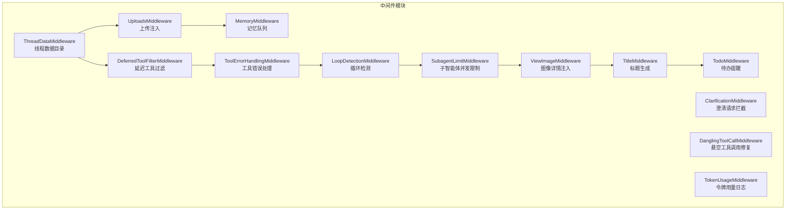
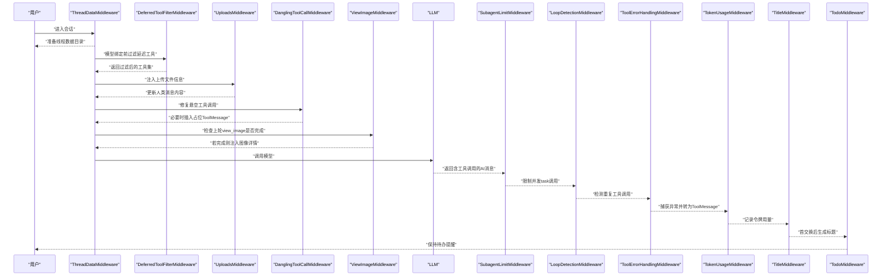
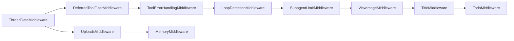

# 中间件链系统

<cite>
**本文引用的文件**
- [memory_middleware.py](file://backend/packages/harness/deerflow/agents/middlewares/memory_middleware.py)
- [tool_error_handling_middleware.py](file://backend/packages/harness/deerflow/agents/middlewares/tool_error_handling_middleware.py)
- [loop_detection_middleware.py](file://backend/packages/harness/deerflow/agents/middlewares/loop_detection_middleware.py)
- [uploads_middleware.py](file://backend/packages/harness/deerflow/agents/middlewares/uploads_middleware.py)
- [title_middleware.py](file://backend/packages/harness/deerflow/agents/middlewares/title_middleware.py)
- [todo_middleware.py](file://backend/packages/harness/deerflow/agents/middlewares/todo_middleware.py)
- [clarification_middleware.py](file://backend/packages/harness/deerflow/agents/middlewares/clarification_middleware.py)
- [dangling_tool_call_middleware.py](file://backend/packages/harness/deerflow/agents/middlewares/dangling_tool_call_middleware.py)
- [thread_data_middleware.py](file://backend/packages/harness/deerflow/agents/middlewares/thread_data_middleware.py)
- [subagent_limit_middleware.py](file://backend/packages/harness/deerflow/agents/middlewares/subagent_limit_middleware.py)
- [deferred_tool_filter_middleware.py](file://backend/packages/harness/deerflow/agents/middlewares/deferred_tool_filter_middleware.py)
- [token_usage_middleware.py](file://backend/packages/harness/deerflow/agents/middlewares/token_usage_middleware.py)
- [view_image_middleware.py](file://backend/packages/harness/deerflow/agents/middlewares/view_image_middleware.py)
</cite>

## 目录
1. [引言](#引言)
2. [项目结构](#项目结构)
3. [核心组件](#核心组件)
4. [架构总览](#架构总览)
5. [详细组件分析](#详细组件分析)
6. [依赖关系分析](#依赖关系分析)
7. [性能考量](#性能考量)
8. [故障排查指南](#故障排查指南)
9. [结论](#结论)
10. [附录](#附录)

## 引言
本文件面向 DeerFlow 的中间件链系统，系统性阐述中间件架构设计、执行顺序与链式调用机制；深入解析各类内置中间件的功能、实现原理与配置要点；并提供中间件开发指南、自定义中间件创建流程与性能优化建议。重点覆盖：内存中间件、工具错误处理、循环检测、上传处理、标题生成、待办事项、澄清请求、工具过滤、子智能体限制、线程数据、令牌使用与图像查看等中间件。

## 项目结构
中间件位于后端 harness 包下的 agents.middlewares 模块，围绕 LangGraph AgentMiddleware 接口构建，通过 before_agent/after_agent/before_model/after_model 等生命周期钩子参与执行流。部分中间件依赖全局配置（如内存、标题、令牌用量）与路径管理（线程数据目录），部分中间件负责消息历史修复与安全防护（如悬空工具调用、循环检测）。

图表来源
- [memory_middleware.py:86-150](file://backend/packages/harness/deerflow/agents/middlewares/memory_middleware.py#L86-L150)
- [tool_error_handling_middleware.py:68-138](file://backend/packages/harness/deerflow/agents/middlewares/tool_error_handling_middleware.py#L68-L138)
- [loop_detection_middleware.py:69-228](file://backend/packages/harness/deerflow/agents/middlewares/loop_detection_middleware.py#L69-L228)
- [uploads_middleware.py:23-205](file://backend/packages/harness/deerflow/agents/middlewares/uploads_middleware.py#L23-L205)
- [title_middleware.py:22-150](file://backend/packages/harness/deerflow/agents/middlewares/title_middleware.py#L22-L150)
- [todo_middleware.py:47-101](file://backend/packages/harness/deerflow/agents/middlewares/todo_middleware.py#L47-L101)
- [clarification_middleware.py:20-174](file://backend/packages/harness/deerflow/agents/middlewares/clarification_middleware.py#L20-L174)
- [dangling_tool_call_middleware.py:28-111](file://backend/packages/harness/deerflow/agents/middlewares/dangling_tool_call_middleware.py#L28-L111)
- [thread_data_middleware.py:18-97](file://backend/packages/harness/deerflow/agents/middlewares/thread_data_middleware.py#L18-L97)
- [subagent_limit_middleware.py:24-76](file://backend/packages/harness/deerflow/agents/middlewares/subagent_limit_middleware.py#L24-L76)
- [deferred_tool_filter_middleware.py:23-61](file://backend/packages/harness/deerflow/agents/middlewares/deferred_tool_filter_middleware.py#L23-L61)
- [token_usage_middleware.py:13-38](file://backend/packages/harness/deerflow/agents/middlewares/token_usage_middleware.py#L13-L38)
- [view_image_middleware.py:19-222](file://backend/packages/harness/deerflow/agents/middlewares/view_image_middleware.py#L19-L222)

章节来源
- [tool_error_handling_middleware.py:68-138](file://backend/packages/harness/deerflow/agents/middlewares/tool_error_handling_middleware.py#L68-L138)

## 核心组件
- 执行阶段与钩子
  - before_agent：在代理执行前注入上下文（如线程数据目录、上传信息、图像详情等）
  - after_agent：在代理执行后进行收尾（如记忆队列入队）
  - before_model：在模型调用前修正消息（如悬空工具调用修复、延迟工具过滤、图像详情注入）
  - after_model：在模型返回后进行处理（如循环检测、子智能体并发限制、令牌用量日志、标题生成）
  - wrap_tool_call/awrap_tool_call：拦截工具调用（同步/异步），用于错误转换或澄清请求中断
  - wrap_model_call/awrap_model_call：拦截模型调用，用于消息修正（如悬空工具调用修复、延迟工具过滤）

- 中间件链构建
  - 共享运行时中间件工厂：根据是否包含上传与悬空工具调用修复，动态组装基础中间件列表，并可选加入守卫（Guardrail）与工具错误处理中间件。

章节来源
- [tool_error_handling_middleware.py:68-138](file://backend/packages/harness/deerflow/agents/middlewares/tool_error_handling_middleware.py#L68-L138)

## 架构总览
下图展示典型一次对话的中间件链执行顺序与关键决策点：

图表来源
- [thread_data_middleware.py:74-97](file://backend/packages/harness/deerflow/agents/middlewares/thread_data_middleware.py#L74-L97)
- [deferred_tool_filter_middleware.py:31-61](file://backend/packages/harness/deerflow/agents/middlewares/deferred_tool_filter_middleware.py#L31-L61)
- [uploads_middleware.py:119-205](file://backend/packages/harness/deerflow/agents/middlewares/uploads_middleware.py#L119-L205)
- [dangling_tool_call_middleware.py:36-111](file://backend/packages/harness/deerflow/agents/middlewares/dangling_tool_call_middleware.py#L36-L111)
- [view_image_middleware.py:166-222](file://backend/packages/harness/deerflow/agents/middlewares/view_image_middleware.py#L166-L222)
- [subagent_limit_middleware.py:40-76](file://backend/packages/harness/deerflow/agents/middlewares/subagent_limit_middleware.py#L40-L76)
- [loop_detection_middleware.py:185-218](file://backend/packages/harness/deerflow/agents/middlewares/loop_detection_middleware.py#L185-L218)
- [tool_error_handling_middleware.py:19-66](file://backend/packages/harness/deerflow/agents/middlewares/tool_error_handling_middleware.py#L19-L66)
- [token_usage_middleware.py:16-38](file://backend/packages/harness/deerflow/agents/middlewares/token_usage_middleware.py#L16-L38)
- [title_middleware.py:103-150](file://backend/packages/harness/deerflow/agents/middlewares/title_middleware.py#L103-L150)
- [todo_middleware.py:56-101](file://backend/packages/harness/deerflow/agents/middlewares/todo_middleware.py#L56-L101)

## 详细组件分析

### 内存中间件（MemoryMiddleware）
- 职责
  - 在代理执行后，将对话历史过滤后入队至记忆队列，异步进行摘要与存储。
  - 过滤规则：仅保留用户输入与最终 AI 响应，剔除工具消息、带工具调用的中间 AI 消息以及上传注入块。
- 关键点
  - 从运行时上下文提取 thread_id，校验启用状态与消息存在性。
  - 使用滑动窗口与去重策略避免重复入队。
- 性能与可靠性
  - 队列去抖动批处理，降低频繁写入开销。
  - 对上传注入块进行清理，避免会话级临时路径进入长期记忆。

章节来源
- [memory_middleware.py:14-150](file://backend/packages/harness/deerflow/agents/middlewares/memory_middleware.py#L14-L150)

### 工具错误处理中间件（ToolErrorHandlingMiddleware）
- 职责
  - 将工具执行异常转换为 ToolMessage，使运行继续；对 GraphBubbleUp 控制信号透传。
  - 提供同步/异步 wrap_tool_call 实现，统一错误消息格式与长度截断。
- 运行时装配
  - _build_runtime_middlewares：按需插入 ThreadDataMiddleware、SandboxMiddleware、UploadsMiddleware、DanglingToolCallMiddleware、GuardrailMiddleware（可选）、ToolErrorHandlingMiddleware。
- 安全与可观测性
  - 记录失败工具名称与 ID，便于定位问题。

章节来源
- [tool_error_handling_middleware.py:19-138](file://backend/packages/harness/deerflow/agents/middlewares/tool_error_handling_middleware.py#L19-L138)

### 循环检测中间件（LoopDetectionMiddleware）
- 职责
  - 检测同一工具调用集合在滑动窗口内的重复次数，超过阈值时：
    - 达到警告阈值：注入“重复提示”消息；
    - 达到硬上限：清空工具调用并强制输出文本。
- 算法与数据结构
  - 工具调用哈希（名称+参数标准化排序）作为键，支持多线程 LRU 追踪。
  - 线程级历史窗口维护，超限自动驱逐。
- 可配置项
  - 警告阈值、硬上限、窗口大小、最大追踪线程数。

章节来源
- [loop_detection_middleware.py:36-228](file://backend/packages/harness/deerflow/agents/middlewares/loop_detection_middleware.py#L36-L228)

### 上传处理中间件（UploadsMiddleware）
- 职责
  - 在人类消息中注入当前轮次上传文件清单与历史可用文件清单，形成 <uploaded_files> 上下文块。
  - 支持对虚拟路径与文件存在性校验，确保只注入有效文件。
- 输出
  - 更新最后一条人类消息的内容，保留原始 additional_kwargs（含文件元数据）以便前端读取。

章节来源
- [uploads_middleware.py:23-205](file://backend/packages/harness/deerflow/agents/middlewares/uploads_middleware.py#L23-L205)

### 标题生成中间件（TitleMiddleware）
- 触发条件
  - 配置启用、线程尚未有标题、且已发生首次完整的人机交换（至少一个用户消息与若干 AI 响应）。
- 流程
  - 构造提示词模板，截断用户/助手消息片段；
  - 同步/异步调用模型生成标题，解析并回退到用户消息前缀。
- 可配置项
  - 模型名、最大词数、最大字符数、提示模板。

章节来源
- [title_middleware.py:22-150](file://backend/packages/harness/deerflow/agents/middlewares/title_middleware.py#L22-L150)

### 待办事项中间件（TodoMiddleware）
- 背景
  - 当消息历史被压缩（如摘要）导致原始 write_todos 工具调用与 ToolMessage 失去可见性时，模型会丢失待办状态。
- 处理
  - 在模型前检查：若待办存在但上下文中缺失 write_todos，且未注入过提醒，则注入一条 HumanMessage 作为系统提醒，持续跟踪进度。

章节来源
- [todo_middleware.py:47-101](file://backend/packages/harness/deerflow/agents/middlewares/todo_middleware.py#L47-L101)

### 澄清请求中间件（ClarificationMiddleware）
- 职责
  - 拦截 ask_clarification 工具调用，将其转换为用户友好的消息并中断执行，等待用户响应后再继续。
- 表达
  - 根据类型选择图标与格式化文本，支持选项列表展示。
- 交互
  - 返回 Command 并指向结束节点，由前端识别并展示澄清消息。

章节来源
- [clarification_middleware.py:20-174](file://backend/packages/harness/deerflow/agents/middlewares/clarification_middleware.py#L20-L174)

### 悬空工具调用修复中间件（DanglingToolCallMiddleware）
- 场景
  - AIMessage 含有 tool_calls，但历史中缺少对应 ToolMessage（如用户中断或请求取消）。
- 处理
  - 在模型调用前扫描消息，为每个缺失的 ToolMessage 插入占位错误响应，保证消息顺序正确。
- 时机
  - 使用 wrap_model_call 而非 before_model，确保修补位置在 AIMessage 之后而非末尾。

章节来源
- [dangling_tool_call_middleware.py:28-111](file://backend/packages/harness/deerflow/agents/middlewares/dangling_tool_call_middleware.py#L28-L111)

### 线程数据中间件（ThreadDataMiddleware）
- 职责
  - 为每次线程执行创建/计算工作空间、上传与输出目录路径；支持惰性初始化以减少 IO 开销。
- 生命周期
  - before_agent：解析 thread_id，按懒加载策略返回路径字典。

章节来源
- [thread_data_middleware.py:18-97](file://backend/packages/harness/deerflow/agents/middlewares/thread_data_middleware.py#L18-L97)

### 子智能体并发限制中间件（SubagentLimitMiddleware）
- 背景
  - LLM 可能在单次响应中生成多个并行 task 工具调用，超出系统承载能力。
- 处理
  - 统计 task 工具调用数量，超过上限时截断多余调用，保留前 N 个。

章节来源
- [subagent_limit_middleware.py:24-76](file://backend/packages/harness/deerflow/agents/middlewares/subagent_limit_middleware.py#L24-L76)

### 延迟工具过滤中间件（DeferredToolFilterMiddleware）
- 背景
  - 启用 tool_search 时，MCP 工具注册于延迟注册表，不应随模型绑定发送给 LLM，以节省上下文。
- 处理
  - 在模型调用前移除延迟工具 schema，仅保留活跃工具 schema，同时保留路由执行能力。

章节来源
- [deferred_tool_filter_middleware.py:23-61](file://backend/packages/harness/deerflow/agents/middlewares/deferred_tool_filter_middleware.py#L23-L61)

### 令牌使用中间件（TokenUsageMiddleware）
- 职责
  - 从模型响应的 usage_metadata 中提取输入/输出/总计令牌数并记录日志。

章节来源
- [token_usage_middleware.py:13-38](file://backend/packages/harness/deerflow/agents/middlewares/token_usage_middleware.py#L13-L38)

### 图像查看中间件（ViewImageMiddleware）
- 职责
  - 在模型调用前检查上一轮 AI 是否调用了 view_image 且已完成（具备对应 ToolMessage），若满足条件则注入一条包含图像详情与 base64 数据的人类消息，使 LLM 能直接分析图像。
- 防重复
  - 若已存在图像详情消息则不再重复注入。

章节来源
- [view_image_middleware.py:19-222](file://backend/packages/harness/deerflow/agents/middlewares/view_image_middleware.py#L19-L222)

## 依赖关系分析
- 组件耦合
  - ThreadDataMiddleware 为多数中间件提供路径与目录准备，是链路前置依赖。
  - DeferredToolFilterMiddleware 与 ToolErrorHandlingMiddleware 共同影响模型绑定与工具执行安全。
  - DanglingToolCallMiddleware 与 LoopDetectionMiddleware 分别在模型前后修正消息完整性与行为稳定性。
  - SubagentLimitMiddleware 与 ViewImageMiddleware 影响后续阶段的消息形态与标题生成时机。
- 外部依赖
  - 配置模块（内存、标题、令牌用量等）与路径模块（Threads 目录结构）贯穿多个中间件。
  - LangGraph AgentMiddleware 接口与消息类型（AIMessage/HumanMessage/ToolMessage）。

图表来源
- [thread_data_middleware.py:74-97](file://backend/packages/harness/deerflow/agents/middlewares/thread_data_middleware.py#L74-L97)
- [deferred_tool_filter_middleware.py:31-61](file://backend/packages/harness/deerflow/agents/middlewares/deferred_tool_filter_middleware.py#L31-L61)
- [uploads_middleware.py:119-205](file://backend/packages/harness/deerflow/agents/middlewares/uploads_middleware.py#L119-L205)
- [memory_middleware.py:108-150](file://backend/packages/harness/deerflow/agents/middlewares/memory_middleware.py#L108-L150)
- [tool_error_handling_middleware.py:19-66](file://backend/packages/harness/deerflow/agents/middlewares/tool_error_handling_middleware.py#L19-L66)
- [loop_detection_middleware.py:185-218](file://backend/packages/harness/deerflow/agents/middlewares/loop_detection_middleware.py#L185-L218)
- [subagent_limit_middleware.py:40-76](file://backend/packages/harness/deerflow/agents/middlewares/subagent_limit_middleware.py#L40-L76)
- [view_image_middleware.py:166-222](file://backend/packages/harness/deerflow/agents/middlewares/view_image_middleware.py#L166-L222)
- [title_middleware.py:103-150](file://backend/packages/harness/deerflow/agents/middlewares/title_middleware.py#L103-L150)
- [todo_middleware.py:56-101](file://backend/packages/harness/deerflow/agents/middlewares/todo_middleware.py#L56-L101)

## 性能考量
- 惰性初始化
  - ThreadDataMiddleware 默认惰性创建目录，减少不必要的 IO；可在需要时切换为急切初始化。
- 消息过滤与去抖
  - MemoryMiddleware 过滤非关键消息并批量入队，降低写放大。
  - LoopDetectionMiddleware 使用滑动窗口与 LRU，控制追踪规模。
- 工具绑定优化
  - DeferredToolFilterMiddleware 仅向模型暴露活跃工具 schema，显著节省上下文。
- 并发限制
  - SubagentLimitMiddleware 限制 task 并发，避免资源争用与超载。
- 日志与可观测性
  - TokenUsageMiddleware 提供细粒度令牌统计，便于成本控制与调优。

## 故障排查指南
- 工具错误
  - 现象：工具调用抛出异常导致中断。
  - 处理：确认 ToolErrorHandlingMiddleware 已启用；检查日志中的工具名称与 ID；必要时增加降级提示。
- 悬空工具调用
  - 现象：AIMessage 含 tool_calls 但无对应 ToolMessage。
  - 处理：启用 DanglingToolCallMiddleware；检查用户中断或网络异常导致的请求取消。
- 循环调用
  - 现象：模型反复调用相同工具且无进展。
  - 处理：调整 LoopDetectionMiddleware 阈值；检查提示词引导与工具设计。
- 上传文件不可见
  - 现象：模型无法读取上传文件。
  - 处理：确认 UploadsMiddleware 注入成功；检查文件路径与存在性；核对 additional_kwargs 传递。
- 标题未生成
  - 现象：首交换后未出现自动标题。
  - 处理：检查 TitleMiddleware 配置与触发条件；确认模型响应包含内容。
- 待办丢失
  - 现象：摘要后模型忘记待办状态。
  - 处理：启用 TodoMiddleware；确保未重复注入提醒消息。
- 图像未分析
  - 现象：view_image 工具完成后 LLM 仍无法看到图像。
  - 处理：确认 ViewImageMiddleware 注入逻辑；检查 ToolMessage 是否全部到达。

章节来源
- [tool_error_handling_middleware.py:19-66](file://backend/packages/harness/deerflow/agents/middlewares/tool_error_handling_middleware.py#L19-L66)
- [dangling_tool_call_middleware.py:36-111](file://backend/packages/harness/deerflow/agents/middlewares/dangling_tool_call_middleware.py#L36-L111)
- [loop_detection_middleware.py:185-218](file://backend/packages/harness/deerflow/agents/middlewares/loop_detection_middleware.py#L185-L218)
- [uploads_middleware.py:119-205](file://backend/packages/harness/deerflow/agents/middlewares/uploads_middleware.py#L119-L205)
- [title_middleware.py:103-150](file://backend/packages/harness/deerflow/agents/middlewares/title_middleware.py#L103-L150)
- [todo_middleware.py:56-101](file://backend/packages/harness/deerflow/agents/middlewares/todo_middleware.py#L56-L101)
- [view_image_middleware.py:166-222](file://backend/packages/harness/deerflow/agents/middlewares/view_image_middleware.py#L166-L222)

## 结论
DeerFlow 中间件链通过明确的生命周期钩子与可插拔设计，实现了从上下文准备、消息修复、安全防护到结果增强的全链路治理。合理配置与组合中间件，可在保障稳定性的同时提升性能与用户体验。建议优先启用 ThreadDataMiddleware、DeferredToolFilterMiddleware、DanglingToolCallMiddleware、ToolErrorHandlingMiddleware、LoopDetectionMiddleware 与 SubagentLimitMiddleware，并结合 TokenUsageMiddleware 进行成本监控。

## 附录
- 自定义中间件开发步骤
  - 选择合适的钩子：需要在代理执行前注入上下文用 before_agent；需要在模型调用前修正消息用 before_model 或 wrap_model_call；需要拦截工具调用用 wrap_tool_call；需要在代理后处理用 after_agent/after_model。
  - 设计状态扩展：如需在状态中携带额外字段，参考现有 State 类型（如 UploadsMiddlewareState、ThreadDataMiddlewareState、ViewImageMiddlewareState）。
  - 依赖注入：通过全局配置与路径模块获取运行时信息；避免硬编码路径与阈值。
  - 错误与日志：对异常进行捕获与记录；对外部服务调用增加超时与重试策略。
  - 性能与并发：避免阻塞操作；对批量任务采用异步与去抖策略；控制追踪规模与缓存命中率。
- 中间件链建议
  - 前置：ThreadDataMiddleware → DeferredToolFilterMiddleware → UploadsMiddleware（可选）→ DanglingToolCallMiddleware（可选）
  - 中段：ToolErrorHandlingMiddleware → LoopDetectionMiddleware → SubagentLimitMiddleware → ViewImageMiddleware（可选）
  - 后段：TokenUsageMiddleware → TitleMiddleware（可选）→ TodoMiddleware（可选）→ MemoryMiddleware（可选）