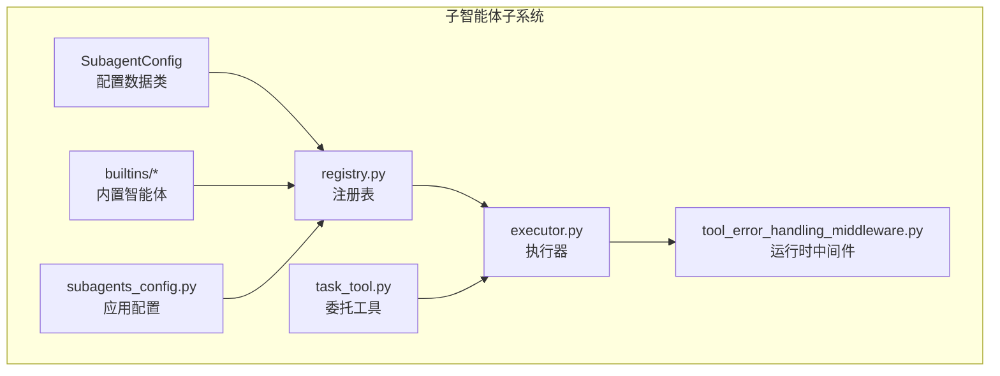
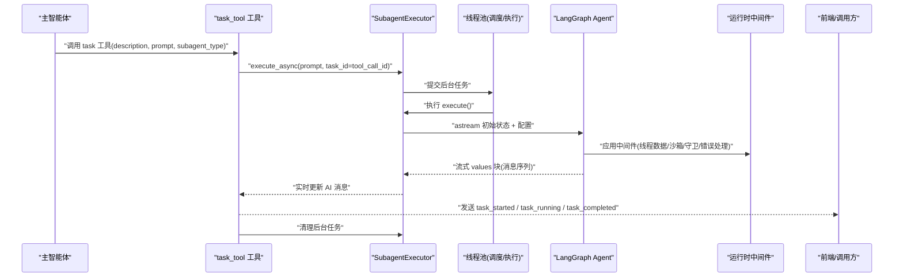
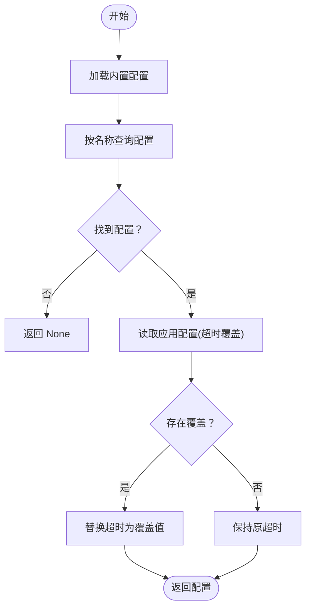
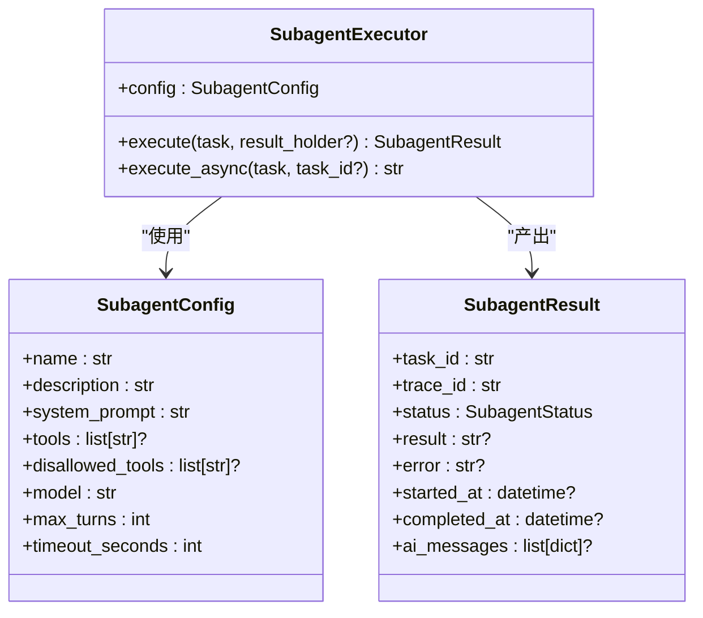
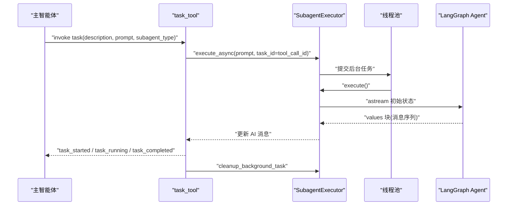
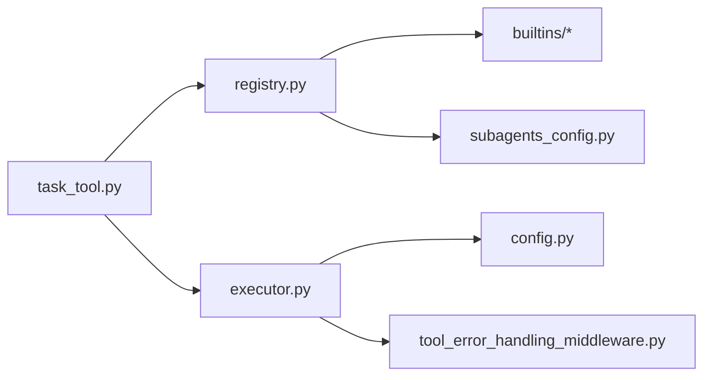

# 子智能体系统

<cite>
**本文引用的文件**
- [backend/…/subagents/__init__.py](file://backend/packages/harness/deerflow/subagents/__init__.py)
- [backend/…/subagents/config.py](file://backend/packages/harness/deerflow/subagents/config.py)
- [backend/…/subagents/registry.py](file://backend/packages/harness/deerflow/subagents/registry.py)
- [backend/…/subagents/executor.py](file://backend/packages/harness/deerflow/subagents/executor.py)
- [backend/…/subagents/builtins/__init__.py](file://backend/packages/harness/deerflow/subagents/builtins/__init__.py)
- [backend/…/subagents/builtins/bash_agent.py](file://backend/packages/harness/deerflow/subagents/builtins/bash_agent.py)
- [backend/…/subagents/builtins/general_purpose.py](file://backend/packages/harness/deerflow/subagents/builtins/general_purpose.py)
- [backend/…/config/subagents_config.py](file://backend/packages/harness/deerflow/config/subagents_config.py)
- [backend/…/agents/middlewares/tool_error_handling_middleware.py](file://backend/packages/harness/deerflow/agents/middlewares/tool_error_handling_middleware.py)
- [backend/…/tools/builtins/task_tool.py](file://backend/packages/harness/deerflow/tools/builtins/task_tool.py)
</cite>

## 目录
1. [简介](#简介)
2. [项目结构](#项目结构)
3. [核心组件](#核心组件)
4. [架构总览](#架构总览)
5. [详细组件分析](#详细组件分析)
6. [依赖关系分析](#依赖关系分析)
7. [性能考量](#性能考量)
8. [故障排查指南](#故障排查指南)
9. [结论](#结论)
10. [附录](#附录)

## 简介
本文件面向 DeerFlow 子智能体系统，提供从架构设计、执行机制到注册表管理的完整技术文档。重点覆盖以下方面：
- 子智能体生命周期：从配置加载、注册表解析、执行器调度到结果回收
- 执行器工作原理：异步流式执行、并发线程池、超时控制与错误恢复
- 配置系统：全局默认与按子智能体覆盖的超时策略
- 内置智能体：通用目的智能体与 Bash Agent 的行为边界与使用场景
- 与主智能体的交互：通过工具调用发起委托、后台轮询与事件流式回传
- 资源管理：线程池大小、并发限制、内存清理策略
- 自定义智能体开发指南与性能优化建议

## 项目结构
子智能体系统位于后端 harness 包中，核心模块围绕“配置-注册表-执行器-内置智能体-配置覆盖”展开，并通过工具层与主智能体进行交互。

图表来源
- [backend/…/subagents/config.py:1-29](file://backend/packages/harness/deerflow/subagents/config.py#L1-L29)
- [backend/…/subagents/registry.py:1-53](file://backend/packages/harness/deerflow/subagents/registry.py#L1-L53)
- [backend/…/subagents/executor.py:1-517](file://backend/packages/harness/deerflow/subagents/executor.py#L1-L517)
- [backend/…/subagents/builtins/__init__.py:1-16](file://backend/packages/harness/deerflow/subagents/builtins/__init__.py#L1-L16)
- [backend/…/config/subagents_config.py:1-66](file://backend/packages/harness/deerflow/config/subagents_config.py#L1-L66)
- [backend/…/agents/middlewares/tool_error_handling_middleware.py:1-138](file://backend/packages/harness/deerflow/agents/middlewares/tool_error_handling_middleware.py#L1-L138)
- [backend/…/tools/builtins/task_tool.py:1-196](file://backend/packages/harness/deerflow/tools/builtins/task_tool.py#L1-L196)

章节来源
- [backend/…/subagents/__init__.py:1-12](file://backend/packages/harness/deerflow/subagents/__init__.py#L1-L12)

## 核心组件
- 配置模型 SubagentConfig：描述子智能体名称、用途、系统提示词、工具白/黑名单、模型继承策略、最大对话轮次、超时秒数等。
- 注册表 registry：提供按名获取配置（支持来自应用配置的超时覆盖）、列出可用子智能体、返回名称列表。
- 执行器 executor：负责创建代理实例、构建初始状态、流式执行、收集中间 AI 消息、统一结果封装与状态管理；支持同步、异步与后台任务模式。
- 内置智能体 builtins：提供通用目的智能体与 Bash Agent 的预设配置。
- 应用配置 subagents_config：从配置字典加载全局默认超时与按子智能体的覆盖项。
- 运行时中间件：为子智能体运行时注入线程数据、沙箱、可选上传与悬空工具调用修复、守卫规则与工具错误处理。
- 委托工具 task_tool：在主智能体中触发子智能体任务，启动后台执行并轮询结果，通过流式事件向前端反馈进度。

章节来源
- [backend/…/subagents/config.py:1-29](file://backend/packages/harness/deerflow/subagents/config.py#L1-L29)
- [backend/…/subagents/registry.py:1-53](file://backend/packages/harness/deerflow/subagents/registry.py#L1-L53)
- [backend/…/subagents/executor.py:1-517](file://backend/packages/harness/deerflow/subagents/executor.py#L1-L517)
- [backend/…/subagents/builtins/__init__.py:1-16](file://backend/packages/harness/deerflow/subagents/builtins/__init__.py#L1-L16)
- [backend/…/config/subagents_config.py:1-66](file://backend/packages/harness/deerflow/config/subagents_config.py#L1-L66)
- [backend/…/agents/middlewares/tool_error_handling_middleware.py:1-138](file://backend/packages/harness/deerflow/agents/middlewares/tool_error_handling_middleware.py#L1-L138)
- [backend/…/tools/builtins/task_tool.py:1-196](file://backend/packages/harness/deerflow/tools/builtins/task_tool.py#L1-L196)

## 架构总览
下图展示从主智能体工具调用到子智能体执行、再到结果回传的整体流程。

图表来源
- [backend/…/tools/builtins/task_tool.py:115-182](file://backend/packages/harness/deerflow/tools/builtins/task_tool.py#L115-L182)
- [backend/…/subagents/executor.py:203-349](file://backend/packages/harness/deerflow/subagents/executor.py#L203-L349)
- [backend/…/agents/middlewares/tool_error_handling_middleware.py:68-137](file://backend/packages/harness/deerflow/agents/middlewares/tool_error_handling_middleware.py#L68-L137)

## 详细组件分析

### 配置系统与注册表
- SubagentConfig：定义子智能体的元数据与运行参数，如工具白/黑名单、模型继承、最大轮次、默认超时。
- 注册表 registry：
  - 从内置集合获取配置；
  - 读取应用配置中的 per-agent 覆盖（仅超时字段），返回最终生效配置；
  - 提供列出所有可用配置与名称列表的能力。
- 应用配置 subagents_config：
  - 支持全局默认超时；
  - 支持按子智能体设置独立超时；
  - 加载配置字典并记录日志摘要。

图表来源
- [backend/…/subagents/registry.py:12-34](file://backend/packages/harness/deerflow/subagents/registry.py#L12-L34)
- [backend/…/config/subagents_config.py:33-45](file://backend/packages/harness/deerflow/config/subagents_config.py#L33-L45)

章节来源
- [backend/…/subagents/config.py:1-29](file://backend/packages/harness/deerflow/subagents/config.py#L1-L29)
- [backend/…/subagents/registry.py:1-53](file://backend/packages/harness/deerflow/subagents/registry.py#L1-L53)
- [backend/…/config/subagents_config.py:1-66](file://backend/packages/harness/deerflow/config/subagents_config.py#L1-L66)

### 执行器与生命周期
- 初始化：根据配置过滤工具、继承父模型、生成 trace_id、保存沙箱与线程上下文。
- 创建代理：选择模型（支持 inherit）、组装运行时中间件、设置系统提示词与状态模式。
- 流式执行：以 astream(values) 方式迭代状态，收集 AIMessage 并去重写入结果；最终提取最后一个 AI 消息内容作为 result。
- 结果封装：SubagentResult 统一封装任务 ID、trace ID、状态、结果、错误、时间戳与中间消息列表。
- 生命周期：
  - 同步 execute：在新事件循环中运行异步逻辑，便于异步工具（如 MCP）执行。
  - 异步 execute_async：提交到调度线程池，再由执行线程池在超时内完成；后台维护任务表，支持轮询与清理。
  - 超时控制：线程池 Future 超时即标记为 TIMED_OUT，并尝试取消未完成任务。
  - 清理策略：仅对终端态任务进行清理，避免竞态。

图表来源
- [backend/…/subagents/config.py:6-29](file://backend/packages/harness/deerflow/subagents/config.py#L6-L29)
- [backend/…/subagents/executor.py:36-64](file://backend/packages/harness/deerflow/subagents/executor.py#L36-L64)
- [backend/…/subagents/executor.py:123-181](file://backend/packages/harness/deerflow/subagents/executor.py#L123-L181)

章节来源
- [backend/…/subagents/executor.py:1-517](file://backend/packages/harness/deerflow/subagents/executor.py#L1-L517)

### 内置智能体实现
- 通用目的智能体 general-purpose：
  - 适合复杂多步骤任务，强调探索与行动结合；
  - 默认允许全部工具（不显式指定 tools），禁用 task/clarification/present_files 等防止嵌套与澄清；
  - 最大轮次较高，适于长链路推理。
- Bash Agent：
  - 专注于命令执行，强调分步执行、并行独立命令、错误处理与输出摘要；
  - 仅允许沙箱相关工具，禁用 task/clarification/present_files；
  - 工作目录明确指向沙箱路径，便于文件操作与输出归档。

章节来源
- [backend/…/subagents/builtins/general_purpose.py:1-48](file://backend/packages/harness/deerflow/subagents/builtins/general_purpose.py#L1-L48)
- [backend/…/subagents/builtins/bash_agent.py:1-47](file://backend/packages/harness/deerflow/subagents/builtins/bash_agent.py#L1-L47)
- [backend/…/subagents/builtins/__init__.py:1-16](file://backend/packages/harness/deerflow/subagents/builtins/__init__.py#L1-L16)

### 与主智能体的通信与任务调度
- 主智能体通过 task_tool 发起委托：
  - 解析子智能体类型，获取配置并应用技能提示段落与可选 max_turns 覆盖；
  - 从运行时上下文抽取沙箱状态、线程数据、线程 ID、父模型与 trace_id；
  - 获取可用工具集（禁用 task 工具以防递归）；
  - 创建 SubagentExecutor 并以 tool_call_id 作为任务 ID 启动后台执行；
  - 每 5 秒轮询一次，通过流式 writer 发送 task_started/task_running/task_completed/task_failed/task_timed_out 事件；
  - 在完成后清理后台任务，避免内存泄漏。
- 执行器侧：
  - 使用 astream(values) 实时捕获 AI 消息，写入 SubagentResult.ai_messages；
  - 统一异常转为 FAILED 状态与错误信息；
  - 超时通过线程池 Future 超时检测，标记为 TIMED_OUT。

图表来源
- [backend/…/tools/builtins/task_tool.py:115-195](file://backend/packages/harness/deerflow/tools/builtins/task_tool.py#L115-L195)
- [backend/…/subagents/executor.py:203-349](file://backend/packages/harness/deerflow/subagents/executor.py#L203-L349)

章节来源
- [backend/…/tools/builtins/task_tool.py:1-196](file://backend/packages/harness/deerflow/tools/builtins/task_tool.py#L1-L196)
- [backend/…/subagents/executor.py:1-517](file://backend/packages/harness/deerflow/subagents/executor.py#L1-L517)

### 错误处理与状态同步
- 工具错误处理中间件：
  - 将工具异常转换为 ToolMessage，保留 LangGraph 控制信号（中断/暂停/恢复）；
  - 记录工具名与调用 ID，截断过长错误详情，保证继续推理。
- 子智能体运行时中间件：
  - 注入线程数据与沙箱状态；
  - 可选上传中间件与悬空工具调用修复；
  - 守卫规则中间件（按配置启用）；
  - 工具错误处理中间件收尾。
- 执行器错误处理：
  - 捕获异常并设置 FAILED 状态；
  - 设置完成时间戳，确保可观测性；
  - 轮询侧在 FAILED/TIMED_OUT 时清理任务。

章节来源
- [backend/…/agents/middlewares/tool_error_handling_middleware.py:1-138](file://backend/packages/harness/deerflow/agents/middlewares/tool_error_handling_middleware.py#L1-L138)
- [backend/…/subagents/executor.py:343-349](file://backend/packages/harness/deerflow/subagents/executor.py#L343-L349)
- [backend/…/tools/builtins/task_tool.py:164-195](file://backend/packages/harness/deerflow/tools/builtins/task_tool.py#L164-L195)

## 依赖关系分析
- 组件耦合：
  - SubagentExecutor 依赖 SubagentConfig、LangChain Agent 创建器、运行时中间件、沙箱与线程状态；
  - registry 依赖 builtins 与应用配置，提供最终生效配置；
  - task_tool 依赖 registry 与执行器，负责任务编排与轮询。
- 外部依赖：
  - LangChain/LangGraph 用于代理创建与流式执行；
  - 线程池用于并发调度与执行，避免阻塞；
  - Pydantic 用于配置校验与序列化。

图表来源
- [backend/…/subagents/registry.py:1-53](file://backend/packages/harness/deerflow/subagents/registry.py#L1-L53)
- [backend/…/subagents/builtins/__init__.py:1-16](file://backend/packages/harness/deerflow/subagents/builtins/__init__.py#L1-L16)
- [backend/…/config/subagents_config.py:1-66](file://backend/packages/harness/deerflow/config/subagents_config.py#L1-L66)
- [backend/…/subagents/executor.py:1-517](file://backend/packages/harness/deerflow/subagents/executor.py#L1-L517)
- [backend/…/agents/middlewares/tool_error_handling_middleware.py:1-138](file://backend/packages/harness/deerflow/agents/middlewares/tool_error_handling_middleware.py#L1-L138)
- [backend/…/tools/builtins/task_tool.py:1-196](file://backend/packages/harness/deerflow/tools/builtins/task_tool.py#L1-L196)

## 性能考量
- 并发与线程池
  - 调度线程池与执行线程池分离，避免 IO 阻塞影响执行；
  - 当前最大并发为 3，可根据资源与任务特性调整（需评估线程开销与锁竞争）。
- 超时策略
  - 执行器内部 Future 超时与应用配置超时双重保障；
  - 轮询侧设置安全上限，避免任务卡死导致资源占用。
- 工具筛选
  - 通过 tools/disallowed_tools 精简工具集，减少推理负担与安全风险。
- 中间件成本
  - 线程数据与沙箱中间件为必要开销；守卫规则中间件按需启用。
- 结果回收
  - 仅清理终端态任务，避免竞态；定期清理可降低内存压力。

## 故障排查指南
- 任务未出现或消失
  - 现象：轮询返回“任务消失”或后台任务表为空；
  - 排查：检查线程池是否提前退出、任务是否被意外清理、trace_id 是否一致。
- 任务长时间无响应
  - 现象：轮询达到安全上限仍未完成；
  - 排查：确认工具调用是否阻塞、中间件是否抛出控制信号、沙箱权限与路径是否正确。
- 工具报错导致失败
  - 现象：状态为 FAILED，错误信息来自工具异常；
  - 排查：查看工具错误处理中间件日志，定位具体工具与调用 ID，检查输入参数与外部服务状态。
- 超时判定
  - 现象：状态为 TIMED_OUT；
  - 排查：核对应用配置与执行器超时设置，评估任务复杂度与并发负载。
- 重复消息
  - 现象：AI 消息列表出现重复；
  - 排查：确认消息去重逻辑（基于消息 ID 或全量比较）是否生效。

章节来源
- [backend/…/tools/builtins/task_tool.py:132-195](file://backend/packages/harness/deerflow/tools/builtins/task_tool.py#L132-L195)
- [backend/…/subagents/executor.py:424-450](file://backend/packages/harness/deerflow/subagents/executor.py#L424-L450)
- [backend/…/agents/middlewares/tool_error_handling_middleware.py:48-65](file://backend/packages/harness/deerflow/agents/middlewares/tool_error_handling_middleware.py#L48-L65)

## 结论
子智能体系统通过清晰的配置-注册表-执行器分层，结合流式执行与中间件体系，实现了可扩展、可观测且可控的子任务委派能力。内置通用与 Bash 两类智能体覆盖了常见场景，同时通过应用配置提供灵活的超时与工具约束。配合主智能体的任务工具，系统在并发、超时与错误处理方面具备稳健的工程实践。

## 附录

### 配置示例与最佳实践
- 全局默认超时与按子智能体覆盖
  - 在配置字典中设置全局 timeout_seconds 与 per-agent 覆盖项；
  - 通过 registry 动态生效，避免硬编码。
- 工具白/黑名单
  - 对通用智能体建议留空（继承全部工具），对 Bash Agent 明确限定沙箱工具；
  - 禁用 task/clarification/present_files 以避免嵌套与澄清循环。
- 最大轮次与超时
  - 复杂任务提高 max_turns 与 timeout_seconds；
  - 简单任务降低以节省资源。
- 分布式追踪
  - 使用 trace_id 串联主任务与子任务日志，便于问题定位。

章节来源
- [backend/…/config/subagents_config.py:20-45](file://backend/packages/harness/deerflow/config/subagents_config.py#L20-L45)
- [backend/…/subagents/registry.py:25-34](file://backend/packages/harness/deerflow/subagents/registry.py#L25-L34)
- [backend/…/subagents/builtins/general_purpose.py:43-46](file://backend/packages/harness/deerflow/subagents/builtins/general_purpose.py#L43-L46)
- [backend/…/subagents/builtins/bash_agent.py:42-46](file://backend/packages/harness/deerflow/subagents/builtins/bash_agent.py#L42-L46)

### 自定义智能体开发指南
- 步骤
  - 定义 SubagentConfig：命名、用途描述、系统提示词、工具策略、模型与轮次、超时；
  - 在 builtins/__init__.py 中注册为常量并加入 BUILTIN_SUBAGENTS；
  - 如需特殊中间件，可在执行器初始化时组合；
  - 在应用配置中设置 per-agent 覆盖（如需要）。
- 注意事项
  - 避免在子智能体内再次启用 task 工具；
  - 明确工作目录与权限范围（沙箱）；
  - 为长任务设置合理超时与轮次上限。

章节来源
- [backend/…/subagents/config.py:6-29](file://backend/packages/harness/deerflow/subagents/config.py#L6-L29)
- [backend/…/subagents/builtins/__init__.py:11-16](file://backend/packages/harness/deerflow/subagents/builtins/__init__.py#L11-L16)
- [backend/…/config/subagents_config.py:56-65](file://backend/packages/harness/deerflow/config/subagents_config.py#L56-L65)