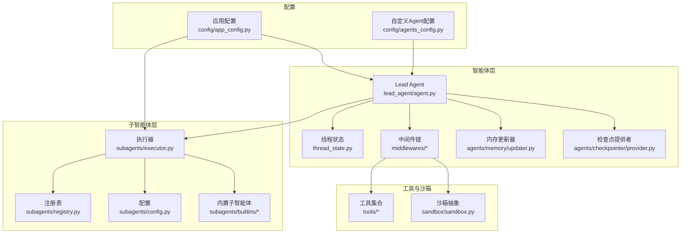
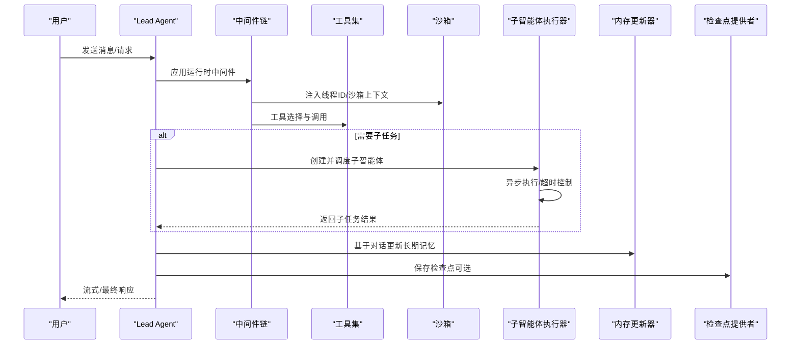
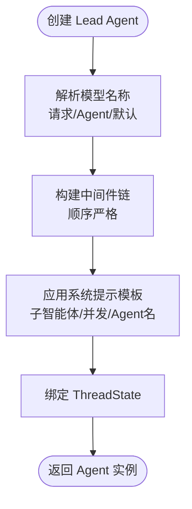
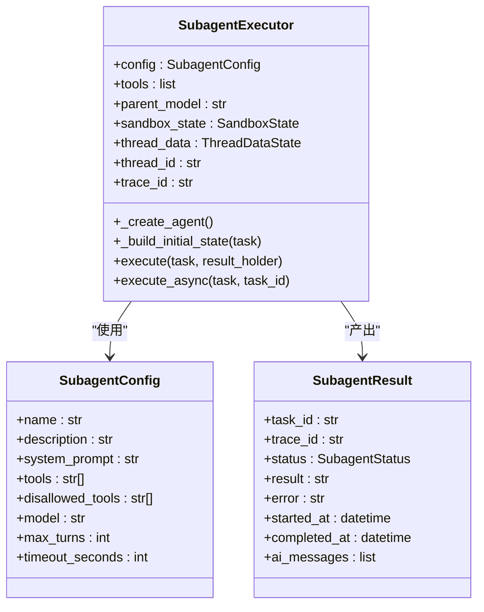
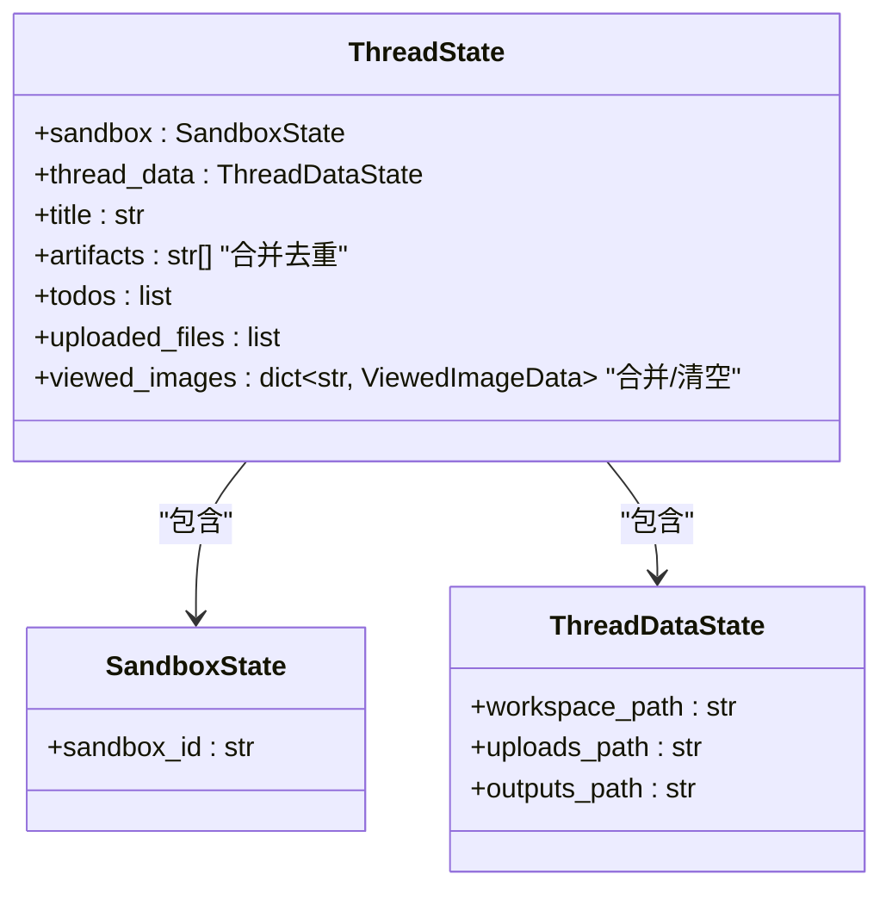
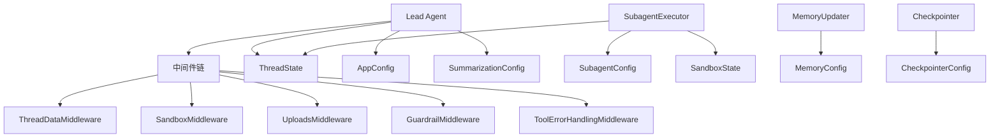

# 智能体系统

<cite>
**本文引用的文件**
- [backend/packages/harness/deerflow/agents/lead_agent/agent.py](file://backend/packages/harness/deerflow/agents/lead_agent/agent.py)
- [backend/packages/harness/deerflow/agents/thread_state.py](file://backend/packages/harness/deerflow/agents/thread_state.py)
- [backend/packages/harness/deerflow/subagents/executor.py](file://backend/packages/harness/deerflow/subagents/executor.py)
- [backend/packages/harness/deerflow/subagents/registry.py](file://backend/packages/harness/deerflow/subagents/registry.py)
- [backend/packages/harness/deerflow/subagents/config.py](file://backend/packages/harness/deerflow/subagents/config.py)
- [backend/packages/harness/deerflow/agents/middlewares/tool_error_handling_middleware.py](file://backend/packages/harness/deerflow/agents/middlewares/tool_error_handling_middleware.py)
- [backend/packages/harness/deerflow/config/agents_config.py](file://backend/packages/harness/deerflow/config/agents_config.py)
- [backend/packages/harness/deerflow/sandbox/sandbox.py](file://backend/packages/harness/deerflow/sandbox/sandbox.py)
- [backend/packages/harness/deerflow/agents/memory/updater.py](file://backend/packages/harness/deerflow/agents/memory/updater.py)
- [backend/packages/harness/deerflow/tools/builtins/setup_agent_tool.py](file://backend/packages/harness/deerflow/tools/builtins/setup_agent_tool.py)
- [backend/packages/harness/deerflow/agents/checkpointer/provider.py](file://backend/packages/harness/deerflow/agents/checkpointer/provider.py)
- [backend/packages/harness/deerflow/config/app_config.py](file://backend/packages/harness/deerflow/config/app_config.py)
</cite>

## 目录
1. [简介](#简介)
2. [项目结构](#项目结构)
3. [核心组件](#核心组件)
4. [架构总览](#架构总览)
5. [详细组件分析](#详细组件分析)
6. [依赖分析](#依赖分析)
7. [性能考虑](#性能考虑)
8. [故障排查指南](#故障排查指南)
9. [结论](#结论)
10. [附录](#附录)

## 简介
本技术文档面向 DeerFlow 智能体系统，聚焦 Lead Agent 的架构设计、子智能体（Subagent）管理机制与状态管理系统，深入解析智能体编排的工作原理、中间件链的设计思路以及智能体之间的通信机制。文档还涵盖智能体生命周期管理、状态持久化与并发控制，并提供智能体配置示例与自定义智能体开发指南，解释智能体与沙箱、内存系统和工具系统的集成关系。

## 项目结构
DeerFlow 后端采用分层与功能域结合的组织方式：
- agents：Lead Agent、中间件、线程状态、内存更新器、检查点提供者等
- subagents：子智能体执行引擎、注册表与内置配置
- tools：工具与内置工具（如设置自定义 Agent 的工具）
- sandbox：沙箱抽象与中间件
- config：应用配置与各类子系统配置加载
- models：模型工厂与适配
- mcp、guardrails、skills 等扩展模块

图表来源
- [backend/packages/harness/deerflow/agents/lead_agent/agent.py:268-344](file://backend/packages/harness/deerflow/agents/lead_agent/agent.py#L268-L344)
- [backend/packages/harness/deerflow/agents/thread_state.py:48-56](file://backend/packages/harness/deerflow/agents/thread_state.py#L48-L56)
- [backend/packages/harness/deerflow/subagents/executor.py:123-181](file://backend/packages/harness/deerflow/subagents/executor.py#L123-L181)
- [backend/packages/harness/deerflow/subagents/registry.py:12-35](file://backend/packages/harness/deerflow/subagents/registry.py#L12-L35)
- [backend/packages/harness/deerflow/agents/memory/updater.py:267-349](file://backend/packages/harness/deerflow/agents/memory/updater.py#L267-L349)
- [backend/packages/harness/deerflow/agents/checkpointer/provider.py:114-158](file://backend/packages/harness/deerflow/agents/checkpointer/provider.py#L114-L158)
- [backend/packages/harness/deerflow/config/app_config.py:30-44](file://backend/packages/harness/deerflow/config/app_config.py#L30-L44)
- [backend/packages/harness/deerflow/config/agents_config.py:27-69](file://backend/packages/harness/deerflow/config/agents_config.py#L27-L69)
- [backend/packages/harness/deerflow/sandbox/sandbox.py:4-73](file://backend/packages/harness/deerflow/sandbox/sandbox.py#L4-L73)

章节来源
- [backend/packages/harness/deerflow/agents/lead_agent/agent.py:268-344](file://backend/packages/harness/deerflow/agents/lead_agent/agent.py#L268-L344)
- [backend/packages/harness/deerflow/agents/thread_state.py:48-56](file://backend/packages/harness/deerflow/agents/thread_state.py#L48-L56)
- [backend/packages/harness/deerflow/subagents/executor.py:123-181](file://backend/packages/harness/deerflow/subagents/executor.py#L123-L181)
- [backend/packages/harness/deerflow/subagents/registry.py:12-35](file://backend/packages/harness/deerflow/subagents/registry.py#L12-L35)
- [backend/packages/harness/deerflow/agents/memory/updater.py:267-349](file://backend/packages/harness/deerflow/agents/memory/updater.py#L267-L349)
- [backend/packages/harness/deerflow/agents/checkpointer/provider.py:114-158](file://backend/packages/harness/deerflow/agents/checkpointer/provider.py#L114-L158)
- [backend/packages/harness/deerflow/config/app_config.py:30-44](file://backend/packages/harness/deerflow/config/app_config.py#L30-L44)
- [backend/packages/harness/deerflow/config/agents_config.py:27-69](file://backend/packages/harness/deerflow/config/agents_config.py#L27-L69)
- [backend/packages/harness/deerflow/sandbox/sandbox.py:4-73](file://backend/packages/harness/deerflow/sandbox/sandbox.py#L4-L73)

## 核心组件
- Lead Agent：负责对话编排、工具调用、中间件链处理与状态管理；支持计划模式、子智能体并发限制、标题生成、记忆注入与图像视图等特性。
- 子智能体执行器：异步/同步执行子任务，支持超时、并发池、结果回传与后台任务清理。
- 中间件链：统一的运行时中间件构建器，包含线程数据、沙箱、上传、工具错误处理、守卫护栏等。
- 线程状态：TypedDict 定义的状态结构，含沙箱、线程数据、标题、工件、待办、上传文件、已查看图片等字段及合并策略。
- 内存更新器：基于对话上下文的长短期记忆更新与持久化。
- 检查点提供者：LangGraph 检查点后端（内存/SQLite/PostgreSQL）的工厂与上下文管理器。
- 配置系统：应用级配置与自定义 Agent 配置加载、环境变量解析、配置热重载。

章节来源
- [backend/packages/harness/deerflow/agents/lead_agent/agent.py:268-344](file://backend/packages/harness/deerflow/agents/lead_agent/agent.py#L268-L344)
- [backend/packages/harness/deerflow/subagents/executor.py:123-181](file://backend/packages/harness/deerflow/subagents/executor.py#L123-L181)
- [backend/packages/harness/deerflow/agents/middlewares/tool_error_handling_middleware.py:68-138](file://backend/packages/harness/deerflow/agents/middlewares/tool_error_handling_middleware.py#L68-L138)
- [backend/packages/harness/deerflow/agents/thread_state.py:48-56](file://backend/packages/harness/deerflow/agents/thread_state.py#L48-L56)
- [backend/packages/harness/deerflow/agents/memory/updater.py:267-349](file://backend/packages/harness/deerflow/agents/memory/updater.py#L267-L349)
- [backend/packages/harness/deerflow/agents/checkpointer/provider.py:114-158](file://backend/packages/harness/deerflow/agents/checkpointer/provider.py#L114-L158)
- [backend/packages/harness/deerflow/config/app_config.py:263-289](file://backend/packages/harness/deerflow/config/app_config.py#L263-L289)
- [backend/packages/harness/deerflow/config/agents_config.py:27-69](file://backend/packages/harness/deerflow/config/agents_config.py#L27-L69)

## 架构总览
下图展示 Lead Agent、子智能体、中间件、沙箱、内存与检查点的整体交互：

图表来源
- [backend/packages/harness/deerflow/agents/lead_agent/agent.py:268-344](file://backend/packages/harness/deerflow/agents/lead_agent/agent.py#L268-L344)
- [backend/packages/harness/deerflow/agents/middlewares/tool_error_handling_middleware.py:68-138](file://backend/packages/harness/deerflow/agents/middlewares/tool_error_handling_middleware.py#L68-L138)
- [backend/packages/harness/deerflow/subagents/executor.py:203-350](file://backend/packages/harness/deerflow/subagents/executor.py#L203-L350)
- [backend/packages/harness/deerflow/agents/memory/updater.py:284-349](file://backend/packages/harness/deerflow/agents/memory/updater.py#L284-L349)
- [backend/packages/harness/deerflow/agents/checkpointer/provider.py:114-158](file://backend/packages/harness/deerflow/agents/checkpointer/provider.py#L114-L158)

## 详细组件分析

### Lead Agent 架构与编排
- 模型解析与降级：优先使用请求参数、自定义 Agent 配置，再回退到全局默认模型；若启用“思考模式”但模型不支持则自动降级。
- 中间件链构建：按严格顺序组装运行时中间件，确保线程数据、沙箱、上传、工具错误处理、守卫护栏、摘要、计划模式、标题、记忆、图像视图、延迟工具过滤、子智能体并发限制与循环检测等模块正确装配。
- 系统提示模板：根据是否启用子智能体、最大并发数与 Agent 名称动态拼装提示词。
- 状态模式：以 ThreadState 作为状态基座，支持沙箱、线程数据、标题、工件列表、待办、上传文件、已查看图片等字段与合并策略。

图表来源
- [backend/packages/harness/deerflow/agents/lead_agent/agent.py:26-39](file://backend/packages/harness/deerflow/agents/lead_agent/agent.py#L26-L39)
- [backend/packages/harness/deerflow/agents/lead_agent/agent.py:208-265](file://backend/packages/harness/deerflow/agents/lead_agent/agent.py#L208-L265)
- [backend/packages/harness/deerflow/agents/lead_agent/agent.py:326-343](file://backend/packages/harness/deerflow/agents/lead_agent/agent.py#L326-L343)
- [backend/packages/harness/deerflow/agents/thread_state.py:48-56](file://backend/packages/harness/deerflow/agents/thread_state.py#L48-L56)

章节来源
- [backend/packages/harness/deerflow/agents/lead_agent/agent.py:268-344](file://backend/packages/harness/deerflow/agents/lead_agent/agent.py#L268-L344)
- [backend/packages/harness/deerflow/agents/thread_state.py:48-56](file://backend/packages/harness/deerflow/agents/thread_state.py#L48-L56)

### 子智能体管理机制
- 执行器职责：创建子智能体、构建初始状态、传递沙箱与线程数据、流式收集 AI 消息、超时控制、并发池调度、结果聚合与后台任务清理。
- 并发与超时：通过两个线程池（调度与执行）与 Future 超时实现并发限制与超时保护；支持异步/同步两种执行模式。
- 结果模型：SubagentResult 统一承载任务ID、追踪ID、状态、结果、错误、时间戳与AI消息序列。
- 注册表与内置配置：内置通用子智能体与 Bash 子智能体，支持从配置覆盖超时等参数。

图表来源
- [backend/packages/harness/deerflow/subagents/executor.py:123-181](file://backend/packages/harness/deerflow/subagents/executor.py#L123-L181)
- [backend/packages/harness/deerflow/subagents/executor.py:351-390](file://backend/packages/harness/deerflow/subagents/executor.py#L351-L390)
- [backend/packages/harness/deerflow/subagents/executor.py:391-453](file://backend/packages/harness/deerflow/subagents/executor.py#L391-L453)
- [backend/packages/harness/deerflow/subagents/config.py:6-29](file://backend/packages/harness/deerflow/subagents/config.py#L6-L29)

章节来源
- [backend/packages/harness/deerflow/subagents/executor.py:123-181](file://backend/packages/harness/deerflow/subagents/executor.py#L123-L181)
- [backend/packages/harness/deerflow/subagents/executor.py:351-390](file://backend/packages/harness/deerflow/subagents/executor.py#L351-L390)
- [backend/packages/harness/deerflow/subagents/executor.py:391-453](file://backend/packages/harness/deerflow/subagents/executor.py#L391-L453)
- [backend/packages/harness/deerflow/subagents/registry.py:12-35](file://backend/packages/harness/deerflow/subagents/registry.py#L12-L35)
- [backend/packages/harness/deerflow/subagents/config.py:6-29](file://backend/packages/harness/deerflow/subagents/config.py#L6-L29)

### 状态管理系统
- 线程状态结构：包含沙箱、线程数据、标题、工件列表、待办、上传文件、已查看图片等字段；提供合并策略以保证去重与清空语义。
- 状态 Schema：在 Lead Agent 与子智能体中均以 ThreadState 作为状态基座，确保跨组件一致性。
- 并发安全：后台任务结果存储使用锁保护，避免竞态；清理仅对终止态任务生效。

图表来源
- [backend/packages/harness/deerflow/agents/thread_state.py:6-56](file://backend/packages/harness/deerflow/agents/thread_state.py#L6-L56)

章节来源
- [backend/packages/harness/deerflow/agents/thread_state.py:48-56](file://backend/packages/harness/deerflow/agents/thread_state.py#L48-L56)

### 中间件链设计与通信机制
- 共享运行时中间件：线程数据、沙箱、上传、悬空工具补丁、守卫护栏、工具错误处理等按约定顺序插入。
- Lead 专属中间件：摘要、计划模式（TodoList）、令牌用量统计、标题生成、记忆注入、图像视图、延迟工具过滤、子智能体并发限制、循环检测、澄清请求拦截等。
- 通信与上下文：中间件在运行时注入 thread_id、沙箱状态、上传上下文等，使工具与子智能体共享一致的会话语境。

图表来源
- [backend/packages/harness/deerflow/agents/middlewares/tool_error_handling_middleware.py:68-138](file://backend/packages/harness/deerflow/agents/middlewares/tool_error_handling_middleware.py#L68-L138)
- [backend/packages/harness/deerflow/agents/lead_agent/agent.py:208-265](file://backend/packages/harness/deerflow/agents/lead_agent/agent.py#L208-L265)

章节来源
- [backend/packages/harness/deerflow/agents/middlewares/tool_error_handling_middleware.py:68-138](file://backend/packages/harness/deerflow/agents/middlewares/tool_error_handling_middleware.py#L68-L138)
- [backend/packages/harness/deerflow/agents/lead_agent/agent.py:208-265](file://backend/packages/harness/deerflow/agents/lead_agent/agent.py#L208-L265)

### 智能体生命周期管理、状态持久化与并发控制
- 生命周期：创建（模型解析、中间件构建、提示模板应用、状态绑定）→ 运行（流式处理、中间件拦截、工具调用、子智能体调度）→ 结束（保存检查点、更新记忆、清理后台任务）。
- 状态持久化：检查点提供者支持内存、SQLite、PostgreSQL；应用配置可热重载，避免重启。
- 并发控制：子智能体执行器通过线程池与超时控制限制并发；后台任务结果缓存与清理避免内存泄漏。

章节来源
- [backend/packages/harness/deerflow/agents/checkpointer/provider.py:114-158](file://backend/packages/harness/deerflow/agents/checkpointer/provider.py#L114-L158)
- [backend/packages/harness/deerflow/config/app_config.py:263-289](file://backend/packages/harness/deerflow/config/app_config.py#L263-L289)
- [backend/packages/harness/deerflow/subagents/executor.py:418-453](file://backend/packages/harness/deerflow/subagents/executor.py#L418-L453)

### 智能体与沙箱、内存系统和工具系统的集成
- 沙箱：中间件注入线程ID与沙箱状态，子智能体继承父级沙箱上下文，支持命令执行、文件读写等操作。
- 内存：基于对话内容调用模型生成更新，清洗上传事件，持久化至文件，带缓存与原子写入。
- 工具：工具按组或显式白/黑名单筛选；内置工具支持自定义 Agent 创建流程。

章节来源
- [backend/packages/harness/deerflow/sandbox/sandbox.py:4-73](file://backend/packages/harness/deerflow/sandbox/sandbox.py#L4-L73)
- [backend/packages/harness/deerflow/agents/memory/updater.py:284-349](file://backend/packages/harness/deerflow/agents/memory/updater.py#L284-L349)
- [backend/packages/harness/deerflow/tools/builtins/setup_agent_tool.py:14-63](file://backend/packages/harness/deerflow/tools/builtins/setup_agent_tool.py#L14-L63)

## 依赖分析
- Lead Agent 依赖中间件链、模型工厂、工具集合、线程状态、应用配置与摘要配置。
- 子智能体执行器依赖模型工厂、工具集合、子智能体配置、线程状态与沙箱状态。
- 中间件链依赖线程数据中间件、沙箱中间件、上传中间件、守卫护栏中间件与工具错误处理中间件。
- 内存更新器依赖模型工厂、路径与内存配置。
- 检查点提供者依赖应用配置与后端库。

图表来源
- [backend/packages/harness/deerflow/agents/lead_agent/agent.py:268-344](file://backend/packages/harness/deerflow/agents/lead_agent/agent.py#L268-L344)
- [backend/packages/harness/deerflow/subagents/executor.py:123-181](file://backend/packages/harness/deerflow/subagents/executor.py#L123-L181)
- [backend/packages/harness/deerflow/agents/middlewares/tool_error_handling_middleware.py:68-138](file://backend/packages/harness/deerflow/agents/middlewares/tool_error_handling_middleware.py#L68-L138)
- [backend/packages/harness/deerflow/agents/memory/updater.py:267-349](file://backend/packages/harness/deerflow/agents/memory/updater.py#L267-L349)
- [backend/packages/harness/deerflow/agents/checkpointer/provider.py:114-158](file://backend/packages/harness/deerflow/agents/checkpointer/provider.py#L114-L158)

章节来源
- [backend/packages/harness/deerflow/agents/lead_agent/agent.py:268-344](file://backend/packages/harness/deerflow/agents/lead_agent/agent.py#L268-L344)
- [backend/packages/harness/deerflow/subagents/executor.py:123-181](file://backend/packages/harness/deerflow/subagents/executor.py#L123-L181)
- [backend/packages/harness/deerflow/agents/middlewares/tool_error_handling_middleware.py:68-138](file://backend/packages/harness/deerflow/agents/middlewares/tool_error_handling_middleware.py#L68-L138)
- [backend/packages/harness/deerflow/agents/memory/updater.py:267-349](file://backend/packages/harness/deerflow/agents/memory/updater.py#L267-L349)
- [backend/packages/harness/deerflow/agents/checkpointer/provider.py:114-158](file://backend/packages/harness/deerflow/agents/checkpointer/provider.py#L114-L158)

## 性能考虑
- 中间件顺序优化：摘要中间件尽早减少上下文长度，标题与记忆中间件在合适阶段插入，避免重复计算。
- 子智能体并发限制：通过并发池与超时控制防止资源耗尽；合理设置最大并发与超时阈值。
- 缓存与原子写：内存更新器使用缓存与临时文件原子替换，降低磁盘写入开销。
- 检查点后端选择：生产环境建议使用 SQLite 或 PostgreSQL，避免频繁重启导致的内存检查点丢失。

## 故障排查指南
- 工具异常：工具错误处理中间件将异常转换为 ToolMessage，保留运行继续；若出现持续失败，检查工具可用性与权限。
- 循环检测：循环检测中间件可中断重复工具调用循环，避免死循环。
- 子智能体超时：若子任务长时间未完成，检查超时阈值与工具异步实现；必要时调整并发限制。
- 记忆更新失败：确认内存文件可写、JSON 解析成功、上传事件被正确清洗。
- 检查点不可用：根据配置安装对应后端依赖包并检查连接字符串。

章节来源
- [backend/packages/harness/deerflow/agents/middlewares/tool_error_handling_middleware.py:19-66](file://backend/packages/harness/deerflow/agents/middlewares/tool_error_handling_middleware.py#L19-L66)
- [backend/packages/harness/deerflow/subagents/executor.py:425-451](file://backend/packages/harness/deerflow/subagents/executor.py#L425-L451)
- [backend/packages/harness/deerflow/agents/memory/updater.py:343-348](file://backend/packages/harness/deerflow/agents/memory/updater.py#L343-L348)
- [backend/packages/harness/deerflow/agents/checkpointer/provider.py:38-41](file://backend/packages/harness/deerflow/agents/checkpointer/provider.py#L38-L41)

## 结论
DeerFlow 智能体系统通过清晰的 Lead Agent 架构、严格的中间件链顺序、完善的子智能体执行与并发控制、可扩展的配置体系，实现了高可靠、可维护的智能体编排能力。线程状态与检查点提供者保障了状态一致性与可恢复性；内存更新器与沙箱中间件增强了长期记忆与执行环境隔离。该设计既满足复杂任务的多步骤规划与执行，又兼顾了易用性与安全性。

## 附录

### 智能体配置示例与自定义开发指南
- 自定义 Agent 配置：在 agents 目录下创建 Agent 名称对应的目录，包含 config.yaml 与可选的 SOUL.md；SOUL.md 可注入行为约束与个性描述。
- Agent 加载：加载器校验目录与文件存在性，解析 YAML 并进行字段裁剪，支持列出所有自定义 Agent。
- 提示模板：Lead Agent 在创建时应用系统提示模板，可按是否启用子智能体、并发数与 Agent 名称动态拼装。
- 设置工具：内置工具可用于创建自定义 Agent 的配置与 SOUL 文件，失败时自动清理目录。

章节来源
- [backend/packages/harness/deerflow/config/agents_config.py:27-69](file://backend/packages/harness/deerflow/config/agents_config.py#L27-L69)
- [backend/packages/harness/deerflow/tools/builtins/setup_agent_tool.py:14-63](file://backend/packages/harness/deerflow/tools/builtins/setup_agent_tool.py#L14-L63)
- [backend/packages/harness/deerflow/agents/lead_agent/agent.py:326-343](file://backend/packages/harness/deerflow/agents/lead_agent/agent.py#L326-L343)