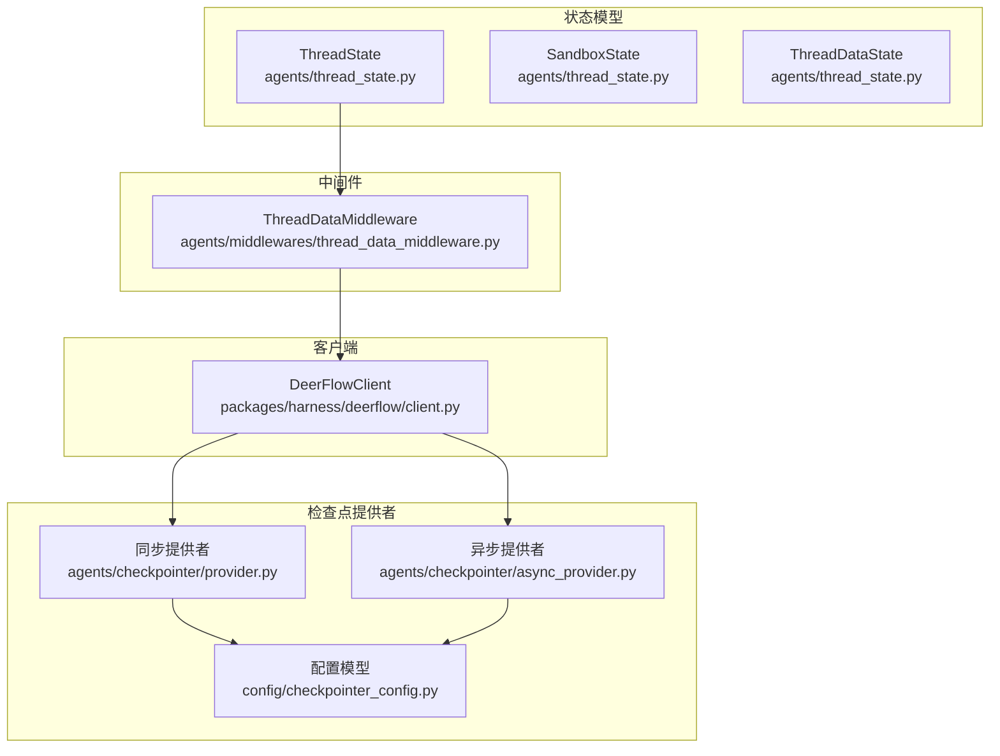
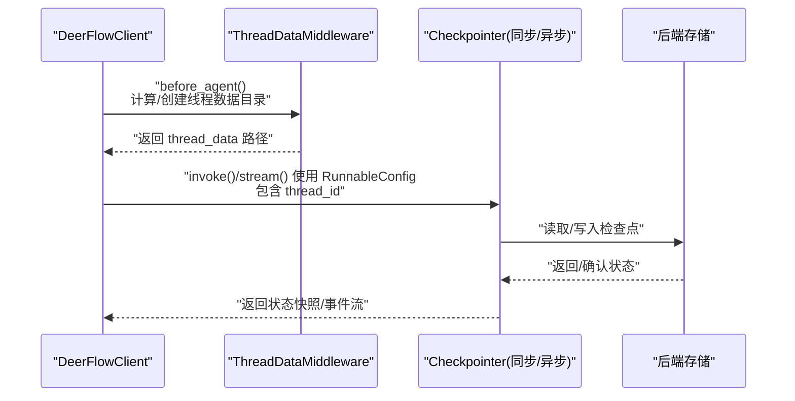
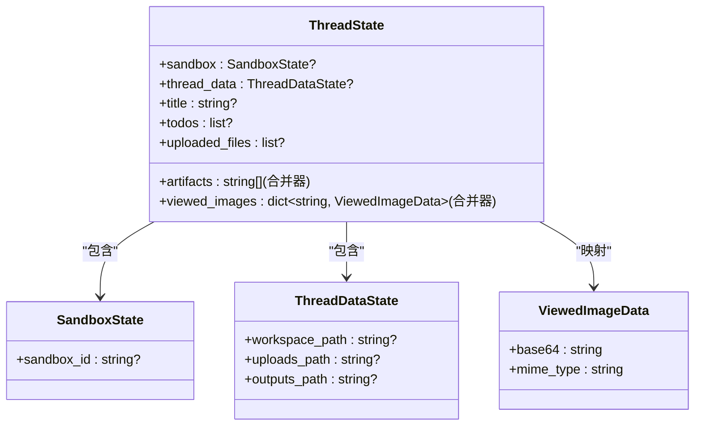
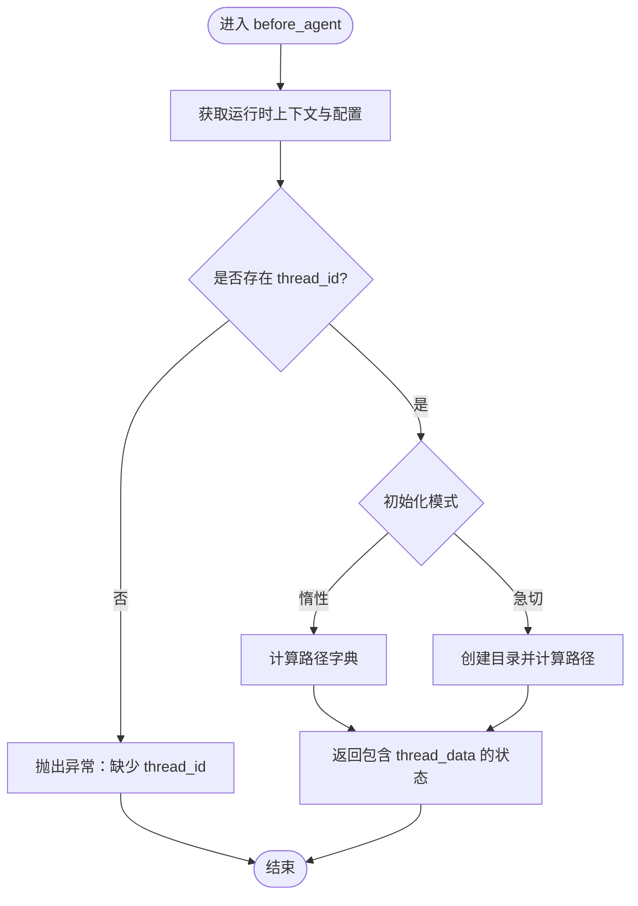
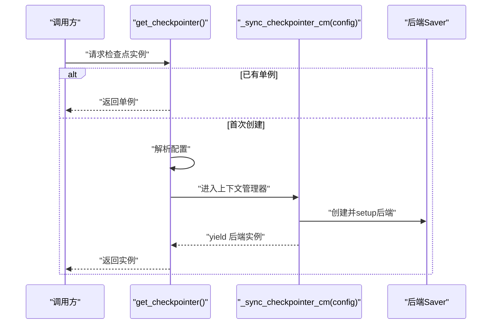
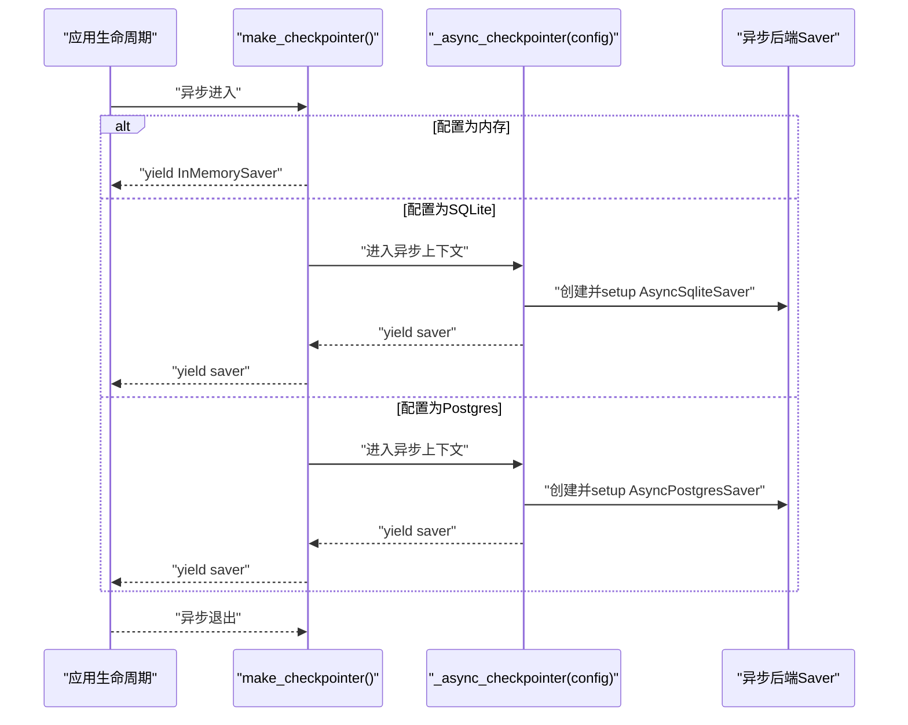
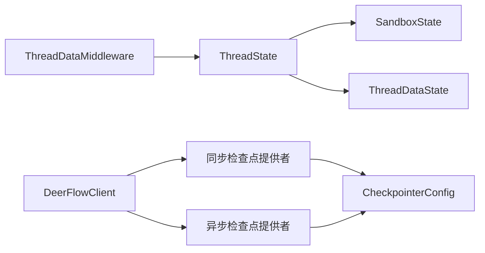

# 线程状态管理

<cite>
**本文引用的文件**
- [thread_state.py](file://backend/packages/harness/deerflow/agents/thread_state.py)
- [provider.py](file://backend/packages/harness/deerflow/agents/checkpointer/provider.py)
- [async_provider.py](file://backend/packages/harness/deerflow/agents/checkpointer/async_provider.py)
- [checkpointer_config.py](file://backend/packages/harness/deerflow/config/checkpointer_config.py)
- [thread_data_middleware.py](file://backend/packages/harness/deerflow/agents/middlewares/thread_data_middleware.py)
- [test_checkpointer.py](file://backend/tests/test_checkpointer.py)
- [client.py](file://backend/packages/harness/deerflow/client.py)
</cite>

## 目录
1. [简介](#简介)
2. [项目结构](#项目结构)
3. [核心组件](#核心组件)
4. [架构总览](#架构总览)
5. [详细组件分析](#详细组件分析)
6. [依赖分析](#依赖分析)
7. [性能考虑](#性能考虑)
8. [故障排查指南](#故障排查指南)
9. [结论](#结论)
10. [附录](#附录)

## 简介
本文件面向 DeerFlow 的线程状态管理系统，系统基于 LangGraph 的 AgentState 模型扩展，定义了 ThreadState 与 SandboxState，并通过检查点提供者（Checkpointer）实现状态的持久化与恢复。本文将深入解析以下主题：
- ThreadState 与 SandboxState 的设计架构与字段语义
- 状态合并器（merge_artifacts、merge_viewed_images）的行为与一致性
- 同步与异步检查点提供者的实现原理与资源管理
- 配置驱动的后端选择（内存、SQLite、PostgreSQL）
- 在智能体编排中的作用、并发控制与数据一致性保障
- 状态序列化/反序列化与版本兼容性处理建议
- 最佳实践、性能优化与故障恢复策略
- 状态迁移示例与调试技巧

## 项目结构
围绕线程状态管理的关键模块分布如下：
- 状态模型：agents/thread_state.py
- 中间件：agents/middlewares/thread_data_middleware.py
- 检查点提供者：agents/checkpointer/provider.py（同步）、agents/checkpointer/async_provider.py（异步）
- 配置模型：config/checkpointer_config.py
- 客户端集成：packages/harness/deerflow/client.py
- 单元测试：tests/test_checkpointer.py

**图表来源**
- [thread_state.py:48-56](file://backend/packages/harness/deerflow/agents/thread_state.py#L48-L56)
- [thread_data_middleware.py:18-97](file://backend/packages/harness/deerflow/agents/middlewares/thread_data_middleware.py#L18-L97)
- [provider.py:114-157](file://backend/packages/harness/deerflow/agents/checkpointer/provider.py#L114-L157)
- [async_provider.py:89-110](file://backend/packages/harness/deerflow/agents/checkpointer/async_provider.py#L89-L110)
- [checkpointer_config.py:10-26](file://backend/packages/harness/deerflow/config/checkpointer_config.py#L10-L26)
- [client.py:109-152](file://backend/packages/harness/deerflow/client.py#L109-L152)

**章节来源**
- [thread_state.py:6-56](file://backend/packages/harness/deerflow/agents/thread_state.py#L6-L56)
- [thread_data_middleware.py:18-97](file://backend/packages/harness/deerflow/agents/middlewares/thread_data_middleware.py#L18-L97)
- [provider.py:114-157](file://backend/packages/harness/deerflow/agents/checkpointer/provider.py#L114-L157)
- [async_provider.py:89-110](file://backend/packages/harness/deerflow/agents/checkpointer/async_provider.py#L89-L110)
- [checkpointer_config.py:10-26](file://backend/packages/harness/deerflow/config/checkpointer_config.py#L10-L26)
- [client.py:109-152](file://backend/packages/harness/deerflow/client.py#L109-L152)

## 核心组件
- ThreadState：LangGraph AgentState 的扩展，承载线程级状态，包含沙箱信息、线程数据路径、标题、工件列表、待办事项、上传文件、已查看图像等字段；其中部分字段带有合并器，用于状态合并与去重。
- SandboxState：描述当前执行所绑定的沙箱标识，支持可选值。
- ThreadDataState：描述线程数据目录结构（工作区、上传区、输出区），支持可选值。
- ThreadDataMiddleware：在每次线程执行前，按需创建或计算线程数据目录路径，支持惰性初始化与急切初始化两种模式。
- 同步检查点提供者：根据配置动态选择内存、SQLite 或 PostgreSQL 后端，支持单例与一次性上下文两种使用方式。
- 异步检查点提供者：与同步提供者一致的后端选择逻辑，但以异步上下文管理器形式提供，适合长连接服务生命周期。
- 配置模型：CheckpointerConfig 描述后端类型与连接字符串，支持从字典加载。

**章节来源**
- [thread_state.py:48-56](file://backend/packages/harness/deerflow/agents/thread_state.py#L48-L56)
- [thread_state.py:6-14](file://backend/packages/harness/deerflow/agents/thread_state.py#L6-L14)
- [thread_data_middleware.py:18-97](file://backend/packages/harness/deerflow/agents/middlewares/thread_data_middleware.py#L18-L97)
- [provider.py:114-157](file://backend/packages/harness/deerflow/agents/checkpointer/provider.py#L114-L157)
- [async_provider.py:89-110](file://backend/packages/harness/deerflow/agents/checkpointer/async_provider.py#L89-L110)
- [checkpointer_config.py:10-26](file://backend/packages/harness/deerflow/config/checkpointer_config.py#L10-L26)

## 架构总览
下图展示了从客户端到检查点提供者再到后端存储的整体调用链路与职责划分。

**图表来源**
- [client.py:185-198](file://backend/packages/harness/deerflow/client.py#L185-L198)
- [thread_data_middleware.py:73-97](file://backend/packages/harness/deerflow/agents/middlewares/thread_data_middleware.py#L73-L97)
- [provider.py:114-157](file://backend/packages/harness/deerflow/agents/checkpointer/provider.py#L114-L157)
- [async_provider.py:89-110](file://backend/packages/harness/deerflow/agents/checkpointer/async_provider.py#L89-L110)

## 详细组件分析

### ThreadState 与 SandboxState 设计
- 字段语义
  - sandbox：可选的沙箱标识，用于隔离执行环境。
  - thread_data：可选的线程数据目录结构，包含工作区、上传区、输出区路径。
  - title：可选的线程标题。
  - artifacts：带合并器的工件列表，合并时去重并保持顺序。
  - todos：可选的待办事项列表。
  - uploaded_files：可选的上传文件列表。
  - viewed_images：带合并器的已查看图像映射，键为图像路径，值包含 base64 与 MIME 类型。
- 合并器行为
  - artifacts 合并器：对空值进行分支处理，合并两个列表并去重，保留原有顺序。
  - viewed_images 合并器：若新字典为空，则清空现有映射；否则采用新值覆盖同键旧值的方式合并。

**图表来源**
- [thread_state.py:48-56](file://backend/packages/harness/deerflow/agents/thread_state.py#L48-L56)
- [thread_state.py:6-19](file://backend/packages/harness/deerflow/agents/thread_state.py#L6-L19)

**章节来源**
- [thread_state.py:48-56](file://backend/packages/harness/deerflow/agents/thread_state.py#L48-L56)
- [thread_state.py:21-28](file://backend/packages/harness/deerflow/agents/thread_state.py#L21-L28)
- [thread_state.py:31-45](file://backend/packages/harness/deerflow/agents/thread_state.py#L31-L45)

### ThreadDataMiddleware：线程数据目录生命周期管理
- 职责
  - 在每次线程执行前，根据 thread_id 计算并（可选地）创建线程数据目录（工作区、上传区、输出区）。
  - 支持惰性初始化（仅计算路径，不立即创建）与急切初始化（立即创建目录）两种模式。
- 关键流程
  - 从运行时上下文或配置中提取 thread_id。
  - 若未提供 thread_id，抛出异常。
  - 根据初始化模式返回包含路径的 thread_data 字典，供后续状态写入使用。

**图表来源**
- [thread_data_middleware.py:73-97](file://backend/packages/harness/deerflow/agents/middlewares/thread_data_middleware.py#L73-L97)

**章节来源**
- [thread_data_middleware.py:18-97](file://backend/packages/harness/deerflow/agents/middlewares/thread_data_middleware.py#L18-L97)

### 同步检查点提供者：工厂与单例
- 功能
  - 提供全局单例与一次性上下文两种使用方式。
  - 根据配置选择后端：内存、SQLite、PostgreSQL。
  - 对缺失依赖与必填参数进行显式错误提示。
- 关键点
  - 单例工厂：首次调用时解析配置并创建后端实例，后续复用。
  - 上下文管理：每次 with 块创建独立连接并在退出时清理。
  - 连接字符串解析：SQLite 支持内存与文件 URI，其他情况解析为绝对路径。

**图表来源**
- [provider.py:114-157](file://backend/packages/harness/deerflow/agents/checkpointer/provider.py#L114-L157)
- [provider.py:59-103](file://backend/packages/harness/deerflow/agents/checkpointer/provider.py#L59-L103)

**章节来源**
- [provider.py:114-157](file://backend/packages/harness/deerflow/agents/checkpointer/provider.py#L114-L157)
- [provider.py:59-103](file://backend/packages/harness/deerflow/agents/checkpointer/provider.py#L59-L103)
- [provider.py:47-56](file://backend/packages/harness/deerflow/agents/checkpointer/provider.py#L47-L56)

### 异步检查点提供者：生命周期与资源管理
- 功能
  - 与同步提供者一致的后端选择逻辑，但以异步上下文管理器形式提供。
  - 适用于需要长连接生命周期的异步服务（如 FastAPI 生命周期）。
- 关键点
  - SQLite 惰性创建父目录（非内存与文件 URI）。
  - PostgreSQL 必须提供连接字符串，缺失时报错。
  - 统一的错误消息常量便于用户定位依赖问题。

**图表来源**
- [async_provider.py:89-110](file://backend/packages/harness/deerflow/agents/checkpointer/async_provider.py#L89-L110)
- [async_provider.py:41-82](file://backend/packages/harness/deerflow/agents/checkpointer/async_provider.py#L41-L82)

**章节来源**
- [async_provider.py:89-110](file://backend/packages/harness/deerflow/agents/checkpointer/async_provider.py#L89-L110)
- [async_provider.py:41-82](file://backend/packages/harness/deerflow/agents/checkpointer/async_provider.py#L41-L82)

### 配置模型：CheckpointerConfig
- 字段
  - type：后端类型（memory/sqlite/postgres）。
  - connection_string：SQLite 文件路径或 PostgreSQL DSN；对 sqlite 与 postgres 必填。
- 全局状态
  - 提供 get/set/load 方法，支持从字典加载配置并注入全局状态。

**章节来源**
- [checkpointer_config.py:10-26](file://backend/packages/harness/deerflow/config/checkpointer_config.py#L10-L26)
- [checkpointer_config.py:32-47](file://backend/packages/harness/deerflow/config/checkpointer_config.py#L32-L47)

### 客户端集成：RunnableConfig 与检查点交互
- RunnableConfig 构建
  - 包含 configurable 字典，至少包含 thread_id；还可覆盖模型名、是否启用思考、计划模式、子代理等。
- 多轮对话要求
  - 需要提供 checkpointer 才能实现多轮会话的状态持久化；否则每次调用为无状态。
- 代理确保
  - 当未显式提供 checkpointer 时，客户端可回退至全局配置中的检查点实例。

**章节来源**
- [client.py:185-198](file://backend/packages/harness/deerflow/client.py#L185-L198)
- [client.py:75-107](file://backend/packages/harness/deerflow/client.py#L75-L107)
- [client.py:199-204](file://backend/packages/harness/deerflow/client.py#L199-L204)

## 依赖分析
- 组件耦合
  - ThreadState 与 SandboxState/ThreadDataState 之间为组合关系，体现“线程状态包含沙箱与数据目录”的语义。
  - ThreadDataMiddleware 依赖路径解析与目录创建能力，向 ThreadState 注入 thread_data。
  - 客户端通过 RunnableConfig 将 thread_id 传递给检查点提供者，后者决定状态读写。
  - 同步/异步提供者均依赖配置模型与 LangGraph 后端实现。
- 外部依赖
  - LangGraph 检查点后端（内存、SQLite、PostgreSQL）。
  - 配置解析与路径解析工具。

**图表来源**
- [thread_state.py:48-56](file://backend/packages/harness/deerflow/agents/thread_state.py#L48-L56)
- [thread_data_middleware.py:18-97](file://backend/packages/harness/deerflow/agents/middlewares/thread_data_middleware.py#L18-L97)
- [provider.py:114-157](file://backend/packages/harness/deerflow/agents/checkpointer/provider.py#L114-L157)
- [async_provider.py:89-110](file://backend/packages/harness/deerflow/agents/checkpointer/async_provider.py#L89-L110)
- [checkpointer_config.py:10-26](file://backend/packages/harness/deerflow/config/checkpointer_config.py#L10-L26)
- [client.py:185-198](file://backend/packages/harness/deerflow/client.py#L185-L198)

**章节来源**
- [thread_state.py:48-56](file://backend/packages/harness/deerflow/agents/thread_state.py#L48-L56)
- [thread_data_middleware.py:18-97](file://backend/packages/harness/deerflow/agents/middlewares/thread_data_middleware.py#L18-L97)
- [provider.py:114-157](file://backend/packages/harness/deerflow/agents/checkpointer/provider.py#L114-L157)
- [async_provider.py:89-110](file://backend/packages/harness/deerflow/agents/checkpointer/async_provider.py#L89-L110)
- [checkpointer_config.py:10-26](file://backend/packages/harness/deerflow/config/checkpointer_config.py#L10-L26)
- [client.py:185-198](file://backend/packages/harness/deerflow/client.py#L185-L198)

## 性能考虑
- 惰性初始化
  - ThreadDataMiddleware 默认惰性初始化，避免不必要的磁盘 IO；仅在实际需要时创建目录。
- 单例复用
  - 同步提供者使用单例减少重复连接与初始化开销；异步提供者通过上下文管理器确保生命周期可控。
- 合并器效率
  - artifacts 合并器使用字典去重，时间复杂度近似 O(n)，适合频繁追加工件场景。
  - viewed_images 合并器在新字典为空时快速清空，避免冗余遍历。
- SQLite 路径解析
  - 非内存/文件 URI 的 SQLite 路径提前解析为绝对路径，减少运行时路径计算成本。

**章节来源**
- [thread_data_middleware.py:33-44](file://backend/packages/harness/deerflow/agents/middlewares/thread_data_middleware.py#L33-L44)
- [provider.py:114-157](file://backend/packages/harness/deerflow/agents/checkpointer/provider.py#L114-L157)
- [thread_state.py:21-28](file://backend/packages/harness/deerflow/agents/thread_state.py#L21-L28)
- [thread_state.py:31-45](file://backend/packages/harness/deerflow/agents/thread_state.py#L31-L45)
- [provider.py:47-56](file://backend/packages/harness/deerflow/agents/checkpointer/provider.py#L47-L56)

## 故障排查指南
- 缺少依赖包
  - SQLite：提示安装 langgraph-checkpoint-sqlite。
  - PostgreSQL：提示安装 langgraph-checkpoint-postgres 与 psycopg 依赖。
- 连接字符串缺失
  - PostgreSQL 后端必须提供 connection_string，否则抛出错误。
- 配置未生效
  - 测试用例验证：当未配置检查点时，提供者回退为 InMemorySaver；配置变更后需重置单例以生效。
- 线程 ID 缺失
  - ThreadDataMiddleware 在运行时上下文与配置均未提供 thread_id 时抛出异常，需确保调用侧正确传入。
- 版本兼容性
  - 建议固定 LangGraph 及其检查点后端版本，避免序列化格式变化导致的兼容问题。

**章节来源**
- [provider.py:38-41](file://backend/packages/harness/deerflow/agents/checkpointer/provider.py#L38-L41)
- [provider.py:88-101](file://backend/packages/harness/deerflow/agents/checkpointer/provider.py#L88-L101)
- [test_checkpointer.py:106-129](file://backend/tests/test_checkpointer.py#L106-L129)
- [thread_data_middleware.py:77-82](file://backend/packages/harness/deerflow/agents/middlewares/thread_data_middleware.py#L77-L82)

## 结论
DeerFlow 的线程状态管理以 ThreadState 为核心，结合 SandboxState 与 ThreadDataState 实现对执行环境与数据目录的统一建模；通过 ThreadDataMiddleware 完成目录生命周期管理；借助同步/异步检查点提供者实现多后端状态持久化。该体系在保证数据一致性的同时，提供了良好的性能与可维护性。建议在生产环境中：
- 明确后端选择与依赖安装，确保连接字符串正确。
- 使用单例或上下文管理器管理检查点实例，避免资源泄漏。
- 利用合并器与惰性初始化提升性能与稳定性。
- 在多轮对话场景中始终提供 checkpointer，确保状态连续性。

## 附录

### 状态序列化、反序列化与版本兼容性处理建议
- 序列化/反序列化
  - 由 LangGraph 检查点后端负责；确保使用稳定版本的后端库。
- 版本兼容
  - 在升级后端或 LangGraph 版本时，先进行灰度验证，记录状态快照格式差异。
  - 如需跨版本迁移，建议在迁移脚本中读取旧格式并转换为新格式，同时保留备份。

### 并发控制与数据一致性
- 并发控制
  - 不同 thread_id 的状态相互隔离；同一 thread_id 的并发访问应通过外部锁或队列串行化。
- 数据一致性
  - 使用检查点后端的事务能力；在关键写入点（如 artifacts/viewed_images）利用合并器保证最终一致性。

### 状态迁移示例与调试技巧
- 状态迁移
  - 新增字段：在 ThreadState 中添加可选字段，并在合并器中处理 None 情况。
  - 字段重命名：在迁移脚本中读取旧键并写入新键，随后删除旧键。
- 调试技巧
  - 开启检查点日志，观察后端操作与错误信息。
  - 使用单元测试验证检查点提供者的创建与清理流程。
  - 在客户端层打印 RunnableConfig 的 configurable 内容，确认 thread_id 与覆盖项正确。

**章节来源**
- [test_checkpointer.py:18-28](file://backend/tests/test_checkpointer.py#L18-L28)
- [test_checkpointer.py:76-175](file://backend/tests/test_checkpointer.py#L76-L175)
- [client.py:185-198](file://backend/packages/harness/deerflow/client.py#L185-L198)