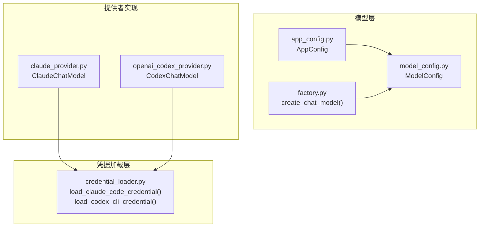
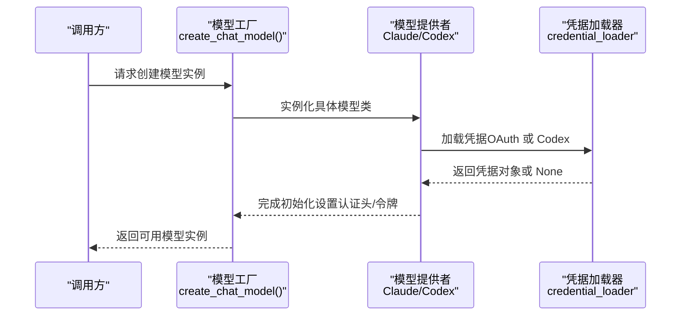
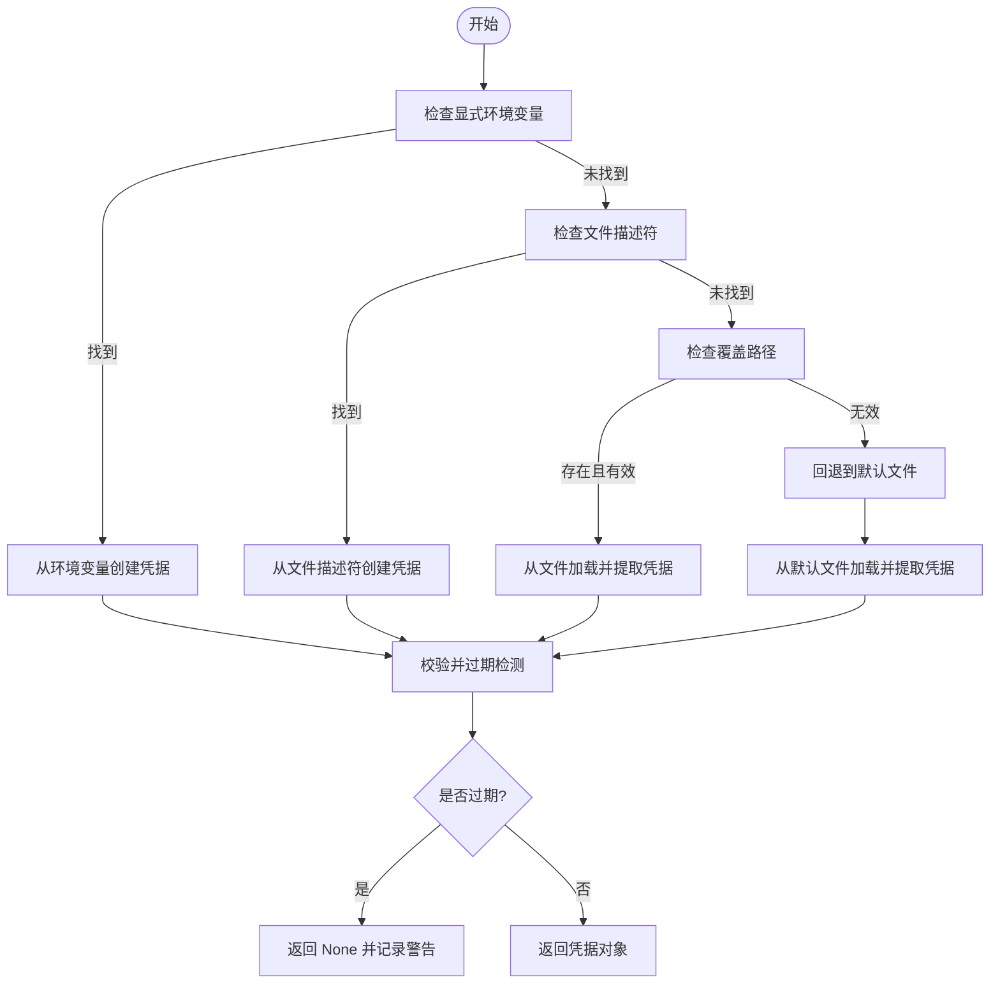
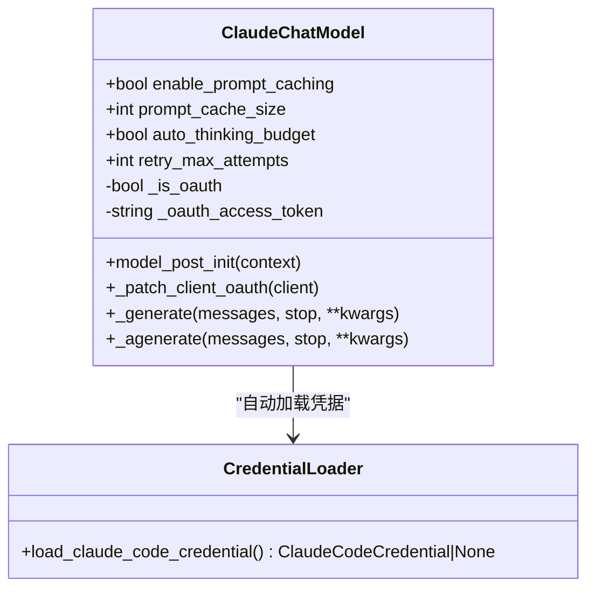
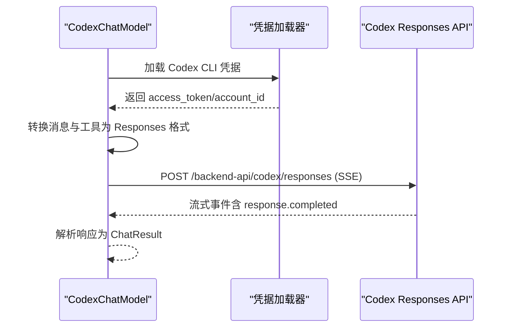
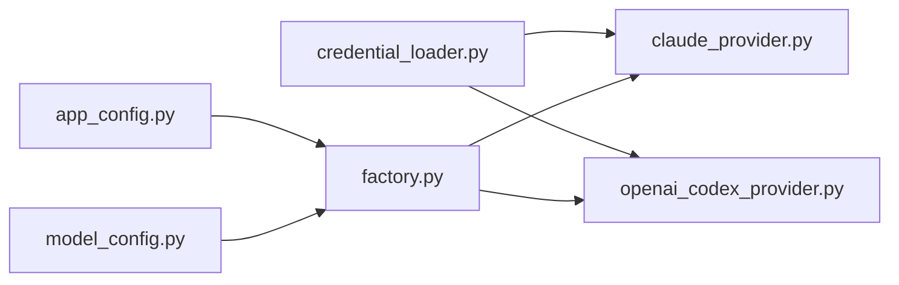

# 凭据加载器

<cite>
**本文引用的文件**
- [credential_loader.py](file://backend/packages/harness/deerflow/models/credential_loader.py)
- [claude_provider.py](file://backend/packages/harness/deerflow/models/claude_provider.py)
- [openai_codex_provider.py](file://backend/packages/harness/deerflow/models/openai_codex_provider.py)
- [factory.py](file://backend/packages/harness/deerflow/models/factory.py)
- [model_config.py](file://backend/packages/harness/deerflow/config/model_config.py)
- [app_config.py](file://backend/packages/harness/deerflow/config/app_config.py)
- [config.example.yaml](file://config.example.yaml)
- [test_credential_loader.py](file://backend/tests/test_credential_loader.py)
</cite>

## 目录
1. [简介](#简介)
2. [项目结构](#项目结构)
3. [核心组件](#核心组件)
4. [架构总览](#架构总览)
5. [详细组件分析](#详细组件分析)
6. [依赖分析](#依赖分析)
7. [性能考虑](#性能考虑)
8. [故障排除指南](#故障排除指南)
9. [结论](#结论)
10. [附录](#附录)

## 简介
本文件系统性阐述 DeerFlow 凭据加载器的设计原理与实现细节，覆盖凭据获取、验证与缓存策略；详述支持的凭据来源（环境变量、配置文件、密钥管理服务等）；明确凭据格式要求与安全处理机制；给出凭据轮换与失效处理策略；提供配置示例与故障排除指南，并说明凭据加载器与各模型提供者的集成关系。

## 项目结构
凭据加载器位于后端 harness 包中，围绕 Claude Code OAuth 与 Codex CLI 两种主流来源构建，同时为后续扩展到其他密钥管理服务预留接口。关键文件如下：
- 凭据加载核心：credential_loader.py
- 模型提供者集成：claude_provider.py、openai_codex_provider.py
- 模型工厂与配置：factory.py、model_config.py、app_config.py
- 示例配置：config.example.yaml
- 单元测试：test_credential_loader.py

图表来源
- [factory.py:11-96](file://backend/packages/harness/deerflow/models/factory.py#L11-L96)
- [model_config.py:4-38](file://backend/packages/harness/deerflow/config/model_config.py#L4-L38)
- [app_config.py:30-334](file://backend/packages/harness/deerflow/config/app_config.py#L30-L334)
- [credential_loader.py:142-213](file://backend/packages/harness/deerflow/models/credential_loader.py#L142-L213)
- [claude_provider.py:31-263](file://backend/packages/harness/deerflow/models/claude_provider.py#L31-L263)
- [openai_codex_provider.py:33-397](file://backend/packages/harness/deerflow/models/openai_codex_provider.py#L33-L397)

章节来源
- [credential_loader.py:1-213](file://backend/packages/harness/deerflow/models/credential_loader.py#L1-L213)
- [claude_provider.py:1-263](file://backend/packages/harness/deerflow/models/claude_provider.py#L1-L263)
- [openai_codex_provider.py:1-397](file://backend/packages/harness/deerflow/models/openai_codex_provider.py#L1-L397)
- [factory.py:1-96](file://backend/packages/harness/deerflow/models/factory.py#L1-L96)
- [model_config.py:1-38](file://backend/packages/harness/deerflow/config/model_config.py#L1-L38)
- [app_config.py:1-334](file://backend/packages/harness/deerflow/config/app_config.py#L1-L334)
- [config.example.yaml:1-624](file://config.example.yaml#L1-L624)

## 核心组件
- 凭据加载器（credential_loader.py）
  - 支持两类凭据来源：Claude Code OAuth 与 Codex CLI
  - 提供多级查找策略：显式环境变量、文件描述符、自定义路径、默认文件
  - 对 OAuth 令牌进行过期检测与日志提示
- 模型提供者（claude_provider.py、openai_codex_provider.py）
  - 在初始化阶段自动调用凭据加载器
  - 针对 OAuth 令牌设置 Bearer 认证头与必要 beta 头
  - Codex 提供者直接使用凭据访问 Responses API
- 模型工厂与配置（factory.py、model_config.py、app_config.py）
  - 工厂根据配置动态创建模型实例
  - 配置解析支持环境变量替换与热重载
- 示例配置（config.example.yaml）
  - 展示如何在配置中引用环境变量作为 API Key
  - 为不同模型提供参考配置项

章节来源
- [credential_loader.py:142-213](file://backend/packages/harness/deerflow/models/credential_loader.py#L142-L213)
- [claude_provider.py:56-107](file://backend/packages/harness/deerflow/models/claude_provider.py#L56-L107)
- [openai_codex_provider.py:59-71](file://backend/packages/harness/deerflow/models/openai_codex_provider.py#L59-L71)
- [factory.py:11-96](file://backend/packages/harness/deerflow/models/factory.py#L11-L96)
- [model_config.py:4-38](file://backend/packages/harness/deerflow/config/model_config.py#L4-L38)
- [app_config.py:74-131](file://backend/packages/harness/deerflow/config/app_config.py#L74-L131)
- [config.example.yaml:52-82](file://config.example.yaml#L52-L82)

## 架构总览
凭据加载器与模型提供者的交互流程如下：

图表来源
- [factory.py:11-96](file://backend/packages/harness/deerflow/models/factory.py#L11-L96)
- [claude_provider.py:56-107](file://backend/packages/harness/deerflow/models/claude_provider.py#L56-L107)
- [openai_codex_provider.py:59-71](file://backend/packages/harness/deerflow/models/openai_codex_provider.py#L59-L71)
- [credential_loader.py:142-213](file://backend/packages/harness/deerflow/models/credential_loader.py#L142-L213)

## 详细组件分析

### 凭据加载器（credential_loader.py）
- 设计目标
  - 自动从多种来源加载 Claude Code OAuth 与 Codex CLI 凭据
  - 统一凭据数据结构，便于上层提供者消费
  - 提供安全与可审计的日志记录
- 关键数据结构
  - ClaudeCodeCredential：包含访问令牌、刷新令牌、过期时间与来源
  - CodexCliCredential：包含访问令牌与账户 ID
- 凭据来源与优先级
  - Claude Code OAuth
    - 显式环境变量：$CLAUDE_CODE_OAUTH_TOKEN 或 $ANTHROPIC_AUTH_TOKEN
    - 文件描述符：$CLAUDE_CODE_OAUTH_TOKEN_FILE_DESCRIPTOR
    - 覆盖路径：$CLAUDE_CODE_CREDENTIALS_PATH
    - 默认文件：~/.claude/.credentials.json
  - Codex CLI
    - 默认文件：~/.codex/auth.json
    - 可通过 $CODEX_AUTH_PATH 覆盖
- 过期检测与安全处理
  - Claude Code OAuth 凭据包含 expiresAt 字段，加载时进行过期判断与警告
  - 读取文件与环境变量时进行异常捕获与日志记录
- 错误处理与回退
  - 当覆盖路径无效时，自动回退到默认文件
  - 对目录路径与非 JSON 内容进行防御性处理

图表来源
- [credential_loader.py:142-188](file://backend/packages/harness/deerflow/models/credential_loader.py#L142-L188)
- [credential_loader.py:191-213](file://backend/packages/harness/deerflow/models/credential_loader.py#L191-L213)

章节来源
- [credential_loader.py:29-57](file://backend/packages/harness/deerflow/models/credential_loader.py#L29-L57)
- [credential_loader.py:59-63](file://backend/packages/harness/deerflow/models/credential_loader.py#L59-L63)
- [credential_loader.py:66-78](file://backend/packages/harness/deerflow/models/credential_loader.py#L66-L78)
- [credential_loader.py:81-98](file://backend/packages/harness/deerflow/models/credential_loader.py#L81-L98)
- [credential_loader.py:108-118](file://backend/packages/harness/deerflow/models/credential_loader.py#L108-L118)
- [credential_loader.py:121-139](file://backend/packages/harness/deerflow/models/credential_loader.py#L121-L139)
- [credential_loader.py:142-188](file://backend/packages/harness/deerflow/models/credential_loader.py#L142-L188)
- [credential_loader.py:191-213](file://backend/packages/harness/deerflow/models/credential_loader.py#L191-L213)

### 模型提供者与凭据加载器集成

#### Claude 提供者（claude_provider.py）
- 初始化流程
  - 若当前未配置标准 API Key，则尝试自动加载 Claude Code OAuth 凭据
  - 检测 OAuth 令牌前缀，设置 Bearer 认证头与必需的 beta 头
  - 对 OAuth 令牌禁用提示缓存以满足平台限制
- 生成请求时的 OAuth 修补
  - 在同步与异步生成前，确保客户端使用 auth_token 替代 api_key
- 重试与退避
  - 针对限流与内部错误进行指数退避重试

图表来源
- [claude_provider.py:31-107](file://backend/packages/harness/deerflow/models/claude_provider.py#L31-L107)
- [credential_loader.py:142-188](file://backend/packages/harness/deerflow/models/credential_loader.py#L142-L188)

章节来源
- [claude_provider.py:56-107](file://backend/packages/harness/deerflow/models/claude_provider.py#L56-L107)
- [claude_provider.py:115-120](file://backend/packages/harness/deerflow/models/claude_provider.py#L115-L120)
- [claude_provider.py:195-245](file://backend/packages/harness/deerflow/models/claude_provider.py#L195-L245)

#### Codex 提供者（openai_codex_provider.py）
- 初始化流程
  - 自动加载 Codex CLI 凭据（access_token 与 account_id）
  - 若未找到凭据则抛出错误
- 请求转换与响应解析
  - 将 LangChain 消息转换为 Responses API 格式
  - 使用 SSE 流式接收响应并解析最终结果
  - 支持工具调用参数解析与错误标注
- 重试与退避
  - 针对特定状态码进行指数退避重试

图表来源
- [openai_codex_provider.py:59-71](file://backend/packages/harness/deerflow/models/openai_codex_provider.py#L59-L71)
- [openai_codex_provider.py:105-146](file://backend/packages/harness/deerflow/models/openai_codex_provider.py#L105-L146)
- [openai_codex_provider.py:173-231](file://backend/packages/harness/deerflow/models/openai_codex_provider.py#L173-L231)
- [openai_codex_provider.py:280-340](file://backend/packages/harness/deerflow/models/openai_codex_provider.py#L280-L340)

章节来源
- [openai_codex_provider.py:59-71](file://backend/packages/harness/deerflow/models/openai_codex_provider.py#L59-L71)
- [openai_codex_provider.py:105-146](file://backend/packages/harness/deerflow/models/openai_codex_provider.py#L105-L146)
- [openai_codex_provider.py:173-231](file://backend/packages/harness/deerflow/models/openai_codex_provider.py#L173-L231)
- [openai_codex_provider.py:280-340](file://backend/packages/harness/deerflow/models/openai_codex_provider.py#L280-L340)

### 配置与工厂（factory.py、model_config.py、app_config.py）
- 配置解析
  - 支持环境变量占位符（如 $OPENAI_API_KEY），并在运行时解析
  - 自动热重载配置文件，基于文件修改时间判断
- 模型工厂
  - 根据配置动态创建模型实例
  - 支持思维模式与推理强度等高级参数的合并与传递
- 模型配置
  - 定义模型名称、显示名、use 类路径、是否支持思维/视觉等字段

章节来源
- [app_config.py:74-131](file://backend/packages/harness/deerflow/config/app_config.py#L74-L131)
- [app_config.py:179-201](file://backend/packages/harness/deerflow/config/app_config.py#L179-L201)
- [app_config.py:263-288](file://backend/packages/harness/deerflow/config/app_config.py#L263-L288)
- [factory.py:11-96](file://backend/packages/harness/deerflow/models/factory.py#L11-L96)
- [model_config.py:4-38](file://backend/packages/harness/deerflow/config/model_config.py#L4-L38)

## 依赖分析
- 凭据加载器独立于外部密钥管理系统，仅依赖本地文件与环境变量
- 模型提供者依赖凭据加载器进行运行时凭据注入
- 工厂与配置模块负责统一的模型实例化与参数传递

图表来源
- [credential_loader.py:142-213](file://backend/packages/harness/deerflow/models/credential_loader.py#L142-L213)
- [claude_provider.py:60-64](file://backend/packages/harness/deerflow/models/claude_provider.py#L60-L64)
- [openai_codex_provider.py:25](file://backend/packages/harness/deerflow/models/openai_codex_provider.py#L25)
- [app_config.py:30-42](file://backend/packages/harness/deerflow/config/app_config.py#L30-L42)
- [factory.py:11-40](file://backend/packages/harness/deerflow/models/factory.py#L11-L40)

章节来源
- [credential_loader.py:142-213](file://backend/packages/harness/deerflow/models/credential_loader.py#L142-L213)
- [claude_provider.py:60-64](file://backend/packages/harness/deerflow/models/claude_provider.py#L60-L64)
- [openai_codex_provider.py:25](file://backend/packages/harness/deerflow/models/openai_codex_provider.py#L25)
- [factory.py:11-40](file://backend/packages/harness/deerflow/models/factory.py#L11-L40)
- [app_config.py:30-42](file://backend/packages/harness/deerflow/config/app_config.py#L30-L42)

## 性能考虑
- 凭据加载为一次性操作，通常发生在模型初始化阶段，开销极低
- 文件读取与 JSON 解析采用最小化 IO 与异常捕获，避免阻塞
- OAuth 令牌过期检测在加载时完成，减少运行时失败概率
- Codex 提供者使用 SSE 流式响应，降低内存峰值并提升感知延迟表现

## 故障排除指南
- 常见问题与定位
  - 无法加载 Claude Code OAuth 凭据
    - 检查环境变量是否正确设置（$CLAUDE_CODE_OAUTH_TOKEN、$ANTHROPIC_AUTH_TOKEN、$CLAUDE_CODE_OAUTH_TOKEN_FILE_DESCRIPTOR）
    - 确认覆盖路径或默认文件是否存在且为文件而非目录
    - 查看日志中关于过期的警告信息
  - 无法加载 Codex CLI 凭据
    - 确认 ~/.codex/auth.json 或 $CODEX_AUTH_PATH 指向的文件存在且为有效 JSON
    - 支持旧版顶层字段与新版 tokens 嵌套结构
  - 模型初始化失败
    - 确认配置文件中的 API Key 引用的环境变量已正确设置
    - 检查配置版本与示例文件一致性
- 单元测试参考
  - 测试覆盖了环境变量、文件描述符、覆盖路径、默认文件、目录路径与回退逻辑
  - Codex CLI 支持嵌套 tokens 与旧版顶层字段

章节来源
- [test_credential_loader.py:20-60](file://backend/tests/test_credential_loader.py#L20-L60)
- [test_credential_loader.py:62-123](file://backend/tests/test_credential_loader.py#L62-L123)
- [test_credential_loader.py:125-157](file://backend/tests/test_credential_loader.py#L125-L157)

## 结论
凭据加载器通过清晰的来源优先级与健壮的错误处理，实现了对 Claude Code OAuth 与 Codex CLI 的无缝支持。配合模型提供者的自动注入与工厂的统一实例化，形成了高可用、易维护的凭据体系。建议在生产环境中结合配置热重载与日志监控，确保凭据变更的及时生效与问题快速定位。

## 附录

### 凭据来源与格式要求
- Claude Code OAuth
  - 来源：环境变量、文件描述符、自定义路径、默认文件
  - 格式：包含 accessToken、可选 refreshToken、expiresAt
  - 过期检测：加载时判断并记录警告
- Codex CLI
  - 来源：~/.codex/auth.json 或 $CODEX_AUTH_PATH
  - 格式：支持旧版顶层字段与新版 tokens 嵌套结构
  - 输出：access_token 与 account_id

章节来源
- [credential_loader.py:142-188](file://backend/packages/harness/deerflow/models/credential_loader.py#L142-L188)
- [credential_loader.py:191-213](file://backend/packages/harness/deerflow/models/credential_loader.py#L191-L213)

### 安全处理机制
- OAuth 令牌识别：通过令牌前缀判定
- Bearer 认证头：为 OAuth 令牌设置 Authorization: Bearer
- 必需 beta 头：为 Claude Code OAuth 设置特定 anthropic-beta 头
- 日志记录：对缺失、过期、读取失败等情况进行记录

章节来源
- [claude_provider.py:86-98](file://backend/packages/harness/deerflow/models/claude_provider.py#L86-L98)
- [credential_loader.py:29-31](file://backend/packages/harness/deerflow/models/credential_loader.py#L29-L31)

### 凭据轮换与失效处理策略
- 轮换策略
  - Claude Code OAuth：通过 CLI 刷新令牌后重新加载
  - Codex CLI：更新 ~/.codex/auth.json 后由工厂热重载生效
- 失效处理
  - 加载时检测过期并记录警告
  - 提供回退到默认文件的能力
  - 模型初始化阶段若未找到凭据则抛出错误

章节来源
- [credential_loader.py:135-137](file://backend/packages/harness/deerflow/models/credential_loader.py#L135-L137)
- [credential_loader.py:96-98](file://backend/packages/harness/deerflow/models/credential_loader.py#L96-L98)
- [openai_codex_provider.py:63-69](file://backend/packages/harness/deerflow/models/openai_codex_provider.py#L63-L69)

### 配置示例与最佳实践
- 在配置文件中引用环境变量作为 API Key
- 使用覆盖路径指向自定义凭据文件
- 开启配置热重载以便在不重启服务的情况下应用变更

章节来源
- [config.example.yaml:52-82](file://config.example.yaml#L52-L82)
- [app_config.py:263-288](file://backend/packages/harness/deerflow/config/app_config.py#L263-L288)