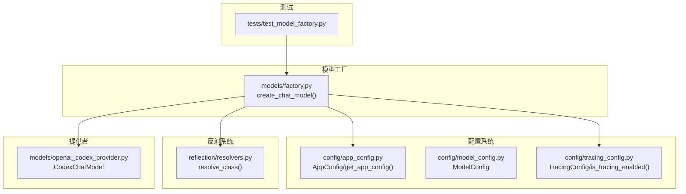
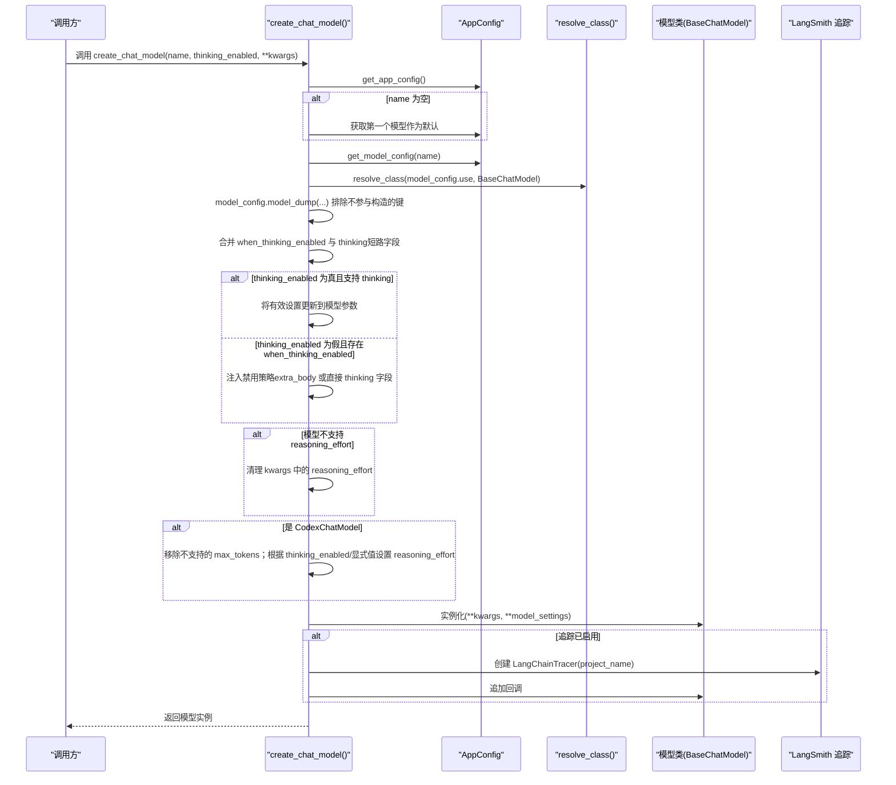
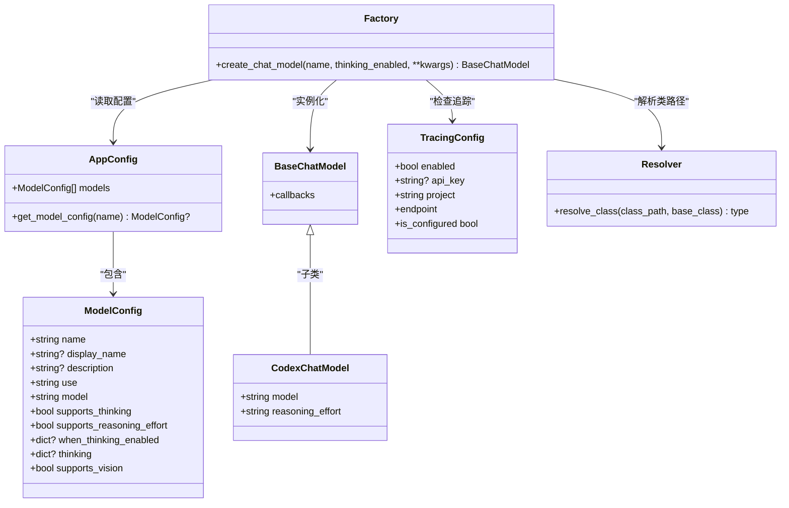

# 模型工厂

<cite>
**本文引用的文件列表**
- [factory.py](file://backend/packages/harness/deerflow/models/factory.py)
- [model_config.py](file://backend/packages/harness/deerflow/config/model_config.py)
- [app_config.py](file://backend/packages/harness/deerflow/config/app_config.py)
- [tracing_config.py](file://backend/packages/harness/deerflow/config/tracing_config.py)
- [resolvers.py](file://backend/packages/harness/deerflow/reflection/resolvers.py)
- [openai_codex_provider.py](file://backend/packages/harness/deerflow/models/openai_codex_provider.py)
- [test_model_factory.py](file://backend/tests/test_model_factory.py)
- [ARCHITECTURE.md](file://backend/docs/ARCHITECTURE.md)
</cite>

## 目录
1. [简介](#简介)
2. [项目结构](#项目结构)
3. [核心组件](#核心组件)
4. [架构总览](#架构总览)
5. [详细组件分析](#详细组件分析)
6. [依赖关系分析](#依赖关系分析)
7. [性能与可扩展性](#性能与可扩展性)
8. [故障排查指南](#故障排查指南)
9. [结论](#结论)
10. [附录：使用示例与最佳实践](#附录使用示例与最佳实践)

## 简介
本文件系统性阐述 DeerFlow 模型工厂的设计与实现，重点围绕 create_chat_model 的工作流程，覆盖以下主题：
- 配置解析与模型选择
- 类解析与实例化
- 参数合并策略（含 thinking 短路字段 when_thinking_enabled 与 thinking 的合并）
- 推理努力级别（reasoning effort）映射与配置
- LangSmith 追踪集成与错误处理
- 使用示例与最佳实践

## 项目结构
模型工厂位于后端 harness 包中，配合配置系统、反射系统与追踪配置共同完成模型实例化与运行期行为控制。

图表来源
- [factory.py:11-95](file://backend/packages/harness/deerflow/models/factory.py#L11-L95)
- [app_config.py:203-212](file://backend/packages/harness/deerflow/config/app_config.py#L203-L212)
- [model_config.py:4-37](file://backend/packages/harness/deerflow/config/model_config.py#L4-L37)
- [tracing_config.py:89-94](file://backend/packages/harness/deerflow/config/tracing_config.py#L89-L94)
- [resolvers.py:73-95](file://backend/packages/harness/deerflow/reflection/resolvers.py#L73-L95)
- [openai_codex_provider.py:33-46](file://backend/packages/harness/deerflow/models/openai_codex_provider.py#L33-L46)
- [test_model_factory.py:1-625](file://backend/tests/test_model_factory.py#L1-L625)

章节来源
- [factory.py:11-95](file://backend/packages/harness/deerflow/models/factory.py#L11-L95)
- [app_config.py:203-212](file://backend/packages/harness/deerflow/config/app_config.py#L203-L212)
- [model_config.py:4-37](file://backend/packages/harness/deerflow/config/model_config.py#L4-L37)
- [tracing_config.py:89-94](file://backend/packages/harness/deerflow/config/tracing_config.py#L89-L94)
- [resolvers.py:73-95](file://backend/packages/harness/deerflow/reflection/resolvers.py#L73-L95)
- [openai_codex_provider.py:33-46](file://backend/packages/harness/deerflow/models/openai_codex_provider.py#L33-L46)
- [test_model_factory.py:1-625](file://backend/tests/test_model_factory.py#L1-L625)

## 核心组件
- 模型工厂函数 create_chat_model：负责从配置中解析模型、解析类路径、合并参数、实例化模型，并在需要时附加 LangSmith 追踪。
- 配置模型 ModelConfig：描述单个模型的配置项，包括支持的特性（如 thinking、reasoning effort、vision）、类路径、以及 when_thinking_enabled 和 thinking 等关键字段。
- 应用配置 AppConfig：提供 get_model_config(name) 用于按名称获取模型配置。
- 反射 resolve_class：将字符串类路径解析为实际类类型，确保其为 BaseChatModel 的子类。
- 追踪配置 TracingConfig：提供 is_tracing_enabled() 与 get_tracing_config()，用于判断是否启用 LangSmith 并获取项目名。
- 提供者 CodexChatModel：特定模型提供者，对推理努力级别有特殊处理。

章节来源
- [factory.py:11-95](file://backend/packages/harness/deerflow/models/factory.py#L11-L95)
- [model_config.py:4-37](file://backend/packages/harness/deerflow/config/model_config.py#L4-L37)
- [app_config.py:203-212](file://backend/packages/harness/deerflow/config/app_config.py#L203-L212)
- [resolvers.py:73-95](file://backend/packages/harness/deerflow/reflection/resolvers.py#L73-L95)
- [tracing_config.py:89-94](file://backend/packages/harness/deerflow/config/tracing_config.py#L89-L94)
- [openai_codex_provider.py:33-46](file://backend/packages/harness/deerflow/models/openai_codex_provider.py#L33-L46)

## 架构总览
下面的序列图展示了 create_chat_model 的完整调用链与关键决策点。

图表来源
- [factory.py:11-95](file://backend/packages/harness/deerflow/models/factory.py#L11-L95)
- [resolvers.py:73-95](file://backend/packages/harness/deerflow/reflection/resolvers.py#L73-L95)
- [tracing_config.py:89-94](file://backend/packages/harness/deerflow/config/tracing_config.py#L89-L94)
- [openai_codex_provider.py:67-78](file://backend/packages/harness/deerflow/models/openai_codex_provider.py#L67-L78)

## 详细组件分析

### create_chat_model 工作流详解
- 配置解析与模型选择
  - 通过 get_app_config() 获取全局配置。
  - 若未指定 name，则取配置中的第一个模型作为默认。
  - 通过 get_model_config(name) 获取目标模型配置，若不存在则抛出异常。
- 类解析与校验
  - 使用 resolve_class(model_config.use, BaseChatModel) 解析类路径，确保返回的类是 BaseChatModel 的子类。
- 参数提取与排除
  - 对模型配置执行 model_dump(exclude=...)，排除 use、name、display_name、description、supports_*、when_thinking_enabled、thinking、supports_vision 等非构造参数字段。
- thinking 模式处理
  - 计算 effective_wte：将 when_thinking_enabled 与 thinking（短路字段）进行合并。当两者都存在时，thinking 会覆盖或补充 thinking 键下的设置。
  - 当 thinking_enabled 为真且模型声明支持 thinking 时，将 effective_wte 合并进最终参数。
  - 当 thinking_enabled 为假且存在 when_thinking_enabled 时，注入禁用策略：
    - 若配置位于 extra_body（OpenAI 兼容网关），则设置 extra_body.thinking.type 为 disabled，并将 reasoning_effort 设为 minimal。
    - 若配置为直接参数（如 langchain_anthropic），则设置 thinking.type 为 disabled，不触及其他字段。
- reasoning effort 映射与清理
  - 若模型不支持 reasoning_effort，且 kwargs 中包含该键，则删除之。
  - 对 CodexChatModel 特例：
    - 移除可能被拒绝的 max_tokens。
    - 若 thinking_enabled 为假，设置 reasoning_effort 为 none。
    - 若显式传入 reasoning_effort（low/medium/high/xhigh），优先采用。
    - 否则默认 medium。
- 实例化与追踪
  - 使用合并后的参数实例化模型类。
  - 若 is_tracing_enabled() 为真，创建 LangChainTracer 并追加到模型 callbacks 中。

章节来源
- [factory.py:11-95](file://backend/packages/harness/deerflow/models/factory.py#L11-L95)

### 思考模式（thinking mode）处理逻辑
- when_thinking_enabled 与 thinking 的合并
  - effective_wte 初始化为 when_thinking_enabled（若存在）。
  - 若提供了 thinking（短路字段），将其与 effective_wte["thinking"] 做字典合并，形成最终的 thinking 设置。
- 启用与禁用分支
  - 启用：仅当 supports_thinking 为真时才允许启用；否则抛出异常。
  - 禁用：根据配置位置自动注入禁用策略，避免将原始 thinking 设置透传给模型构造器。
- 测试覆盖
  - 支持 thinking_enabled=True/False 的多种组合与格式（extra_body 与直接参数）。
  - 验证 thinking 短路字段与 when_thinking_enabled 的合并与泄漏防护。

章节来源
- [factory.py:41-62](file://backend/packages/harness/deerflow/models/factory.py#L41-L62)
- [test_model_factory.py:109-234](file://backend/tests/test_model_factory.py#L109-L234)

### 推理努力级别（reasoning effort）映射与配置
- 通用规则
  - 若模型不支持 reasoning_effort，且外部传入了该键，则在实例化前删除。
- CodexChatModel 特例
  - 移除 max_tokens（Codex Responses API 不接受）。
  - thinking_enabled=False 时设为 none。
  - 显式传入 low/medium/high/xhigh 时保留。
  - 默认 medium。
- 测试覆盖
  - 验证禁用、显式传入与默认值的行为。

章节来源
- [factory.py:64-78](file://backend/packages/harness/deerflow/models/factory.py#L64-L78)
- [openai_codex_provider.py:173-184](file://backend/packages/harness/deerflow/models/openai_codex_provider.py#L173-L184)
- [test_model_factory.py:515-594](file://backend/tests/test_model_factory.py#L515-L594)

### LangSmith 追踪集成与错误处理
- 追踪启用条件
  - 通过 is_tracing_enabled() 判断是否启用 LangSmith。
- 追踪配置
  - 通过 get_tracing_config() 获取项目名等信息。
- 追踪挂载
  - 创建 LangChainTracer(project_name=...)，并将回调追加到模型实例的 callbacks 列表。
- 错误处理
  - 追踪挂载过程中捕获异常并记录警告日志，不影响模型实例化。

章节来源
- [factory.py:82-95](file://backend/packages/harness/deerflow/models/factory.py#L82-L95)
- [tracing_config.py:89-94](file://backend/packages/harness/deerflow/config/tracing_config.py#L89-L94)

### 类与依赖关系图

图表来源
- [model_config.py:4-37](file://backend/packages/harness/deerflow/config/model_config.py#L4-L37)
- [app_config.py:30-42](file://backend/packages/harness/deerflow/config/app_config.py#L30-L42)
- [factory.py:11-95](file://backend/packages/harness/deerflow/models/factory.py#L11-L95)
- [tracing_config.py:11-23](file://backend/packages/harness/deerflow/config/tracing_config.py#L11-L23)
- [resolvers.py:73-95](file://backend/packages/harness/deerflow/reflection/resolvers.py#L73-L95)
- [openai_codex_provider.py:33-46](file://backend/packages/harness/deerflow/models/openai_codex_provider.py#L33-L46)

## 依赖关系分析
- 组件耦合
  - create_chat_model 依赖 AppConfig、ModelConfig、resolve_class、TracingConfig。
  - 对 CodexChatModel 的特例处理引入了 openai_codex_provider 的导入与类型判断。
- 外部依赖
  - LangChain BaseChatModel 作为统一接口。
  - LangSmith Tracer 用于运行期追踪。
- 潜在循环依赖
  - 代码中未见循环导入；反射解析与配置加载相互独立。
- 关键接口契约
  - resolve_class 确保返回的类是 BaseChatModel 的子类，避免运行时错误。
  - ModelConfig 的 supports_* 字段用于在启用/禁用逻辑中进行安全校验。

章节来源
- [factory.py:11-95](file://backend/packages/harness/deerflow/models/factory.py#L11-L95)
- [resolvers.py:73-95](file://backend/packages/harness/deerflow/reflection/resolvers.py#L73-L95)
- [app_config.py:203-212](file://backend/packages/harness/deerflow/config/app_config.py#L203-L212)
- [model_config.py:4-37](file://backend/packages/harness/deerflow/config/model_config.py#L4-L37)

## 性能与可扩展性
- 性能特征
  - 配置解析与类解析均为常数时间操作，整体开销极低。
  - 参数合并与字典更新为线性于配置规模，通常非常轻量。
- 可扩展性
  - 新增模型提供者只需遵循 BaseChatModel 接口，并在 config.yaml 中正确配置 use 与相关参数。
  - thinking 与 reasoning effort 的处理通过配置驱动，便于新增模型时复用现有逻辑。
- 注意事项
  - CodexChatModel 的特殊处理（移除 max_tokens、设置 reasoning_effort）应保持在工厂层，避免污染其他提供者的参数。

[本节为通用指导，无需列出章节来源]

## 故障排查指南
- “模型未找到”
  - 现象：抛出 ValueError，提示模型未在配置中找到。
  - 排查：确认 name 是否正确，或未传入时首个模型是否存在。
  - 参考：[factory.py:24-25](file://backend/packages/harness/deerflow/models/factory.py#L24-L25)
- “模型不支持 thinking”
  - 现象：当 thinking_enabled 为真但 supports_thinking 为假时抛错。
  - 排查：在 config.yaml 中将对应模型的 supports_thinking 设为 true。
  - 参考：[factory.py:49-50](file://backend/packages/harness/deerflow/models/factory.py#L49-L50)
- “禁用 thinking 未生效”
  - 现象：未注入禁用策略或参数泄漏。
  - 排查：确认 when_thinking_enabled 的位置（extra_body vs 直接参数），确保未将 thinking 原样透传。
  - 参考：[factory.py:54-61](file://backend/packages/harness/deerflow/models/factory.py#L54-L61)、[test_model_factory.py:148-234](file://backend/tests/test_model_factory.py#L148-L234)
- “reasoning_effort 未生效”
  - 现象：模型不支持该参数或被清理。
  - 排查：确认 supports_reasoning_effort 与模型类型；CodexChatModel 下需遵循工厂映射规则。
  - 参考：[factory.py:61-78](file://backend/packages/harness/deerflow/models/factory.py#L61-L78)、[openai_codex_provider.py:173-184](file://backend/packages/harness/deerflow/models/openai_codex_provider.py#L173-L184)
- “LangSmith 追踪未生效”
  - 现象：日志显示失败或未挂载。
  - 排查：确认 is_tracing_enabled() 为真，检查环境变量与项目名配置。
  - 参考：[factory.py:82-95](file://backend/packages/harness/deerflow/models/factory.py#L82-L95)、[tracing_config.py:89-94](file://backend/packages/harness/deerflow/config/tracing_config.py#L89-L94)

章节来源
- [factory.py:24-25](file://backend/packages/harness/deerflow/models/factory.py#L24-L25)
- [factory.py:49-50](file://backend/packages/harness/deerflow/models/factory.py#L49-L50)
- [factory.py:54-61](file://backend/packages/harness/deerflow/models/factory.py#L54-L61)
- [factory.py:61-78](file://backend/packages/harness/deerflow/models/factory.py#L61-L78)
- [openai_codex_provider.py:173-184](file://backend/packages/harness/deerflow/models/openai_codex_provider.py#L173-L184)
- [tracing_config.py:89-94](file://backend/packages/harness/deerflow/config/tracing_config.py#L89-L94)

## 结论
模型工厂通过“配置驱动 + 反射解析 + 参数合并”的方式，实现了对多模型提供者的统一实例化入口，并在 thinking 与 reasoning effort 等高级特性上提供了细粒度的控制与兼容处理。结合 LangSmith 追踪与完善的错误处理，使得模型工厂既易用又稳健。建议在新增模型时严格遵循 ModelConfig 的字段约定，并在 config.yaml 中明确标注 supports_* 与 when_thinking_enabled/thinking 的配置位置，以获得一致的行为与体验。

[本节为总结性内容，无需列出章节来源]

## 附录：使用示例与最佳实践

### 使用示例
- 基本用法
  - 通过 create_chat_model() 创建模型实例，可传入 name 与 thinking_enabled 控制思考模式。
  - 参考：[test_model_factory.py:84-93](file://backend/tests/test_model_factory.py#L84-L93)
- 启用思考模式
  - 在 config.yaml 中为模型配置 when_thinking_enabled 或 thinking，并在调用时传入 thinking_enabled=True。
  - 参考：[test_model_factory.py:131-141](file://backend/tests/test_model_factory.py#L131-L141)
- 禁用思考模式
  - 传入 thinking_enabled=False，工厂会根据配置位置注入禁用策略。
  - 参考：[test_model_factory.py:148-234](file://backend/tests/test_model_factory.py#L148-L234)
- 推理努力级别
  - 对 CodexChatModel：根据 thinking_enabled 与显式 reasoning_effort 设置。
  - 参考：[test_model_factory.py:515-594](file://backend/tests/test_model_factory.py#L515-L594)

### 最佳实践
- 配置层面
  - 明确标注 supports_thinking 与 supports_reasoning_effort，避免运行时错误。
  - when_thinking_enabled 与 thinking 的配置尽量在同一模型下保持一致性，减少歧义。
- 行为层面
  - thinking_enabled=False 时，不要期望 thinking 短路字段仍会透传到模型构造器。
  - 对 CodexChatModel，避免传入 max_tokens，工厂会自动移除。
- 运行层面
  - 开启 LangSmith 追踪时，确保环境变量配置正确，以便在工厂层自动挂载。
  - 如需调试，可通过日志观察工厂对参数的合并与禁用策略应用情况。

章节来源
- [test_model_factory.py:84-93](file://backend/tests/test_model_factory.py#L84-L93)
- [test_model_factory.py:131-141](file://backend/tests/test_model_factory.py#L131-L141)
- [test_model_factory.py:148-234](file://backend/tests/test_model_factory.py#L148-L234)
- [test_model_factory.py:515-594](file://backend/tests/test_model_factory.py#L515-L594)
- [factory.py:82-95](file://backend/packages/harness/deerflow/models/factory.py#L82-L95)