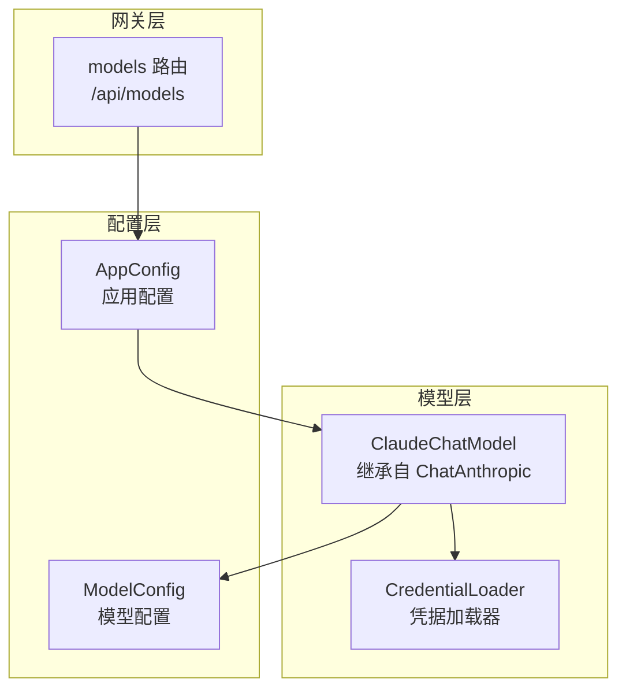
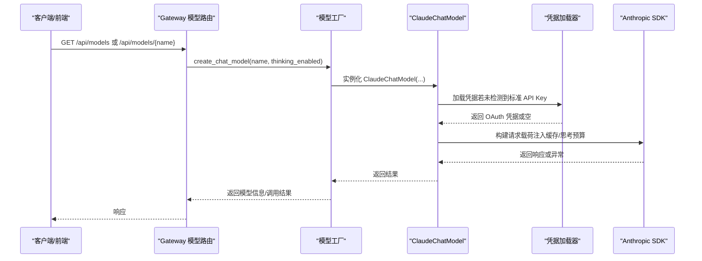
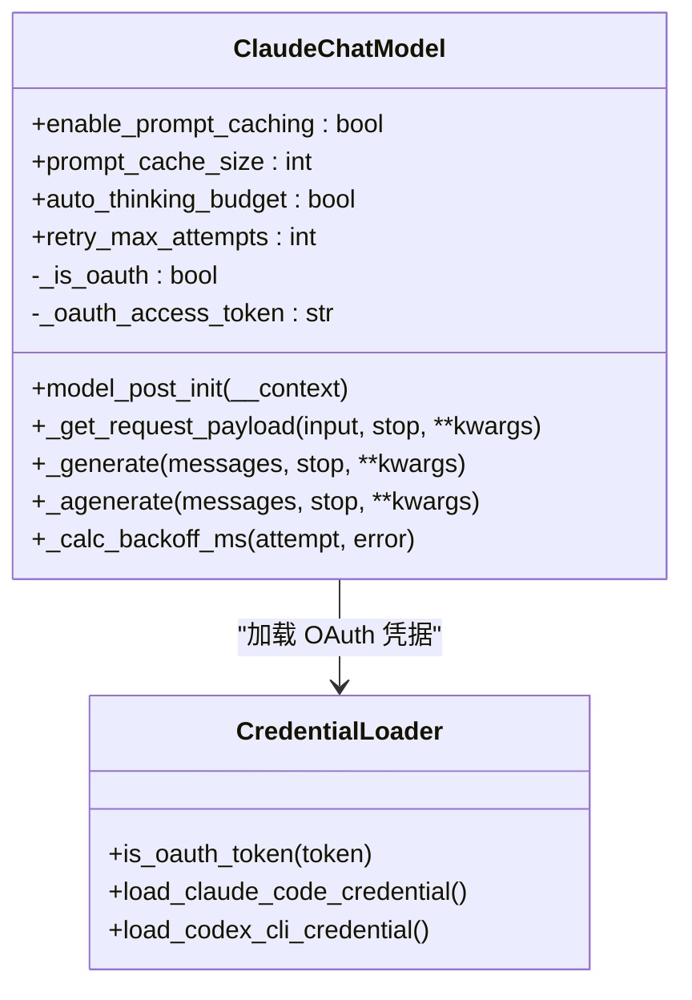
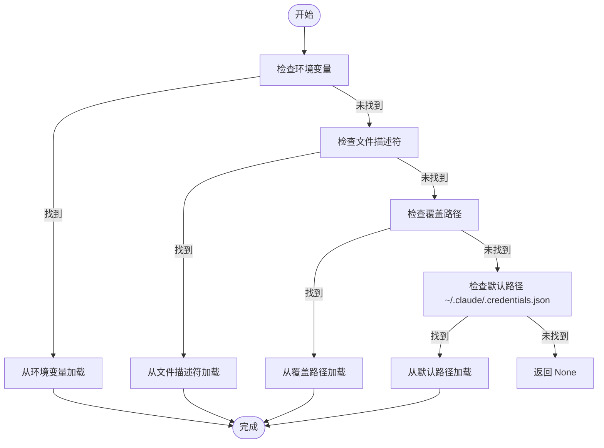
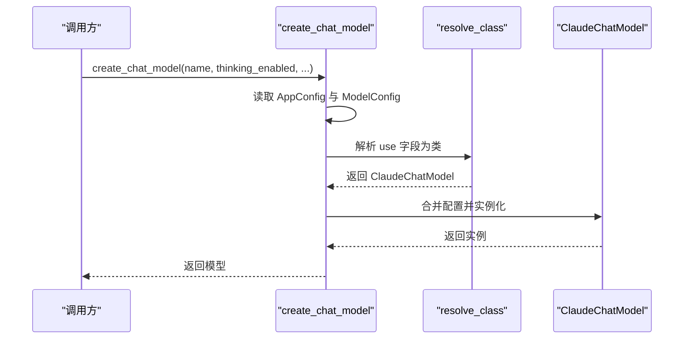
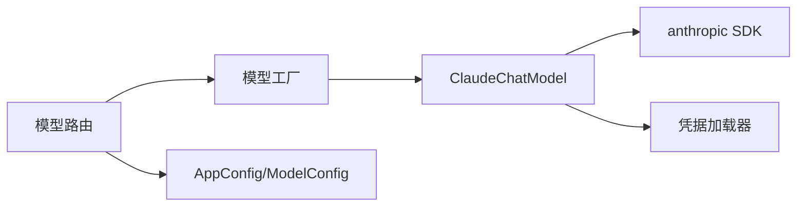

# Claude 提供者

<cite>
**本文引用的文件**
- [claude_provider.py](file://backend/packages/harness/deerflow/models/claude_provider.py)
- [credential_loader.py](file://backend/packages/harness/deerflow/models/credential_loader.py)
- [factory.py](file://backend/packages/harness/deerflow/models/factory.py)
- [model_config.py](file://backend/packages/harness/deerflow/config/model_config.py)
- [CLAUDE.md](file://backend/CLAUDE.md)
- [config.example.yaml](file://config.example.yaml)
- [models.py](file://backend/app/gateway/routers/models.py)
- [export_claude_code_oauth.py](file://scripts/export_claude_code_oauth.py)
- [test_model_factory.py](file://backend/tests/test_model_factory.py)
</cite>

## 目录
1. [简介](#简介)
2. [项目结构](#项目结构)
3. [核心组件](#核心组件)
4. [架构总览](#架构总览)
5. [详细组件分析](#详细组件分析)
6. [依赖关系分析](#依赖关系分析)
7. [性能考虑](#性能考虑)
8. [故障排查指南](#故障排查指南)
9. [结论](#结论)
10. [附录](#附录)

## 简介
本文件面向开发者与运维人员，系统性阐述 deer-flow 中 Claude 提供者的实现架构、认证方式、模型参数配置、响应处理与错误恢复机制，并重点说明 Claude 特有功能（如 OAuth Bearer 认证、提示缓存、智能思考预算分配）以及与工具调用的集成方式。文档同时提供配置示例、使用流程与性能优化建议，帮助在生产环境中稳定、高效地使用 Claude 模型。

## 项目结构
Claude 提供者位于后端 harness 包中，围绕 LangChain 的 ChatAnthropic 进行扩展，提供：
- 自动化凭据加载（支持标准 API Key 与 Claude Code OAuth）
- 请求载荷增强（提示缓存、思考预算）
- 重试与退避（速率限制与内部错误）
- 与模型工厂与配置系统的无缝对接

图表来源
- [claude_provider.py:31-107](file://backend/packages/harness/deerflow/models/claude_provider.py#L31-L107)
- [credential_loader.py:142-188](file://backend/packages/harness/deerflow/models/credential_loader.py#L142-L188)
- [model_config.py:4-37](file://backend/packages/harness/deerflow/config/model_config.py#L4-L37)
- [models.py:32-73](file://backend/app/gateway/routers/models.py#L32-L73)

章节来源
- [CLAUDE.md:105-131](file://backend/CLAUDE.md#L105-L131)
- [config.example.yaml:72-83](file://config.example.yaml#L72-L83)

## 核心组件
- ClaudeChatModel：在 ChatAnthropic 基础上扩展 OAuth Bearer 认证、提示缓存、智能思考预算与重试逻辑。
- CredentialLoader：自动从多种来源加载 Claude Code OAuth 凭据，支持环境变量、文件描述符与本地 JSON 文件。
- 模型工厂：根据配置动态实例化 ClaudeChatModel，并按需注入思考模式参数。
- 配置模型：统一的 ModelConfig 结构，支持 thinking、vision、reasoning_effort 等字段。

章节来源
- [claude_provider.py:31-107](file://backend/packages/harness/deerflow/models/claude_provider.py#L31-L107)
- [credential_loader.py:142-188](file://backend/packages/harness/deerflow/models/credential_loader.py#L142-L188)
- [factory.py:11-95](file://backend/packages/harness/deerflow/models/factory.py#L11-L95)
- [model_config.py:4-37](file://backend/packages/harness/deerflow/config/model_config.py#L4-L37)

## 架构总览
下图展示从配置到模型实例化、凭据加载、请求构建与响应处理的关键路径。

图表来源
- [models.py:32-73](file://backend/app/gateway/routers/models.py#L32-L73)
- [factory.py:11-95](file://backend/packages/harness/deerflow/models/factory.py#L11-L95)
- [claude_provider.py:56-107](file://backend/packages/harness/deerflow/models/claude_provider.py#L56-L107)
- [credential_loader.py:142-188](file://backend/packages/harness/deerflow/models/credential_loader.py#L142-L188)

## 详细组件分析

### ClaudeChatModel 类
- 认证模式
  - 标准 API Key：沿用 ChatAnthropic 默认行为（x-api-key 头）。
  - Claude Code OAuth：通过 is_oauth_token 检测以 sk-ant-oat 开头的令牌，自动切换为 Authorization: Bearer，并注入 anthropic-beta 头。
- 提示缓存
  - 对 system 文本与最近 N 条消息内容添加 cache_control: ephemeral；对最后一条工具定义也进行缓存。
- 智能思考预算
  - 当开启 auto_thinking_budget 且 payload 中存在 thinking 字段时，自动将预算设为 max_tokens 的 80%。
- 重试与退避
  - 对 RateLimitError 与 InternalServerError 执行指数退避（含 20% 随机抖动），最大重试次数可配置。
  - 若响应头包含 Retry-After，则优先使用该值作为等待时间。

图表来源
- [claude_provider.py:31-107](file://backend/packages/harness/deerflow/models/claude_provider.py#L31-L107)
- [credential_loader.py:29-188](file://backend/packages/harness/deerflow/models/credential_loader.py#L29-L188)

章节来源
- [claude_provider.py:121-194](file://backend/packages/harness/deerflow/models/claude_provider.py#L121-L194)
- [claude_provider.py:195-245](file://backend/packages/harness/deerflow/models/claude_provider.py#L195-L245)
- [claude_provider.py:247-262](file://backend/packages/harness/deerflow/models/claude_provider.py#L247-L262)

### 凭据加载器（CredentialLoader）
- 支持的来源与顺序
  - 环境变量：$CLAUDE_CODE_OAUTH_TOKEN 或 $ANTHROPIC_AUTH_TOKEN
  - 文件描述符：$CLAUDE_CODE_OAUTH_TOKEN_FILE_DESCRIPTOR
  - 覆盖路径：$CLAUDE_CODE_CREDENTIALS_PATH
  - 默认路径：~/.claude/.credentials.json
- 数据结构
  - ClaudeCodeCredential：包含 access_token、refresh_token、expires_at、source。
  - 自动过期检查（带 1 分钟缓冲）。
- OAuth 必需头
  - anthropic-beta: oauth-2025-04-20,claude-code-20250219,interleaved-thinking-2025-05-14

图表来源
- [credential_loader.py:142-188](file://backend/packages/harness/deerflow/models/credential_loader.py#L142-L188)

章节来源
- [credential_loader.py:142-188](file://backend/packages/harness/deerflow/models/credential_loader.py#L142-L188)
- [export_claude_code_oauth.py:130-162](file://scripts/export_claude_code_oauth.py#L130-L162)

### 模型工厂与配置
- 工厂职责
  - 读取 AppConfig，定位目标 ModelConfig。
  - 动态解析 use 字段（类路径），构造 ClaudeChatModel 实例。
  - 合并 when_thinking_enabled 与 thinking 字段，按模型类型注入 extra_body 或直接参数。
  - 支持 reasoning_effort 映射（Codex 场景）与 tracing 注入。
- 配置要点
  - supports_thinking / supports_vision / supports_reasoning_effort 控制能力开关。
  - thinking 字段为 when_thinking_enabled 的快捷方式。

图表来源
- [factory.py:11-95](file://backend/packages/harness/deerflow/models/factory.py#L11-L95)
- [model_config.py:4-37](file://backend/packages/harness/deerflow/config/model_config.py#L4-L37)

章节来源
- [factory.py:11-95](file://backend/packages/harness/deerflow/models/factory.py#L11-L95)
- [model_config.py:4-37](file://backend/packages/harness/deerflow/config/model_config.py#L4-L37)
- [test_model_factory.py:109-141](file://backend/tests/test_model_factory.py#L109-L141)

### 网关模型路由
- 提供 /api/models 与 /api/models/{name} 接口，返回模型元数据（名称、显示名、是否支持思考/推理等）。
- 用于前端选择可用模型与展示能力。

章节来源
- [models.py:32-73](file://backend/app/gateway/routers/models.py#L32-L73)
- [models.py:82-116](file://backend/app/gateway/routers/models.py#L82-L116)

## 依赖关系分析
- ClaudeChatModel 依赖 LangChain 的 ChatAnthropic 与 anthropic SDK。
- 凭据加载器独立于模型，但被 ClaudeChatModel 在初始化阶段调用。
- 模型工厂负责装配配置与模型类，不直接依赖具体提供者，具备良好扩展性。
- 网关路由依赖 AppConfig 与模型工厂，向外部暴露模型清单。

图表来源
- [factory.py:11-95](file://backend/packages/harness/deerflow/models/factory.py#L11-L95)
- [claude_provider.py:31-107](file://backend/packages/harness/deerflow/models/claude_provider.py#L31-L107)
- [models.py:32-73](file://backend/app/gateway/routers/models.py#L32-L73)

章节来源
- [factory.py:11-95](file://backend/packages/harness/deerflow/models/factory.py#L11-L95)
- [claude_provider.py:31-107](file://backend/packages/harness/deerflow/models/claude_provider.py#L31-L107)
- [models.py:32-73](file://backend/app/gateway/routers/models.py#L32-L73)

## 性能考虑
- 提示缓存
  - 对 system 与近期消息内容启用临时缓存，减少重复传输与计算开销。
  - 缓存窗口大小可配置（prompt_cache_size），默认 3。
- 智能思考预算
  - 自动将思考预算设为 max_tokens 的 80%，避免过度消耗上下文。
- 重试策略
  - 指数退避 + 抖动，结合 Retry-After 头优先处理，降低抖动与雪崩风险。
- 并发与异步
  - 同步与异步生成均支持 OAuth 切换与重试，保证一致性。

章节来源
- [claude_provider.py:139-194](file://backend/packages/harness/deerflow/models/claude_provider.py#L139-L194)
- [claude_provider.py:200-245](file://backend/packages/harness/deerflow/models/claude_provider.py#L200-L245)

## 故障排查指南
- 速率限制与内部错误
  - 现象：抛出 RateLimitError 或 InternalServerError。
  - 处理：自动重试（最多 retry_max_attempts 次），指数退避 + 抖动；优先使用响应头 Retry-After。
- OAuth 令牌过期
  - 现象：凭据加载器返回已过期提示。
  - 处理：运行 claude CLI 刷新令牌；确认 ~/.claude/.credentials.json 或环境变量正确。
- 缓存块限制
  - 现象：OAuth 令牌限制为 4 个 cache_control 块，提示缓存被禁用。
  - 处理：OAuth 模式下自动关闭提示缓存；如需缓存，请使用标准 API Key。
- 思考预算未生效
  - 现象：payload 中未注入思考预算。
  - 处理：确保 auto_thinking_budget 为真且 payload 存在 thinking 字段；max_tokens 需有效。

章节来源
- [claude_provider.py:96-98](file://backend/packages/harness/deerflow/models/claude_provider.py#L96-L98)
- [claude_provider.py:200-245](file://backend/packages/harness/deerflow/models/claude_provider.py#L200-L245)
- [credential_loader.py:135-137](file://backend/packages/harness/deerflow/models/credential_loader.py#L135-L137)

## 结论
Claude 提供者在保持与 LangChain 生态兼容的同时，增强了 OAuth Bearer 认证、提示缓存与智能思考预算等特性，并提供了稳健的重试与退避机制。通过模型工厂与配置系统，用户可以灵活启用/禁用思考模式、控制视觉能力与推理努力度，满足不同场景下的性能与成本需求。

## 附录

### 配置示例与最佳实践
- 使用标准 API Key
  - 在 config.yaml 中为 Claude 模型配置 api_key，并设置 supports_thinking、supports_vision 等。
- 使用 Claude Code OAuth
  - 通过环境变量或导出文件提供 CLAUDE_CODE_OAUTH_TOKEN 或 ~/.claude/.credentials.json。
  - 确保 anthropic-beta 头已注入（自动处理）。
- 启用提示缓存
  - enable_prompt_caching: true；合理设置 prompt_cache_size。
- 启用智能思考预算
  - auto_thinking_budget: true；确保 max_tokens 合理，避免过度占用。
- 错误恢复
  - retry_max_attempts ≥ 1；结合服务端 Retry-After 头提升稳定性。

章节来源
- [config.example.yaml:72-83](file://config.example.yaml#L72-L83)
- [credential_loader.py:25-26](file://backend/packages/harness/deerflow/models/credential_loader.py#L25-L26)
- [claude_provider.py:42-47](file://backend/packages/harness/deerflow/models/claude_provider.py#L42-L47)

### 使用示例（步骤）
- 步骤 1：准备凭据
  - 方式一：设置 ANTHROPIC_API_KEY（标准 API Key）。
  - 方式二：导出 Claude Code OAuth 至环境变量或 ~/.claude/.credentials.json。
- 步骤 2：配置模型
  - 在 config.yaml 中新增 Claude 模型条目，设置 use、model、api_key（或留空让自动加载）。
- 步骤 3：启用思考/视觉
  - supports_thinking: true/false；supports_vision: true/false；必要时配置 when_thinking_enabled。
- 步骤 4：启动服务
  - 通过 make dev 或分别启动 LangGraph 与 Gateway；访问 /api/models 查看模型清单。
- 步骤 5：调用模型
  - 通过前端或嵌入式客户端发起对话，模型工厂将按配置实例化 ClaudeChatModel 并执行调用。

章节来源
- [CLAUDE.md:429-458](file://backend/CLAUDE.md#L429-L458)
- [models.py:32-73](file://backend/app/gateway/routers/models.py#L32-L73)