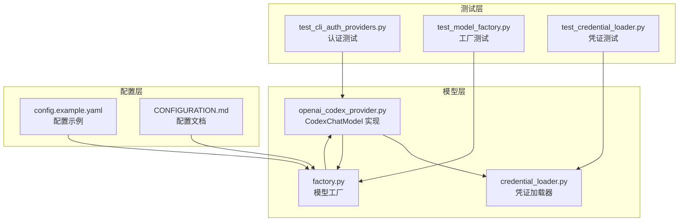
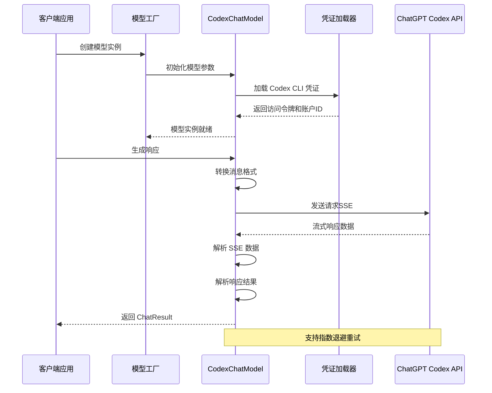
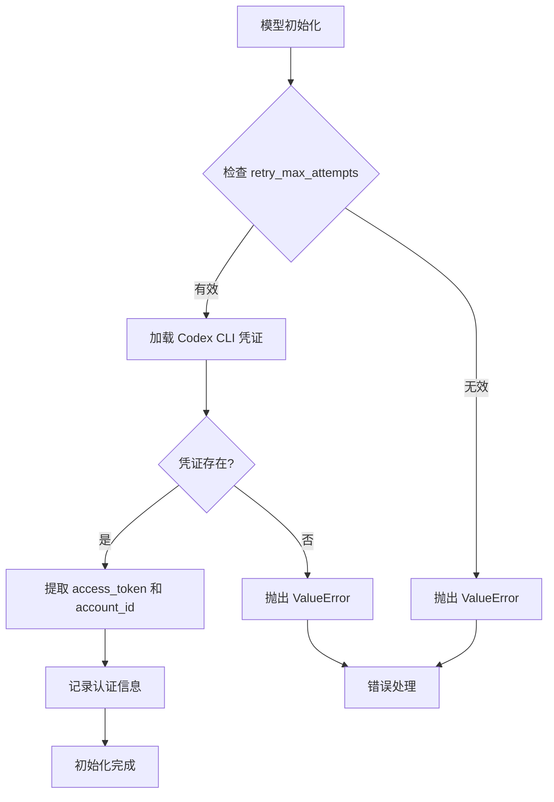
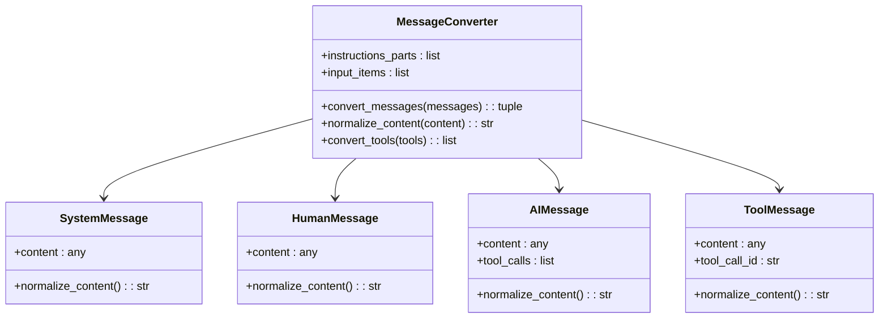
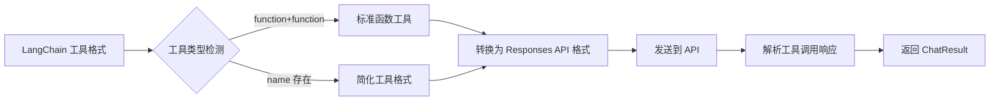
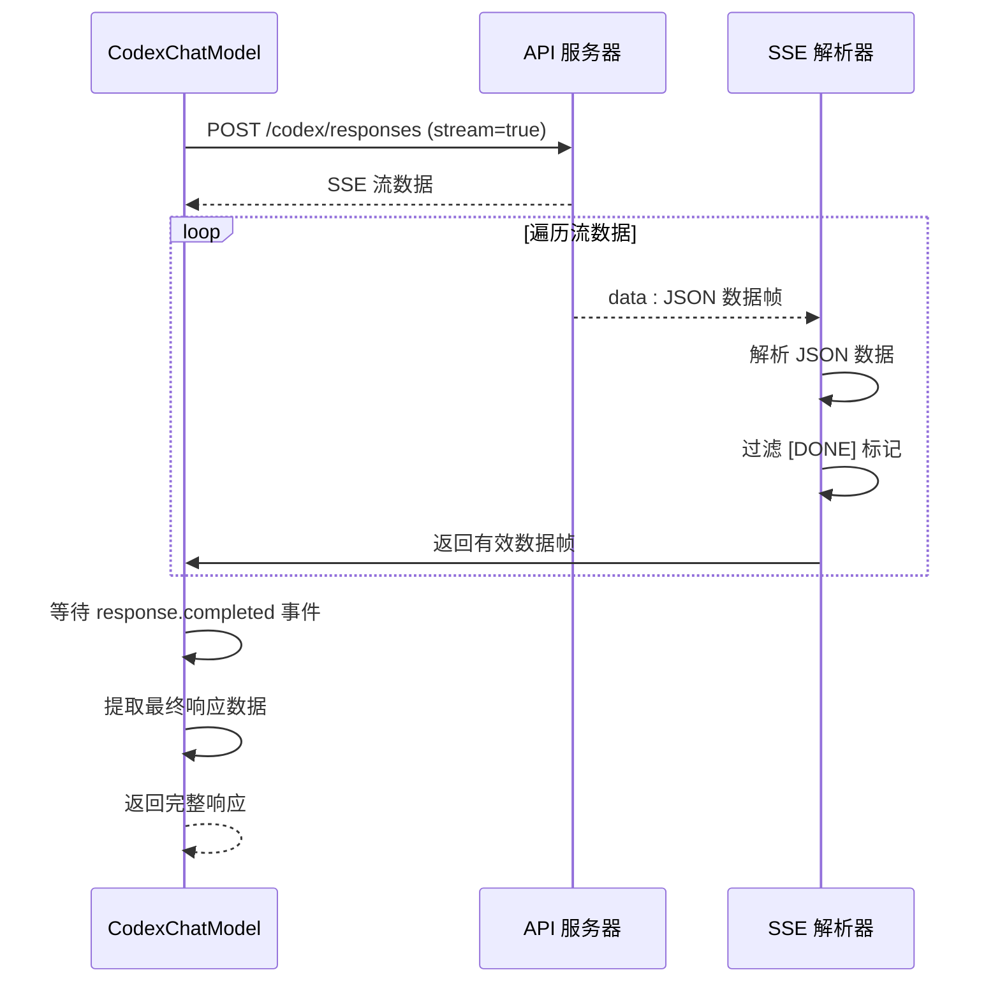
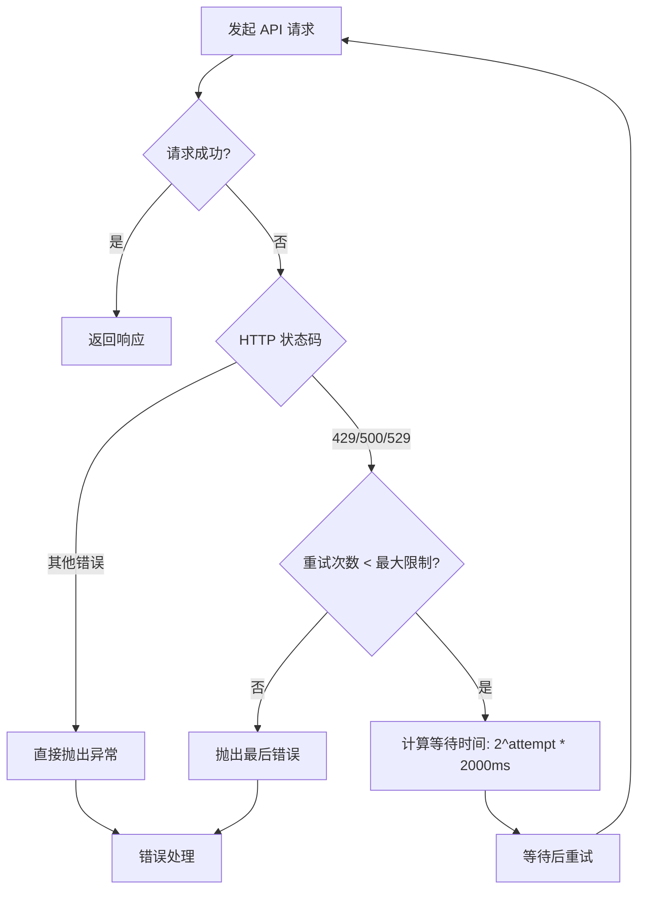
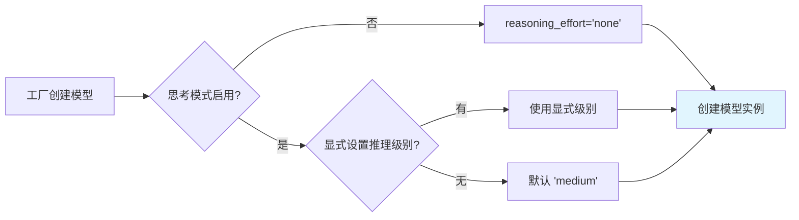
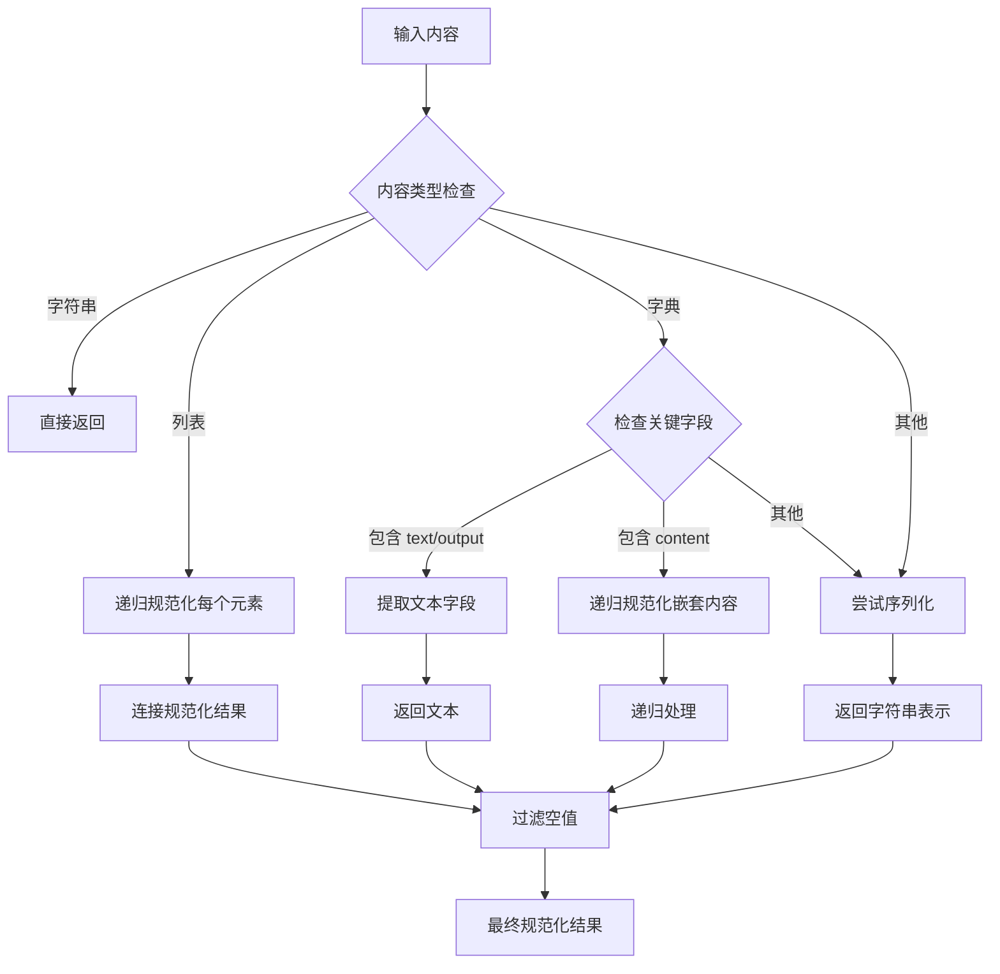
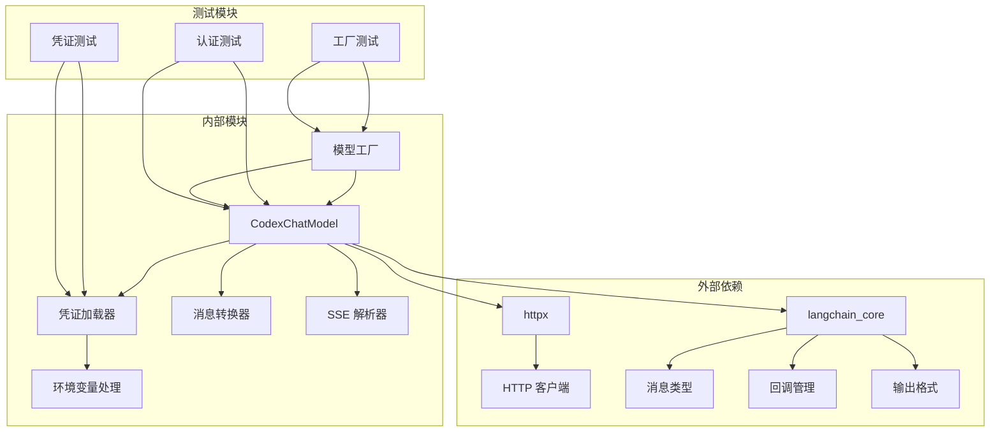

# OpenAI 兼容提供者

<cite>
**本文档引用的文件**
- [openai_codex_provider.py](file://backend/packages/harness/deerflow/models/openai_codex_provider.py)
- [credential_loader.py](file://backend/packages/harness/deerflow/models/credential_loader.py)
- [factory.py](file://backend/packages/harness/deerflow/models/factory.py)
- [test_cli_auth_providers.py](file://backend/tests/test_cli_auth_providers.py)
- [test_model_factory.py](file://backend/tests/test_model_factory.py)
- [test_credential_loader.py](file://backend/tests/test_credential_loader.py)
- [config.example.yaml](file://config.example.yaml)
- [CONFIGURATION.md](file://backend/docs/CONFIGURATION.md)
</cite>

## 目录
1. [简介](#简介)
2. [项目结构](#项目结构)
3. [核心组件](#核心组件)
4. [架构概览](#架构概览)
5. [详细组件分析](#详细组件分析)
6. [依赖关系分析](#依赖关系分析)
7. [性能考虑](#性能考虑)
8. [故障排除指南](#故障排除指南)
9. [结论](#结论)
10. [附录](#附录)

## 简介

本文档为 OpenAI 兼容提供者创建详细的技术文档，重点解释 CodexChatModel 类的实现原理。该类实现了与 ChatGPT Codex Responses API 的兼容，提供了以下核心功能：

- 使用 Codex CLI OAuth 令牌进行认证
- 支持 Responses API 格式（而非 Chat Completions）
- 工具调用支持
- 流式响应处理（SSE）
- 指数退避重试机制
- 推理努力级别的配置
- 内容规范化处理

CodexChatModel 是 DeerFlow 项目中的一个自定义 LangChain 聊天模型，专门用于与 ChatGPT Codex 后端 API 进行交互。

## 项目结构

基于代码库分析，OpenAI 兼容提供者相关的文件主要位于以下位置：



**图表来源**
- [openai_codex_provider.py:1-397](file://backend/packages/harness/deerflow/models/openai_codex_provider.py#L1-L397)
- [credential_loader.py:1-213](file://backend/packages/harness/deerflow/models/credential_loader.py#L1-L213)
- [factory.py:1-96](file://backend/packages/harness/deerflow/models/factory.py#L1-L96)

**章节来源**
- [openai_codex_provider.py:1-50](file://backend/packages/harness/deerflow/models/openai_codex_provider.py#L1-L50)
- [credential_loader.py:1-30](file://backend/packages/harness/deerflow/models/credential_loader.py#L1-L30)
- [factory.py:1-30](file://backend/packages/harness/deerflow/models/factory.py#L1-L30)

## 核心组件

### CodexChatModel 类

CodexChatModel 是实现 OpenAI 兼容提供者的核心类，继承自 LangChain 的 BaseChatModel。其主要特性包括：

- **认证机制**：自动从 `~/.codex/auth.json` 加载 Codex CLI 凭证
- **API 端点**：使用 `https://chatgpt.com/backend-api/codex/responses`
- **消息格式**：支持 Responses API 格式的消息转换
- **工具调用**：原生支持函数调用
- **流式处理**：支持 SSE 流式响应
- **重试机制**：指数退避重试（最多3次）

### 凭证加载系统

凭证加载系统支持多种凭证来源：

- **Codex CLI 凭证**：从 `~/.codex/auth.json` 或通过 `CODEX_AUTH_PATH` 环境变量指定路径
- **支持的凭证格式**：支持嵌套 tokens 结构和传统顶层结构
- **环境变量覆盖**：支持通过环境变量自定义凭证路径

### 模型工厂

模型工厂负责根据配置创建合适的聊天模型实例，并处理推理努力级别的映射逻辑。

**章节来源**
- [openai_codex_provider.py:33-70](file://backend/packages/harness/deerflow/models/openai_codex_provider.py#L33-L70)
- [credential_loader.py:191-213](file://backend/packages/harness/deerflow/models/credential_loader.py#L191-L213)
- [factory.py:64-80](file://backend/packages/harness/deerflow/models/factory.py#L64-L80)

## 架构概览



**图表来源**
- [factory.py:11-80](file://backend/packages/harness/deerflow/models/factory.py#L11-L80)
- [openai_codex_provider.py:173-231](file://backend/packages/harness/deerflow/models/openai_codex_provider.py#L173-L231)

## 详细组件分析

### 认证机制与凭据加载

CodexChatModel 的认证流程如下：



**图表来源**
- [openai_codex_provider.py:55-70](file://backend/packages/harness/deerflow/models/openai_codex_provider.py#L55-L70)
- [openai_codex_provider.py:73-75](file://backend/packages/harness/deerflow/models/openai_codex_provider.py#L73-L75)

凭证加载支持以下格式：

| 凭证格式 | 字段名称 | 说明 |
|---------|----------|------|
| 嵌套 tokens | `tokens.access_token` | 新版格式推荐 |
| 嵌套 tokens | `tokens.account_id` | 可选字段 |
| 传统格式 | `access_token` | 兼容旧版本 |
| 传统格式 | `account_id` | 可选字段 |
| 传统格式 | `token` | 兼容早期版本 |

**章节来源**
- [openai_codex_provider.py:55-70](file://backend/packages/harness/deerflow/models/openai_codex_provider.py#L55-L70)
- [credential_loader.py:191-213](file://backend/packages/harness/deerflow/models/credential_loader.py#L191-L213)
- [test_credential_loader.py:125-156](file://backend/tests/test_credential_loader.py#L125-L156)

### 消息格式转换

CodexChatModel 将 LangChain 消息转换为 Responses API 格式：



**图表来源**
- [openai_codex_provider.py:105-146](file://backend/packages/harness/deerflow/models/openai_codex_provider.py#L105-L146)
- [openai_codex_provider.py:78-104](file://backend/packages/harness/deerflow/models/openai_codex_provider.py#L78-L104)

消息转换规则：

| LangChain 消息类型 | Responses API 映射 | 特殊处理 |
|-------------------|-------------------|----------|
| SystemMessage | instructions | 多个系统消息合并 |
| HumanMessage | role=user | 内容规范化 |
| AIMessage | role=assistant | 包含内容和工具调用 |
| ToolMessage | function_call_output | 工具调用输出 |

**章节来源**
- [openai_codex_provider.py:105-146](file://backend/packages/harness/deerflow/models/openai_codex_provider.py#L105-L146)
- [openai_codex_provider.py:78-104](file://backend/packages/harness/deerflow/models/openai_codex_provider.py#L78-L104)

### 工具调用支持

CodexChatModel 原生支持工具调用，支持两种工具格式：



**图表来源**
- [openai_codex_provider.py:148-171](file://backend/packages/harness/deerflow/models/openai_codex_provider.py#L148-L171)
- [openai_codex_provider.py:299-312](file://backend/packages/harness/deerflow/models/openai_codex_provider.py#L299-L312)

工具调用解析支持以下场景：

- **有效参数**：正常解析为工具调用对象
- **无效参数**：捕获为 `invalid_tool_call` 错误
- **参数类型错误**：确保参数为 JSON 对象

**章节来源**
- [openai_codex_provider.py:148-171](file://backend/packages/harness/deerflow/models/openai_codex_provider.py#L148-L171)
- [openai_codex_provider.py:251-278](file://backend/packages/harness/deerflow/models/openai_codex_provider.py#L251-L278)

### 流式响应处理（SSE）

CodexChatModel 使用 Server-Sent Events (SSE) 处理流式响应：



**图表来源**
- [openai_codex_provider.py:216-231](file://backend/packages/harness/deerflow/models/openai_codex_provider.py#L216-L231)
- [openai_codex_provider.py:234-249](file://backend/packages/harness/deerflow/models/openai_codex_provider.py#L234-L249)

SSE 处理特性：

- **数据帧过滤**：自动跳过 `[DONE]` 终止标记
- **JSON 解析**：安全解析 JSON 数据帧
- **错误处理**：忽略非 JSON 数据帧
- **完成检测**：等待 `response.completed` 事件

**章节来源**
- [openai_codex_provider.py:216-249](file://backend/packages/harness/deerflow/models/openai_codex_provider.py#L216-L249)

### 重试机制

CodexChatModel 实现了指数退避重试机制：



**图表来源**
- [openai_codex_provider.py:197-214](file://backend/packages/harness/deerflow/models/openai_codex_provider.py#L197-L214)

重试策略：

- **重试条件**：429、500、529 状态码
- **最大重试次数**：3次
- **等待时间**：指数增长（2秒、4秒、8秒）
- **异常传播**：非重试错误直接抛出

**章节来源**
- [openai_codex_provider.py:197-214](file://backend/packages/harness/deerflow/models/openai_codex_provider.py#L197-L214)

### 推理努力级别配置

推理努力级别与思考模式的映射关系：



**图表来源**
- [factory.py:67-78](file://backend/packages/harness/deerflow/models/factory.py#L67-L78)

推理级别支持：
- `none`：禁用推理
- `low`：低推理努力
- `medium`：中等推理努力
- `high`：高推理努力
- `xhigh`：极高推理努力

**章节来源**
- [factory.py:67-78](file://backend/packages/harness/deerflow/models/factory.py#L67-L78)
- [test_model_factory.py:515-572](file://backend/tests/test_model_factory.py#L515-L572)

### 内容规范化

CodexChatModel 实现了灵活的内容规范化机制：



**图表来源**
- [openai_codex_provider.py:78-104](file://backend/packages/harness/deerflow/models/openai_codex_provider.py#L78-L104)

规范化支持的数据类型：
- **字符串**：直接使用
- **列表**：递归处理每个元素
- **字典**：优先提取 `text` 或 `output` 字段
- **嵌套内容**：支持 `content` 字段递归处理
- **其他类型**：尝试 JSON 序列化或字符串转换

**章节来源**
- [openai_codex_provider.py:78-104](file://backend/packages/harness/deerflow/models/openai_codex_provider.py#L78-L104)

## 依赖关系分析



**图表来源**
- [openai_codex_provider.py:19-25](file://backend/packages/harness/deerflow/models/openai_codex_provider.py#L19-L25)
- [factory.py:1-8](file://backend/packages/harness/deerflow/models/factory.py#L1-L8)

主要依赖关系：

- **httpx**：用于 HTTP 请求和 SSE 流处理
- **langchain_core**：提供消息类型、回调管理和输出格式
- **credential_loader**：提供凭证加载功能
- **测试模块**：验证核心功能的正确性

**章节来源**
- [openai_codex_provider.py:19-25](file://backend/packages/harness/deerflow/models/openai_codex_provider.py#L19-L25)
- [factory.py:1-8](file://backend/packages/harness/deerflow/models/factory.py#L1-L8)

## 性能考虑

### 网络性能优化

- **超时设置**：HTTP 客户端超时时间为 300 秒
- **流式处理**：SSE 流式响应避免内存峰值
- **重试策略**：指数退避减少服务器压力

### 内存使用优化

- **增量解析**：SSE 数据按行解析，不累积整个响应
- **内容规范化**：只处理必要的内容字段
- **工具调用缓存**：工具定义在绑定时转换一次

### 并发处理

- **单线程模型**：LangChain BaseChatModel 默认单线程
- **异步支持**：可通过 LangChain 异步接口使用
- **连接复用**：httpx Client 自动复用连接

## 故障排除指南

### 常见问题及解决方案

#### 凭证加载失败

**问题症状**：
```
ValueError: Codex CLI credential not found. Expected ~/.codex/auth.json or CODEX_AUTH_PATH.
```

**可能原因**：
1. `~/.codex/auth.json` 文件不存在
2. 凭证文件格式不正确
3. 权限不足无法读取文件

**解决步骤**：
1. 验证凭证文件路径：`~/.codex/auth.json`
2. 检查文件权限：确保用户可读
3. 验证 JSON 格式：使用 `json.loads` 测试
4. 设置环境变量：`export CODEX_AUTH_PATH=/path/to/auth.json`

**章节来源**
- [openai_codex_provider.py:68-69](file://backend/packages/harness/deerflow/models/openai_codex_provider.py#L68-L69)
- [test_cli_auth_providers.py:18-22](file://backend/tests/test_cli_auth_providers.py#L18-L22)

#### API 请求失败

**问题症状**：
```
httpx.HTTPStatusError: 429 Too Many Requests
```

**可能原因**：
1. API 速率限制触发
2. 网络连接不稳定
3. 凭证无效

**解决步骤**：
1. 检查重试日志：查看指数退避等待时间
2. 验证网络连接：测试 API 可达性
3. 更新凭证：重新登录 Codex CLI
4. 实现客户端限流：在应用层面添加速率限制

**章节来源**
- [openai_codex_provider.py:201-210](file://backend/packages/harness/deerflow/models/openai_codex_provider.py#L201-L210)

#### 工具调用参数错误

**问题症状**：
```json
{
  "type": "invalid_tool_call",
  "error": "Failed to parse tool arguments: Expecting value: line 1 column 1 (char 0)"
}
```

**可能原因**：
1. 工具参数不是有效的 JSON
2. 参数类型不符合预期
3. 编码格式问题

**解决步骤**：
1. 验证工具参数格式：确保为 JSON 对象
2. 检查参数编码：使用 UTF-8 编码
3. 添加参数验证：在工具定义中指定参数模式
4. 实现参数回退：提供默认参数值

**章节来源**
- [openai_codex_provider.py:260-276](file://backend/packages/harness/deerflow/models/openai_codex_provider.py#L260-L276)

### 调试技巧

#### 启用详细日志

```python
import logging
logging.basicConfig(level=logging.DEBUG)
logger = logging.getLogger('deerflow.models')
```

#### 验证消息转换

使用测试用例验证消息转换逻辑：

```python
# 测试多系统消息合并
messages = [
    SystemMessage(content="First system prompt."),
    SystemMessage(content="Second system prompt."),
    HumanMessage(content="Hello"),
]
instructions, input_items = model._convert_messages(messages)
assert instructions == "First system prompt.\n\nSecond system prompt."
```

**章节来源**
- [test_cli_auth_providers.py:25-42](file://backend/tests/test_cli_auth_providers.py#L25-L42)

## 结论

CodexChatModel 为 DeerFlow 项目提供了完整的 OpenAI 兼容提供者实现，具有以下特点：

### 技术优势

- **完整的功能支持**：认证、消息转换、工具调用、流式处理、重试机制
- **灵活的配置选项**：推理努力级别、内容规范化、API 端点设置
- **健壮的错误处理**：指数退避重试、无效参数处理、SSE 数据过滤
- **良好的扩展性**：基于 LangChain 架构，易于集成其他功能

### 最佳实践建议

1. **凭证管理**：使用环境变量管理敏感信息，定期轮换令牌
2. **错误监控**：实现适当的日志记录和错误报告机制
3. **性能优化**：合理设置推理努力级别，避免不必要的计算开销
4. **测试覆盖**：编写全面的单元测试和集成测试
5. **文档维护**：保持配置文档和 API 文档的同步更新

### 未来改进方向

- **异步支持**：实现异步 API 调用以提高并发性能
- **连接池**：实现 HTTP 连接池以减少连接开销
- **缓存机制**：添加响应缓存以减少重复请求
- **监控指标**：集成性能监控和使用统计

## 附录

### 配置示例

#### 基本配置

```yaml
models:
  - name: gpt-5.4
    display_name: GPT-5.4 (Codex CLI)
    use: deerflow.models.openai_codex_provider:CodexChatModel
    model: gpt-5.4
    supports_thinking: true
    supports_reasoning_effort: true
```

#### 高级配置

```yaml
models:
  - name: codex-thinking
    display_name: Codex with Thinking
    use: deerflow.models.openai_codex_provider:CodexChatModel
    model: gpt-5.4
    reasoning_effort: high
    retry_max_attempts: 5
    supports_thinking: true
    supports_reasoning_effort: true
```

### 使用示例

#### 基本使用

```python
from deerflow.models.openai_codex_provider import CodexChatModel
from langchain_core.messages import HumanMessage, SystemMessage

model = CodexChatModel()
messages = [
    SystemMessage(content="你是一个有用的助手。"),
    HumanMessage(content="你好，请介绍自己。")
]
result = model.invoke(messages)
print(result.content)
```

#### 工具调用示例

```python
from langchain.tools import Tool

def bash_tool(cmd):
    # 执行命令的工具实现
    pass

tools = [
    Tool(
        name="bash",
        func=bash_tool,
        description="执行 bash 命令"
    )
]

bound_model = model.bind_tools(tools)
result = bound_model.invoke(messages)
```

**章节来源**
- [CONFIGURATION.md:45-60](file://backend/docs/CONFIGURATION.md#L45-L60)
- [config.example.yaml:47-52](file://config.example.yaml#L47-L52)