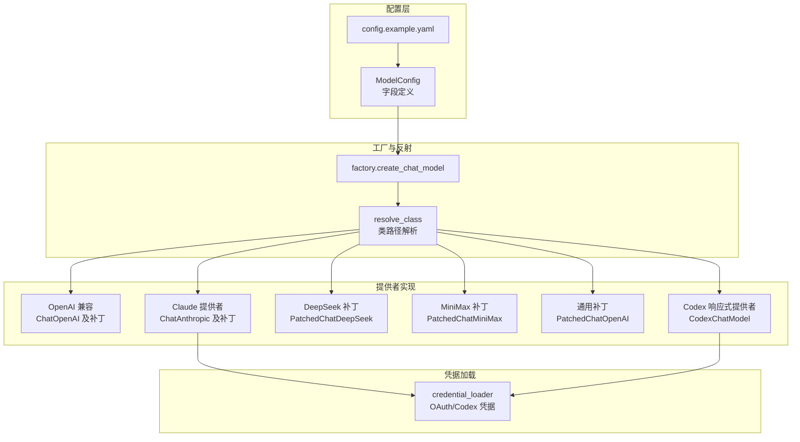
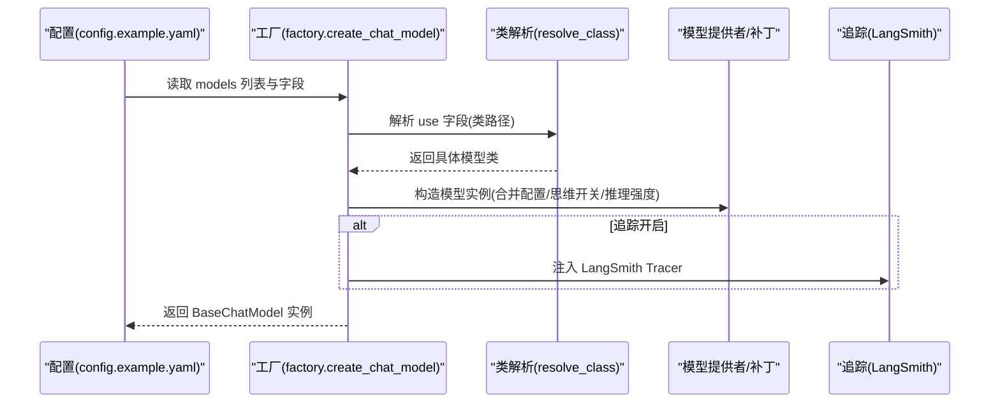
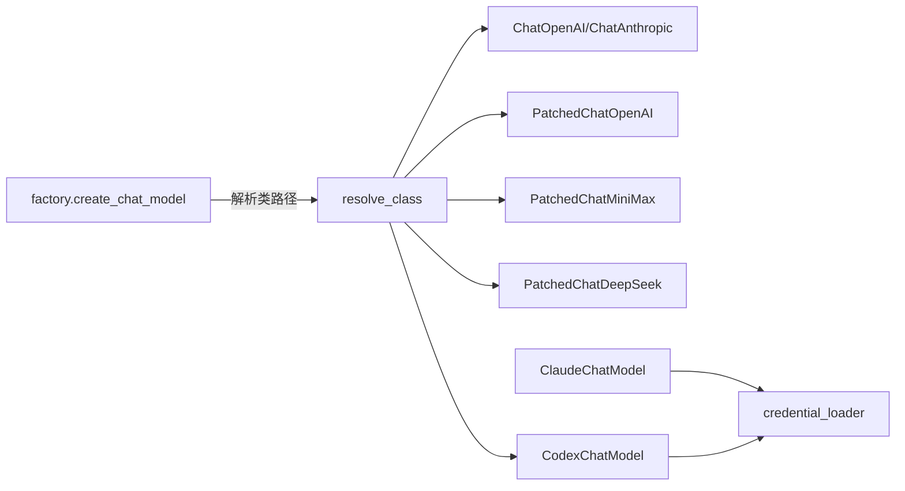

# 模型提供者

<cite>
**本文引用的文件**
- [backend/packages/harness/deerflow/models/__init__.py](file://backend/packages/harness/deerflow/models/__init__.py)
- [backend/packages/harness/deerflow/models/factory.py](file://backend/packages/harness/deerflow/models/factory.py)
- [backend/packages/harness/deerflow/models/openai_codex_provider.py](file://backend/packages/harness/deerflow/models/openai_codex_provider.py)
- [backend/packages/harness/deerflow/models/claude_provider.py](file://backend/packages/harness/deerflow/models/claude_provider.py)
- [backend/packages/harness/deerflow/models/patched_deepseek.py](file://backend/packages/harness/deerflow/models/patched_deepseek.py)
- [backend/packages/harness/deerflow/models/patched_minimax.py](file://backend/packages/harness/deerflow/models/patched_minimax.py)
- [backend/packages/harness/deerflow/models/patched_openai.py](file://backend/packages/harness/deerflow/models/patched_openai.py)
- [backend/packages/harness/deerflow/models/credential_loader.py](file://backend/packages/harness/deerflow/models/credential_loader.py)
- [backend/packages/harness/deerflow/config/model_config.py](file://backend/packages/harness/deerflow/config/model_config.py)
- [config.example.yaml](file://config.example.yaml)
- [backend/tests/test_model_factory.py](file://backend/tests/test_model_factory.py)
- [backend/tests/test_patched_openai.py](file://backend/tests/test_patched_openai.py)
- [backend/tests/test_patched_minimax.py](file://backend/tests/test_patched_minimax.py)
</cite>

## 目录
1. [简介](#简介)
2. [项目结构](#项目结构)
3. [核心组件](#核心组件)
4. [架构总览](#架构总览)
5. [详细组件分析](#详细组件分析)
6. [依赖分析](#依赖分析)
7. [性能考虑](#性能考虑)
8. [故障排查指南](#故障排查指南)
9. [结论](#结论)
10. [附录](#附录)

## 简介
本文件面向 DeerFlow 的“模型提供者”体系，系统性阐述如何在配置中选择与实例化不同供应商的聊天模型（如 OpenAI 兼容、Claude、DeepSeek、MiniMax），以及针对特定模型的补丁实现（Patched）如何增强或修复原生模型的行为。文档覆盖以下主题：
- 模型工厂与配置解析流程
- 各提供者特性与配置要点
- 认证与凭据加载策略
- 代理与网关设置
- 补丁模型的作用与实现机制
- 自定义提供者开发与集成步骤

## 项目结构
模型提供者相关代码集中在后端 harness 包下的 models 子包，并通过工厂函数统一创建实例；配置由 YAML 驱动并通过 Pydantic 模型校验。

图表来源
- [backend/packages/harness/deerflow/models/factory.py:11-95](file://backend/packages/harness/deerflow/models/factory.py#L11-L95)
- [backend/packages/harness/deerflow/config/model_config.py:4-37](file://backend/packages/harness/deerflow/config/model_config.py#L4-L37)
- [config.example.yaml:36-216](file://config.example.yaml#L36-L216)
- [backend/packages/harness/deerflow/models/claude_provider.py:56-107](file://backend/packages/harness/deerflow/models/claude_provider.py#L56-L107)
- [backend/packages/harness/deerflow/models/openai_codex_provider.py:59-71](file://backend/packages/harness/deerflow/models/openai_codex_provider.py#L59-L71)

章节来源
- [backend/packages/harness/deerflow/models/__init__.py:1-4](file://backend/packages/harness/deerflow/models/__init__.py#L1-L4)
- [backend/packages/harness/deerflow/models/factory.py:11-95](file://backend/packages/harness/deerflow/models/factory.py#L11-L95)
- [backend/packages/harness/deerflow/config/model_config.py:4-37](file://backend/packages/harness/deerflow/config/model_config.py#L4-L37)
- [config.example.yaml:36-216](file://config.example.yaml#L36-L216)

## 核心组件
- 工厂函数：根据配置动态解析并实例化模型类，支持“思维模式”开关与推理强度映射、追踪注入等。
- 提供者实现：针对不同供应商的适配与增强，包括 OAuth 认证、提示缓存、重试退避、推理内容提取等。
- 补丁模型：修复原生模型在多轮对话、工具调用签名、推理内容传递等方面的缺陷。
- 凭据加载：自动从环境变量、文件描述符或本地文件读取 Claude Code OAuth 与 Codex CLI 凭据。

章节来源
- [backend/packages/harness/deerflow/models/factory.py:11-95](file://backend/packages/harness/deerflow/models/factory.py#L11-L95)
- [backend/packages/harness/deerflow/models/claude_provider.py:31-107](file://backend/packages/harness/deerflow/models/claude_provider.py#L31-L107)
- [backend/packages/harness/deerflow/models/patched_openai.py:31-94](file://backend/packages/harness/deerflow/models/patched_openai.py#L31-L94)
- [backend/packages/harness/deerflow/models/patched_minimax.py:98-117](file://backend/packages/harness/deerflow/models/patched_minimax.py#L98-L117)
- [backend/packages/harness/deerflow/models/patched_deepseek.py:17-65](file://backend/packages/harness/deerflow/models/patched_deepseek.py#L17-L65)
- [backend/packages/harness/deerflow/models/openai_codex_provider.py:33-71](file://backend/packages/harness/deerflow/models/openai_codex_provider.py#L33-L71)
- [backend/packages/harness/deerflow/models/credential_loader.py:142-212](file://backend/packages/harness/deerflow/models/credential_loader.py#L142-L212)

## 架构总览
下图展示从配置到模型实例化的整体流程，以及关键补丁的介入点。

图表来源
- [backend/packages/harness/deerflow/models/factory.py:20-95](file://backend/packages/harness/deerflow/models/factory.py#L20-L95)
- [config.example.yaml:36-216](file://config.example.yaml#L36-L216)

## 详细组件分析

### 工厂与配置解析
- 支持按名称选择模型，默认使用配置中的第一个模型。
- 将模型配置转换为构造参数时排除内部字段（如 use、display_name 等），并处理“思维模式”快捷字段与 when_thinking_enabled 的合并。
- 当启用思维模式且模型支持时，将合并额外参数；当禁用思维模式时，针对不同格式注入禁用标记与最小推理强度。
- 对 Codex ChatGPT 响应式 API 的特殊处理：移除不支持的 max_tokens，将推理强度映射为 reasoning_effort。
- 若启用追踪，向模型附加 LangSmith Tracer。

章节来源
- [backend/packages/harness/deerflow/models/factory.py:11-95](file://backend/packages/harness/deerflow/models/factory.py#L11-L95)
- [backend/tests/test_model_factory.py:84-102](file://backend/tests/test_model_factory.py#L84-L102)
- [backend/tests/test_model_factory.py:109-129](file://backend/tests/test_model_factory.py#L109-L129)
- [backend/tests/test_model_factory.py:131-141](file://backend/tests/test_model_factory.py#L131-L141)
- [backend/tests/test_model_factory.py:148-178](file://backend/tests/test_model_factory.py#L148-L178)
- [backend/tests/test_model_factory.py:180-212](file://backend/tests/test_model_factory.py#L180-L212)
- [backend/tests/test_model_factory.py:214-234](file://backend/tests/test_model_factory.py#L214-L234)
- [backend/tests/test_model_factory.py:241-257](file://backend/tests/test_model_factory.py#L241-L257)
- [backend/tests/test_model_factory.py:259-287](file://backend/tests/test_model_factory.py#L259-L287)
- [backend/tests/test_model_factory.py:294-351](file://backend/tests/test_model_factory.py#L294-L351)
- [backend/tests/test_model_factory.py:354-416](file://backend/tests/test_model_factory.py#L354-L416)
- [backend/tests/test_model_factory.py:423-457](file://backend/tests/test_model_factory.py#L423-L457)
- [backend/tests/test_model_factory.py:459-504](file://backend/tests/test_model_factory.py#L459-L504)
- [backend/tests/test_model_factory.py:515-594](file://backend/tests/test_model_factory.py#L515-L594)
- [backend/tests/test_model_factory.py:596-624](file://backend/tests/test_model_factory.py#L596-L624)

### OpenAI 兼容提供者（含补丁）
- 基础能力：通过 ChatOpenAI 使用 OpenAI 兼容网关（如 MiniMax、Novita、OpenRouter 等），支持 base_url、api_key、温度、最大输出等标准参数。
- 补丁增强：
  - PatchedChatOpenAI：修复多轮对话中工具调用签名丢失的问题，确保 Gateway 在启用“思维模式”时要求的 thought_signature 被完整回传。
  - PatchedChatMiniMax：强制开启 reasoning_split 并将 provider 特有的 reasoning_details 映射到前端可识别的 reasoning_content；同时剥离 inline <think> 标签中的推理文本，合并到 additional_kwargs 中。
  - PatchedChatDeepSeek：在多轮对话中保留 AIMessage.additional_kwargs 中的 reasoning_content，确保后续请求携带该字段以满足某些 API 的要求。

章节来源
- [config.example.yaml:141-216](file://config.example.yaml#L141-L216)
- [backend/packages/harness/deerflow/models/patched_openai.py:31-94](file://backend/packages/harness/deerflow/models/patched_openai.py#L31-L94)
- [backend/packages/harness/deerflow/models/patched_minimax.py:98-117](file://backend/packages/harness/deerflow/models/patched_minimax.py#L98-L117)
- [backend/packages/harness/deerflow/models/patched_minimax.py:183-221](file://backend/packages/harness/deerflow/models/patched_minimax.py#L183-L221)
- [backend/packages/harness/deerflow/models/patched_deepseek.py:17-65](file://backend/packages/harness/deerflow/models/patched_deepseek.py#L17-L65)
- [backend/tests/test_patched_openai.py:54-93](file://backend/tests/test_patched_openai.py#L54-L93)
- [backend/tests/test_patched_openai.py:95-113](file://backend/tests/test_patched_openai.py#L95-L113)
- [backend/tests/test_patched_minimax.py:15-22](file://backend/tests/test_patched_minimax.py#L15-L22)
- [backend/tests/test_patched_minimax.py:24-54](file://backend/tests/test_patched_minimax.py#L24-L54)
- [backend/tests/test_patched_minimax.py:56-77](file://backend/tests/test_patched_minimax.py#L56-L77)
- [backend/tests/test_patched_minimax.py:79-150](file://backend/tests/test_patched_minimax.py#L79-L150)

### Claude 提供者
- 认证方式：
  - 标准 API Key（x-api-key 头）：默认行为。
  - Claude Code OAuth（Authorization: Bearer 头）：检测以 sk-ant-oat 开头的令牌，自动添加必需的 beta 头部，并禁用提示缓存以符合限制。
- 行为增强：
  - 提示缓存：对系统消息与最近消息应用临时缓存控制。
  - 思维预算：在未显式提供预算时，按 max_tokens 的比例自动分配。
  - 重试退避：指数退避 + 抖动，尊重 Retry-After 响应头。
- 凭据加载：优先从环境变量或文件描述符读取，其次读取 ~/.claude/.credentials.json。

章节来源
- [backend/packages/harness/deerflow/models/claude_provider.py:31-107](file://backend/packages/harness/deerflow/models/claude_provider.py#L31-L107)
- [backend/packages/harness/deerflow/models/claude_provider.py:115-120](file://backend/packages/harness/deerflow/models/claude_provider.py#L115-L120)
- [backend/packages/harness/deerflow/models/claude_provider.py:139-194](file://backend/packages/harness/deerflow/models/claude_provider.py#L139-L194)
- [backend/packages/harness/deerflow/models/claude_provider.py:195-245](file://backend/packages/harness/deerflow/models/claude_provider.py#L195-L245)
- [backend/packages/harness/deerflow/models/credential_loader.py:142-188](file://backend/packages/harness/deerflow/models/credential_loader.py#L142-L188)

### DeepSeek 提供者（补丁）
- 针对多轮对话中“思维/推理”场景，原生 ChatDeepSeek 可能不会在后续请求中携带 reasoning_content，导致部分 API 报错。
- 补丁通过对比原始消息与生成的请求载荷，将 reasoning_content 回填至助手消息，保证一致性。

章节来源
- [backend/packages/harness/deerflow/models/patched_deepseek.py:17-65](file://backend/packages/harness/deerflow/models/patched_deepseek.py#L17-L65)
- [config.example.yaml:37-51](file://config.example.yaml#L37-L51)

### MiniMax 提供者（补丁）
- 通过 ChatOpenAI 适配 MiniMax 的 OpenAI 兼容接口，但原生实现会忽略 provider 特有的 reasoning_details 字段。
- 补丁：
  - 请求阶段：强制 extra_body.reasoning_split=true。
  - 响应阶段：将 reasoning_details 合并到 additional_kwargs.reasoning_content；同时剥离 inline <think> 标签中的推理文本，保持前后一致。

章节来源
- [backend/packages/harness/deerflow/models/patched_minimax.py:98-117](file://backend/packages/harness/deerflow/models/patched_minimax.py#L98-L117)
- [backend/packages/harness/deerflow/models/patched_minimax.py:183-221](file://backend/packages/harness/deerflow/models/patched_minimax.py#L183-L221)
- [backend/tests/test_patched_minimax.py:15-22](file://backend/tests/test_patched_minimax.py#L15-L22)
- [backend/tests/test_patched_minimax.py:24-54](file://backend/tests/test_patched_minimax.py#L24-L54)
- [backend/tests/test_patched_minimax.py:56-77](file://backend/tests/test_patched_minimax.py#L56-L77)
- [backend/tests/test_patched_minimax.py:79-150](file://backend/tests/test_patched_minimax.py#L79-L150)

### OpenAI 兼容响应式提供者（Codex）
- 使用 ChatGPT Codex 的 responses 接口，支持：
  - 自动从 ~/.codex/auth.json 加载凭据。
  - 响应式流式返回（SSE），解析 response.completed 事件。
  - 工具调用、推理内容提取、重试与指数退避。
- 注意事项：
  - 不支持 max_tokens；工厂会自动移除。
  - 思维模式下将 reasoning_effort 映射为 "none"/"low"/"medium"/"high"。

章节来源
- [backend/packages/harness/deerflow/models/openai_codex_provider.py:33-71](file://backend/packages/harness/deerflow/models/openai_codex_provider.py#L33-L71)
- [backend/packages/harness/deerflow/models/openai_codex_provider.py:173-214](file://backend/packages/harness/deerflow/models/openai_codex_provider.py#L173-L214)
- [backend/packages/harness/deerflow/models/openai_codex_provider.py:280-340](file://backend/packages/harness/deerflow/models/openai_codex_provider.py#L280-L340)
- [backend/tests/test_model_factory.py:515-594](file://backend/tests/test_model_factory.py#L515-L594)

### 配置字段与示例
- ModelConfig 字段：name/display_name/description/use/model 等基础字段，以及 use_responses_api、output_version、supports_thinking、supports_reasoning_effort、when_thinking_enabled、thinking、supports_vision 等。
- config.example.yaml 提供了多种供应商示例，包括：
  - OpenAI（原生/响应式）、Anthropic Claude、Google Gemini（原生与网关）、DeepSeek、MiniMax（国际版/中国区）、OpenRouter 等。
  - 思维模式与视觉支持的启用方式，以及网关 base_url 的设置。

章节来源
- [backend/packages/harness/deerflow/config/model_config.py:4-37](file://backend/packages/harness/deerflow/config/model_config.py#L4-L37)
- [config.example.yaml:36-216](file://config.example.yaml#L36-L216)
- [backend/tests/test_model_config.py:15-31](file://backend/tests/test_model_config.py#L15-L31)

### 认证与凭据加载
- Claude Code OAuth：
  - 支持环境变量、文件描述符、自定义路径或 ~/.claude/.credentials.json。
  - 自动检测令牌类型并注入必要的 beta 头部，必要时禁用提示缓存。
- Codex CLI：
  - 支持 CODEX_AUTH_PATH 或 ~/.codex/auth.json，兼容旧版与新版令牌结构。
- 凭据过期与错误处理：记录警告并拒绝过期令牌。

章节来源
- [backend/packages/harness/deerflow/models/credential_loader.py:142-188](file://backend/packages/harness/deerflow/models/credential_loader.py#L142-L188)
- [backend/packages/harness/deerflow/models/credential_loader.py:191-212](file://backend/packages/harness/deerflow/models/credential_loader.py#L191-L212)

### 代理与性能优化
- 代理设置：通过 base_url 指向网关或代理服务，适用于 MiniMax、OpenRouter 等。
- 重试与退避：Claude 提供者内置指数退避与抖动，尊重 Retry-After；Codex 提供者对 429/500/529 场景进行重试。
- 思维预算与推理强度：自动分配预算或按需映射，避免超限或不被支持的字段。

章节来源
- [backend/packages/harness/deerflow/models/claude_provider.py:200-218](file://backend/packages/harness/deerflow/models/claude_provider.py#L200-L218)
- [backend/packages/harness/deerflow/models/openai_codex_provider.py:197-214](file://backend/packages/harness/deerflow/models/openai_codex_provider.py#L197-L214)
- [config.example.yaml:159-216](file://config.example.yaml#L159-L216)

### 自定义模型提供者开发指南
- 类路径注册：在 config.yaml 的 use 字段中填写“模块:类名”，工厂将通过 resolve_class 动态导入。
- 继承建议：优先继承 LangChain 提供的基础类（如 ChatOpenAI、ChatAnthropic），并在需要时复用补丁模式（如 _get_request_payload 改写、响应解析增强）。
- 行为增强点：
  - 认证：支持环境变量、文件或外部手递手文件描述符。
  - 代理：通过 base_url 指向网关。
  - 补丁：针对多轮对话、工具调用签名、推理内容等进行修复。
- 测试验证：参考现有单元测试，覆盖思维模式开关、推理强度映射、补丁行为等关键路径。

章节来源
- [backend/packages/harness/deerflow/models/factory.py:26-80](file://backend/packages/harness/deerflow/models/factory.py#L26-L80)
- [backend/tests/test_model_factory.py:423-504](file://backend/tests/test_model_factory.py#L423-L504)
- [backend/tests/test_patched_openai.py:54-113](file://backend/tests/test_patched_openai.py#L54-L113)
- [backend/tests/test_patched_minimax.py:15-77](file://backend/tests/test_patched_minimax.py#L15-L77)

## 依赖分析
- 工厂依赖配置与反射解析，间接依赖各提供者实现。
- 提供者实现依赖 LangChain 生态（ChatOpenAI、ChatAnthropic 等）与第三方 SDK（anthropic）。
- 补丁模型通过覆写请求载荷与响应解析，降低耦合度，提升可维护性。
- 凭据加载独立于模型类，仅在初始化阶段参与认证决策。

图表来源
- [backend/packages/harness/deerflow/models/factory.py:26-80](file://backend/packages/harness/deerflow/models/factory.py#L26-L80)
- [backend/packages/harness/deerflow/models/claude_provider.py:56-107](file://backend/packages/harness/deerflow/models/claude_provider.py#L56-L107)
- [backend/packages/harness/deerflow/models/openai_codex_provider.py:59-71](file://backend/packages/harness/deerflow/models/openai_codex_provider.py#L59-L71)

章节来源
- [backend/packages/harness/deerflow/models/factory.py:11-95](file://backend/packages/harness/deerflow/models/factory.py#L11-L95)
- [backend/packages/harness/deerflow/models/claude_provider.py:31-107](file://backend/packages/harness/deerflow/models/claude_provider.py#L31-L107)
- [backend/packages/harness/deerflow/models/patched_openai.py:31-94](file://backend/packages/harness/deerflow/models/patched_openai.py#L31-L94)
- [backend/packages/harness/deerflow/models/patched_minimax.py:98-117](file://backend/packages/harness/deerflow/models/patched_minimax.py#L98-L117)
- [backend/packages/harness/deerflow/models/patched_deepseek.py:17-65](file://backend/packages/harness/deerflow/models/patched_deepseek.py#L17-L65)
- [backend/packages/harness/deerflow/models/openai_codex_provider.py:33-71](file://backend/packages/harness/deerflow/models/openai_codex_provider.py#L33-L71)

## 性能考虑
- 重试与退避：减少瞬时错误对吞吐的影响，避免雪崩。
- 提示缓存：在 Claude OAuth 场景下自动禁用，避免缓存块限制；其他场景可显著降低重复输入成本。
- 推理强度与预算：合理设置 reasoning_effort 与思维预算，平衡质量与成本。
- 流式响应：Codex 使用 SSE 流式返回，减少等待时间；MiniMax 补丁在增量阶段聚合推理内容，提升前端体验。

## 故障排查指南
- 思维模式报错（如 INVALID_ARGUMENT 缺少 thought_signature）：确认使用 PatchedChatOpenAI，并检查工具调用签名是否正确回填。
- MiniMax 推理内容缺失：确认已启用 reasoning_split 并检查响应解析逻辑。
- Claude OAuth 401/受限：检查令牌类型与 beta 头部是否正确注入，确认提示缓存已被禁用。
- Codex 429/500：观察重试日志，必要时调整 retry_max_attempts。
- 追踪失败：工厂会在异常时记录警告，检查 LangSmith 项目配置。

章节来源
- [backend/tests/test_patched_openai.py:54-113](file://backend/tests/test_patched_openai.py#L54-L113)
- [backend/tests/test_patched_minimax.py:15-77](file://backend/tests/test_patched_minimax.py#L15-L77)
- [backend/packages/harness/deerflow/models/claude_provider.py:85-107](file://backend/packages/harness/deerflow/models/claude_provider.py#L85-L107)
- [backend/packages/harness/deerflow/models/openai_codex_provider.py:197-214](file://backend/packages/harness/deerflow/models/openai_codex_provider.py#L197-L214)
- [backend/packages/harness/deerflow/models/factory.py:82-95](file://backend/packages/harness/deerflow/models/factory.py#L82-L95)

## 结论
DeerFlow 的模型提供者体系通过“配置驱动 + 工厂 + 补丁”的组合，实现了对多供应商、多形态模型的一致接入与增强。开发者只需在配置中声明类路径与参数，即可获得认证、代理、思维模式、推理强度、流式响应等能力；同时，针对特定模型的补丁确保了跨供应商的一致行为与稳定性。

## 附录
- 配置示例参考：config.example.yaml 中 models 段落包含多种供应商示例与思维/视觉支持的启用方式。
- 单元测试参考：覆盖工厂行为、补丁逻辑与响应解析的关键路径。