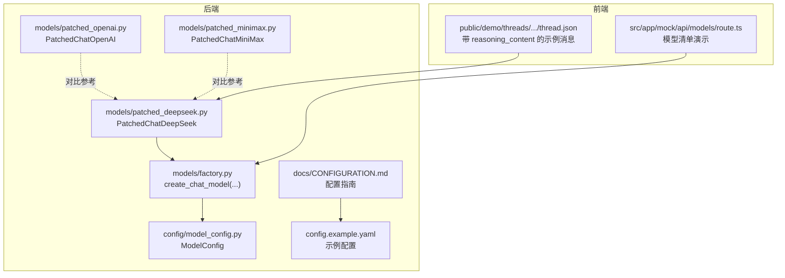
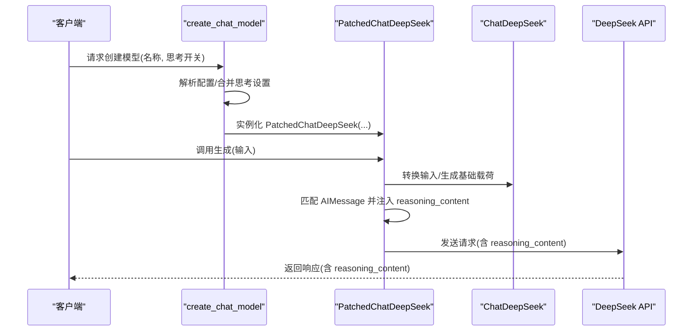
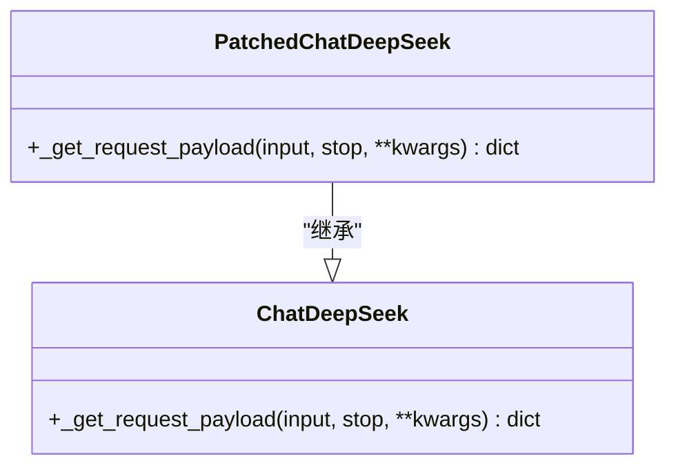
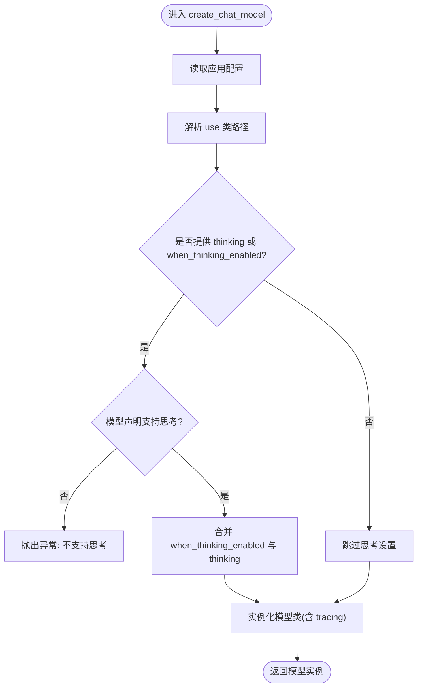
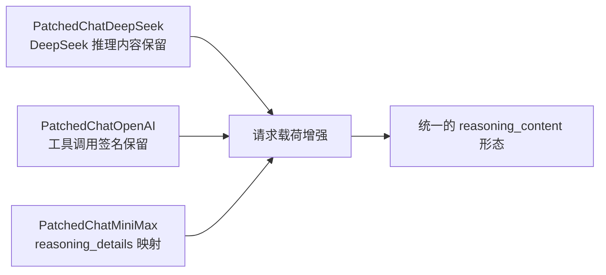
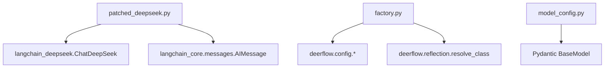

# DeepSeek 补丁提供者

<cite>
**本文引用的文件**
- [patched_deepseek.py](file://backend/packages/harness/deerflow/models/patched_deepseek.py)
- [factory.py](file://backend/packages/harness/deerflow/models/factory.py)
- [model_config.py](file://backend/packages/harness/deerflow/config/model_config.py)
- [config.example.yaml](file://config.example.yaml)
- [CONFIGURATION.md](file://backend/docs/CONFIGURATION.md)
- [patched_openai.py](file://backend/packages/harness/deerflow/models/patched_openai.py)
- [patched_minimax.py](file://backend/packages/harness/deerflow/models/patched_minimax.py)
- [route.ts](file://frontend/src/app/mock/api/models/route.ts)
- [thread.json（演示）](file://frontend/public/demo/threads/21cfea46-34bd-4aa6-9e1f-3009452fbeb9/thread.json)
</cite>

## 目录
1. [简介](#简介)
2. [项目结构](#项目结构)
3. [核心组件](#核心组件)
4. [架构总览](#架构总览)
5. [详细组件分析](#详细组件分析)
6. [依赖分析](#依赖分析)
7. [性能考虑](#性能考虑)
8. [故障排除指南](#故障排除指南)
9. [结论](#结论)
10. [附录](#附录)

## 简介
本文件面向需要在 DeerFlow 中集成 DeepSeek 模型的开发者与运维人员，系统化阐述 DeepSeek 补丁提供者的实现原理、配置方法、使用场景与最佳实践，并与同类补丁（如针对 Gemini 的 PatchedChatOpenAI、MiniMax 的 PatchedChatMiniMax）进行对比，帮助读者快速定位兼容性问题、理解补丁对“思考/推理”模式下多轮对话的增强机制，并给出可操作的排障建议。

## 项目结构
与 DeepSeek 补丁相关的后端模块主要位于 deerflow 包内，前端提供模型列表的示例接口，便于理解支持的模型能力字段。

**图表来源**
- [patched_deepseek.py:1-66](file://backend/packages/harness/deerflow/models/patched_deepseek.py#L1-L66)
- [factory.py:1-96](file://backend/packages/harness/deerflow/models/factory.py#L1-L96)
- [model_config.py:1-38](file://backend/packages/harness/deerflow/config/model_config.py#L1-L38)
- [CONFIGURATION.md:1-350](file://backend/docs/CONFIGURATION.md#L1-L350)
- [config.example.yaml:1-624](file://config.example.yaml#L1-L624)
- [patched_openai.py:1-135](file://backend/packages/harness/deerflow/models/patched_openai.py#L1-L135)
- [patched_minimax.py:1-221](file://backend/packages/harness/deerflow/models/patched_minimax.py#L1-L221)
- [route.ts:1-34](file://frontend/src/app/mock/api/models/route.ts#L1-L34)
- [thread.json（演示）:1-35](file://frontend/public/demo/threads/21cfea46-34bd-4aa6-9e1f-3009452fbeb9/thread.json#L1-L35)

**章节来源**
- [patched_deepseek.py:1-66](file://backend/packages/harness/deerflow/models/patched_deepseek.py#L1-L66)
- [factory.py:1-96](file://backend/packages/harness/deerflow/models/factory.py#L1-L96)
- [model_config.py:1-38](file://backend/packages/harness/deerflow/config/model_config.py#L1-L38)
- [CONFIGURATION.md:1-350](file://backend/docs/CONFIGURATION.md#L1-L350)
- [config.example.yaml:1-624](file://config.example.yaml#L1-L624)
- [patched_openai.py:1-135](file://backend/packages/harness/deerflow/models/patched_openai.py#L1-L135)
- [patched_minimax.py:1-221](file://backend/packages/harness/deerflow/models/patched_minimax.py#L1-L221)
- [route.ts:1-34](file://frontend/src/app/mock/api/models/route.ts#L1-L34)
- [thread.json（演示）:1-35](file://frontend/public/demo/threads/21cfea46-34bd-4aa6-9e1f-3009452fbeb9/thread.json#L1-L35)

## 核心组件
- PatchedChatDeepSeek：对原生 ChatDeepSeek 的请求载荷进行增强，确保“思考/推理”模式下的 reasoning_content 在多轮对话中被正确回传到 API。
- create_chat_model：统一的模型工厂，负责从配置解析类路径、合并“思考模式”设置、注入 tracing 回调等。
- ModelConfig：模型配置的数据结构，包含 supports_thinking、when_thinking_enabled 等关键字段。
- 配置示例与文档：提供 DeepSeek 的典型配置项与“思考模式”的启用方式。
- 前端模型清单与演示数据：展示 supports_thinking 字段与 reasoning_content 的实际使用形态。

**章节来源**
- [patched_deepseek.py:17-66](file://backend/packages/harness/deerflow/models/patched_deepseek.py#L17-L66)
- [factory.py:11-96](file://backend/packages/harness/deerflow/models/factory.py#L11-L96)
- [model_config.py:4-38](file://backend/packages/harness/deerflow/config/model_config.py#L4-L38)
- [CONFIGURATION.md:126-137](file://backend/docs/CONFIGURATION.md#L126-L137)
- [config.example.yaml:112-125](file://config.example.yaml#L112-L125)
- [route.ts:12-17](file://frontend/src/app/mock/api/models/route.ts#L12-L17)
- [thread.json（演示）:27-35](file://frontend/public/demo/threads/21cfea46-34bd-4aa6-9e1f-3009452fbeb9/thread.json#L27-L35)

## 架构总览
DeepSeek 补丁提供者通过“工厂 + 配置 + 补丁类”的组合，在不改变上层调用方式的前提下，修复了 DeepSeek 在“思考/推理”模式下的兼容性问题。

**图表来源**
- [factory.py:11-96](file://backend/packages/harness/deerflow/models/factory.py#L11-L96)
- [patched_deepseek.py:26-66](file://backend/packages/harness/deerflow/models/patched_deepseek.py#L26-L66)

## 详细组件分析

### PatchedChatDeepSeek 组件
- 设计目标：在“思考/推理”开启时，保证所有助手消息均携带 reasoning_content，避免后续多轮请求因缺少该字段导致错误。
- 关键点：
  - 复用原生 ChatDeepSeek 的载荷生成逻辑，再对 payload 进行二次修正。
  - 通过原始消息与 payload 消息的顺序匹配，定位助手消息并恢复 reasoning_content。
  - 若长度不一致，采用“助手消息计数匹配”的回退策略，提升鲁棒性。

**图表来源**
- [patched_deepseek.py:17-66](file://backend/packages/harness/deerflow/models/patched_deepseek.py#L17-L66)

**章节来源**
- [patched_deepseek.py:17-66](file://backend/packages/harness/deerflow/models/patched_deepseek.py#L17-L66)

### 模型工厂与配置融合
- create_chat_model：
  - 从应用配置解析模型类路径与参数。
  - 支持“思考模式”快捷字段 thinking 与 when_thinking_enabled 的合并。
  - 当 thinking 启用且模型声明不支持时抛出异常；否则将额外参数注入实例化。
  - 对 Codex 类模型做特殊处理（如移除 max_tokens、映射 reasoning_effort）。
  - 可选附加 tracing 回调。
- ModelConfig：
  - 提供 name/display_name/description/use/model 等基础字段。
  - supports_thinking、supports_reasoning_effort、when_thinking_enabled、thinking 等用于控制“思考/推理”行为。

**图表来源**
- [factory.py:11-96](file://backend/packages/harness/deerflow/models/factory.py#L11-L96)
- [model_config.py:4-38](file://backend/packages/harness/deerflow/config/model_config.py#L4-L38)

**章节来源**
- [factory.py:11-96](file://backend/packages/harness/deerflow/models/factory.py#L11-L96)
- [model_config.py:4-38](file://backend/packages/harness/deerflow/config/model_config.py#L4-L38)

### 配置与使用场景
- 示例配置（DeepSeek）：
  - 使用 deerflow.models.patched_deepseek:PatchedChatDeepSeek。
  - 设置 supports_thinking 与 when_thinking_enabled.extra_body.thinking.type=enabled。
  - 可根据需要设置 max_tokens、temperature 等通用参数。
- 前端模型清单（演示）：
  - 展示 supports_thinking: true 的 DeepSeek 模型条目，便于前端选择与显示。
- 演示线程数据：
  - AIMessage 的 additional_kwargs 中包含 reasoning_content 字段，体现“思考/推理”输出形态。

**章节来源**
- [config.example.yaml:112-125](file://config.example.yaml#L112-L125)
- [CONFIGURATION.md:126-137](file://backend/docs/CONFIGURATION.md#L126-L137)
- [route.ts:12-17](file://frontend/src/app/mock/api/models/route.ts#L12-L17)
- [thread.json（演示）:27-35](file://frontend/public/demo/threads/21cfea46-34bd-4aa6-9e1f-3009452fbeb9/thread.json#L27-L35)

### 与其他补丁提供者的差异与优势
- 与 PatchedChatOpenAI 的对比：
  - 针对对象不同：PatchedChatOpenAI 修复的是“工具调用签名（thought_signature）”在多轮对话中的丢失；PatchedChatDeepSeek 修复的是“推理内容（reasoning_content）”在多轮对话中的丢失。
  - 两者均通过覆写 _get_request_payload 并基于原始消息与 payload 消息的匹配来恢复缺失字段。
- 与 PatchedChatMiniMax 的对比：
  - MiniMax 补丁关注“结构化 reasoning_details”的透传与清洗，将其映射为 DeerFlow 通用的 reasoning_content；DeepSeek 补丁关注“reasoning_content”在请求载荷中的保留。
  - 二者都属于“请求载荷增强”，但修复的问题域不同。

**图表来源**
- [patched_deepseek.py:1-66](file://backend/packages/harness/deerflow/models/patched_deepseek.py#L1-L66)
- [patched_openai.py:1-135](file://backend/packages/harness/deerflow/models/patched_openai.py#L1-L135)
- [patched_minimax.py:1-221](file://backend/packages/harness/deerflow/models/patched_minimax.py#L1-L221)

**章节来源**
- [patched_deepseek.py:1-66](file://backend/packages/harness/deerflow/models/patched_deepseek.py#L1-L66)
- [patched_openai.py:1-135](file://backend/packages/harness/deerflow/models/patched_openai.py#L1-L135)
- [patched_minimax.py:1-221](file://backend/packages/harness/deerflow/models/patched_minimax.py#L1-L221)

## 依赖分析
- PatchedChatDeepSeek 依赖 langchain_deepseek.ChatDeepSeek 与 langchain_core 的消息类型。
- 工厂函数依赖 deerflow.config 与 deerflow.reflection.resolve_class，用于动态解析类路径。
- 配置层通过 Pydantic ModelConfig 定义模型配置结构，支持扩展字段。

**图表来源**
- [patched_deepseek.py:10-14](file://backend/packages/harness/deerflow/models/patched_deepseek.py#L10-L14)
- [factory.py:5-6](file://backend/packages/harness/deerflow/models/factory.py#L5-L6)
- [model_config.py:1-4](file://backend/packages/harness/deerflow/config/model_config.py#L1-L4)

**章节来源**
- [patched_deepseek.py:10-14](file://backend/packages/harness/deerflow/models/patched_deepseek.py#L10-L14)
- [factory.py:5-6](file://backend/packages/harness/deerflow/models/factory.py#L5-L6)
- [model_config.py:1-4](file://backend/packages/harness/deerflow/config/model_config.py#L1-L4)

## 性能考虑
- 由于补丁在请求发送前对消息进行一次匹配与复制，复杂对话中消息数量较多时会带来轻微 CPU 开销。但在当前实现中，匹配仅发生在助手消息与 payload 的对应位置，时间复杂度近似线性，通常不会成为瓶颈。
- 建议：
  - 控制对话轮次与上下文长度，避免过长的历史消息导致 payload 过大。
  - 在高并发场景下，优先使用连接池与合理的超时设置，减少网络层面的等待。

[本节为通用建议，无需特定文件引用]

## 故障排除指南
- “思考/推理”模式报错或返回空 reasoning_content：
  - 确认配置中 supports_thinking 为 true，并在 when_thinking_enabled 中启用相应开关。
  - 确保使用 deerflow.models.patched_deepseek:PatchedChatDeepSeek 类路径。
- 多轮对话中推理内容丢失：
  - 检查 AIMessage.additional_kwargs 是否包含 reasoning_content。
  - 确认补丁已正确覆写 _get_request_payload 并执行了匹配与注入。
- 配置未生效：
  - 检查 DEER_FLOW_CONFIG_PATH 或 config.yaml 的位置与权限。
  - 确认环境变量替换语法（$VAR_NAME）正确。
- 前端模型不可见或不支持思考：
  - 检查前端 mock 接口返回的模型清单，确认 supports_thinking 字段正确。

**章节来源**
- [CONFIGURATION.md:326-350](file://backend/docs/CONFIGURATION.md#L326-L350)
- [config.example.yaml:112-125](file://config.example.yaml#L112-L125)
- [patched_deepseek.py:26-66](file://backend/packages/harness/deerflow/models/patched_deepseek.py#L26-L66)
- [route.ts:12-17](file://frontend/src/app/mock/api/models/route.ts#L12-L17)

## 结论
DeepSeek 补丁提供者通过在请求载荷中恢复 reasoning_content，有效解决了“思考/推理”模式在多轮对话中的兼容性问题。配合统一的模型工厂与配置体系，开发者可以以最小改动接入 DeepSeek，并在复杂推理任务中获得稳定可靠的推理内容输出。与 PatchedChatOpenAI、PatchedChatMiniMax 等补丁相比，DeepSeek 补丁专注于推理内容的保留，三者共同构成了 DeerFlow 对主流推理型模型的完整支持矩阵。

[本节为总结性内容，无需特定文件引用]

## 附录

### 配置要点速查
- 使用类路径：deerflow.models.patched_deepseek:PatchedChatDeepSeek
- 启用思考：supports_thinking: true；when_thinking_enabled.extra_body.thinking.type: enabled
- 典型字段：model、api_key、max_tokens、temperature 等

**章节来源**
- [config.example.yaml:112-125](file://config.example.yaml#L112-L125)
- [CONFIGURATION.md:126-137](file://backend/docs/CONFIGURATION.md#L126-L137)