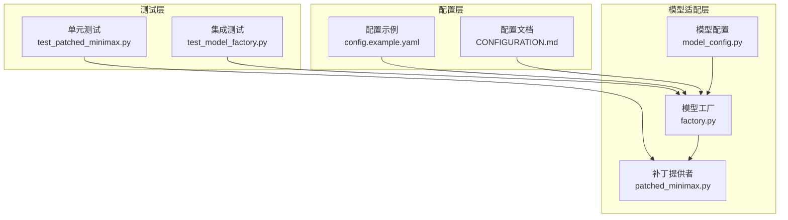
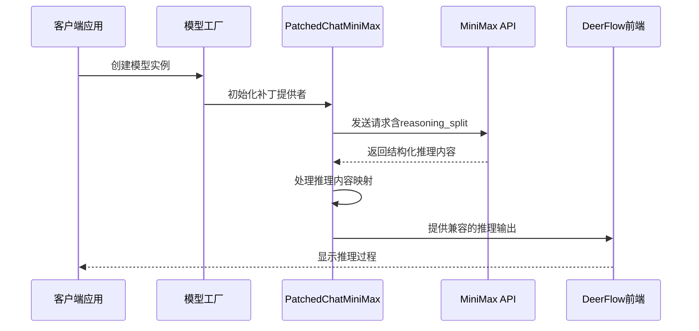
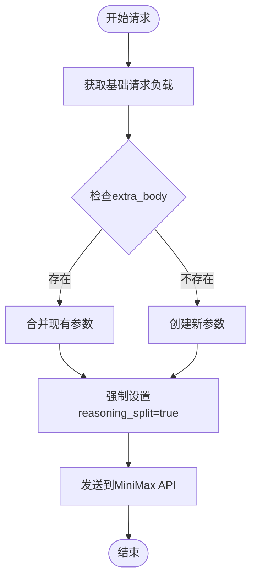
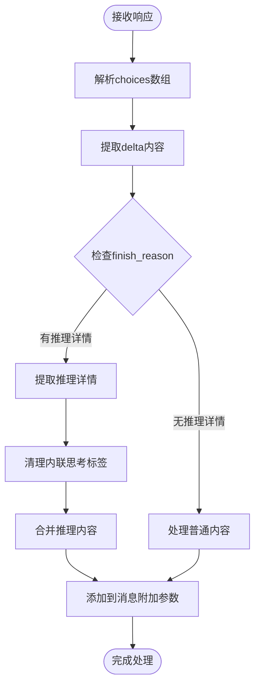
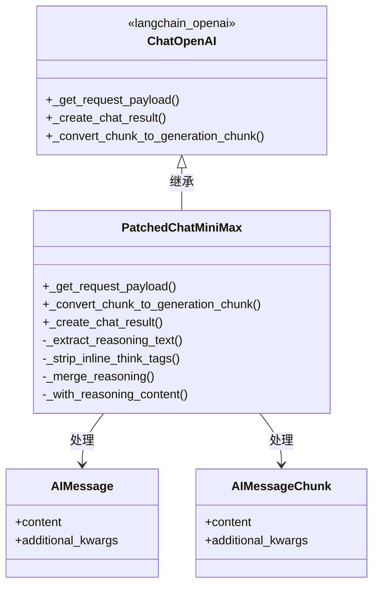
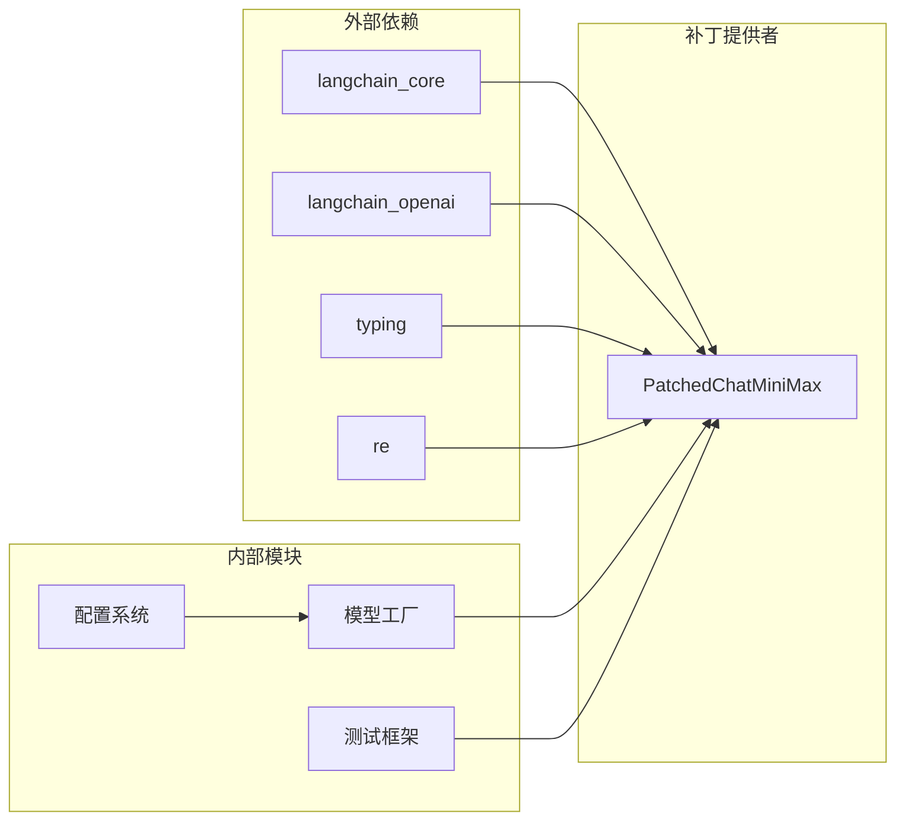

# Minimax 补丁提供者

<cite>
**本文档引用的文件**
- [patched_minimax.py](file://backend/packages/harness/deerflow/models/patched_minimax.py)
- [test_patched_minimax.py](file://backend/tests/test_patched_minimax.py)
- [factory.py](file://backend/packages/harness/deerflow/models/factory.py)
- [model_config.py](file://backend/packages/harness/deerflow/config/model_config.py)
- [config.example.yaml](file://config.example.yaml)
- [CONFIGURATION.md](file://backend/docs/CONFIGURATION.md)
- [test_model_factory.py](file://backend/tests/test_model_factory.py)
</cite>

## 目录
1. [简介](#简介)
2. [项目结构](#项目结构)
3. [核心组件](#核心组件)
4. [架构概览](#架构概览)
5. [详细组件分析](#详细组件分析)
6. [依赖分析](#依赖分析)
7. [性能考虑](#性能考虑)
8. [故障排除指南](#故障排除指南)
9. [结论](#结论)
10. [附录](#附录)

## 简介

Minimax 补丁提供者是 DeerFlow 项目中的一个专门适配器，用于解决 MiniMax 模型在与 DeerFlow 前端兼容性方面的问题。MiniMax 提供了 OpenAI 兼容的聊天补全 API，但该 API 在返回结构化推理输出时存在特定要求，标准的 `langchain_openai.ChatOpenAI` 实现会忽略这些推理字段。

本补丁通过以下方式解决这些问题：
- 强制启用 `reasoning_split` 参数以获取结构化的推理内容
- 将提供商特定的推理字段映射到 DeerFlow 前端期望的 `additional_kwargs.reasoning_content` 结构
- 处理内联思考标签（think tags）的提取和合并
- 支持流式响应中的推理内容增量传输

## 项目结构

Minimax 补丁提供者位于 DeerFlow 后端的模型适配层中，采用模块化设计，与其他模型提供者保持一致的接口。



**图表来源**
- [factory.py:11-96](file://backend/packages/harness/deerflow/models/factory.py#L11-L96)
- [patched_minimax.py:98-221](file://backend/packages/harness/deerflow/models/patched_minimax.py#L98-L221)

**章节来源**
- [factory.py:1-96](file://backend/packages/harness/deerflow/models/factory.py#L1-L96)
- [model_config.py:1-38](file://backend/packages/harness/deerflow/config/model_config.py#L1-L38)

## 核心组件

### PatchedChatMiniMax 类

这是 Minimax 补丁提供者的核心类，继承自 `langchain_openai.ChatOpenAI` 并重写了关键方法以处理 MiniMax 特有的推理输出格式。

主要特性：
- 自动设置 `reasoning_split=true` 请求参数
- 处理结构化推理详情（reasoning_details）
- 支持内联思考标签的提取和清理
- 流式响应中的推理内容增量处理

### 推理内容处理函数

补丁包含一组专用函数来处理推理内容的不同格式：

- `_extract_reasoning_text`: 从结构化推理详情中提取文本内容
- `_strip_inline_think_tags`: 清理内联思考标签并提取推理内容
- `_merge_reasoning`: 合并多个推理源的内容
- `_with_reasoning_content`: 将推理内容添加到消息的附加参数中

**章节来源**
- [patched_minimax.py:31-96](file://backend/packages/harness/deerflow/models/patched_minimax.py#L31-L96)
- [patched_minimax.py:98-221](file://backend/packages/harness/deerflow/models/patched_minimax.py#L98-L221)

## 架构概览

Minimax 补丁提供者遵循标准的模型适配器模式，与 DeerFlow 的整体架构无缝集成。



**图表来源**
- [factory.py:11-96](file://backend/packages/harness/deerflow/models/factory.py#L11-L96)
- [patched_minimax.py:101-117](file://backend/packages/harness/deerflow/models/patched_minimax.py#L101-L117)

## 详细组件分析

### 请求处理流程

补丁提供者在请求阶段强制启用推理分割功能，并保留用户可能设置的其他参数。



**图表来源**
- [patched_minimax.py:101-117](file://backend/packages/harness/deerflow/models/patched_minimax.py#L101-L117)

### 响应处理流程

响应处理涉及多个步骤，包括推理内容的提取、清理和合并。



**图表来源**
- [patched_minimax.py:183-221](file://backend/packages/harness/deerflow/models/patched_minimax.py#L183-L221)

### 类关系图



**图表来源**
- [patched_minimax.py:98-221](file://backend/packages/harness/deerflow/models/patched_minimax.py#L98-L221)

**章节来源**
- [patched_minimax.py:98-221](file://backend/packages/harness/deerflow/models/patched_minimax.py#L98-L221)

## 依赖分析

### 外部依赖

补丁提供者依赖于以下外部库和框架：

- `langchain_core`: 核心语言模型接口和消息类型定义
- `langchain_openai`: OpenAI 兼容模型的基础实现
- `typing`: 类型注解支持
- `re`: 正则表达式用于思考标签处理

### 内部依赖

- 模型工厂：负责创建和配置模型实例
- 配置系统：提供模型配置参数和行为控制
- 测试框架：确保补丁功能的正确性和稳定性



**图表来源**
- [patched_minimax.py:13-26](file://backend/packages/harness/deerflow/models/patched_minimax.py#L13-L26)
- [factory.py:1-8](file://backend/packages/harness/deerflow/models/factory.py#L1-L8)

**章节来源**
- [patched_minimax.py:13-26](file://backend/packages/harness/deerflow/models/patched_minimax.py#L13-L26)
- [factory.py:1-8](file://backend/packages/harness/deerflow/models/factory.py#L1-L8)

## 性能考虑

### 流式处理优化

补丁提供者针对流式响应进行了专门优化，能够高效处理增量推理内容：

- 使用增量合并策略避免重复计算
- 支持多段推理内容的实时拼接
- 最小化内存占用和字符串操作开销

### 缓存和复用

- 推理内容的标准化处理结果可以被缓存
- 相同推理内容的重复处理会被智能跳过
- 消息对象的复制操作经过优化

### 错误处理和回退

- 对于不完整的推理数据，系统会优雅降级
- 保持原始内容完整性的同时提取推理信息
- 提供详细的错误日志便于调试

## 故障排除指南

### 常见问题和解决方案

#### 推理内容缺失

**症状**: 前端无法显示推理过程

**原因**: 
- MiniMax API 未返回推理详情
- 网络请求失败
- 配置参数不正确

**解决方案**:
1. 验证 `reasoning_split` 参数是否正确设置
2. 检查 MiniMax API 的响应格式
3. 确认网络连接和 API 密钥有效性

#### 内联思考标签处理异常

**症状**: 推理内容中包含 HTML 标签或格式错误

**原因**: 
- 内联思考标签格式不符合预期
- 正则表达式匹配失败

**解决方案**:
1. 检查输入内容的标签格式
2. 验证正则表达式的匹配逻辑
3. 添加适当的边界检查

#### 流式响应处理错误

**症状**: 推理内容在流式传输过程中丢失或重复

**原因**:
- 多个增量块的合并逻辑错误
- 状态管理不当

**解决方案**:
1. 确保增量块按正确的顺序处理
2. 实施幂等性检查避免重复内容
3. 添加状态同步机制

**章节来源**
- [test_patched_minimax.py:15-150](file://backend/tests/test_patched_minimax.py#L15-L150)

## 结论

Minimax 补丁提供者成功解决了 MiniMax 模型与 DeerFlow 前端之间的兼容性问题。通过强制启用推理分割功能、智能处理推理内容格式以及优化流式响应处理，该补丁确保了完整的推理过程可视化和用户体验。

主要优势：
- **完全兼容**: 与标准 ChatOpenAI 接口保持完全兼容
- **增强功能**: 提供结构化推理内容的完整支持
- **性能优化**: 针对流式处理和增量内容进行了专门优化
- **易于集成**: 通过标准配置即可启用和使用

## 附录

### 配置示例

以下是最小化配置示例，展示如何在 DeerFlow 中配置 MiniMax 模型：

```yaml
models:
  - name: minimax-m2.5
    display_name: MiniMax M2.5
    use: langchain_openai:ChatOpenAI
    model: MiniMax-M2.5
    api_key: $MINIMAX_API_KEY
    base_url: https://api.minimax.io/v1
    max_tokens: 4096
    temperature: 1.0
    supports_vision: true
```

### 集成指南

1. **安装依赖**: 确保已安装必要的 LangChain 库
2. **配置环境变量**: 设置 `MINIMAX_API_KEY`
3. **更新配置文件**: 添加上述配置到 `config.yaml`
4. **重启服务**: 应用配置更改
5. **验证集成**: 运行测试用例确认功能正常

### 最佳实践

- **安全配置**: 使用环境变量存储敏感信息
- **监控指标**: 启用日志记录以便调试
- **性能调优**: 根据实际需求调整超时和重试策略
- **版本管理**: 跟踪 MiniMax API 的变更并及时更新补丁