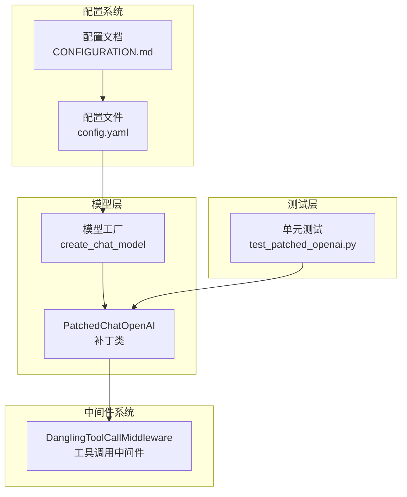
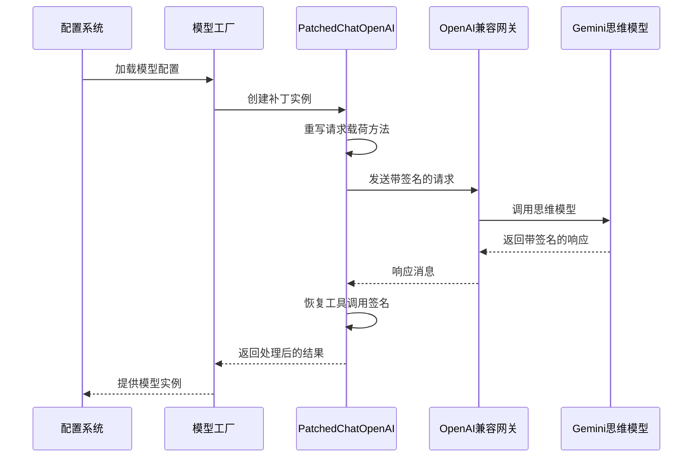
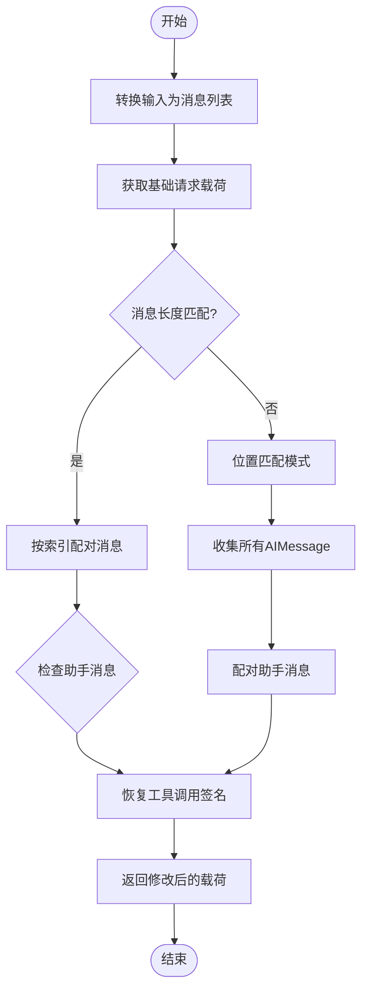
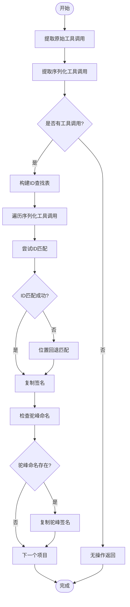
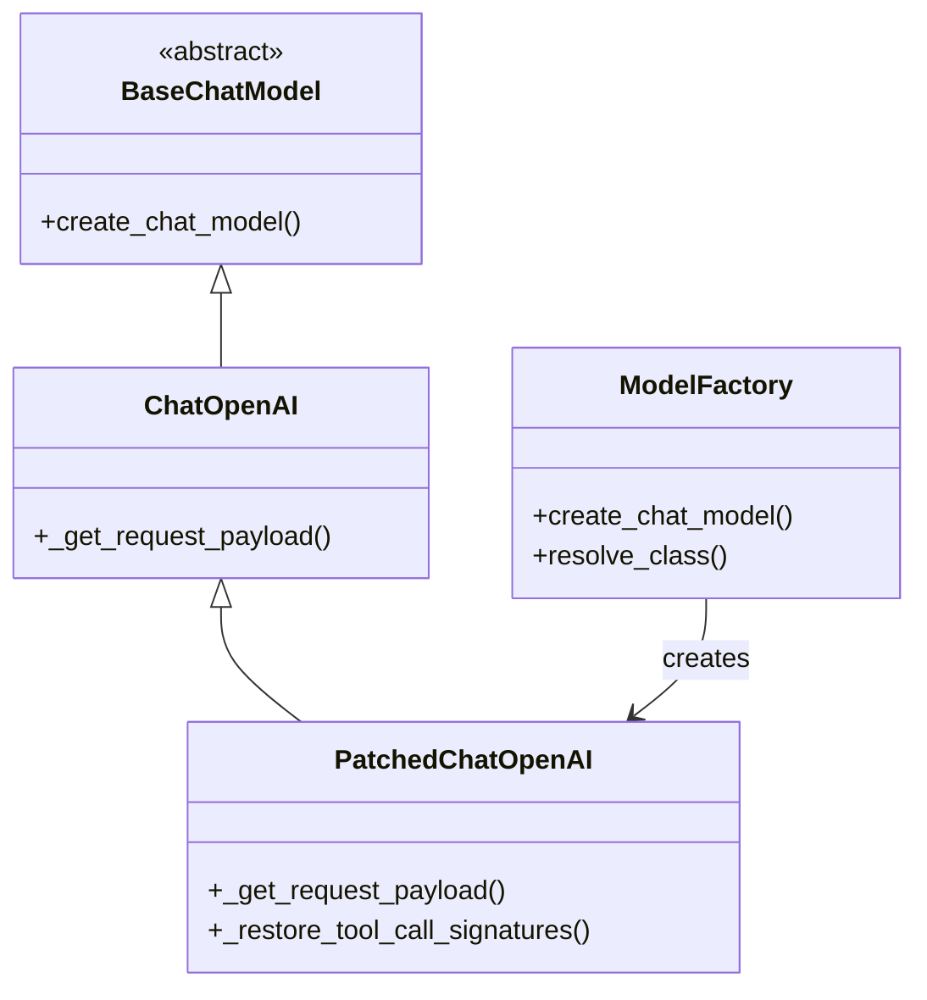
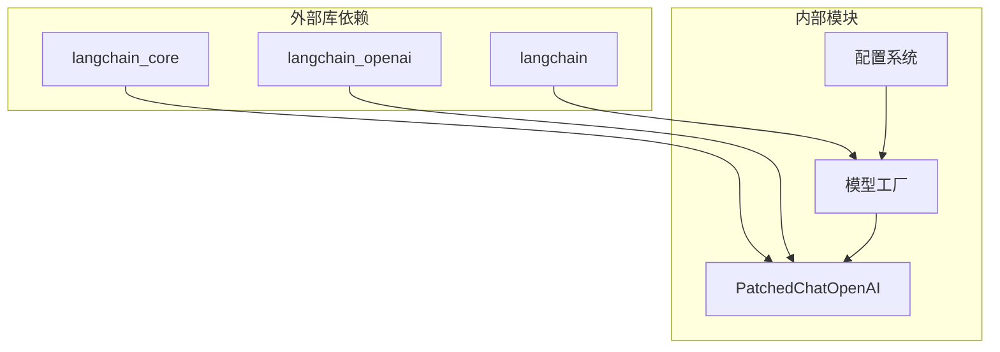

# OpenAI 补丁提供者

<cite>
**本文档引用的文件**
- [patched_openai.py](file://backend/packages/harness/deerflow/models/patched_openai.py)
- [test_patched_openai.py](file://backend/tests/test_patched_openai.py)
- [factory.py](file://backend/packages/harness/deerflow/models/factory.py)
- [CONFIGURATION.md](file://backend/docs/CONFIGURATION.md)
- [config.example.yaml](file://config.example.yaml)
- [dangling_tool_call_middleware.py](file://backend/packages/harness/deerflow/agents/middlewares/dangling_tool_call_middleware.py)
</cite>

## 目录
1. [简介](#简介)
2. [项目结构](#项目结构)
3. [核心组件](#核心组件)
4. [架构概览](#架构概览)
5. [详细组件分析](#详细组件分析)
6. [依赖关系分析](#依赖关系分析)
7. [性能考虑](#性能考虑)
8. [故障排除指南](#故障排除指南)
9. [结论](#结论)

## 简介

OpenAI 补丁提供者是 deer-flow 项目中的一个关键组件，专门用于解决 Gemini 思维模型在 OpenAI 兼容网关中的 thought_signature 丢失问题。该解决方案通过重写 `ChatOpenAI` 的 `_get_request_payload` 方法，确保在多轮对话中正确保留和传递工具调用签名。

该补丁主要针对以下场景：
- 使用 Vertex AI OpenAI 兼容端点的 Gemini 思维模型
- Google AI Studio 的 Gemini 集成
- 第三方 OpenAI 兼容网关的思维模式支持

## 项目结构

OpenAI 补丁提供者位于 deer-flow 项目的模型层中，与工厂模式和配置系统紧密集成：



**图表来源**
- [patched_openai.py:1-135](file://backend/packages/harness/deerflow/models/patched_openai.py#L1-L135)
- [factory.py:11-96](file://backend/packages/harness/deerflow/models/factory.py#L11-L96)

**章节来源**
- [patched_openai.py:1-135](file://backend/packages/harness/deerflow/models/patched_openai.py#L1-L135)
- [factory.py:11-96](file://backend/packages/harness/deerflow/models/factory.py#L11-L96)

## 核心组件

### PatchedChatOpenAI 类

`PatchedChatOpenAI` 是对标准 `ChatOpenAI` 的增强版本，专门处理 Gemini 思维模型的 thought_signature 问题。该类继承自 `langchain_openai.ChatOpenAI` 并重写了关键的请求载荷生成方法。

#### 主要特性
- **thought_signature 保留**：确保工具调用签名在多轮对话中正确传递
- **智能匹配策略**：支持基于 ID 的精确匹配和位置回退策略
- **兼容性处理**：支持 snake_case 和 camelCase 键名格式
- **错误处理**：优雅处理各种边界情况和异常场景

#### 关键方法
- `_get_request_payload`：重写的请求载荷生成方法
- `_restore_tool_call_signatures`：辅助函数，负责签名恢复逻辑

**章节来源**
- [patched_openai.py:31-94](file://backend/packages/harness/deerflow/models/patched_openai.py#L31-L94)

## 架构概览

OpenAI 补丁提供者在整个系统架构中扮演着桥梁角色，连接配置系统、模型工厂和实际的 AI 服务调用：



**图表来源**
- [patched_openai.py:57-93](file://backend/packages/harness/deerflow/models/patched_openai.py#L57-L93)
- [factory.py:11-80](file://backend/packages/harness/deerflow/models/factory.py#L11-L80)

## 详细组件分析

### _get_request_payload 方法重写

该方法是补丁的核心实现，负责在请求发送前恢复丢失的 thought_signature：

#### 实现流程



**图表来源**
- [patched_openai.py:73-93](file://backend/packages/harness/deerflow/models/patched_openai.py#L73-L93)

#### 匹配策略

补丁实现了两种匹配策略以确保最大兼容性：

1. **精确 ID 匹配**：优先使用工具调用的 ID 进行精确匹配
2. **位置回退**：当 ID 不匹配时，使用数组索引进行位置匹配

**章节来源**
- [patched_openai.py:73-93](file://backend/packages/harness/deerflow/models/patched_openai.py#L73-L93)

### _restore_tool_call_signatures 辅助函数

这个私有函数是签名恢复的核心逻辑实现：

#### 工作原理



**图表来源**
- [patched_openai.py:96-135](file://backend/packages/harness/deerflow/models/patched_openai.py#L96-L135)

#### 关键特性

1. **双格式支持**：同时支持 `thought_signature`（snake_case）和 `thoughtSignature`（camelCase）
2. **高效查找**：使用字典映射实现 O(1) 的 ID 查找
3. **安全处理**：对空值和缺失字段进行安全检查
4. **位置回退**：确保即使在 ID 不匹配的情况下也能正确处理

**章节来源**
- [patched_openai.py:96-135](file://backend/packages/harness/deerflow/models/patched_openai.py#L96-L135)

### 配置集成

补丁提供者与 deer-flow 的配置系统无缝集成：

#### 配置示例

```yaml
models:
  - name: gemini-2.5-pro-thinking
    display_name: Gemini 2.5 Pro (Thinking)
    use: deerflow.models.patched_openai:PatchedChatOpenAI
    model: google/gemini-2.5-pro-preview
    api_key: $GEMINI_API_KEY
    base_url: https://<your-openai-compat-gateway>/v1
    max_tokens: 16384
    supports_thinking: true
    supports_vision: true
    when_thinking_enabled:
      extra_body:
        thinking:
          type: enabled
```

#### 工厂模式集成

模型工厂负责根据配置动态创建适当的模型实例：



**图表来源**
- [patched_openai.py:31-55](file://backend/packages/harness/deerflow/models/patched_openai.py#L31-L55)
- [factory.py:11-80](file://backend/packages/harness/deerflow/models/factory.py#L11-L80)

**章节来源**
- [factory.py:11-80](file://backend/packages/harness/deerflow/models/factory.py#L11-L80)
- [CONFIGURATION.md:139-167](file://backend/docs/CONFIGURATION.md#L139-L167)

## 依赖关系分析

### 外部依赖

补丁提供者依赖于以下关键库：



**图表来源**
- [patched_openai.py:26-28](file://backend/packages/harness/deerflow/models/patched_openai.py#L26-L28)
- [factory.py:3](file://backend/packages/harness/deerflow/models/factory.py#L3)

### 内部耦合

补丁提供者与系统的其他部分保持松散耦合：

1. **配置解耦**：通过字符串类名解析实现运行时绑定
2. **工厂模式**：避免直接依赖具体实现类
3. **接口抽象**：依赖抽象基类而非具体实现

**章节来源**
- [patched_openai.py:26-28](file://backend/packages/harness/deerflow/models/patched_openai.py#L26-L28)
- [factory.py:26](file://backend/packages/harness/deerflow/models/factory.py#L26)

## 性能考虑

### 时间复杂度分析

- **ID 匹配查找**：O(n) - 使用哈希表实现 O(1) 查找
- **位置回退匹配**：O(n) - 最坏情况下需要遍历整个数组
- **总体复杂度**：O(n) - n 为工具调用数量

### 空间复杂度分析

- **查找表存储**：O(n) - 存储原始工具调用的 ID 映射
- **临时数据结构**：O(n) - 存储消息配对信息
- **总体空间复杂度**：O(n)

### 优化策略

1. **早期退出**：当没有工具调用时立即返回
2. **缓存机制**：可考虑缓存已匹配的结果
3. **批量处理**：对于大量工具调用可考虑并行处理

## 故障排除指南

### 常见问题及解决方案

#### 1. thought_signature 缺失错误

**症状**：API 返回 HTTP 400 INVALID_ARGUMENT 错误，提示缺少 thought_signature

**原因**：标准 ChatOpenAI 在序列化过程中丢弃了 thought_signature 字段

**解决方案**：使用 PatchedChatOpenAI 替代标准 ChatOpenAI

#### 2. ID 匹配失败

**症状**：工具调用签名未正确恢复

**可能原因**：
- 原始消息中的工具调用 ID 为空
- 网关返回的工具调用 ID 与原始 ID 不一致

**解决方案**：检查位置回退机制是否正常工作

#### 3. 驼峰命名不兼容

**症状**：某些网关使用 thoughtSignature 而非 thought_signature

**解决方案**：补丁已自动处理两种命名格式

### 调试技巧

#### 启用详细日志

```python
import logging
logging.basicConfig(level=logging.DEBUG)
```

#### 验证消息结构

```python
# 检查 AIMessage 的 additional_kwargs
print(ai_message.additional_kwargs.get("tool_calls"))
```

#### 测试签名恢复

```python
# 使用单元测试验证签名恢复逻辑
pytest backend/tests/test_patched_openai.py
```

**章节来源**
- [test_patched_openai.py:49-177](file://backend/tests/test_patched_openai.py#L49-L177)

### 集成验证

#### 单元测试覆盖

补丁提供者包含全面的单元测试，覆盖以下场景：

1. **ID 基础匹配**：验证基于 ID 的精确匹配
2. **位置回退**：测试 ID 不匹配时的位置匹配
3. **驼峰命名支持**：验证 camelCase 键名处理
4. **并行工具调用**：处理多个工具调用的情况
5. **边缘情况**：处理空值和异常场景

**章节来源**
- [test_patched_openai.py:49-177](file://backend/tests/test_patched_openai.py#L49-L177)

## 结论

OpenAI 补丁提供者是一个精心设计的解决方案，有效解决了 Gemini 思维模型在 OpenAI 兼容网关中的 thought_signature 丢失问题。该补丁通过以下方式实现了高质量的解决方案：

### 技术优势

1. **精确修复**：针对具体问题提供精确的解决方案
2. **向后兼容**：保持与现有代码的完全兼容性
3. **健壮性**：处理各种边界情况和异常场景
4. **性能优化**：使用高效的算法和数据结构

### 设计亮点

1. **模块化设计**：清晰的职责分离和接口定义
2. **测试驱动**：全面的单元测试确保代码质量
3. **配置集成**：无缝集成到现有的配置系统
4. **文档完善**：详细的使用说明和最佳实践

### 应用价值

该补丁为开发者提供了：
- **简化集成**：无需修改上游库即可获得完整功能
- **稳定可靠**：经过充分测试的生产级解决方案
- **易于维护**：清晰的代码结构和完善的文档
- **扩展性强**：为未来类似问题提供参考模式

通过这个补丁，开发者可以专注于业务逻辑的实现，而不必担心底层的兼容性问题，从而提高开发效率和系统稳定性。