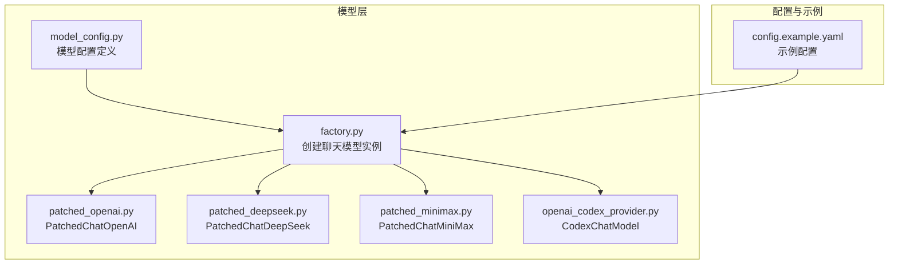
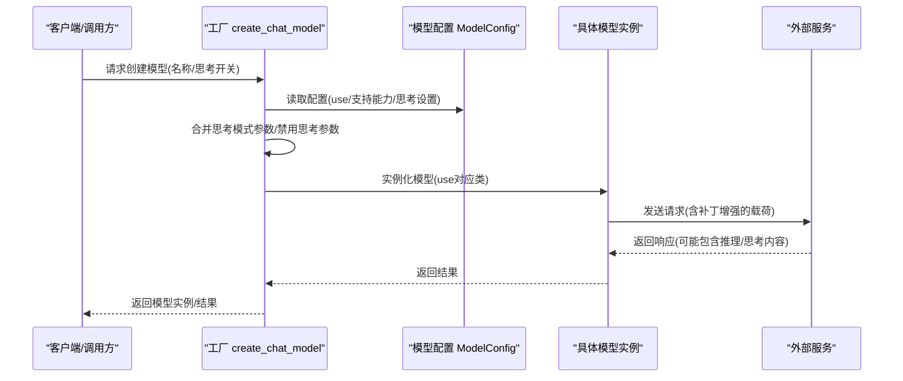
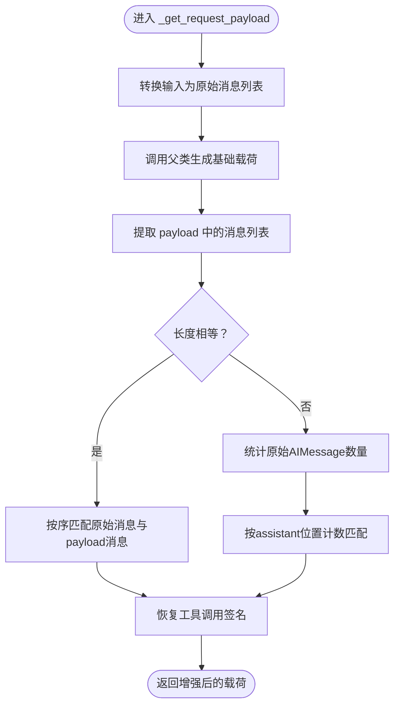
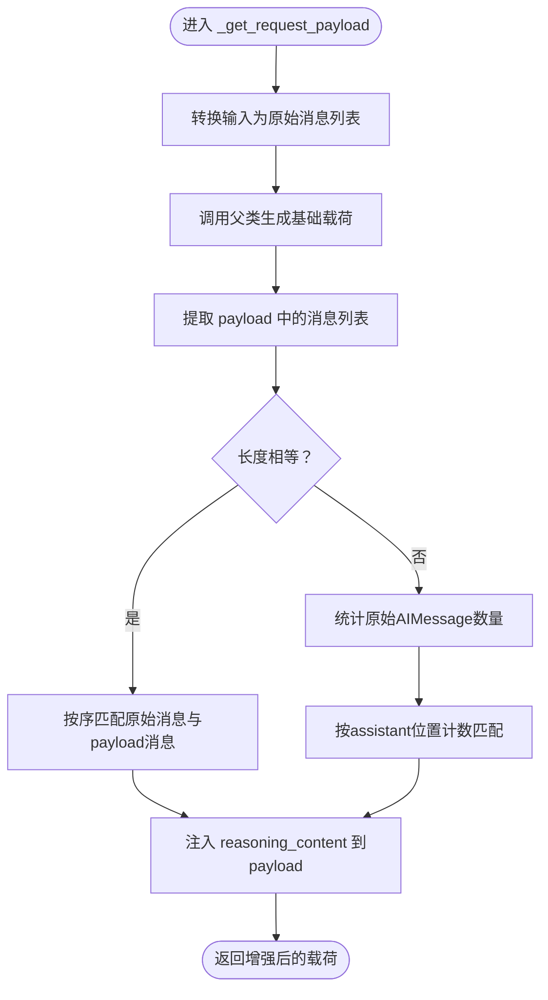
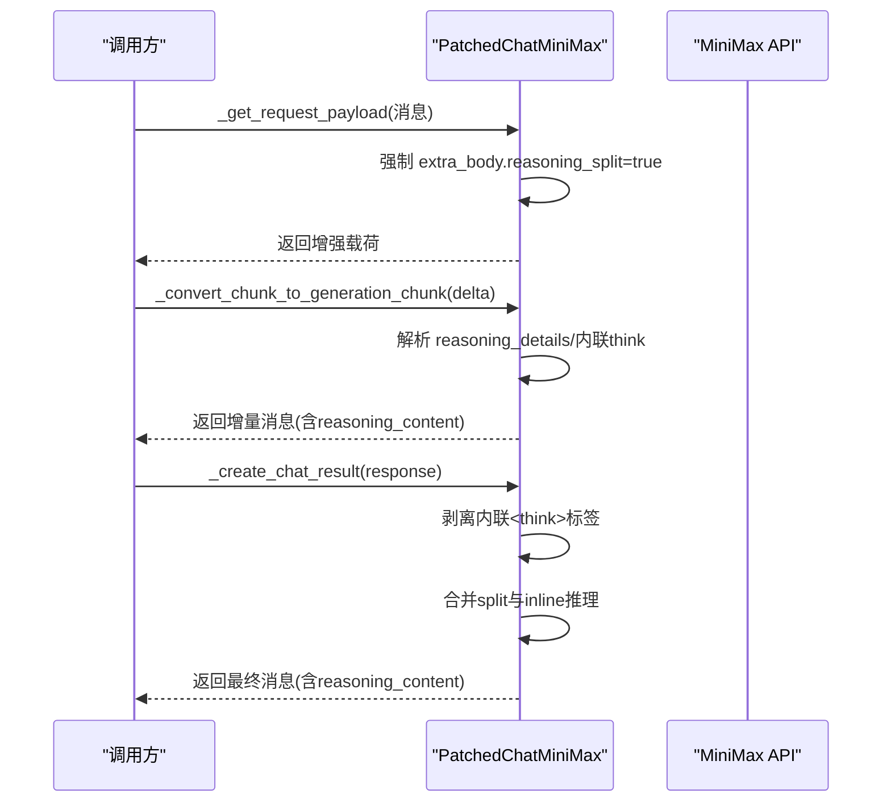
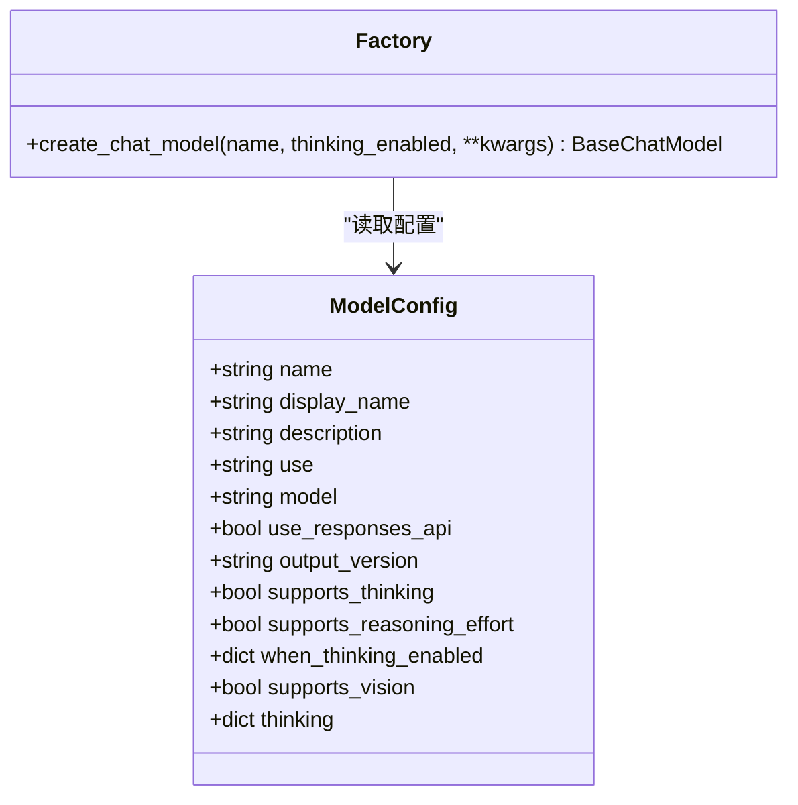
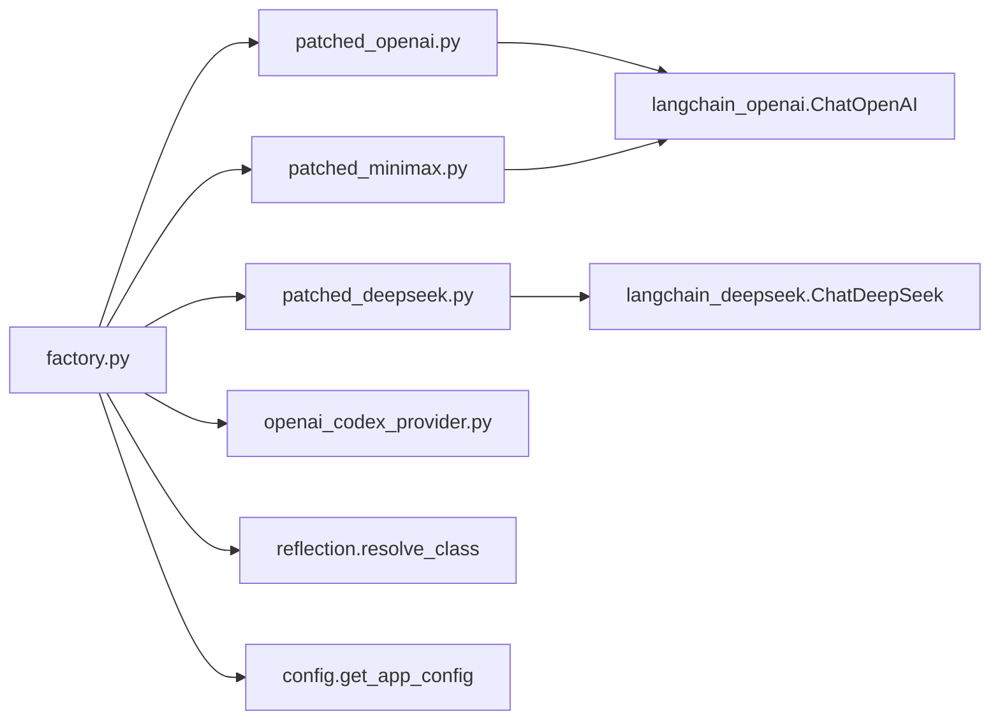

# 补丁提供者

<cite>
**本文引用的文件**
- [backend/packages/harness/deerflow/models/patched_openai.py](file://backend/packages/harness/deerflow/models/patched_openai.py)
- [backend/packages/harness/deerflow/models/patched_deepseek.py](file://backend/packages/harness/deerflow/models/patched_deepseek.py)
- [backend/packages/harness/deerflow/models/patched_minimax.py](file://backend/packages/harness/deerflow/models/patched_minimax.py)
- [backend/packages/harness/deerflow/models/factory.py](file://backend/packages/harness/deerflow/models/factory.py)
- [backend/packages/harness/deerflow/models/openai_codex_provider.py](file://backend/packages/harness/deerflow/models/openai_codex_provider.py)
- [backend/packages/harness/deerflow/config/model_config.py](file://backend/packages/harness/deerflow/config/model_config.py)
- [backend/tests/test_patched_openai.py](file://backend/tests/test_patched_openai.py)
- [backend/tests/test_patched_minimax.py](file://backend/tests/test_patched_minimax.py)
- [config.example.yaml](file://config.example.yaml)
</cite>

## 目录
1. [引言](#引言)
2. [项目结构](#项目结构)
3. [核心组件](#核心组件)
4. [架构总览](#架构总览)
5. [详细组件分析](#详细组件分析)
6. [依赖分析](#依赖分析)
7. [性能考量](#性能考量)
8. [故障排除指南](#故障排除指南)
9. [结论](#结论)
10. [附录](#附录)

## 引言
本技术文档围绕“补丁提供者”体系展开，系统阐述补丁模型的设计理念与实现机制，重点说明对原生模型的增强、缺陷修复与功能改进。文档覆盖以下三类补丁提供者：
- OpenAI 补丁提供者：用于在使用 OpenAI 兼容网关（如 Gemini Thinking）时，确保多轮对话中工具调用的 thought_signature 被正确回注到请求载荷，避免因缺失签名导致的错误。
- DeepSeek 补丁提供者：用于在启用推理/思考模式时，确保 reasoning_content 在后续请求中被保留，满足部分 API 对所有助手消息均需携带 reasoning_content 的要求。
- MiniMax 补丁提供者：用于在 MiniMax 的 OpenAI 兼容接口返回结构化 reasoning_details 时，将其映射为前端可识别的 additional_kwargs.reasoning_content，并处理内联 think 标签。

同时，文档解释补丁机制如何解决原生模型的问题、提升性能与扩展功能；给出补丁配置选项、兼容性考虑与使用场景；并提供集成示例与故障排除指南。

## 项目结构
补丁提供者位于后端 harness 包下的 models 子模块，配合工厂方法与配置模型共同工作，形成从配置到实例化的完整链路。

图表来源
- [backend/packages/harness/deerflow/models/factory.py:11-96](file://backend/packages/harness/deerflow/models/factory.py#L11-L96)
- [backend/packages/harness/deerflow/config/model_config.py:4-38](file://backend/packages/harness/deerflow/config/model_config.py#L4-L38)
- [backend/packages/harness/deerflow/models/patched_openai.py:31-135](file://backend/packages/harness/deerflow/models/patched_openai.py#L31-L135)
- [backend/packages/harness/deerflow/models/patched_deepseek.py:17-66](file://backend/packages/harness/deerflow/models/patched_deepseek.py#L17-L66)
- [backend/packages/harness/deerflow/models/patched_minimax.py:98-221](file://backend/packages/harness/deerflow/models/patched_minimax.py#L98-L221)
- [backend/packages/harness/deerflow/models/openai_codex_provider.py:33-397](file://backend/packages/harness/deerflow/models/openai_codex_provider.py#L33-L397)
- [config.example.yaml:36-216](file://config.example.yaml#L36-L216)

章节来源
- [backend/packages/harness/deerflow/models/factory.py:11-96](file://backend/packages/harness/deerflow/models/factory.py#L11-L96)
- [backend/packages/harness/deerflow/config/model_config.py:4-38](file://backend/packages/harness/deerflow/config/model_config.py#L4-L38)
- [config.example.yaml:36-216](file://config.example.yaml#L36-L216)

## 核心组件
- 模型工厂 create_chat_model：根据配置解析类路径，合并思考模式开关与额外参数，创建具体模型实例，并按需附加追踪回调。
- 配置模型 ModelConfig：描述模型名称、显示名、类路径 use、是否支持思考/推理、思考开启时的额外设置等字段。
- 补丁模型：
  - PatchedChatOpenAI：在多轮对话中恢复工具调用的 thought_signature。
  - PatchedChatDeepSeek：在多轮对话中恢复 reasoning_content。
  - PatchedChatMiniMax：在请求中强制 reasoning_split 并将 reasoning_details 映射为 reasoning_content，同时处理内联 think 标签。
- Codex 提供者 CodexChatModel：自定义 OpenAI 兼容 Responses API 的实现，支持工具调用、流式输出与重试。

章节来源
- [backend/packages/harness/deerflow/models/factory.py:11-96](file://backend/packages/harness/deerflow/models/factory.py#L11-L96)
- [backend/packages/harness/deerflow/config/model_config.py:4-38](file://backend/packages/harness/deerflow/config/model_config.py#L4-L38)
- [backend/packages/harness/deerflow/models/patched_openai.py:31-135](file://backend/packages/harness/deerflow/models/patched_openai.py#L31-L135)
- [backend/packages/harness/deerflow/models/patched_deepseek.py:17-66](file://backend/packages/harness/deerflow/models/patched_deepseek.py#L17-L66)
- [backend/packages/harness/deerflow/models/patched_minimax.py:98-221](file://backend/packages/harness/deerflow/models/patched_minimax.py#L98-L221)
- [backend/packages/harness/deerflow/models/openai_codex_provider.py:33-397](file://backend/packages/harness/deerflow/models/openai_codex_provider.py#L33-L397)

## 架构总览
补丁提供者通过统一的工厂方法接入配置系统，按需注入额外行为以适配不同供应商的特殊要求。

图表来源
- [backend/packages/harness/deerflow/models/factory.py:11-96](file://backend/packages/harness/deerflow/models/factory.py#L11-L96)
- [backend/packages/harness/deerflow/config/model_config.py:4-38](file://backend/packages/harness/deerflow/config/model_config.py#L4-L38)

## 详细组件分析

### OpenAI 补丁提供者（PatchedChatOpenAI）
设计理念与问题定位
- 当通过 OpenAI 兼容网关（如 Vertex AI、Google AI Studio 或代理）使用 Gemini Thinking 时，API 要求在后续请求中回显原始工具调用对象上的 thought_signature 字段。标准 LangChain ChatOpenAI 在序列化时会丢弃该签名，导致请求失败。
- 补丁通过覆写请求载荷生成逻辑，在发送前将原始 AIMessage 中存储的工具调用原始字典中的 thought_signature 回注到序列化后的 payload 中。

实现要点
- 覆写 _get_request_payload：在父类生成基础载荷后，遍历原始消息与 payload 消息，匹配角色为 assistant 且类型为 AIMessage 的条目，恢复工具调用签名。
- 匹配策略：优先按 id 精确匹配，若 id 不可用则按位置回退；同时兼容 snake_case 与 camelCase 键名。
- 边界处理：当原始或 payload 中无工具调用时直接跳过；仅对存在签名的工具调用进行回注。

图表来源
- [backend/packages/harness/deerflow/models/patched_openai.py:57-93](file://backend/packages/harness/deerflow/models/patched_openai.py#L57-L93)
- [backend/packages/harness/deerflow/models/patched_openai.py:96-135](file://backend/packages/harness/deerflow/models/patched_openai.py#L96-L135)

章节来源
- [backend/packages/harness/deerflow/models/patched_openai.py:31-135](file://backend/packages/harness/deerflow/models/patched_openai.py#L31-L135)
- [backend/tests/test_patched_openai.py:54-177](file://backend/tests/test_patched_openai.py#L54-L177)

### DeepSeek 补丁提供者（PatchedChatDeepSeek）
设计理念与问题定位
- 原始 ChatDeepSeek 在多轮对话中会将 reasoning_content 存储在 additional_kwargs 中，但在后续请求中不会将其包含在载荷里，导致某些需要在所有助手消息上携带 reasoning_content 的 API 报错。
- 补丁通过覆写 _get_request_payload，将 AIMessage 的 reasoning_content 注入到 payload 的对应 assistant 消息中。

实现要点
- 覆写 _get_request_payload：在生成基础载荷后，遍历原始消息与 payload 消息，匹配 assistant 角色与 AIMessage 类型，将 reasoning_content 写回 payload。
- 匹配策略：优先严格顺序匹配，若不一致则按 assistant 数量计数匹配。
- 边界处理：仅在 additional_kwargs 中存在 reasoning_content 时才注入。

图表来源
- [backend/packages/harness/deerflow/models/patched_deepseek.py:26-66](file://backend/packages/harness/deerflow/models/patched_deepseek.py#L26-L66)

章节来源
- [backend/packages/harness/deerflow/models/patched_deepseek.py:17-66](file://backend/packages/harness/deerflow/models/patched_deepseek.py#L17-L66)

### MiniMax 补丁提供者（PatchedChatMiniMax）
设计理念与问题定位
- MiniMax 的 OpenAI 兼容接口在启用 extra_body.reasoning_split=true 时，会返回结构化的 reasoning_details。LangChain ChatOpenAI 默认忽略该字段，导致前端无法获得推理内容。
- 补丁通过以下方式解决：
  - 在请求载荷中强制添加 reasoning_split=true；
  - 将 reasoning_details 映射为 additional_kwargs.reasoning_content；
  - 处理内联 think 标签，剥离标签并将内部思考文本合并到 reasoning_content。

实现要点
- 请求增强：覆写 _get_request_payload，确保 extra_body.reasoning_split 为真。
- 流式增量处理：覆写 _convert_chunk_to_generation_chunk，从 delta 中提取 reasoning_details 并累积到消息的 reasoning_content。
- 结果后处理：覆写 _create_chat_result，剥离内联 think 标签，合并 split 与 inline 推理内容到 reasoning_content。

图表来源
- [backend/packages/harness/deerflow/models/patched_minimax.py:101-117](file://backend/packages/harness/deerflow/models/patched_minimax.py#L101-L117)
- [backend/packages/harness/deerflow/models/patched_minimax.py:119-181](file://backend/packages/harness/deerflow/models/patched_minimax.py#L119-L181)
- [backend/packages/harness/deerflow/models/patched_minimax.py:183-221](file://backend/packages/harness/deerflow/models/patched_minimax.py#L183-L221)

章节来源
- [backend/packages/harness/deerflow/models/patched_minimax.py:98-221](file://backend/packages/harness/deerflow/models/patched_minimax.py#L98-L221)
- [backend/tests/test_patched_minimax.py:15-150](file://backend/tests/test_patched_minimax.py#L15-L150)

### 工厂与配置（create_chat_model 与 ModelConfig）
- 工厂方法 create_chat_model：从配置中解析 use 类路径，合并 when_thinking_enabled 与 thinking 快捷字段，按需注入思考相关参数（如禁用思考时的 thinking.type=disabled 或 reasoning_effort=minimal），并处理 Codex 特殊逻辑（移除 max_tokens、映射 reasoning_effort）。
- 配置模型 ModelConfig：定义 name/use/model 等基础字段，以及 supports_thinking/supports_reasoning_effort/when_thinking_enabled/thinking/supports_vision 等能力与开关字段。

图表来源
- [backend/packages/harness/deerflow/config/model_config.py:4-38](file://backend/packages/harness/deerflow/config/model_config.py#L4-L38)
- [backend/packages/harness/deerflow/models/factory.py:11-96](file://backend/packages/harness/deerflow/models/factory.py#L11-L96)

章节来源
- [backend/packages/harness/deerflow/models/factory.py:11-96](file://backend/packages/harness/deerflow/models/factory.py#L11-L96)
- [backend/packages/harness/deerflow/config/model_config.py:4-38](file://backend/packages/harness/deerflow/config/model_config.py#L4-L38)

### Codex 提供者（CodexChatModel）
- 设计目标：使用 ChatGPT Codex Responses API，支持自动加载凭据、Responses API 格式、工具调用、流式输出与指数退避重试。
- 关键点：将 LangChain 消息转换为 Responses API 输入格式，按需绑定工具，流式解析事件帧，最终组装为 ChatResult，并在 additional_kwargs 中注入 reasoning_content。

章节来源
- [backend/packages/harness/deerflow/models/openai_codex_provider.py:33-397](file://backend/packages/harness/deerflow/models/openai_codex_provider.py#L33-L397)

## 依赖分析
- PatchedChatOpenAI 依赖 LangChain Core 的 LanguageModelInput/AIMessage 与 langchain_openai.ChatOpenAI。
- PatchedChatDeepSeek 依赖 LangChain Core 的 LanguageModelInput/AIMessage 与 langchain_deepseek.ChatDeepSeek。
- PatchedChatMiniMax 依赖 LangChain Core 的 AIMessage/AIMessageChunk/ChatResult 与 langchain_openai.ChatOpenAI，并引入正则表达式处理内联 think 标签。
- 工厂方法依赖 deerflow.config 与 deerflow.reflection.resolve_class，按配置动态实例化模型。
- CodexChatModel 依赖 httpx 进行 SSE 流式通信，解析事件帧并组装 ChatResult。

图表来源
- [backend/packages/harness/deerflow/models/factory.py:5-26](file://backend/packages/harness/deerflow/models/factory.py#L5-L26)
- [backend/packages/harness/deerflow/models/patched_openai.py:26-28](file://backend/packages/harness/deerflow/models/patched_openai.py#L26-L28)
- [backend/packages/harness/deerflow/models/patched_deepseek.py:12-14](file://backend/packages/harness/deerflow/models/patched_deepseek.py#L12-L14)
- [backend/packages/harness/deerflow/models/patched_minimax.py:21-26](file://backend/packages/harness/deerflow/models/patched_minimax.py#L21-L26)

## 性能考量
- 请求载荷增强的开销极小：仅在生成 payload 时进行一次消息匹配与字段复制，时间复杂度近似 O(n)。
- 流式处理：MiniMax 补丁在增量阶段即合并 reasoning 内容，避免一次性拼接大字符串带来的峰值内存压力。
- 重试与超时：Codex 提供者采用指数退避重试与合理超时，降低网络抖动对整体性能的影响。
- 配置驱动的开关：通过 when_thinking_enabled 与 thinking 字段控制额外参数注入，避免不必要的参数传递。

## 故障排除指南
常见问题与排查步骤
- OpenAI 兼容网关报错缺少 thought_signature
  - 确认使用 PatchedChatOpenAI 并在配置中设置 supports_thinking=true 与 when_thinking_enabled.extra_body.thinking.type=enabled。
  - 检查工具调用是否携带 thought_signature；若仍失败，确认原始 AIMessage.additional_kwargs.tool_calls 是否存在。
  - 参考单元测试验证 id 匹配、camelCase 键名与位置回退逻辑。
- DeepSeek 推理内容缺失
  - 确认使用 PatchedChatDeepSeek 并在配置中设置 supports_thinking=true。
  - 检查 AIMessage.additional_kwargs.reasoning_content 是否存在；若不存在，确认上游是否正确生成。
- MiniMax 推理内容未显示
  - 确认请求载荷中 extra_body.reasoning_split=true；可通过 _get_request_payload 的断言验证。
  - 检查 responses 中 reasoning_details 与内联 think 标签是否正确映射至 reasoning_content。
  - 若出现内容重复或空白，检查_strip_inline_think_tags与_extract_reasoning_text的合并逻辑。
- 思考模式参数冲突
  - 禁用思考时，工厂会注入 thinking.type=disabled 或 reasoning_effort=minimal；若底层模型不支持，应移除该字段或调整配置。
- Codex API 错误
  - 关注 429/500/529 状态码的指数退避重试；若持续失败，检查凭据与账户 ID 是否正确加载。

章节来源
- [backend/tests/test_patched_openai.py:54-177](file://backend/tests/test_patched_openai.py#L54-L177)
- [backend/tests/test_patched_minimax.py:15-150](file://backend/tests/test_patched_minimax.py#L15-L150)
- [backend/packages/harness/deerflow/models/factory.py:48-62](file://backend/packages/harness/deerflow/models/factory.py#L48-L62)
- [backend/packages/harness/deerflow/models/openai_codex_provider.py:198-214](file://backend/packages/harness/deerflow/models/openai_codex_provider.py#L198-L214)

## 结论
补丁提供者通过对原生模型的轻量增强，解决了跨供应商在思考/推理与工具调用方面的兼容性问题。OpenAI 补丁确保 thought_signature 的回注，DeepSeek 补丁保证 reasoning_content 的延续，MiniMax 补丁将结构化推理内容映射为前端可消费的格式。工厂与配置系统使这些增强以声明式方式生效，既提升了稳定性与一致性，又保持了良好的扩展性与可维护性。

## 附录

### 配置选项与使用场景
- PatchedChatOpenAI
  - 适用场景：通过 OpenAI 兼容网关使用 Gemini Thinking。
  - 关键配置：use 设置为 deerflow.models.patched_openai:PatchedChatOpenAI；supports_thinking=true；when_thinking_enabled.extra_body.thinking.type=enabled。
- PatchedChatDeepSeek
  - 适用场景：DeepSeek/类似供应商启用推理/思考模式。
  - 关键配置：use 设置为 deerflow.models.patched_deepseek:PatchedChatDeepSeek；supports_thinking=true。
- PatchedChatMiniMax
  - 适用场景：MiniMax OpenAI 兼容接口，需要结构化推理内容。
  - 关键配置：use 为 langchain_openai.ChatOpenAI 即可，补丁在内部强制 reasoning_split=true 并映射推理内容。
- 工厂与思考模式
  - thinking_enabled 参数由上层传入；工厂会根据配置自动注入禁用思考或推理努力等级等参数。

章节来源
- [config.example.yaml:93-140](file://config.example.yaml#L93-L140)
- [backend/packages/harness/deerflow/models/factory.py:41-62](file://backend/packages/harness/deerflow/models/factory.py#L41-L62)