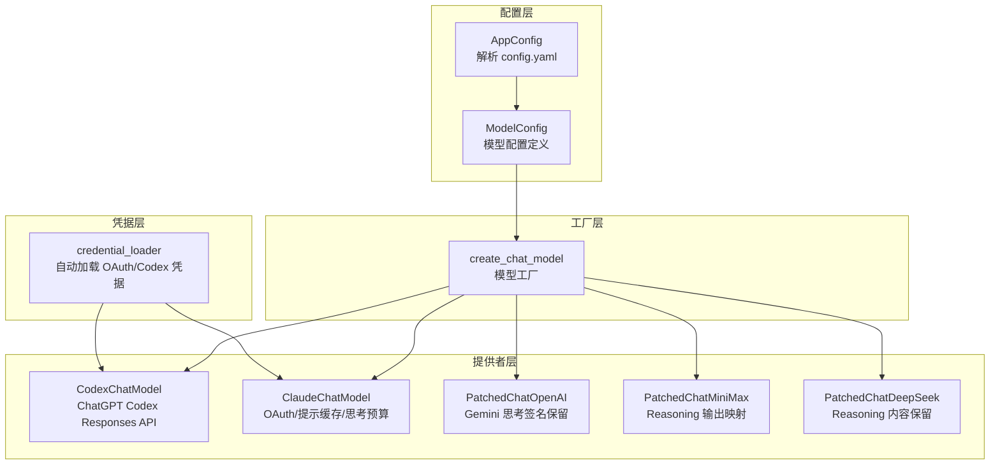
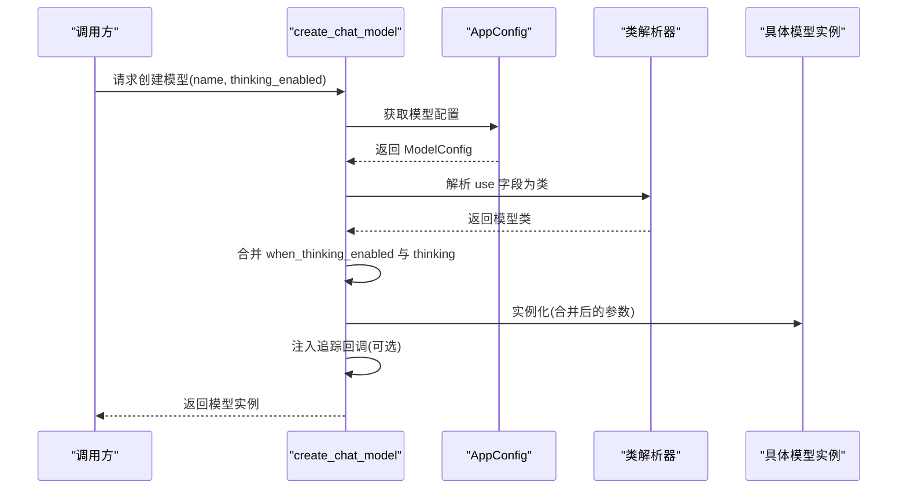
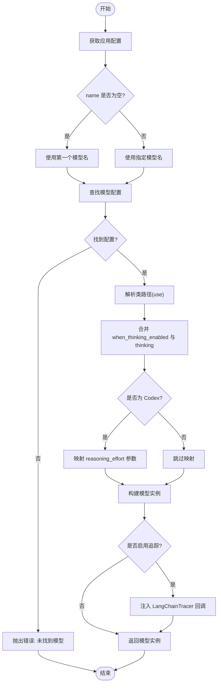
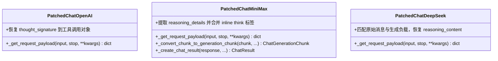
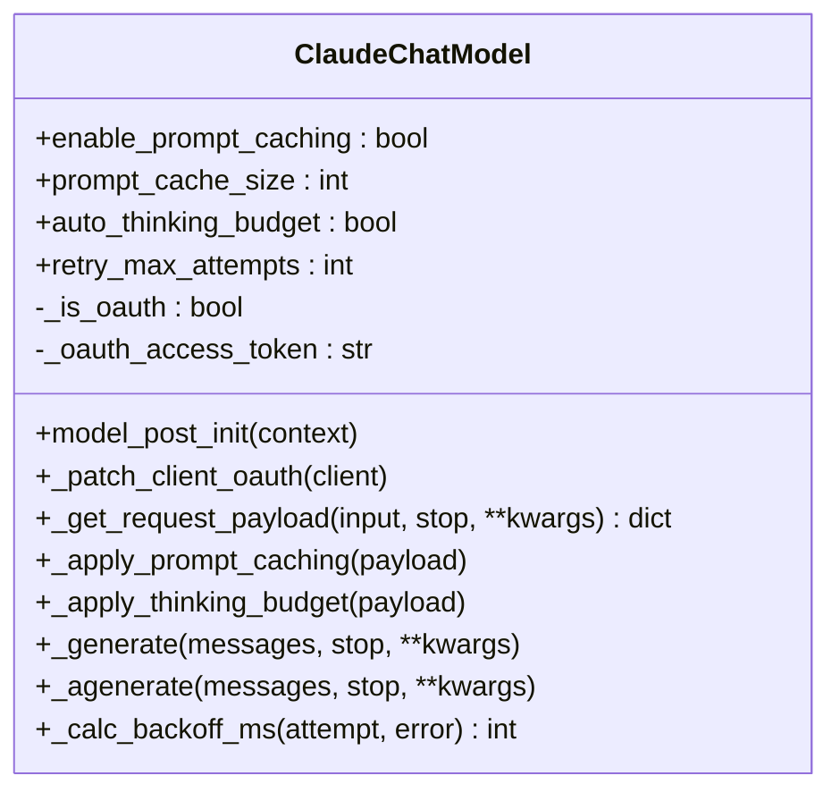
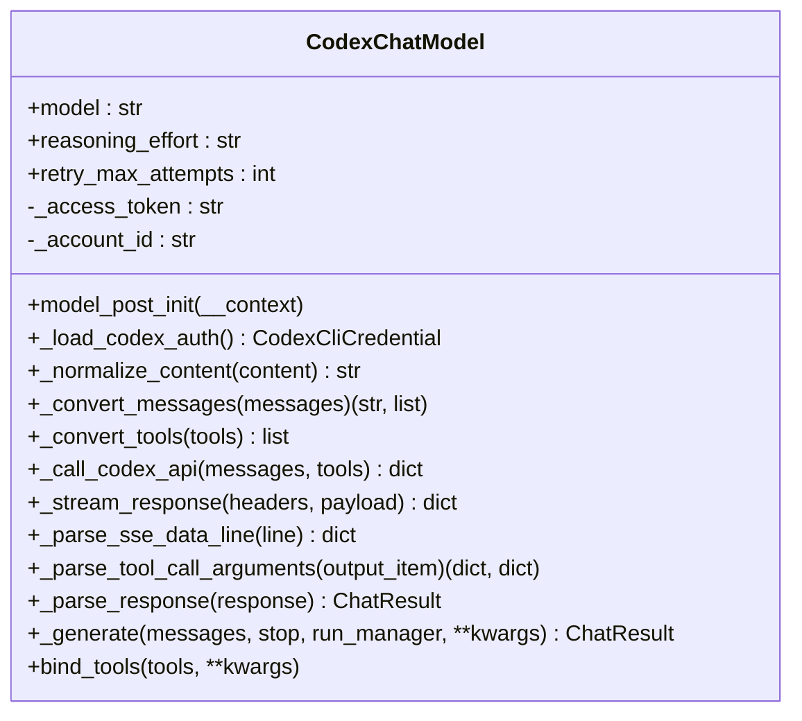
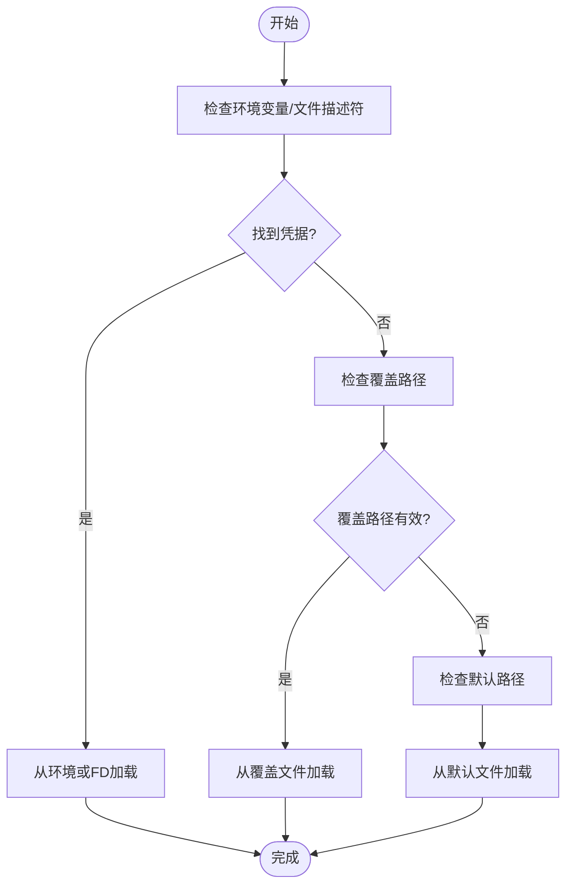
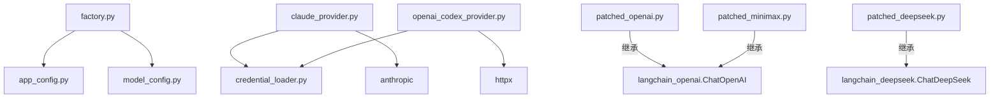

# 模型配置系统

<cite>
**本文档引用的文件**
- [factory.py](file://backend/packages/harness/deerflow/models/factory.py)
- [credential_loader.py](file://backend/packages/harness/deerflow/models/credential_loader.py)
- [openai_codex_provider.py](file://backend/packages/harness/deerflow/models/openai_codex_provider.py)
- [claude_provider.py](file://backend/packages/harness/deerflow/models/claude_provider.py)
- [patched_openai.py](file://backend/packages/harness/deerflow/models/patched_openai.py)
- [patched_minimax.py](file://backend/packages/harness/deerflow/models/patched_minimax.py)
- [patched_deepseek.py](file://backend/packages/harness/deerflow/models/patched_deepseek.py)
- [model_config.py](file://backend/packages/harness/deerflow/config/model_config.py)
- [app_config.py](file://backend/packages/harness/deerflow/config/app_config.py)
- [config.example.yaml](file://config.example.yaml)
- [test_model_factory.py](file://backend/tests/test_model_factory.py)
- [test_credential_loader.py](file://backend/tests/test_credential_loader.py)
</cite>

## 目录
1. [简介](#简介)
2. [项目结构](#项目结构)
3. [核心组件](#核心组件)
4. [架构总览](#架构总览)
5. [详细组件分析](#详细组件分析)
6. [依赖分析](#依赖分析)
7. [性能考虑](#性能考虑)
8. [故障排除指南](#故障排除指南)
9. [结论](#结论)
10. [附录](#附录)

## 简介
本文件面向 DeerFlow 的模型配置系统，系统性阐述模型工厂的设计原理、模型提供者实现与凭据加载机制。文档覆盖以下关键主题：
- 模型工厂如何从配置中解析并实例化具体模型提供者
- 凭据自动加载策略（Claude Code OAuth、Codex CLI）
- 各类模型提供者（OpenAI 兼容、Claude、CLI）的配置方法与特性
- 认证配置、API 密钥管理与代理设置
- 自定义模型提供者开发指南与性能优化建议
- 模型系统与智能体、工具的集成关系

## 项目结构
模型配置系统主要由以下模块构成：
- 配置层：应用配置解析与模型配置定义
- 工厂层：根据配置动态创建模型实例
- 提供者层：针对不同供应商的模型适配器
- 凭据层：自动加载外部 CLI 凭据

图表来源
- [app_config.py:30-131](file://backend/packages/harness/deerflow/config/app_config.py#L30-L131)
- [model_config.py:4-38](file://backend/packages/harness/deerflow/config/model_config.py#L4-L38)
- [factory.py:11-96](file://backend/packages/harness/deerflow/models/factory.py#L11-L96)
- [credential_loader.py:142-212](file://backend/packages/harness/deerflow/models/credential_loader.py#L142-L212)
- [openai_codex_provider.py:33-397](file://backend/packages/harness/deerflow/models/openai_codex_provider.py#L33-L397)
- [claude_provider.py:31-263](file://backend/packages/harness/deerflow/models/claude_provider.py#L31-L263)
- [patched_openai.py:31-135](file://backend/packages/harness/deerflow/models/patched_openai.py#L31-L135)
- [patched_minimax.py:98-221](file://backend/packages/harness/deerflow/models/patched_minimax.py#L98-L221)
- [patched_deepseek.py:17-66](file://backend/packages/harness/deerflow/models/patched_deepseek.py#L17-L66)

章节来源
- [app_config.py:30-131](file://backend/packages/harness/deerflow/config/app_config.py#L30-L131)
- [model_config.py:4-38](file://backend/packages/harness/deerflow/config/model_config.py#L4-L38)
- [factory.py:11-96](file://backend/packages/harness/deerflow/models/factory.py#L11-L96)

## 核心组件
- 模型工厂：根据名称解析配置，动态导入类路径，合并思考模式参数，并注入追踪回调
- 模型配置：描述模型名称、显示名、类路径、支持能力（思考/推理/视觉）、思考启用时的额外设置
- 应用配置：统一加载 YAML 配置，解析环境变量，提供模型/工具/技能等配置查询接口
- 凭据加载：自动从 Claude Code CLI 与 Codex CLI 的多种来源加载 OAuth/Codex 凭据

章节来源
- [factory.py:11-96](file://backend/packages/harness/deerflow/models/factory.py#L11-L96)
- [model_config.py:4-38](file://backend/packages/harness/deerflow/config/model_config.py#L4-L38)
- [app_config.py:203-234](file://backend/packages/harness/deerflow/config/app_config.py#L203-L234)
- [credential_loader.py:142-212](file://backend/packages/harness/deerflow/models/credential_loader.py#L142-L212)

## 架构总览
模型工厂通过应用配置获取模型定义，使用反射解析类路径，构造模型实例；同时根据思考模式开关与模型配置合并参数，处理特定模型的特殊行为（如 Codex 的 reasoning_effort 映射、追踪回调注入）。

图表来源
- [factory.py:11-96](file://backend/packages/harness/deerflow/models/factory.py#L11-L96)
- [app_config.py:203-234](file://backend/packages/harness/deerflow/config/app_config.py#L203-L234)

## 详细组件分析

### 模型工厂设计原理
- 输入：模型名称（可空，默认首个模型）、思考模式开关
- 流程：
  - 读取应用配置，定位目标模型配置
  - 反射解析 use 字段为具体模型类
  - 从配置导出除元信息外的参数字典
  - 合并思考模式相关设置（支持 thinking 快捷字段与 when_thinking_enabled）
  - 特定模型适配（如 Codex 将 reasoning_effort 映射到模型参数）
  - 注入追踪回调（可选）
- 错误处理：未找到模型、不支持思考模式、追踪初始化失败等

图表来源
- [factory.py:11-96](file://backend/packages/harness/deerflow/models/factory.py#L11-L96)

章节来源
- [factory.py:11-96](file://backend/packages/harness/deerflow/models/factory.py#L11-L96)
- [test_model_factory.py:127-291](file://backend/tests/test_model_factory.py#L127-L291)

### 模型提供者实现

#### OpenAI 兼容提供者
- PatchedChatOpenAI：修复 Gemini 通过 OpenAI 兼容网关启用思考时，tool-call 的 thought_signature 在多轮对话中丢失的问题，确保签名在请求中被正确回注。
- PatchedChatMiniMax：在 MiniMax 的 OpenAI 兼容 API 中保留 reasoning_details，将其映射为前端期望的 reasoning_content。
- PatchedChatDeepSeek：在多轮对话中保留 reasoning_content，确保启用思考模式时所有助手消息都携带该内容。

图表来源
- [patched_openai.py:31-135](file://backend/packages/harness/deerflow/models/patched_openai.py#L31-L135)
- [patched_minimax.py:98-221](file://backend/packages/harness/deerflow/models/patched_minimax.py#L98-L221)
- [patched_deepseek.py:17-66](file://backend/packages/harness/deerflow/models/patched_deepseek.py#L17-L66)

章节来源
- [patched_openai.py:31-135](file://backend/packages/harness/deerflow/models/patched_openai.py#L31-L135)
- [patched_minimax.py:98-221](file://backend/packages/harness/deerflow/models/patched_minimax.py#L98-L221)
- [patched_deepseek.py:17-66](file://backend/packages/harness/deerflow/models/patched_deepseek.py#L17-L66)

#### Claude 提供者
- ClaudeChatModel：支持标准 API Key 与 Claude Code OAuth 两种认证方式；自动检测 OAuth Token 并切换到 Authorization: Bearer 头；注入必需的 beta 头；支持提示缓存与自动思考预算分配；内置指数退避重试逻辑。

图表来源
- [claude_provider.py:31-263](file://backend/packages/harness/deerflow/models/claude_provider.py#L31-L263)

章节来源
- [claude_provider.py:31-263](file://backend/packages/harness/deerflow/models/claude_provider.py#L31-L263)

#### CLI 提供者
- CodexChatModel：基于 ChatGPT Codex Responses API，自动从 Codex CLI 加载凭据，支持函数调用、流式响应、指数退避重试；将 Responses API 响应转换为 LangChain ChatResult。

图表来源
- [openai_codex_provider.py:33-397](file://backend/packages/harness/deerflow/models/openai_codex_provider.py#L33-L397)

章节来源
- [openai_codex_provider.py:33-397](file://backend/packages/harness/deerflow/models/openai_codex_provider.py#L33-L397)

### 凭据加载机制
- Claude Code OAuth：支持直接环境变量、文件描述符、覆盖路径与默认文件路径；自动检测过期并记录警告
- Codex CLI：支持嵌套 tokens 与旧版顶层字段；支持覆盖路径

图表来源
- [credential_loader.py:142-212](file://backend/packages/harness/deerflow/models/credential_loader.py#L142-L212)

章节来源
- [credential_loader.py:142-212](file://backend/packages/harness/deerflow/models/credential_loader.py#L142-L212)
- [test_credential_loader.py:1-156](file://backend/tests/test_credential_loader.py#L1-L156)

### 配置方法与认证

#### OpenAI 兼容提供者
- 使用标准 ChatOpenAI 或 PatchedChatOpenAI（当需要保留 thought_signature 时）
- 支持通过 base_url 指向任意 OpenAI 兼容网关
- 支持 thinking/reasoning_effort 的配置与自动映射

章节来源
- [config.example.yaml:52-111](file://config.example.yaml#L52-L111)
- [patched_openai.py:31-135](file://backend/packages/harness/deerflow/models/patched_openai.py#L31-L135)

#### Claude 提供者
- 使用 ChatAnthropic 或 ClaudeChatModel（推荐后者以获得 OAuth/提示缓存/思考预算能力）
- 支持标准 API Key 与 Claude Code OAuth（自动检测并切换头）

章节来源
- [config.example.yaml:72-82](file://config.example.yaml#L72-L82)
- [claude_provider.py:31-263](file://backend/packages/harness/deerflow/models/claude_provider.py#L31-L263)

#### CLI 提供者
- 使用 CodexChatModel，自动从 Codex CLI 加载凭据
- 支持 reasoning_effort 配置

章节来源
- [config.example.yaml:62-71](file://config.example.yaml#L62-L71)
- [openai_codex_provider.py:33-397](file://backend/packages/harness/deerflow/models/openai_codex_provider.py#L33-L397)

#### 认证配置、API 密钥管理与代理设置
- API 密钥可通过环境变量注入（$ENV_VAR 形式）
- 代理设置通常由底层 SDK/HTTP 客户端处理（例如 httpx/anthropic/langchain_openai），可在运行环境中配置
- OAuth Bearer 头与 beta 头由提供者自动注入

章节来源
- [app_config.py:179-201](file://backend/packages/harness/deerflow/config/app_config.py#L179-L201)
- [claude_provider.py:86-106](file://backend/packages/harness/deerflow/models/claude_provider.py#L86-L106)
- [openai_codex_provider.py:189-195](file://backend/packages/harness/deerflow/models/openai_codex_provider.py#L189-L195)

### 自定义模型提供者开发指南
- 继承合适的基类（如 BaseChatModel、ChatAnthropic、ChatOpenAI）
- 实现必要的序列化/反序列化方法（消息格式转换、工具调用格式转换）
- 处理认证与凭据加载（可参考 credential_loader）
- 支持思考/推理模式参数映射（参考 factory 与各提供者）
- 实现指数退避与错误处理（参考 Claude/Codex 提供者）
- 提供 bind_tools 能力以支持函数调用

章节来源
- [factory.py:41-62](file://backend/packages/harness/deerflow/models/factory.py#L41-L62)
- [claude_provider.py:195-245](file://backend/packages/harness/deerflow/models/claude_provider.py#L195-L245)
- [openai_codex_provider.py:173-214](file://backend/packages/harness/deerflow/models/openai_codex_provider.py#L173-L214)

### 模型系统与智能体、工具的集成
- 模型工厂为智能体选择并创建模型实例
- 工具绑定通过模型的 bind_tools 实现，支持函数调用
- 追踪回调可选注入，便于调试与监控

章节来源
- [factory.py:82-95](file://backend/packages/harness/deerflow/models/factory.py#L82-L95)
- [openai_codex_provider.py:354-396](file://backend/packages/harness/deerflow/models/openai_codex_provider.py#L354-L396)
- [claude_provider.py:195-245](file://backend/packages/harness/deerflow/models/claude_provider.py#L195-L245)

## 依赖分析
- 模型工厂依赖应用配置与类解析器，间接依赖追踪系统
- 提供者依赖底层 SDK（anthropic、httpx、langchain_openai 等）
- 凭据加载独立于模型提供者，但被部分提供者使用

图表来源
- [factory.py:11-96](file://backend/packages/harness/deerflow/models/factory.py#L11-L96)
- [app_config.py:30-131](file://backend/packages/harness/deerflow/config/app_config.py#L30-L131)
- [model_config.py:4-38](file://backend/packages/harness/deerflow/config/model_config.py#L4-L38)
- [claude_provider.py:31-263](file://backend/packages/harness/deerflow/models/claude_provider.py#L31-L263)
- [openai_codex_provider.py:33-397](file://backend/packages/harness/deerflow/models/openai_codex_provider.py#L33-L397)
- [credential_loader.py:142-212](file://backend/packages/harness/deerflow/models/credential_loader.py#L142-L212)

章节来源
- [factory.py:11-96](file://backend/packages/harness/deerflow/models/factory.py#L11-L96)
- [claude_provider.py:31-263](file://backend/packages/harness/deerflow/models/claude_provider.py#L31-L263)
- [openai_codex_provider.py:33-397](file://backend/packages/harness/deerflow/models/openai_codex_provider.py#L33-L397)

## 性能考虑
- 思考预算与提示缓存：Claude 提供者可自动分配思考预算与启用提示缓存，减少重复计算
- 指数退避：对限流与服务器错误进行指数退避，提升稳定性
- 推理努力映射：Codex 提供者将思考模式映射为推理努力参数，避免无效参数导致的错误
- 追踪开销：仅在启用追踪时注入回调，避免生产环境不必要的开销

章节来源
- [claude_provider.py:182-218](file://backend/packages/harness/deerflow/models/claude_provider.py#L182-L218)
- [openai_codex_provider.py:67-78](file://backend/packages/harness/deerflow/models/openai_codex_provider.py#L67-L78)
- [factory.py:82-95](file://backend/packages/harness/deerflow/models/factory.py#L82-L95)

## 故障排除指南
- 未找到模型：检查配置中的 name 是否正确
- 不支持思考模式：确认模型配置的 supports_thinking 与 supports_reasoning_effort
- OAuth 凭据过期：Claude Code OAuth 凭据过期会触发警告，需重新登录刷新
- Codex 凭据缺失：确认 ~/.codex/auth.json 或 CODEX_AUTH_PATH 设置
- 追踪注入失败：检查追踪配置与网络连通性

章节来源
- [factory.py:24-50](file://backend/packages/harness/deerflow/models/factory.py#L24-L50)
- [credential_loader.py:135-137](file://backend/packages/harness/deerflow/models/credential_loader.py#L135-L137)
- [test_credential_loader.py:125-156](file://backend/tests/test_credential_loader.py#L125-L156)

## 结论
DeerFlow 的模型配置系统通过清晰的工厂模式与配置驱动，实现了对多供应商模型的统一接入与扩展。凭借完善的凭据加载、思考/推理模式适配以及错误处理与追踪机制，系统在易用性与可靠性方面表现突出。开发者可基于现有提供者快速扩展新的模型适配器，并遵循既定规范保证一致性与性能。

## 附录
- 配置示例：参考 config.example.yaml 中 models 部分的各类示例
- 测试用例：参考 backend/tests 下的模型工厂与凭据加载测试

章节来源
- [config.example.yaml:36-216](file://config.example.yaml#L36-L216)
- [test_model_factory.py:127-291](file://backend/tests/test_model_factory.py#L127-L291)
- [test_credential_loader.py:1-156](file://backend/tests/test_credential_loader.py#L1-L156)