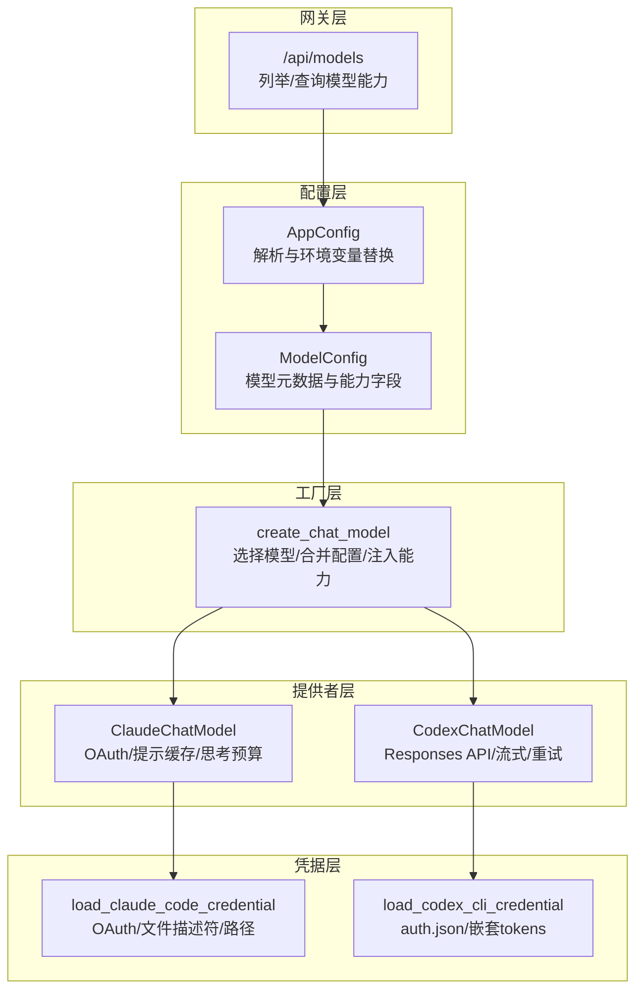
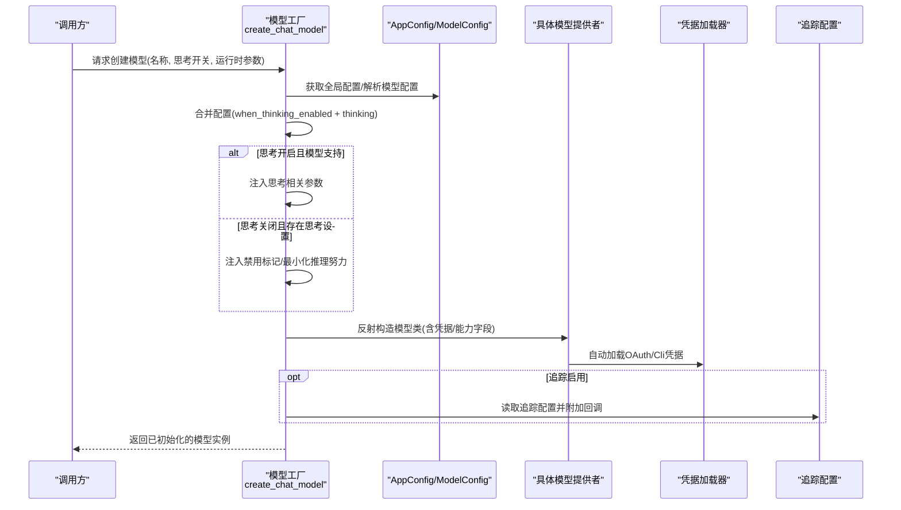
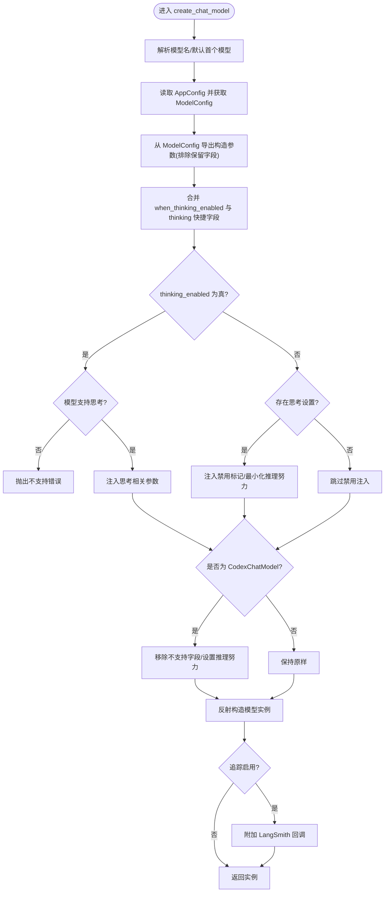
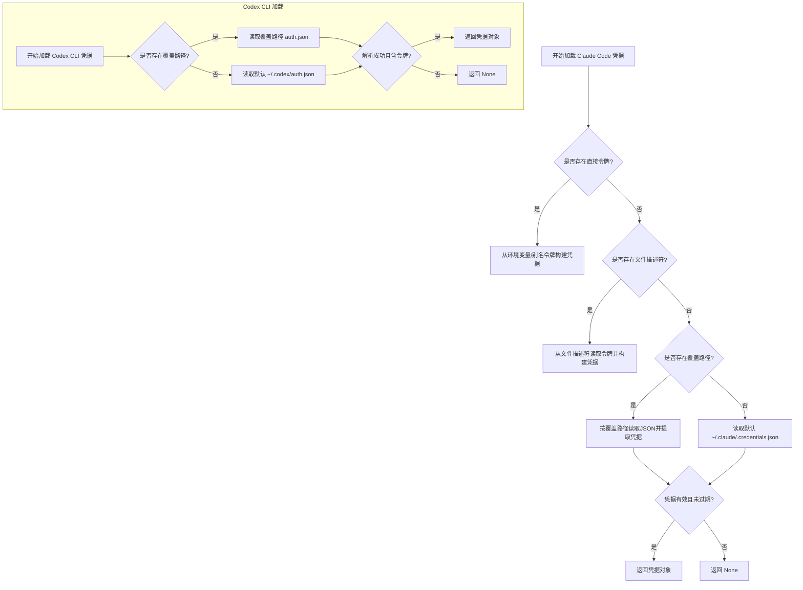
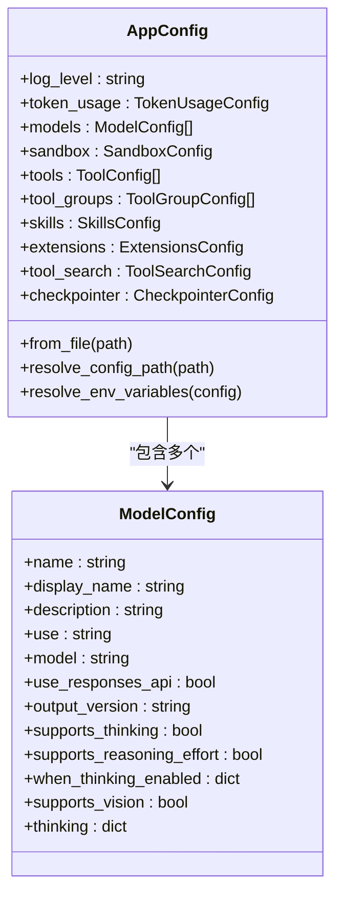
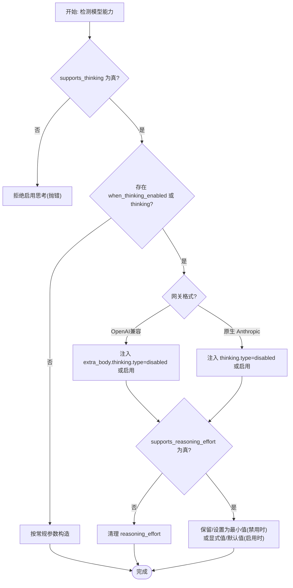
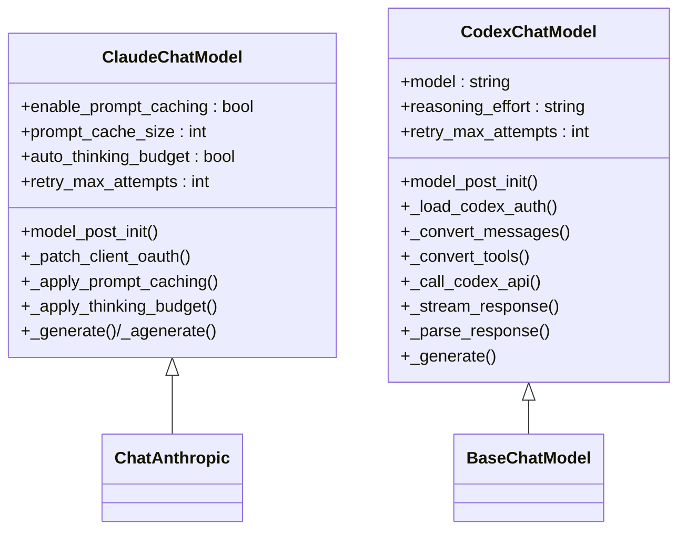
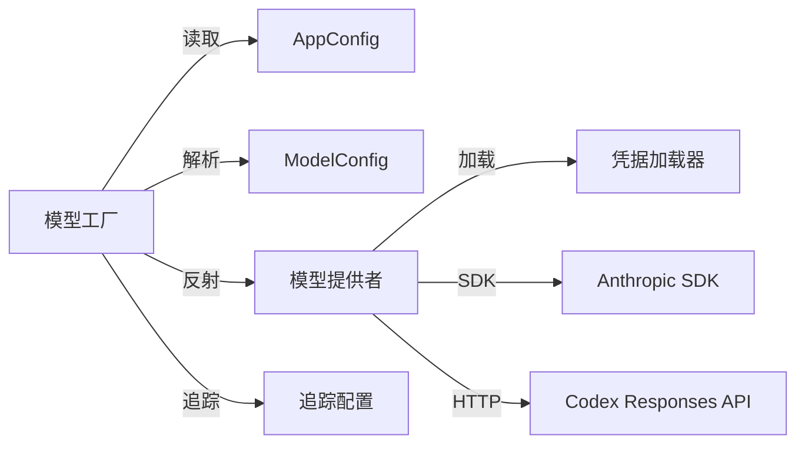

# 模型集成

<cite>
**本文引用的文件**
- [factory.py](file://backend/packages/harness/deerflow/models/factory.py)
- [credential_loader.py](file://backend/packages/harness/deerflow/models/credential_loader.py)
- [model_config.py](file://backend/packages/harness/deerflow/config/model_config.py)
- [app_config.py](file://backend/packages/harness/deerflow/config/app_config.py)
- [models.py](file://backend/app/gateway/routers/models.py)
- [openai_codex_provider.py](file://backend/packages/harness/deerflow/models/openai_codex_provider.py)
- [claude_provider.py](file://backend/packages/harness/deerflow/models/claude_provider.py)
- [tracing_config.py](file://backend/packages/harness/deerflow/config/tracing_config.py)
- [test_model_factory.py](file://backend/tests/test_model_factory.py)
- [test_credential_loader.py](file://backend/tests/test_credential_loader.py)
- [test_app_config_reload.py](file://backend/tests/test_app_config_reload.py)
</cite>

## 目录
1. [简介](#简介)
2. [项目结构](#项目结构)
3. [核心组件](#核心组件)
4. [架构总览](#架构总览)
5. [详细组件分析](#详细组件分析)
6. [依赖分析](#依赖分析)
7. [性能考虑](#性能考虑)
8. [故障排除指南](#故障排除指南)
9. [结论](#结论)
10. [附录](#附录)

## 简介
本文件面向 DeerFlow 的模型集成机制，系统性阐述“模型工厂”与“凭据加载器”的协作关系，覆盖配置解析、凭据注入与实例创建的完整流程；详解模型配置的层次结构（全局配置、模型特定配置与运行时参数）及其合并策略；说明模型能力检测与处理（思考模式、视觉能力、推理努力级别）；并提供性能监控、错误处理与降级策略、最佳实践与故障排除建议。

## 项目结构
围绕模型集成的关键代码主要分布在以下模块：
- 配置层：全局应用配置与模型配置定义
- 工厂层：根据配置与运行时参数创建具体模型实例
- 提供者层：针对不同后端（如 Claude、OpenAI 兼容、Codex Responses）的具体实现
- 凭据层：自动从环境变量或本地文件加载 OAuth/Cli 凭据
- 网关层：对外暴露模型列表与详情查询接口
- 测试层：验证工厂行为、凭据加载与配置热重载

**图表来源**
- [app_config.py:30-131](file://backend/packages/harness/deerflow/config/app_config.py#L30-L131)
- [model_config.py:4-37](file://backend/packages/harness/deerflow/config/model_config.py#L4-L37)
- [factory.py:11-95](file://backend/packages/harness/deerflow/models/factory.py#L11-L95)
- [claude_provider.py:31-107](file://backend/packages/harness/deerflow/models/claude_provider.py#L31-L107)
- [openai_codex_provider.py:33-75](file://backend/packages/harness/deerflow/models/openai_codex_provider.py#L33-L75)
- [credential_loader.py:142-212](file://backend/packages/harness/deerflow/models/credential_loader.py#L142-L212)
- [models.py:32-116](file://backend/app/gateway/routers/models.py#L32-L116)

**章节来源**
- [app_config.py:30-131](file://backend/packages/harness/deerflow/config/app_config.py#L30-L131)
- [model_config.py:4-37](file://backend/packages/harness/deerflow/config/model_config.py#L4-L37)
- [factory.py:11-95](file://backend/packages/harness/deerflow/models/factory.py#L11-L95)
- [claude_provider.py:31-107](file://backend/packages/harness/deerflow/models/claude_provider.py#L31-L107)
- [openai_codex_provider.py:33-75](file://backend/packages/harness/deerflow/models/openai_codex_provider.py#L33-L75)
- [credential_loader.py:142-212](file://backend/packages/harness/deerflow/models/credential_loader.py#L142-L212)
- [models.py:32-116](file://backend/app/gateway/routers/models.py#L32-L116)

## 核心组件
- 模型工厂 create_chat_model：负责从全局配置中解析目标模型，合并配置与运行时参数，注入能力开关，并在启用追踪时附加 LangSmith 回调。
- 凭据加载器：自动从多种来源加载 Claude Code OAuth 与 Codex CLI 凭据，支持环境变量、文件描述符与本地文件路径。
- 模型配置 ModelConfig：统一承载模型名称、类路径、能力字段（思考/视觉/推理努力）、思考开启时的额外设置等。
- 应用配置 AppConfig：负责解析 config.yaml、环境变量替换、扩展配置合并与热重载。
- 提供者实现：ClaudeChatModel（OAuth/提示缓存/思考预算）、CodexChatModel（Responses API/流式/重试）。
- 网关路由：对外暴露模型清单与详情，便于前端展示与选择。

**章节来源**
- [factory.py:11-95](file://backend/packages/harness/deerflow/models/factory.py#L11-L95)
- [credential_loader.py:142-212](file://backend/packages/harness/deerflow/models/credential_loader.py#L142-L212)
- [model_config.py:4-37](file://backend/packages/harness/deerflow/config/model_config.py#L4-L37)
- [app_config.py:30-131](file://backend/packages/harness/deerflow/config/app_config.py#L30-L131)
- [claude_provider.py:31-107](file://backend/packages/harness/deerflow/models/claude_provider.py#L31-L107)
- [openai_codex_provider.py:33-75](file://backend/packages/harness/deerflow/models/openai_codex_provider.py#L33-L75)
- [models.py:32-116](file://backend/app/gateway/routers/models.py#L32-L116)

## 架构总览
下图展示了从配置到实例创建、凭据注入与能力合并的端到端流程。

**图表来源**
- [factory.py:11-95](file://backend/packages/harness/deerflow/models/factory.py#L11-L95)
- [app_config.py:30-131](file://backend/packages/harness/deerflow/config/app_config.py#L30-L131)
- [model_config.py:4-37](file://backend/packages/harness/deerflow/config/model_config.py#L4-L37)
- [claude_provider.py:56-107](file://backend/packages/harness/deerflow/models/claude_provider.py#L56-L107)
- [openai_codex_provider.py:59-75](file://backend/packages/harness/deerflow/models/openai_codex_provider.py#L59-L75)
- [tracing_config.py:54-94](file://backend/packages/harness/deerflow/config/tracing_config.py#L54-L94)

## 详细组件分析

### 模型工厂：配置解析、凭据注入与实例创建
- 配置解析与选择
  - 若未指定模型名，则默认使用第一个模型。
  - 通过反射解析 use 字段定位模型类，随后从 ModelConfig 中导出除保留字段外的全部有效配置项。
- 思考模式与推理努力
  - when_thinking_enabled 与 thinking 快捷字段合并，形成 effective_wte。
  - 当 thinking_enabled=True 且模型声明支持思考时，将 effective_wte 注入到构造参数；否则进行禁用注入（区分 OpenAI 兼容网关与原生 langchain_anthropic 的参数位置）。
  - 对不支持推理努力的模型，若运行时传入则会被清理。
- Codex 特例
  - CodexChatModel 类型下，会移除不支持的 max_tokens，并根据运行时 reasoning_effort 或思考开关决定默认推理努力级别。
- 追踪集成
  - 若追踪启用，工厂会为模型附加 LangChainTracer 回调，便于链路观测。

**图表来源**
- [factory.py:11-95](file://backend/packages/harness/deerflow/models/factory.py#L11-L95)
- [openai_codex_provider.py:67-78](file://backend/packages/harness/deerflow/models/openai_codex_provider.py#L67-L78)
- [tracing_config.py:54-94](file://backend/packages/harness/deerflow/config/tracing_config.py#L54-L94)

**章节来源**
- [factory.py:11-95](file://backend/packages/harness/deerflow/models/factory.py#L11-L95)
- [test_model_factory.py:109-234](file://backend/tests/test_model_factory.py#L109-L234)
- [test_model_factory.py:515-594](file://backend/tests/test_model_factory.py#L515-L594)

### 凭据加载器：多源自动发现与安全加载
- Claude Code OAuth
  - 支持直接环境变量、文件描述符、覆盖路径与默认文件路径；自动识别过期令牌并记录警告。
  - 输出标准化为 ClaudeCodeCredential，包含访问令牌、刷新令牌与过期时间。
- Codex CLI
  - 支持嵌套 tokens 与旧版顶层字段；输出标准化为 CodexCliCredential，包含访问令牌与账户 ID。
- 安全与健壮性
  - 对不存在或目录而非文件的路径进行告警；对 JSON 解析失败与文件读取异常进行捕获与记录。

**图表来源**
- [credential_loader.py:142-212](file://backend/packages/harness/deerflow/models/credential_loader.py#L142-L212)

**章节来源**
- [credential_loader.py:142-212](file://backend/packages/harness/deerflow/models/credential_loader.py#L142-L212)
- [test_credential_loader.py:20-157](file://backend/tests/test_credential_loader.py#L20-L157)

### 模型配置层次结构与合并机制
- 全局配置（AppConfig）
  - 负责解析 config.yaml、环境变量替换、扩展配置合并与热重载。
  - 支持通过环境变量覆盖配置路径，优先级明确。
- 模型特定配置（ModelConfig）
  - 包含模型标识、显示名、描述、类路径、模型名、响应 API 开关、输出版本、能力字段（思考/视觉/推理努力）、思考开启时的额外设置、思考快捷字段等。
- 运行时参数
  - 工厂在构造阶段将运行时参数与配置合并，遵循“运行时优先”的原则（例如思考禁用时注入禁用标记，Codex 推理努力由运行时显式值或默认值决定）。

**图表来源**
- [app_config.py:30-131](file://backend/packages/harness/deerflow/config/app_config.py#L30-L131)
- [model_config.py:4-37](file://backend/packages/harness/deerflow/config/model_config.py#L4-L37)

**章节来源**
- [app_config.py:45-131](file://backend/packages/harness/deerflow/config/app_config.py#L45-L131)
- [model_config.py:4-37](file://backend/packages/harness/deerflow/config/model_config.py#L4-L37)
- [test_app_config_reload.py:45-81](file://backend/tests/test_app_config_reload.py#L45-L81)

### 能力检测与处理：思考模式、视觉与推理努力
- 思考模式
  - 工厂在 thinking_enabled=True 时，仅当模型声明 supports_thinking 为真才允许注入；否则抛错。
  - when_thinking_enabled 与 thinking 快捷字段合并，分别适配 OpenAI 兼容网关（extra_body.thinking）与原生 langchain_anthropic（direct thinking 参数）。
- 视觉能力
  - 网关在列举模型时会返回 supports_vision 字段，前端据此决定是否启用图像工具。
- 推理努力级别
  - 对不支持推理努力的模型，工厂会清理运行时传入的该参数。
  - CodexChatModel 在思考关闭时强制 reasoning_effort 为 none，在开启时可由运行时显式值或默认 medium 决定。

**图表来源**
- [factory.py:41-62](file://backend/packages/harness/deerflow/models/factory.py#L41-L62)
- [test_model_factory.py:109-287](file://backend/tests/test_model_factory.py#L109-L287)
- [test_model_factory.py:507-594](file://backend/tests/test_model_factory.py#L507-L594)

**章节来源**
- [factory.py:41-62](file://backend/packages/harness/deerflow/models/factory.py#L41-L62)
- [models.py:61-73](file://backend/app/gateway/routers/models.py#L61-L73)
- [test_model_factory.py:109-287](file://backend/tests/test_model_factory.py#L109-L287)
- [test_model_factory.py:507-594](file://backend/tests/test_model_factory.py#L507-L594)

### 提供者实现细节
- ClaudeChatModel
  - 自动检测 OAuth 令牌，切换为 Bearer 认证并注入必需 beta 头部；对 OAuth 场景禁用提示缓存以满足平台限制。
  - 支持自动思考预算分配与指数退避重试。
- CodexChatModel
  - 使用 Responses API，要求流式响应；内置 SSE 解析、函数调用解析与重试逻辑；支持推理努力映射。

**图表来源**
- [claude_provider.py:31-263](file://backend/packages/harness/deerflow/models/claude_provider.py#L31-L263)
- [openai_codex_provider.py:33-397](file://backend/packages/harness/deerflow/models/openai_codex_provider.py#L33-L397)

**章节来源**
- [claude_provider.py:31-263](file://backend/packages/harness/deerflow/models/claude_provider.py#L31-L263)
- [openai_codex_provider.py:33-397](file://backend/packages/harness/deerflow/models/openai_codex_provider.py#L33-L397)

## 依赖分析
- 组件耦合
  - 工厂依赖配置层（AppConfig/ModelConfig）与反射解析；对追踪配置存在弱依赖。
  - 提供者依赖凭据加载器以完成认证；ClaudeChatModel 还依赖第三方 SDK。
- 外部依赖
  - LangChain 基础模型接口与回调体系；HTTP 客户端用于 Codex API；Anthropic SDK 用于 Claude。
- 循环依赖
  - 未见循环导入；各模块职责清晰，通过函数/类边界解耦。

**图表来源**
- [factory.py:11-95](file://backend/packages/harness/deerflow/models/factory.py#L11-L95)
- [app_config.py:30-131](file://backend/packages/harness/deerflow/config/app_config.py#L30-L131)
- [model_config.py:4-37](file://backend/packages/harness/deerflow/config/model_config.py#L4-L37)
- [claude_provider.py:56-107](file://backend/packages/harness/deerflow/models/claude_provider.py#L56-L107)
- [openai_codex_provider.py:197-214](file://backend/packages/harness/deerflow/models/openai_codex_provider.py#L197-L214)
- [tracing_config.py:54-94](file://backend/packages/harness/deerflow/config/tracing_config.py#L54-L94)

**章节来源**
- [factory.py:11-95](file://backend/packages/harness/deerflow/models/factory.py#L11-L95)
- [claude_provider.py:56-107](file://backend/packages/harness/deerflow/models/claude_provider.py#L56-L107)
- [openai_codex_provider.py:197-214](file://backend/packages/harness/deerflow/models/openai_codex_provider.py#L197-L214)

## 性能考虑
- 推理努力与思考预算
  - 工厂在启用思考时注入相应参数；CodexChatModel 在启用思考时默认 medium 推理努力，避免过度消耗。
- 重试与退避
  - ClaudeChatModel 与 CodexChatModel 均实现指数退避与抖动，降低突发限流与服务端错误的影响。
- 追踪开销
  - 追踪仅在启用时附加回调，避免生产环境不必要的开销。

**章节来源**
- [factory.py:67-78](file://backend/packages/harness/deerflow/models/factory.py#L67-L78)
- [claude_provider.py:200-245](file://backend/packages/harness/deerflow/models/claude_provider.py#L200-L245)
- [openai_codex_provider.py:197-214](file://backend/packages/harness/deerflow/models/openai_codex_provider.py#L197-L214)

## 故障排除指南
- 模型未找到
  - 现象：指定模型名不存在。
  - 处理：检查配置文件中的模型列表与名称拼写；确保使用正确的模型名或留空让工厂选择首个模型。
  - 参考测试：[test_model_factory.py:95-101](file://backend/tests/test_model_factory.py#L95-L101)
- 不支持思考
  - 现象：启用思考时报错，提示模型不支持。
  - 处理：将模型配置中的 supports_thinking 设为 true，并确认 when_thinking_enabled 或 thinking 快捷字段正确配置。
  - 参考测试：[test_model_factory.py:109-129](file://backend/tests/test_model_factory.py#L109-L129)
- 思考禁用注入异常
  - 现象：禁用思考后仍出现不兼容参数。
  - 处理：确认网关格式（extra_body）或原生格式（direct thinking），工厂会按格式注入禁用标记。
  - 参考测试：[test_model_factory.py:148-212](file://backend/tests/test_model_factory.py#L148-L212)
- 推理努力被清理
  - 现象：传入 reasoning_effort 但模型不支持。
  - 处理：移除运行时参数或更换支持推理努力的模型。
  - 参考测试：[test_model_factory.py:241-287](file://backend/tests/test_model_factory.py#L241-L287)
- Codex 凭据缺失
  - 现象：创建 CodexChatModel 抛出凭据错误。
  - 处理：确保 ~/.codex/auth.json 存在或设置 CODEX_AUTH_PATH；检查令牌有效性。
  - 参考测试：[test_credential_loader.py:125-157](file://backend/tests/test_credential_loader.py#L125-L157)
- Claude OAuth 令牌过期
  - 现象：凭据加载返回 None 或警告。
  - 处理：使用 claude CLI 刷新令牌；检查 expiresAt 与过期缓冲。
  - 参考测试：[test_credential_loader.py:117-123](file://backend/tests/test_credential_loader.py#L117-L123)
- 配置热重载无效
  - 现象：修改 config.yaml 后能力未更新。
  - 处理：调用重置/重新加载配置；确认 DEER_FLOW_CONFIG_PATH 指向正确路径。
  - 参考测试：[test_app_config_reload.py:45-81](file://backend/tests/test_app_config_reload.py#L45-L81)

**章节来源**
- [test_model_factory.py:95-287](file://backend/tests/test_model_factory.py#L95-L287)
- [test_model_factory.py:507-594](file://backend/tests/test_model_factory.py#L507-L594)
- [test_credential_loader.py:20-157](file://backend/tests/test_credential_loader.py#L20-L157)
- [test_app_config_reload.py:45-81](file://backend/tests/test_app_config_reload.py#L45-L81)

## 结论
DeerFlow 的模型集成通过“配置—工厂—提供者—凭据”的分层设计，实现了灵活、可扩展且安全的模型实例化流程。工厂在配置合并与能力注入方面提供了细粒度控制，结合提供者的特性实现与凭据加载器的多源发现，能够稳定支撑多样化的推理场景。配合网关层的能力暴露与测试用例的覆盖，整体具备良好的可观测性与可维护性。

## 附录
- 最佳实践
  - 明确声明模型能力字段（思考/视觉/推理努力），避免运行时动态注入导致的不确定性。
  - 使用 when_thinking_enabled 与 thinking 快捷字段统一管理思考参数，减少重复配置。
  - 在生产环境启用追踪前，先在小范围验证回调开销。
  - 对外部 API（Codex、Anthropic）采用指数退避与重试策略，提升稳定性。
- 相关接口
  - 网关模型列表与详情接口：[models.py:32-116](file://backend/app/gateway/routers/models.py#L32-L116)