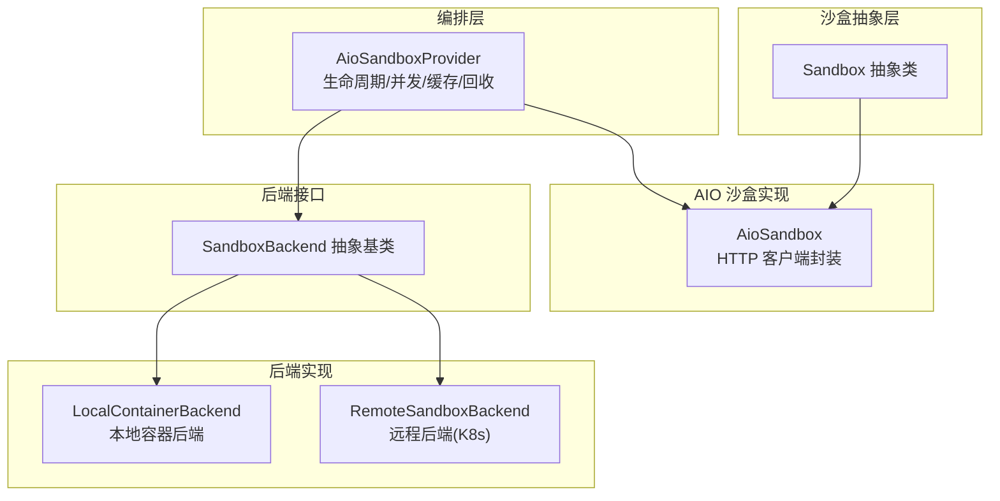
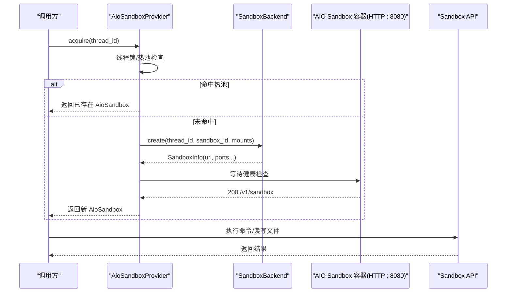
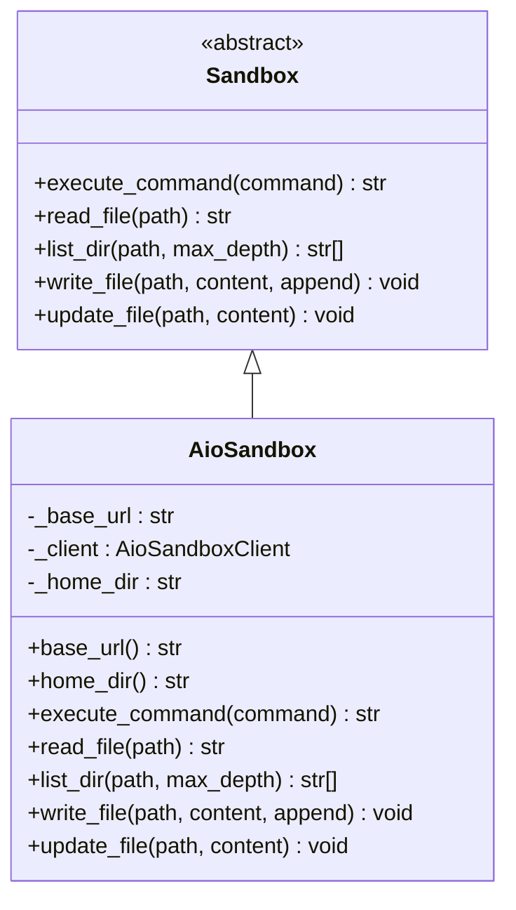
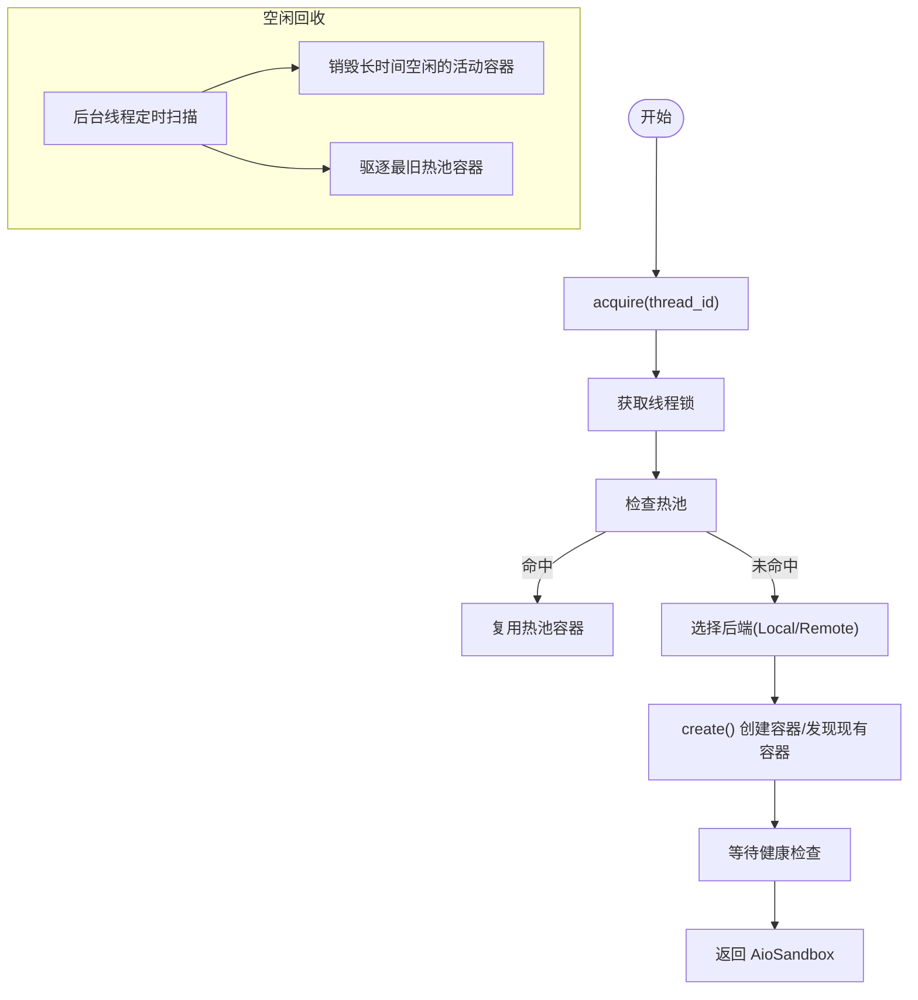
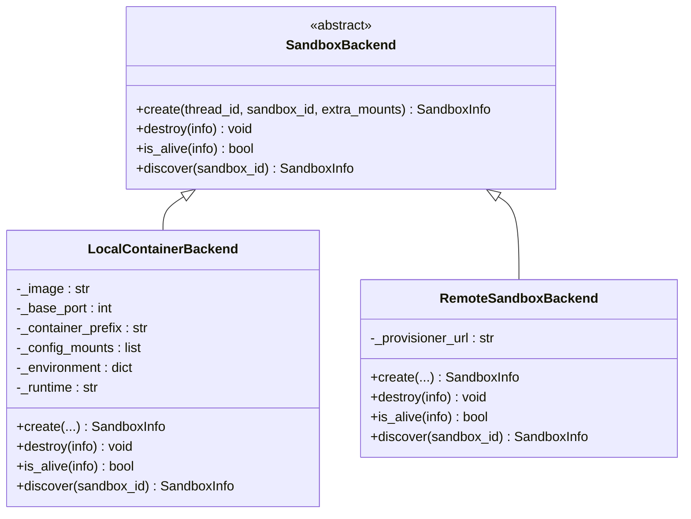
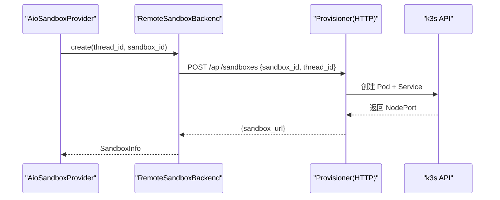
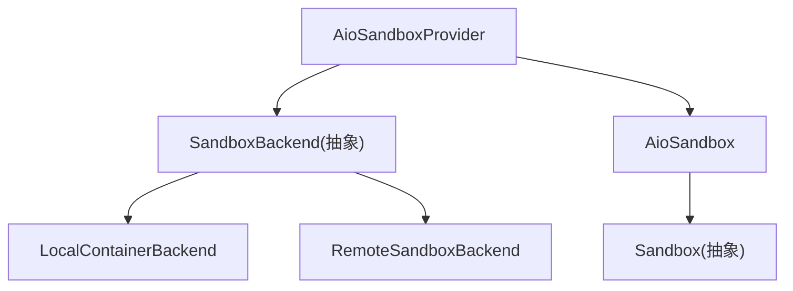

# Docker 沙箱模式

<cite>
**本文档引用的文件**
- [aio_sandbox.py](file://backend/packages/harness/deerflow/community/aio_sandbox/aio_sandbox.py)
- [aio_sandbox_provider.py](file://backend/packages/harness/deerflow/community/aio_sandbox/aio_sandbox_provider.py)
- [backend.py](file://backend/packages/harness/deerflow/community/aio_sandbox/backend.py)
- [remote_backend.py](file://backend/packages/harness/deerflow/community/aio_sandbox/remote_backend.py)
- [local_backend.py](file://backend/packages/harness/deerflow/community/aio_sandbox/local_backend.py)
- [sandbox_info.py](file://backend/packages/harness/deerflow/community/aio_sandbox/sandbox_info.py)
- [sandbox.py](file://backend/packages/harness/deerflow/sandbox/sandbox.py)
- [sandbox_config.py](file://backend/packages/harness/deerflow/config/sandbox_config.py)
- [config.example.yaml](file://config.example.yaml)
- [docker-compose.yaml](file://docker/docker-compose.yaml)
- [docker.sh](file://scripts/docker.sh)
- [test_aio_sandbox_provider.py](file://backend/tests/test_aio_sandbox_provider.py)
- [test_docker_sandbox_mode_detection.py](file://backend/tests/test_docker_sandbox_mode_detection.py)
- [APPLE_CONTAINER.md](file://backend/docs/APPLE_CONTAINER.md)
</cite>

## 目录
1. [简介](#简介)
2. [项目结构](#项目结构)
3. [核心组件](#核心组件)
4. [架构总览](#架构总览)
5. [详细组件分析](#详细组件分析)
6. [依赖关系分析](#依赖关系分析)
7. [性能考虑](#性能考虑)
8. [故障排除指南](#故障排除指南)
9. [结论](#结论)
10. [附录](#附录)

## 简介
本文件面向 DeerFlow 的 Docker 沙箱模式，系统性阐述容器化执行原理、网络隔离与资源限制机制，详解 AioSandbox 与 AioSandboxProvider 的异步实现与并发处理能力，解析远程后端通信协议与数据传输格式，并提供 Docker 配置参数、镜像管理与容器生命周期控制策略。同时给出部署指南、监控方法与性能优化建议，并对比本地沙箱与 Docker 沙箱的优劣势。

## 项目结构
Docker 沙箱模式的核心代码位于 backend/packages/harness/deerflow/community/aio_sandbox 目录，围绕抽象后端接口 SandboxBackend 提供本地容器后端与远程（K8s）后端两种实现；上层由 AioSandboxProvider 统一编排容器生命周期、线程绑定、空闲回收与优雅停机；AioSandbox 作为具体沙盒客户端封装对远端 AIO Sandbox API 的调用。

**图表来源**
- [aio_sandbox.py:11-129](file://backend/packages/harness/deerflow/community/aio_sandbox/aio_sandbox.py#L11-L129)
- [aio_sandbox_provider.py:45-613](file://backend/packages/harness/deerflow/community/aio_sandbox/aio_sandbox_provider.py#L45-L613)
- [backend.py:38-99](file://backend/packages/harness/deerflow/community/aio_sandbox/backend.py#L38-L99)
- [local_backend.py:21-328](file://backend/packages/harness/deerflow/community/aio_sandbox/local_backend.py#L21-L328)
- [remote_backend.py:30-157](file://backend/packages/harness/deerflow/community/aio_sandbox/remote_backend.py#L30-L157)
- [sandbox.py:4-73](file://backend/packages/harness/deerflow/sandbox/sandbox.py#L4-L73)

**章节来源**
- [aio_sandbox.py:1-129](file://backend/packages/harness/deerflow/community/aio_sandbox/aio_sandbox.py#L1-L129)
- [aio_sandbox_provider.py:1-613](file://backend/packages/harness/deerflow/community/aio_sandbox/aio_sandbox_provider.py#L1-L613)
- [backend.py:1-99](file://backend/packages/harness/deerflow/community/aio_sandbox/backend.py#L1-L99)
- [local_backend.py:1-328](file://backend/packages/harness/deerflow/community/aio_sandbox/local_backend.py#L1-L328)
- [remote_backend.py:1-157](file://backend/packages/harness/deerflow/community/aio_sandbox/remote_backend.py#L1-L157)
- [sandbox.py:1-73](file://backend/packages/harness/deerflow/sandbox/sandbox.py#L1-L73)

## 核心组件
- AioSandbox：基于 HTTP 客户端访问远端 AIO Sandbox API，提供命令执行、文件读写、目录列举等能力。
- AioSandboxProvider：负责容器生命周期编排、线程到沙盒的确定性映射、热池回收、空闲清理、信号处理与优雅停机。
- SandboxBackend 及其实现：抽象容器创建/销毁/发现/存活检查；LocalContainerBackend 使用 Docker 或 Apple Container；RemoteSandboxBackend 通过 provisioner 服务对接 K8s。
- SandboxInfo：跨进程可序列化的沙盒元数据，包含 URL、容器名/ID、创建时间等。
- Sandbox 抽象：定义统一的沙盒操作接口，便于替换实现。

**章节来源**
- [aio_sandbox.py:11-129](file://backend/packages/harness/deerflow/community/aio_sandbox/aio_sandbox.py#L11-L129)
- [aio_sandbox_provider.py:45-613](file://backend/packages/harness/deerflow/community/aio_sandbox/aio_sandbox_provider.py#L45-L613)
- [backend.py:38-99](file://backend/packages/harness/deerflow/community/aio_sandbox/backend.py#L38-L99)
- [local_backend.py:21-328](file://backend/packages/harness/deerflow/community/aio_sandbox/local_backend.py#L21-L328)
- [remote_backend.py:30-157](file://backend/packages/harness/deerflow/community/aio_sandbox/remote_backend.py#L30-L157)
- [sandbox_info.py:9-42](file://backend/packages/harness/deerflow/community/aio_sandbox/sandbox_info.py#L9-L42)
- [sandbox.py:4-73](file://backend/packages/harness/deerflow/sandbox/sandbox.py#L4-L73)

## 架构总览
Docker 沙箱模式采用“编排层 + 后端层 + 客户端层”的分层设计：
- 编排层（AioSandboxProvider）：多线程安全、跨进程一致性的容器生命周期管理，支持热池复用与空闲回收。
- 后端层（SandboxBackend 实现）：本地容器后端直接启动/停止容器并暴露 HTTP 端口；远程后端通过 provisioner 动态创建/销毁 Pod 并返回可直连 URL。
- 客户端层（AioSandbox）：通过 HTTP API 访问远端沙盒，屏蔽底层容器差异。

**图表来源**
- [aio_sandbox_provider.py:330-511](file://backend/packages/harness/deerflow/community/aio_sandbox/aio_sandbox_provider.py#L330-L511)
- [backend.py:16-35](file://backend/packages/harness/deerflow/community/aio_sandbox/backend.py#L16-L35)
- [local_backend.py:93-151](file://backend/packages/harness/deerflow/community/aio_sandbox/local_backend.py#L93-L151)
- [remote_backend.py:58-86](file://backend/packages/harness/deerflow/community/aio_sandbox/remote_backend.py#L58-L86)

## 详细组件分析

### AioSandbox：HTTP 客户端封装
- 职责：通过 HTTP 客户端访问远端 AIO Sandbox，提供命令执行、文件读写、目录列举、二进制更新等能力。
- 关键点：
  - 命令执行：调用 shell 接口，解析输出或错误信息。
  - 文件操作：支持文本与 base64 编码二进制写入。
  - 目录列举：使用受限深度的 find/tree 命令并限制输出行数。
  - 错误处理：捕获异常并记录日志，避免影响调用方。

**图表来源**
- [sandbox.py:4-73](file://backend/packages/harness/deerflow/sandbox/sandbox.py#L4-L73)
- [aio_sandbox.py:11-129](file://backend/packages/harness/deerflow/community/aio_sandbox/aio_sandbox.py#L11-L129)

**章节来源**
- [aio_sandbox.py:11-129](file://backend/packages/harness/deerflow/community/aio_sandbox/aio_sandbox.py#L11-L129)
- [sandbox.py:4-73](file://backend/packages/harness/deerflow/sandbox/sandbox.py#L4-L73)

### AioSandboxProvider：生命周期编排与并发控制
- 职责：容器生命周期编排、线程到沙盒的确定性映射、热池复用、空闲超时回收、跨进程文件锁、信号处理与优雅停机。
- 关键机制：
  - 确定性 ID：基于线程 ID 的哈希生成沙盒 ID，确保跨进程一致。
  - 热池：释放的容器保留在内存热池中，容器仍运行，下次同线程可快速复用。
  - 空闲回收：后台线程定期扫描空闲沙盒，超过阈值则销毁或从热池驱逐。
  - 并发一致性：线程级锁 + 跨进程文件锁，避免竞态与端口冲突。
  - 后端选择：根据配置选择本地容器后端或远程后端。

**图表来源**
- [aio_sandbox_provider.py:330-511](file://backend/packages/harness/deerflow/community/aio_sandbox/aio_sandbox_provider.py#L330-L511)
- [aio_sandbox_provider.py:229-296](file://backend/packages/harness/deerflow/community/aio_sandbox/aio_sandbox_provider.py#L229-L296)

**章节来源**
- [aio_sandbox_provider.py:45-613](file://backend/packages/harness/deerflow/community/aio_sandbox/aio_sandbox_provider.py#L45-L613)

### SandboxBackend 抽象与实现
- 抽象接口：create/destroy/is_alive/discover，统一不同后端行为。
- LocalContainerBackend：
  - 自动检测运行时（优先 Apple Container，否则 Docker），按端口池分配容器端口。
  - 支持环境变量注入、挂载卷（含只读）、容器名称冲突处理与端口回退。
  - 通过容器名进行跨进程发现，健康检查通过端口查询与 HTTP 健康端点。
- RemoteSandboxBackend：
  - 通过 provisioner HTTP API 创建/销毁/发现 Pod，返回直连 URL。
  - 适合在 K8s 上动态扩缩容，隔离性更强。

**图表来源**
- [backend.py:38-99](file://backend/packages/harness/deerflow/community/aio_sandbox/backend.py#L38-L99)
- [local_backend.py:21-328](file://backend/packages/harness/deerflow/community/aio_sandbox/local_backend.py#L21-L328)
- [remote_backend.py:30-157](file://backend/packages/harness/deerflow/community/aio_sandbox/remote_backend.py#L30-L157)

**章节来源**
- [backend.py:1-99](file://backend/packages/harness/deerflow/community/aio_sandbox/backend.py#L1-L99)
- [local_backend.py:1-328](file://backend/packages/harness/deerflow/community/aio_sandbox/local_backend.py#L1-L328)
- [remote_backend.py:1-157](file://backend/packages/harness/deerflow/community/aio_sandbox/remote_backend.py#L1-L157)

### 远程后端通信协议与数据传输
- 远程后端通过 provisioner 的 HTTP API 管理 Pod 生命周期：
  - POST /api/sandboxes：创建 Pod + NodePort Service，返回 sandbox_url。
  - GET /api/sandboxes/{sandbox_id}：查询状态/URL。
  - DELETE /api/sandboxes/{sandbox_id}：销毁 Pod + Service。
- 数据传输格式：JSON 请求/响应体，字段包含 sandbox_id、sandbox_url 等。

**图表来源**
- [remote_backend.py:89-110](file://backend/packages/harness/deerflow/community/aio_sandbox/remote_backend.py#L89-L110)
- [remote_backend.py:139-156](file://backend/packages/harness/deerflow/community/aio_sandbox/remote_backend.py#L139-L156)

**章节来源**
- [remote_backend.py:1-157](file://backend/packages/harness/deerflow/community/aio_sandbox/remote_backend.py#L1-L157)

### Docker 配置参数、镜像管理与容器生命周期
- 配置项（来自 config.yaml 与 SandboxConfig）：
  - use：指定 AioSandboxProvider 类路径
  - image：容器镜像，默认企业版 AIO Sandbox 镜像
  - port：容器端口起始值（默认 8080）
  - replicas：最大并发容器数（软上限，热池不计）
  - container_prefix：容器名前缀
  - idle_timeout：空闲超时秒数（0 表示禁用）
  - mounts：主机到容器的挂载列表（含只读标记）
  - environment：注入到容器的环境变量（$ 开头从宿主解析）
  - provisioner_url：远程模式下 provisioner 地址
- 镜像管理：脚本自动预拉取镜像，首次启动更快；生产环境镜像可自定义。
- 容器生命周期：Provider 负责创建/销毁；LocalBackend 通过 Docker/Apple Container CLI 管理；RemoteBackend 通过 provisioner 管理。

**章节来源**
- [config.example.yaml:315-371](file://config.example.yaml#L315-L371)
- [sandbox_config.py:12-62](file://backend/packages/harness/deerflow/config/sandbox_config.py#L12-L62)
- [docker.sh:87-148](file://scripts/docker.sh#L87-L148)
- [local_backend.py:93-151](file://backend/packages/harness/deerflow/community/aio_sandbox/local_backend.py#L93-L151)
- [remote_backend.py:58-86](file://backend/packages/harness/deerflow/community/aio_sandbox/remote_backend.py#L58-L86)

### 部署指南与监控
- 部署步骤：
  - 初始化：预拉取 AIO Sandbox 镜像（提升首次启动速度）
  - 启动：根据 config.yaml 自动检测沙箱模式（local/aio/provisioner），构建并启动所需服务
  - 日志：查看各服务日志定位问题
  - 停止：优雅关闭并清理沙箱容器
- 监控要点：
  - 健康检查：Provider 在创建后轮询 /v1/sandbox 确认可用
  - 端口占用：本地后端具备端口回退与冲突处理
  - 热池容量：通过 replicas 控制并发，避免资源耗尽
  - Docker Socket：DooD 模式需正确挂载宿主 Docker Socket

**章节来源**
- [docker.sh:150-230](file://scripts/docker.sh#L150-L230)
- [docker.sh:266-278](file://scripts/docker.sh#L266-L278)
- [backend.py:16-35](file://backend/packages/harness/deerflow/community/aio_sandbox/backend.py#L16-L35)
- [docker-compose.yaml:65-99](file://docker/docker-compose.yaml#L65-L99)

### 性能优化策略
- 热池复用：释放容器进入热池，减少冷启动开销
- 空闲回收：合理设置 idle_timeout，平衡资源占用与响应延迟
- 并发控制：通过 replicas 限制容器数量，避免过度竞争
- 运行时选择：Apple Container 在 Apple Silicon 上性能更优，自动检测启用
- 网络与挂载：最小化挂载路径，避免大体积数据频繁同步

**章节来源**
- [aio_sandbox_provider.py:229-296](file://backend/packages/harness/deerflow/community/aio_sandbox/aio_sandbox_provider.py#L229-L296)
- [APPLE_CONTAINER.md:1-61](file://backend/docs/APPLE_CONTAINER.md#L1-L61)

### 本地沙箱 vs Docker 沙箱
- 优势对比：
  - Docker 沙箱：强隔离、可扩展、资源限制明确、便于运维与审计
  - 本地沙箱：零容器依赖、低延迟、简单易用
- 局限性：
  - Docker 沙箱：需要 Docker/Apple Container 环境、DooD 模式需正确挂载 Docker Socket
  - 本地沙箱：缺乏容器级隔离，可能受宿主环境影响

**章节来源**
- [config.example.yaml:320-331](file://config.example.yaml#L320-L331)
- [APPLE_CONTAINER.md:1-61](file://backend/docs/APPLE_CONTAINER.md#L1-L61)

## 依赖关系分析

**图表来源**
- [aio_sandbox_provider.py:28-32](file://backend/packages/harness/deerflow/community/aio_sandbox/aio_sandbox_provider.py#L28-L32)
- [backend.py:38-99](file://backend/packages/harness/deerflow/community/aio_sandbox/backend.py#L38-L99)
- [aio_sandbox.py:6-8](file://backend/packages/harness/deerflow/community/aio_sandbox/aio_sandbox.py#L6-L8)

**章节来源**
- [aio_sandbox_provider.py:1-613](file://backend/packages/harness/deerflow/community/aio_sandbox/aio_sandbox_provider.py#L1-L613)
- [backend.py:1-99](file://backend/packages/harness/deerflow/community/aio_sandbox/backend.py#L1-L99)
- [aio_sandbox.py:1-129](file://backend/packages/harness/deerflow/community/aio_sandbox/aio_sandbox.py#L1-L129)

## 性能考虑
- 热池命中率：通过合理的线程到沙盒映射与空闲回收策略，最大化热池复用，降低冷启动概率。
- 并发度控制：replicas 作为软上限，结合活跃容器与热池共同计算容量，避免资源争用。
- 端口与网络：本地后端具备端口回退与冲突处理，远程后端通过 provisioner 管理网络暴露。
- 运行时选择：Apple Container 在 Apple Silicon 上具备更好的性能表现，自动检测启用。

**章节来源**
- [aio_sandbox_provider.py:445-494](file://backend/packages/harness/deerflow/community/aio_sandbox/aio_sandbox_provider.py#L445-L494)
- [local_backend.py:109-141](file://backend/packages/harness/deerflow/community/aio_sandbox/local_backend.py#L109-L141)
- [APPLE_CONTAINER.md:1-61](file://backend/docs/APPLE_CONTAINER.md#L1-L61)

## 故障排除指南
- 沙箱模式识别失败：
  - 检查 config.yaml 中 sandbox.use 与 provisioner_url 设置是否正确
  - 使用脚本检测当前模式，确认是否为预期的 local/aio/provisioner
- 容器无法启动/端口冲突：
  - 本地后端会尝试端口回退；若所有候选端口被占用，需清理残留容器或调整 base_port
  - 容器名冲突时尝试 discover 并复用现有实例
- 远程后端创建失败：
  - 检查 provisioner 服务健康与网络可达性
  - 查看 provisioner 的返回状态与错误信息
- Docker Socket 问题（DooD）：
  - 确认宿主 Docker Socket 已正确挂载
  - 若不可用，将导致 AioSandboxProvider 无法启动容器
- 热池与空闲回收：
  - 如出现资源紧张，适当提高 idle_timeout 或降低 replicas
  - 使用脚本清理历史沙箱容器

**章节来源**
- [test_docker_sandbox_mode_detection.py:1-88](file://backend/tests/test_docker_sandbox_mode_detection.py#L1-L88)
- [local_backend.py:109-141](file://backend/packages/harness/deerflow/community/aio_sandbox/local_backend.py#L109-L141)
- [remote_backend.py:111-124](file://backend/packages/harness/deerflow/community/aio_sandbox/remote_backend.py#L111-L124)
- [docker.sh:162-188](file://scripts/docker.sh#L162-L188)
- [docker.sh:276-277](file://scripts/docker.sh#L276-L277)

## 结论
Docker 沙箱模式通过分层架构实现了高隔离、可扩展且易于运维的容器化执行环境。AioSandboxProvider 在并发、缓存与回收方面提供了稳健的生命周期管理；Local/Remote 后端分别满足本地开发与生产集群场景。配合合理的配置与监控策略，可在保证安全性的同时获得良好的性能与可维护性。

## 附录
- Docker Compose 环境变量与挂载：
  - DEER_FLOW_DOCKER_SOCKET：DooD 必需
  - DEER_FLOW_SANDBOX_HOST：容器内访问宿主 Docker Daemon 的主机名
  - 多个服务共享技能目录与运行时数据目录
- 测试验证：
  - 线程挂载与 ACP 工作空间权限测试
  - 沙箱模式自动检测回归测试

**章节来源**
- [docker-compose.yaml:65-99](file://docker/docker-compose.yaml#L65-L99)
- [test_aio_sandbox_provider.py:1-74](file://backend/tests/test_aio_sandbox_provider.py#L1-L74)
- [test_docker_sandbox_mode_detection.py:1-88](file://backend/tests/test_docker_sandbox_mode_detection.py#L1-L88)