# Kubernetes 沙箱集成

<cite>
**本文档引用的文件**
- [sandbox.py](file://backend/packages/harness/deerflow/sandbox/sandbox.py)
- [sandbox_provider.py](file://backend/packages/harness/deerflow/sandbox/sandbox_provider.py)
- [local_sandbox.py](file://backend/packages/harness/deerflow/sandbox/local/local_sandbox.py)
- [local_sandbox_provider.py](file://backend/packages/harness/deerflow/sandbox/local/local_sandbox_provider.py)
- [middleware.py](file://backend/packages/harness/deerflow/sandbox/middleware.py)
- [sandbox_config.py](file://backend/packages/harness/deerflow/config/sandbox_config.py)
- [__init__.py](file://backend/packages/harness/deerflow/sandbox/__init__.py)
</cite>

## 目录
1. [简介](#简介)
2. [项目结构](#项目结构)
3. [核心组件](#核心组件)
4. [架构概览](#架构概览)
5. [详细组件分析](#详细组件分析)
6. [依赖关系分析](#依赖关系分析)
7. [性能考虑](#性能考虑)
8. [故障排除指南](#故障排除指南)
9. [结论](#结论)

## 简介

DeerFlow Kubernetes 沙箱集成是一个基于 Kubernetes 的容器化沙箱解决方案，旨在为 AI 代理提供安全、隔离且可扩展的执行环境。该系统通过抽象化的沙箱接口，支持多种后端实现，包括本地沙箱、Docker 容器沙箱以及 Kubernetes Pod 沙箱。

该沙箱系统的核心目标是：
- 提供统一的沙箱接口，屏蔽底层执行环境差异
- 支持多租户隔离和资源限制
- 实现自动化的生命周期管理
- 提供灵活的配置和扩展能力
- 确保安全性和合规性要求

## 项目结构

DeerFlow 沙箱系统的组织结构采用模块化设计，主要包含以下层次：

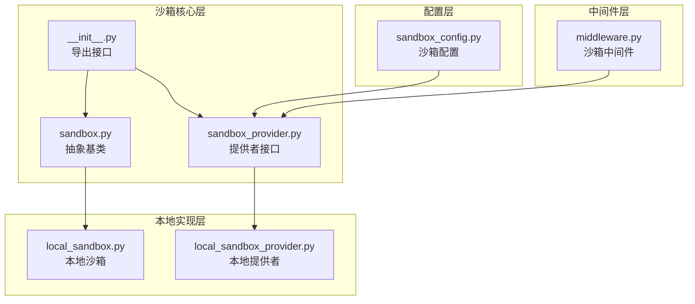

**图表来源**
- [sandbox.py:1-73](file://backend/packages/harness/deerflow/sandbox/sandbox.py#L1-L73)
- [sandbox_provider.py:1-97](file://backend/packages/harness/deerflow/sandbox/sandbox_provider.py#L1-L97)
- [local_sandbox.py:1-215](file://backend/packages/harness/deerflow/sandbox/local/local_sandbox.py#L1-L215)
- [local_sandbox_provider.py:1-65](file://backend/packages/harness/deerflow/sandbox/local/local_sandbox_provider.py#L1-L65)
- [middleware.py:1-84](file://backend/packages/harness/deerflow/sandbox/middleware.py#L1-L84)
- [sandbox_config.py:1-62](file://backend/packages/harness/deerflow/config/sandbox_config.py#L1-L62)

**章节来源**
- [sandbox.py:1-73](file://backend/packages/harness/deerflow/sandbox/sandbox.py#L1-L73)
- [sandbox_provider.py:1-97](file://backend/packages/harness/deerflow/sandbox/sandbox_provider.py#L1-L97)
- [local_sandbox.py:1-215](file://backend/packages/harness/deerflow/sandbox/local/local_sandbox.py#L1-L215)
- [local_sandbox_provider.py:1-65](file://backend/packages/harness/deerflow/sandbox/local/local_sandbox_provider.py#L1-L65)
- [middleware.py:1-84](file://backend/packages/harness/deerflow/sandbox/middleware.py#L1-L84)
- [sandbox_config.py:1-62](file://backend/packages/harness/deerflow/config/sandbox_config.py#L1-L62)

## 核心组件

### 抽象沙箱接口

沙箱系统的核心是抽象基类，定义了所有沙箱实现必须遵循的标准接口：

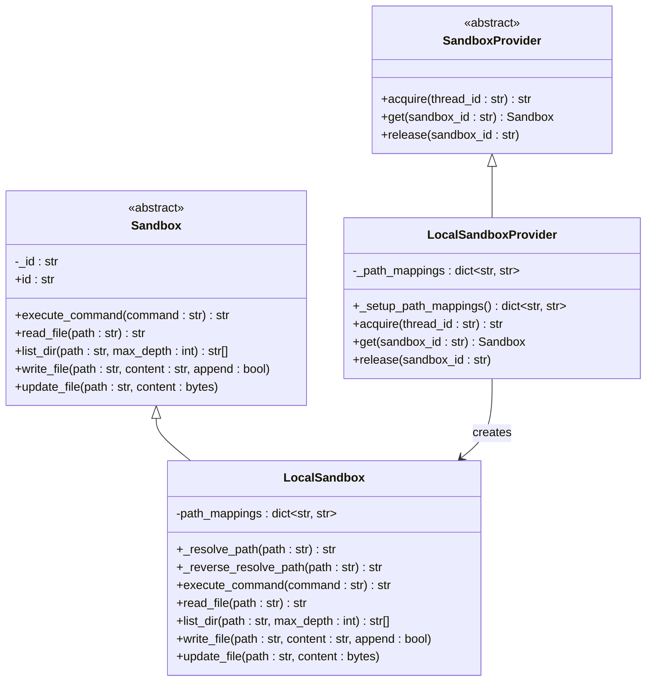

**图表来源**
- [sandbox.py:4-73](file://backend/packages/harness/deerflow/sandbox/sandbox.py#L4-L73)
- [local_sandbox.py:10-215](file://backend/packages/harness/deerflow/sandbox/local/local_sandbox.py#L10-L215)
- [sandbox_provider.py:8-36](file://backend/packages/harness/deerflow/sandbox/sandbox_provider.py#L8-L36)
- [local_sandbox_provider.py:12-65](file://backend/packages/harness/deerflow/sandbox/local/local_sandbox_provider.py#L12-L65)

### 沙箱提供者模式

提供者模式实现了沙箱的工厂方法，支持单例缓存和动态配置：

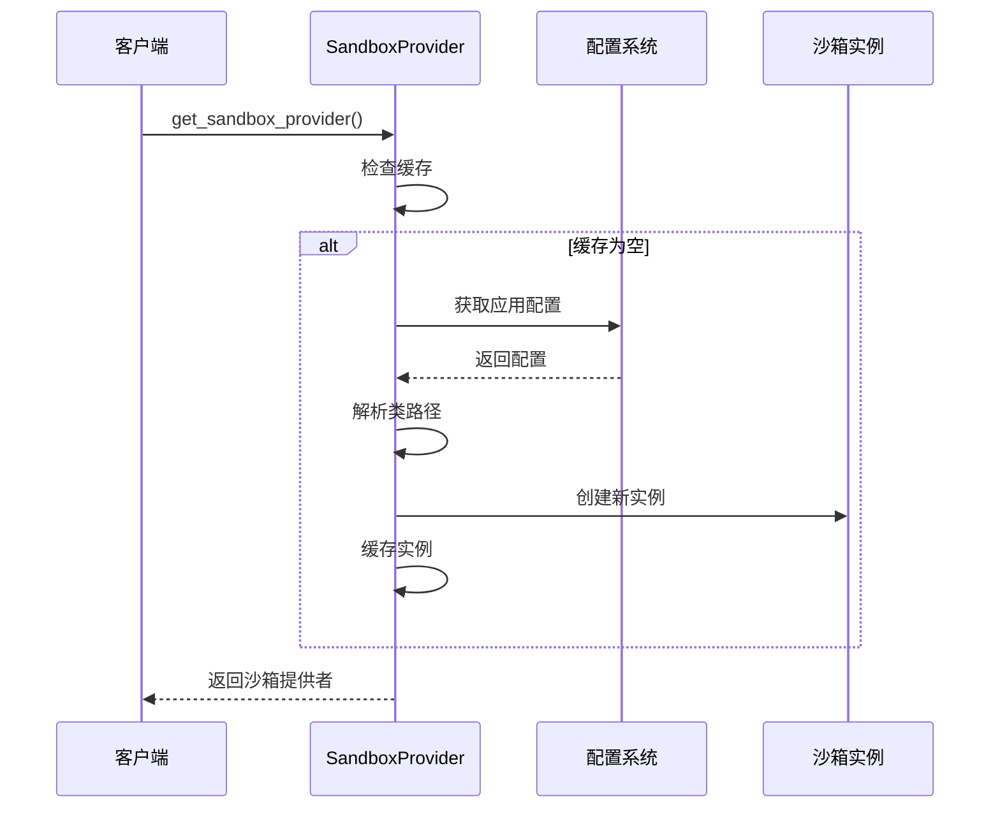

**图表来源**
- [sandbox_provider.py:42-56](file://backend/packages/harness/deerflow/sandbox/sandbox_provider.py#L42-L56)

**章节来源**
- [sandbox.py:1-73](file://backend/packages/harness/deerflow/sandbox/sandbox.py#L1-L73)
- [sandbox_provider.py:1-97](file://backend/packages/harness/deerflow/sandbox/sandbox_provider.py#L1-L97)
- [local_sandbox.py:1-215](file://backend/packages/harness/deerflow/sandbox/local/local_sandbox.py#L1-L215)
- [local_sandbox_provider.py:1-65](file://backend/packages/harness/deerflow/sandbox/local/local_sandbox_provider.py#L1-L65)

## 架构概览

DeerFlow 沙箱系统采用分层架构设计，支持从本地开发到生产环境的多种部署模式：

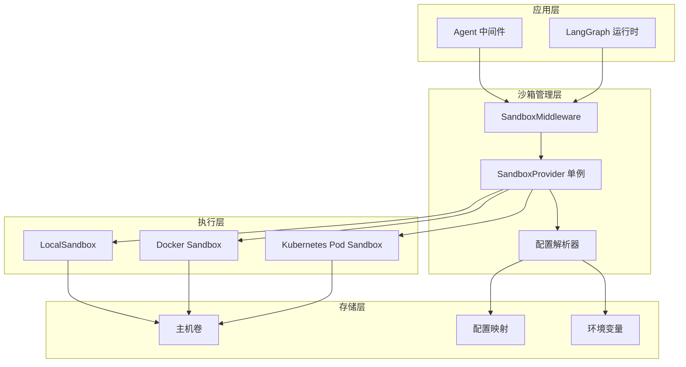

### 生命周期管理流程

沙箱的完整生命周期包括获取、使用和释放三个阶段：

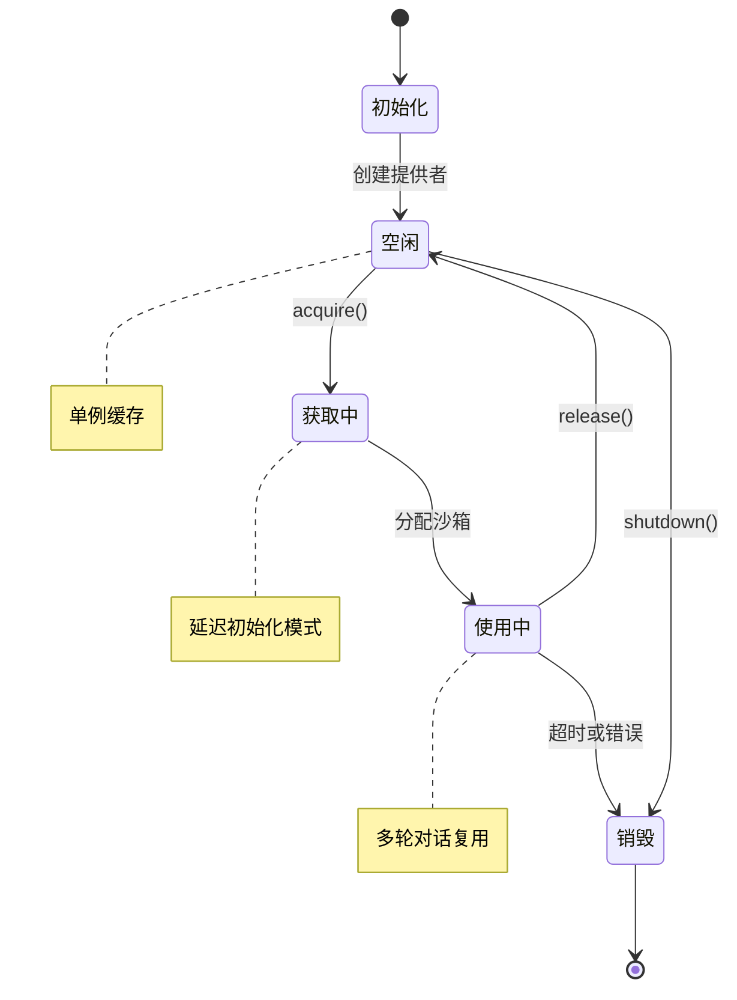

**图表来源**
- [middleware.py:21-30](file://backend/packages/harness/deerflow/sandbox/middleware.py#L21-L30)
- [sandbox_provider.py:42-84](file://backend/packages/harness/deerflow/sandbox/sandbox_provider.py#L42-L84)

## 详细组件分析

### 本地沙箱实现

本地沙箱提供了最简单的沙箱实现，适用于开发和测试环境：

#### 路径映射机制

本地沙箱的核心特性是路径映射，允许容器内的路径与主机路径进行双向转换：

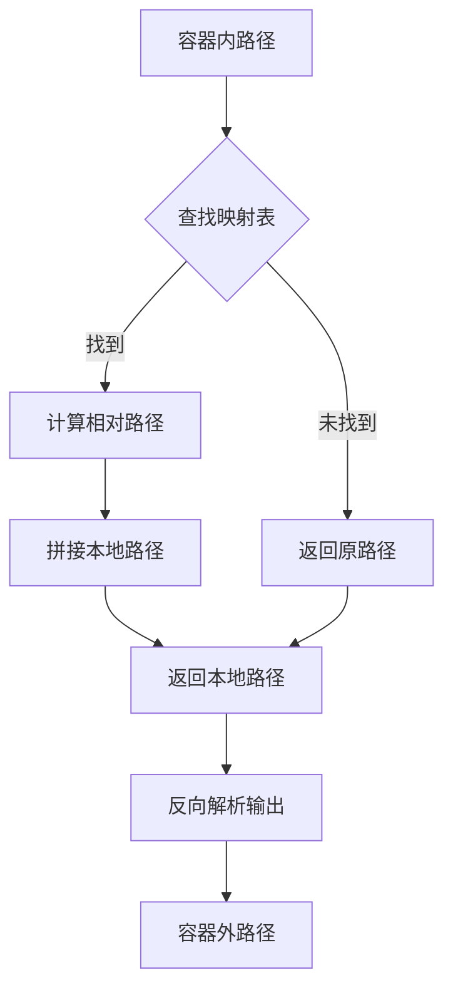

**图表来源**
- [local_sandbox.py:23-68](file://backend/packages/harness/deerflow/sandbox/local/local_sandbox.py#L23-L68)

#### 命令执行流程

本地沙箱的命令执行过程包含路径解析、安全检查和结果处理：

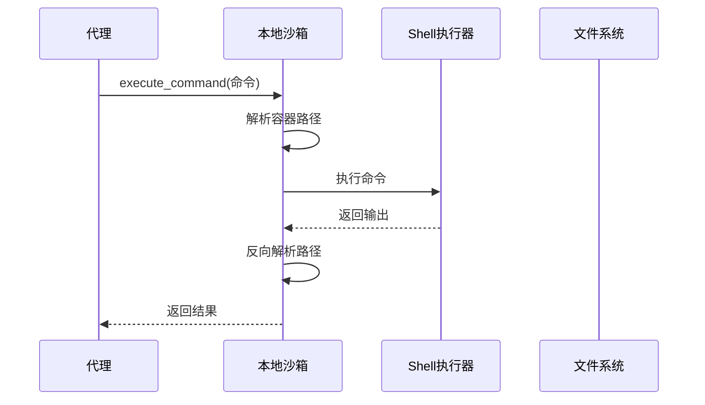

**图表来源**
- [local_sandbox.py:154-174](file://backend/packages/harness/deerflow/sandbox/local/local_sandbox.py#L154-L174)

**章节来源**
- [local_sandbox.py:1-215](file://backend/packages/harness/deerflow/sandbox/local/local_sandbox.py#L1-L215)

### 沙箱中间件

沙箱中间件是连接代理系统和沙箱提供者的桥梁，负责生命周期管理和状态维护：

#### 中间件状态管理

中间件维护了与线程相关的沙箱状态，确保多轮对话中的沙箱复用：

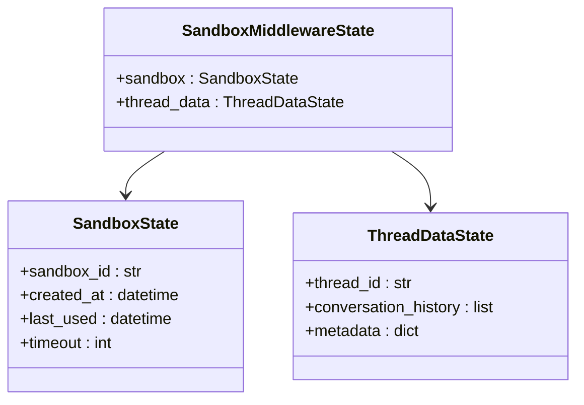

**图表来源**
- [middleware.py:14-19](file://backend/packages/harness/deerflow/sandbox/middleware.py#L14-L19)

#### 初始化策略

中间件支持两种初始化策略：延迟初始化和急切初始化：

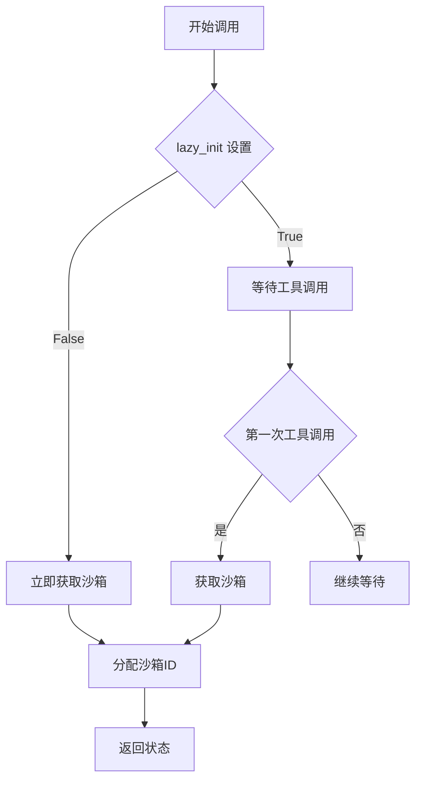

**图表来源**
- [middleware.py:34-65](file://backend/packages/harness/deerflow/sandbox/middleware.py#L34-L65)

**章节来源**
- [middleware.py:1-84](file://backend/packages/harness/deerflow/sandbox/middleware.py#L1-L84)

### 配置管理系统

沙箱配置系统提供了灵活的配置选项，支持不同环境下的部署需求：

#### 配置模型结构

配置系统采用 Pydantic 模型定义，支持类型安全和验证：

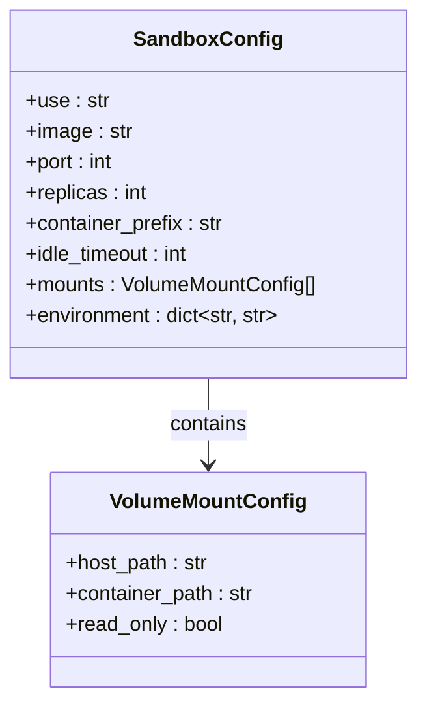

**图表来源**
- [sandbox_config.py:4-61](file://backend/packages/harness/deerflow/config/sandbox_config.py#L4-L61)

#### 环境变量处理

配置系统支持环境变量的动态解析，允许在运行时注入敏感信息：

**章节来源**
- [sandbox_config.py:1-62](file://backend/packages/harness/deerflow/config/sandbox_config.py#L1-L62)

## 依赖关系分析

沙箱系统的依赖关系体现了清晰的分层设计和解耦原则：

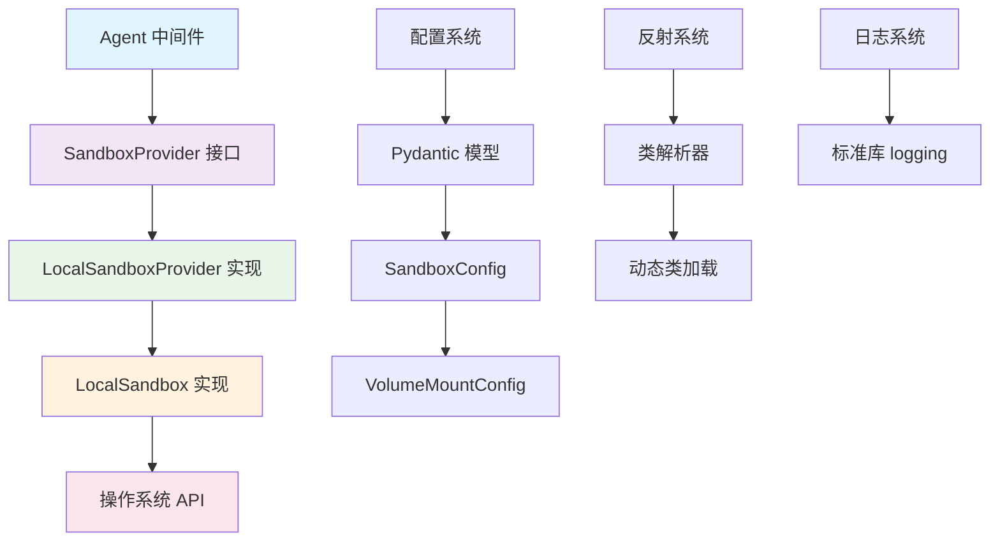

**图表来源**
- [middleware.py:8-9](file://backend/packages/harness/deerflow/sandbox/middleware.py#L8-L9)
- [sandbox_provider.py:3-5](file://backend/packages/harness/deerflow/sandbox/sandbox_provider.py#L3-L5)
- [local_sandbox_provider.py:3-5](file://backend/packages/harness/deerflow/sandbox/local/local_sandbox_provider.py#L3-L5)

### 关键依赖特性

1. **松耦合设计**：中间件只依赖抽象接口，不关心具体实现
2. **可插拔架构**：通过配置可以轻松切换不同的沙箱提供者
3. **类型安全**：使用 Pydantic 确保配置的有效性
4. **动态加载**：支持运行时类解析和实例化

**章节来源**
- [__init__.py:1-9](file://backend/packages/harness/deerflow/sandbox/__init__.py#L1-L9)
- [sandbox_provider.py:1-97](file://backend/packages/harness/deerflow/sandbox/sandbox_provider.py#L1-L97)

## 性能考虑

### 内存管理优化

沙箱系统采用了多项内存管理策略来优化性能：

1. **单例模式**：本地沙箱使用全局单例，避免重复创建开销
2. **延迟初始化**：默认启用延迟初始化，只有在需要时才创建沙箱
3. **连接池模式**：支持多个沙箱实例的复用和轮换

### 并发处理

系统通过以下机制支持高并发场景：

- **线程安全**：提供者实例是线程安全的
- **资源池管理**：支持最大并发数限制
- **超时机制**：防止资源泄漏和长时间占用

### 缓存策略

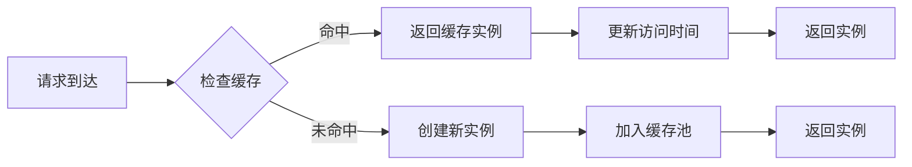

## 故障排除指南

### 常见问题诊断

#### 沙箱获取失败

当出现沙箱获取失败时，检查以下方面：

1. **配置验证**：确认 `sandbox.use` 配置正确
2. **类路径解析**：验证类路径是否可被动态加载
3. **权限检查**：确认应用具有必要的执行权限

#### 路径映射问题

路径映射失败通常由以下原因引起：

1. **映射配置错误**：检查 `host_path` 和 `container_path` 的正确性
2. **权限不足**：确认容器对主机目录有适当的访问权限
3. **路径格式问题**：确保使用正确的绝对路径格式

#### 超时和资源限制

当遇到超时问题时：

1. **增加超时时间**：调整 `idle_timeout` 配置
2. **检查资源使用**：监控 CPU 和内存使用情况
3. **优化并发设置**：调整 `replicas` 参数

### 日志分析

系统使用标准 Python logging 模块记录关键操作：

- **INFO 级别**：沙箱获取、释放等正常操作
- **WARNING 级别**：配置问题、权限警告等
- **ERROR 级别**：异常情况和错误处理

**章节来源**
- [local_sandbox_provider.py:39-41](file://backend/packages/harness/deerflow/sandbox/local/local_sandbox_provider.py#L39-L41)
- [middleware.py:45-49](file://backend/packages/harness/deerflow/sandbox/middleware.py#L45-L49)

## 结论

DeerFlow Kubernetes 沙箱集成为 AI 应用提供了一个强大而灵活的执行环境。通过抽象化的接口设计、模块化的架构和完善的生命周期管理，该系统能够满足从开发测试到生产部署的各种需求。

### 主要优势

1. **高度可移植**：统一接口支持多种后端实现
2. **安全可靠**：严格的权限控制和资源隔离
3. **性能优异**：智能缓存和延迟初始化机制
4. **易于扩展**：插件化架构支持功能扩展

### 适用场景

- **企业级 AI 应用**：需要严格隔离和资源控制
- **多租户平台**：支持多个用户的安全共享
- **开发测试环境**：快速部署和清理的沙箱环境
- **生产监控系统**：可靠的执行和监控能力

该沙箱系统为 DeerFlow 生态系统提供了坚实的基础，支持更复杂的 AI 工作流和更丰富的应用场景。