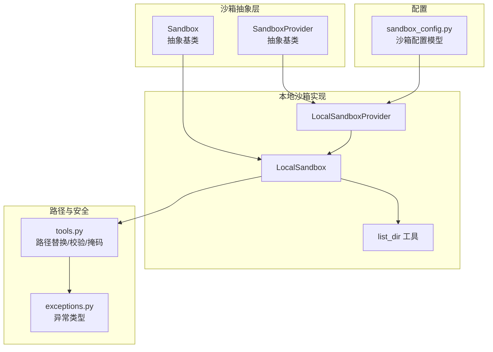
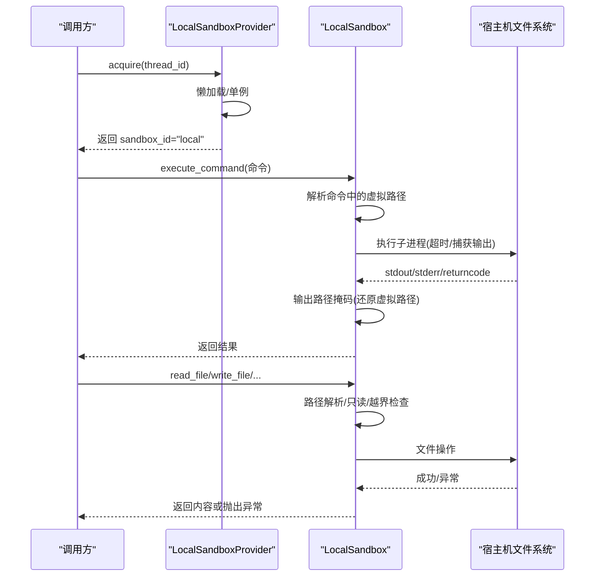
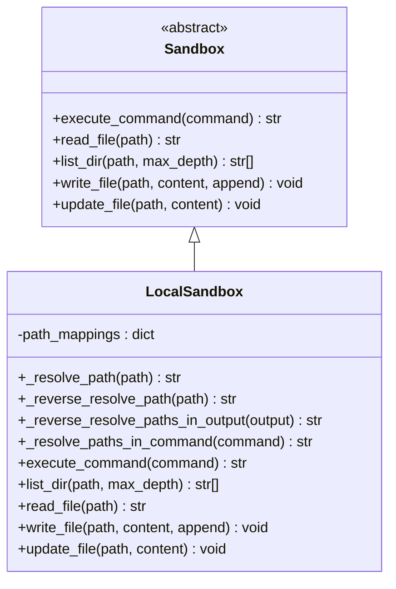
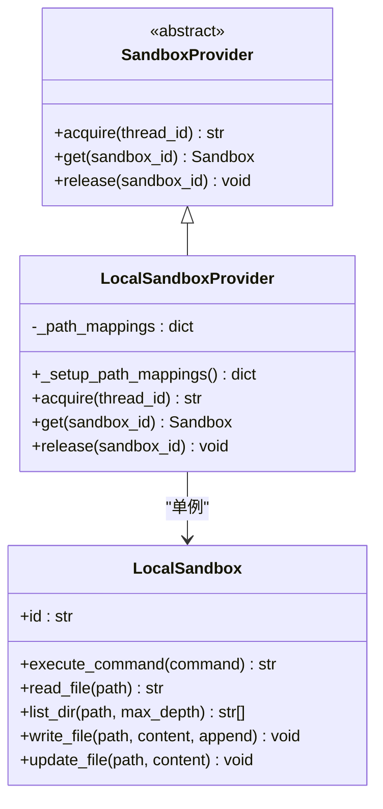
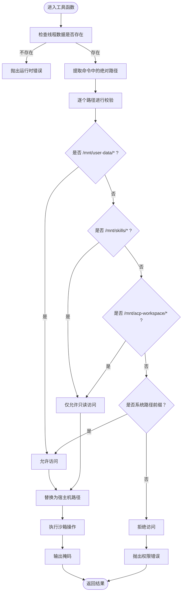
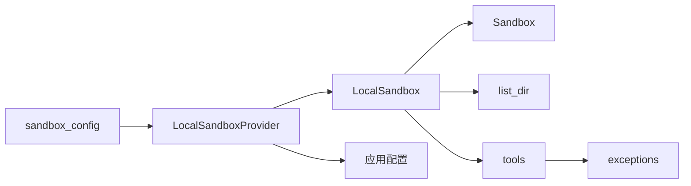

# 本地沙箱实现

<cite>
**本文档引用的文件**
- [local_sandbox.py](file://backend/packages/harness/deerflow/sandbox/local/local_sandbox.py)
- [local_sandbox_provider.py](file://backend/packages/harness/deerflow/sandbox/local/local_sandbox_provider.py)
- [list_dir.py](file://backend/packages/harness/deerflow/sandbox/local/list_dir.py)
- [sandbox.py](file://backend/packages/harness/deerflow/sandbox/sandbox.py)
- [sandbox_provider.py](file://backend/packages/harness/deerflow/sandbox/sandbox_provider.py)
- [tools.py](file://backend/packages/harness/deerflow/sandbox/tools.py)
- [exceptions.py](file://backend/packages/harness/deerflow/sandbox/exceptions.py)
- [sandbox_config.py](file://backend/packages/harness/deerflow/config/sandbox_config.py)
- [test_local_sandbox_encoding.py](file://backend/tests/test_local_sandbox_encoding.py)
- [test_sandbox_tools_security.py](file://backend/tests/test_sandbox_tools_security.py)
</cite>

## 目录
1. [简介](#简介)
2. [项目结构](#项目结构)
3. [核心组件](#核心组件)
4. [架构总览](#架构总览)
5. [详细组件分析](#详细组件分析)
6. [依赖关系分析](#依赖关系分析)
7. [性能与资源特性](#性能与资源特性)
8. [配置与初始化](#配置与初始化)
9. [调试与故障排除](#调试与故障排除)
10. [与其他执行模式对比](#与其他执行模式对比)
11. [结论](#结论)

## 简介
本文件面向 DeerFlow 本地沙箱（LocalSandbox）实现，系统性阐述其设计原理、文件系统隔离机制与安全边界，详解 LocalSandbox 类的命令执行、文件读写与目录遍历的安全限制，以及 LocalSandboxProvider 的配置与初始化流程。同时提供性能特征、资源消耗、适用场景、配置选项、调试技巧与故障排除方法，并对本地沙箱与容器化沙箱等其他执行模式进行对比分析。

## 项目结构
本地沙箱相关代码位于后端 harness 包中，主要由以下模块组成：
- 抽象基类：Sandbox、SandboxProvider
- 本地沙箱实现：LocalSandbox 及其路径映射工具
- 路径解析与安全校验：tools.py 中的路径替换、访问控制与输出掩码
- 配置与异常：sandbox_config.py、exceptions.py
- 测试用例：验证编码处理、安全策略与路径解析

图表来源
- [sandbox.py:1-73](file://backend/packages/harness/deerflow/sandbox/sandbox.py#L1-L73)
- [sandbox_provider.py:1-97](file://backend/packages/harness/deerflow/sandbox/sandbox_provider.py#L1-L97)
- [local_sandbox.py:1-215](file://backend/packages/harness/deerflow/sandbox/local/local_sandbox.py#L1-L215)
- [local_sandbox_provider.py:1-65](file://backend/packages/harness/deerflow/sandbox/local/local_sandbox_provider.py#L1-L65)
- [list_dir.py:1-113](file://backend/packages/harness/deerflow/sandbox/local/list_dir.py#L1-L113)
- [tools.py:1-880](file://backend/packages/harness/deerflow/sandbox/tools.py#L1-L880)
- [exceptions.py:1-72](file://backend/packages/harness/deerflow/sandbox/exceptions.py#L1-L72)
- [sandbox_config.py:1-62](file://backend/packages/harness/deerflow/config/sandbox_config.py#L1-L62)

章节来源
- [sandbox.py:1-73](file://backend/packages/harness/deerflow/sandbox/sandbox.py#L1-L73)
- [sandbox_provider.py:1-97](file://backend/packages/harness/deerflow/sandbox/sandbox_provider.py#L1-L97)
- [local_sandbox.py:1-215](file://backend/packages/harness/deerflow/sandbox/local/local_sandbox.py#L1-L215)
- [local_sandbox_provider.py:1-65](file://backend/packages/harness/deerflow/sandbox/local/local_sandbox_provider.py#L1-L65)
- [list_dir.py:1-113](file://backend/packages/harness/deerflow/sandbox/local/list_dir.py#L1-L113)
- [tools.py:1-880](file://backend/packages/harness/deerflow/sandbox/tools.py#L1-L880)
- [exceptions.py:1-72](file://backend/packages/harness/deerflow/sandbox/exceptions.py#L1-L72)
- [sandbox_config.py:1-62](file://backend/packages/harness/deerflow/config/sandbox_config.py#L1-L62)

## 核心组件
- Sandbox 抽象基类：定义统一的沙箱接口，包括命令执行、文件读写、目录遍历与二进制更新。
- SandboxProvider 抽象基类：负责沙箱实例的获取、释放与全局单例管理。
- LocalSandbox：在宿主机上直接执行命令与文件操作，通过路径映射与安全校验实现隔离。
- LocalSandboxProvider：本地沙箱提供者，负责构建路径映射并以单例模式返回 LocalSandbox 实例。
- tools.py：提供路径虚拟化、绝对路径校验、输出掩码与线程数据目录创建等安全与便利功能。
- list_dir：本地目录遍历工具，支持忽略模式与最大深度控制。
- exceptions：统一的沙箱异常体系，便于错误定位与用户提示。
- sandbox_config：沙箱配置模型，用于声明式指定沙箱提供者与容器化参数（本地模式不使用容器参数）。

章节来源
- [sandbox.py:1-73](file://backend/packages/harness/deerflow/sandbox/sandbox.py#L1-L73)
- [sandbox_provider.py:1-97](file://backend/packages/harness/deerflow/sandbox/sandbox_provider.py#L1-L97)
- [local_sandbox.py:1-215](file://backend/packages/harness/deerflow/sandbox/local/local_sandbox.py#L1-L215)
- [local_sandbox_provider.py:1-65](file://backend/packages/harness/deerflow/sandbox/local/local_sandbox_provider.py#L1-L65)
- [tools.py:1-880](file://backend/packages/harness/deerflow/sandbox/tools.py#L1-L880)
- [list_dir.py:1-113](file://backend/packages/harness/deerflow/sandbox/local/list_dir.py#L1-L113)
- [exceptions.py:1-72](file://backend/packages/harness/deerflow/sandbox/exceptions.py#L1-L72)
- [sandbox_config.py:1-62](file://backend/packages/harness/deerflow/config/sandbox_config.py#L1-L62)

## 架构总览
本地沙箱采用“虚拟路径 + 宿主机映射 + 安全校验”的隔离策略：
- 虚拟路径：统一使用 /mnt/user-data、/mnt/skills、/mnt/acp-workspace 等前缀。
- 宿主机映射：LocalSandboxProvider 将容器路径映射到宿主机实际路径；LocalSandbox 在执行前解析命令与路径。
- 安全边界：tools.py 对命令中的绝对路径进行白名单校验，拒绝非虚拟路径；对输出进行路径掩码，隐藏宿主机真实路径；对文件操作进行只读限制与越界检查。
- 单例模式：LocalSandboxProvider 使用单例，避免重复创建，提升性能与一致性。

图表来源
- [local_sandbox_provider.py:45-64](file://backend/packages/harness/deerflow/sandbox/local/local_sandbox_provider.py#L45-L64)
- [local_sandbox.py:154-215](file://backend/packages/harness/deerflow/sandbox/local/local_sandbox.py#L154-L215)
- [tools.py:684-713](file://backend/packages/harness/deerflow/sandbox/tools.py#L684-L713)

## 详细组件分析

### LocalSandbox 类
LocalSandbox 继承自 Sandbox，负责在宿主机上执行命令与文件操作，并通过路径映射与安全校验实现隔离。

- 路径映射与解析
  - _resolve_path：将容器路径映射为宿主机路径，优先匹配最长前缀，确保精确替换。
  - _reverse_resolve_path：将宿主机路径反向映射回容器路径，用于输出展示。
  - _reverse_resolve_paths_in_output：在输出字符串中批量替换宿主机绝对路径为虚拟路径，防止泄露。
  - _resolve_paths_in_command：在命令字符串中解析所有容器路径，保证命令正确执行。

- 命令执行
  - execute_command：解析命令中的路径，选择可用 shell（zsh/bash/sh），以 shell=True 执行，捕获 stdout/stderr/returncode，超时默认 600 秒，最终对输出进行路径掩码。

- 目录遍历
  - list_dir：调用 list_dir 工具，支持最大深度与忽略模式，返回排序后的条目列表，并对每个条目进行路径掩码。

- 文件读写
  - read_file：UTF-8 编码读取文本文件，异常时重抛并保留原始路径，便于用户定位。
  - write_file/update_file：创建父目录，按需追加或覆盖写入，异常时同样保留原始路径。

- 安全与健壮性
  - 超时控制：命令执行设置超时，避免长时间阻塞。
  - 异常包装：将底层 OSError 包装为原路径错误，隐藏内部解析细节。
  - 输出掩码：统一将宿主机路径替换为虚拟路径，降低信息泄露风险。

图表来源
- [sandbox.py:4-73](file://backend/packages/harness/deerflow/sandbox/sandbox.py#L4-L73)
- [local_sandbox.py:10-215](file://backend/packages/harness/deerflow/sandbox/local/local_sandbox.py#L10-L215)

章节来源
- [local_sandbox.py:10-215](file://backend/packages/harness/deerflow/sandbox/local/local_sandbox.py#L10-L215)

### LocalSandboxProvider
LocalSandboxProvider 是本地沙箱的提供者，负责：
- 初始化路径映射：从应用配置中读取 skills 目录与容器路径，仅当宿主机存在时才建立映射。
- 单例获取：acquire/get 返回同一 LocalSandbox 实例，release 不做清理（保持复用）。

图表来源
- [sandbox_provider.py:8-36](file://backend/packages/harness/deerflow/sandbox/sandbox_provider.py#L8-L36)
- [local_sandbox_provider.py:12-64](file://backend/packages/harness/deerflow/sandbox/local/local_sandbox_provider.py#L12-L64)
- [local_sandbox.py:10-215](file://backend/packages/harness/deerflow/sandbox/local/local_sandbox.py#L10-L215)

章节来源
- [local_sandbox_provider.py:12-64](file://backend/packages/harness/deerflow/sandbox/local/local_sandbox_provider.py#L12-L64)
- [sandbox_provider.py:42-97](file://backend/packages/harness/deerflow/sandbox/sandbox_provider.py#L42-L97)

### 路径解析与安全校验（tools.py）
tools.py 提供了本地沙箱的关键安全能力：
- 虚拟路径替换：将 /mnt/user-data、/mnt/skills、/mnt/acp-workspace 替换为宿主机实际路径。
- 绝对路径校验：仅允许虚拟路径与少量系统路径前缀，拒绝其他绝对路径。
- 路径越界检测：拒绝包含 .. 的路径段，确保不会逃逸到允许范围之外。
- 输出掩码：将宿主机绝对路径替换为虚拟路径，避免泄露真实文件系统布局。
- 线程数据目录创建：首次使用时在宿主机创建 per-thread 的 workspace/uploads/outputs 目录。

图表来源
- [tools.py:453-491](file://backend/packages/harness/deerflow/sandbox/tools.py#L453-L491)
- [tools.py:684-713](file://backend/packages/harness/deerflow/sandbox/tools.py#L684-L713)
- [tools.py:287-356](file://backend/packages/harness/deerflow/sandbox/tools.py#L287-L356)

章节来源
- [tools.py:1-880](file://backend/packages/harness/deerflow/sandbox/tools.py#L1-L880)

### 目录遍历工具（list_dir）
list_dir 提供受控的目录遍历能力：
- 忽略模式：内置大量常见忽略项（版本控制、依赖、构建产物、IDE、日志、缓存等）。
- 最大深度：默认 2 层，避免过深遍历造成性能问题。
- 权限处理：遇到权限不足时静默跳过，保证稳定性。
- 结果排序：返回排序后的绝对路径列表，便于展示与比较。

章节来源
- [list_dir.py:1-113](file://backend/packages/harness/deerflow/sandbox/local/list_dir.py#L1-L113)

## 依赖关系分析
- LocalSandbox 依赖：
  - Sandbox 抽象基类：继承统一接口。
  - list_dir：目录遍历工具。
  - tools：路径解析与安全校验。
- LocalSandboxProvider 依赖：
  - LocalSandbox：构造单例实例。
  - 应用配置：读取 skills 路径与容器路径。
- tools 依赖：
  - 路径常量与虚拟路径前缀。
  - 配置与路径解析工具。
- 异常体系：统一的 SandboxError/SandboxFileError 等，便于上层捕获与提示。

图表来源
- [local_sandbox.py:6-7](file://backend/packages/harness/deerflow/sandbox/local/local_sandbox.py#L6-L7)
- [local_sandbox_provider.py:30-43](file://backend/packages/harness/deerflow/sandbox/local/local_sandbox_provider.py#L30-L43)
- [tools.py:8-15](file://backend/packages/harness/deerflow/sandbox/tools.py#L8-L15)
- [sandbox_config.py:28-31](file://backend/packages/harness/deerflow/config/sandbox_config.py#L28-L31)

章节来源
- [local_sandbox.py:1-215](file://backend/packages/harness/deerflow/sandbox/local/local_sandbox.py#L1-L215)
- [local_sandbox_provider.py:1-65](file://backend/packages/harness/deerflow/sandbox/local/local_sandbox_provider.py#L1-L65)
- [tools.py:1-880](file://backend/packages/harness/deerflow/sandbox/tools.py#L1-L880)
- [sandbox_config.py:1-62](file://backend/packages/harness/deerflow/config/sandbox_config.py#L1-L62)

## 性能与资源特性
- 进程开销：命令执行通过子进程实现，每次调用都会启动 shell，适合短时任务；长耗时任务建议批量化或使用容器化沙箱以复用环境。
- 内存占用：LocalSandboxProvider 使用单例，避免重复创建带来的内存浪费；LocalSandbox 本身轻量，主要消耗在命令执行与路径解析。
- I/O 特性：文件读写直接映射到宿主机文件系统，受磁盘性能影响；目录遍历受忽略模式与最大深度限制，避免深层递归。
- 超时与健壮性：命令执行默认超时 600 秒，遇到权限错误或路径错误会快速失败，减少资源占用。
- 适用场景：开发调试、小规模脚本执行、需要与宿主机文件系统紧密交互的任务；不适合高并发与持久化容器环境。

[本节为通用性能讨论，无需具体文件分析]

## 配置与初始化
- 配置入口
  - 在应用配置中通过 sandbox.use 指定 LocalSandboxProvider 的类路径，例如 deerflow.sandbox.local:LocalSandboxProvider。
  - 本地沙箱不使用容器化参数（image/port/replicas 等），这些字段仅对容器化沙箱生效。
- 初始化流程
  - 通过 get_sandbox_provider 获取 Provider 单例，内部根据配置解析类路径并实例化。
  - LocalSandboxProvider 在 acquire 时懒加载并创建单例 LocalSandbox，路径映射来自应用配置的 skills 路径与容器路径。
- 路径映射
  - 仅当 skills 目录存在时才建立映射；若配置加载失败或目录不存在，将记录警告但不影响沙箱运行。

章节来源
- [sandbox_config.py:28-31](file://backend/packages/harness/deerflow/config/sandbox_config.py#L28-L31)
- [sandbox_provider.py:42-56](file://backend/packages/harness/deerflow/sandbox/sandbox_provider.py#L42-L56)
- [local_sandbox_provider.py:17-43](file://backend/packages/harness/deerflow/sandbox/local/local_sandbox_provider.py#L17-L43)

## 调试与故障排除
- 常见问题与定位
  - 命令执行失败：检查命令中是否包含非虚拟路径的绝对路径；确认路径映射是否正确；查看输出中的退出码与标准错误。
  - 文件读写异常：确认目标路径是否在允许范围内（user-data/skills/acp-workspace），且未越界；注意只读限制（skills 与 acp-workspace）。
  - 输出泄露：LocalSandbox 会自动将宿主机路径掩码为虚拟路径；如仍出现泄露，检查 tools.mask_local_paths_in_output 是否被正确调用。
- 调试技巧
  - 使用 bash_tool/ls_tool/read_file_tool 等工具进行最小化复现，逐步缩小问题范围。
  - 在测试中使用替换虚拟路径与绝对路径校验的断言，验证路径解析与安全策略。
  - 关注 Windows 下编码差异：LocalSandbox 默认使用 UTF-8 读写，测试覆盖了 gbk 场景下的兼容性。
- 相关测试参考
  - 编码兼容性测试：验证 UTF-8 读写与 Windows gbk 场景。
  - 安全策略测试：覆盖路径越界、只读限制、命令绝对路径白名单等。

章节来源
- [test_local_sandbox_encoding.py:1-34](file://backend/tests/test_local_sandbox_encoding.py#L1-L34)
- [test_sandbox_tools_security.py:1-426](file://backend/tests/test_sandbox_tools_security.py#L1-L426)
- [tools.py:210-222](file://backend/packages/harness/deerflow/sandbox/tools.py#L210-L222)

## 与其他执行模式对比
- 本地沙箱（LocalSandbox）
  - 优点：零容器依赖、启动快、与宿主机文件系统直接交互、便于调试。
  - 缺点：无强隔离、无法跨平台一致运行、资源隔离弱。
- 容器化沙箱（如 AioSandboxProvider）
  - 优点：强隔离、可移植、资源限制明确、多租户隔离。
  - 缺点：启动成本高、网络与卷挂载复杂、调试相对困难。

[本节为概念性对比，无需具体文件分析]

## 结论
本地沙箱通过“虚拟路径 + 宿主机映射 + 安全校验”实现了在宿主机上的安全执行环境。LocalSandboxProvider 以单例模式提供稳定一致的实例，tools.py 则提供了完善的路径解析、访问控制与输出掩码能力。对于开发调试与小规模脚本执行，本地沙箱具备快速、直观的优势；对于需要强隔离与可移植性的场景，建议采用容器化沙箱方案。合理配置路径映射与遵循只读限制，可有效降低安全风险并提升用户体验。