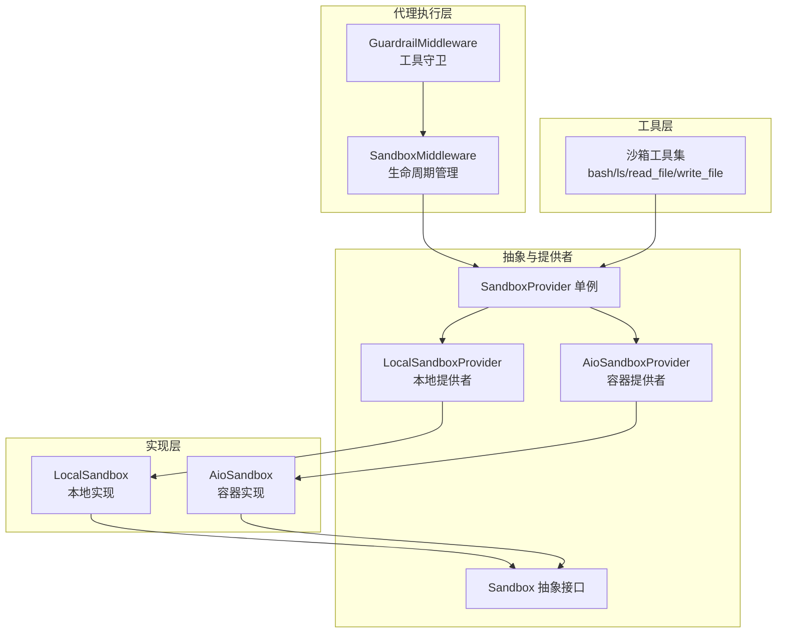
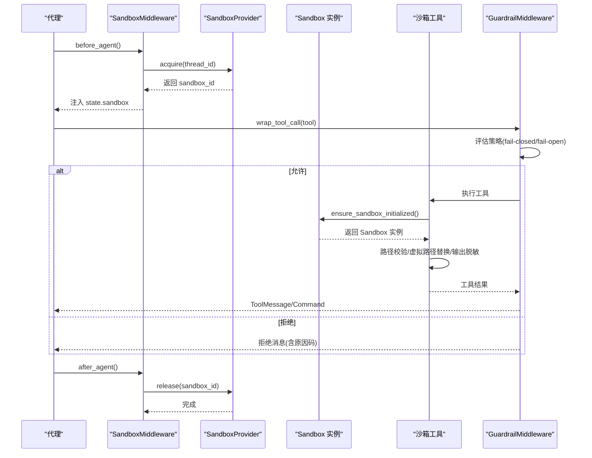
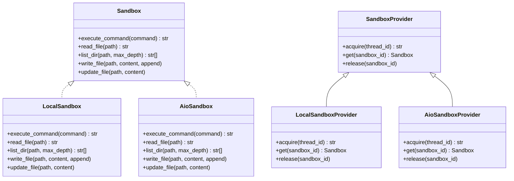
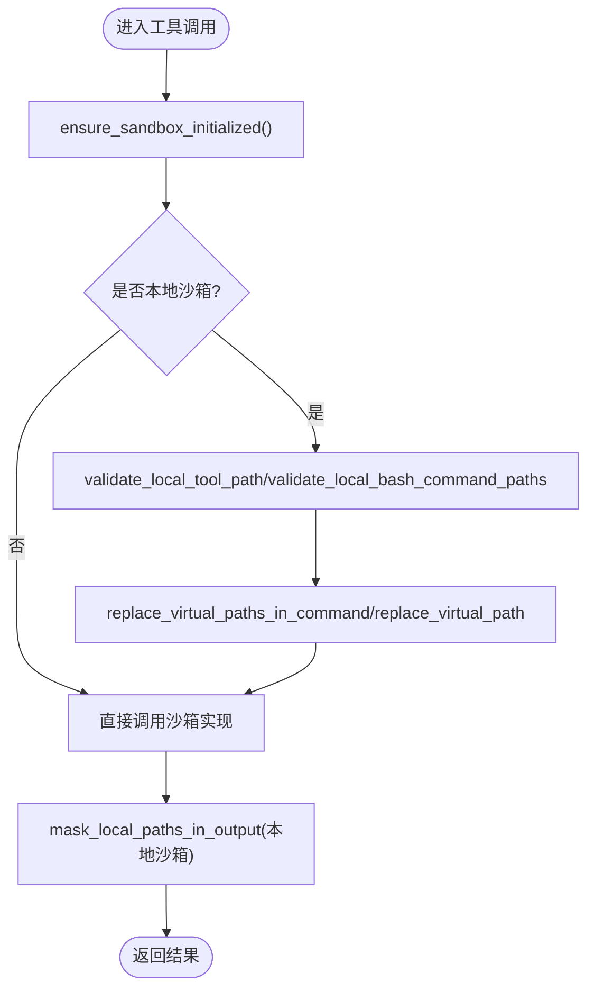
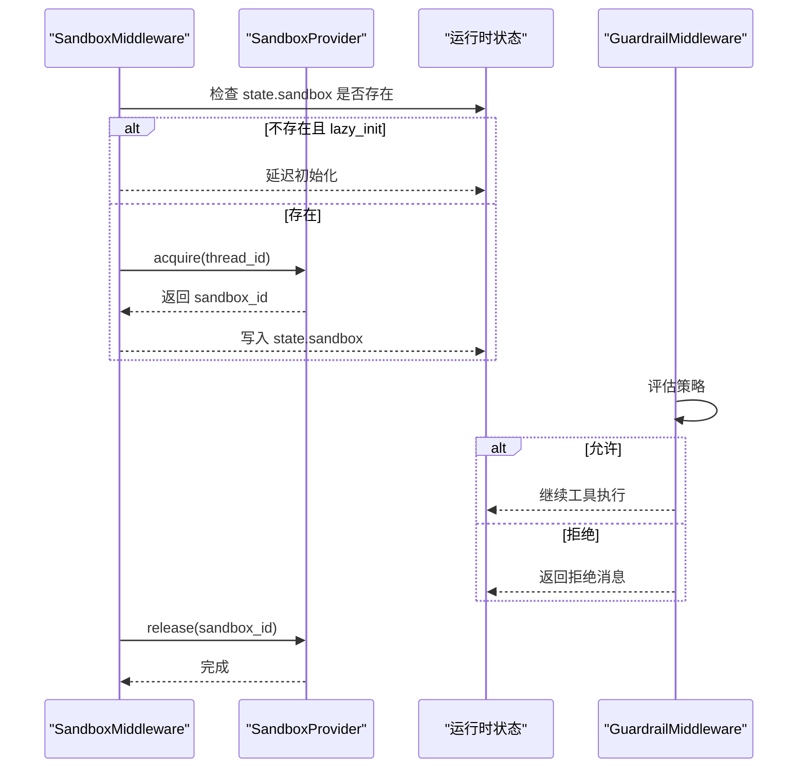
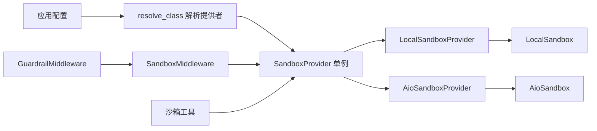

# 沙箱安全机制

<cite>
**本文档引用的文件**
- [sandbox.py](file://backend/packages/harness/deerflow/sandbox/sandbox.py)
- [middleware.py](file://backend/packages/harness/deerflow/sandbox/middleware.py)
- [exceptions.py](file://backend/packages/harness/deerflow/sandbox/exceptions.py)
- [sandbox_provider.py](file://backend/packages/harness/deerflow/sandbox/sandbox_provider.py)
- [tools.py](file://backend/packages/harness/deerflow/sandbox/tools.py)
- [local_sandbox.py](file://backend/packages/harness/deerflow/sandbox/local/local_sandbox.py)
- [local_sandbox_provider.py](file://backend/packages/harness/deerflow/sandbox/local/local_sandbox_provider.py)
- [aio_sandbox.py](file://backend/packages/harness/deerflow/community/aio_sandbox/aio_sandbox.py)
- [middleware.py](file://backend/packages/harness/deerflow/guardrails/middleware.py)
- [tool_error_handling_middleware.py](file://backend/packages/harness/deerflow/agents/middlewares/tool_error_handling_middleware.py)
- [GUARDRAILS.md](file://backend/docs/GUARDRAILS.md)
</cite>

## 目录
1. [简介](#简介)
2. [项目结构](#项目结构)
3. [核心组件](#核心组件)
4. [架构总览](#架构总览)
5. [详细组件分析](#详细组件分析)
6. [依赖关系分析](#依赖关系分析)
7. [性能考量](#性能考量)
8. [故障排查指南](#故障排查指南)
9. [结论](#结论)
10. [附录](#附录)

## 简介
本文件系统化阐述 DeerFlow 沙箱安全机制，覆盖安全隔离原理、访问控制策略、威胁防护、异常与错误处理、安全审计、中间件安全检查、权限验证与资源限制、安全配置最佳实践、漏洞防护与合规要求、安全事件响应流程、渗透测试方法与评估标准，以及不同沙箱类型的安全风险与缓解策略。

## 项目结构
DeerFlow 后端通过“沙箱抽象层 + 提供者模式 + 工具层 + 中间件”的分层设计实现安全隔离与访问控制：
- 抽象层：定义统一的 Sandbox 接口，屏蔽具体实现差异（本地/容器）。
- 提供者层：通过 SandboxProvider 获取/释放沙箱实例，支持懒加载与全局单例。
- 工具层：对 bash、文件读写等工具进行路径校验、虚拟路径替换与输出脱敏。
- 中间件层：在代理执行前后注入沙箱生命周期管理与守卫策略（Guardrails）。
- 安全审计：统一异常体系与错误信息过滤，避免敏感路径泄露。

**图表来源**
- [middleware.py:21-84](file://backend/packages/harness/deerflow/sandbox/middleware.py#L21-L84)
- [sandbox_provider.py:8-97](file://backend/packages/harness/deerflow/sandbox/sandbox_provider.py#L8-L97)
- [local_sandbox_provider.py:12-65](file://backend/packages/harness/deerflow/sandbox/local/local_sandbox_provider.py#L12-L65)
- [aio_sandbox.py:11-129](file://backend/packages/harness/deerflow/community/aio_sandbox/aio_sandbox.py#L11-L129)
- [tools.py:684-800](file://backend/packages/harness/deerflow/sandbox/tools.py#L684-L800)
- [middleware.py:20-99](file://backend/packages/harness/deerflow/guardrails/middleware.py#L20-L99)

**章节来源**
- [sandbox.py:4-73](file://backend/packages/harness/deerflow/sandbox/sandbox.py#L4-L73)
- [sandbox_provider.py:42-97](file://backend/packages/harness/deerflow/sandbox/sandbox_provider.py#L42-L97)
- [tools.py:1-800](file://backend/packages/harness/deerflow/sandbox/tools.py#L1-L800)

## 核心组件
- Sandbox 抽象接口：统一命令执行、文件读写、目录列举、二进制更新等能力，确保上层工具无需关心底层实现。
- SandboxProvider 单例：负责沙箱实例获取、缓存与释放；支持重置与优雅关闭。
- LocalSandboxProvider/AioSandboxProvider：分别对接本地文件系统与容器沙箱，实现路径映射与资源隔离。
- LocalSandbox/AioSandbox：具体实现，前者基于子进程与路径映射，后者通过 HTTP API 调用远端容器。
- 沙箱工具集：对 bash、ls、read_file、write_file 进行路径校验、虚拟路径替换与输出脱敏。
- SandboxMiddleware：在代理生命周期内按需分配/回收沙箱，避免重复创建。
- GuardrailMiddleware：在工具调用前进行策略评估，支持 fail-closed/fail-open 与审计日志。

**章节来源**
- [sandbox.py:4-73](file://backend/packages/harness/deerflow/sandbox/sandbox.py#L4-L73)
- [sandbox_provider.py:8-97](file://backend/packages/harness/deerflow/sandbox/sandbox_provider.py#L8-L97)
- [local_sandbox_provider.py:12-65](file://backend/packages/harness/deerflow/sandbox/local/local_sandbox_provider.py#L12-L65)
- [aio_sandbox.py:11-129](file://backend/packages/harness/deerflow/community/aio_sandbox/aio_sandbox.py#L11-L129)
- [tools.py:684-800](file://backend/packages/harness/deerflow/sandbox/tools.py#L684-L800)
- [middleware.py:21-84](file://backend/packages/harness/deerflow/sandbox/middleware.py#L21-L84)
- [middleware.py:20-99](file://backend/packages/harness/deerflow/guardrails/middleware.py#L20-L99)

## 架构总览
下图展示从代理到沙箱的完整调用链路与安全控制点：

**图表来源**
- [middleware.py:51-84](file://backend/packages/harness/deerflow/sandbox/middleware.py#L51-L84)
- [sandbox_provider.py:42-97](file://backend/packages/harness/deerflow/sandbox/sandbox_provider.py#L42-L97)
- [tools.py:684-713](file://backend/packages/harness/deerflow/sandbox/tools.py#L684-L713)
- [middleware.py:54-99](file://backend/packages/harness/deerflow/guardrails/middleware.py#L54-L99)

## 详细组件分析

### 抽象与提供者层
- Sandbox 抽象：定义 execute_command、read_file、list_dir、write_file、update_file 等方法，确保上层工具以一致方式使用沙箱能力。
- SandboxProvider 单例：延迟解析配置类名，实例化具体提供者；提供 reset 和 shutdown，便于测试与优雅停机。
- LocalSandboxProvider：本地模式下建立容器路径到宿主路径的映射，仅在本地有效；Singleton 模式复用同一实例。
- AioSandbox：通过 HTTP API 访问远端容器沙箱，具备超时与错误包装。

**图表来源**
- [sandbox.py:4-73](file://backend/packages/harness/deerflow/sandbox/sandbox.py#L4-L73)
- [sandbox_provider.py:8-97](file://backend/packages/harness/deerflow/sandbox/sandbox_provider.py#L8-L97)
- [local_sandbox_provider.py:12-65](file://backend/packages/harness/deerflow/sandbox/local/local_sandbox_provider.py#L12-L65)
- [aio_sandbox.py:11-129](file://backend/packages/harness/deerflow/community/aio_sandbox/aio_sandbox.py#L11-L129)

**章节来源**
- [sandbox.py:4-73](file://backend/packages/harness/deerflow/sandbox/sandbox.py#L4-L73)
- [sandbox_provider.py:42-97](file://backend/packages/harness/deerflow/sandbox/sandbox_provider.py#L42-L97)
- [local_sandbox_provider.py:12-65](file://backend/packages/harness/deerflow/sandbox/local/local_sandbox_provider.py#L12-L65)
- [aio_sandbox.py:11-129](file://backend/packages/harness/deerflow/community/aio_sandbox/aio_sandbox.py#L11-L129)

### 工具层与访问控制
- 路径白名单与只读策略：
  - /mnt/user-data/*：允许读写（线程私有工作区/上传/输出）。
  - /mnt/skills/*：仅允许只读（技能目录）。
  - /mnt/acp-workspace/*：仅允许只读（全局工作空间）。
- 绝对路径检测：拒绝包含 “..” 的路径段；对 bash 命令中的绝对路径进行严格校验，仅允许虚拟路径或系统白名单前缀。
- 虚拟路径替换：将 /mnt/user-data、/mnt/skills、/mnt/acp-workspace 替换为实际宿主路径，确保工具在受控范围内操作。
- 输出脱敏：在本地沙箱模式下，将宿主绝对路径还原为虚拟路径，避免泄露主机文件系统布局。
- 工具实现：
  - bash_tool：支持路径校验与替换，捕获 SandboxError/PermissionError 并返回用户可读错误。
  - ls_tool：限制只读，支持深度树形列举。
  - read_file_tool：支持范围读取，严格路径校验。
  - write_file_tool：本地模式下创建线程目录，支持追加写入。

**图表来源**
- [tools.py:684-713](file://backend/packages/harness/deerflow/sandbox/tools.py#L684-L713)
- [tools.py:715-748](file://backend/packages/harness/deerflow/sandbox/tools.py#L715-L748)
- [tools.py:750-795](file://backend/packages/harness/deerflow/sandbox/tools.py#L750-L795)
- [tools.py:797-800](file://backend/packages/harness/deerflow/sandbox/tools.py#L797-L800)

**章节来源**
- [tools.py:17-536](file://backend/packages/harness/deerflow/sandbox/tools.py#L17-L536)
- [tools.py:684-800](file://backend/packages/harness/deerflow/sandbox/tools.py#L684-L800)

### 中间件层与生命周期管理
- SandboxMiddleware：
  - 支持懒初始化（lazy_init=True，默认），在首次工具调用时获取沙箱，减少无谓开销。
  - 在 before_agent 中按需分配，在 after_agent 中释放，避免频繁重建。
  - 通过 get_sandbox_provider().acquire/release 管理生命周期。
- GuardrailMiddleware：
  - 在 wrap_tool_call/awrap_tool_call 中评估策略，支持 fail-closed（默认）与 fail-open。
  - 对 Provider 异常进行分类处理，记录日志并按策略决定放行或阻断。
  - 将拒绝原因编码为 ToolMessage，便于代理自适应调整。

**图表来源**
- [middleware.py:51-84](file://backend/packages/harness/deerflow/sandbox/middleware.py#L51-L84)
- [middleware.py:54-99](file://backend/packages/harness/deerflow/guardrails/middleware.py#L54-L99)

**章节来源**
- [middleware.py:21-84](file://backend/packages/harness/deerflow/sandbox/middleware.py#L21-L84)
- [middleware.py:20-99](file://backend/packages/harness/deerflow/guardrails/middleware.py#L20-L99)

### 异常处理与错误信息过滤
- 结构化异常体系：SandboxError 作为基类，派生出 SandboxNotFoundError、SandboxRuntimeError、SandboxCommandError、SandboxFileError、SandboxPermissionError 等，携带结构化 details（如 sandbox_id、command、exit_code、path、operation）。
- 错误信息过滤：
  - _sanitize_error：在本地沙箱中将宿主路径还原为虚拟路径，避免泄露真实文件系统布局。
  - mask_local_paths_in_output：对输出中的宿主绝对路径进行掩蔽。
- 工具层捕获 SandboxError/PermissionError 并转换为用户可读字符串，避免内部异常细节外泄。

**章节来源**
- [exceptions.py:4-72](file://backend/packages/harness/deerflow/sandbox/exceptions.py#L4-L72)
- [tools.py:210-222](file://backend/packages/harness/deerflow/sandbox/tools.py#L210-L222)
- [tools.py:287-356](file://backend/packages/harness/deerflow/sandbox/tools.py#L287-L356)

### 安全审计与日志
- GuardrailMiddleware 记录拒绝原因与策略 ID，便于审计与溯源。
- SandboxMiddleware 记录获取/释放沙箱的日志，便于追踪资源占用。
- 提供者层在异常情况下记录警告与错误，辅助问题定位。

**章节来源**
- [middleware.py:66-75](file://backend/packages/harness/deerflow/guardrails/middleware.py#L66-L75)
- [middleware.py:48-79](file://backend/packages/harness/deerflow/sandbox/middleware.py#L48-L79)

## 依赖关系分析
- 松耦合设计：工具层仅依赖 Sandbox 抽象与 Provider 单例，不感知具体实现。
- 配置驱动：通过应用配置解析 SandboxProvider 类型，支持动态切换本地/容器模式。
- 中间件链：GuardrailMiddleware 位于工具调用前，SandboxMiddleware 负责生命周期，二者协同实现“先守卫、后执行”。

**图表来源**
- [sandbox_provider.py:42-56](file://backend/packages/harness/deerflow/sandbox/sandbox_provider.py#L42-L56)
- [local_sandbox_provider.py:17-43](file://backend/packages/harness/deerflow/sandbox/local/local_sandbox_provider.py#L17-L43)
- [middleware.py:45-49](file://backend/packages/harness/deerflow/sandbox/middleware.py#L45-L49)
- [middleware.py:29-32](file://backend/packages/harness/deerflow/guardrails/middleware.py#L29-L32)

**章节来源**
- [sandbox_provider.py:42-97](file://backend/packages/harness/deerflow/sandbox/sandbox_provider.py#L42-L97)
- [local_sandbox_provider.py:12-65](file://backend/packages/harness/deerflow/sandbox/local/local_sandbox_provider.py#L12-L65)
- [middleware.py:21-84](file://backend/packages/harness/deerflow/sandbox/middleware.py#L21-L84)
- [middleware.py:20-99](file://backend/packages/harness/deerflow/guardrails/middleware.py#L20-L99)

## 性能考量
- 懒加载：SandboxMiddleware 默认懒初始化，减少首次调用延迟与资源占用。
- 复用策略：LocalSandboxProvider 使用 Singleton，避免频繁创建销毁；容器提供者在应用关闭时统一清理。
- I/O 优化：本地沙箱在执行前创建线程目录，避免后续多次 IO 创建开销。
- 超时控制：本地命令执行设置超时，防止长时间阻塞影响吞吐。

**章节来源**
- [middleware.py:34-44](file://backend/packages/harness/deerflow/sandbox/middleware.py#L34-L44)
- [local_sandbox_provider.py:45-64](file://backend/packages/harness/deerflow/sandbox/local/local_sandbox_provider.py#L45-L64)
- [local_sandbox.py:158-174](file://backend/packages/harness/deerflow/sandbox/local/local_sandbox.py#L158-L174)
- [tools.py:647-682](file://backend/packages/harness/deerflow/sandbox/tools.py#L647-L682)

## 故障排查指南
- 沙箱未找到/不可用：
  - 检查 SandboxNotFoundError/SandboxRuntimeError 的 details 字段（如 sandbox_id、thread_id）。
  - 确认 Provider 初始化与配置正确。
- 路径访问被拒：
  - 核对路径是否在 /mnt/user-data、/mnt/skills 或 /mnt/acp-workspace 下。
  - 检查是否尝试写入只读区域（技能/工作空间）。
- 命令执行失败：
  - 查看 SandboxCommandError 的 command 与 exit_code。
  - 确认命令中使用的绝对路径是否为虚拟路径或系统白名单前缀。
- 输出泄露敏感路径：
  - 确保本地沙箱模式下启用 mask_local_paths_in_output。
- 守卫策略导致拒绝：
  - 检查 GuardrailMiddleware 的 fail_closed 设置与 Provider 配置。
  - 关注拒绝原因码与策略 ID，便于定位策略规则。

**章节来源**
- [exceptions.py:19-72](file://backend/packages/harness/deerflow/sandbox/exceptions.py#L19-L72)
- [tools.py:359-412](file://backend/packages/harness/deerflow/sandbox/tools.py#L359-L412)
- [tools.py:453-491](file://backend/packages/harness/deerflow/sandbox/tools.py#L453-L491)
- [middleware.py:66-75](file://backend/packages/harness/deerflow/guardrails/middleware.py#L66-L75)

## 结论
DeerFlow 沙箱安全机制通过“抽象接口 + 提供者单例 + 路径白名单 + 虚拟路径替换 + 输出脱敏 + 守卫中间件”的组合，实现了跨本地与容器环境的一致安全边界。配合结构化异常与审计日志，能够在保障可用性的同时有效降低攻击面与信息泄露风险。

## 附录

### 安全配置最佳实践
- 选择合适的沙箱模式：
  - 开发/测试：本地沙箱（LocalSandboxProvider），注意路径映射与权限。
  - 生产：容器沙箱（AioSandboxProvider），结合镜像最小化与只读根文件系统。
- 严格路径白名单：
  - 明确 /mnt/user-data、/mnt/skills、/mnt/acp-workspace 的访问范围与只读策略。
- 守卫策略：
  - 启用 GuardrailMiddleware，合理配置 fail_closed 与 Provider。
- 日志与审计：
  - 记录沙箱生命周期、工具调用与拒绝原因，定期审计策略命中情况。

**章节来源**
- [GUARDRAILS.md:332-386](file://backend/docs/GUARDRAILS.md#L332-L386)
- [middleware.py:29-32](file://backend/packages/harness/deerflow/guardrails/middleware.py#L29-L32)

### 漏洞防护与合规要求
- 路径遍历防护：强制拒绝包含 “..” 的路径段，严格校验 bash 命令中的绝对路径。
- 最小权限原则：技能与工作空间只读，用户数据读写受限于线程上下文。
- 信息隐藏：输出脱敏，避免泄露宿主文件系统结构。
- 可追溯性：结构化异常与审计日志，满足合规审计需求。

**章节来源**
- [tools.py:359-412](file://backend/packages/harness/deerflow/sandbox/tools.py#L359-L412)
- [tools.py:287-356](file://backend/packages/harness/deerflow/sandbox/tools.py#L287-L356)
- [exceptions.py:4-17](file://backend/packages/harness/deerflow/sandbox/exceptions.py#L4-L17)

### 安全事件响应流程
- 发现异常：检查 GuardrailMiddleware 拒绝日志与 SandboxMiddleware 生命周期日志。
- 定位问题：根据 SandboxError 的 details 字段（如 sandbox_id、command、path）快速定位。
- 处置策略：临时放宽策略（fail_open）或修复路径/权限配置，随后恢复（fail_closed）。
- 回归验证：通过单元测试与集成测试验证修复效果。

**章节来源**
- [middleware.py:66-75](file://backend/packages/harness/deerflow/guardrails/middleware.py#L66-L75)
- [exceptions.py:7-17](file://backend/packages/harness/deerflow/sandbox/exceptions.py#L7-L17)

### 渗透测试方法与评估标准
- 路径绕过测试：尝试使用 “..”、硬链接、符号链接等绕过路径校验。
- 绝对路径注入：在 bash 命令中注入非虚拟路径，验证拒绝策略。
- 输出脱敏验证：确认宿主路径在输出中被正确掩蔽。
- 审计完整性：核对拒绝原因码与策略 ID 是否完整记录。

**章节来源**
- [tools.py:359-491](file://backend/packages/harness/deerflow/sandbox/tools.py#L359-L491)
- [tools.py:287-356](file://backend/packages/harness/deerflow/sandbox/tools.py#L287-L356)
- [middleware.py:42-52](file://backend/packages/harness/deerflow/guardrails/middleware.py#L42-L52)

### 不同沙箱的安全风险与缓解策略
- 本地沙箱（LocalSandbox）：
  - 风险：宿主文件系统直接暴露，路径映射不当可能导致越权。
  - 缓解：严格的路径白名单、只读策略、输出脱敏、最小权限目录创建。
- 容器沙箱（AioSandbox）：
  - 风险：容器逃逸、镜像脆弱性、网络与挂载配置不当。
  - 缓解：最小化基础镜像、只读根文件系统、限制网络、严格挂载策略、健康检查与超时控制。

**章节来源**
- [local_sandbox.py:23-104](file://backend/packages/harness/deerflow/sandbox/local/local_sandbox.py#L23-L104)
- [aio_sandbox.py:42-129](file://backend/packages/harness/deerflow/community/aio_sandbox/aio_sandbox.py#L42-L129)