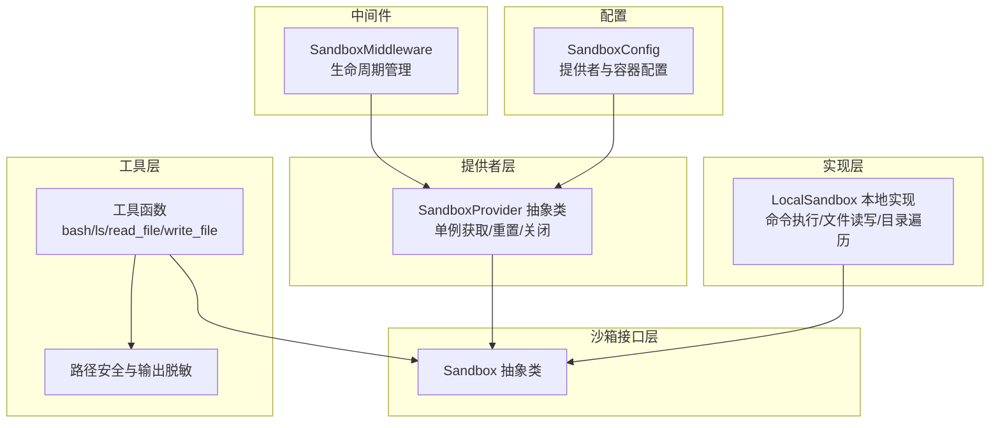
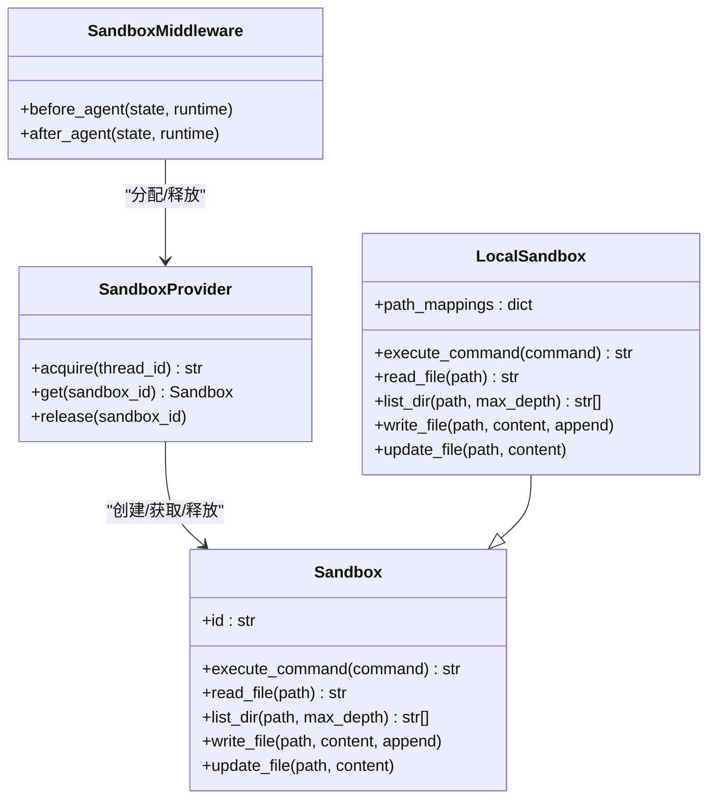
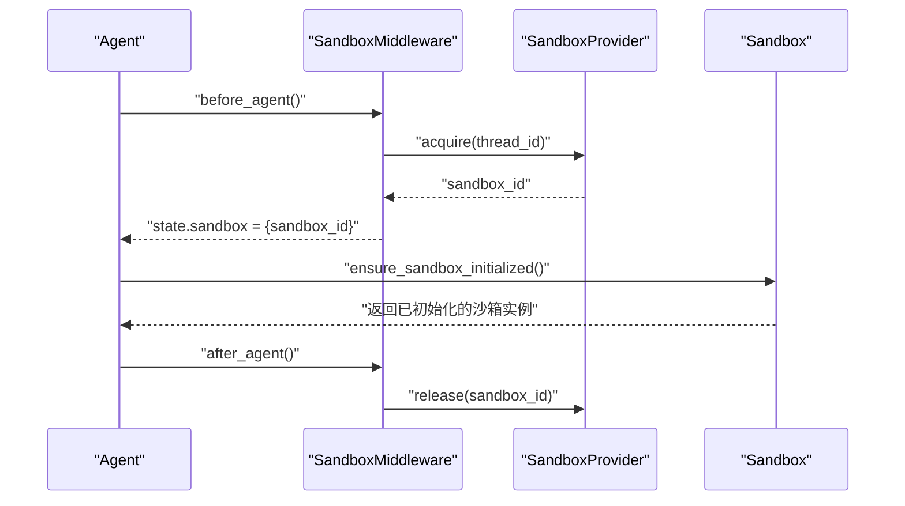
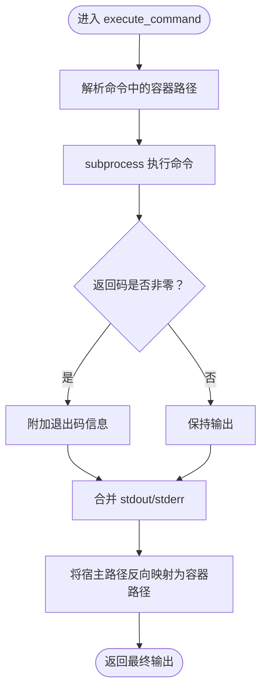
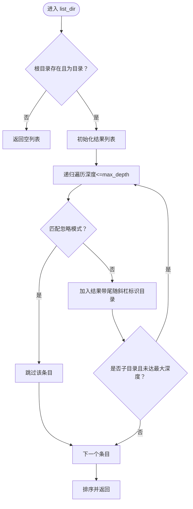
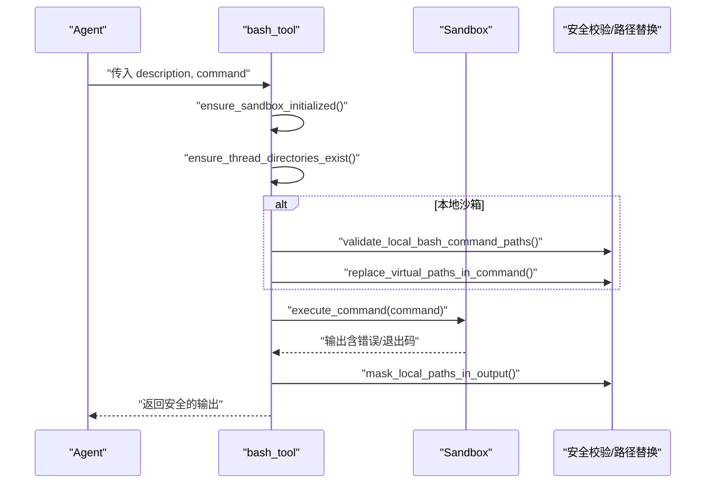
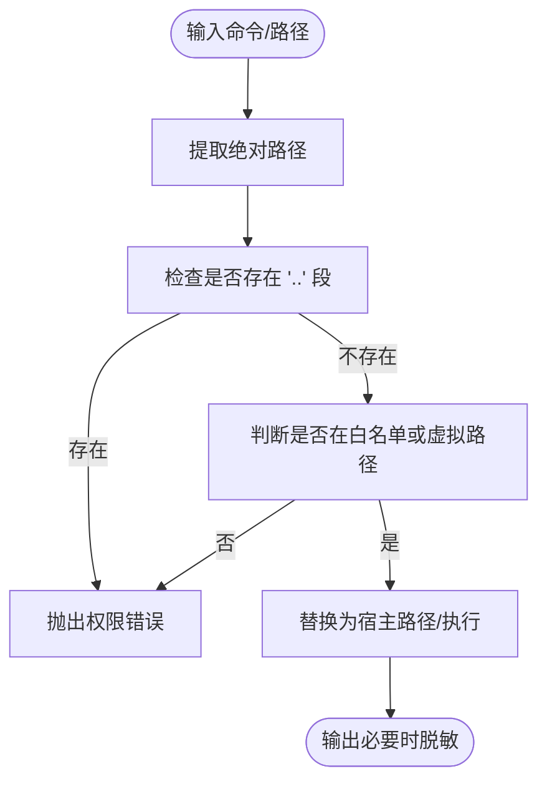
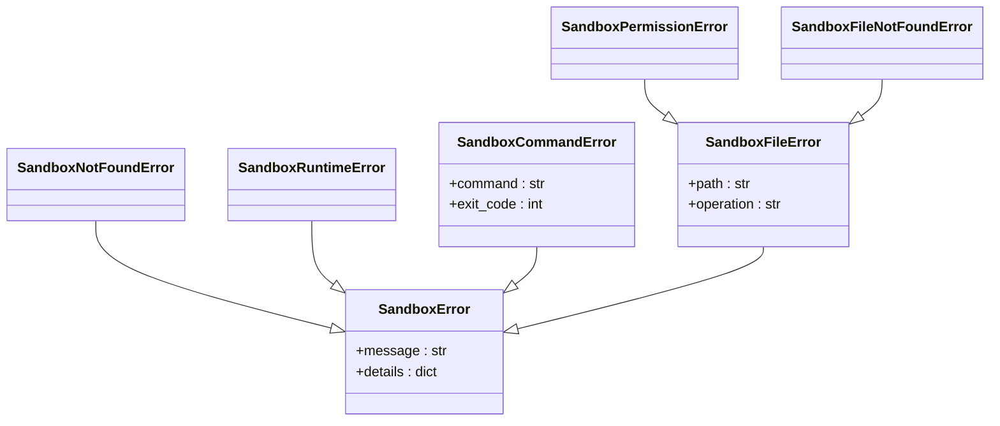
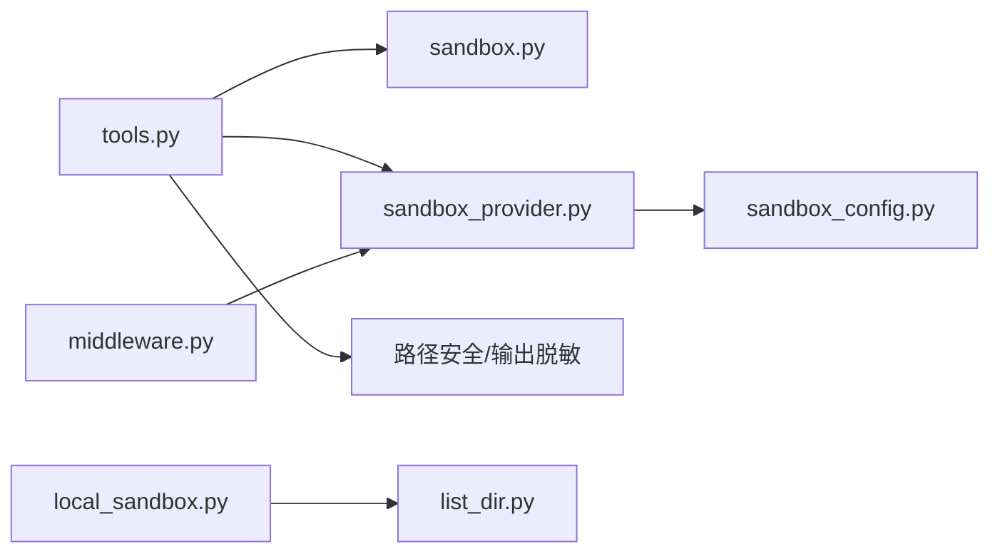

# 沙箱工具集

<cite>
**本文引用的文件**
- [sandbox/__init__.py](file://backend/packages/harness/deerflow/sandbox/__init__.py)
- [sandbox/tools.py](file://backend/packages/harness/deerflow/sandbox/tools.py)
- [sandbox/sandbox.py](file://backend/packages/harness/deerflow/sandbox/sandbox.py)
- [sandbox/sandbox_provider.py](file://backend/packages/harness/deerflow/sandbox/sandbox_provider.py)
- [sandbox/local/local_sandbox.py](file://backend/packages/harness/deerflow/sandbox/local/local_sandbox.py)
- [sandbox/local/list_dir.py](file://backend/packages/harness/deerflow/sandbox/local/list_dir.py)
- [sandbox/exceptions.py](file://backend/packages/harness/deerflow/sandbox/exceptions.py)
- [config/sandbox_config.py](file://backend/packages/harness/deerflow/config/sandbox_config.py)
- [sandbox/middleware.py](file://backend/packages/harness/deerflow/sandbox/middleware.py)
- [docs/ARCHITECTURE.md](file://backend/docs/ARCHITECTURE.md)
</cite>

## 目录
1. [简介](#简介)
2. [项目结构](#项目结构)
3. [核心组件](#核心组件)
4. [架构总览](#架构总览)
5. [详细组件分析](#详细组件分析)
6. [依赖关系分析](#依赖关系分析)
7. [性能考量](#性能考量)
8. [故障排查指南](#故障排查指南)
9. [结论](#结论)
10. [附录](#附录)

## 简介
本操作文档面向 DeerFlow 的沙箱工具集，聚焦于本地与容器化沙箱环境下的文件系统操作、进程执行与路径安全校验工具，以及与沙箱接口的集成与扩展方法。文档覆盖工具函数与辅助方法的参数、返回值、错误处理策略，并提供常见工具组合的使用示例与最佳实践，帮助开发者在保证安全的前提下高效使用沙箱能力。

## 项目结构
沙箱工具集位于后端 harness 包中，围绕抽象沙箱接口、提供者模式、本地沙箱实现、路径解析与安全校验、以及与 LangGraph 运行时的中间件集成展开。关键模块如下：
- 抽象接口层：Sandbox 抽象类定义统一能力
- 提供者层：SandboxProvider 抽象类及单例获取逻辑
- 本地实现：LocalSandbox 基于 subprocess 的本地执行与路径映射
- 工具层：bash、ls、read_file、write_file 等工具函数
- 安全与路径：虚拟路径替换、路径越权检测、输出脱敏
- 中间件：LangGraph Agent 生命周期内自动分配/释放沙箱
- 配置：SandboxConfig 描述沙箱提供者与容器挂载等配置项

**图表来源**
- [sandbox/sandbox.py:1-73](file://backend/packages/harness/deerflow/sandbox/sandbox.py#L1-L73)
- [sandbox/sandbox_provider.py:1-97](file://backend/packages/harness/deerflow/sandbox/sandbox_provider.py#L1-L97)
- [sandbox/local/local_sandbox.py:1-215](file://backend/packages/harness/deerflow/sandbox/local/local_sandbox.py#L1-L215)
- [sandbox/tools.py:1-880](file://backend/packages/harness/deerflow/sandbox/tools.py#L1-L880)
- [sandbox/middleware.py:1-84](file://backend/packages/harness/deerflow/sandbox/middleware.py#L1-L84)
- [config/sandbox_config.py:1-62](file://backend/packages/harness/deerflow/config/sandbox_config.py#L1-L62)

**章节来源**
- [sandbox/__init__.py:1-9](file://backend/packages/harness/deerflow/sandbox/__init__.py#L1-L9)
- [docs/ARCHITECTURE.md:147-180](file://backend/docs/ARCHITECTURE.md#L147-L180)

## 核心组件
- 抽象沙箱接口 Sandbox：定义 execute_command、read_file、list_dir、write_file、update_file 等能力，约束实现一致性
- 沙箱提供者 SandboxProvider：负责 acquire/get/release 沙箱实例，支持单例缓存与优雅关闭
- 本地沙箱 LocalSandbox：基于 subprocess 执行命令，支持路径映射与输出反向映射，隐藏宿主路径细节
- 工具函数：bash、ls、read_file、write_file 四大常用工具，内置路径安全校验与输出脱敏
- 路径与安全：虚拟路径替换、绝对路径白名单、路径越权检测、输出中宿主路径脱敏
- 中间件：SandboxMiddleware 在 Agent 生命周期内按需分配/释放沙箱，避免重复创建
- 配置：SandboxConfig 描述提供者类、镜像、端口、副本数、挂载卷与环境变量等

**章节来源**
- [sandbox/sandbox.py:1-73](file://backend/packages/harness/deerflow/sandbox/sandbox.py#L1-L73)
- [sandbox/sandbox_provider.py:1-97](file://backend/packages/harness/deerflow/sandbox/sandbox_provider.py#L1-L97)
- [sandbox/local/local_sandbox.py:1-215](file://backend/packages/harness/deerflow/sandbox/local/local_sandbox.py#L1-L215)
- [sandbox/tools.py:1-880](file://backend/packages/harness/deerflow/sandbox/tools.py#L1-L880)
- [sandbox/middleware.py:1-84](file://backend/packages/harness/deerflow/sandbox/middleware.py#L1-L84)
- [config/sandbox_config.py:1-62](file://backend/packages/harness/deerflow/config/sandbox_config.py#L1-L62)

## 架构总览
下图展示沙箱工具集的整体架构与交互关系，涵盖抽象接口、提供者、实现、工具与中间件之间的调用链路。

**图表来源**
- [sandbox/sandbox.py:1-73](file://backend/packages/harness/deerflow/sandbox/sandbox.py#L1-L73)
- [sandbox/sandbox_provider.py:1-97](file://backend/packages/harness/deerflow/sandbox/sandbox_provider.py#L1-L97)
- [sandbox/local/local_sandbox.py:1-215](file://backend/packages/harness/deerflow/sandbox/local/local_sandbox.py#L1-L215)
- [sandbox/middleware.py:1-84](file://backend/packages/harness/deerflow/sandbox/middleware.py#L1-L84)

## 详细组件分析

### 抽象接口与提供者
- Sandbox 抽象类定义统一能力，确保不同实现（本地/容器）对外一致
- SandboxProvider 抽象类提供 acquire/get/release 三元组；get_sandbox_provider 支持单例缓存、重置与优雅关闭
- 通过配置解析具体提供者类，便于切换实现（如本地开发与生产容器）

**图表来源**
- [sandbox/middleware.py:45-83](file://backend/packages/harness/deerflow/sandbox/middleware.py#L45-L83)
- [sandbox/sandbox_provider.py:42-97](file://backend/packages/harness/deerflow/sandbox/sandbox_provider.py#L42-L97)
- [sandbox/tools.py:592-644](file://backend/packages/harness/deerflow/sandbox/tools.py#L592-L644)

**章节来源**
- [sandbox/sandbox.py:1-73](file://backend/packages/harness/deerflow/sandbox/sandbox.py#L1-L73)
- [sandbox/sandbox_provider.py:1-97](file://backend/packages/harness/deerflow/sandbox/sandbox_provider.py#L1-L97)
- [sandbox/middleware.py:1-84](file://backend/packages/harness/deerflow/sandbox/middleware.py#L1-L84)

### 本地沙箱实现与路径映射
- LocalSandbox 支持可选的路径映射表，将容器内路径（如 /mnt/skills、/mnt/user-data）映射到宿主机实际路径
- 命令执行前对命令字符串中的容器路径进行解析，执行后将输出中的宿主路径反向映射回容器路径，避免泄露宿主细节
- 文件读写/更新均先解析目标路径，异常时以原始路径抛出，提升可观测性

**图表来源**
- [sandbox/local/local_sandbox.py:154-174](file://backend/packages/harness/deerflow/sandbox/local/local_sandbox.py#L154-L174)
- [sandbox/local/local_sandbox.py:106-136](file://backend/packages/harness/deerflow/sandbox/local/local_sandbox.py#L106-L136)
- [sandbox/local/local_sandbox.py:70-104](file://backend/packages/harness/deerflow/sandbox/local/local_sandbox.py#L70-L104)

**章节来源**
- [sandbox/local/local_sandbox.py:1-215](file://backend/packages/harness/deerflow/sandbox/local/local_sandbox.py#L1-L215)

### 目录遍历与忽略规则
- list_dir 实现递归遍历，支持最大深度控制，默认 2 层
- 内置大量忽略模式（版本控制、依赖、构建产物、IDE/OS 生成文件、日志与缓存等），减少噪声并提高性能

**图表来源**
- [sandbox/local/list_dir.py:72-113](file://backend/packages/harness/deerflow/sandbox/local/list_dir.py#L72-L113)

**章节来源**
- [sandbox/local/list_dir.py:1-113](file://backend/packages/harness/deerflow/sandbox/local/list_dir.py#L1-L113)

### 工具函数与安全校验
- bash_tool：在 Linux 环境执行 bash 命令，本地模式下会进行路径安全校验与虚拟路径替换，并对输出进行脱敏
- ls_tool：列出目录内容（最多 2 层树形），本地模式下严格校验路径来源与越权访问
- read_file_tool：读取文本文件，支持行号范围切片；本地模式下校验路径来源
- write_file_tool：写入文本文件，支持追加；本地模式下校验仅允许用户数据路径

**图表来源**
- [sandbox/tools.py:684-713](file://backend/packages/harness/deerflow/sandbox/tools.py#L684-L713)
- [sandbox/tools.py:453-491](file://backend/packages/harness/deerflow/sandbox/tools.py#L453-L491)
- [sandbox/tools.py:493-536](file://backend/packages/harness/deerflow/sandbox/tools.py#L493-L536)
- [sandbox/tools.py:287-356](file://backend/packages/harness/deerflow/sandbox/tools.py#L287-L356)

**章节来源**
- [sandbox/tools.py:684-880](file://backend/packages/harness/deerflow/sandbox/tools.py#L684-L880)

### 路径安全与输出脱敏
- 虚拟路径替换：将 /mnt/user-data、/mnt/skills、/mnt/acp-workspace 等虚拟路径替换为实际宿主路径
- 绝对路径白名单：允许系统路径前缀（如 /bin、/dev）与虚拟路径，拒绝其他绝对路径
- 路径越权检测：禁止 .. 路径段与越界访问
- 输出脱敏：在本地沙箱模式下，将宿主绝对路径还原为虚拟路径，避免泄露宿主文件系统布局

**图表来源**
- [sandbox/tools.py:453-491](file://backend/packages/harness/deerflow/sandbox/tools.py#L453-L491)
- [sandbox/tools.py:359-412](file://backend/packages/harness/deerflow/sandbox/tools.py#L359-L412)
- [sandbox/tools.py:287-356](file://backend/packages/harness/deerflow/sandbox/tools.py#L287-L356)

**章节来源**
- [sandbox/tools.py:17-28](file://backend/packages/harness/deerflow/sandbox/tools.py#L17-L28)
- [sandbox/tools.py:359-412](file://backend/packages/harness/deerflow/sandbox/tools.py#L359-L412)
- [sandbox/tools.py:287-356](file://backend/packages/harness/deerflow/sandbox/tools.py#L287-L356)

### 异常体系
- SandboxError：所有沙箱相关异常的基类，支持结构化 details
- SandboxNotFoundError：沙箱未找到或不可用
- SandboxRuntimeError：运行时状态缺失或配置错误
- SandboxCommandError：命令执行失败，携带命令与退出码
- SandboxFileError：文件操作失败，携带路径与操作类型
- SandboxPermissionError：权限错误
- SandboxFileNotFoundError：文件/目录不存在

**图表来源**
- [sandbox/exceptions.py:4-72](file://backend/packages/harness/deerflow/sandbox/exceptions.py#L4-L72)

**章节来源**
- [sandbox/exceptions.py:1-72](file://backend/packages/harness/deerflow/sandbox/exceptions.py#L1-L72)

### 配置与扩展
- SandboxConfig：描述沙箱提供者类、镜像、端口、副本数、挂载卷与环境变量等
- 可通过配置解析具体提供者类，实现本地/容器化沙箱的无缝切换
- 提供者支持自定义注入与重置，便于测试与动态切换

**章节来源**
- [config/sandbox_config.py:1-62](file://backend/packages/harness/deerflow/config/sandbox_config.py#L1-L62)
- [sandbox/sandbox_provider.py:42-97](file://backend/packages/harness/deerflow/sandbox/sandbox_provider.py#L42-L97)

## 依赖关系分析
- 工具函数依赖抽象接口 Sandbox 与提供者 SandboxProvider，确保跨实现的一致行为
- 本地沙箱实现依赖 list_dir 的目录遍历能力，并通过路径映射与反向映射保障安全性与可读性
- 中间件在 Agent 生命周期内协调沙箱分配与释放，避免频繁创建销毁带来的开销
- 配置通过解析器加载具体提供者类，形成松耦合的扩展点

**图表来源**
- [sandbox/tools.py:1-880](file://backend/packages/harness/deerflow/sandbox/tools.py#L1-L880)
- [sandbox/sandbox.py:1-73](file://backend/packages/harness/deerflow/sandbox/sandbox.py#L1-L73)
- [sandbox/sandbox_provider.py:1-97](file://backend/packages/harness/deerflow/sandbox/sandbox_provider.py#L1-L97)
- [sandbox/local/local_sandbox.py:1-215](file://backend/packages/harness/deerflow/sandbox/local/local_sandbox.py#L1-L215)
- [sandbox/local/list_dir.py:1-113](file://backend/packages/harness/deerflow/sandbox/local/list_dir.py#L1-L113)
- [sandbox/middleware.py:1-84](file://backend/packages/harness/deerflow/sandbox/middleware.py#L1-L84)
- [config/sandbox_config.py:1-62](file://backend/packages/harness/deerflow/config/sandbox_config.py#L1-L62)

**章节来源**
- [sandbox/tools.py:1-880](file://backend/packages/harness/deerflow/sandbox/tools.py#L1-L880)
- [sandbox/middleware.py:1-84](file://backend/packages/harness/deerflow/sandbox/middleware.py#L1-L84)

## 性能考量
- 目录遍历默认最大深度为 2，可有效降低 IO 开销；忽略模式过滤大量无关文件，减少遍历与输出体积
- 本地沙箱命令执行设置超时上限，避免长时间阻塞；输出合并 stdout/stderr 并在非零退出码时附加退出码，便于快速定位问题
- 中间件采用惰性初始化策略，首次工具调用才获取沙箱，减少 Agent 首次启动开销；同一线程内复用沙箱，避免反复创建销毁
- 提供者支持副本上限与空闲超时，容器化场景下可按需回收资源

[本节为通用性能建议，不直接分析特定文件]

## 故障排查指南
- 常见错误类型与定位
  - 权限错误：多由路径越权或写入受限触发，检查路径来源与只读策略
  - 文件未找到：确认虚拟路径映射与宿主路径存在性
  - 命令执行失败：查看退出码与标准错误输出，结合命令与上下文定位问题
  - 运行时状态缺失：确认 Agent 生命周期内已正确初始化沙箱
- 排查步骤
  - 检查虚拟路径是否被正确替换与越权检测
  - 核对宿主路径映射与目录存在性
  - 查看中间件是否正确分配/释放沙箱
  - 对照异常类型与 details 字段获取更详细信息

**章节来源**
- [sandbox/exceptions.py:4-72](file://backend/packages/harness/deerflow/sandbox/exceptions.py#L4-L72)
- [sandbox/tools.py:359-412](file://backend/packages/harness/deerflow/sandbox/tools.py#L359-L412)
- [sandbox/middleware.py:45-83](file://backend/packages/harness/deerflow/sandbox/middleware.py#L45-L83)

## 结论
DeerFlow 沙箱工具集通过抽象接口、提供者模式与本地/容器化实现，提供了统一、安全且高性能的文件系统与进程执行能力。工具层内置完善的路径安全校验与输出脱敏机制，配合中间件的生命周期管理，能够在保证安全的前提下显著提升开发与调试效率。通过配置化扩展点，团队可灵活选择本地开发或容器化生产环境，满足不同阶段的需求。

[本节为总结性内容，不直接分析特定文件]

## 附录

### 常用工具组合与最佳实践
- 列举并预览工作区：先使用 ls 工具查看 /mnt/user-data/workspace 下的结构，再结合 read_file 查看关键文件
- 安全执行脚本：在 bash_tool 中使用虚拟路径，避免硬编码宿主绝对路径；必要时通过 write_file 写入临时脚本，再执行
- 输出脱敏：本地沙箱模式下无需担心宿主路径泄露，但应避免在命令中显式输出敏感路径
- 目录清理：利用 list_dir 的忽略规则，快速定位日志/缓存等临时文件，必要时在工具中进行清理

[本节为概念性指导，不直接分析特定文件]