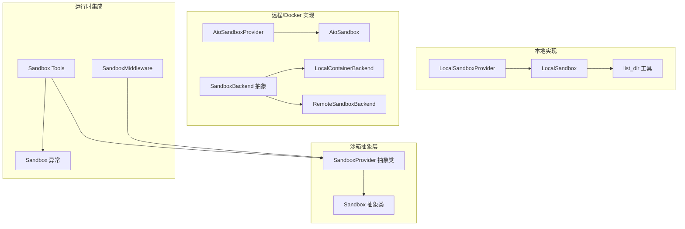
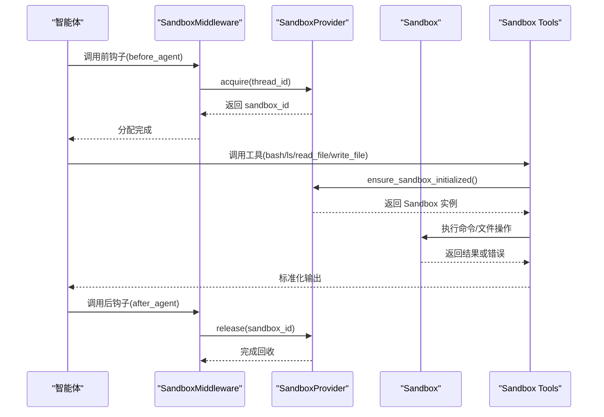
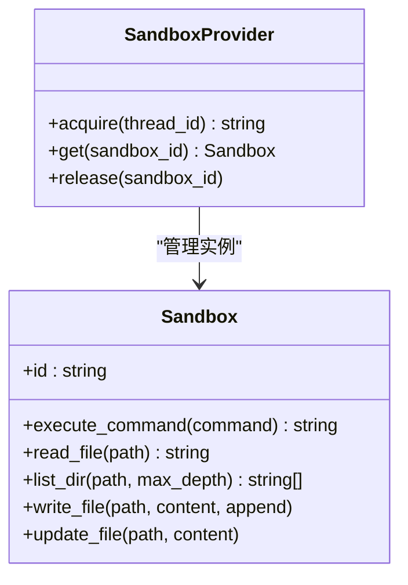
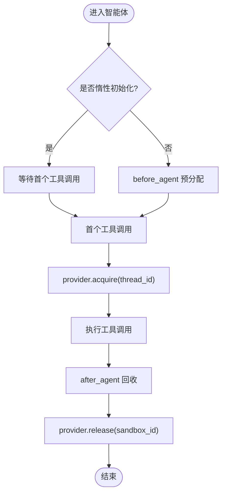
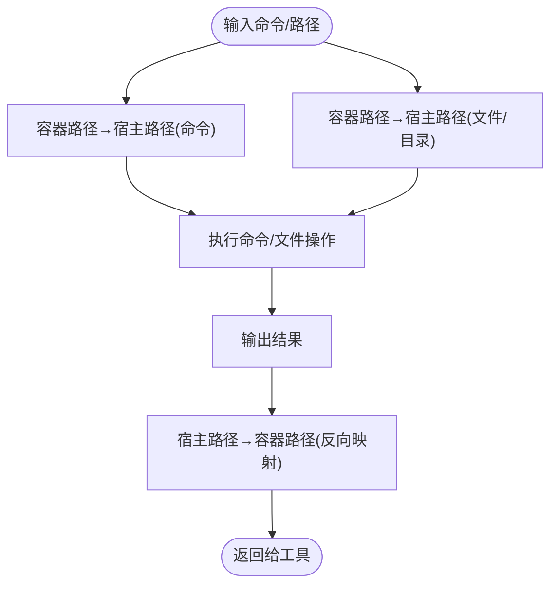
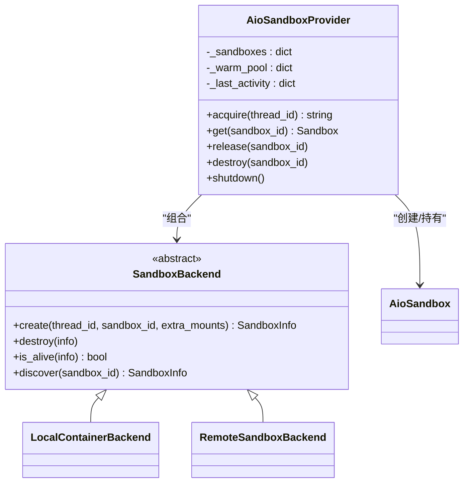
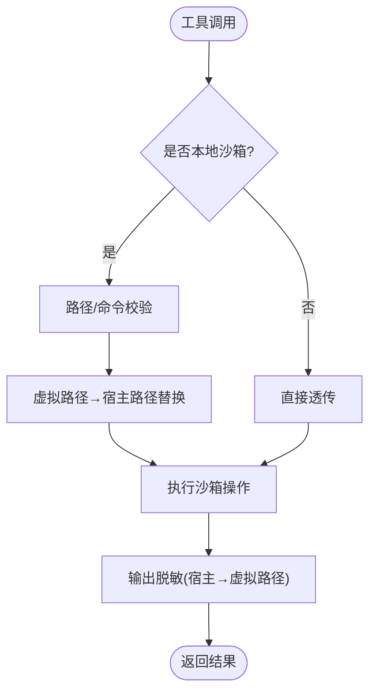
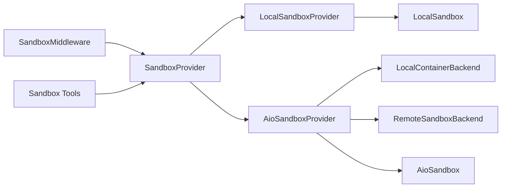

# 沙箱执行环境

<cite>
**本文引用的文件**
- [sandbox.py](file://backend/packages/harness/deerflow/sandbox/sandbox.py)
- [sandbox_provider.py](file://backend/packages/harness/deerflow/sandbox/sandbox_provider.py)
- [middleware.py](file://backend/packages/harness/deerflow/sandbox/middleware.py)
- [tools.py](file://backend/packages/harness/deerflow/sandbox/tools.py)
- [exceptions.py](file://backend/packages/harness/deerflow/sandbox/exceptions.py)
- [local_sandbox.py](file://backend/packages/harness/deerflow/sandbox/local/local_sandbox.py)
- [local_sandbox_provider.py](file://backend/packages/harness/deerflow/sandbox/local/local_sandbox_provider.py)
- [list_dir.py](file://backend/packages/harness/deerflow/sandbox/local/list_dir.py)
- [aio_sandbox.py](file://backend/packages/harness/deerflow/community/aio_sandbox/aio_sandbox.py)
- [aio_sandbox_provider.py](file://backend/packages/harness/deerflow/community/aio_sandbox/aio_sandbox_provider.py)
- [backend.py](file://backend/packages/harness/deerflow/community/aio_sandbox/backend.py)
- [remote_backend.py](file://backend/packages/harness/deerflow/community/aio_sandbox/remote_backend.py)
- [sandbox_config.py](file://backend/packages/harness/deerflow/config/sandbox_config.py)
- [app.py](file://docker/provisioner/app.py)
</cite>

## 目录
1. [简介](#简介)
2. [项目结构](#项目结构)
3. [核心组件](#核心组件)
4. [架构总览](#架构总览)
5. [详细组件分析](#详细组件分析)
6. [依赖分析](#依赖分析)
7. [性能考虑](#性能考虑)
8. [故障排除指南](#故障排除指南)
9. [结论](#结论)
10. [附录](#附录)

## 简介
本文件面向 DeerFlow 的沙箱执行环境，系统性阐述其架构设计、执行模式选择与安全隔离机制，覆盖本地沙箱、Docker 沙箱与 Kubernetes 沙箱的实现差异与适用场景。文档同时说明文件系统抽象、资源限制与安全策略，提供配置指南、性能优化建议与故障排除方法，并解释沙箱与智能体、工具系统的交互关系与数据传递机制。

## 项目结构
沙箱子系统主要位于后端 harness 包中，围绕统一的 Sandbox 抽象与可插拔的 SandboxProvider 展开，配合中间件在智能体生命周期内进行沙箱分配与回收；同时提供本地与远程（Docker/Kubernetes）两种后端实现，以及针对本地模式的路径映射与安全校验工具集。

**图表来源**
- [sandbox.py:4-73](file://backend/packages/harness/deerflow/sandbox/sandbox.py#L4-L73)
- [sandbox_provider.py:8-37](file://backend/packages/harness/deerflow/sandbox/sandbox_provider.py#L8-L37)
- [local_sandbox_provider.py:12-65](file://backend/packages/harness/deerflow/sandbox/local/local_sandbox_provider.py#L12-L65)
- [local_sandbox.py:10-215](file://backend/packages/harness/deerflow/sandbox/local/local_sandbox.py#L10-L215)
- [list_dir.py:72-113](file://backend/packages/harness/deerflow/sandbox/local/list_dir.py#L72-L113)
- [aio_sandbox_provider.py:45-613](file://backend/packages/harness/deerflow/community/aio_sandbox/aio_sandbox_provider.py#L45-L613)
- [aio_sandbox.py:11-129](file://backend/packages/harness/deerflow/community/aio_sandbox/aio_sandbox.py#L11-L129)
- [backend.py:38-99](file://backend/packages/harness/deerflow/community/aio_sandbox/backend.py#L38-L99)
- [middleware.py:21-84](file://backend/packages/harness/deerflow/sandbox/middleware.py#L21-L84)
- [tools.py:1-800](file://backend/packages/harness/deerflow/sandbox/tools.py#L1-L800)
- [exceptions.py:4-72](file://backend/packages/harness/deerflow/sandbox/exceptions.py#L4-L72)

**章节来源**
- [sandbox.py:1-73](file://backend/packages/harness/deerflow/sandbox/sandbox.py#L1-L73)
- [sandbox_provider.py:1-97](file://backend/packages/harness/deerflow/sandbox/sandbox_provider.py#L1-L97)
- [middleware.py:1-84](file://backend/packages/harness/deerflow/sandbox/middleware.py#L1-L84)
- [tools.py:1-800](file://backend/packages/harness/deerflow/sandbox/tools.py#L1-L800)
- [exceptions.py:1-72](file://backend/packages/harness/deerflow/sandbox/exceptions.py#L1-L72)
- [local_sandbox.py:1-215](file://backend/packages/harness/deerflow/sandbox/local/local_sandbox.py#L1-L215)
- [local_sandbox_provider.py:1-65](file://backend/packages/harness/deerflow/sandbox/local/local_sandbox_provider.py#L1-L65)
- [list_dir.py:1-113](file://backend/packages/harness/deerflow/sandbox/local/list_dir.py#L1-L113)
- [aio_sandbox.py:1-129](file://backend/packages/harness/deerflow/community/aio_sandbox/aio_sandbox.py#L1-L129)
- [aio_sandbox_provider.py:1-613](file://backend/packages/harness/deerflow/community/aio_sandbox/aio_sandbox_provider.py#L1-L613)
- [backend.py:1-99](file://backend/packages/harness/deerflow/community/aio_sandbox/backend.py#L1-L99)
- [remote_backend.py:66-87](file://backend/packages/harness/deerflow/community/aio_sandbox/remote_backend.py#L66-L87)
- [sandbox_config.py:1-62](file://backend/packages/harness/deerflow/config/sandbox_config.py#L1-L62)
- [app.py:1-16](file://docker/provisioner/app.py#L1-L16)

## 核心组件
- 抽象接口
  - Sandbox：定义命令执行、文件读写、目录列举等能力，屏蔽具体后端差异。
  - SandboxProvider：定义 acquire/get/release 生命周期管理，支持懒加载与跨进程发现。
- 运行时中间件
  - SandboxMiddleware：在智能体调用前后自动分配/释放沙箱，支持惰性初始化与线程复用。
- 工具与安全
  - Sandbox Tools：封装 bash/ls/read_file/write_file 等工具，内置路径校验、输出脱敏与错误标准化。
  - 安全策略：虚拟路径映射、只读挂载、路径穿越防护、系统路径白名单。
- 后端实现
  - 本地：LocalSandboxProvider + LocalSandbox（单例/共享），路径映射与忽略列表过滤。
  - 远程/Docker：AioSandboxProvider + AioSandbox，支持本地容器与远端 K8s 动态编排。
- 配置模型
  - SandboxConfig：集中定义沙箱提供者类路径、镜像、端口、副本数、空闲超时、挂载与环境变量等。

**章节来源**
- [sandbox.py:4-73](file://backend/packages/harness/deerflow/sandbox/sandbox.py#L4-L73)
- [sandbox_provider.py:8-37](file://backend/packages/harness/deerflow/sandbox/sandbox_provider.py#L8-L37)
- [middleware.py:21-84](file://backend/packages/harness/deerflow/sandbox/middleware.py#L21-L84)
- [tools.py:31-800](file://backend/packages/harness/deerflow/sandbox/tools.py#L31-L800)
- [local_sandbox_provider.py:12-65](file://backend/packages/harness/deerflow/sandbox/local/local_sandbox_provider.py#L12-L65)
- [local_sandbox.py:10-215](file://backend/packages/harness/deerflow/sandbox/local/local_sandbox.py#L10-L215)
- [aio_sandbox_provider.py:45-613](file://backend/packages/harness/deerflow/community/aio_sandbox/aio_sandbox_provider.py#L45-L613)
- [aio_sandbox.py:11-129](file://backend/packages/harness/deerflow/community/aio_sandbox/aio_sandbox.py#L11-L129)
- [sandbox_config.py:12-62](file://backend/packages/harness/deerflow/config/sandbox_config.py#L12-L62)

## 架构总览
下图展示从智能体到沙箱的完整调用链路与多后端选择：

**图表来源**
- [middleware.py:51-84](file://backend/packages/harness/deerflow/sandbox/middleware.py#L51-L84)
- [tools.py:592-644](file://backend/packages/harness/deerflow/sandbox/tools.py#L592-L644)
- [sandbox_provider.py:42-56](file://backend/packages/harness/deerflow/sandbox/sandbox_provider.py#L42-L56)

## 详细组件分析

### 抽象层：Sandbox 与 SandboxProvider
- Sandbox 抽象了命令执行、文件读写、目录列举等通用能力，确保上层工具与智能体无需关心底层实现。
- SandboxProvider 提供统一的生命周期管理：acquire/get/release，并通过全局单例与延迟初始化减少开销。

**图表来源**
- [sandbox.py:4-73](file://backend/packages/harness/deerflow/sandbox/sandbox.py#L4-L73)
- [sandbox_provider.py:8-37](file://backend/packages/harness/deerflow/sandbox/sandbox_provider.py#L8-L37)

**章节来源**
- [sandbox.py:1-73](file://backend/packages/harness/deerflow/sandbox/sandbox.py#L1-L73)
- [sandbox_provider.py:1-97](file://backend/packages/harness/deerflow/sandbox/sandbox_provider.py#L1-L97)

### 中间件：生命周期与线程复用
- 支持惰性初始化（lazy_init=True，默认）以降低首次调用成本；也可在 before_agent 阶段预分配。
- 在 after_agent 阶段释放沙箱，避免频繁重建；同一 thread_id 下跨轮次复用，提升吞吐。

**图表来源**
- [middleware.py:21-84](file://backend/packages/harness/deerflow/sandbox/middleware.py#L21-L84)

**章节来源**
- [middleware.py:1-84](file://backend/packages/harness/deerflow/sandbox/middleware.py#L1-L84)

### 本地沙箱：路径映射与安全
- LocalSandboxProvider 使用单例模式，按配置建立容器路径到宿主路径的映射，优先挂载 skills 目录。
- LocalSandbox 将容器内路径解析为宿主路径执行命令与文件操作，执行后将宿主绝对路径反向映射回容器路径，避免泄露内部布局。
- list_dir 提供深度受限的目录遍历并忽略常见构建/缓存/日志等目录，兼顾性能与安全性。

**图表来源**
- [local_sandbox.py:106-174](file://backend/packages/harness/deerflow/sandbox/local/local_sandbox.py#L106-L174)
- [list_dir.py:72-113](file://backend/packages/harness/deerflow/sandbox/local/list_dir.py#L72-L113)

**章节来源**
- [local_sandbox_provider.py:12-65](file://backend/packages/harness/deerflow/sandbox/local/local_sandbox_provider.py#L12-L65)
- [local_sandbox.py:1-215](file://backend/packages/harness/deerflow/sandbox/local/local_sandbox.py#L1-L215)
- [list_dir.py:1-113](file://backend/packages/harness/deerflow/sandbox/local/list_dir.py#L1-L113)

### 远程/Docker 沙箱：动态编排与热池
- AioSandboxProvider 组合 SandboxBackend（本地容器或远程 K8s），支持确定性 sandbox_id 生成、线程级缓存、空闲清理与信号优雅退出。
- 热池（warm pool）保留已释放但仍在运行的容器，避免冷启动；副本上限软控制，活跃容器不强制终止。
- 支持额外挂载（线程工作区、上传、输出、只读技能与 ACP 工作区），并按需解析环境变量。

**图表来源**
- [aio_sandbox_provider.py:45-613](file://backend/packages/harness/deerflow/community/aio_sandbox/aio_sandbox_provider.py#L45-L613)
- [backend.py:38-99](file://backend/packages/harness/deerflow/community/aio_sandbox/backend.py#L38-L99)
- [aio_sandbox.py:11-129](file://backend/packages/harness/deerflow/community/aio_sandbox/aio_sandbox.py#L11-L129)
- [remote_backend.py:66-87](file://backend/packages/harness/deerflow/community/aio_sandbox/remote_backend.py#L66-L87)

**章节来源**
- [aio_sandbox_provider.py:1-613](file://backend/packages/harness/deerflow/community/aio_sandbox/aio_sandbox_provider.py#L1-L613)
- [backend.py:1-99](file://backend/packages/harness/deerflow/community/aio_sandbox/backend.py#L1-L99)
- [aio_sandbox.py:1-129](file://backend/packages/harness/deerflow/community/aio_sandbox/aio_sandbox.py#L1-L129)
- [remote_backend.py:66-87](file://backend/packages/harness/deerflow/community/aio_sandbox/remote_backend.py#L66-L87)

### 工具与安全：路径校验与输出脱敏
- 路径校验：仅允许 /mnt/user-data、/mnt/skills（只读）、/mnt/acp-workspace（只读）三类虚拟路径；禁止路径穿越与系统敏感路径滥用。
- 命令安全：对本地模式下的绝对路径进行白名单与虚拟路径替换，确保命令使用受控路径。
- 输出脱敏：将宿主绝对路径反向映射为虚拟路径，避免泄露主机目录结构。
- 错误标准化：统一抛出结构化异常，便于上层捕获与提示。

**图表来源**
- [tools.py:368-537](file://backend/packages/harness/deerflow/sandbox/tools.py#L368-L537)
- [tools.py:287-357](file://backend/packages/harness/deerflow/sandbox/tools.py#L287-L357)

**章节来源**
- [tools.py:1-800](file://backend/packages/harness/deerflow/sandbox/tools.py#L1-L800)
- [exceptions.py:1-72](file://backend/packages/harness/deerflow/sandbox/exceptions.py#L1-L72)

### 配置模型：集中式参数与默认值
- SandboxConfig 提供统一的配置入口，包含提供者类路径、镜像、端口、副本数、空闲超时、挂载与环境变量等。
- 默认镜像、端口、容器前缀、空闲超时与副本数均有合理缺省，便于快速部署。

**章节来源**
- [sandbox_config.py:12-62](file://backend/packages/harness/deerflow/config/sandbox_config.py#L12-L62)

### Kubernetes 沙箱：动态编排与访问
- 远程后端通过 provisioner 动态创建/销毁 Pod 与 NodePort Service，后端通过 {NODE_HOST}:{NodePort} 访问沙箱。
- provisioner 提供健康检查与沙箱状态查询，支持跨进程发现与恢复。

**章节来源**
- [remote_backend.py:66-87](file://backend/packages/harness/deerflow/community/aio_sandbox/remote_backend.py#L66-L87)
- [app.py:1-16](file://docker/provisioner/app.py#L1-L16)

## 依赖分析
- 松耦合接口：Sandbox/SandboxProvider 抽象屏蔽后端差异，工具与中间件仅依赖抽象。
- 可插拔后端：AioSandboxProvider 可在本地容器与远程 K8s 之间切换，无需修改上层逻辑。
- 线程安全：提供者内部使用锁与文件锁保证并发一致性，热池与空闲清理线程独立运行。
- 资源隔离：Docker/K8s 后端天然具备容器级隔离；本地模式通过路径映射与只读挂载强化边界。

**图表来源**
- [middleware.py:21-84](file://backend/packages/harness/deerflow/sandbox/middleware.py#L21-L84)
- [tools.py:592-644](file://backend/packages/harness/deerflow/sandbox/tools.py#L592-L644)
- [sandbox_provider.py:42-56](file://backend/packages/harness/deerflow/sandbox/sandbox_provider.py#L42-L56)
- [aio_sandbox_provider.py:98-119](file://backend/packages/harness/deerflow/community/aio_sandbox/aio_sandbox_provider.py#L98-L119)
- [local_sandbox_provider.py:12-65](file://backend/packages/harness/deerflow/sandbox/local/local_sandbox_provider.py#L12-L65)

**章节来源**
- [middleware.py:1-84](file://backend/packages/harness/deerflow/sandbox/middleware.py#L1-L84)
- [tools.py:1-800](file://backend/packages/harness/deerflow/sandbox/tools.py#L1-L800)
- [sandbox_provider.py:1-97](file://backend/packages/harness/deerflow/sandbox/sandbox_provider.py#L1-L97)
- [aio_sandbox_provider.py:1-613](file://backend/packages/harness/deerflow/community/aio_sandbox/aio_sandbox_provider.py#L1-L613)
- [local_sandbox_provider.py:1-65](file://backend/packages/harness/deerflow/sandbox/local/local_sandbox_provider.py#L1-L65)

## 性能考虑
- 惰性初始化：默认惰性初始化，减少空闲线程的资源占用。
- 线程复用：同一 thread_id 多轮次复用同一沙箱，避免冷启动。
- 热池回收：释放后的容器保活，快速回收，显著降低重复创建开销。
- 副本上限与空闲清理：通过 replicas 与 idle_timeout 控制资源占用，防止资源泄漏。
- 目录遍历优化：本地模式限制遍历深度并忽略常见噪声目录，降低 I/O 开销。
- 超时与健康检查：容器就绪与健康检查避免无效等待，提升可用性。

[本节为通用性能建议，不直接分析具体文件]

## 故障排除指南
- 常见异常类型
  - SandboxNotFoundError：沙箱未找到或不可用。
  - SandboxRuntimeError：运行时缺失或配置错误。
  - SandboxCommandError：命令执行失败，携带命令与退出码。
  - SandboxFileError/SandboxPermissionError：文件操作失败或权限不足。
- 排查步骤
  - 检查 provider 单例与配置类路径是否正确解析。
  - 对于 Docker/K8s 模式，确认容器/服务健康与端口可达。
  - 对于本地模式，确认路径映射与只读挂载是否生效，输出是否被脱敏。
  - 查看中间件 before_agent/after_agent 是否正常触发，避免沙箱泄漏。
- 建议
  - 在开发阶段启用更详细的日志级别，定位路径解析与挂载问题。
  - 对于 K8s 模式，检查 provisioner 的健康与沙箱状态接口响应。

**章节来源**
- [exceptions.py:4-72](file://backend/packages/harness/deerflow/sandbox/exceptions.py#L4-L72)
- [middleware.py:67-84](file://backend/packages/harness/deerflow/sandbox/middleware.py#L67-L84)
- [tools.py:564-589](file://backend/packages/harness/deerflow/sandbox/tools.py#L564-L589)

## 结论
DeerFlow 沙箱体系通过抽象接口与可插拔后端实现了“一处编写、多处运行”的灵活性；本地与远程模式分别满足开发与生产场景的安全与隔离需求。配合路径安全、输出脱敏与热池回收等机制，系统在易用性、安全性与性能之间取得良好平衡。建议根据部署环境选择合适的后端，并结合副本与空闲超时策略进行容量规划。

[本节为总结性内容，不直接分析具体文件]

## 附录

### 沙箱与智能体、工具系统的交互关系
- 智能体通过中间件在调用前后自动获取/释放沙箱，工具在运行时惰性初始化并复用。
- 工具层负责路径校验、命令替换与输出脱敏，确保行为可控且信息最小化暴露。

**章节来源**
- [middleware.py:21-84](file://backend/packages/harness/deerflow/sandbox/middleware.py#L21-L84)
- [tools.py:592-644](file://backend/packages/harness/deerflow/sandbox/tools.py#L592-L644)

### 配置示例要点
- 指定提供者类路径（如本地/远程实现）。
- 设置镜像、端口、容器前缀、副本数与空闲超时。
- 配置挂载（线程工作区、上传、输出、技能目录）与环境变量（支持 $VAR 形式解析）。

**章节来源**
- [sandbox_config.py:12-62](file://backend/packages/harness/deerflow/config/sandbox_config.py#L12-L62)