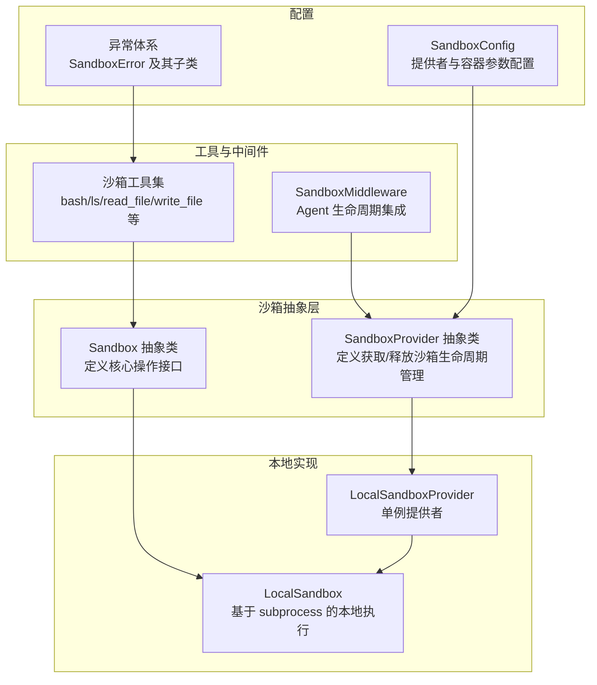
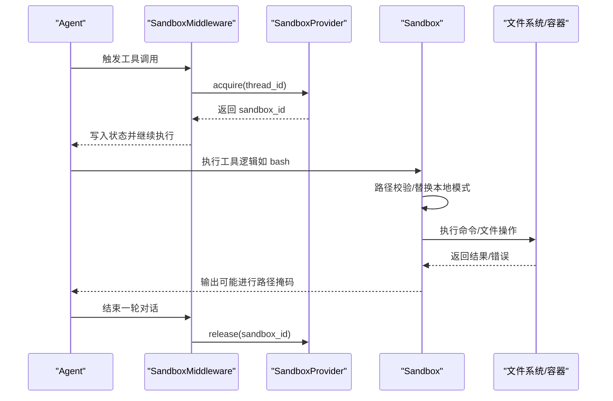
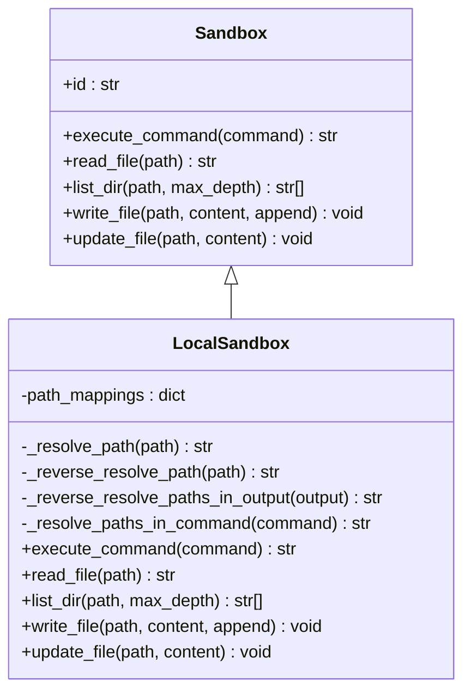
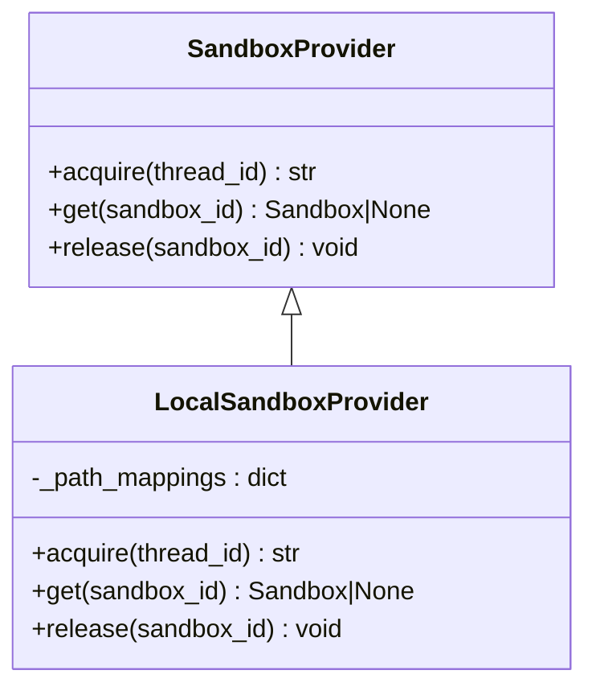
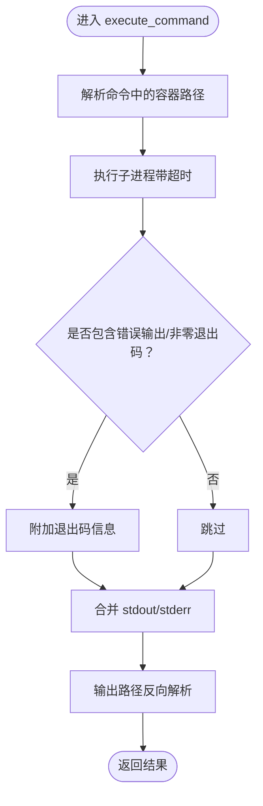
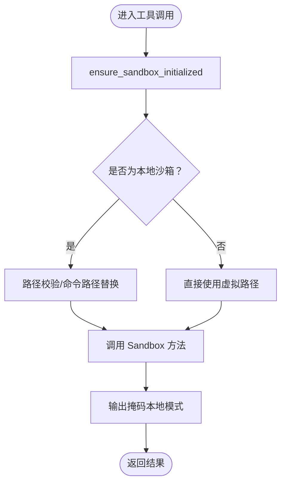
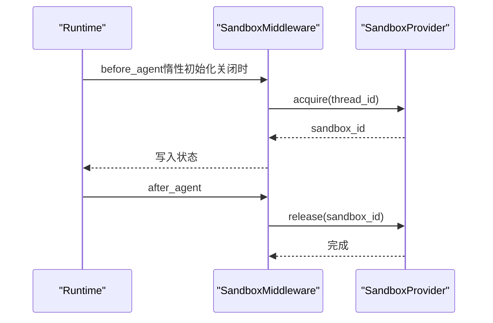
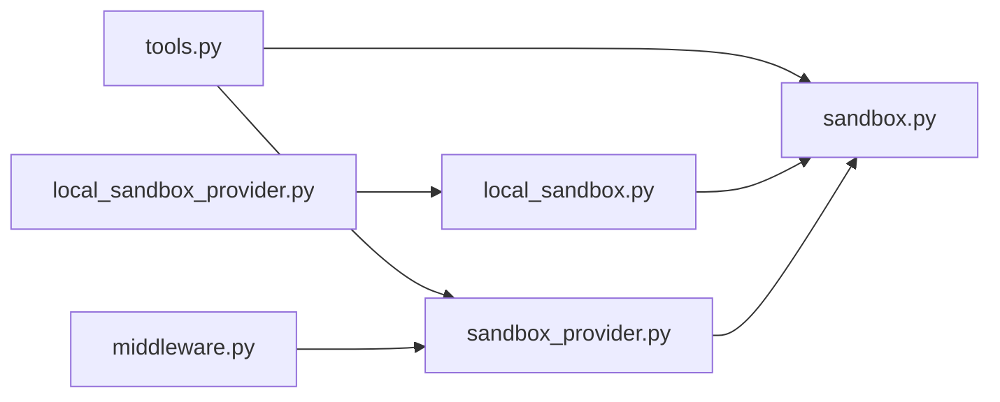

# 沙箱架构设计

<cite>
**本文引用的文件**
- [sandbox.py](file://backend/packages/harness/deerflow/sandbox/sandbox.py)
- [sandbox_provider.py](file://backend/packages/harness/deerflow/sandbox/sandbox_provider.py)
- [local_sandbox.py](file://backend/packages/harness/deerflow/sandbox/local/local_sandbox.py)
- [local_sandbox_provider.py](file://backend/packages/harness/deerflow/sandbox/local/local_sandbox_provider.py)
- [exceptions.py](file://backend/packages/harness/deerflow/sandbox/exceptions.py)
- [tools.py](file://backend/packages/harness/deerflow/sandbox/tools.py)
- [middleware.py](file://backend/packages/harness/deerflow/sandbox/middleware.py)
- [sandbox_config.py](file://backend/packages/harness/deerflow/config/sandbox_config.py)
</cite>

## 目录
1. [引言](#引言)
2. [项目结构](#项目结构)
3. [核心组件](#核心组件)
4. [架构总览](#架构总览)
5. [详细组件分析](#详细组件分析)
6. [依赖分析](#依赖分析)
7. [性能考虑](#性能考虑)
8. [故障排查指南](#故障排查指南)
9. [结论](#结论)
10. [附录](#附录)

## 引言
本文件系统化阐述 DeerFlow 的沙箱架构设计，重点围绕以下目标展开：
- 深入解释沙箱抽象基类的设计理念、接口定义与扩展机制
- 详解 Sandbox 抽象类的核心方法（execute_command、read_file、list_dir、write_file、update_file）的设计原则与实现要求
- 解释沙箱提供者模式的作用与实现方式
- 覆盖沙箱接口的版本兼容性、错误处理策略与性能考量
- 提供沙箱扩展的最佳实践与自定义实现指南

## 项目结构
沙箱相关代码集中在后端 harness 包下的 deerflow.sandbox 子包，包含抽象层、本地实现、工具集、中间件与配置等模块。整体采用“抽象接口 + 提供者 + 具体实现”的分层设计，便于在不同运行环境下切换沙箱后端（如本地或容器）。

**图表来源**
- [sandbox.py:4-73](file://backend/packages/harness/deerflow/sandbox/sandbox.py#L4-L73)
- [sandbox_provider.py:8-97](file://backend/packages/harness/deerflow/sandbox/sandbox_provider.py#L8-L97)
- [local_sandbox.py:10-215](file://backend/packages/harness/deerflow/sandbox/local/local_sandbox.py#L10-L215)
- [local_sandbox_provider.py:12-65](file://backend/packages/harness/deerflow/sandbox/local/local_sandbox_provider.py#L12-L65)
- [tools.py:684-880](file://backend/packages/harness/deerflow/sandbox/tools.py#L684-L880)
- [middleware.py:21-84](file://backend/packages/harness/deerflow/sandbox/middleware.py#L21-L84)
- [sandbox_config.py:12-62](file://backend/packages/harness/deerflow/config/sandbox_config.py#L12-L62)
- [exceptions.py:4-72](file://backend/packages/harness/deerflow/sandbox/exceptions.py#L4-L72)

**章节来源**
- [sandbox.py:1-73](file://backend/packages/harness/deerflow/sandbox/sandbox.py#L1-L73)
- [sandbox_provider.py:1-97](file://backend/packages/harness/deerflow/sandbox/sandbox_provider.py#L1-L97)
- [local_sandbox.py:1-215](file://backend/packages/harness/deerflow/sandbox/local/local_sandbox.py#L1-L215)
- [local_sandbox_provider.py:1-65](file://backend/packages/harness/deerflow/sandbox/local/local_sandbox_provider.py#L1-L65)
- [tools.py:1-880](file://backend/packages/harness/deerflow/sandbox/tools.py#L1-L880)
- [middleware.py:1-84](file://backend/packages/harness/deerflow/sandbox/middleware.py#L1-L84)
- [sandbox_config.py:1-62](file://backend/packages/harness/deerflow/config/sandbox_config.py#L1-L62)
- [exceptions.py:1-72](file://backend/packages/harness/deerflow/sandbox/exceptions.py#L1-L72)

## 核心组件
本节聚焦抽象接口与关键实现，阐明设计理念与职责边界。

- 抽象接口层
  - Sandbox：定义统一的沙箱能力模型，包括命令执行、文件读写与目录列举等。通过抽象方法约束具体实现，确保上层工具与中间件以一致方式调用。
  - SandboxProvider：定义沙箱生命周期管理接口（acquire/get/release），并提供全局单例获取与重置、关闭等辅助方法，支持按线程/会话复用沙箱实例。

- 本地实现层
  - LocalSandbox：基于本地进程执行命令，支持路径映射与输出路径反向解析，屏蔽宿主机真实路径暴露；对文件操作进行编码与权限控制。
  - LocalSandboxProvider：负责建立容器路径到宿主机路径的映射，维护单例沙箱实例，避免频繁创建销毁带来的性能损耗。

- 工具与中间件
  - 沙箱工具集：封装 bash、ls、read_file、write_file、字符串替换等常用操作，内置路径校验、虚拟路径替换与输出掩码，保障安全与可追溯性。
  - SandboxMiddleware：在 Agent 生命周期内按需获取/释放沙箱，支持惰性初始化与跨轮次复用，减少资源开销。

- 配置与异常
  - SandboxConfig：集中管理沙箱提供者类型与容器相关参数（镜像、端口、副本数、挂载卷、环境变量等），支持灵活扩展。
  - 异常体系：提供结构化的错误信息（含详情字段），便于上层捕获与展示。

**章节来源**
- [sandbox.py:4-73](file://backend/packages/harness/deerflow/sandbox/sandbox.py#L4-L73)
- [sandbox_provider.py:8-97](file://backend/packages/harness/deerflow/sandbox/sandbox_provider.py#L8-L97)
- [local_sandbox.py:10-215](file://backend/packages/harness/deerflow/sandbox/local/local_sandbox.py#L10-L215)
- [local_sandbox_provider.py:12-65](file://backend/packages/harness/deerflow/sandbox/local/local_sandbox_provider.py#L12-L65)
- [tools.py:684-880](file://backend/packages/harness/deerflow/sandbox/tools.py#L684-L880)
- [middleware.py:21-84](file://backend/packages/harness/deerflow/sandbox/middleware.py#L21-L84)
- [sandbox_config.py:12-62](file://backend/packages/harness/deerflow/config/sandbox_config.py#L12-L62)
- [exceptions.py:4-72](file://backend/packages/harness/deerflow/sandbox/exceptions.py#L4-L72)

## 架构总览
下图展示了从 Agent 到沙箱工具、再到具体沙箱实现的调用链路，以及路径解析与安全校验的关键节点。

**图表来源**
- [middleware.py:45-84](file://backend/packages/harness/deerflow/sandbox/middleware.py#L45-L84)
- [sandbox_provider.py:42-97](file://backend/packages/harness/deerflow/sandbox/sandbox_provider.py#L42-L97)
- [tools.py:684-713](file://backend/packages/harness/deerflow/sandbox/tools.py#L684-L713)
- [local_sandbox.py:154-174](file://backend/packages/harness/deerflow/sandbox/local/local_sandbox.py#L154-L174)

## 详细组件分析

### 抽象类 Sandbox 设计
- 设计理念
  - 以最小可用接口覆盖常见沙箱能力，保证上层工具无需关心底层实现差异。
  - 通过抽象方法强制实现一致性行为，降低耦合度与测试成本。
- 接口定义与设计原则
  - execute_command：面向 Linux 命令执行，返回标准输出/错误与退出码摘要，便于统一错误呈现。
  - read_file/list_dir：提供文本读取与目录枚举能力，list_dir 支持最大深度限制，兼顾安全性与性能。
  - write_file/update_file：分别处理文本与二进制内容写入，支持追加模式，满足多样工作负载。
- 实现要求
  - 对外保持幂等与可重复调用；对内部路径进行严格校验与转换，避免越权访问。
  - 在本地实现中，应屏蔽宿主机绝对路径，仅对外暴露虚拟路径，提升安全性与可移植性。

**图表来源**
- [sandbox.py:4-73](file://backend/packages/harness/deerflow/sandbox/sandbox.py#L4-L73)
- [local_sandbox.py:10-215](file://backend/packages/harness/deerflow/sandbox/local/local_sandbox.py#L10-L215)

**章节来源**
- [sandbox.py:16-72](file://backend/packages/harness/deerflow/sandbox/sandbox.py#L16-L72)
- [local_sandbox.py:106-215](file://backend/packages/harness/deerflow/sandbox/local/local_sandbox.py#L106-L215)

### 沙箱提供者模式
- 作用
  - 将“如何获取/释放沙箱”与“如何使用沙箱”解耦，支持按需切换实现（本地/容器/Docker 等）。
  - 通过全局单例与缓存机制，避免重复初始化带来的性能损耗。
- 实现要点
  - acquire：按线程/上下文获取可用沙箱 ID，并在需要时创建实例。
  - get：根据 ID 获取沙箱实例，若不存在则返回空值，便于上层容错。
  - release：释放资源，避免泄漏；对于长生命周期提供者（如本地单例），可延迟清理。
  - 辅助函数：get_sandbox_provider/reset_sandbox_provider/shutdown_sandbox_provider 提供生命周期管理与测试注入能力。

**图表来源**
- [sandbox_provider.py:8-97](file://backend/packages/harness/deerflow/sandbox/sandbox_provider.py#L8-L97)
- [local_sandbox_provider.py:12-65](file://backend/packages/harness/deerflow/sandbox/local/local_sandbox_provider.py#L12-L65)

**章节来源**
- [sandbox_provider.py:42-97](file://backend/packages/harness/deerflow/sandbox/sandbox_provider.py#L42-L97)
- [local_sandbox_provider.py:45-65](file://backend/packages/harness/deerflow/sandbox/local/local_sandbox_provider.py#L45-L65)

### 本地沙箱 LocalSandbox
- 路径映射与解析
  - 提供双向路径解析：容器路径 ↔ 宿主机路径，确保命令与文件操作在虚拟路径与真实路径之间正确转换。
  - 输出路径反向解析：将宿主机绝对路径还原为虚拟路径，避免泄露内部布局。
- 命令执行与超时
  - 使用 subprocess 执行命令，支持超时控制与错误码收集；对 stderr 与 exit code 进行统一汇总。
- 文件操作与错误处理
  - 文本与二进制写入均进行目录创建与模式选择；对 OS 错误进行包装，保留原始路径以便用户理解。

**图表来源**
- [local_sandbox.py:154-174](file://backend/packages/harness/deerflow/sandbox/local/local_sandbox.py#L154-L174)

**章节来源**
- [local_sandbox.py:23-104](file://backend/packages/harness/deerflow/sandbox/local/local_sandbox.py#L23-L104)
- [local_sandbox.py:154-215](file://backend/packages/harness/deerflow/sandbox/local/local_sandbox.py#L154-L215)

### 沙箱工具集与安全校验
- 虚拟路径与宿主机路径映射
  - 支持三类虚拟路径：用户数据（/mnt/user-data）、技能库（/mnt/skills）、ACP 工作区（/mnt/acp-workspace）。
  - 提供替换与验证逻辑，防止路径穿越与越权访问。
- 命令与文件工具
  - bash：支持本地模式下的路径校验与替换，输出掩码，统一错误处理。
  - ls/read_file/write_file/str_replace：按只读或读写策略校验路径，必要时解析为宿主机路径，失败时返回结构化错误消息。
- 输出掩码
  - 在本地模式下，将宿主机绝对路径替换为虚拟路径，避免泄露内部文件系统布局。

**图表来源**
- [tools.py:697-713](file://backend/packages/harness/deerflow/sandbox/tools.py#L697-L713)
- [tools.py:715-748](file://backend/packages/harness/deerflow/sandbox/tools.py#L715-L748)
- [tools.py:750-795](file://backend/packages/harness/deerflow/sandbox/tools.py#L750-L795)
- [tools.py:797-832](file://backend/packages/harness/deerflow/sandbox/tools.py#L797-L832)
- [tools.py:834-880](file://backend/packages/harness/deerflow/sandbox/tools.py#L834-L880)

**章节来源**
- [tools.py:31-104](file://backend/packages/harness/deerflow/sandbox/tools.py#L31-L104)
- [tools.py:168-204](file://backend/packages/harness/deerflow/sandbox/tools.py#L168-L204)
- [tools.py:224-357](file://backend/packages/harness/deerflow/sandbox/tools.py#L224-L357)
- [tools.py:368-492](file://backend/packages/harness/deerflow/sandbox/tools.py#L368-L492)
- [tools.py:493-537](file://backend/packages/harness/deerflow/sandbox/tools.py#L493-L537)
- [tools.py:684-880](file://backend/packages/harness/deerflow/sandbox/tools.py#L684-L880)

### 中间件与生命周期管理
- 惰性初始化策略
  - 默认启用惰性初始化，仅在首次工具调用时获取沙箱，减少不必要的资源占用。
  - 支持在 Agent 首次调用前预获取，满足特定场景需求。
- 复用与释放
  - 同一线程内的多轮对话复用同一沙箱实例，避免频繁创建销毁。
  - 在 Agent 回调阶段释放沙箱，确保资源回收；对于本地单例提供者，释放逻辑为空，体现复用策略。

**图表来源**
- [middleware.py:51-84](file://backend/packages/harness/deerflow/sandbox/middleware.py#L51-L84)
- [sandbox_provider.py:42-97](file://backend/packages/harness/deerflow/sandbox/sandbox_provider.py#L42-L97)

**章节来源**
- [middleware.py:21-84](file://backend/packages/harness/deerflow/sandbox/middleware.py#L21-L84)

### 配置与版本兼容性
- SandboxConfig
  - use：指定沙箱提供者类路径，确保可插拔性与版本演进空间。
  - 容器相关参数：镜像、端口、副本数、容器名前缀、空闲超时、挂载卷与环境变量，便于在不同部署环境中快速适配。
- 版本兼容性建议
  - 提供者类路径遵循“模块:类名”的约定，便于在升级时替换实现而不影响上层调用。
  - 保持抽象接口稳定，新增能力通过扩展方法或可选参数实现，避免破坏既有行为。

**章节来源**
- [sandbox_config.py:12-62](file://backend/packages/harness/deerflow/config/sandbox_config.py#L12-L62)

### 错误处理策略
- 异常体系
  - SandboxError 作为基类，派生出 SandboxNotFoundError、SandboxRuntimeError、SandboxCommandError、SandboxFileError、SandboxPermissionError、SandboxFileNotFoundError 等，携带结构化详情（如命令、退出码、路径、操作类型）。
- 工具层统一处理
  - 工具函数捕获沙箱相关异常并返回用户可读的错误信息；对本地沙箱输出进行路径掩码，避免泄露宿主机路径。
- 最佳实践
  - 上层调用应区分“业务错误”与“系统错误”，前者用于提示用户，后者用于记录日志与重试策略。

**章节来源**
- [exceptions.py:4-72](file://backend/packages/harness/deerflow/sandbox/exceptions.py#L4-L72)
- [tools.py:210-222](file://backend/packages/harness/deerflow/sandbox/tools.py#L210-L222)
- [tools.py:707-713](file://backend/packages/harness/deerflow/sandbox/tools.py#L707-L713)
- [tools.py:740-748](file://backend/packages/harness/deerflow/sandbox/tools.py#L740-L748)
- [tools.py:785-795](file://backend/packages/harness/deerflow/sandbox/tools.py#L785-L795)
- [tools.py:822-832](file://backend/packages/harness/deerflow/sandbox/tools.py#L822-L832)
- [tools.py:872-880](file://backend/packages/harness/deerflow/sandbox/tools.py#L872-L880)

## 依赖分析
- 组件耦合
  - 工具集依赖抽象接口与提供者，不直接依赖具体实现，符合开闭原则。
  - 中间件依赖提供者接口，通过全局工厂方法获取实例，便于替换与测试。
- 外部依赖
  - subprocess 用于本地命令执行；正则表达式用于路径匹配与替换；文件系统 API 用于读写与目录遍历。
- 循环依赖
  - 当前结构清晰，未发现循环导入；提供者与实现通过接口解耦。

**图表来源**
- [tools.py:14-16](file://backend/packages/harness/deerflow/sandbox/tools.py#L14-L16)
- [middleware.py:9-9](file://backend/packages/harness/deerflow/sandbox/middleware.py#L9-L9)
- [local_sandbox_provider.py:3-5](file://backend/packages/harness/deerflow/sandbox/local/local_sandbox_provider.py#L3-L5)
- [local_sandbox.py:6-7](file://backend/packages/harness/deerflow/sandbox/local/local_sandbox.py#L6-L7)

**章节来源**
- [tools.py:1-16](file://backend/packages/harness/deerflow/sandbox/tools.py#L1-L16)
- [middleware.py:1-11](file://backend/packages/harness/deerflow/sandbox/middleware.py#L1-L11)
- [local_sandbox_provider.py:1-7](file://backend/packages/harness/deerflow/sandbox/local/local_sandbox_provider.py#L1-L7)
- [local_sandbox.py:1-7](file://backend/packages/harness/deerflow/sandbox/local/local_sandbox.py#L1-L7)

## 性能考虑
- 惰性初始化与复用
  - 通过中间件的惰性初始化与跨轮次复用，显著降低沙箱创建与销毁开销。
- 超时与资源限制
  - 命令执行设置超时，避免长时间阻塞；目录遍历限制最大深度，减少 IO 压力。
- 单例提供者
  - 本地提供者采用单例模式，避免重复初始化；对于容器型提供者，可通过副本数与淘汰策略平衡并发与资源占用。
- I/O 编码与路径解析
  - 统一 UTF-8 编码与路径解析，减少字符集与路径问题导致的额外开销。

[本节为通用指导，无需列出具体文件来源]

## 故障排查指南
- 常见问题定位
  - 命令执行失败：检查命令是否包含被拒绝的绝对路径、是否超出超时限制、是否返回非零退出码。
  - 文件访问失败：确认路径是否在允许范围内（用户数据/技能库/ACP 工作区），是否存在只读限制。
  - 路径泄露：本地模式下输出应被掩码，若仍出现宿主机路径，请检查工具层输出掩码逻辑。
- 排查步骤
  - 查看工具层返回的结构化错误信息，关注命令、退出码、路径与操作类型等字段。
  - 在本地模式下，确认路径映射与解析逻辑是否正确，必要时打印中间结果辅助定位。
  - 对于提供者相关问题，检查全局单例状态与重置/关闭流程，确保无悬挂实例。

**章节来源**
- [exceptions.py:37-46](file://backend/packages/harness/deerflow/sandbox/exceptions.py#L37-L46)
- [tools.py:210-222](file://backend/packages/harness/deerflow/sandbox/tools.py#L210-L222)
- [tools.py:707-713](file://backend/packages/harness/deerflow/sandbox/tools.py#L707-L713)
- [tools.py:740-748](file://backend/packages/harness/deerflow/sandbox/tools.py#L740-L748)
- [tools.py:785-795](file://backend/packages/harness/deerflow/sandbox/tools.py#L785-L795)
- [tools.py:822-832](file://backend/packages/harness/deerflow/sandbox/tools.py#L822-L832)
- [tools.py:872-880](file://backend/packages/harness/deerflow/sandbox/tools.py#L872-L880)

## 结论
DeerFlow 的沙箱架构通过抽象接口与提供者模式实现了高内聚、低耦合的设计，既保证了上层工具的一致性体验，又为不同运行环境提供了灵活的扩展空间。本地实现结合路径映射与输出掩码，在安全性与易用性之间取得平衡；工具层与中间件协同，确保生命周期管理与资源复用的高效性。未来可在容器化提供者与更多安全校验方面持续演进，进一步增强可移植性与可观测性。

[本节为总结性内容，无需列出具体文件来源]

## 附录

### 自定义沙箱实现最佳实践
- 保持接口一致性
  - 严格实现抽象接口的所有方法，确保行为与语义一致（如返回值格式、错误传播）。
- 路径与安全
  - 明确支持的虚拟路径范围，实现严格的路径校验与越权拦截；在输出中进行路径掩码。
- 生命周期管理
  - 明确 acquire/get/release 的语义与并发安全；提供优雅关闭与资源回收逻辑。
- 错误与可观测性
  - 使用结构化异常与日志，提供足够的上下文信息（命令、路径、时间戳）。
- 测试与验证
  - 编写单元测试覆盖关键路径（正常/异常/边界条件），并进行集成测试验证工具链路。

[本节为通用指导，无需列出具体文件来源]