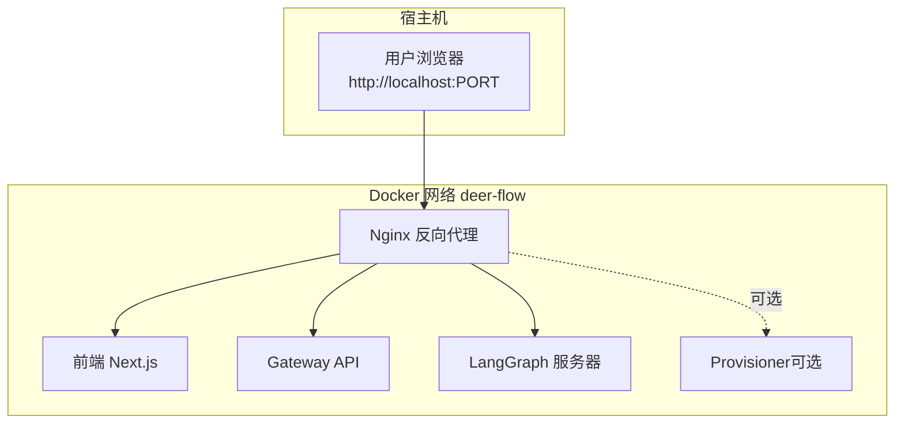
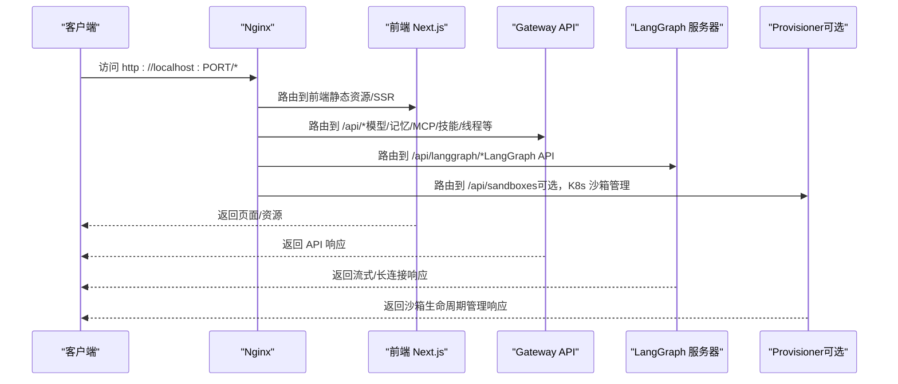
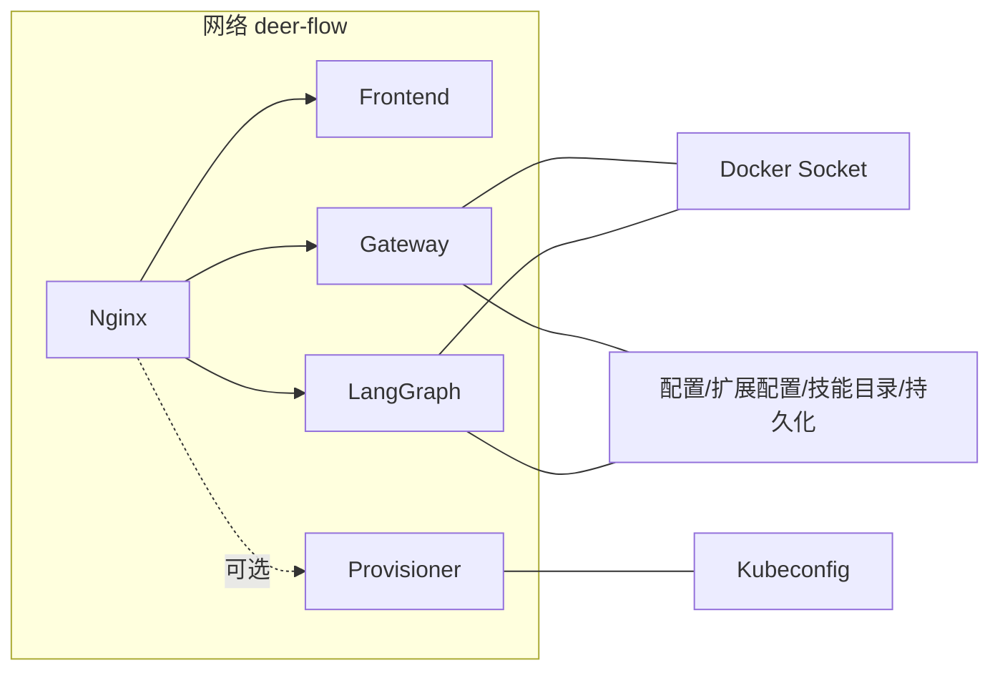

# Docker 部署

<cite>
**本文引用的文件**
- [docker-compose.yaml](file://docker/docker-compose.yaml)
- [docker-compose-dev.yaml](file://docker/docker-compose-dev.yaml)
- [nginx.conf](file://docker/nginx/nginx.conf)
- [nginx.local.conf](file://docker/nginx/nginx.local.conf)
- [Dockerfile（后端）](file://backend/Dockerfile)
- [Dockerfile（前端）](file://frontend/Dockerfile)
- [Dockerfile（Provisioner）](file://docker/provisioner/Dockerfile)
- [Provisioner 应用](file://docker/provisioner/app.py)
- [部署脚本 deploy.sh](file://scripts/deploy.sh)
- [开发脚本 docker.sh](file://scripts/docker.sh)
- [Makefile](file://Makefile)
- [示例配置 config.example.yaml](file://config.example.yaml)
- [示例扩展配置 extensions_config.example.json](file://extensions_config.example.json)
</cite>

## 目录
1. [简介](#简介)
2. [项目结构](#项目结构)
3. [核心组件](#核心组件)
4. [架构总览](#架构总览)
5. [详细组件分析](#详细组件分析)
6. [依赖关系分析](#依赖关系分析)
7. [性能与资源建议](#性能与资源建议)
8. [故障排查指南](#故障排查指南)
9. [结论](#结论)
10. [附录：部署操作手册](#附录部署操作手册)

## 简介
本指南面向使用 Docker 部署 DeerFlow 的运维与开发者，系统讲解 docker-compose 编排中各服务组件（Nginx 反向代理、前端 Next.js、Gateway API、LangGraph 服务器、可选 Provisioner），并覆盖开发与生产两种环境的配置差异、环境变量、端口映射、Docker Socket 绑定、技能目录挂载与持久化存储等关键主题。文档同时提供完整部署命令、常见问题排查与最佳实践建议。

## 项目结构
DeerFlow 的 Docker 部署由两套编排文件构成：
- 生产环境：docker/docker-compose.yaml
- 开发环境：docker/docker-compose-dev.yaml

两者均通过 Nginx 提供统一入口，反向代理到前端、Gateway API 与 LangGraph，并在需要时接入 Provisioner（Kubernetes 沙箱管理）。后端镜像统一基于 backend/Dockerfile 构建，前端镜像基于 frontend/Dockerfile 构建；Provisioner 自身有独立 Dockerfile 与应用逻辑。

图表来源
- [docker-compose.yaml:24-183](file://docker/docker-compose.yaml#L24-L183)
- [docker-compose-dev.yaml:16-216](file://docker/docker-compose-dev.yaml#L16-L216)

章节来源
- [docker-compose.yaml:1-23](file://docker/docker-compose.yaml#L1-L23)
- [docker-compose-dev.yaml:1-15](file://docker/docker-compose-dev.yaml#L1-L15)

## 核心组件
- Nginx 反向代理
  - 生产：监听容器端口 2026，路由到前端、Gateway、LangGraph；可选路由到 Provisioner。
  - 开发：本地模式下使用 127.0.0.1 上游，便于直接访问宿主机服务。
- 前端 Next.js
  - 生产：以 prod 目标构建并运行生产服务。
  - 开发：以 dev 目标构建并在容器内运行开发服务器，支持热更新。
- Gateway API（FastAPI）
  - 运行 uvicorn，监听 8001 端口；挂载配置、扩展配置、技能目录与持久化数据。
- LangGraph 服务器
  - 使用 langgraph dev 启动，监听 2024 端口；挂载配置、扩展配置、技能目录与持久化数据。
- Provisioner（可选）
  - 在 Kubernetes 模式下动态创建/销毁沙箱 Pod 与 NodePort Service，提供直接访问 URL。

章节来源
- [docker-compose.yaml:26-148](file://docker/docker-compose.yaml#L26-L148)
- [docker-compose-dev.yaml:63-202](file://docker/docker-compose-dev.yaml#L63-L202)
- [Dockerfile（前端）:1-36](file://frontend/Dockerfile#L1-L36)
- [Dockerfile（后端）:1-40](file://backend/Dockerfile#L1-L40)
- [Dockerfile（Provisioner）:1-20](file://docker/provisioner/Dockerfile#L1-L20)
- [Provisioner 应用:1-516](file://docker/provisioner/app.py#L1-L516)

## 架构总览
下图展示生产与开发两种模式下的请求流与服务交互：

图表来源
- [nginx.conf:34-229](file://docker/nginx/nginx.conf#L34-L229)
- [nginx.local.conf:30-212](file://docker/nginx/nginx.local.conf#L30-L212)
- [docker-compose.yaml:26-148](file://docker/docker-compose.yaml#L26-L148)
- [docker-compose-dev.yaml:63-202](file://docker/docker-compose-dev.yaml#L63-L202)

## 详细组件分析

### Nginx 反向代理
- 生产配置
  - 监听 2026 端口，上游使用服务名解析（Docker 内部 DNS）。
  - 对 /api/langgraph/ 进行路径重写，转发至 LangGraph。
  - 对 /api/* 下的多个自定义端点（模型、记忆、MCP、技能、线程上传等）转发至 Gateway。
  - 对 /api/sandboxes（可选）转发至 Provisioner。
  - 对其他请求默认转发至前端。
  - 支持长连接与流式传输（SSE/Streaming），超时时间较长。
- 开发配置
  - 本地模式下上游使用 127.0.0.1:3000/8001/2024，便于直接访问宿主机服务。
  - 其他路由规则与生产一致。

章节来源
- [nginx.conf:34-229](file://docker/nginx/nginx.conf#L34-L229)
- [nginx.local.conf:30-212](file://docker/nginx/nginx.local.conf#L30-L212)

### 前端 Next.js
- 生产镜像
  - 基于 node:22-alpine，使用 prod 目标构建并运行生产服务。
  - 通过 env_file 引入前端 .env，注入运行时变量。
- 开发镜像
  - 基于 dev 目标，启动开发服务器，支持热更新。
  - 挂载 src/public 与 next.config.js，缓存 pnpm store。

章节来源
- [Dockerfile（前端）:1-36](file://frontend/Dockerfile#L1-L36)
- [docker-compose.yaml:42-56](file://docker/docker-compose.yaml#L42-L56)
- [docker-compose-dev.yaml:78-104](file://docker-compose-dev.yaml#L78-L104)

### Gateway API（FastAPI）
- 运行方式
  - 使用 uvicorn 启动，监听 8001 端口，多进程（workers=2）。
- 关键挂载
  - 配置文件与扩展配置文件只读挂载。
  - 技能目录只读挂载。
  - 运行时数据目录（DEER_FLOW_HOME）持久化挂载。
  - Docker Socket 绑定（DooD），用于在容器内启动沙箱容器。
  - CLI 授权目录挂载（.claude、.codex），用于自动认证。
- 环境变量
  - CI=true、DEER_FLOW_HOME、DEER_FLOW_HOST_BASE_DIR、DEER_FLOW_HOST_SKILLS_PATH、DEER_FLOW_SANDBOX_HOST 等。
  - extra_hosts 映射 host.docker.internal 到 host-gateway，确保容器内可达宿主机。

章节来源
- [docker-compose.yaml:59-99](file://docker/docker-compose.yaml#L59-L99)
- [Dockerfile（后端）:19-39](file://backend/Dockerfile#L19-L39)

### LangGraph 服务器
- 运行方式
  - 使用 langgraph dev 启动，监听 2024 端口，禁用浏览器打开与自动重载。
- 关键挂载
  - 配置文件与扩展配置文件只读挂载。
  - 运行时数据目录与技能目录挂载。
  - Docker Socket 绑定（DooD）。
  - CLI 授权目录挂载。
- 环境变量
  - CI=true、DEER_FLOW_HOME、DEER_FLOW_CONFIG_PATH、DEER_FLOW_EXTENSIONS_CONFIG_PATH、DEER_FLOW_HOST_BASE_DIR、DEER_FLOW_HOST_SKILLS_PATH、DEER_FLOW_SANDBOX_HOST。
  - 默认关闭 LangSmith 跟踪，可通过环境变量开启。

章节来源
- [docker-compose.yaml:104-148](file://docker/docker-compose.yaml#L104-L148)
- [Dockerfile（后端）:19-39](file://backend/Dockerfile#L19-L39)

### Provisioner（可选，Kubernetes 模式）
- 功能
  - 通过 K8s API 为每个沙箱 ID 创建专用 Pod 与 NodePort Service，返回直接访问 URL。
  - 提供健康检查、创建、删除、查询与列表接口。
- 配置
  - 从宿主 kubeconfig 加载 K8s 客户端，必要时重写 API 地址。
  - 支持 HostPath 挂载技能目录与用户数据目录。
  - 通过环境变量控制命名空间、镜像、节点主机与 API 地址。
- 网络
  - 通过 extra_hosts 将 host.docker.internal 解析到 host-gateway，使后端可访问沙箱 NodePort。

章节来源
- [docker-compose-dev.yaml:17-56](file://docker-compose-dev.yaml#L17-L56)
- [Provisioner 应用:1-516](file://docker/provisioner/app.py#L1-L516)
- [Dockerfile（Provisioner）:1-20](file://docker/provisioner/Dockerfile#L1-L20)

## 依赖关系分析
- 服务间依赖
  - Nginx 依赖前端、Gateway、LangGraph；在生产模式下也依赖 Provisioner（可选）。
  - Gateway 与 LangGraph 共享配置与技能目录挂载，均依赖 Docker Socket（DooD）。
  - Provisioner 依赖宿主 kubeconfig 与 K8s API。
- 网络
  - 生产与开发分别使用独立网络 deer-flow 与 deer-flow-dev。
  - 通过 extra_hosts 将 host.docker.internal 映射到 host-gateway，保证容器内可达宿主机。
- 数据卷
  - DEER_FLOW_HOME 持久化运行时数据（如线程、检查点等）。
  - 技能目录挂载为只读，避免容器内修改影响宿主。
  - 前端开发模式挂载源代码与配置，实现热更新。

图表来源
- [docker-compose.yaml:26-148](file://docker/docker-compose.yaml#L26-L148)
- [docker-compose-dev.yaml:17-56](file://docker-compose-dev.yaml#L17-L56)

章节来源
- [docker-compose.yaml:33-39](file://docker/docker-compose.yaml#L33-L39)
- [docker-compose-dev.yaml:46-50](file://docker-compose-dev.yaml#L46-L50)

## 性能与资源建议
- 并发与端口
  - Gateway 使用多进程（workers=2），LangGraph 使用单进程但支持长连接与流式输出。
  - 建议根据 CPU 核数与并发需求调整 workers 数量。
- 挂载与缓存
  - 前端开发模式挂载 pnpm store 与日志目录，提升安装与调试效率。
  - 后端开发模式挂载 uv 缓存，减少依赖安装时间。
- 持久化
  - 将 DEER_FLOW_HOME 挂载到高性能磁盘，避免频繁 IO 影响性能。
- 流式与超时
  - Nginx 对长连接与流式输出做了专门优化（proxy_buffering off、长超时），请勿随意更改以免破坏 SSE/流式体验。

章节来源
- [docker-compose.yaml:64](file://docker/docker-compose.yaml#L64)
- [docker-compose-dev.yaml:89-94](file://docker-compose-dev.yaml#L89-L94)
- [docker-compose-dev.yaml:172-173](file://docker-compose-dev.yaml#L172-L173)

## 故障排查指南
- 端口占用
  - 确认宿主机 2026（生产）、3000（前端开发）、8001（Gateway）、2024（LangGraph）未被占用。
- Docker Socket 权限
  - 若使用 DooD（Docker-outside-of-Docker），需确保宿主 Docker Socket 存在且可访问。
  - 生产部署脚本会检测 DEER_FLOW_DOCKER_SOCKET 是否存在。
- 配置文件缺失
  - 若缺少 config.yaml 或 extensions_config.json，部署脚本会尝试从模板复制或创建空配置。
- 健康检查
  - Provisioner 提供 /health 健康检查端点，可在 compose 中启用健康检查策略。
- 日志定位
  - 使用 Makefile 提供的日志命令查看各服务日志，或使用 docker compose logs 定位问题。

章节来源
- [scripts/deploy.sh:174-188](file://scripts/deploy.sh#L174-L188)
- [scripts/deploy.sh:43-81](file://scripts/deploy.sh#L43-L81)
- [docker-compose-dev.yaml:51-56](file://docker-compose-dev.yaml#L51-L56)
- [Makefile:160-179](file://Makefile#L160-L179)

## 结论
通过上述编排与配置，DeerFlow 在 Docker 环境中实现了清晰的服务边界与高可用的反向代理层。生产与开发环境在端口、挂载与运行模式上各有侧重，结合环境变量与数据卷，可满足从本地开发到生产部署的多样化需求。建议在生产环境中启用持久化与健康检查，并按需启用 Provisioner 以获得更强隔离与可扩展性。

## 附录：部署操作手册

### 环境准备
- 安装 Docker 与 Docker Compose。
- 准备配置文件：
  - 复制 config.example.yaml 为 config.yaml，并填写模型 API 密钥。
  - 复制 extensions_config.example.json 为 extensions_config.json（如需 MCP 服务器）。
- 设置环境变量（可选）：
  - PORT：Nginx 监听端口，默认 2026。
  - BETTER_AUTH_SECRET：前端生产态密钥（部署脚本会自动生成并持久化）。
  - DEER_FLOW_HOME：运行时数据目录，默认仓库根/backend/.deer-flow。
  - DEER_FLOW_CONFIG_PATH、DEER_FLOW_EXTENSIONS_CONFIG_PATH：配置文件路径。
  - DEER_FLOW_DOCKER_SOCKET：DooD 使用的 Docker Socket，默认 /var/run/docker.sock。
  - DEER_FLOW_REPO_ROOT：用于技能目录在 DooD 模式下的宿主路径映射。

章节来源
- [scripts/deploy.sh:31-101](file://scripts/deploy.sh#L31-L101)
- [scripts/deploy.sh:43-81](file://scripts/deploy.sh#L43-L81)
- [config.example.yaml:1-624](file://config.example.yaml#L1-L624)
- [extensions_config.example.json:1-42](file://extensions_config.example.json#L1-L42)

### 生产环境部署
- 使用部署脚本一键启动（自动检测沙箱模式并按需启用 Provisioner）：
  - 启动：make up
  - 停止：make down
- 手动命令（不推荐）：
  - docker compose -f docker/docker-compose.yaml -p deer-flow up --build -d

访问地址
- 应用：http://localhost:${PORT:-2026}
- API 网关：http://localhost:${PORT:-2026}/api/*
- LangGraph：http://localhost:${PORT:-2026}/api/langgraph/*

章节来源
- [scripts/deploy.sh:174-213](file://scripts/deploy.sh#L174-L213)
- [Makefile:173-179](file://Makefile#L173-L179)

### 开发环境部署
- 使用开发脚本：
  - 初始化：make docker-init（可选，预拉取沙箱镜像）
  - 启动：make docker-start
  - 查看日志：make docker-logs
  - 停止：make docker-stop
- 手动命令（不推荐）：
  - docker compose -f docker/docker-compose-dev.yaml -p deer-flow-dev up --build -d

章节来源
- [scripts/docker.sh:87-230](file://scripts/docker.sh#L87-L230)
- [Makefile:147-179](file://Makefile#L147-L179)

### 端口与网络配置
- 生产网络：deer-flow（bridge）
- 开发网络：deer-flow-dev（bridge，子网 192.168.200.0/24）
- 主要端口
  - Nginx：2026（可由 PORT 覆盖）
  - 前端：3000（开发模式）
  - Gateway：8001
  - LangGraph：2024
  - Provisioner：8002（仅启用时）

章节来源
- [docker-compose.yaml:29-30](file://docker/docker-compose.yaml#L29-L30)
- [docker-compose-dev.yaml:66-67](file://docker-compose-dev.yaml#L66-L67)
- [docker-compose.yaml:180-183](file://docker/docker-compose.yaml#L180-L183)
- [docker-compose-dev.yaml:210-216](file://docker-compose-dev.yaml#L210-L216)

### Docker Socket 绑定与 DooD
- 作用：允许 Gateway/LangGraph 在容器内通过宿主 Docker 守护进程启动沙箱容器。
- 配置位置：Gateway 与 LangGraph 的 volumes 中绑定 /var/run/docker.sock。
- 注意事项：需确保宿主 Docker Socket 存在且权限正确；生产脚本会在非本地模式下校验该路径。

章节来源
- [docker-compose.yaml:71](file://docker/docker-compose.yaml#L71)
- [docker-compose.yaml:117](file://docker/docker-compose.yaml#L117)
- [scripts/deploy.sh:174-188](file://scripts/deploy.sh#L174-L188)

### 技能目录挂载
- 生产与开发均将技能目录挂载到容器内（只读），路径来自 DEER_FLOW_REPO_ROOT/skills。
- Gateway 与 LangGraph 的环境变量包含 DEER_FLOW_HOST_SKILLS_PATH，用于路径翻译。

章节来源
- [docker-compose.yaml:68](file://docker/docker-compose.yaml#L68)
- [docker-compose.yaml:114](file://docker/docker-compose.yaml#L114)
- [docker-compose-dev.yaml:119-121](file://docker-compose-dev.yaml#L119-L121)
- [docker-compose-dev.yaml:169-171](file://docker-compose-dev.yaml#L169-L171)

### 持久化存储
- DEER_FLOW_HOME：运行时数据目录（线程、检查点、LangGraph API 缓存等），需持久化挂载。
- 前端开发模式：挂载 logs 目录以便查看日志。
- 后端开发模式：挂载 .venv 与 uv 缓存，避免每次重建依赖。

章节来源
- [docker-compose.yaml:69](file://docker/docker-compose.yaml#L69)
- [docker-compose.yaml:113](file://docker/docker-compose.yaml#L113)
- [docker-compose-dev.yaml:122](file://docker-compose-dev.yaml#L122)
- [docker-compose-dev.yaml:171](file://docker-compose-dev.yaml#L171)

### Provisioner（Kubernetes 模式）
- 启用条件：当 config.yaml 中 sandbox.use 指向 AioSandboxProvider 且配置了 provisioner_url。
- 网络与配置：
  - 挂载 ~/.kube/config 至 /root/.kube/config。
  - 通过环境变量设置命名空间、镜像、HostPath 路径、Node 主机与 K8s API 地址。
  - 通过 extra_hosts 将 host.docker.internal 解析到 host-gateway。
- 健康检查：/health，compose 中已配置。

章节来源
- [scripts/deploy.sh:162-171](file://scripts/deploy.sh#L162-L171)
- [docker-compose.yaml:150-174](file://docker/docker-compose.yaml#L150-L174)
- [docker-compose-dev.yaml:17-56](file://docker-compose-dev.yaml#L17-L56)
- [Provisioner 应用:53-119](file://docker/provisioner/app.py#L53-L119)