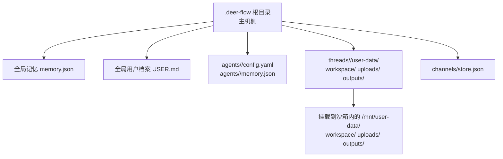
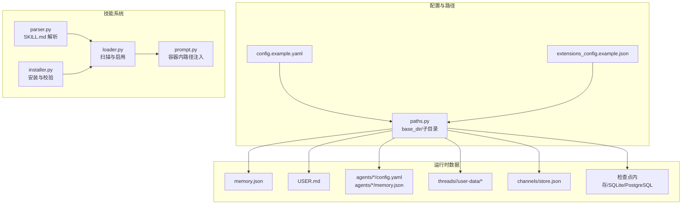
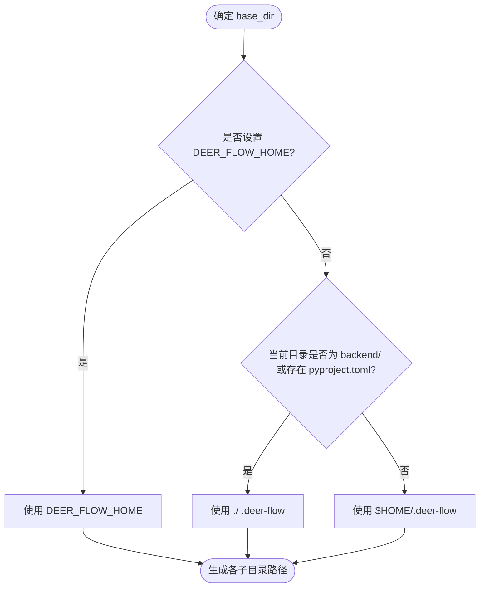
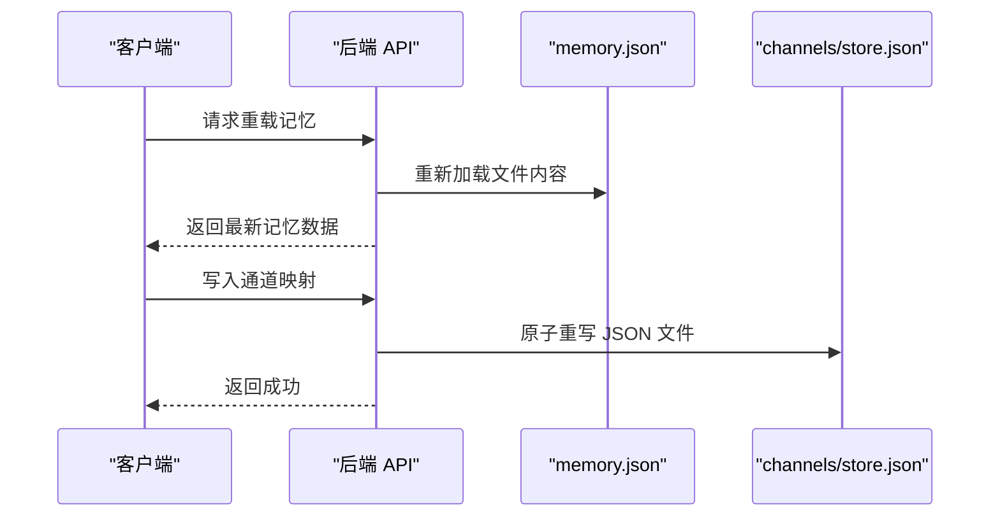
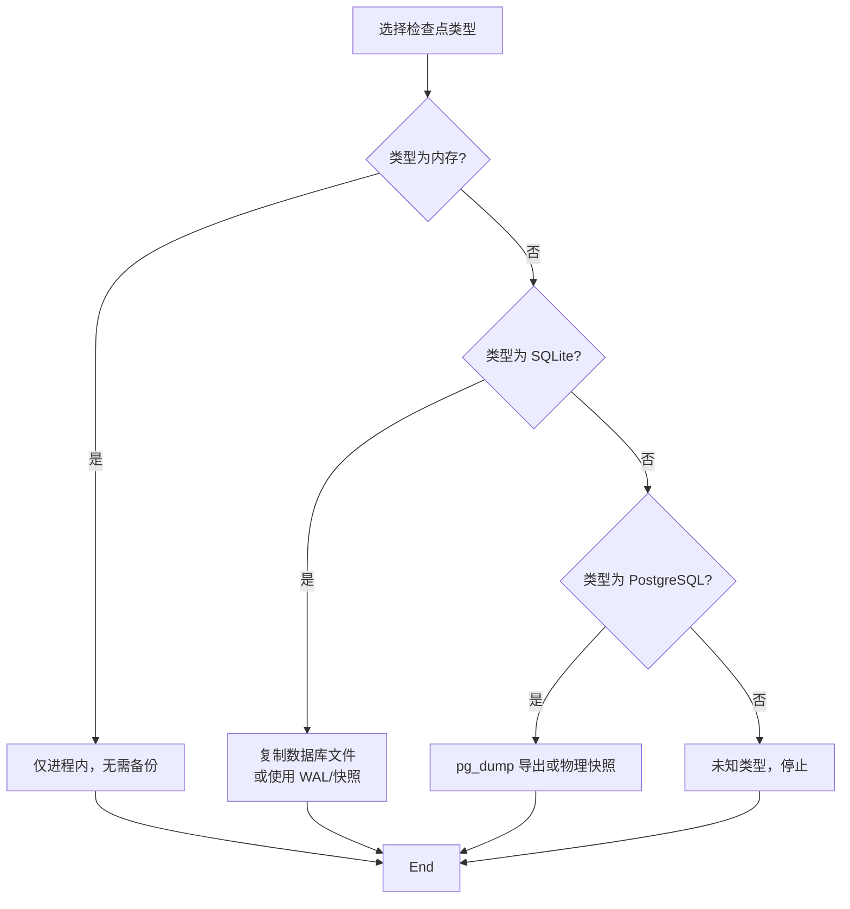
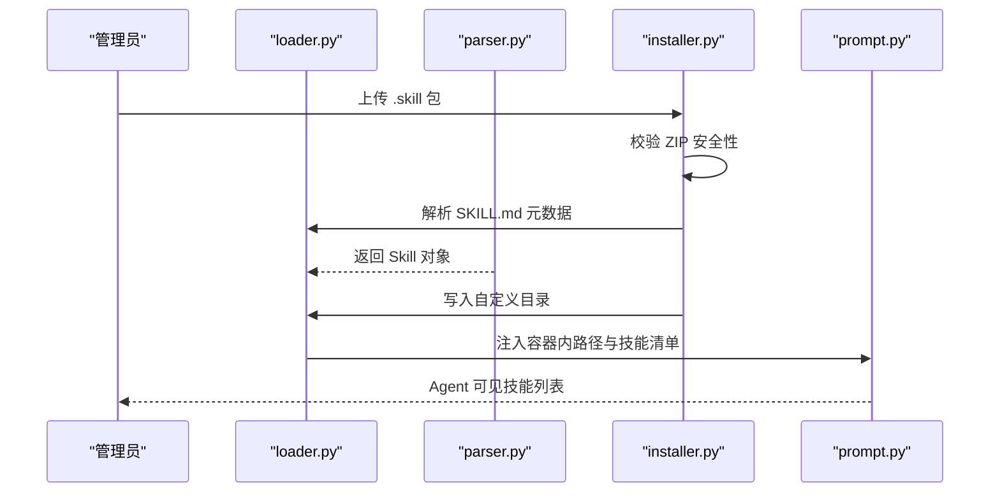
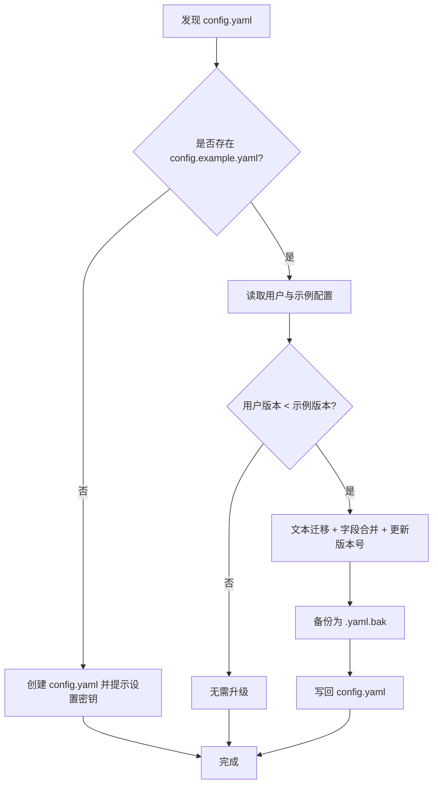
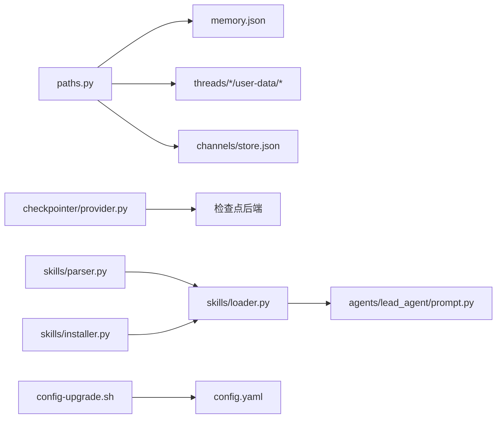

# 备份和恢复

<cite>
**本文引用的文件**
- [config.example.yaml](file://config.example.yaml)
- [extensions_config.example.json](file://extensions_config.example.json)
- [paths.py](file://backend/packages/harness/deerflow/config/paths.py)
- [provider.py](file://backend/packages/harness/deerflow/agents/checkpointer/provider.py)
- [store.py](file://backend/app/channels/store.py)
- [memory.py](file://backend/app/gateway/routers/memory.py)
- [CONFIGURATION.md](file://backend/docs/CONFIGURATION.md)
- [SETUP.md](file://backend/docs/SETUP.md)
- [config-upgrade.sh](file://scripts/config-upgrade.sh)
- [configure.py](file://scripts/configure.py)
- [parser.py](file://backend/packages/harness/deerflow/skills/parser.py)
- [loader.py](file://backend/packages/harness/deerflow/skills/loader.py)
- [installer.py](file://backend/packages/harness/deerflow/skills/installer.py)
- [prompt.py](file://backend/packages/harness/deerflow/agents/lead_agent/prompt.py)
</cite>

## 目录
1. [简介](#简介)
2. [项目结构](#项目结构)
3. [核心组件](#核心组件)
4. [架构总览](#架构总览)
5. [详细组件分析](#详细组件分析)
6. [依赖分析](#依赖分析)
7. [性能考虑](#性能考虑)
8. [故障排查指南](#故障排查指南)
9. [结论](#结论)
10. [附录](#附录)

## 简介
本指南面向 DeerFlow 的备份与恢复体系，聚焦以下目标：
- 数据持久化策略：明确应用数据、线程工作区、检查点状态、通道映射等的持久化位置与方式
- 配置文件备份与版本管理：基于示例配置与升级脚本的版本演进与安全备份
- 技能包管理：技能安装、解析、启用与目录结构
- .deer-flow 目录结构：主机侧与沙箱内虚拟路径映射
- 数据库备份方案：SQLite/PostgreSQL 检查点与外部数据库
- 文件系统快照配置：推荐的卷挂载与权限策略
- 自动备份脚本编写与策略：定时任务、增量/全量、保留策略
- 恢复流程演练：从配置到数据的端到端恢复步骤
- 灾难恢复计划：多层备份与降级策略
- 数据迁移与版本回滚：配置迁移、技能迁移与回退
- 扩展配置同步与环境切换：环境变量与多环境部署
- 备份验证与恢复测试：一致性校验与完整性检查

## 项目结构
DeerFlow 的持久化数据根目录由环境变量或默认路径决定，典型布局如下：
- 主机侧根目录：{base_dir}/
  - 全局记忆文件：{base_dir}/memory.json
  - 全局用户档案：{base_dir}/USER.md
  - 代理配置与记忆：{base_dir}/agents/{agent_name}/config.yaml, memory.json
  - 线程数据：{base_dir}/threads/{thread_id}/user-data/{workspace, uploads, outputs}
  - 通道映射：{base_dir}/channels/store.json
  - 沙箱工作区：{base_dir}/threads/{thread_id}/user-data/workspace/（挂载至 /mnt/user-data/workspace/）
  - 上传目录：{base_dir}/threads/{thread_id}/user-data/uploads/（挂载至 /mnt/user-data/uploads/）
  - 输出目录：{base_dir}/threads/{thread_id}/user-data/outputs/（挂载至 /mnt/user-data/outputs/）

图表来源
- [paths.py:12-37](file://backend/packages/harness/deerflow/config/paths.py#L12-L37)
- [paths.py:95-151](file://backend/packages/harness/deerflow/config/paths.py#L95-L151)

章节来源
- [paths.py:12-37](file://backend/packages/harness/deerflow/config/paths.py#L12-L37)
- [paths.py:95-151](file://backend/packages/harness/deerflow/config/paths.py#L95-L151)

## 核心组件
- 路径与持久化根：通过路径模块集中定义 base_dir 及各子目录，支持环境变量覆盖与容器场景下的主机基路径映射
- 记忆系统：全局与代理级记忆文件，支持后端接口触发重载
- 通道映射：IM 渠道与线程映射的 JSON 文件持久化
- 检查点：LangGraph 检查点支持内存、SQLite、PostgreSQL 三种后端
- 技能系统：技能解析、安装、启用与容器内路径注入

章节来源
- [paths.py:72-94](file://backend/packages/harness/deerflow/config/paths.py#L72-L94)
- [memory.py:119-148](file://backend/app/gateway/routers/memory.py#L119-L148)
- [store.py:16-46](file://backend/app/channels/store.py#L16-L46)
- [provider.py:59-95](file://backend/packages/harness/deerflow/agents/checkpointer/provider.py#L59-L95)
- [parser.py:7-65](file://backend/packages/harness/deerflow/skills/parser.py#L7-L65)
- [loader.py:22-42](file://backend/packages/harness/deerflow/skills/loader.py#L22-L42)
- [installer.py:110-177](file://backend/packages/harness/deerflow/skills/installer.py#L110-L177)

## 架构总览
下图展示备份与恢复涉及的关键模块及其交互：

图表来源
- [config.example.yaml:1-624](file://config.example.yaml#L1-L624)
- [extensions_config.example.json:1-42](file://extensions_config.example.json#L1-L42)
- [paths.py:12-37](file://backend/packages/harness/deerflow/config/paths.py#L12-L37)
- [parser.py:7-65](file://backend/packages/harness/deerflow/skills/parser.py#L7-L65)
- [loader.py:22-42](file://backend/packages/harness/deerflow/skills/loader.py#L22-L42)
- [installer.py:110-177](file://backend/packages/harness/deerflow/skills/installer.py#L110-L177)
- [prompt.py:387-420](file://backend/packages/harness/deerflow/agents/lead_agent/prompt.py#L387-L420)

## 详细组件分析

### .deer-flow 目录结构与持久化策略
- 基础目录定位优先级：构造参数 > 环境变量 DEER_FLOW_HOME > 开发回退（backend/ 下的 .deer-flow） > 默认 $HOME/.deer-flow
- 关键持久化文件与目录：
  - 全局记忆：{base_dir}/memory.json
  - 用户档案：{base_dir}/USER.md
  - 代理配置与记忆：{base_dir}/agents/{agent_name}/{config.yaml, memory.json}
  - 线程工作区：{base_dir}/threads/{thread_id}/user-data/{workspace/, uploads/, outputs/}
  - 通道映射：{base_dir}/channels/store.json
  - 检查点：根据配置选择内存/SQLite/PostgreSQL 后端
- 容器挂载与权限：
  - 线程目录在创建时设置为 0o777，确保沙箱容器可写
  - 虚拟路径前缀为 /mnt/user-data，用于沙箱内访问

图表来源
- [paths.py:39-70](file://backend/packages/harness/deerflow/config/paths.py#L39-L70)

章节来源
- [paths.py:39-70](file://backend/packages/harness/deerflow/config/paths.py#L39-L70)
- [paths.py:153-173](file://backend/packages/harness/deerflow/config/paths.py#L153-L173)
- [paths.py:184-217](file://backend/packages/harness/deerflow/config/paths.py#L184-L217)

### 记忆系统与通道映射持久化
- 全局与代理级记忆文件：支持后端接口触发重载，便于外部修改后的刷新
- 通道映射：IM 渠道到线程 ID 的 JSON 映射，采用原子重写策略，生产高并发建议替换为数据库

图表来源
- [memory.py:119-148](file://backend/app/gateway/routers/memory.py#L119-L148)
- [store.py:16-46](file://backend/app/channels/store.py#L16-L46)

章节来源
- [memory.py:119-148](file://backend/app/gateway/routers/memory.py#L119-L148)
- [store.py:16-46](file://backend/app/channels/store.py#L16-L46)

### 检查点与数据库备份方案
- 支持类型：内存（进程内）、SQLite（文件）、PostgreSQL（多进程）
- SQLite：连接字符串可为相对路径（经解析为绝对），首次使用会初始化表结构
- PostgreSQL：需提供连接字符串，适用于生产多实例部署
- 备份建议：
  - SQLite：直接复制数据库文件；结合 WAL/FTS5 等特性进行在线备份
  - PostgreSQL：使用逻辑导出（如 pg_dump）或物理快照；确保事务一致性
  - 内存模式：不持久化，无需备份

图表来源
- [provider.py:59-95](file://backend/packages/harness/deerflow/agents/checkpointer/provider.py#L59-L95)

章节来源
- [provider.py:59-95](file://backend/packages/harness/deerflow/agents/checkpointer/provider.py#L59-L95)

### 技能包管理与容器内路径
- 技能解析：从 SKILL.md 提取元数据（名称、描述、许可证等）
- 技能安装：校验 ZIP 安全性（路径穿越、符号链接、大小限制），解压到自定义目录
- 技能启用：通过配置控制启用状态，提示在容器内通过注入路径访问
- 容器内路径：技能位于容器内指定挂载路径，Agent Prompt 注入可用技能清单与路径

图表来源
- [parser.py:7-65](file://backend/packages/harness/deerflow/skills/parser.py#L7-L65)
- [installer.py:110-177](file://backend/packages/harness/deerflow/skills/installer.py#L110-L177)
- [loader.py:22-42](file://backend/packages/harness/deerflow/skills/loader.py#L22-L42)
- [prompt.py:387-420](file://backend/packages/harness/deerflow/agents/lead_agent/prompt.py#L387-L420)

章节来源
- [parser.py:7-65](file://backend/packages/harness/deerflow/skills/parser.py#L7-L65)
- [installer.py:110-177](file://backend/packages/harness/deerflow/skills/installer.py#L110-L177)
- [loader.py:22-42](file://backend/packages/harness/deerflow/skills/loader.py#L22-L42)
- [prompt.py:387-420](file://backend/packages/harness/deerflow/agents/lead_agent/prompt.py#L387-L420)

### 配置文件备份与版本管理
- 示例配置：包含完整字段与注释，作为升级与审计依据
- 升级脚本：自动备份原配置、执行版本迁移、递归合并缺失字段，并更新版本号
- 版本检测：若用户配置缺少版本号或版本落后，发出警告并建议升级
- 配置生成：一键生成 config.yaml、.env、前端 .env

图表来源
- [config-upgrade.sh:14-146](file://scripts/config-upgrade.sh#L14-L146)
- [CONFIGURATION.md:296-335](file://backend/docs/CONFIGURATION.md#L296-L335)
- [SETUP.md:42-50](file://backend/docs/SETUP.md#L42-L50)
- [configure.py:20-58](file://scripts/configure.py#L20-L58)

章节来源
- [config-upgrade.sh:14-146](file://scripts/config-upgrade.sh#L14-L146)
- [CONFIGURATION.md:296-335](file://backend/docs/CONFIGURATION.md#L296-L335)
- [SETUP.md:42-50](file://backend/docs/SETUP.md#L42-L50)
- [configure.py:20-58](file://scripts/configure.py#L20-L58)

### 扩展配置同步与环境切换
- 扩展配置示例：MCP 服务器与技能的启用/禁用、命令与参数、环境变量
- 环境变量：示例配置文档列出常用环境变量，建议通过环境变量注入敏感值
- 环境切换：通过 DEER_FLOW_CONFIG_PATH 指定不同环境的配置文件路径

章节来源
- [extensions_config.example.json:1-42](file://extensions_config.example.json#L1-L42)
- [CONFIGURATION.md:296-335](file://backend/docs/CONFIGURATION.md#L296-L335)

## 依赖分析
- 路径模块为所有持久化数据提供统一入口，耦合度低、内聚性强
- 检查点工厂按配置动态选择后端，避免硬编码依赖
- 技能系统分层清晰：解析、安装、加载、注入
- 配置升级脚本独立于业务逻辑，仅依赖 YAML 与文件系统

图表来源
- [paths.py:12-37](file://backend/packages/harness/deerflow/config/paths.py#L12-L37)
- [provider.py:59-95](file://backend/packages/harness/deerflow/agents/checkpointer/provider.py#L59-L95)
- [parser.py:7-65](file://backend/packages/harness/deerflow/skills/parser.py#L7-L65)
- [installer.py:110-177](file://backend/packages/harness/deerflow/skills/installer.py#L110-L177)
- [loader.py:22-42](file://backend/packages/harness/deerflow/skills/loader.py#L22-L42)
- [prompt.py:387-420](file://backend/packages/harness/deerflow/agents/lead_agent/prompt.py#L387-L420)
- [config-upgrade.sh:14-146](file://scripts/config-upgrade.sh#L14-L146)

章节来源
- [paths.py:12-37](file://backend/packages/harness/deerflow/config/paths.py#L12-L37)
- [provider.py:59-95](file://backend/packages/harness/deerflow/agents/checkpointer/provider.py#L59-L95)
- [parser.py:7-65](file://backend/packages/harness/deerflow/skills/parser.py#L7-L65)
- [installer.py:110-177](file://backend/packages/harness/deerflow/skills/installer.py#L110-L177)
- [loader.py:22-42](file://backend/packages/harness/deerflow/skills/loader.py#L22-L42)
- [prompt.py:387-420](file://backend/packages/harness/deerflow/agents/lead_agent/prompt.py#L387-L420)
- [config-upgrade.sh:14-146](file://scripts/config-upgrade.sh#L14-L146)

## 性能考虑
- 记忆文件与通道映射为小文件，读写频繁但体量小，适合本地磁盘缓存
- SQLite 在单实例场景性能良好，注意 WAL/FSync 设置；PostgreSQL 适合多实例
- 技能安装过程对 I/O 有峰值，建议离峰执行
- 沙箱目录权限一次性设置为 0o777，避免后续写入权限问题

## 故障排查指南
- 配置文件未找到：确认 config.yaml 位置与 DEER_FLOW_CONFIG_PATH；参考配置文档中的查找顺序
- 权限问题：确保 .deer-flow 目录与子目录具备写权限；沙箱工作区目录已强制 chmod 0o777
- 检查点导入失败：根据类型检查依赖安装与连接字符串
- 技能安装异常：检查 ZIP 是否包含路径穿越、符号链接或超过大小限制
- 记忆重载无效：确认 memory.json 已被后端重新读取

章节来源
- [CONFIGURATION.md:296-335](file://backend/docs/CONFIGURATION.md#L296-L335)
- [SETUP.md:42-50](file://backend/docs/SETUP.md#L42-L50)
- [paths.py:153-173](file://backend/packages/harness/deerflow/config/paths.py#L153-L173)
- [provider.py:59-95](file://backend/packages/harness/deerflow/agents/checkpointer/provider.py#L59-L95)
- [installer.py:110-177](file://backend/packages/harness/deerflow/skills/installer.py#L110-L177)
- [memory.py:119-148](file://backend/app/gateway/routers/memory.py#L119-L148)

## 结论
DeerFlow 的备份与恢复体系以“路径集中、文件化持久化、可插拔检查点”为核心设计。通过 .deer-flow 统一根目录、严格的技能安装校验、灵活的检查点后端以及完善的配置升级流程，可在开发与生产环境中实现稳定可靠的备份与恢复。

## 附录

### 自动备份脚本编写与策略
- 备份范围
  - 配置：config.yaml 及其备份（.yaml.bak）
  - 数据：.deer-flow 根目录（含 threads、agents、channels、memory.json 等）
  - 检查点：SQLite 数据库文件或 PostgreSQL 导出
- 备份类型
  - 全量：周期性（如每日）对 .deer-flow 进行完整打包
  - 增量：针对最近变更的 threads/* 子目录进行差异备份
- 保留策略
  - 本地保留最近 N 天/周/月
  - 远程归档保留更长周期
- 触发方式
  - Cron 定时任务
  - 应用事件触发（如配置升级前后）

### 恢复流程演练
- 步骤
  - 停止服务
  - 恢复 .deer-flow 根目录（覆盖或重建）
  - 恢复检查点（SQLite/PostgreSQL）
  - 重启服务并验证
- 验证
  - 访问记忆重载接口，确认 memory.json 生效
  - 检查通道映射文件是否可读
  - 运行一次对话，确认线程工作区与输出目录正常

### 灾难恢复计划
- 多层备份
  - 本地磁盘快照（LVM/ZFS）+ 远程对象存储
  - 数据库专用备份（PostgreSQL 逻辑导出/物理快照）
- 降级策略
  - 检查点回退：使用最近一次有效备份
  - 配置回滚：使用 .yaml.bak 或上一个版本
  - 技能降级：回退到已知稳定的 .skill 包

### 数据迁移与版本回滚
- 配置迁移
  - 使用升级脚本自动迁移字段与版本号
  - 手动对比差异并调整
- 技能迁移
  - 从旧 .deer-flow 复制 custom 技能目录
  - 重新解析 SKILL.md 并注入容器路径
- 回滚机制
  - 配置：回滚 .yaml.bak
  - 数据：回滚 .deer-flow 快照
  - 检查点：回滚数据库快照

### 备份验证与恢复测试
- 验证清单
  - 配置文件可解析且版本匹配
  - .deer-flow 目录结构完整
  - 检查点可连接且记录存在
  - 记忆与通道映射可读
- 测试流程
  - 从备份恢复到隔离环境
  - 执行最小化回归测试（读取记忆、创建线程、写入输出）
  - 校验数据完整性（文件数量、哈希、时间戳）