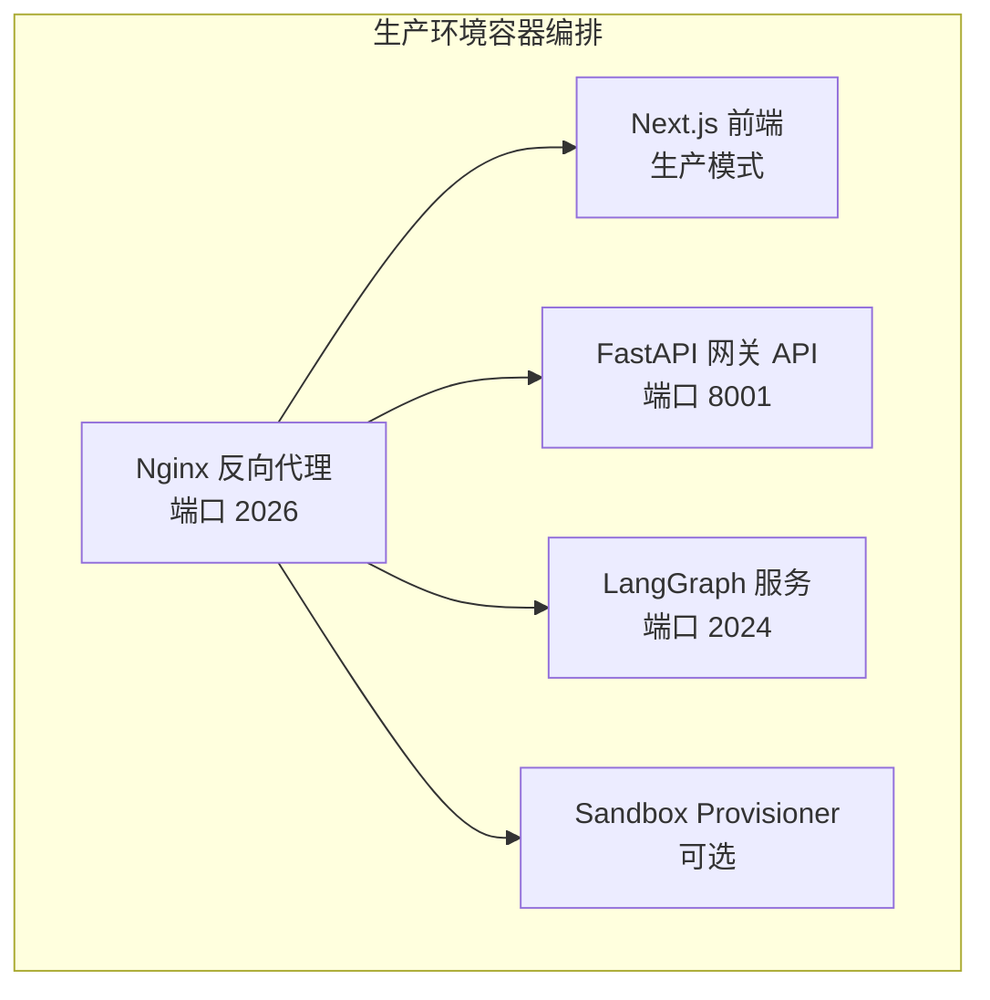
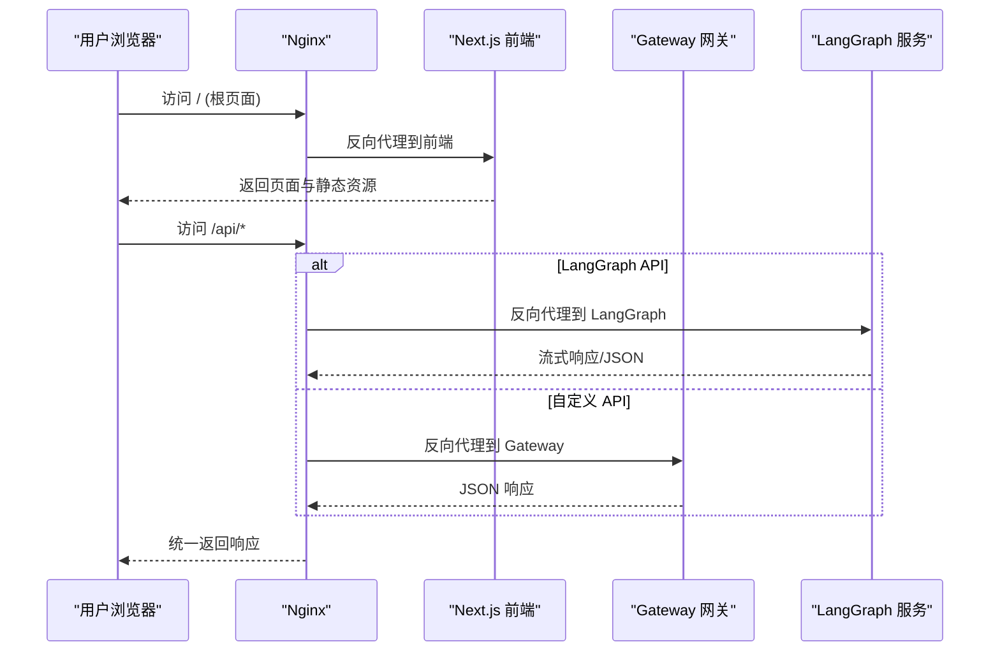
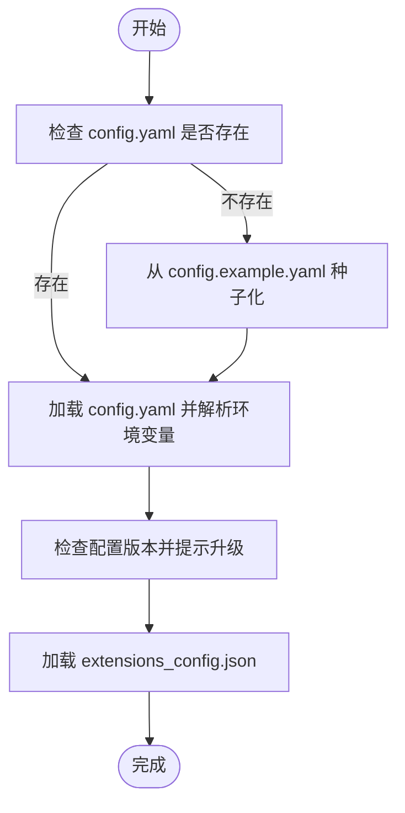
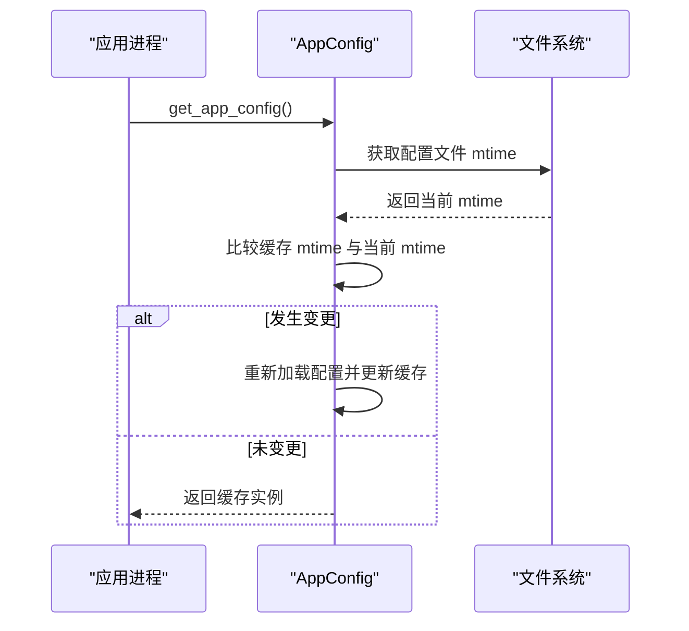
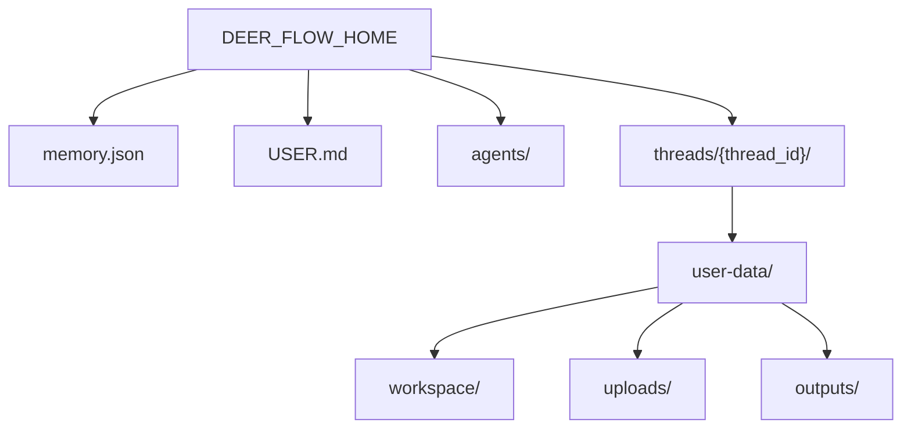
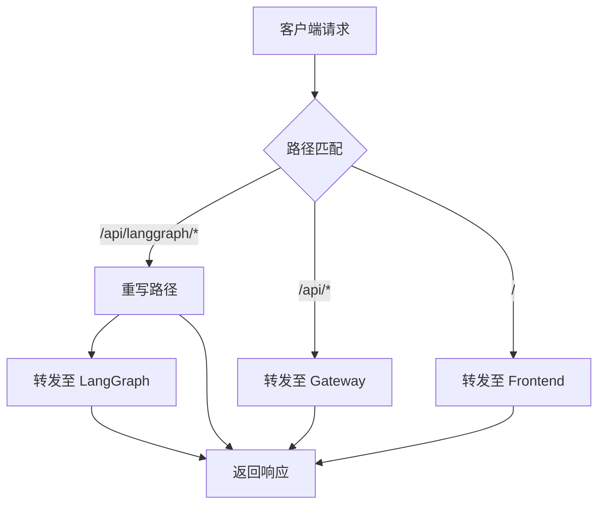
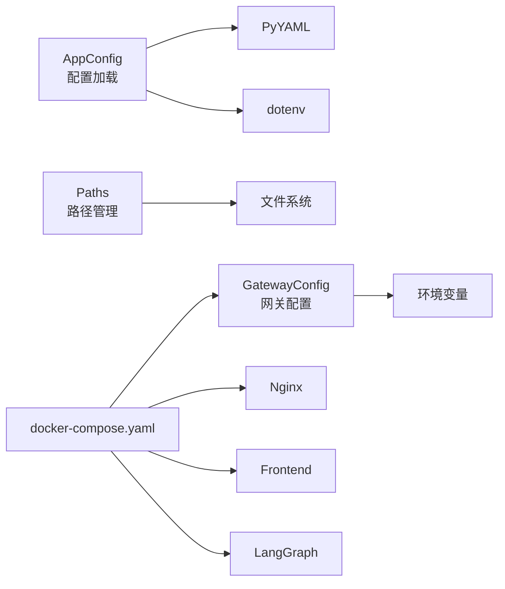

# 生产环境配置

<cite>
**本文档引用的文件**
- [config.example.yaml](file://config.example.yaml)
- [extensions_config.example.json](file://extensions_config.example.json)
- [docker-compose.yaml](file://docker/compose.yaml)
- [nginx.conf](file://docker/nginx/nginx.conf)
- [deploy.sh](file://scripts/deploy.sh)
- [config-upgrade.sh](file://scripts/config-upgrade.sh)
- [Makefile](file://Makefile)
- [app_config.py](file://backend/packages/harness/deerflow/config/app_config.py)
- [paths.py](file://backend/packages/harness/deerflow/config/paths.py)
- [config.py](file://backend/app/gateway/config.py)
- [next.config.js](file://frontend/next.config.js)
</cite>

## 目录
1. [简介](#简介)
2. [项目结构](#项目结构)
3. [核心组件](#核心组件)
4. [架构总览](#架构总览)
5. [详细组件分析](#详细组件分析)
6. [依赖分析](#依赖分析)
7. [性能考虑](#性能考虑)
8. [故障排查指南](#故障排查指南)
9. [结论](#结论)
10. [附录](#附录)

## 简介
本指南面向在生产环境中部署与运维 DeerFlow 的工程团队，提供从环境变量、配置文件管理到安全加固、性能优化与监控的完整实践路径。内容覆盖以下关键主题：
- 环境变量与 .env 配置要点（含 BETTER_AUTH_SECRET、DEER_FLOW_HOME、Docker Socket 路径等）
- 配置文件管理与版本升级流程（config.yaml 与 extensions_config.json）
- 配置热重载机制与配置验证流程
- 反向代理与负载均衡配置
- 安全加固与 SSL 证书配置建议
- 部署脚本使用方法与参数说明

## 项目结构
生产环境采用多容器编排，包含 Nginx 反向代理、前端 Next.js、后端网关 API、LangGraph 服务以及可选的 Sandbox Provisioner。核心目录与文件如下：
- docker-compose.yaml：定义服务、网络、卷挂载与环境变量
- docker/nginx/nginx.conf：Nginx 路由规则、CORS 处理与长连接支持
- scripts/deploy.sh：一键构建与启动/停止生产服务
- config.example.yaml：应用配置模板（模型、工具、沙箱、记忆体等）
- extensions_config.example.json：扩展配置模板（MCP 服务器与技能状态）

**图表来源**
- [docker-compose.yaml:24-183](file://docker/compose.yaml#L24-L183)
- [nginx.conf:34-231](file://docker/nginx/nginx.conf#L34-L231)

**章节来源**
- [docker-compose.yaml:1-183](file://docker/compose.yaml#L1-L183)
- [nginx.conf:1-231](file://docker/nginx/nginx.conf#L1-L231)

## 核心组件
- 应用配置加载器：负责解析 config.yaml、注入环境变量、执行配置版本校验与热重载
- 路径管理器：集中管理数据目录、线程工作区与沙箱挂载路径
- 网关配置：定义网关主机、端口与 CORS 源
- 扩展配置：MCP 服务器与技能状态的 JSON 配置
- 反向代理：Nginx 负责路由、CORS、长连接与上传限流

**章节来源**
- [app_config.py:1-334](file://backend/packages/harness/deerflow/config/app_config.py#L1-L334)
- [paths.py:1-243](file://backend/packages/harness/deerflow/config/paths.py#L1-L243)
- [config.py:1-28](file://backend/app/gateway/config.py#L1-L28)
- [extensions_config.example.json:1-42](file://extensions_config.example.json#L1-L42)

## 架构总览
生产环境请求流经 Nginx，根据路径将请求转发至对应后端服务；前端静态资源由 Nginx 直接提供，API 请求则由网关或 LangGraph 处理。

**图表来源**
- [nginx.conf:55-229](file://docker/nginx/nginx.conf#L55-L229)
- [docker-compose.yaml:26-148](file://docker/compose.yaml#L26-L148)

## 详细组件分析

### 环境变量与 .env 配置
- 必需环境变量
  - BETTER_AUTH_SECRET：用于前端认证与会话安全，需在首次部署时生成并持久化于 DEER_FLOW_HOME 下
  - DEER_FLOW_HOME：运行时数据目录，用于存储内存、线程数据与沙箱工作区
  - DEER_FLOW_CONFIG_PATH：指向 config.yaml 的绝对路径
  - DEER_FLOW_EXTENSIONS_CONFIG_PATH：指向 extensions_config.json 的绝对路径
  - DEER_FLOW_DOCKER_SOCKET：Docker Socket 路径（DooD 场景）
  - DEER_FLOW_REPO_ROOT：仓库根目录（用于 DooD 中的技能宿主路径映射）
- 可选环境变量
  - PORT：Nginx 监听端口
  - NGINX_CONF：Nginx 配置文件名
  - LANGCHAIN_TRACING_V2/LANGSMITH_API_KEY：启用 LangSmith 追踪（默认关闭）
  - CORS_ORIGINS/GATEWAY_HOST/GATEWAY_PORT：网关 CORS 与监听地址

部署脚本会自动检测并生成/加载 BETTER_AUTH_SECRET，同时确保 DEER_FLOW_HOME 存在且具备正确权限。

**章节来源**
- [deploy.sh:31-101](file://scripts/deploy.sh#L31-L101)
- [deploy.sh:174-188](file://scripts/deploy.sh#L174-L188)
- [docker-compose.yaml:11-22](file://docker/compose.yaml#L11-L22)
- [config.py:17-27](file://backend/app/gateway/config.py#L17-L27)

### 配置文件管理与版本升级
- config.yaml
  - 支持通过 DEER_FLOW_CONFIG_PATH 或默认路径加载
  - 支持在配置中使用环境变量占位符（以 $ 开头）
  - 启动时进行配置版本检查，提示升级
- extensions_config.json
  - 默认路径可通过 DEER_FLOW_EXTENSIONS_CONFIG_PATH 指定
  - 若缺失，脚本会生成最小可用配置
- 升级流程
  - 使用 scripts/config-upgrade.sh 将示例模板中的新字段合并到用户配置，并备份原文件

**图表来源**
- [deploy.sh:43-81](file://scripts/deploy.sh#L43-L81)
- [config-upgrade.sh:38-146](file://scripts/config-upgrade.sh#L38-L146)
- [app_config.py:74-131](file://backend/packages/harness/deerflow/config/app_config.py#L74-L131)

**章节来源**
- [config.example.yaml:1-20](file://config.example.yaml#L1-L20)
- [app_config.py:45-73](file://backend/packages/harness/deerflow/config/app_config.py#L45-L73)
- [app_config.py:133-202](file://backend/packages/harness/deerflow/config/app_config.py#L133-L202)
- [config-upgrade.sh:1-147](file://scripts/config-upgrade.sh#L1-L147)

### 配置热重载机制与验证流程
- 热重载
  - get_app_config() 在每次调用时检查配置文件的修改时间，若变更则自动重新加载
  - reload_app_config() 可强制刷新缓存实例
  - reset_app_config() 清空缓存，下次调用触发重新加载
- 验证流程
  - 解析前进行配置版本比较，低版本发出警告
  - 环境变量解析时对未设置的变量抛出异常，避免静默失败
  - 路径解析与线程目录创建时进行安全校验（防止路径穿越）

**图表来源**
- [app_config.py:263-288](file://backend/packages/harness/deerflow/config/app_config.py#L263-L288)

**章节来源**
- [app_config.py:237-334](file://backend/packages/harness/deerflow/config/app_config.py#L237-L334)
- [paths.py:153-174](file://backend/packages/harness/deerflow/config/paths.py#L153-L174)

### 数据目录与沙箱路径（DEER_FLOW_HOME）
- 基础目录优先级：构造函数参数 > DEER_FLOW_HOME > 本地开发回退 > 用户家目录
- 关键子目录
  - memory.json：全局记忆文件
  - USER.md：全局用户档案
  - agents/{agent_name}/：自定义代理配置与记忆
  - threads/{thread_id}/user-data/{workspace, uploads, outputs}/：线程工作区与输出
- Docker 场景下的路径映射
  - DEER_FLOW_HOST_BASE_DIR：在 DooD 模式下指定宿主机侧映射路径
  - 通过 ensure_thread_dirs() 创建并赋予 0o777 权限，避免沙箱容器写入权限问题

**图表来源**
- [paths.py:12-37](file://backend/packages/harness/deerflow/config/paths.py#L12-L37)
- [paths.py:153-174](file://backend/packages/harness/deerflow/config/paths.py#L153-L174)

**章节来源**
- [paths.py:39-71](file://backend/packages/harness/deerflow/config/paths.py#L39-L71)
- [paths.py:95-152](file://backend/packages/harness/deerflow/config/paths.py#L95-L152)

### 反向代理与负载均衡配置
- Nginx 路由规则
  - 基于路径的转发：/api/langgraph/、/api/models、/api/memory、/api/mcp、/api/skills、/api/agents、/api/threads 等
  - 对 LangGraph API 进行路径重写，去除前缀后再转发
  - 对 OPTIONS 预检请求直接返回 204
- CORS 处理
  - 在 Nginx 层统一添加 CORS 头，隐藏上游重复头
- 长连接与流式传输
  - 对 SSE/流式接口禁用代理缓冲、关闭缓存并设置超时
- 负载均衡
  - upstream 块定义后端服务列表，支持多实例横向扩展
  - 建议在生产中使用多实例 Nginx 并结合健康检查实现高可用

**图表来源**
- [nginx.conf:55-229](file://docker/nginx/nginx.conf#L55-L229)

**章节来源**
- [nginx.conf:1-231](file://docker/nginx/nginx.conf#L1-L231)
- [docker-compose.yaml:24-183](file://docker/compose.yaml#L24-L183)

### 部署脚本使用方法与参数说明
- 基本命令
  - make up：构建镜像并启动生产服务
  - make down：停止并移除容器
- 关键行为
  - 自动设置 DEER_FLOW_HOME 并创建目录
  - 若缺少 config.yaml，从 config.example.yaml 种子化并提示编辑
  - 若缺少 extensions_config.json，生成最小可用配置
  - 自动生成/加载 BETTER_AUTH_SECRET 并持久化到 DEER_FLOW_HOME
  - 检测沙箱模式（local/aio/provisioner），按需启用 provisioner profile
  - 校验 Docker Socket 存在性（非本地沙箱模式）

**章节来源**
- [Makefile:173-179](file://Makefile#L173-L179)
- [deploy.sh:1-213](file://scripts/deploy.sh#L1-L213)

### 安全加固与 SSL 证书配置
- 认证与会话
  - 必须设置 BETTER_AUTH_SECRET，建议将其置于只读密钥管理服务中并在重启后复用
- CORS 与跨域
  - 网关层与 Nginx 层分别处理 CORS，建议在生产中限制允许源
- Docker Socket 安全
  - 仅在需要 DooD 的场景挂载 Docker Socket，并限制容器权限
- TLS/SSL
  - 建议在反向代理层启用 HTTPS，使用受信 CA 证书与强密码套件
  - 将证书与私钥放置在受控目录并通过 Nginx 正确加载

**章节来源**
- [deploy.sh:84-101](file://scripts/deploy.sh#L84-L101)
- [config.py:17-27](file://backend/app/gateway/config.py#L17-L27)
- [docker-compose.yaml:70-96](file://docker/compose.yaml#L70-L96)

## 依赖分析
- 组件耦合
  - AppConfig 依赖 YAML 解析与 dotenv 加载，负责配置版本校验与环境变量解析
  - Paths 依赖环境变量与文件系统，负责目录布局与安全路径解析
  - 网关配置独立于应用配置，通过环境变量控制监听与 CORS
- 外部依赖
  - Docker Compose 编排多服务
  - Nginx 提供反向代理与静态资源服务
  - 前端 Next.js 通过环境变量与构建参数适配生产

**图表来源**
- [app_config.py:1-334](file://backend/packages/harness/deerflow/config/app_config.py#L1-L334)
- [paths.py:1-243](file://backend/packages/harness/deerflow/config/paths.py#L1-L243)
- [config.py:1-28](file://backend/app/gateway/config.py#L1-L28)
- [docker-compose.yaml:24-183](file://docker/compose.yaml#L24-L183)

**章节来源**
- [app_config.py:1-334](file://backend/packages/harness/deerflow/config/app_config.py#L1-L334)
- [paths.py:1-243](file://backend/packages/harness/deerflow/config/paths.py#L1-L243)
- [config.py:1-28](file://backend/app/gateway/config.py#L1-L28)
- [docker-compose.yaml:1-183](file://docker/compose.yaml#L1-L183)

## 性能考虑
- Nginx
  - 启用 keepalive、禁用不必要的缓冲，提升长连接与流式接口性能
  - 对上传接口设置合理的 client_max_body_size 与关闭请求缓冲
- 网关与 LangGraph
  - 使用多进程/多实例部署，结合负载均衡
  - 对流式接口禁用代理缓冲，减少延迟
- 沙箱执行
  - 选择合适的沙箱模式（本地/容器/AIO），在生产中优先考虑隔离性与可扩展性
- 日志与追踪
  - 生产默认关闭 LangSmith 追踪，避免额外开销；如需启用请谨慎评估性能影响

[本节为通用指导，无需特定文件引用]

## 故障排查指南
- 配置相关
  - 配置版本过低：启动日志会提示升级，使用 scripts/config-upgrade.sh 合并新字段
  - 环境变量未设置：解析阶段会抛出异常，检查 .env 与部署脚本导出的变量
  - 线程目录权限：确保 ensure_thread_dirs() 创建的目录具有 0o777 权限
- 网络与代理
  - CORS 异常：检查 Nginx 层 CORS 头是否正确设置
  - LangGraph 流式接口卡顿：确认代理缓冲已关闭、超时参数合理
- Docker 与沙箱
  - Docker Socket 不存在：在非本地沙箱模式下必须挂载有效 Socket
  - 沙箱容器无法写入：检查宿主机目录权限与 DEER_FLOW_HOST_BASE_DIR 映射

**章节来源**
- [config-upgrade.sh:57-60](file://scripts/config-upgrade.sh#L57-L60)
- [app_config.py:178-202](file://backend/packages/harness/deerflow/config/app_config.py#L178-L202)
- [paths.py:153-174](file://backend/packages/harness/deerflow/config/paths.py#L153-L174)
- [nginx.conf:69-81](file://docker/nginx/nginx.conf#L69-L81)
- [deploy.sh:180-188](file://scripts/deploy.sh#L180-L188)

## 结论
通过规范的环境变量管理、严格的配置文件治理与完善的热重载机制，配合 Nginx 的统一路由与 CORS 处理，DeerFlow 生产环境可在保证安全性的同时获得良好的性能与可观测性。建议在上线前完成配置版本升级、密钥与证书准备，并进行端到端的连通性与性能测试。

[本节为总结性内容，无需特定文件引用]

## 附录

### 关键配置项速查
- 应用配置（config.yaml）
  - config_version：配置版本号
  - models：模型列表与参数
  - tools/tool_groups：工具与分组
  - sandbox：沙箱提供者与参数
  - memory/summarization/title：记忆与标题生成策略
  - checkpointer：状态持久化类型与连接串
- 扩展配置（extensions_config.json）
  - mcpServers：MCP 服务器清单（stdio/command/args/env）
  - skills：技能状态
- 环境变量
  - DEER_FLOW_HOME、DEER_FLOW_CONFIG_PATH、DEER_FLOW_EXTENSIONS_CONFIG_PATH、DEER_FLOW_DOCKER_SOCKET、DEER_FLOW_REPO_ROOT、BETTER_AUTH_SECRET、PORT、NGINX_CONF、LANGCHAIN_TRACING_V2、LANGSMITH_API_KEY、CORS_ORIGINS、GATEWAY_HOST、GATEWAY_PORT

**章节来源**
- [config.example.yaml:1-624](file://config.example.yaml#L1-L624)
- [extensions_config.example.json:1-42](file://extensions_config.example.json#L1-L42)
- [docker-compose.yaml:11-22](file://docker/compose.yaml#L11-L22)
- [config.py:17-27](file://backend/app/gateway/config.py#L17-L27)