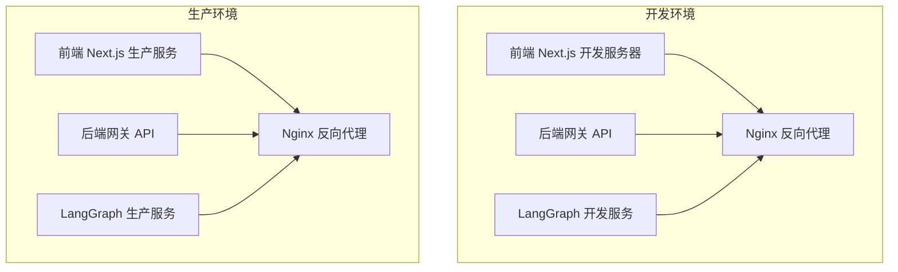
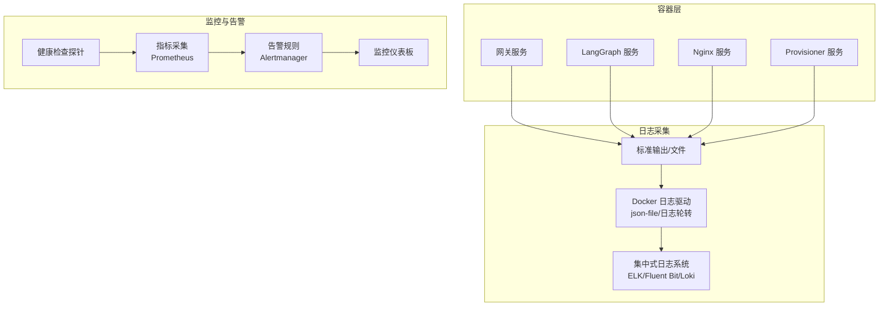
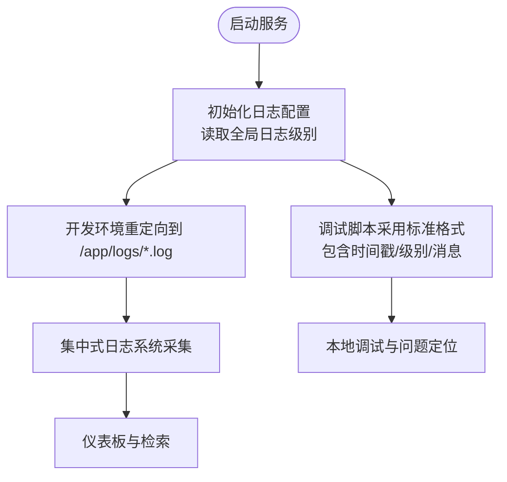
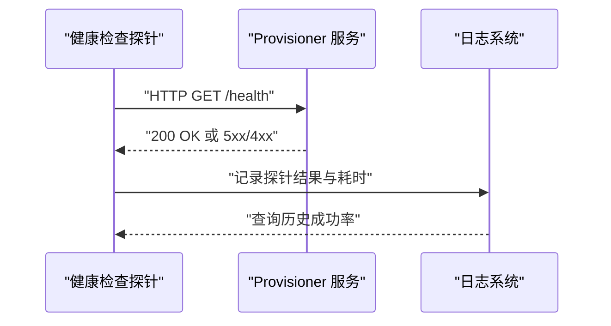
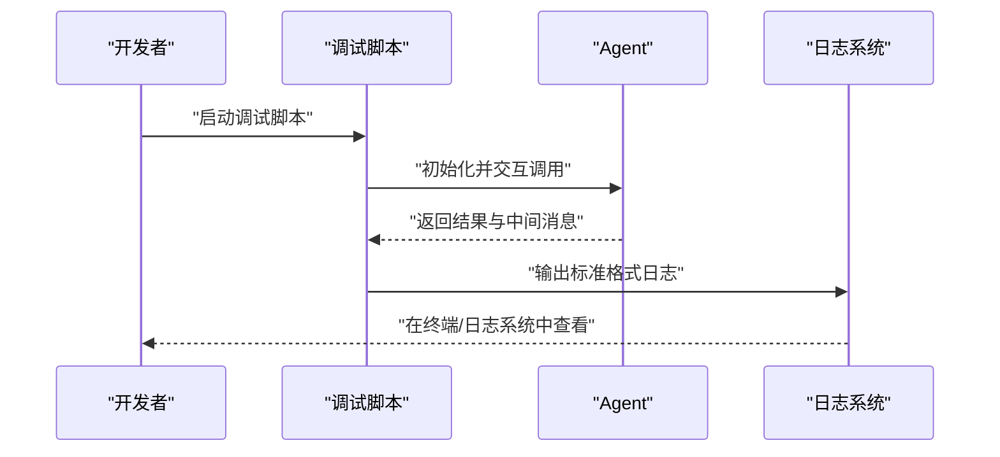
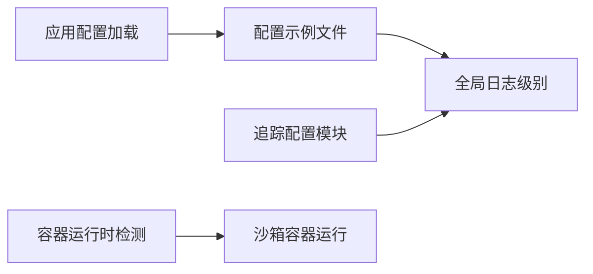

# 监控和日志

<cite>
**本文引用的文件**
- [config.example.yaml](file://config.example.yaml)
- [docker-compose.yaml](file://docker-compose.yaml)
- [docker-compose-dev.yaml](file://docker-compose-dev.yaml)
- [scripts/docker.sh](file://scripts/docker.sh)
- [scripts/start-daemon.sh](file://scripts/start-daemon.sh)
- [backend/app/gateway/config.py](file://backend/app/gateway/config.py)
- [backend/debug.py](file://backend/debug.py)
- [backend/docs/APPLE_CONTAINER.md](file://backend/docs/APPLE_CONTAINER.md)
- [backend/packages/harness/deerflow/config/app_config.py](file://backend/packages/harness/deerflow/config/app_config.py)
- [backend/packages/harness/deerflow/config/tracing_config.py](file://backend/packages/harness/deerflow/config/tracing_config.py)
- [backend/packages/harness/deerflow/community/aio_sandbox/local_backend.py](file://backend/packages/harness/deerflow/community/aio_sandbox/local_backend.py)
- [backend/packages/harness/deerflow/sandbox/local/local_sandbox.py](file://backend/packages/harness/deerflow/sandbox/local/local_sandbox.py)
- [frontend/src/components/ai-elements/web-preview.tsx](file://frontend/src/components/ai-elements/web-preview.tsx)
</cite>

## 目录
1. [简介](#简介)
2. [项目结构](#项目结构)
3. [核心组件](#核心组件)
4. [架构总览](#架构总览)
5. [详细组件分析](#详细组件分析)
6. [依赖分析](#依赖分析)
7. [性能考虑](#性能考虑)
8. [故障排查指南](#故障排查指南)
9. [结论](#结论)
10. [附录](#附录)

## 简介
本指南面向 DeerFlow 的运维与开发团队，系统化阐述监控与日志体系：包括各服务的日志输出格式与日志级别配置、日志轮转策略建议、健康检查配置、服务可用性监控与性能指标采集、Docker 日志驱动配置与集中式日志管理方案、告警机制设置、监控仪表板配置与关键指标定义、故障检测规则、调试模式启用与问题诊断工具、性能分析方法，以及容器资源限制、CPU/内存监控与磁盘空间管理。

## 项目结构
- 后端网关与 LangGraph 服务通过 Docker Compose 编排，分别在生产与开发环境使用不同的日志重定向与健康检查策略。
- 配置示例文件提供全局日志级别开关，便于统一控制后端模块日志输出。
- 前端提供控制台日志展示组件，用于在浏览器侧呈现运行时日志。
- 调试脚本提供本地调试时的标准日志格式与交互方式。

图表来源
- [docker-compose-dev.yaml:58-202](file://docker-compose-dev.yaml#L58-L202)
- [docker-compose.yaml:24-148](file://docker-compose.yaml#L24-L148)

章节来源
- [docker-compose-dev.yaml:1-216](file://docker-compose-dev.yaml#L1-L216)
- [docker-compose.yaml:1-183](file://docker-compose.yaml#L1-L183)

## 核心组件
- 日志级别与格式
  - 全局日志级别由配置示例文件中的字段控制，便于统一调整后端模块日志输出等级。
  - 调试脚本采用标准 Python logging 模块，格式包含时间戳、名称、级别与消息体，便于本地调试。
- 日志输出位置
  - 开发环境通过命令重定向将服务日志写入容器内 /app/logs 目录，便于挂载到宿主机或集中式日志系统。
  - 生产环境通过反向代理与后端服务的标准输出/错误输出进行日志采集。
- 健康检查
  - 生产与开发环境均对可选的 provisioner 服务配置了健康检查，使用 HTTP 探针定期探测 /health 路径。
- Docker 日志驱动
  - 默认使用 Docker 守护进程的日志驱动；可通过 Docker 日志驱动参数（如 json-file 的日志轮转）实现日志轮转与保留策略。
- 集中式日志管理
  - 建议将 /app/logs 或标准输出绑定到集中式日志系统（如 ELK、Fluent Bit、Vector、Loki+Promtail），并按服务与级别分类索引。
- 告警机制
  - 结合健康检查失败次数、日志中错误级别阈值、响应延迟与错误率等指标，配置告警规则（如 Prometheus Alertmanager 或平台内置告警）。
- 监控仪表板
  - 建议以服务维度（网关、LangGraph、Nginx、Provisioner）与关键指标（请求量、错误率、P95/P99 延迟、队列长度、线程数、CPU/内存/磁盘）构建仪表板。
- 资源限制与磁盘管理
  - 在 Docker Compose 中为各服务设置 CPU/内存限制，并结合宿主机磁盘配额与日志目录清理策略，保障稳定性。

章节来源
- [config.example.yaml:18-30](file://config.example.yaml#L18-L30)
- [backend/debug.py:28-32](file://backend/debug.py#L28-L32)
- [docker-compose-dev.yaml:87-162](file://docker-compose-dev.yaml#L87-L162)
- [docker-compose.yaml:175-179](file://docker-compose.yaml#L175-L179)

## 架构总览
下图展示了日志与监控在整体架构中的位置：服务通过 Docker Compose 运行，日志从容器标准输出/文件流向集中式日志系统，健康检查与探针为可用性监控提供数据来源，指标与告警驱动仪表板与自动化处置。

图表来源
- [docker-compose-dev.yaml:58-202](file://docker-compose-dev.yaml#L58-L202)
- [docker-compose.yaml:24-179](file://docker-compose.yaml#L24-L179)

## 详细组件分析

### 日志输出格式与日志级别配置
- 全局日志级别
  - 配置示例文件提供全局日志级别字段，用于控制 deerflow 模块的日志输出等级。
- 调试脚本日志格式
  - 使用标准 Python logging 模块，格式包含时间戳、名称、级别与消息体，便于本地调试与问题定位。
- 开发环境日志重定向
  - 前端、网关、LangGraph 服务通过启动命令将标准输出/错误输出重定向至 /app/logs 下的独立文件，便于集中采集与轮转。

图表来源
- [config.example.yaml:18-30](file://config.example.yaml#L18-L30)
- [backend/debug.py:28-32](file://backend/debug.py#L28-L32)
- [docker-compose-dev.yaml:87-162](file://docker-compose-dev.yaml#L87-L162)

章节来源
- [config.example.yaml:18-30](file://config.example.yaml#L18-L30)
- [backend/debug.py:28-32](file://backend/debug.py#L28-L32)
- [docker-compose-dev.yaml:87-162](file://docker-compose-dev.yaml#L87-L162)

### 日志轮转策略
- Docker json-file 驱动轮转
  - 建议在 Docker daemon.json 中配置每文件大小与备份数量，确保日志不会无限增长。
- 文件级轮转
  - 将 /app/logs 挂载到宿主机后，使用 logrotate 对 *.log 文件执行轮转与压缩归档。
- 清理策略
  - 设置最大保留天数与最大容量阈值，避免磁盘空间被占满。

章节来源
- [docker-compose-dev.yaml:87-162](file://docker-compose-dev.yaml#L87-L162)
- [docker-compose.yaml:65-117](file://docker-compose.yaml#L65-L117)

### 健康检查配置与可用性监控
- provisioner 健康检查
  - 生产与开发环境均对 provisioner 配置了 HTTP 健康检查，探测 /health，包含间隔、超时与重试次数。
- 网关与 LangGraph
  - 建议在生产环境为网关与 LangGraph 添加自定义 /health 接口与探针，纳入统一健康检查体系。
- 可用性指标
  - 健康检查成功率、平均恢复时间（MTTR）、服务可用性百分比等。

图表来源
- [docker-compose.yaml:175-179](file://docker-compose.yaml#L175-L179)
- [docker-compose-dev.yaml:51-56](file://docker-compose-dev.yaml#L51-L56)

章节来源
- [docker-compose.yaml:175-179](file://docker-compose.yaml#L175-L179)
- [docker-compose-dev.yaml:51-56](file://docker-compose-dev.yaml#L51-L56)

### 性能指标采集
- 关键指标
  - 请求量、错误率、P95/P99 延迟、并发连接数、队列长度、线程池状态、CPU 使用率、内存占用、磁盘 IO、日志错误条数。
- 采集方式
  - Nginx 访问日志与错误日志、应用标准输出/文件日志、容器资源指标（cAdvisor/Prometheus Node Exporter）。
- 指标存储与可视化
  - 使用 Prometheus 收集指标，Grafana 构建仪表板，结合 Alertmanager 发送告警。

章节来源
- [docker-compose-dev.yaml:58-202](file://docker-compose-dev.yaml#L58-L202)
- [docker-compose.yaml:24-148](file://docker-compose.yaml#L24-L148)

### Docker 日志驱动配置与集中式日志管理
- 日志驱动
  - 使用默认 json-file 驱动，结合轮转参数与宿主机 logrotate 实现长期留存。
- 集中式日志
  - 通过 Fluent Bit/Vector/Flume 等采集器收集 /app/logs 与标准输出，发送到 Elasticsearch/OpenSearch 或 Loki。
- 日志分类与检索
  - 按服务名、容器名、级别、时间范围、关键词进行过滤与聚合。

章节来源
- [docker-compose-dev.yaml:87-162](file://docker-compose-dev.yaml#L87-L162)
- [docker-compose.yaml:65-117](file://docker-compose.yaml#L65-L117)

### 告警机制设置
- 告警规则示例
  - 健康检查连续失败超过阈值、错误率超过阈值、P99 延迟超过阈值、磁盘使用率超过阈值、日志中出现特定错误关键字。
- 告警通道
  - 邮件、Slack、Webhook 等。
- 自动化处置
  - 结合告警触发自动扩容、重启、切换上游服务等动作。

章节来源
- [docker-compose.yaml:175-179](file://docker-compose.yaml#L175-L179)
- [docker-compose-dev.yaml:51-56](file://docker-compose-dev.yaml#L51-L56)

### 监控仪表板配置与关键指标
- 仪表板建议
  - 服务可用性、吞吐量、错误率、延迟分布、资源使用趋势、日志错误分布、健康检查状态。
- 指标定义
  - 通过 Prometheus 查询语言表达式定义关键指标，如请求速率、错误率、延迟分位数、CPU/内存/磁盘利用率。

章节来源
- [docker-compose-dev.yaml:58-202](file://docker-compose-dev.yaml#L58-L202)
- [docker-compose.yaml:24-148](file://docker-compose.yaml#L24-L148)

### 故障检测规则
- 规则示例
  - 健康检查失败次数、错误日志条数、响应时间异常、资源使用异常、磁盘空间不足。
- 规则落地
  - 通过告警系统与自动化编排工具联动，快速隔离与恢复。

章节来源
- [docker-compose.yaml:175-179](file://docker-compose.yaml#L175-L179)
- [docker-compose-dev.yaml:51-56](file://docker-compose-dev.yaml#L51-L56)

### 调试模式启用与问题诊断
- 本地调试
  - 使用调试脚本在本地启动带断点的会话，查看标准日志格式，逐步排查问题。
- 开发环境日志
  - 通过 docker-compose-dev.yaml 的日志重定向与 scripts/docker.sh 提供的日志查看命令，实时跟踪多服务日志。
- 前端控制台
  - 前端组件支持在界面中展示控制台日志，辅助前端侧问题定位。

图表来源
- [backend/debug.py:35-88](file://backend/debug.py#L35-L88)
- [scripts/docker.sh:232-264](file://scripts/docker.sh#L232-L264)
- [frontend/src/components/ai-elements/web-preview.tsx:237-258](file://frontend/src/components/ai-elements/web-preview.tsx#L237-L258)

章节来源
- [backend/debug.py:1-92](file://backend/debug.py#L1-L92)
- [scripts/docker.sh:232-264](file://scripts/docker.sh#L232-L264)
- [frontend/src/components/ai-elements/web-preview.tsx:210-263](file://frontend/src/components/ai-elements/web-preview.tsx#L210-L263)

### 性能分析方法
- 端到端链路追踪
  - 通过配置追踪开关与密钥，启用链路追踪（如 LangSmith），在分布式场景下定位瓶颈。
- 资源剖析
  - 使用容器资源指标与应用内部中间件统计（如令牌用量中间件）进行性能归因。
- 负载测试
  - 使用压测工具模拟峰值流量，观察延迟与错误率变化，识别瓶颈。

章节来源
- [config.example.yaml:24-30](file://config.example.yaml#L24-L30)
- [backend/packages/harness/deerflow/config/tracing_config.py:70-94](file://backend/packages/harness/deerflow/config/tracing_config.py#L70-L94)

### 容器资源限制、CPU 与内存监控、磁盘空间管理
- 资源限制
  - 在 Docker Compose 中为各服务设置 CPU/内存限制，防止资源争抢。
- 监控
  - 通过 Prometheus 与 Grafana 监控 CPU/内存/磁盘使用率与队列长度。
- 磁盘管理
  - 控制日志文件大小与数量，定期清理过期日志与临时文件，设置磁盘配额与告警阈值。

章节来源
- [docker-compose-dev.yaml:58-202](file://docker-compose-dev.yaml#L58-L202)
- [docker-compose.yaml:24-148](file://docker-compose.yaml#L24-L148)

## 依赖分析
- 配置与日志
  - 配置示例文件提供全局日志级别字段，影响后端模块日志输出。
  - 应用配置加载模块会在版本不匹配时发出警告，提示升级配置。
- 追踪配置
  - 追踪配置模块负责解析环境变量并判断是否启用链路追踪，影响可观测性数据流。
- 容器运行时检测
  - 在 macOS 上优先选择 Apple Container，否则回退到 Docker，影响沙箱容器运行效率与资源占用。

图表来源
- [config.example.yaml:18-30](file://config.example.yaml#L18-L30)
- [backend/packages/harness/deerflow/config/app_config.py:145-182](file://backend/packages/harness/deerflow/config/app_config.py#L145-L182)
- [backend/packages/harness/deerflow/config/tracing_config.py:70-94](file://backend/packages/harness/deerflow/config/tracing_config.py#L70-L94)
- [backend/packages/harness/deerflow/community/aio_sandbox/local_backend.py:64-73](file://backend/packages/harness/deerflow/community/aio_sandbox/local_backend.py#L64-L73)

章节来源
- [config.example.yaml:18-30](file://config.example.yaml#L18-L30)
- [backend/packages/harness/deerflow/config/app_config.py:145-182](file://backend/packages/harness/deerflow/config/app_config.py#L145-L182)
- [backend/packages/harness/deerflow/config/tracing_config.py:70-94](file://backend/packages/harness/deerflow/config/tracing_config.py#L70-L94)
- [backend/packages/harness/deerflow/community/aio_sandbox/local_backend.py:64-73](file://backend/packages/harness/deerflow/community/aio_sandbox/local_backend.py#L64-L73)

## 性能考虑
- 日志级别与开销
  - 将日志级别设为 info 或更高，避免 debug 级别带来的额外开销。
- 日志轮转与磁盘 IO
  - 合理设置轮转参数，减少频繁写入对磁盘的影响。
- 资源限制与隔离
  - 为各服务设置合理的 CPU/内存上限，避免单个服务拖垮整个集群。
- 追踪与采样
  - 在高负载场景下降低追踪采样率，平衡可观测性与性能。

## 故障排查指南
- 快速定位
  - 使用 scripts/docker.sh 查看指定服务日志，或查看开发环境日志重定向文件。
  - 在本地使用调试脚本进行断点调试，观察标准日志输出。
- 健康检查失败
  - 检查 provisioner 的 /health 接口与依赖服务连通性，确认探针配置与重试策略。
- 配置问题
  - 若提示配置版本落后，使用配置升级脚本合并新字段并更新版本号。
- 资源不足
  - 检查容器资源限制与宿主机磁盘配额，清理过期日志与临时文件。

章节来源
- [scripts/docker.sh:232-264](file://scripts/docker.sh#L232-L264)
- [scripts/start-daemon.sh:123-139](file://scripts/start-daemon.sh#L123-L139)
- [backend/debug.py:1-92](file://backend/debug.py#L1-L92)
- [backend/packages/harness/deerflow/config/app_config.py:145-182](file://backend/packages/harness/deerflow/config/app_config.py#L145-L182)

## 结论
通过统一的日志级别配置、规范的日志输出与轮转策略、完善的健康检查与可用性监控、清晰的指标定义与告警规则、以及容器资源限制与磁盘管理，DeerFlow 可以在开发与生产环境中保持稳定、可观测与可维护。建议尽快落地集中式日志系统与监控仪表板，并持续优化资源配额与追踪策略，以应对业务增长与复杂度提升。

## 附录
- 网关配置（主机与端口）
  - 网关服务监听主机与端口由环境变量控制，便于在不同部署环境中灵活配置。
- Apple Container 支持
  - 在 macOS 上优先使用 Apple Container，提供更好的性能与更低的资源占用，同时保持向后兼容。

章节来源
- [backend/app/gateway/config.py:1-28](file://backend/app/gateway/config.py#L1-L28)
- [backend/docs/APPLE_CONTAINER.md:1-61](file://backend/docs/APPLE_CONTAINER.md#L1-L61)