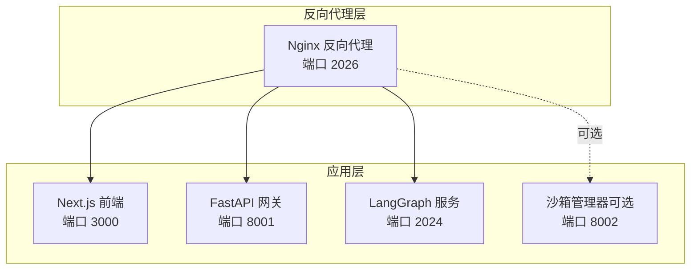
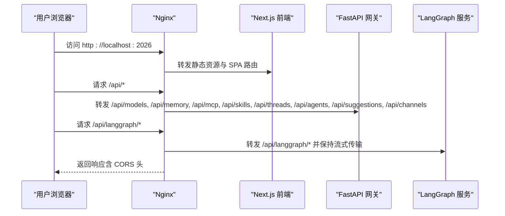
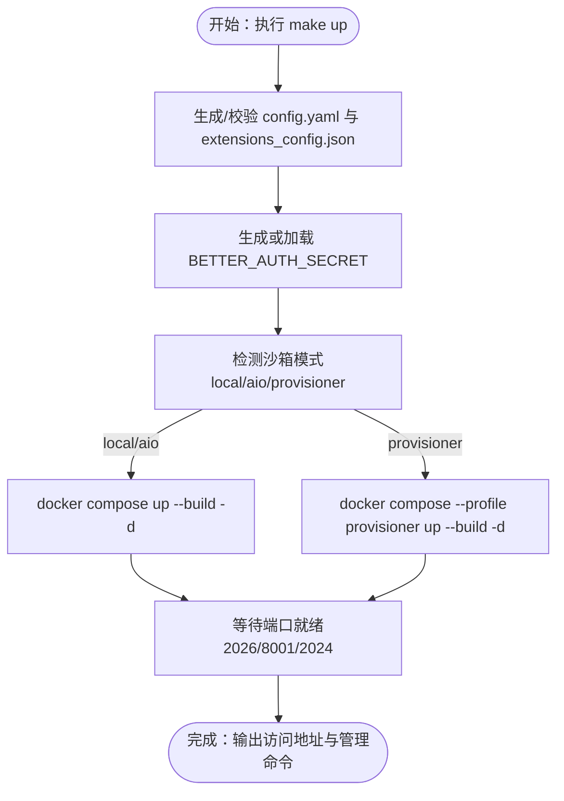
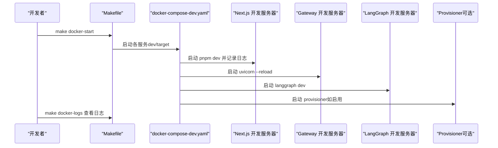
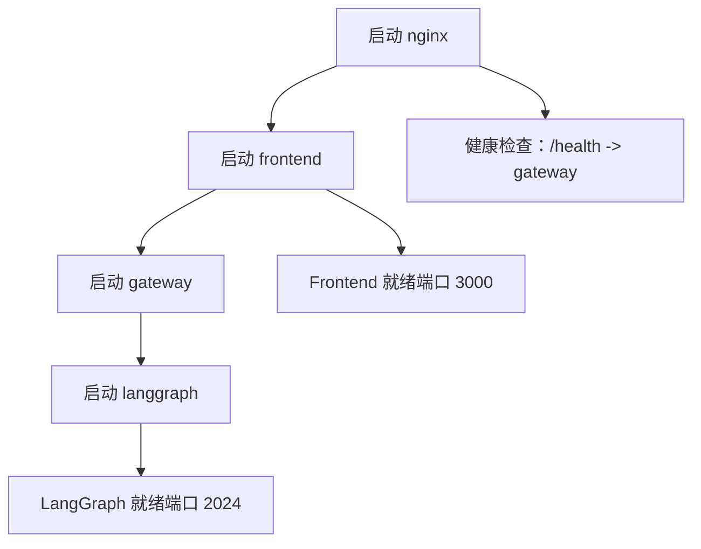
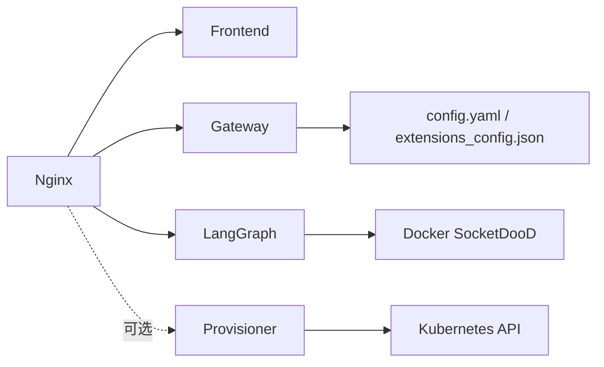

# 部署和运维

<cite>
**本文引用的文件**
- [docker-compose.yaml](file://docker/docker-compose.yaml)
- [docker-compose-dev.yaml](file://docker/docker-compose-dev.yaml)
- [nginx.conf](file://docker/nginx/nginx.conf)
- [nginx.local.conf](file://docker/nginx/nginx.local.conf)
- [Dockerfile（后端）](file://backend/Dockerfile)
- [Dockerfile（前端）](file://frontend/Dockerfile)
- [部署脚本 deploy.sh](file://scripts/deploy.sh)
- [守护进程启动脚本 start-daemon.sh](file://scripts/start-daemon.sh)
- [等待端口脚本 wait-for-port.sh](file://scripts/wait-for-port.sh)
- [Makefile](file://Makefile)
- [配置示例 config.yaml](file://config.example.yaml)
- [扩展配置示例 extensions_config.json](file://extensions_config.example.json)
- [网关配置 config.py](file://backend/app/gateway/config.py)
- [网关应用 app.py](file://backend/app/gateway/app.py)
</cite>

## 目录
1. [简介](#简介)
2. [项目结构](#项目结构)
3. [核心组件](#核心组件)
4. [架构总览](#架构总览)
5. [详细组件分析](#详细组件分析)
6. [依赖关系分析](#依赖关系分析)
7. [性能考虑](#性能考虑)
8. [故障排查指南](#故障排查指南)
9. [结论](#结论)
10. [附录](#附录)

## 简介
本指南面向运维与平台工程团队，提供 DeerFlow 在生产与开发环境中的完整部署与运维操作手册。内容涵盖：
- Docker 生产与开发部署流程
- 环境变量与配置文件管理
- 服务启动顺序、健康检查与故障恢复
- 性能监控、日志管理、备份策略与安全加固
- 容量规划与运维自动化建议
- 不同部署模式的优缺点与适用场景

## 项目结构
DeerFlow 的部署以容器化为核心，采用多服务编排（nginx 反向代理、Next.js 前端、FastAPI 网关、LangGraph 服务器），并支持可选的沙箱管理器（provisioner）用于 Kubernetes 沙箱模式。

图表来源
- [docker-compose.yaml:24-183](file://docker/docker-compose.yaml#L24-L183)
- [docker-compose-dev.yaml:16-216](file://docker/docker-compose-dev.yaml#L16-L216)

章节来源
- [docker-compose.yaml:1-183](file://docker/docker-compose.yaml#L1-L183)
- [docker-compose-dev.yaml:1-216](file://docker/docker-compose-dev.yaml#L1-L216)

## 核心组件
- 反向代理（Nginx）
  - 负责路径路由、CORS 处理、长连接与流式传输支持、健康检查转发等。
  - 生产使用 [nginx.conf](file://docker/nginx/nginx.conf)，开发使用 [nginx.local.conf](file://docker/nginx/nginx.local.conf)。
- 前端（Next.js）
  - 生产镜像通过 [Dockerfile（前端）](file://frontend/Dockerfile) 构建，运行时命令由编排文件指定。
- 网关（FastAPI）
  - 提供自定义 API：模型、MCP、记忆、技能、工件、上传、线程、代理、建议、通道等；健康检查端点位于 /health。
- LangGraph 服务
  - 作为推理与会话状态管理服务，提供 /api/langgraph/* 路由转发。
- 沙箱管理器（Provisioner，可选）
  - 在 Kubernetes 模式下为每个沙箱分配专用 Pod，提供 /api/sandboxes 接口。

章节来源
- [nginx.conf:33-231](file://docker/nginx/nginx.conf#L33-L231)
- [nginx.local.conf:30-214](file://docker/nginx/nginx.local.conf#L30-L214)
- [Dockerfile（前端）:1-36](file://frontend/Dockerfile#L1-L36)
- [网关应用 app.py:187-196](file://backend/app/gateway/app.py#L187-L196)
- [docker-compose.yaml:26-148](file://docker/docker-compose.yaml#L26-L148)

## 架构总览
下图展示生产环境的服务交互与数据流：

图表来源
- [nginx.conf:55-229](file://docker/nginx/nginx.conf#L55-L229)
- [网关应用 app.py:156-186](file://backend/app/gateway/app.py#L156-L186)

章节来源
- [nginx.conf:33-231](file://docker/nginx/nginx.conf#L33-L231)
- [网关应用 app.py:73-196](file://backend/app/gateway/app.py#L73-L196)

## 详细组件分析

### 生产部署流程（Makefile + docker-compose + deploy.sh）
- 使用 Makefile 的 make up 触发生产部署脚本 deploy.sh。
- deploy.sh 负责：
  - 自动准备 DEER_FLOW_HOME、DEER_FLOW_CONFIG_PATH、DEER_FLOW_EXTENSIONS_CONFIG_PATH、BETTER_AUTH_SECRET 等关键环境变量。
  - 检测沙箱模式（local/aio/provisioner），按需启用 provisioner profile。
  - 校验 Docker Socket 权限与可用性（DooD）。
  - 启动容器并输出访问信息。

图表来源
- [Makefile:173-180](file://Makefile#L173-L180)
- [部署脚本 deploy.sh:160-213](file://scripts/deploy.sh#L160-L213)
- [docker-compose.yaml:162-198](file://docker/docker-compose.yaml#L162-L198)

章节来源
- [Makefile:173-180](file://Makefile#L173-L180)
- [部署脚本 deploy.sh:1-213](file://scripts/deploy.sh#L1-L213)
- [docker-compose.yaml:1-183](file://docker/docker-compose.yaml#L1-L183)

### 开发部署流程（Makefile + docker-compose-dev + 日志挂载）
- 使用 docker-compose-dev.yaml 启动开发环境，包含 provisioner（可选）、Nginx、前端（dev）、网关（dev）、LangGraph（dev）。
- 前端与后端均挂载源码目录，支持热重载；日志统一写入 /app/logs。
- 通过 Makefile 的 docker-start/docker-logs 等命令进行管理。

图表来源
- [docker-compose-dev.yaml:78-202](file://docker/docker-compose-dev.yaml#L78-L202)
- [Makefile:151-168](file://Makefile#L151-L168)

章节来源
- [docker-compose-dev.yaml:1-216](file://docker/docker-compose-dev.yaml#L1-L216)
- [Makefile:147-168](file://Makefile#L147-L168)

### 服务启动顺序与健康检查
- 启动顺序（生产）：nginx → frontend → gateway → langgraph；nginx 依赖 frontend/gateway/langgraph。
- 健康检查：
  - nginx：通过 /health 转发到 gateway。
  - provisioner：内置健康检查，测试 /health。
- 故障恢复：
  - compose 文件设置 restart: unless-stopped，容器异常退出后自动重启。
  - deploy.sh 与 start-daemon.sh 提供失败清理与提示。

图表来源
- [docker-compose.yaml:33-99](file://docker/docker-compose.yaml#L33-L99)
- [网关应用 app.py:187-196](file://backend/app/gateway/app.py#L187-L196)
- [docker-compose-dev.yaml:51-56](file://docker/docker-compose-dev.yaml#L51-L56)

章节来源
- [docker-compose.yaml:26-148](file://docker/docker-compose.yaml#L26-L148)
- [网关应用 app.py:187-196](file://backend/app/gateway/app.py#L187-L196)
- [docker-compose-dev.yaml:17-56](file://docker/docker-compose-dev.yaml#L17-L56)

### 配置与环境变量
- 关键环境变量（生产）：
  - DEER_FLOW_HOME：运行时数据目录，默认仓库根/backend/.deer-flow。
  - DEER_FLOW_CONFIG_PATH / DEER_FLOW_EXTENSIONS_CONFIG_PATH：配置文件路径。
  - DEER_FLOW_DOCKER_SOCKET：DooD 所需的 Docker Socket。
  - DEER_FLOW_REPO_ROOT：仓库根（用于 DooD 中的 skills 主机路径）。
  - BETTER_AUTH_SECRET：前端认证密钥（持久化于 DEER_FLOW_HOME）。
- 配置文件：
  - config.yaml：模型、工具、沙箱、记忆、标题生成、摘要、检查点等。
  - extensions_config.json：MCP 服务器与技能扩展配置。
- 网关配置：
  - 支持从环境变量覆盖 host/port/cors_origins。

章节来源
- [docker-compose.yaml:11-18](file://docker/docker-compose.yaml#L11-L18)
- [部署脚本 deploy.sh:29-101](file://scripts/deploy.sh#L29-L101)
- [配置示例 config.yaml:1-624](file://config.example.yaml#L1-L624)
- [扩展配置示例 extensions_config.json:1-42](file://extensions_config.example.json#L1-L42)
- [网关配置 config.py:6-27](file://backend/app/gateway/config.py#L6-L27)

### 反向代理（Nginx）配置要点
- 路由规则：
  - /api/langgraph/* → 重写为 / 再转发至 langgraph。
  - /api/models, /api/memory, /api/mcp, /api/skills, /api/agents, /api/threads, /api/suggestions, /api/channels → 转发至 gateway。
  - /api/sandboxes（可选）→ 转发至 provisioner。
  - 其余请求 → 转发至 frontend。
- 流式传输与超时：
  - 对 SSE/流式接口关闭缓冲、设置长超时与分块传输编码。
- CORS：
  - 统一在 nginx 层添加 CORS 头，避免上游重复。

章节来源
- [nginx.conf:55-229](file://docker/nginx/nginx.conf#L55-L229)
- [nginx.local.conf:52-212](file://docker/nginx/nginx.local.conf#L52-L212)

### 容器镜像与端口
- 后端镜像（backend/Dockerfile）：
  - 安装 Node.js、Docker CLI（DooD）、uv，并在容器内安装 Python 依赖。
  - 暴露端口 8001（gateway）、2024（langgraph）。
- 前端镜像（frontend/Dockerfile）：
  - 支持 dev/prod 两阶段构建，prod 运行时使用 pnpm start。

章节来源
- [Dockerfile（后端）:1-40](file://backend/Dockerfile#L1-L40)
- [Dockerfile（前端）:1-36](file://frontend/Dockerfile#L1-L36)

## 依赖关系分析
- 组件耦合：
  - nginx 依赖 gateway、langgraph、frontend；provisioner 为可选依赖。
  - gateway 与 langgraph 通过 nginx 路由隔离，独立进程与缓存。
- 外部依赖：
  - Docker Socket（DooD）用于沙箱容器管理。
  - MCP 服务器（通过 extensions_config.json 配置）。
  - 可选 Kubernetes API（provisioner 模式）。

图表来源
- [docker-compose.yaml:26-174](file://docker/docker-compose.yaml#L26-L174)
- [docker-compose-dev.yaml:21-50](file://docker/docker-compose-dev.yaml#L21-L50)
- [配置示例 config.yaml:312-371](file://config.example.yaml#L312-L371)
- [扩展配置示例 extensions_config.json:1-42](file://extensions_config.example.json#L1-L42)

章节来源
- [docker-compose.yaml:24-183](file://docker/docker-compose.yaml#L24-L183)
- [docker-compose-dev.yaml:16-216](file://docker/docker-compose-dev.yaml#L16-L216)

## 性能考虑
- 反向代理优化
  - 长连接与流式传输：对 SSE/流式接口关闭缓冲、设置长超时。
  - 分块传输编码：提升大文件与实时数据传输效率。
- 应用层优化
  - 前端生产镜像：预构建产物，减少冷启动时间。
  - 后端 uv 工具链：更快的依赖安装与运行。
- 沙箱模式选择
  - local：低延迟、高吞吐，适合本地与小规模部署。
  - aio：隔离性好，资源可控，适合中大规模。
  - provisioner：Kubernetes 弹性扩缩容，适合高可用与多租户场景。

章节来源
- [nginx.conf:69-81](file://docker/nginx/nginx.conf#L69-L81)
- [Dockerfile（后端）:22-23](file://backend/Dockerfile#L22-L23)
- [配置示例 config.yaml:316-371](file://config.example.yaml#L316-L371)

## 故障排查指南
- 常见问题定位
  - 端口未就绪：使用 wait-for-port.sh 或 start-daemon.sh 的等待逻辑辅助诊断。
  - 配置错误：查看 logs 下对应服务日志（langgraph/gateway/frontend/nginx）。
  - Docker Socket 缺失：确认 DEER_FLOW_DOCKER_SOCKET 是否正确挂载。
- 健康检查
  - /health 检查：由 nginx 转发到 gateway，若失败需检查 gateway 启动日志。
  - provisioner 健康：直接访问 /health，观察 retries 与 interval。
- 清理与回滚
  - 使用 make down 或 deploy.sh down 停止并移除容器。
  - start-daemon.sh 提供失败清理钩子，避免僵尸进程。

章节来源
- [等待端口脚本 wait-for-port.sh:1-62](file://scripts/wait-for-port.sh#L1-L62)
- [守护进程启动脚本 start-daemon.sh:56-86](file://scripts/start-daemon.sh#L56-L86)
- [docker-compose.yaml:175-179](file://docker/docker-compose.yaml#L175-L179)
- [网关应用 app.py:187-196](file://backend/app/gateway/app.py#L187-L196)

## 结论
通过上述部署与运维方案，可在不同环境中稳定运行 DeerFlow：
- 开发环境强调快速迭代与可观测性；
- 生产环境强调隔离、弹性与可观测性；
- 按需启用沙箱管理器以满足高可用与多租户需求；
- 借助 Nginx 的统一路由与健康检查，实现清晰的流量治理与故障恢复。

## 附录

### 环境变量与配置清单
- 生产关键变量
  - DEER_FLOW_HOME、DEER_FLOW_CONFIG_PATH、DEER_FLOW_EXTENSIONS_CONFIG_PATH、DEER_FLOW_DOCKER_SOCKET、DEER_FLOW_REPO_ROOT、BETTER_AUTH_SECRET
- 网关运行参数
  - GATEWAY_HOST、GATEWAY_PORT、CORS_ORIGINS
- MCP 与扩展
  - extensions_config.json 中的 mcpServers 与 skills 字段

章节来源
- [docker-compose.yaml:11-18](file://docker/docker-compose.yaml#L11-L18)
- [网关配置 config.py:17-27](file://backend/app/gateway/config.py#L17-L27)
- [扩展配置示例 extensions_config.json:1-42](file://extensions_config.example.json#L1-L42)

### 部署模式对比与适用场景
- local 沙箱
  - 优点：低延迟、易调试、资源占用少
  - 适用：开发测试、小规模内部部署
- aio 沙箱（DooD）
  - 优点：容器隔离、资源限制、便于横向扩展
  - 适用：中大型企业、需要更强隔离的场景
- provisioner 沙箱（Kubernetes）
  - 优点：弹性扩缩容、多租户隔离、与云原生生态集成
  - 适用：生产级高可用、多团队共享资源

章节来源
- [配置示例 config.yaml:316-371](file://config.example.yaml#L316-L371)
- [docker-compose.yaml:150-174](file://docker/docker-compose.yaml#L150-L174)