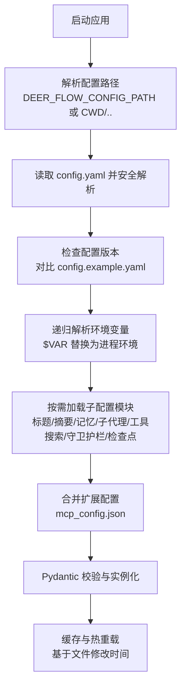
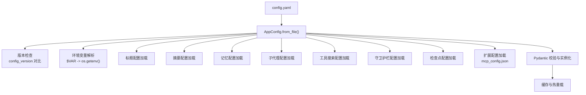
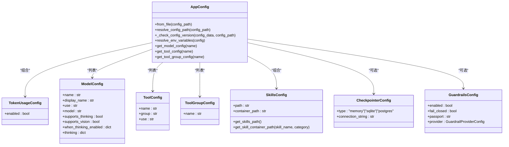

# 主配置文件详解

<cite>
**本文引用的文件**
- [config.example.yaml](file://config.example.yaml)
- [app_config.py](file://backend/packages/harness/deerflow/config/app_config.py)
- [token_usage_config.py](file://backend/packages/harness/deerflow/config/token_usage_config.py)
- [model_config.py](file://backend/packages/harness/deerflow/config/model_config.py)
- [tool_config.py](file://backend/packages/harness/deerflow/config/tool_config.py)
- [skills_config.py](file://backend/packages/harness/deerflow/config/skills_config.py)
- [checkpointer_config.py](file://backend/packages/harness/deerflow/config/checkpointer_config.py)
- [guardrails_config.py](file://backend/packages/harness/deerflow/config/guardrails_config.py)
- [config-upgrade.sh](file://scripts/config-upgrade.sh)
- [test_config_version.py](file://backend/tests/test_config_version.py)
</cite>

## 目录
1. [简介](#简介)
2. [项目结构与定位](#项目结构与定位)
3. [核心组件概览](#核心组件概览)
4. [架构总览](#架构总览)
5. [详细组件解析](#详细组件解析)
6. [依赖关系分析](#依赖关系分析)
7. [性能与可靠性考量](#性能与可靠性考量)
8. [故障排查指南](#故障排查指南)
9. [结论](#结论)
10. [附录：配置示例与最佳实践](#附录配置示例与最佳实践)

## 简介
本文件面向 DeerFlow 的主配置文件 config.yaml，系统性阐述其整体结构、各顶级配置块的作用与数据模型、配置版本管理策略、环境变量替换规则、继承与合并机制、以及配置验证与常见错误排查方法。目标是帮助使用者在不深入源码的情况下，也能正确理解并高效维护配置。

## 项目结构与定位
- 配置文件位置与加载优先级
  - 默认位置：当前工作目录或其父目录下的 config.yaml
  - 可通过环境变量 DEER_FLOW_CONFIG_PATH 指定绝对或相对路径
  - 加载时会进行配置版本检查，并支持环境变量替换
- 示例配置：仓库提供 config.example.yaml，用于生成/升级用户配置
- 扩展配置：MCP 服务器与技能状态位于独立的 mcp_config.json（由扩展配置模块加载）

图表来源
- [app_config.py:45-131](file://backend/packages/harness/deerflow/config/app_config.py#L45-L131)
- [config.example.yaml:1-20](file://config.example.yaml#L1-L20)

章节来源
- [app_config.py:45-131](file://backend/packages/harness/deerflow/config/app_config.py#L45-L131)
- [config.example.yaml:1-20](file://config.example.yaml#L1-L20)

## 核心组件概览
- 全局配置项
  - 配置版本：用于检测过期配置并提示升级
  - 日志级别：控制 deerflow 模块的日志输出粒度
  - 令牌用量追踪：开启后通过中间件记录输入/输出/总计 token 使用情况
- 模型配置：声明可用的大模型列表及其特性（是否支持思考/推理/视觉）
- 工具与分组：声明可用工具及分组，便于权限与组织管理
- 工具搜索（延迟加载）：在工具数量较多时，将 MCP 工具延迟到运行时发现
- 沙箱配置：本地执行或容器沙箱（Docker/Apple Container/AIO）
- 技能配置：宿主与容器中的技能目录映射
- 标题生成与摘要：自动对话标题生成与长会话摘要策略
- 记忆：全局记忆存储与注入策略
- 检查点：LangGraph 状态持久化（内存/SQLite/PostgreSQL）
- 守卫护栏：工具调用前的授权中间件（内置白名单/OAP/自定义）
- 扩展配置：MCP 服务器与技能状态（独立 JSON 文件）

章节来源
- [app_config.py:30-44](file://backend/packages/harness/deerflow/config/app_config.py#L30-L44)
- [config.example.yaml:10-624](file://config.example.yaml#L10-L624)

## 架构总览
下图展示配置文件加载与验证的关键流程，以及与各子配置模块的关系：

图表来源
- [app_config.py:74-131](file://backend/packages/harness/deerflow/config/app_config.py#L74-L131)
- [app_config.py:133-201](file://backend/packages/harness/deerflow/config/app_config.py#L133-L201)

章节来源
- [app_config.py:74-131](file://backend/packages/harness/deerflow/config/app_config.py#L74-L131)
- [app_config.py:133-201](file://backend/packages/harness/deerflow/config/app_config.py#L133-L201)

## 详细组件解析

### 全局配置块
- 配置版本（config_version）
  - 类型：整数
  - 作用：当配置模式变更时递增，用于检测过期配置
  - 行为：加载时与示例配置比较，若小于示例版本则发出警告
  - 升级方式：提供脚本自动迁移与字段合并
- 日志级别（log_level）
  - 类型：字符串
  - 取值：debug/info/warning/error
  - 作用：控制 deerflow 模块的日志输出粒度
- 令牌用量追踪（token_usage.enabled）
  - 类型：布尔
  - 作用：启用后通过中间件记录每次模型调用的 token 使用情况（输入/输出/总计），日志级别为 info

章节来源
- [config.example.yaml:10-30](file://config.example.yaml#L10-L30)
- [app_config.py:133-176](file://backend/packages/harness/deerflow/config/app_config.py#L133-L176)
- [token_usage_config.py:4-8](file://backend/packages/harness/deerflow/config/token_usage_config.py#L4-L8)

### 模型配置（models）
- 数据模型：ModelConfig
  - 关键字段
    - name/display_name/description：唯一标识与显示信息
    - use：类路径字符串，指向具体模型提供方实现
    - model：模型名称
    - use_responses_api/output_version：OpenAI Responses API 相关
    - supports_thinking/supports_reasoning_effort/supports_vision：能力标注
    - when_thinking_enabled/thinking：思考模式相关额外参数
    - 其他：透传给底层模型客户端的额外参数
- 建议
  - 明确标注模型能力，避免运行时因能力不匹配导致错误
  - 思考模式需确保下游模型与网关支持相应参数

章节来源
- [model_config.py:4-38](file://backend/packages/harness/deerflow/config/model_config.py#L4-L38)
- [config.example.yaml:32-216](file://config.example.yaml#L32-L216)

### 工具与分组（tools/tool_groups）
- 工具分组（ToolGroupConfig）
  - name：分组唯一标识
- 工具（ToolConfig）
  - name/group/use：工具唯一标识、所属分组、类路径
  - 支持额外字段透传至工具实现
- 建议
  - 将工具按功能划分为 web/file/bash 等分组，便于权限与访问控制
  - 使用统一的沙箱工具集时，注意权限最小化原则

章节来源
- [tool_config.py:4-21](file://backend/packages/harness/deerflow/config/tool_config.py#L4-L21)
- [config.example.yaml:218-302](file://config.example.yaml#L218-L302)

### 工具搜索（tool_search）
- 功能：延迟加载 MCP 工具，减少上下文占用并提升工具选择准确性
- 配置项：enabled（布尔）
- 建议：当 MCP 工具数量较多时启用，配合工具搜索工具在运行时动态发现

章节来源
- [config.example.yaml:304-314](file://config.example.yaml#L304-L314)

### 沙箱配置（sandbox）
- 三种模式
  - 本地沙箱：直接在主机执行
  - 容器沙箱：Docker 或 Apple Container（平台自动选择）
  - Provisioner 管理沙箱：docker-compose-dev，按 sandbox_id 分配 Pod
- 可选参数
  - image/port/replicas/container_prefix/mounts/environment 等
- 建议
  - 开发环境优先本地沙箱；生产或隔离需求使用容器沙箱
  - 合理设置并发副本与端口，避免资源争用

章节来源
- [config.example.yaml:316-371](file://config.example.yaml#L316-L371)

### 子代理配置（subagents）
- 用途：为引导代理委派的后台工作者配置超时策略
- 配置项
  - timeout_seconds：全局默认超时（秒）
  - agents.*.timeout_seconds：按代理名覆盖
- 建议
  - 复杂任务适当提高超时；快速命令保持较短超时

章节来源
- [config.example.yaml:373-388](file://config.example.yaml#L373-L388)

### ACP 代理配置（acp_agents）
- 用途：为内置 invoke_acp_agent 工具配置外部 ACP 兼容代理
- 配置项
  - command/args/description/model/auto_approve_permissions 等
- 建议
  - 使用官方 ACP 适配器或第三方实现，确保权限请求可被正确处理

章节来源
- [config.example.yaml:390-412](file://config.example.yaml#L390-L412)

### 技能配置（skills）
- 关键字段
  - path：宿主技能目录（相对或绝对）
  - container_path：容器内挂载路径（默认 /mnt/skills）
- 解析逻辑
  - 若未指定 path，则依据后端约定推导默认路径
  - 提供按技能名与分类拼接容器路径的方法
- 建议
  - 生产环境建议固定绝对路径，避免相对路径带来的不确定性

章节来源
- [skills_config.py:6-50](file://backend/packages/harness/deerflow/config/skills_config.py#L6-L50)
- [config.example.yaml:414-428](file://config.example.yaml#L414-L428)

### 标题生成（title）
- 配置项
  - enabled：是否启用
  - max_words/max_chars：标题长度限制
  - model_name：使用的模型名（null 表示使用默认模型）
- 建议
  - 在多模型场景中明确指定模型，避免默认模型切换带来的不一致

章节来源
- [config.example.yaml:430-439](file://config.example.yaml#L430-L439)

### 摘要（summarization）
- 配置项
  - enabled：是否启用
  - model_name：摘要使用的模型
  - trigger：触发条件（tokens/messages/fraction 任一满足即触发）
  - keep：摘要后的上下文保留策略（messages/tokens/fraction）
  - trim_tokens_to_summarize：准备摘要时的消息裁剪上限
  - summary_prompt：自定义摘要提示词模板
- 建议
  - 长会话场景建议启用并合理设置触发阈值与保留策略
  - 轻量模型用于摘要，兼顾成本与效果

章节来源
- [config.example.yaml:441-487](file://config.example.yaml#L441-L487)

### 记忆（memory）
- 配置项
  - enabled：是否启用
  - storage_path：存储文件路径（相对后端目录）
  - debounce_seconds：队列更新去抖间隔
  - model_name/max_facts/fact_confidence_threshold：记忆事实存储策略
  - injection_enabled/max_injection_tokens：系统提示注入策略
- 建议
  - 控制记忆规模与注入 token 上限，避免影响模型性能

章节来源
- [config.example.yaml:489-502](file://config.example.yaml#L489-L502)

### 检查点（checkpointer）
- 配置项
  - type：memory/sqlite/postgres
  - connection_string：sqlite 文件路径或 postgres 连接串
- 建议
  - 单机开发：memory 或 sqlite
  - 多进程/生产：postgres，并确保依赖已安装

章节来源
- [checkpointer_config.py:10-25](file://backend/packages/harness/deerflow/config/checkpointer_config.py#L10-L25)
- [config.example.yaml:504-535](file://config.example.yaml#L504-L535)

### 守卫护栏（guardrails）
- 配置项
  - enabled：是否启用
  - fail_closed：提供方异常时是否阻断
  - passport：OAP 护照路径或托管代理 ID
  - provider.use/provider.config：提供方类路径与参数
- 提供三种提供方
  - 内置白名单
  - OAP 通用提供方
  - 自定义提供方（实现 evaluate/aevaluate 方法）
- 建议
  - 生产环境建议启用并设置 fail_closed
  - 自定义提供方需保证稳定性与可观测性

章节来源
- [guardrails_config.py:6-24](file://backend/packages/harness/deerflow/config/guardrails_config.py#L6-L24)
- [config.example.yaml:591-624](file://config.example.yaml#L591-L624)

## 依赖关系分析
- 配置加载链路
  - AppConfig.from_file() 负责解析、版本检查、环境变量替换、子配置加载与校验
  - 子配置模块通过独立的 load_*_from_dict 接口注入全局状态
  - 扩展配置由扩展模块单独加载
- 关键依赖
  - Pydantic：强类型校验与序列化
  - YAML：配置解析
  - 环境变量：$VAR 形式替换
  - 示例配置：用于版本对比与字段升级

图表来源
- [app_config.py:30-44](file://backend/packages/harness/deerflow/config/app_config.py#L30-L44)
- [token_usage_config.py:4-8](file://backend/packages/harness/deerflow/config/token_usage_config.py#L4-L8)
- [model_config.py:4-38](file://backend/packages/harness/deerflow/config/model_config.py#L4-L38)
- [tool_config.py:11-21](file://backend/packages/harness/deerflow/config/tool_config.py#L11-L21)
- [skills_config.py:6-50](file://backend/packages/harness/deerflow/config/skills_config.py#L6-L50)
- [checkpointer_config.py:10-25](file://backend/packages/harness/deerflow/config/checkpointer_config.py#L10-L25)
- [guardrails_config.py:13-24](file://backend/packages/harness/deerflow/config/guardrails_config.py#L13-L24)

章节来源
- [app_config.py:30-44](file://backend/packages/harness/deerflow/config/app_config.py#L30-L44)

## 性能与可靠性考量
- 配置版本与升级
  - 通过 config_version 与示例配置对比，及时升级新增字段与行为变更
  - 使用脚本进行文本迁移与字段合并，降低人工维护成本
- 环境变量解析
  - 采用递归解析，支持嵌套结构；缺失变量会抛出明确错误，便于早期发现
- 缓存与热重载
  - 基于文件修改时间的单例缓存，避免重复解析；修改后自动重新加载
- 工具搜索与延迟加载
  - 在工具数量较多时显著降低上下文开销，提升工具选择精度
- 摘要与记忆
  - 合理设置触发阈值与保留策略，避免过度摘要或记忆膨胀影响性能

章节来源
- [app_config.py:133-201](file://backend/packages/harness/deerflow/config/app_config.py#L133-L201)
- [config-upgrade.sh:1-124](file://scripts/config-upgrade.sh#L1-L124)
- [config.example.yaml:304-314](file://config.example.yaml#L304-L314)

## 故障排查指南
- 配置版本过期告警
  - 现象：启动时出现“config.yaml 版本过期”的警告
  - 处理：运行升级脚本，自动迁移与合并缺失字段
  - 参考测试：确认字符串版本号不会引发类型错误
- 环境变量未设置
  - 现象：解析 $VAR 时报错，提示变量不存在
  - 处理：在进程环境中设置对应变量，或在配置中显式赋值
- 配置文件找不到
  - 现象：无法解析到 config.yaml
  - 处理：检查 DEER_FLOW_CONFIG_PATH、CWD 或父目录是否存在；或手动创建示例配置
- 扩展配置无效
  - 现象：mcp_config.json 不生效
  - 处理：确认文件存在且为有效 JSON；检查解析与校验逻辑
- 守卫护栏异常
  - 现象：工具调用被阻断或报错
  - 处理：检查 provider 实现与依赖；必要时关闭 fail_closed 以便调试

章节来源
- [app_config.py:133-176](file://backend/packages/harness/deerflow/config/app_config.py#L133-L176)
- [app_config.py:179-201](file://backend/packages/harness/deerflow/config/app_config.py#L179-L201)
- [test_config_version.py:100-125](file://backend/tests/test_config_version.py#L100-L125)
- [config-upgrade.sh:1-124](file://scripts/config-upgrade.sh#L1-L124)

## 结论
config.yaml 是 DeerFlow 的核心配置枢纽，涵盖从模型、工具、沙箱到记忆、摘要、守卫护栏等全栈能力。通过严格的版本管理、环境变量替换、热重载与强类型校验，系统在灵活性与可靠性之间取得平衡。建议在团队内建立统一的配置规范与升级流程，结合自动化脚本与测试用例，持续保障配置质量与一致性。

## 附录：配置示例与最佳实践
- 配置示例
  - 参考完整示例文件，按需取消注释并填充密钥与路径
- 最佳实践
  - 明确标注模型能力与参数，避免运行时错误
  - 启用工具搜索以优化长会话工具选择
  - 合理设置摘要与记忆阈值，平衡成本与效果
  - 生产环境启用守卫护栏并设置 fail_closed
  - 使用脚本定期升级配置，保持与示例同步

章节来源
- [config.example.yaml:1-624](file://config.example.yaml#L1-L624)