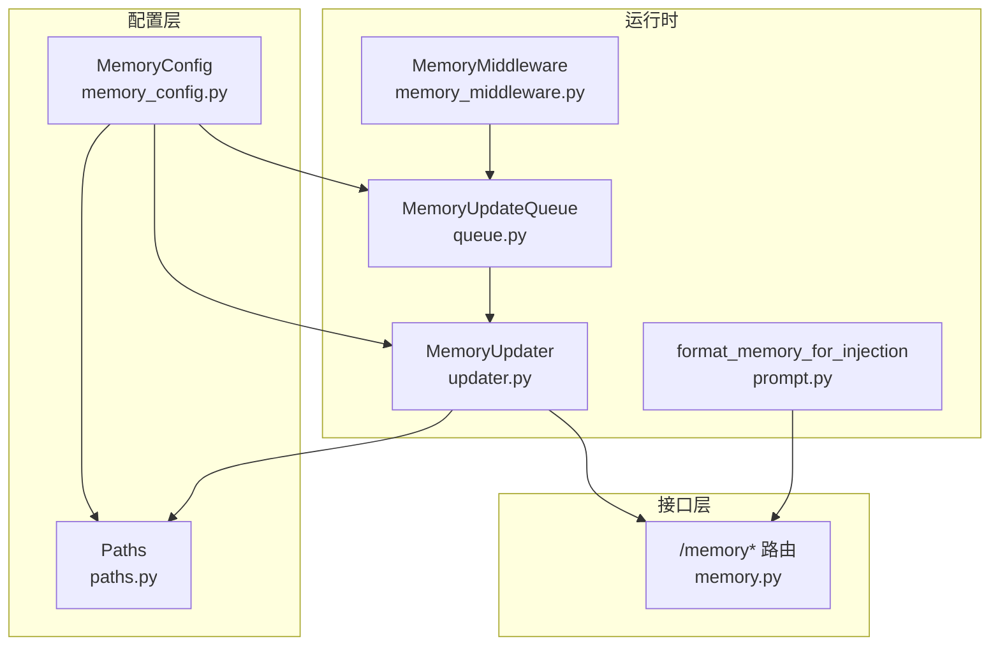
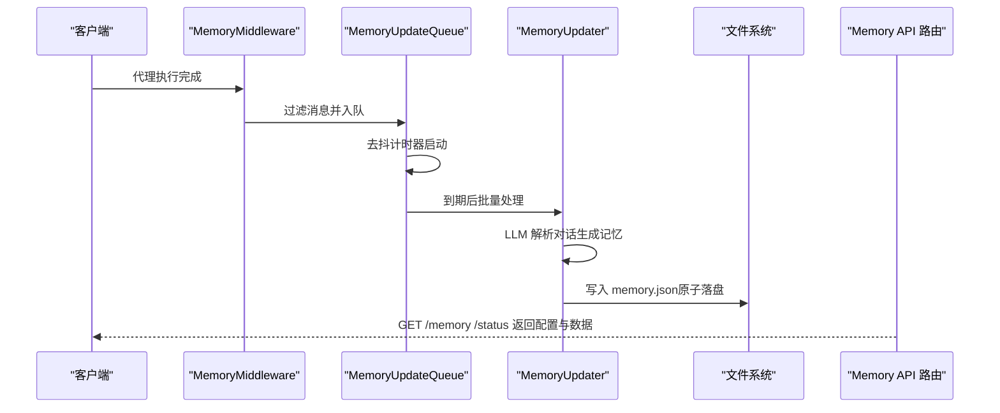
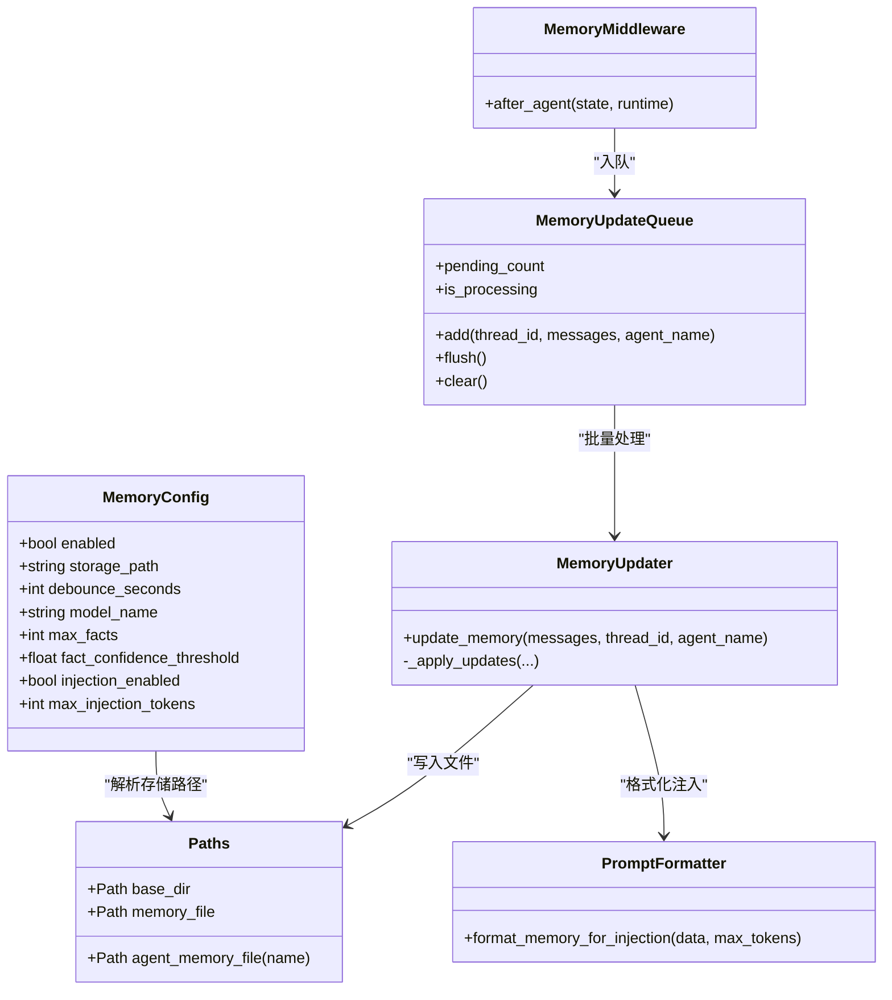

# 内存配置

<cite>
**本文引用的文件**
- [memory_config.py](file://backend/packages/harness/deerflow/config/memory_config.py)
- [paths.py](file://backend/packages/harness/deerflow/config/paths.py)
- [prompt.py](file://backend/packages/harness/deerflow/agents/memory/prompt.py)
- [updater.py](file://backend/packages/harness/deerflow/agents/memory/updater.py)
- [queue.py](file://backend/packages/harness/deerflow/agents/memory/queue.py)
- [memory_middleware.py](file://backend/packages/harness/deerflow/agents/middlewares/memory_middleware.py)
- [memory.py](file://backend/app/gateway/routers/memory.py)
- [MEMORY_IMPROVEMENTS.md](file://backend/docs/MEMORY_IMPROVEMENTS.md)
- [MEMORY_IMPROVEMENTS_SUMMARY.md](file://backend/docs/MEMORY_IMPROVEMENTS_SUMMARY.md)
- [test_memory_prompt_injection.py](file://backend/tests/test_memory_prompt_injection.py)
- [test_memory_updater.py](file://backend/tests/test_memory_updater.py)
- [config.example.yaml](file://config.example.yaml)
</cite>

## 目录
1. [简介](#简介)
2. [项目结构](#项目结构)
3. [核心组件](#核心组件)
4. [架构总览](#架构总览)
5. [详细组件分析](#详细组件分析)
6. [依赖关系分析](#依赖关系分析)
7. [性能考量](#性能考量)
8. [故障排查指南](#故障排查指南)
9. [结论](#结论)
10. [附录](#附录)

## 简介
本文件面向 DeerFlow 的“内存配置”子系统，系统性阐述 memory 配置块的各项参数（启用状态、存储路径、去抖延迟、模型名、最大事实数、置信度阈值、记忆注入开关与注入令牌上限），并深入解析其架构设计、数据持久化机制、记忆注入到系统提示的工作原理、性能优化建议、容量规划、清理策略与数据保留政策，以及配置对对话质量与性能的影响。

## 项目结构
与内存配置直接相关的代码主要分布在以下模块：
- 配置定义：memory_config.py
- 路径解析：paths.py
- 记忆注入与格式化：agents/memory/prompt.py
- 记忆更新与持久化：agents/memory/updater.py
- 去抖队列：agents/memory/queue.py
- 中间件集成：agents/middlewares/memory_middleware.py
- API 路由：app/gateway/routers/memory.py
- 文档与测试：docs/* 与 tests/*

图表来源
- [memory_config.py:1-79](file://backend/packages/harness/deerflow/config/memory_config.py#L1-L79)
- [paths.py:12-243](file://backend/packages/harness/deerflow/config/paths.py#L12-L243)
- [memory_middleware.py:86-149](file://backend/packages/harness/deerflow/agents/middlewares/memory_middleware.py#L86-L149)
- [queue.py:22-196](file://backend/packages/harness/deerflow/agents/memory/queue.py#L22-L196)
- [updater.py:267-443](file://backend/packages/harness/deerflow/agents/memory/updater.py#L267-L443)
- [prompt.py:186-294](file://backend/packages/harness/deerflow/agents/memory/prompt.py#L186-L294)
- [memory.py:75-201](file://backend/app/gateway/routers/memory.py#L75-L201)

章节来源
- [memory_config.py:1-79](file://backend/packages/harness/deerflow/config/memory_config.py#L1-L79)
- [paths.py:12-243](file://backend/packages/harness/deerflow/config/paths.py#L12-L243)
- [memory_middleware.py:86-149](file://backend/packages/harness/deerflow/agents/middlewares/memory_middleware.py#L86-L149)
- [queue.py:22-196](file://backend/packages/harness/deerflow/agents/memory/queue.py#L22-L196)
- [updater.py:267-443](file://backend/packages/harness/deerflow/agents/memory/updater.py#L267-L443)
- [prompt.py:186-294](file://backend/packages/harness/deerflow/agents/memory/prompt.py#L186-L294)
- [memory.py:75-201](file://backend/app/gateway/routers/memory.py#L75-L201)

## 核心组件
- MemoryConfig：定义全局内存配置，包含启用开关、存储路径、去抖秒数、模型名、最大事实数、置信度阈值、记忆注入开关、最大注入令牌数。
- Paths：集中管理应用数据目录与文件路径，决定 memory.json 默认位置与 per-agent memory 文件位置。
- MemoryMiddleware：在每次代理执行后，过滤消息并入队进行异步记忆更新。
- MemoryUpdateQueue：带去抖的队列，合并同一会话窗口内的多次更新，降低 LLM 调用频率。
- MemoryUpdater：调用 LLM 将对话转换为结构化记忆，写入磁盘，并按阈值与上限裁剪事实。
- format_memory_for_injection：将记忆数据格式化为系统提示可注入的文本，按置信度排序并受令牌预算限制。
- API 路由：提供 /memory、/memory/config、/memory/status 等端点，返回当前配置与数据。

章节来源
- [memory_config.py:6-57](file://backend/packages/harness/deerflow/config/memory_config.py#L6-L57)
- [paths.py:72-93](file://backend/packages/harness/deerflow/config/paths.py#L72-L93)
- [memory_middleware.py:86-149](file://backend/packages/harness/deerflow/agents/middlewares/memory_middleware.py#L86-L149)
- [queue.py:22-196](file://backend/packages/harness/deerflow/agents/memory/queue.py#L22-L196)
- [updater.py:267-443](file://backend/packages/harness/deerflow/agents/memory/updater.py#L267-L443)
- [prompt.py:186-294](file://backend/packages/harness/deerflow/agents/memory/prompt.py#L186-L294)
- [memory.py:75-201](file://backend/app/gateway/routers/memory.py#L75-L201)

## 架构总览
下图展示从中间件到队列、更新器、持久化与 API 的完整链路，以及记忆注入到系统提示的流程。

图表来源
- [memory_middleware.py:108-149](file://backend/packages/harness/deerflow/agents/middlewares/memory_middleware.py#L108-L149)
- [queue.py:84-130](file://backend/packages/harness/deerflow/agents/memory/queue.py#L84-L130)
- [updater.py:284-348](file://backend/packages/harness/deerflow/agents/memory/updater.py#L284-L348)
- [memory.py:81-201](file://backend/app/gateway/routers/memory.py#L81-L201)

## 详细组件分析

### 配置项详解与默认值
- enabled：是否启用内存机制。默认开启。
- storage_path：记忆数据存储路径。空字符串时默认使用 Paths.memory_file；绝对路径按原样使用；相对路径基于 Paths.base_dir 解析。注意：若之前设置为相对路径，迁移时需注意解析变化。
- debounce_seconds：队列去抖等待时间（秒）。默认 30，范围 1–300。用于合并同一会话内的多次更新，减少 LLM 调用。
- model_name：用于记忆更新的模型名称。None 表示使用默认模型。
- max_facts：最多保存的事实条目数。默认 100，范围 10–500。
- fact_confidence_threshold：保存新事实的最低置信度阈值。默认 0.7，范围 0.0–1.0。
- injection_enabled：是否将记忆注入到系统提示中。默认开启。
- max_injection_tokens：记忆注入的最大令牌数预算。默认 2000，范围 100–8000。

章节来源
- [memory_config.py:9-57](file://backend/packages/harness/deerflow/config/memory_config.py#L9-L57)
- [config.example.yaml:493-501](file://config.example.yaml#L493-L501)

### 存储路径与默认行为
- 默认全局 memory.json 位于 Paths.base_dir 下。
- 每个 agent 可有独立 memory.json，位于 Paths.agent_dir(name)/memory.json。
- storage_path 支持绝对/相对路径，相对路径以 base_dir 为基准解析。

章节来源
- [paths.py:72-93](file://backend/packages/harness/deerflow/config/paths.py#L72-L93)
- [updater.py:22-40](file://backend/packages/harness/deerflow/agents/memory/updater.py#L22-L40)

### 去抖队列与批处理
- MemoryUpdateQueue 维护 ConversationContext 列表，同一 thread_id 的新上下文会替换旧的，避免重复处理。
- 去抖计时器在 config.debounce_seconds 后触发，批量调用 MemoryUpdater 处理所有待处理上下文。
- 处理期间避免并发重入，必要时延时以缓解速率限制。

章节来源
- [queue.py:30-130](file://backend/packages/harness/deerflow/agents/memory/queue.py#L30-L130)

### 记忆更新与持久化
- MemoryUpdater 读取当前记忆，格式化对话，调用 LLM 生成更新，应用更新（新增/删除/更新用户与历史段落），按置信度阈值与 max_facts 限制裁剪事实，最后原子写入文件。
- 写入前会清理上传事件相关的句子，避免将临时文件信息持久化。
- 缓存基于文件修改时间，确保外部修改后能及时刷新。

章节来源
- [updater.py:284-427](file://backend/packages/harness/deerflow/agents/memory/updater.py#L284-L427)
- [updater.py:193-213](file://backend/packages/harness/deerflow/agents/memory/updater.py#L193-L213)
- [updater.py:67-116](file://backend/packages/harness/deerflow/agents/memory/updater.py#L67-L116)

### 记忆注入到系统提示
- format_memory_for_injection 将 user/history/facts 按结构化段落拼接，facts 按置信度降序，逐行累加直到达到 max_injection_tokens 预算。
- 使用 tiktoken 进行精确计数，失败时回退到字符长度估算。
- 注入内容包含：User Context（工作/个人/当前关注）、History（近期/早期/长期背景）、Facts（类别与置信度标注）。

章节来源
- [prompt.py:186-294](file://backend/packages/harness/deerflow/agents/memory/prompt.py#L186-L294)
- [MEMORY_IMPROVEMENTS.md:19-35](file://backend/docs/MEMORY_IMPROVEMENTS.md#L19-L35)
- [MEMORY_IMPROVEMENTS_SUMMARY.md:26-30](file://backend/docs/MEMORY_IMPROVEMENTS_SUMMARY.md#L26-L30)

### API 接口与数据模型
- GET /memory：返回当前全局记忆数据（版本、最后更新、用户上下文、历史、事实列表）。
- POST /memory/reload：强制从文件重新加载并刷新缓存。
- GET /memory/config：返回当前内存配置。
- GET /memory/status：同时返回配置与数据。

章节来源
- [memory.py:81-201](file://backend/app/gateway/routers/memory.py#L81-L201)

### 中间件集成
- MemoryMiddleware 在代理执行完成后，过滤消息（去除工具调用与上传块），仅保留人类输入与最终助手回复，然后入队等待去抖处理。

章节来源
- [memory_middleware.py:108-149](file://backend/packages/harness/deerflow/agents/middlewares/memory_middleware.py#L108-L149)

## 依赖关系分析

图表来源
- [memory_config.py:6-57](file://backend/packages/harness/deerflow/config/memory_config.py#L6-L57)
- [paths.py:72-93](file://backend/packages/harness/deerflow/config/paths.py#L72-L93)
- [memory_middleware.py:86-149](file://backend/packages/harness/deerflow/agents/middlewares/memory_middleware.py#L86-L149)
- [queue.py:22-196](file://backend/packages/harness/deerflow/agents/memory/queue.py#L22-L196)
- [updater.py:267-443](file://backend/packages/harness/deerflow/agents/memory/updater.py#L267-L443)
- [prompt.py:186-294](file://backend/packages/harness/deerflow/agents/memory/prompt.py#L186-L294)

## 性能考量
- 去抖延迟（debounce_seconds）：通过合并短时间内多次更新，显著降低 LLM 调用次数，建议根据业务并发与对话节奏调整（默认 30 秒）。
- 最大事实数（max_facts）：控制事实规模，避免过长的历史上下文导致上下文膨胀与成本上升，默认 100。
- 置信度阈值（fact_confidence_threshold）：过滤低置信事实，提升注入质量，默认 0.7。
- 注入令牌预算（max_injection_tokens）：限制注入内容大小，防止超出模型上下文窗口，默认 2000。
- 原子写入与缓存失效：写入采用临时文件再重命名，保证一致性；缓存基于文件 mtime，避免脏读。
- 计数精度：优先使用 tiktoken，失败时回退字符估算，确保预算控制稳定。

章节来源
- [queue.py:66-82](file://backend/packages/harness/deerflow/agents/memory/queue.py#L66-L82)
- [updater.py:418-426](file://backend/packages/harness/deerflow/agents/memory/updater.py#L418-L426)
- [prompt.py:148-167](file://backend/packages/harness/deerflow/agents/memory/prompt.py#L148-L167)
- [updater.py:225-264](file://backend/packages/harness/deerflow/agents/memory/updater.py#L225-L264)

## 故障排查指南
- 记忆未更新
  - 检查 enabled 是否开启。
  - 确认中间件已正确挂载且线程 ID 可用。
  - 查看去抖计时器是否被频繁重置。
- 注入内容为空或过短
  - 检查 max_injection_tokens 是否过小。
  - 确认 facts 是否存在且置信度足够高。
- 写入失败
  - 检查存储路径权限与磁盘空间。
  - 关注日志中的 OSError 或 JSON 解析错误。
- 上传事件残留
  - 确保 MemoryUpdater 已清理上传块，避免后续会话误寻非存在文件。

章节来源
- [memory_middleware.py:118-149](file://backend/packages/harness/deerflow/agents/middlewares/memory_middleware.py#L118-L149)
- [queue.py:84-130](file://backend/packages/harness/deerflow/agents/memory/queue.py#L84-L130)
- [updater.py:334-348](file://backend/packages/harness/deerflow/agents/memory/updater.py#L334-L348)
- [prompt.py:285-294](file://backend/packages/harness/deerflow/agents/memory/prompt.py#L285-L294)

## 结论
DeerFlow 的内存配置通过“中间件入队 + 去抖批处理 + LLM 结构化更新 + 原子持久化”的闭环，实现了稳定、可控的记忆管理。合理的配置（去抖、事实上限、置信度阈值、注入预算）能在保证对话质量的同时，有效控制成本与延迟。随着计划中的 TF-IDF 上下文感知检索与加权评分，记忆注入将更具针对性与效率。

## 附录

### 配置项与默认值一览
- enabled：布尔，是否启用内存机制
- storage_path：字符串，存储路径（空则使用默认 base_dir/memory.json）
- debounce_seconds：整数，去抖等待秒数（1–300）
- model_name：字符串或空，记忆更新使用的模型名
- max_facts：整数，最大事实数（10–500）
- fact_confidence_threshold：浮点数，事实置信度阈值（0.0–1.0）
- injection_enabled：布尔，是否注入记忆到系统提示
- max_injection_tokens：整数，注入最大令牌数（100–8000）

章节来源
- [memory_config.py:9-57](file://backend/packages/harness/deerflow/config/memory_config.py#L9-L57)
- [config.example.yaml:493-501](file://config.example.yaml#L493-L501)

### 数据保留与清理策略
- 自动清理：写入前清理上传事件相关句子，避免将临时文件信息持久化。
- 事实裁剪：当事实数量超过 max_facts 时，按置信度降序保留前 N 条。
- 手动刷新：通过 /memory/reload 强制从文件重新加载缓存。

章节来源
- [updater.py:193-213](file://backend/packages/harness/deerflow/agents/memory/updater.py#L193-L213)
- [updater.py:418-426](file://backend/packages/harness/deerflow/agents/memory/updater.py#L418-L426)
- [memory.py:125-135](file://backend/app/gateway/routers/memory.py#L125-L135)

### 容量规划与优化建议
- 观察对话节奏与并发，适当提高 debounce_seconds 以减少 LLM 调用。
- 根据模型上下文窗口与实际注入效果，调整 max_injection_tokens。
- 控制 max_facts 与 fact_confidence_threshold，平衡上下文丰富度与成本。
- 对于高并发场景，考虑将 storage_path 指向更高性能的存储介质。

章节来源
- [queue.py:66-82](file://backend/packages/harness/deerflow/agents/memory/queue.py#L66-L82)
- [prompt.py:285-294](file://backend/packages/harness/deerflow/agents/memory/prompt.py#L285-L294)
- [updater.py:418-426](file://backend/packages/harness/deerflow/agents/memory/updater.py#L418-L426)

### 测试验证要点
- 注入格式：facts 段落、按置信度排序、预算控制。
- 置信度归一化：NaN/Inf 回退至默认值，越界值钳制。
- 更新逻辑：去重、删除、阈值与上限裁剪。

章节来源
- [test_memory_prompt_injection.py:8-122](file://backend/tests/test_memory_prompt_injection.py#L8-L122)
- [test_memory_updater.py:33-131](file://backend/tests/test_memory_updater.py#L33-L131)