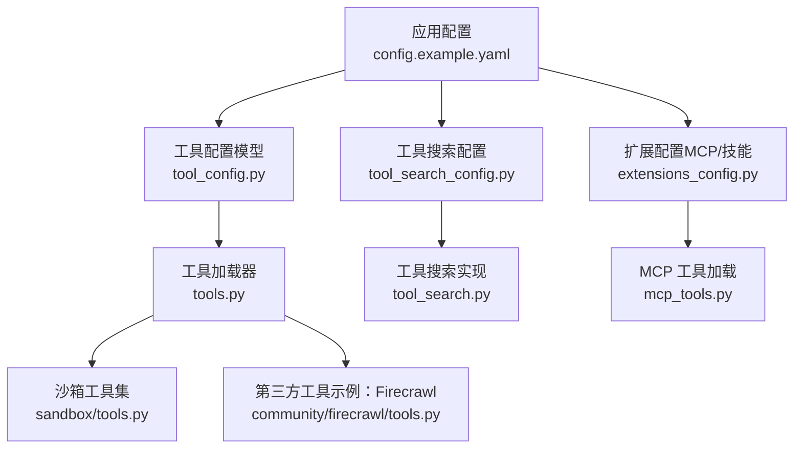
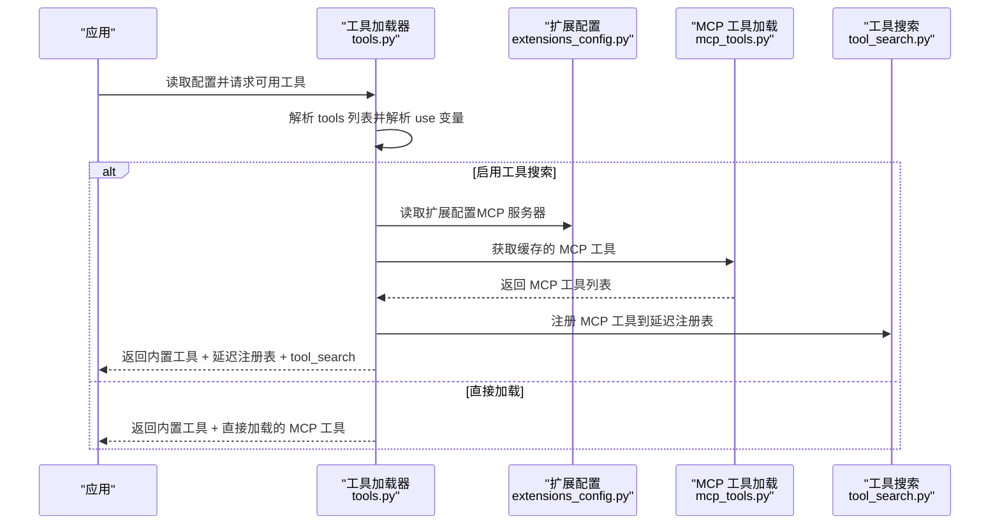
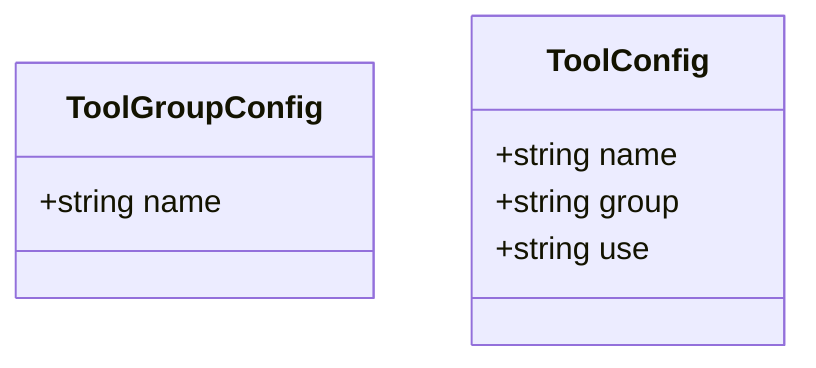
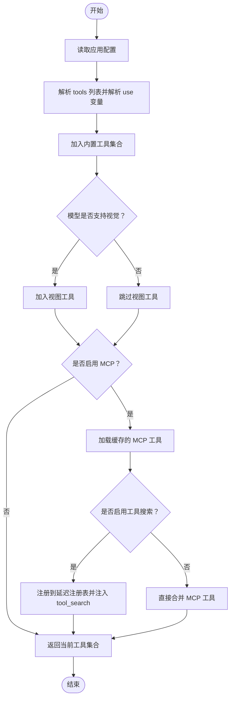
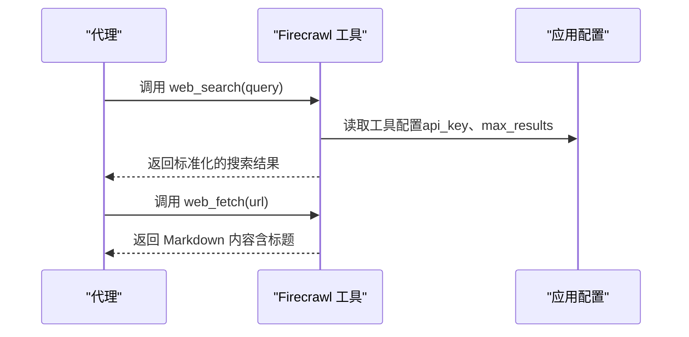
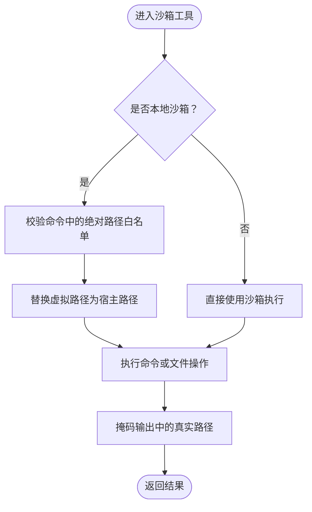
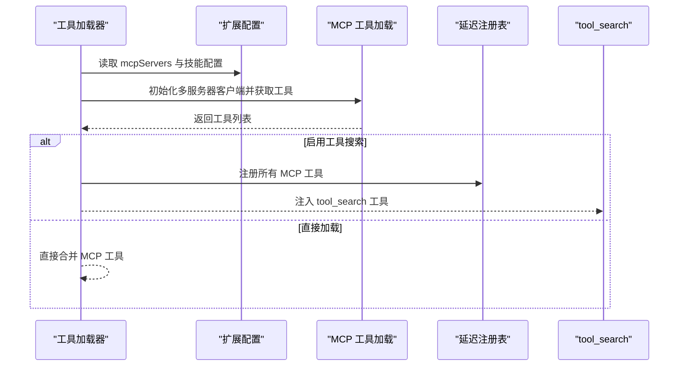
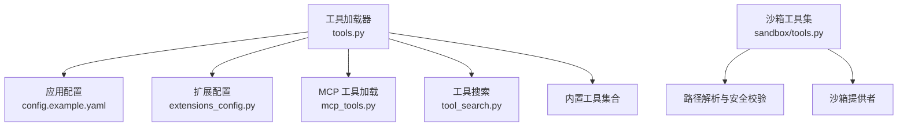

# 工具配置

<cite>
**本文引用的文件**
- [tool_config.py](file://backend/packages/harness/deerflow/config/tool_config.py)
- [tool_search_config.py](file://backend/packages/harness/deerflow/config/tool_search_config.py)
- [tools.py](file://backend/packages/harness/deerflow/tools/tools.py)
- [tool_search.py](file://backend/packages/harness/deerflow/tools/builtins/tool_search.py)
- [tools.py（沙箱）](file://backend/packages/harness/deerflow/sandbox/tools.py)
- [tools.py（Firecrawl 网络搜索）](file://backend/packages/harness/deerflow/community/firecrawl/tools.py)
- [extensions_config.py](file://backend/packages/harness/deerflow/config/extensions_config.py)
- [mcp_tools.py](file://backend/packages/harness/deerflow/mcp/tools.py)
- [config.example.yaml](file://config.example.yaml)
- [extensions_config.example.json](file://extensions_config.example.json)
- [ARCHITECTURE.md](file://backend/docs/ARCHITECTURE.md)
</cite>

## 目录
1. [简介](#简介)
2. [项目结构](#项目结构)
3. [核心组件](#核心组件)
4. [架构总览](#架构总览)
5. [详细组件分析](#详细组件分析)
6. [依赖关系分析](#依赖关系分析)
7. [性能考量](#性能考量)
8. [故障排查指南](#故障排查指南)
9. [结论](#结论)
10. [附录](#附录)

## 简介
本章节面向 DeerFlow 的工具配置系统，聚焦 tools 配置块与 tool_groups 配置块的结构、用途与使用方式，解释工具分组、工具加载流程与工具搜索配置，区分内置工具与第三方工具（MCP）的配置差异，并提供网络搜索、文件操作、Bash 执行等工具类型的配置示例。同时给出工具权限控制与访问限制的配置方法，以及性能优化与安全配置的最佳实践。

## 项目结构
与工具配置相关的核心代码位于后端 harness 包中，主要涉及：
- 配置模型：定义工具与工具组的结构
- 工具加载器：从配置解析并实例化工具
- 工具搜索：延迟加载与运行时检索 MCP 工具
- 沙箱工具：文件读写、目录遍历、命令执行等
- 第三方工具：如 Firecrawl 网络搜索
- MCP 扩展：通过扩展配置启用第三方 MCP 服务器

**图表来源**
- [config.example.yaml:218-314](file://config.example.yaml#L218-L314)
- [tool_config.py:4-21](file://backend/packages/harness/deerflow/config/tool_config.py#L4-L21)
- [tool_search_config.py:6-36](file://backend/packages/harness/deerflow/config/tool_search_config.py#L6-L36)
- [extensions_config.py:55-68](file://backend/packages/harness/deerflow/config/extensions_config.py#L55-L68)
- [tools.py:23-115](file://backend/packages/harness/deerflow/tools/tools.py#L23-L115)
- [tool_search.py:142-177](file://backend/packages/harness/deerflow/tools/builtins/tool_search.py#L142-L177)
- [mcp_tools.py:56-114](file://backend/packages/harness/deerflow/mcp/tools.py#L56-L114)
- [tools.py（沙箱）:684-800](file://backend/packages/harness/deerflow/sandbox/tools.py#L684-L800)
- [tools.py（Firecrawl 网络搜索）:17-74](file://backend/packages/harness/deerflow/community/firecrawl/tools.py#L17-L74)

**章节来源**
- [config.example.yaml:218-314](file://config.example.yaml#L218-L314)
- [tool_config.py:4-21](file://backend/packages/harness/deerflow/config/tool_config.py#L4-L21)
- [tool_search_config.py:6-36](file://backend/packages/harness/deerflow/config/tool_search_config.py#L6-L36)
- [extensions_config.py:55-68](file://backend/packages/harness/deerflow/config/extensions_config.py#L55-L68)
- [tools.py:23-115](file://backend/packages/harness/deerflow/tools/tools.py#L23-L115)
- [tool_search.py:142-177](file://backend/packages/harness/deerflow/tools/builtins/tool_search.py#L142-L177)
- [mcp_tools.py:56-114](file://backend/packages/harness/deerflow/mcp/tools.py#L56-L114)
- [tools.py（沙箱）:684-800](file://backend/packages/harness/deerflow/sandbox/tools.py#L684-L800)
- [tools.py（Firecrawl 网络搜索）:17-74](file://backend/packages/harness/deerflow/community/firecrawl/tools.py#L17-L74)

## 核心组件
- 工具组配置（tool_groups）
  - 作用：对工具进行逻辑分组，便于按组筛选与权限控制
  - 结构：每个条目包含唯一名称
  - 示例：web、file:read、file:write、bash
- 工具配置（tools）
  - 作用：声明具体可用工具及其提供者
  - 关键字段：name（唯一）、group（所属组）、use（提供者变量路径）
  - 示例：web_search、web_fetch、ls、read_file、write_file、str_replace、bash
- 工具搜索配置（tool_search）
  - 作用：启用延迟加载与运行时检索 MCP 工具，减少上下文开销
  - 关键字段：enabled（布尔）
  - 行为：当开启时，MCP 工具不直接注入到上下文，而是通过 tool_search 工具在运行时发现与拉取

**章节来源**
- [config.example.yaml:222-227](file://config.example.yaml#L222-L227)
- [config.example.yaml:233-302](file://config.example.yaml#L233-L302)
- [config.example.yaml:312-314](file://config.example.yaml#L312-L314)
- [tool_config.py:4-21](file://backend/packages/harness/deerflow/config/tool_config.py#L4-L21)
- [tool_search_config.py:6-36](file://backend/packages/harness/deerflow/config/tool_search_config.py#L6-L36)

## 架构总览
工具配置系统的整体工作流如下：
- 应用启动时读取 YAML 配置（含 tools、tool_groups、tool_search）
- 加载器根据配置解析工具提供者（支持内置与第三方）
- 若启用工具搜索，MCP 工具被注册到延迟注册表并通过 tool_search 暴露
- 运行时，代理通过 tool_search 获取所需工具的完整参数定义后再调用

**图表来源**
- [tools.py:23-115](file://backend/packages/harness/deerflow/tools/tools.py#L23-L115)
- [extensions_config.py:119-145](file://backend/packages/harness/deerflow/config/extensions_config.py#L119-L145)
- [mcp_tools.py:56-114](file://backend/packages/harness/deerflow/mcp/tools.py#L56-L114)
- [tool_search.py:142-177](file://backend/packages/harness/deerflow/tools/builtins/tool_search.py#L142-L177)

## 详细组件分析

### 工具组与工具配置模型
- 工具组（ToolGroupConfig）
  - 字段：name（唯一标识）
  - 语义：用于对工具进行分组，便于按组过滤与权限控制
- 工具（ToolConfig）
  - 字段：name（唯一标识）、group（所属组）、use（提供者变量路径）
  - 语义：声明一个可被代理使用的工具；use 使用“包.模块:变量名”的形式指向实际工具对象

**图表来源**
- [tool_config.py:4-21](file://backend/packages/harness/deerflow/config/tool_config.py#L4-L21)

**章节来源**
- [tool_config.py:4-21](file://backend/packages/harness/deerflow/config/tool_config.py#L4-L21)
- [config.example.yaml:222-227](file://config.example.yaml#L222-L227)
- [config.example.yaml:233-302](file://config.example.yaml#L233-L302)

### 工具加载器与工具搜索
- 工具加载器（get_available_tools）
  - 功能：从配置加载工具、条件性加入内置工具、按模型能力加入视图工具、按需加载 MCP 工具、按需加入 ACP 工具
  - 分组过滤：可通过 groups 参数仅返回指定组的工具
  - 视觉能力：当模型配置支持视觉时自动加入视图工具
  - MCP 加载：通过扩展配置与缓存获取 MCP 工具；若启用工具搜索，则注册到延迟注册表并注入 tool_search
- 工具搜索（tool_search）
  - 功能：基于查询词匹配延迟注册表中的工具，返回符合查询的工具定义（OpenAI 函数格式）
  - 查询语法：支持精确选择、关键词匹配、带权重排序等
  - 上下文隔离：使用 ContextVar 保证并发请求互不干扰

**图表来源**
- [tools.py:23-115](file://backend/packages/harness/deerflow/tools/tools.py#L23-L115)
- [tool_search.py:142-177](file://backend/packages/harness/deerflow/tools/builtins/tool_search.py#L142-L177)

**章节来源**
- [tools.py:23-115](file://backend/packages/harness/deerflow/tools/tools.py#L23-L115)
- [tool_search.py:142-177](file://backend/packages/harness/deerflow/tools/builtins/tool_search.py#L142-L177)

### 第三方工具：网络搜索（Firecrawl）
- 提供者：deerflow.community.firecrawl.tools
- 工具：web_search、web_fetch
- 配置项：通过应用配置中的工具额外字段（如 api_key、max_results）传递给工具
- 安全注意：web_fetch 仅接受明确提供的 URL，且要求包含协议

**图表来源**
- [tools.py（Firecrawl 网络搜索）:17-74](file://backend/packages/harness/deerflow/community/firecrawl/tools.py#L17-L74)
- [config.example.yaml:233-260](file://config.example.yaml#L233-L260)

**章节来源**
- [tools.py（Firecrawl 网络搜索）:17-74](file://backend/packages/harness/deerflow/community/firecrawl/tools.py#L17-L74)
- [config.example.yaml:233-260](file://config.example.yaml#L233-L260)

### 沙箱工具：文件操作与 Bash 执行
- 文件操作工具：ls、read_file、write_file、str_replace
- Bash 工具：bash
- 安全与路径控制：
  - 本地沙箱模式下强制使用虚拟路径前缀（/mnt/user-data、/mnt/skills、/mnt/acp-workspace）
  - 对绝对路径进行白名单校验，拒绝危险路径
  - 输出中会掩码真实主机路径，避免泄露
- 目录与容器挂载：
  - 本地沙箱首次使用时创建线程专属目录
  - 容器沙箱已将 /mnt/user-data 挂载进容器

**图表来源**
- [tools.py（沙箱）:684-800](file://backend/packages/harness/deerflow/sandbox/tools.py#L684-L800)
- [ARCHITECTURE.md:147-180](file://backend/docs/ARCHITECTURE.md#L147-L180)

**章节来源**
- [tools.py（沙箱）:684-800](file://backend/packages/harness/deerflow/sandbox/tools.py#L684-L800)
- [ARCHITECTURE.md:147-180](file://backend/docs/ARCHITECTURE.md#L147-L180)

### MCP 扩展与工具搜索集成
- 扩展配置（extensions_config.json）
  - 支持 MCP 服务器（stdio/sse/http），可配置命令、参数、环境变量、OAuth 等
  - 支持技能状态（启用/禁用）
- MCP 工具加载
  - 通过多服务器客户端批量发现工具
  - 将异步工具包装为同步以兼容客户端流式调用
- 工具搜索与 MCP
  - 当启用工具搜索时，MCP 工具注册到延迟注册表，tool_search 返回其函数定义

**图表来源**
- [extensions_config.py:55-68](file://backend/packages/harness/deerflow/config/extensions_config.py#L55-L68)
- [mcp_tools.py:56-114](file://backend/packages/harness/deerflow/mcp/tools.py#L56-L114)
- [tool_search.py:142-177](file://backend/packages/harness/deerflow/tools/builtins/tool_search.py#L142-L177)

**章节来源**
- [extensions_config.py:55-68](file://backend/packages/harness/deerflow/config/extensions_config.py#L55-L68)
- [mcp_tools.py:56-114](file://backend/packages/harness/deerflow/mcp/tools.py#L56-L114)
- [extensions_config.example.json:1-42](file://extensions_config.example.json#L1-L42)
- [tool_search.py:142-177](file://backend/packages/harness/deerflow/tools/builtins/tool_search.py#L142-L177)

## 依赖关系分析
- 工具加载器依赖：
  - 应用配置（解析 tools 列表）
  - 扩展配置（MCP 服务器与技能）
  - MCP 工具加载模块（获取缓存工具）
  - 工具搜索模块（延迟注册与检索）
  - 内置工具集合（视图、任务、澄清等）
- 沙箱工具依赖：
  - 路径解析与安全校验（虚拟路径映射、路径穿越检测）
  - 沙箱提供者（本地/容器）

**图表来源**
- [tools.py:23-115](file://backend/packages/harness/deerflow/tools/tools.py#L23-L115)
- [extensions_config.py:119-145](file://backend/packages/harness/deerflow/config/extensions_config.py#L119-L145)
- [mcp_tools.py:56-114](file://backend/packages/harness/deerflow/mcp/tools.py#L56-L114)
- [tool_search.py:142-177](file://backend/packages/harness/deerflow/tools/builtins/tool_search.py#L142-L177)
- [tools.py（沙箱）:684-800](file://backend/packages/harness/deerflow/sandbox/tools.py#L684-L800)

**章节来源**
- [tools.py:23-115](file://backend/packages/harness/deerflow/tools/tools.py#L23-L115)
- [mcp_tools.py:56-114](file://backend/packages/harness/deerflow/mcp/tools.py#L56-L114)
- [extensions_config.py:119-145](file://backend/packages/harness/deerflow/config/extensions_config.py#L119-L145)
- [tool_search.py:142-177](file://backend/packages/harness/deerflow/tools/builtins/tool_search.py#L142-L177)
- [tools.py（沙箱）:684-800](file://backend/packages/harness/deerflow/sandbox/tools.py#L684-L800)

## 性能考量
- 工具搜索（tool_search）
  - 降低初始上下文大小，提升工具选择准确性
  - 仅在需要时拉取工具定义，减少一次性加载成本
- MCP 工具缓存
  - 通过缓存避免重复初始化 MCP 客户端与工具发现
- 并发与线程池
  - MCP 工具在异步环境中通过全局线程池包装同步调用，避免嵌套事件循环问题
- 沙箱路径替换与输出掩码
  - 仅在本地沙箱进行路径替换与掩码，减少容器沙箱的额外处理

**章节来源**
- [tool_search_config.py:6-36](file://backend/packages/harness/deerflow/config/tool_search_config.py#L6-L36)
- [tools.py:83-94](file://backend/packages/harness/deerflow/tools/tools.py#L83-L94)
- [mcp_tools.py:18-54](file://backend/packages/harness/deerflow/mcp/tools.py#L18-L54)
- [tools.py（沙箱）:684-712](file://backend/packages/harness/deerflow/sandbox/tools.py#L684-L712)

## 故障排查指南
- 工具未加载
  - 检查 tools 列表中的 use 是否正确指向工具变量
  - 确认工具组过滤参数是否正确
- MCP 工具不可用
  - 检查扩展配置文件是否存在与格式是否正确
  - 确认 MCP 服务器是否启用、命令与参数是否正确
  - 若安装了 langchain-mcp-adapters，请确认版本兼容
- 工具搜索无效
  - 确认 tool_search.enabled 是否为 true
  - 确认 MCP 工具已注册到延迟注册表
- 沙箱路径错误或权限不足
  - 本地沙箱必须使用虚拟路径前缀
  - 拒绝路径穿越（..）与非允许的绝对路径
  - 输出中真实路径会被掩码，确保不会泄露宿主布局
- 网络搜索失败
  - 检查第三方工具的 API 密钥与参数配置
  - web_fetch 仅接受明确提供的 URL，且需包含协议

**章节来源**
- [tools.py:95-98](file://backend/packages/harness/deerflow/tools/tools.py#L95-L98)
- [extensions_config.py:119-145](file://backend/packages/harness/deerflow/config/extensions_config.py#L119-L145)
- [mcp_tools.py:63-66](file://backend/packages/harness/deerflow/mcp/tools.py#L63-L66)
- [tool_search.py:164-166](file://backend/packages/harness/deerflow/tools/builtins/tool_search.py#L164-L166)
- [tools.py（沙箱）:368-411](file://backend/packages/harness/deerflow/sandbox/tools.py#L368-L411)
- [tools.py（沙箱）:210-221](file://backend/packages/harness/deerflow/sandbox/tools.py#L210-L221)
- [tools.py（Firecrawl 网络搜索）:17-74](file://backend/packages/harness/deerflow/community/firecrawl/tools.py#L17-L74)

## 结论
DeerFlow 的工具配置系统通过清晰的工具组与工具声明、灵活的工具加载与延迟搜索机制，实现了内置工具与第三方 MCP 工具的统一管理。配合严格的沙箱路径控制与输出掩码，既保障了安全性，也兼顾了性能与易用性。建议在生产环境中启用工具搜索与权限控制，并合理配置 MCP 服务器与网络搜索工具的参数。

## 附录

### 配置示例与最佳实践
- 工具组与工具
  - 使用 tool_groups 对工具进行分类（如 web、file:read、file:write、bash）
  - 在 tools 中声明具体工具，use 指向对应提供者变量
- 工具搜索
  - tool_search.enabled 设为 true 以启用延迟加载与运行时检索
- 第三方工具（网络搜索）
  - 通过工具额外字段设置 API 密钥与最大结果数
  - web_fetch 仅接受明确提供的 URL，且需包含协议
- 沙箱工具
  - 本地沙箱必须使用虚拟路径前缀（/mnt/user-data、/mnt/skills、/mnt/acp-workspace）
  - 拒绝路径穿越与非允许的绝对路径
  - 输出中真实路径会被掩码
- MCP 扩展
  - 在 extensions_config.json 中配置 MCP 服务器（stdio/sse/http）
  - 可选配置 OAuth、环境变量与命令参数
- 权限控制
  - 通过 guardrails 或工具组过滤实现访问限制
  - ACP 工具可结合自动批准权限策略

**章节来源**
- [config.example.yaml:222-314](file://config.example.yaml#L222-L314)
- [extensions_config.example.json:1-42](file://extensions_config.example.json#L1-L42)
- [tools.py（沙箱）:368-411](file://backend/packages/harness/deerflow/sandbox/tools.py#L368-L411)
- [tools.py（Firecrawl 网络搜索）:17-74](file://backend/packages/harness/deerflow/community/firecrawl/tools.py#L17-L74)
- [mcp_tools.py:56-114](file://backend/packages/harness/deerflow/mcp/tools.py#L56-L114)