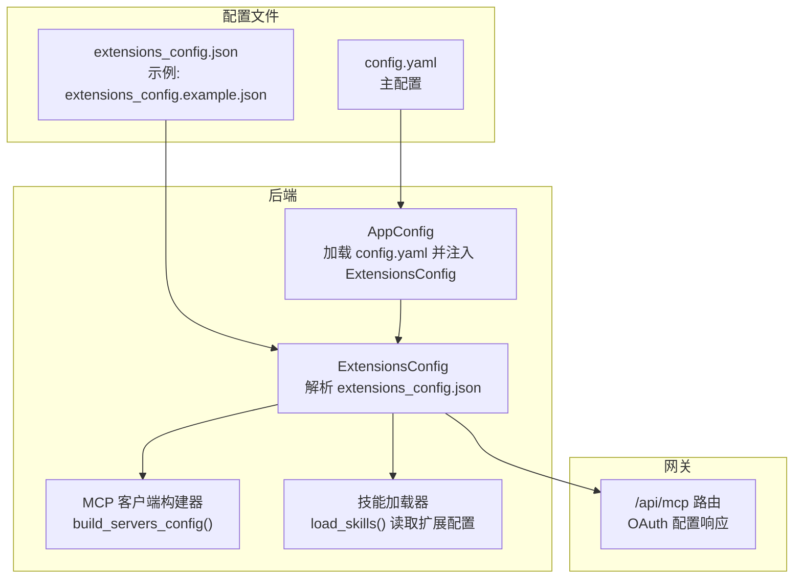
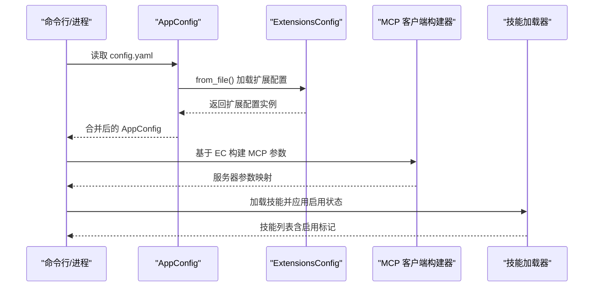
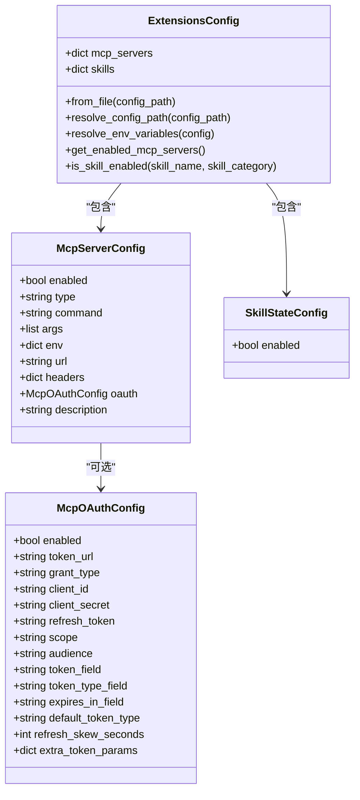
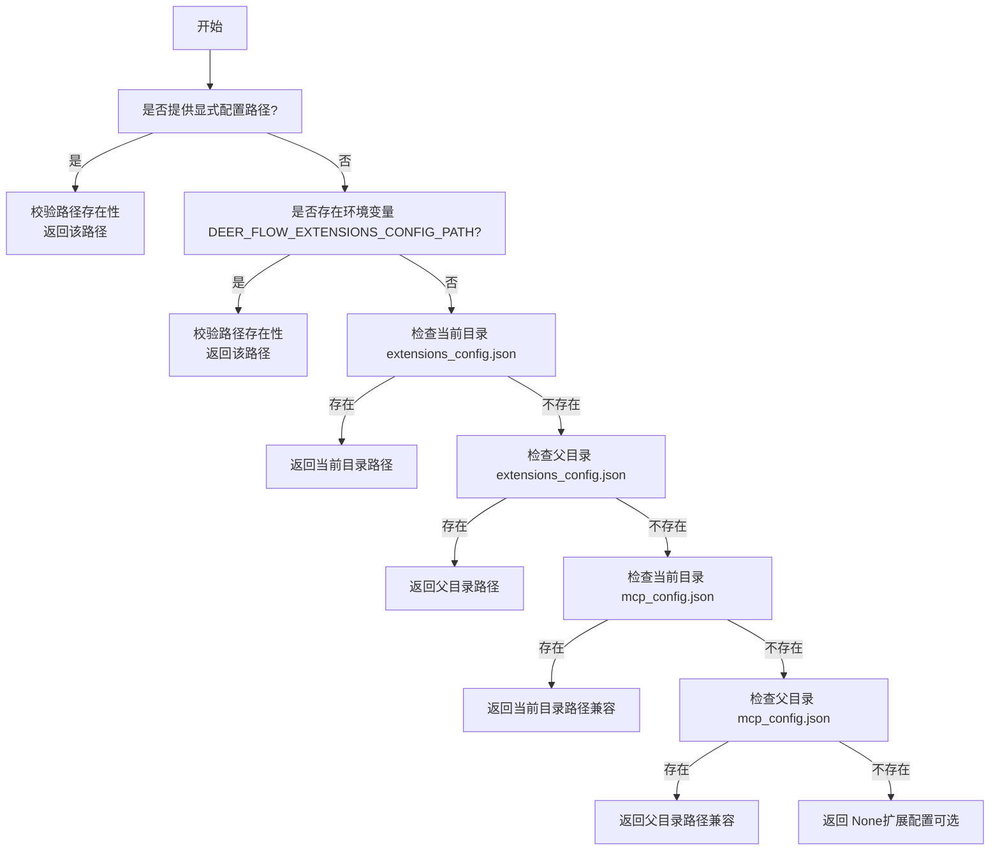
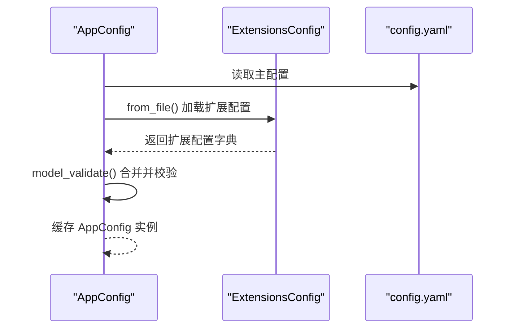
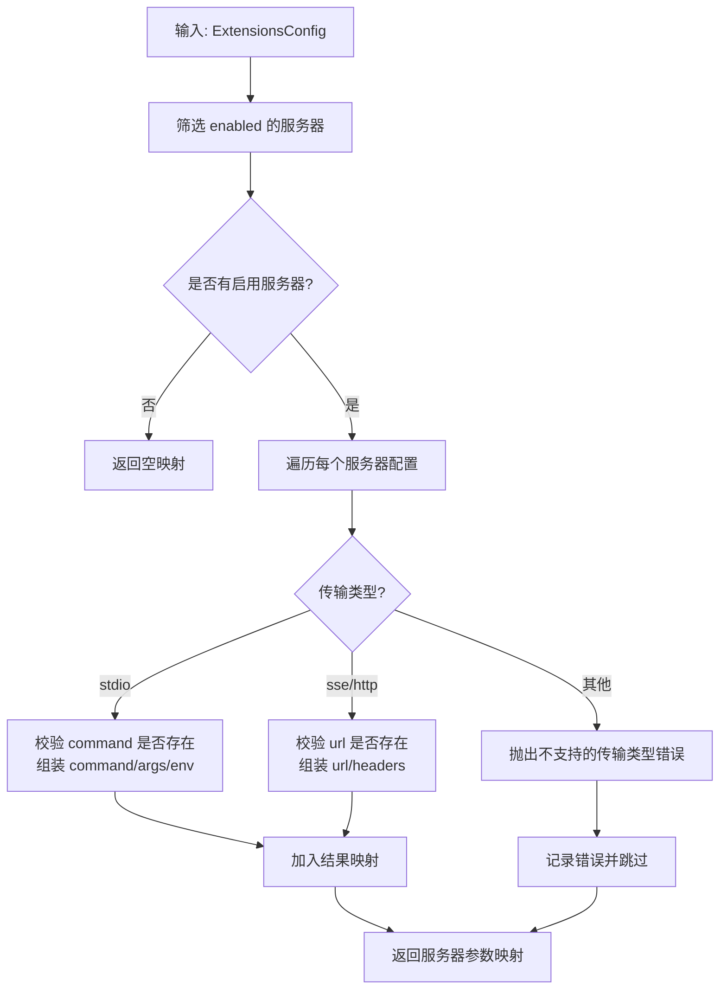
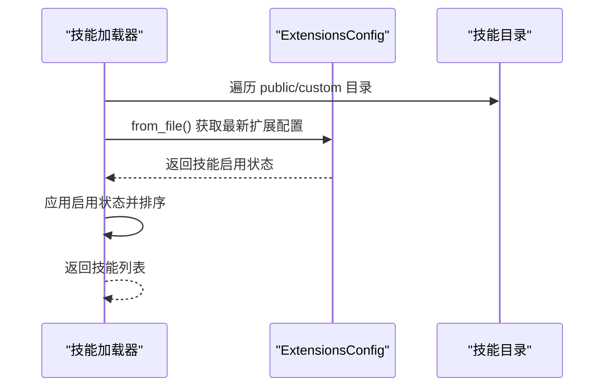
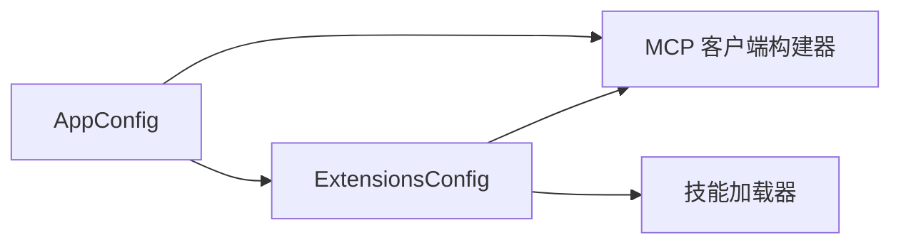

# 扩展配置

<cite>
**本文引用的文件**
- [extensions_config.py](file://backend/packages/harness/deerflow/config/extensions_config.py)
- [extensions_config.example.json](file://extensions_config.example.json)
- [app_config.py](file://backend/packages/harness/deerflow/config/app_config.py)
- [client.py](file://backend/packages/harness/deerflow/mcp/client.py)
- [loader.py](file://backend/packages/harness/deerflow/skills/loader.py)
- [skills_config.py](file://backend/packages/harness/deerflow/config/skills_config.py)
- [mcp.py](file://backend/app/gateway/routers/mcp.py)
- [MCP_SERVER.md](file://backend/docs/MCP_SERVER.md)
- [test_mcp_client_config.py](file://backend/tests/test_mcp_client_config.py)
- [test_mcp_oauth.py](file://backend/tests/test_mcp_oauth.py)
</cite>

## 目录
1. [简介](#简介)
2. [项目结构](#项目结构)
3. [核心组件](#核心组件)
4. [架构总览](#架构总览)
5. [详细组件分析](#详细组件分析)
6. [依赖关系分析](#依赖关系分析)
7. [性能考量](#性能考量)
8. [故障排查指南](#故障排查指南)
9. [结论](#结论)
10. [附录](#附录)

## 简介
本文件系统性阐述 DeerFlow 的扩展配置体系，重点围绕扩展配置文件 extensions_config.json 的结构、加载机制与优先级规则，以及其对核心功能（MCP 服务器与技能）和第三方集成的影响。文档同时覆盖扩展配置与主配置文件（config.yaml）的协作关系、冲突处理策略、安全注意事项与最佳实践，并提供可操作的应用场景与配置示例路径。

## 项目结构
扩展配置位于后端 harness 包内，采用 Pydantic 模型定义配置结构；前端通过网关路由暴露扩展配置相关的管理能力；技能系统在加载时读取扩展配置以决定技能启用状态；应用主配置在启动时单独加载扩展配置并注入到整体配置对象中。

图表来源
- [app_config.py:74-131](file://backend/packages/harness/deerflow/config/app_config.py#L74-L131)
- [extensions_config.py:119-144](file://backend/packages/harness/deerflow/config/extensions_config.py#L119-L144)
- [client.py:45-68](file://backend/packages/harness/deerflow/mcp/client.py#L45-L68)
- [loader.py:77-90](file://backend/packages/harness/deerflow/skills/loader.py#L77-L90)
- [mcp.py:1-16](file://backend/app/gateway/routers/mcp.py#L1-L16)

章节来源
- [app_config.py:74-131](file://backend/packages/harness/deerflow/config/app_config.py#L74-L131)
- [extensions_config.py:119-144](file://backend/packages/harness/deerflow/config/extensions_config.py#L119-L144)
- [client.py:45-68](file://backend/packages/harness/deerflow/mcp/client.py#L45-L68)
- [loader.py:77-90](file://backend/packages/harness/deerflow/skills/loader.py#L77-L90)
- [mcp.py:1-16](file://backend/app/gateway/routers/mcp.py#L1-L16)

## 核心组件
- 扩展配置模型：统一描述 MCP 服务器与技能状态，支持环境变量占位符解析与动态加载。
- 加载与缓存：提供单例缓存、手动重载与重置能力，确保运行时变更即时生效或可控失效。
- 构建 MCP 参数：根据配置生成客户端可用的服务器参数，自动校验必填字段。
- 技能启用判定：基于扩展配置决定技能是否启用，未显式配置时默认启用公共与自定义技能。
- 主配置集成：主配置在启动时单独加载扩展配置，将其合并入整体配置对象。

章节来源
- [extensions_config.py:55-67](file://backend/packages/harness/deerflow/config/extensions_config.py#L55-L67)
- [extensions_config.py:177-200](file://backend/packages/harness/deerflow/config/extensions_config.py#L177-L200)
- [extensions_config.py:205-258](file://backend/packages/harness/deerflow/config/extensions_config.py#L205-L258)
- [client.py:11-42](file://backend/packages/harness/deerflow/mcp/client.py#L11-L42)
- [loader.py:77-90](file://backend/packages/harness/deerflow/skills/loader.py#L77-L90)
- [app_config.py:126-128](file://backend/packages/harness/deerflow/config/app_config.py#L126-L128)

## 架构总览
扩展配置贯穿“发现—校验—应用—反馈”的闭环：后端在启动阶段从磁盘加载扩展配置，前端通过网关接口查询与更新；MCP 客户端按启用列表构建连接参数；技能加载器依据扩展配置决定技能可用性。

图表来源
- [app_config.py:74-131](file://backend/packages/harness/deerflow/config/app_config.py#L74-L131)
- [extensions_config.py:119-144](file://backend/packages/harness/deerflow/config/extensions_config.py#L119-L144)
- [client.py:45-68](file://backend/packages/harness/deerflow/mcp/client.py#L45-L68)
- [loader.py:77-90](file://backend/packages/harness/deerflow/skills/loader.py#L77-L90)

## 详细组件分析

### 扩展配置数据模型与字段语义
- McpOAuthConfig：面向 HTTP/SSE 传输的 OAuth 支持，涵盖令牌端点、授权类型、客户端凭据、作用域、audience、令牌字段名、过期字段、默认令牌类型、刷新偏移与额外表单参数等。
- McpServerConfig：单个 MCP 服务器配置，支持 stdio（命令+参数+环境变量）、sse/http（URL+请求头+OAuth）三种传输方式，以及启用开关与描述。
- SkillStateConfig：技能状态配置，当前仅包含启用开关。
- ExtensionsConfig：顶层容器，包含 MCP 服务器字典与技能状态字典，并提供路径解析、文件加载、环境变量解析、启用服务器筛选与技能启用判定等方法。

图表来源
- [extensions_config.py:11-31](file://backend/packages/harness/deerflow/config/extensions_config.py#L11-L31)
- [extensions_config.py:34-46](file://backend/packages/harness/deerflow/config/extensions_config.py#L34-L46)
- [extensions_config.py:49-53](file://backend/packages/harness/deerflow/config/extensions_config.py#L49-L53)
- [extensions_config.py:55-67](file://backend/packages/harness/deerflow/config/extensions_config.py#L55-L67)

章节来源
- [extensions_config.py:11-31](file://backend/packages/harness/deerflow/config/extensions_config.py#L11-L31)
- [extensions_config.py:34-46](file://backend/packages/harness/deerflow/config/extensions_config.py#L34-L46)
- [extensions_config.py:49-53](file://backend/packages/harness/deerflow/config/extensions_config.py#L49-L53)
- [extensions_config.py:55-67](file://backend/packages/harness/deerflow/config/extensions_config.py#L55-L67)

### 扩展配置加载机制与优先级
- 文件定位优先级（扩展配置）：
  1) 显式传入的配置路径；
  2) 环境变量 DEER_FLOW_EXTENSIONS_CONFIG_PATH；
  3) 当前目录 extensions_config.json；
  4) 父目录 extensions_config.json；
  5) 兼容旧版 mcp_config.json（若未找到 extensions_config.json）。
- 若未找到配置文件，返回空配置（扩展配置可选），不会阻断应用启动。
- 环境变量解析：递归扫描配置中的字符串值，以 $ 开头的占位符将被替换为对应环境变量值；若环境变量缺失，占位符会被替换为空字符串，避免下游接收原始占位符文本。

图表来源
- [extensions_config.py:86-117](file://backend/packages/harness/deerflow/config/extensions_config.py#L86-L117)

章节来源
- [extensions_config.py:86-117](file://backend/packages/harness/deerflow/config/extensions_config.py#L86-L117)
- [extensions_config.py:131-144](file://backend/packages/harness/deerflow/config/extensions_config.py#L131-L144)
- [extensions_config.py:147-175](file://backend/packages/harness/deerflow/config/extensions_config.py#L147-L175)

### 扩展配置与主配置的协作与冲突处理
- 主配置加载流程会在启动时单独调用 ExtensionsConfig.from_file()，并将结果以字典形式注入到 AppConfig 中，随后进行整体验证与缓存。
- 这种分离设计避免了扩展配置与主配置字段直接耦合，降低冲突概率；若扩展配置缺失，AppConfig 仍可正常工作。
- 主配置对环境变量的解析策略与扩展配置一致，但会严格要求主配置中的占位符必须能在环境中解析到有效值，否则抛出错误。

图表来源
- [app_config.py:74-131](file://backend/packages/harness/deerflow/config/app_config.py#L74-L131)
- [extensions_config.py:119-144](file://backend/packages/harness/deerflow/config/extensions_config.py#L119-L144)

章节来源
- [app_config.py:74-131](file://backend/packages/harness/deerflow/config/app_config.py#L74-L131)
- [extensions_config.py:119-144](file://backend/packages/harness/deerflow/config/extensions_config.py#L119-L144)

### MCP 服务器参数构建与启用过滤
- 启用过滤：仅启用标记为 enabled 的 MCP 服务器。
- 参数构建：
  - stdio：要求提供 command；可选 env 与 args。
  - sse/http：要求提供 url；可选 headers；如需 OAuth，需提供完整 OAuth 配置。
  - 不支持的传输类型将触发错误。
- 错误处理：构建失败的服务器会被跳过并记录错误日志，不影响其他服务器的配置。

图表来源
- [client.py:45-68](file://backend/packages/harness/deerflow/mcp/client.py#L45-L68)
- [client.py:11-42](file://backend/packages/harness/deerflow/mcp/client.py#L11-L42)

章节来源
- [client.py:45-68](file://backend/packages/harness/deerflow/mcp/client.py#L45-L68)
- [client.py:11-42](file://backend/packages/harness/deerflow/mcp/client.py#L11-L42)
- [test_mcp_client_config.py:66-94](file://backend/tests/test_mcp_client_config.py#L66-L94)

### 技能启用判定与加载
- 启用判定：若未在扩展配置中显式声明某技能，则默认启用公共与自定义技能；私有技能默认禁用。
- 加载流程：技能加载器在扫描技能目录后，总是通过 ExtensionsConfig.from_file() 读取最新扩展配置，确保网关 API 修改的技能状态能立即反映到 LangGraph 服务端。
- 过滤输出：可选择仅返回已启用的技能列表，便于前端展示与使用。

图表来源
- [loader.py:77-90](file://backend/packages/harness/deerflow/skills/loader.py#L77-L90)
- [extensions_config.py:185-199](file://backend/packages/harness/deerflow/config/extensions_config.py#L185-L199)

章节来源
- [loader.py:77-90](file://backend/packages/harness/deerflow/skills/loader.py#L77-L90)
- [extensions_config.py:185-199](file://backend/packages/harness/deerflow/config/extensions_config.py#L185-L199)

### 网关路由与 OAuth 配置
- 网关提供 /api/mcp 相关路由，用于返回 OAuth 配置等信息，便于前端或客户端正确初始化 MCP 连接。
- 示例文档展示了如何在 extensions_config.json 中为 http/sse 服务器配置 OAuth，包括授权类型、令牌端点、客户端凭据与作用域等。

章节来源
- [mcp.py:1-16](file://backend/app/gateway/routers/mcp.py#L1-L16)
- [MCP_SERVER.md:17-46](file://backend/docs/MCP_SERVER.md#L17-L46)

## 依赖关系分析
- 扩展配置模块与 MCP 客户端构建器之间存在直接依赖：MCP 客户端通过扩展配置筛选启用服务器并生成参数。
- 技能加载器与扩展配置存在直接依赖：技能启用状态由扩展配置决定。
- 主配置与扩展配置为并列关系：主配置独立加载扩展配置并将其合并，避免字段冲突。
- 环境变量解析在两个层面分别执行：主配置对自身字段进行严格解析，扩展配置对所有字符串值进行宽松解析（缺失环境变量以空串替代）。

图表来源
- [client.py:45-68](file://backend/packages/harness/deerflow/mcp/client.py#L45-L68)
- [loader.py:77-90](file://backend/packages/harness/deerflow/skills/loader.py#L77-L90)
- [app_config.py:126-128](file://backend/packages/harness/deerflow/config/app_config.py#L126-L128)

章节来源
- [client.py:45-68](file://backend/packages/harness/deerflow/mcp/client.py#L45-L68)
- [loader.py:77-90](file://backend/packages/harness/deerflow/skills/loader.py#L77-L90)
- [app_config.py:126-128](file://backend/packages/harness/deerflow/config/app_config.py#L126-L128)

## 性能考量
- 单例缓存：扩展配置与主配置均采用单例缓存，减少重复 IO 与解析开销；当需要热更新时可通过重载函数刷新缓存。
- 启用过滤：MCP 客户端仅对启用的服务器构建参数，避免无效连接与资源浪费。
- 技能加载：启用过滤与排序在内存中完成，复杂度与技能数量线性相关；建议控制技能数量规模并合理分组。
- 环境变量解析：递归扫描配置，注意避免在大型嵌套结构中使用过多占位符，必要时拆分配置。

## 故障排查指南
- 配置文件未找到：确认 extensions_config.json 或 mcp_config.json 的位置与命名，或设置 DEER_FLOW_EXTENSIONS_CONFIG_PATH 环境变量。
- JSON 解析失败：检查配置文件语法与字符编码，确保为合法 JSON。
- 环境变量缺失：
  - 扩展配置：缺失的占位符将被替换为空串，避免下游收到原始占位符。
  - 主配置：缺失的占位符会导致解析错误，需补齐环境变量。
- MCP 服务器参数错误：
  - stdio：缺少 command 将触发错误。
  - sse/http：缺少 url 将触发错误。
  - 未知传输类型将触发错误。
- OAuth 初始化：若配置了 OAuth，需确保令牌端点可达且凭据正确；可参考测试用例验证行为。

章节来源
- [extensions_config.py:131-144](file://backend/packages/harness/deerflow/config/extensions_config.py#L131-L144)
- [extensions_config.py:147-175](file://backend/packages/harness/deerflow/config/extensions_config.py#L147-L175)
- [client.py:24-40](file://backend/packages/harness/deerflow/mcp/client.py#L24-L40)
- [test_mcp_client_config.py:27-63](file://backend/tests/test_mcp_client_config.py#L27-L63)
- [test_mcp_oauth.py:162-191](file://backend/tests/test_mcp_oauth.py#L162-L191)

## 结论
扩展配置为 DeerFlow 提供了灵活、可热更新的 MCP 与技能扩展能力。通过清晰的优先级与解析策略、严格的参数校验与宽松的环境变量处理，系统在保证安全性的同时兼顾易用性。与主配置解耦的设计降低了冲突风险，使扩展配置成为系统演进与第三方集成的重要抓手。

## 附录

### 扩展配置结构与字段说明
- mcpServers：键为服务器名称，值为 McpServerConfig 对象。
- skills：键为技能名称，值为 SkillStateConfig 对象。
- 字段别名：mcpServers 在 JSON 中使用驼峰命名，模型内部通过别名映射。

章节来源
- [extensions_config.py:58-66](file://backend/packages/harness/deerflow/config/extensions_config.py#L58-L66)

### 配置示例与应用场景
- 示例文件：参考 extensions_config.example.json，其中包含 filesystem、github、postgres 等 MCP 服务器示例。
- 应用场景：
  - 本地命令行工具：通过 stdio 传输启动外部 MCP 服务器。
  - 远程受控 API：通过 http/sse 传输并结合 OAuth 自动注入访问令牌。
  - 技能启用管理：通过 skills 字段控制技能启用状态，配合前端路由实现在线切换。

章节来源
- [extensions_config.example.json:1-42](file://extensions_config.example.json#L1-L42)
- [MCP_SERVER.md:3-15](file://backend/docs/MCP_SERVER.md#L3-L15)

### 安全考虑与最佳实践
- 凭据管理：敏感凭据应通过环境变量注入，避免硬编码在配置文件中。
- 传输安全：http/sse 传输建议使用 HTTPS 与受信网络，OAuth 刷新策略应设置合理的过期偏移。
- 权限最小化：MCP 服务器与技能启用应遵循最小权限原则，仅启用必要的能力。
- 配置隔离：扩展配置与主配置分离，避免混杂字段导致误用。
- 热更新与回滚：利用重载与重置函数实现热更新，出现问题时可快速回退。

### 与主配置文件的协作关系与冲突解决
- 协作方式：主配置独立加载扩展配置并合并，不直接依赖扩展配置字段。
- 冲突解决：若扩展配置缺失，主配置仍可启动；若扩展配置字段与主配置字段同名，以主配置为准（因主配置负责最终验证）。

章节来源
- [app_config.py:126-128](file://backend/packages/harness/deerflow/config/app_config.py#L126-L128)
- [extensions_config.py:131-144](file://backend/packages/harness/deerflow/config/extensions_config.py#L131-L144)