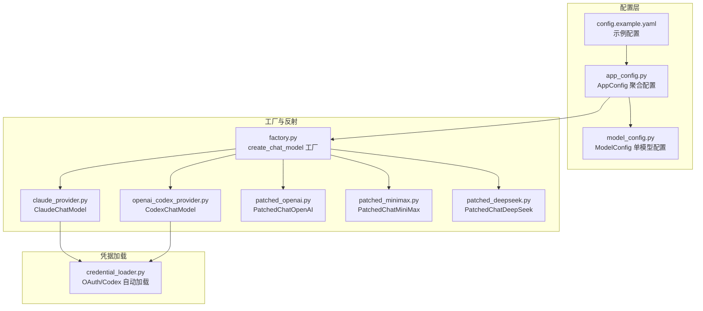
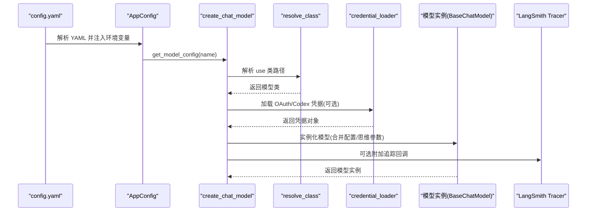
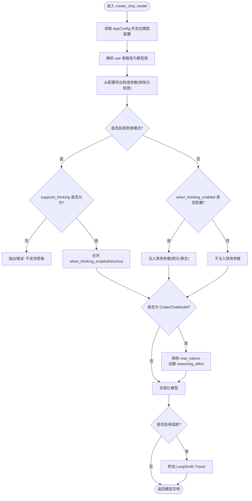
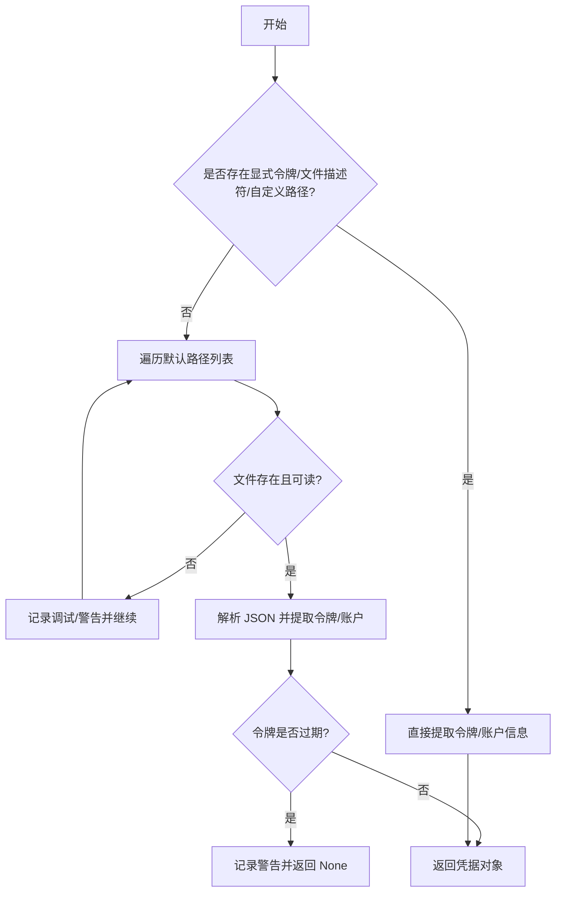
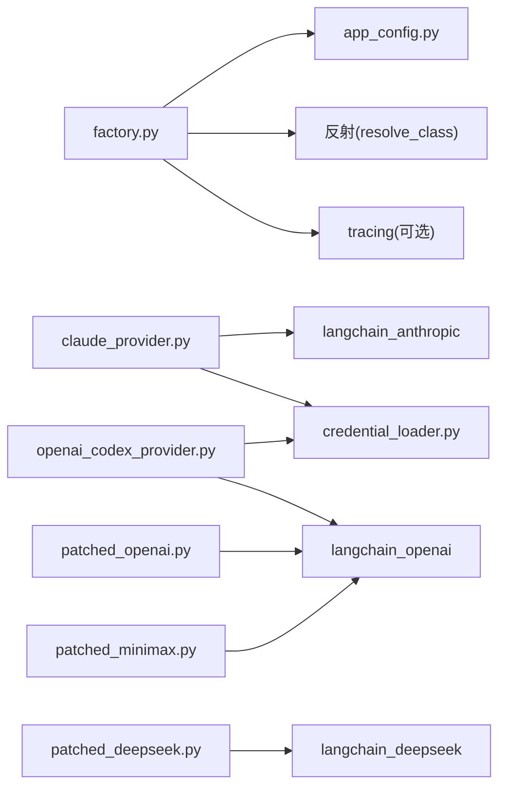

# 模型配置

<cite>
**本文引用的文件**
- [model_config.py](file://backend/packages/harness/deerflow/config/model_config.py)
- [app_config.py](file://backend/packages/harness/deerflow/config/app_config.py)
- [factory.py](file://backend/packages/harness/deerflow/models/factory.py)
- [credential_loader.py](file://backend/packages/harness/deerflow/models/credential_loader.py)
- [claude_provider.py](file://backend/packages/harness/deerflow/models/claude_provider.py)
- [openai_codex_provider.py](file://backend/packages/harness/deerflow/models/openai_codex_provider.py)
- [patched_openai.py](file://backend/packages/harness/deerflow/models/patched_openai.py)
- [patched_minimax.py](file://backend/packages/harness/deerflow/models/patched_minimax.py)
- [patched_deepseek.py](file://backend/packages/harness/deerflow/models/patched_deepseek.py)
- [config.example.yaml](file://config.example.yaml)
- [test_model_config.py](file://backend/tests/test_model_config.py)
- [test_model_factory.py](file://backend/tests/test_model_factory.py)
</cite>

## 目录
1. [简介](#简介)
2. [项目结构](#项目结构)
3. [核心组件](#核心组件)
4. [架构总览](#架构总览)
5. [详细组件分析](#详细组件分析)
6. [依赖分析](#依赖分析)
7. [性能考虑](#性能考虑)
8. [故障排查指南](#故障排查指南)
9. [结论](#结论)
10. [附录](#附录)

## 简介
本文件面向 DeerFlow 的模型配置系统，系统性阐述 models 配置块的结构与各配置项作用，覆盖模型名称、显示名称、提供者类路径、API 密钥配置、响应式输出与推理能力等；同时对比不同供应商（OpenAI、Claude、Gemini、MiniMax 等）在配置上的差异，并深入解析模型提供者的工厂模式实现与凭据加载机制。文档还提供实际配置示例、性能优化建议以及模型切换与多模型并发使用的最佳实践。

## 项目结构
DeerFlow 的模型配置位于后端 harness 包中，核心文件包括：
- 配置模型定义：用于描述单个模型的配置项
- 应用配置聚合：负责从 YAML 加载、解析环境变量、缓存与重载
- 工厂函数：根据配置动态实例化模型提供者
- 提供者适配器：针对特定供应商或协议进行增强（如 Claude OAuth、Gemini 思维签名、MiniMax 推理内容）
- 凭据加载器：自动从本地文件或环境变量加载 OAuth/Codex 凭据

图表来源
- [config.example.yaml](file://config.example.yaml)
- [app_config.py](file://backend/packages/harness/deerflow/config/app_config.py)
- [model_config.py](file://backend/packages/harness/deerflow/config/model_config.py)
- [factory.py](file://backend/packages/harness/deerflow/models/factory.py)
- [claude_provider.py](file://backend/packages/harness/deerflow/models/claude_provider.py)
- [openai_codex_provider.py](file://backend/packages/harness/deerflow/models/openai_codex_provider.py)
- [patched_openai.py](file://backend/packages/harness/deerflow/models/patched_openai.py)
- [patched_minimax.py](file://backend/packages/harness/deerflow/models/patched_minimax.py)
- [patched_deepseek.py](file://backend/packages/harness/deerflow/models/patched_deepseek.py)
- [credential_loader.py](file://backend/packages/harness/deerflow/models/credential_loader.py)

章节来源
- [config.example.yaml](file://config.example.yaml)
- [app_config.py](file://backend/packages/harness/deerflow/config/app_config.py)
- [model_config.py](file://backend/packages/harness/deerflow/config/model_config.py)
- [factory.py](file://backend/packages/harness/deerflow/models/factory.py)

## 核心组件
- 模型配置数据结构：定义每个模型的唯一标识、显示名、描述、提供者类路径、模型名、响应式输出开关与版本、推理能力支持、视觉输入支持、思维模式相关设置等。
- 应用配置聚合：负责解析 YAML、注入环境变量、缓存与热重载、按名称检索模型配置。
- 工厂函数：依据配置动态解析类路径、合并思维模式参数、处理推理能力、附加追踪回调、实例化 LangChain 基类模型。
- 供应商适配器：针对 Claude OAuth、Gemini 思维签名、MiniMax 推理内容、DeepSeek 多轮推理内容等进行增强。
- 凭据加载器：自动从环境变量、文件描述符、本地 JSON 文件加载 Claude Code OAuth 与 Codex CLI 凭据。

章节来源
- [model_config.py](file://backend/packages/harness/deerflow/config/model_config.py)
- [app_config.py](file://backend/packages/harness/deerflow/config/app_config.py)
- [factory.py](file://backend/packages/harness/deerflow/models/factory.py)
- [credential_loader.py](file://backend/packages/harness/deerflow/models/credential_loader.py)

## 架构总览
下图展示从配置到模型实例化的端到端流程，包括凭据加载与追踪集成：

图表来源
- [app_config.py](file://backend/packages/harness/deerflow/config/app_config.py)
- [factory.py](file://backend/packages/harness/deerflow/models/factory.py)
- [credential_loader.py](file://backend/packages/harness/deerflow/models/credential_loader.py)

## 详细组件分析

### 模型配置数据结构（ModelConfig）
- 关键字段
  - name：模型唯一名称
  - display_name：前端显示名称
  - description：模型描述
  - use：提供者类路径（如 langchain_openai:ChatOpenAI 或 deerflow.models.claude_provider:ClaudeChatModel）
  - model：模型名（由提供者解释）
  - use_responses_api：是否通过 /v1/responses API（仅对 OpenAI 兼容响应式接口有效）
  - output_version：响应式输出版本（如 responses/v1）
  - supports_thinking：是否支持思维模式
  - supports_reasoning_effort：是否支持推理强度（reasoning_effort）
  - when_thinking_enabled：启用思维时传入的额外参数（如 extra_body.thinking）
  - thinking：思维模式快捷设置（与 when_thinking_enabled 合并）
  - supports_vision：是否支持视觉/图像输入
  - 其他：api_key、base_url、max_tokens、temperature 等由提供者消费

- 字段行为要点
  - 支持额外字段（extra="allow"），便于扩展
  - 通过 model_dump(exclude_none, exclude=...) 将配置映射到模型构造参数，排除不参与构造的元信息字段

章节来源
- [model_config.py](file://backend/packages/harness/deerflow/config/model_config.py)
- [test_model_config.py](file://backend/tests/test_model_config.py)

### 应用配置聚合（AppConfig）
- 责任
  - 解析 config.yaml，支持 DEER_FLOW_CONFIG_PATH 环境变量
  - 递归解析环境变量占位符（$VAR）
  - 缓存与热重载：基于文件路径与修改时间判断是否需要重新加载
  - 提供 get_model_config(name) 按名称检索模型配置

- 配置版本检查
  - 对比 config.example.yaml 中的 config_version，提示升级

章节来源
- [app_config.py](file://backend/packages/harness/deerflow/config/app_config.py)
- [config.example.yaml](file://config.example.yaml)

### 工厂模式与模型实例化（create_chat_model）
- 控制流
  - 获取 AppConfig，选择模型（name 为空则取第一个）
  - 解析 use 类路径为模型类
  - 从配置导出构造参数（排除元信息字段），合并思维模式参数
  - 根据 supports_thinking 与 when_thinking_enabled 决定开启/关闭思维模式，并注入相应参数
  - 对 CodexChatModel 进行特殊处理（移除不支持的 max_tokens，映射 reasoning_effort）
  - 可选附加 LangSmith 追踪回调

- 思维模式处理
  - when_thinking_enabled 与 thinking 快捷字段合并
  - 开启：若提供者支持，注入 extra_body.thinking 或直接 thinking 参数
  - 关闭：对 OpenAI 兼容网关注入 extra_body.thinking.type=disabled 与 reasoning_effort=minimal；对原生 Anthropic 注入 thinking.type=disabled
  - 不支持推理强度时，清理 reasoning_effort

- 追踪集成
  - 若启用追踪，附加 LangChainTracer 到模型回调

图表来源
- [factory.py](file://backend/packages/harness/deerflow/models/factory.py)

章节来源
- [factory.py](file://backend/packages/harness/deerflow/models/factory.py)
- [test_model_factory.py](file://backend/tests/test_model_factory.py)

### 凭据加载机制（Claude Code OAuth 与 Codex CLI）
- Claude Code OAuth
  - 支持环境变量、文件描述符、自定义路径与默认路径 ~/.claude/.credentials.json
  - 自动检测 OAuth 令牌前缀，必要时注入 anthropic-beta 请求头
  - 支持过期检测与日志提示
- Codex CLI
  - 从 ~/.codex/auth.json 读取 access_token 与 account_id
  - 支持旧版与新版嵌套结构
  - 未找到时返回 None

图表来源
- [credential_loader.py](file://backend/packages/harness/deerflow/models/credential_loader.py)

章节来源
- [credential_loader.py](file://backend/packages/harness/deerflow/models/credential_loader.py)

### 供应商适配器与特殊配置

#### Claude（OAuth 与提示缓存）
- 特性
  - 自动识别 OAuth 令牌并切换 Authorization: Bearer
  - 注入 anthropic-beta 请求头
  - 原生 OAuth 令牌限制 prompt caching，自动禁用
  - 自动分配思维预算（max_tokens 的 80%）
  - 指数退避重试与速率限制处理
- 配置要点
  - use: deerflow.models.claude_provider:ClaudeChatModel
  - 支持 enable_prompt_caching、auto_thinking_budget、retry_max_attempts 等自定义字段
  - 支持 supports_thinking、supports_vision、supports_reasoning_effort

章节来源
- [claude_provider.py](file://backend/packages/harness/deerflow/models/claude_provider.py)

#### OpenAI Codex（Responses API）
- 特性
  - 使用 chatgpt.com/backend-api/codex/responses 接口
  - 自动加载 ~/.codex/auth.json 或 CODEX_AUTH_PATH
  - 流式 SSE 支持、指数退避重试
  - 将工具调用与推理内容映射为 Responses API 形态
- 配置要点
  - use: deerflow.models.openai_codex_provider:CodexChatModel
  - 支持 reasoning_effort、retry_max_attempts
  - 通过 factory 映射 reasoning_effort 与禁用逻辑

章节来源
- [openai_codex_provider.py](file://backend/packages/harness/deerflow/models/openai_codex_provider.py)
- [factory.py](file://backend/packages/harness/deerflow/models/factory.py)

#### Gemini（OpenAI 兼容网关 + 思维签名）
- 问题
  - 在启用思维时，需要在多轮对话中回显 tool-call 的 thought_signature
- 解决
  - PatchedChatOpenAI 将原始 AIMessage 中的 tool_calls 回显到请求负载
- 配置要点
  - use: deerflow.models.patched_openai:PatchedChatOpenAI
  - base_url 指向网关
  - supports_thinking: true、supports_vision: true
  - when_thinking_enabled.extra_body.thinking.type: enabled

章节来源
- [patched_openai.py](file://backend/packages/harness/deerflow/models/patched_openai.py)

#### MiniMax（推理内容保留）
- 问题
  - 原始 ChatOpenAI 会忽略 provider-specific reasoning_details
- 解决
  - PatchedChatMiniMax 保留 reasoning_split 并将推理内容注入 additional_kwargs.reasoning_content
- 配置要点
  - use: langchain_openai:ChatOpenAI（或自定义包装）
  - base_url 指向 MiniMax 网关
  - supports_thinking: true（若网关支持）

章节来源
- [patched_minimax.py](file://backend/packages/harness/deerflow/models/patched_minimax.py)

#### DeepSeek（多轮推理内容）
- 问题
  - 多轮对话中需要在所有助手消息中携带 reasoning_content
- 解决
  - PatchedChatDeepSeek 将 additional_kwargs.reasoning_content 注入请求负载
- 配置要点
  - use: deerflow.models.patched_deepseek:PatchedChatDeepSeek
  - supports_thinking: true

章节来源
- [patched_deepseek.py](file://backend/packages/harness/deerflow/models/patched_deepseek.py)

## 依赖分析
- 组件耦合
  - factory 依赖 AppConfig 与反射解析 resolve_class，以及 tracing 配置
  - 供应商适配器依赖 LangChain 提供者基类（ChatAnthropic、ChatOpenAI、ChatDeepSeek 等）
  - 凭据加载器独立于模型配置，但被 Claude/Codex 适配器使用
- 外部依赖
  - LangChain 生态（BaseChatModel、回调、消息类型）
  - httpx（Codex SSE）
  - anthropic SDK（Claude 错误类型与客户端修补）

图表来源
- [factory.py](file://backend/packages/harness/deerflow/models/factory.py)
- [app_config.py](file://backend/packages/harness/deerflow/config/app_config.py)
- [claude_provider.py](file://backend/packages/harness/deerflow/models/claude_provider.py)
- [openai_codex_provider.py](file://backend/packages/harness/deerflow/models/openai_codex_provider.py)
- [patched_openai.py](file://backend/packages/harness/deerflow/models/patched_openai.py)
- [patched_minimax.py](file://backend/packages/harness/deerflow/models/patched_minimax.py)
- [patched_deepseek.py](file://backend/packages/harness/deerflow/models/patched_deepseek.py)
- [credential_loader.py](file://backend/packages/harness/deerflow/models/credential_loader.py)

## 性能考虑
- 选择合适的模型与提供者
  - Claude：支持 OAuth 与提示缓存，适合长上下文与思维模式；OAuth 令牌限制缓存
  - Gemini（网关）：需保留 thought_signature，避免无效参数导致 400
  - MiniMax/DeepSeek：需要推理内容透传，避免多轮丢失
- 思维模式与推理强度
  - 开启思维时，合理设置推理强度与预算，避免超限
  - CodexChatModel 会移除不支持的 max_tokens，并映射 reasoning_effort
- 追踪与开销
  - 追踪回调会增加少量开销，仅在调试阶段启用
- 多模型并发
  - 通过工厂函数按需实例化，避免全局共享状态
  - 使用不同的 base_url 与凭据隔离不同供应商

## 故障排查指南
- “模型未找到”
  - 确认 name 正确，或调用时不传 name 让工厂使用第一个模型
- “不支持思维”
  - 当 when_thinking_enabled 配置存在时，若 supports_thinking 为 False，工厂会报错
- “禁用思维未生效”
  - 网关格式：确保注入了 extra_body.thinking.type=disabled 与 reasoning_effort=minimal
  - 原生格式：确保注入 thinking.type=disabled
- “推理强度未传递”
  - supports_reasoning_effort 为 False 时会被清理；若提供者支持，应保持为 True
- “Claude OAuth 未生效”
  - 确认令牌前缀与 anthropic-beta 请求头已注入；检查 ~/.claude/.credentials.json 是否存在且未过期
- “Codex CLI 未加载”
  - 检查 ~/.codex/auth.json 或 CODEX_AUTH_PATH；确认 access_token 与 account_id 存在

章节来源
- [factory.py](file://backend/packages/harness/deerflow/models/factory.py)
- [credential_loader.py](file://backend/packages/harness/deerflow/models/credential_loader.py)
- [test_model_factory.py](file://backend/tests/test_model_factory.py)

## 结论
DeerFlow 的模型配置体系以 Pydantic 数据模型为核心，结合工厂模式与反射机制，实现了灵活、可扩展的模型实例化流程。通过供应商适配器解决不同平台的协议差异与特性需求，辅以凭据加载与追踪集成，既保证了易用性，也兼顾了生产可用性。遵循本文的最佳实践与排障建议，可在多供应商、多模型场景下稳定运行并获得良好性能。

## 附录

### 配置示例与最佳实践
- OpenAI（原生）
  - use: langchain_openai:ChatOpenAI
  - api_key: $OPENAI_API_KEY
  - 支持 supports_thinking、supports_vision、supports_reasoning_effort
- OpenAI Responses API
  - use: langchain_openai:ChatOpenAI
  - api_key: $OPENAI_API_KEY
  - use_responses_api: true
  - output_version: responses/v1
- Claude（OAuth）
  - use: deerflow.models.claude_provider:ClaudeChatModel
  - 支持 anthropic-beta 请求头与提示缓存
- Gemini（网关 + 思维）
  - use: deerflow.models.patched_openai:PatchedChatOpenAI
  - base_url: https://<gateway>/v1
  - when_thinking_enabled.extra_body.thinking.type: enabled
- MiniMax（推理内容）
  - use: langchain_openai:ChatOpenAI
  - base_url: https://api.minimax.io/v1
  - supports_thinking: true
- DeepSeek（多轮推理）
  - use: deerflow.models.patched_deepseek:PatchedChatDeepSeek
  - supports_thinking: true

章节来源
- [config.example.yaml](file://config.example.yaml)