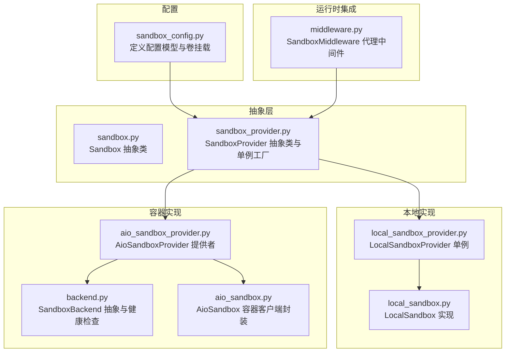
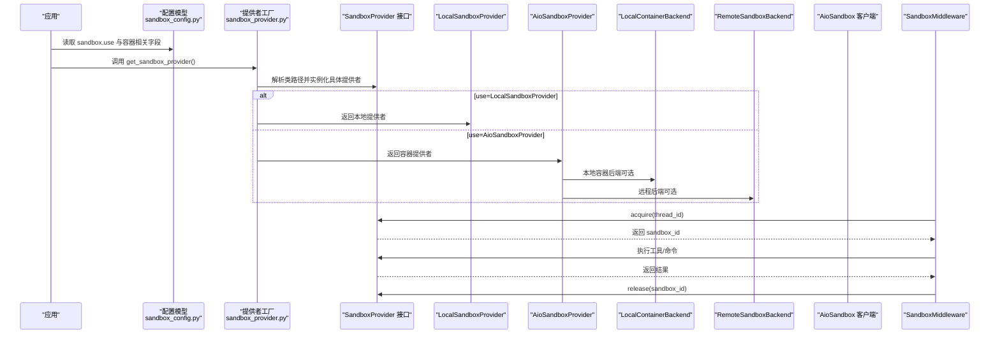
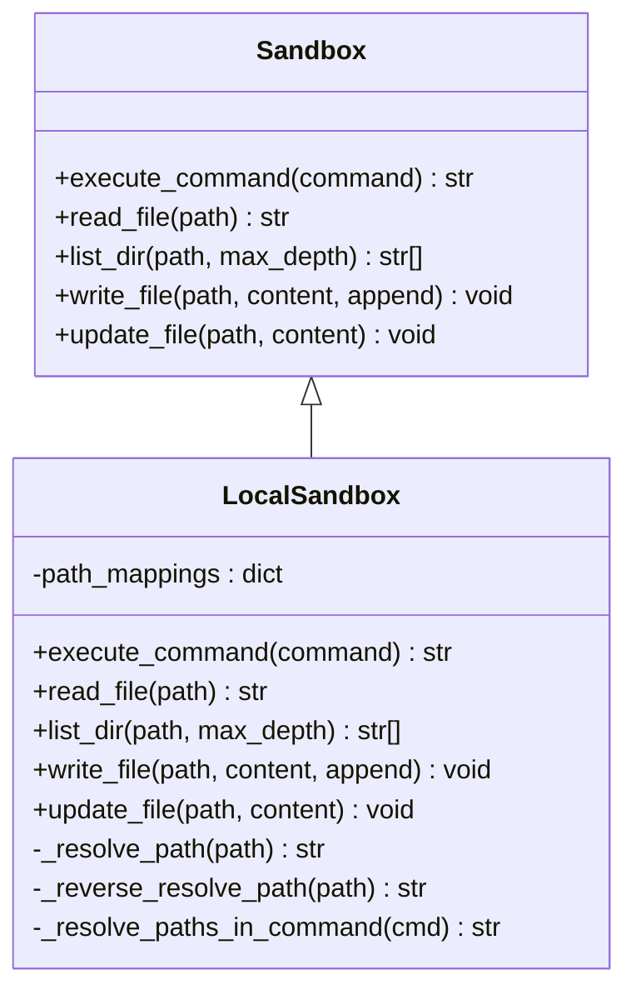
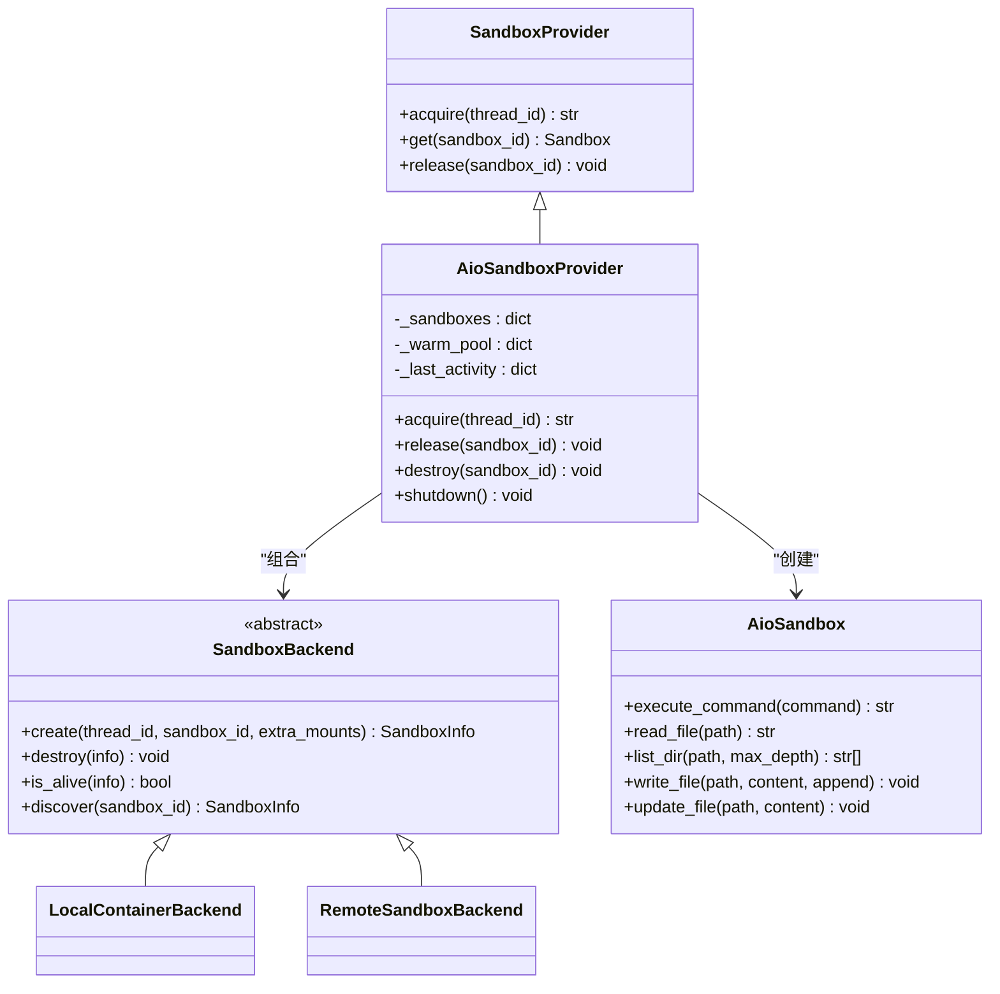
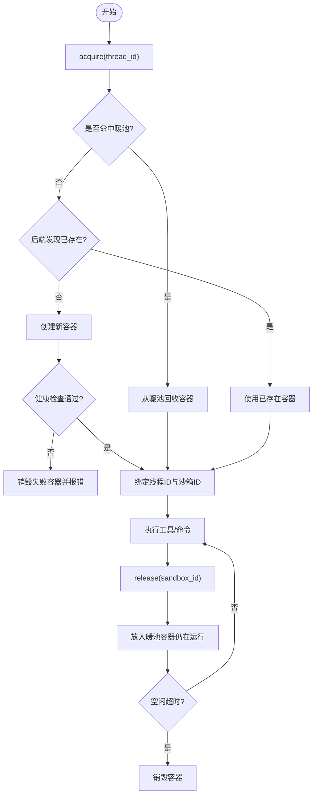
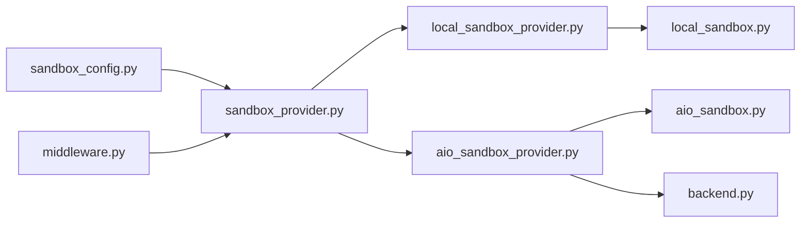

# 沙箱配置

<cite>
**本文引用的文件**
- [sandbox_config.py](file://backend/packages/harness/deerflow/config/sandbox_config.py)
- [sandbox.py](file://backend/packages/harness/deerflow/sandbox/sandbox.py)
- [sandbox_provider.py](file://backend/packages/harness/deerflow/sandbox/sandbox_provider.py)
- [local_sandbox.py](file://backend/packages/harness/deerflow/sandbox/local/local_sandbox.py)
- [local_sandbox_provider.py](file://backend/packages/harness/deerflow/sandbox/local/local_sandbox_provider.py)
- [aio_sandbox.py](file://backend/packages/harness/deerflow/community/aio_sandbox/aio_sandbox.py)
- [aio_sandbox_provider.py](file://backend/packages/harness/deerflow/community/aio_sandbox/aio_sandbox_provider.py)
- [backend.py](file://backend/packages/harness/deerflow/community/aio_sandbox/backend.py)
- [middleware.py](file://backend/packages/harness/deerflow/sandbox/middleware.py)
</cite>

## 目录
1. [简介](#简介)
2. [项目结构](#项目结构)
3. [核心组件](#核心组件)
4. [架构总览](#架构总览)
5. [详细组件分析](#详细组件分析)
6. [依赖分析](#依赖分析)
7. [性能考虑](#性能考虑)
8. [故障排查指南](#故障排查指南)
9. [结论](#结论)
10. [附录：平台与安全配置最佳实践](#附录平台与安全配置最佳实践)

## 简介
本文件面向 DeerFlow 的沙箱配置系统，系统性阐述三种执行模式（本地沙箱、容器沙箱、受管沙箱）的配置差异、适用场景、关键参数与性能特征，并给出跨平台（Linux、macOS、Windows）的最佳实践与安全/资源限制建议。读者可据此在不同环境中正确选择与配置沙箱后端，以平衡隔离性、性能与运维复杂度。

## 项目结构
围绕沙箱配置与运行的核心模块分布如下：
- 配置模型：定义沙箱配置项与卷挂载结构
- 抽象接口：统一沙箱能力与沙箱提供者接口
- 本地实现：直接使用宿主机命令与文件系统
- 容器实现：通过 HTTP API 连接 AIO 沙箱容器
- 提供者层：负责生命周期管理、并发控制、空闲回收、线程绑定
- 中间件：在代理执行流程中按需分配/释放沙箱

**图表来源**
- [sandbox_config.py:12-61](file://backend/packages/harness/deerflow/config/sandbox_config.py#L12-L61)
- [sandbox.py:4-73](file://backend/packages/harness/deerflow/sandbox/sandbox.py#L4-L73)
- [sandbox_provider.py:8-97](file://backend/packages/harness/deerflow/sandbox/sandbox_provider.py#L8-L97)
- [local_sandbox_provider.py:12-65](file://backend/packages/harness/deerflow/sandbox/local/local_sandbox_provider.py#L12-L65)
- [local_sandbox.py:10-215](file://backend/packages/harness/deerflow/sandbox/local/local_sandbox.py#L10-L215)
- [aio_sandbox_provider.py:45-613](file://backend/packages/harness/deerflow/community/aio_sandbox/aio_sandbox_provider.py#L45-L613)
- [backend.py:38-99](file://backend/packages/harness/deerflow/community/aio_sandbox/backend.py#L38-L99)
- [aio_sandbox.py:11-129](file://backend/packages/harness/deerflow/community/aio_sandbox/aio_sandbox.py#L11-L129)
- [middleware.py:21-84](file://backend/packages/harness/deerflow/sandbox/middleware.py#L21-L84)

**章节来源**
- [sandbox_config.py:12-61](file://backend/packages/harness/deerflow/config/sandbox_config.py#L12-L61)
- [sandbox_provider.py:42-97](file://backend/packages/harness/deerflow/sandbox/sandbox_provider.py#L42-L97)
- [aio_sandbox_provider.py:45-120](file://backend/packages/harness/deerflow/community/aio_sandbox/aio_sandbox_provider.py#L45-L120)

## 核心组件
- 配置模型
  - 通用字段：use（提供者类路径）、mounts（卷挂载列表）、environment（环境变量字典）
  - 容器提供者特有字段：image、port、replicas、container_prefix、idle_timeout
  - 卷挂载子结构：host_path、container_path、read_only
- 抽象接口
  - Sandbox：统一命令执行、文件读写、目录列举等能力
  - SandboxProvider：统一 acquire/get/release 生命周期管理
- 本地实现
  - LocalSandbox：将容器路径映射到宿主机路径，执行命令、读写文件、列举目录
  - LocalSandboxProvider：单例提供者，自动建立技能目录映射
- 容器实现
  - AioSandbox：通过 HTTP API 访问远端沙箱容器，支持命令执行、文件读写、目录列举
  - AioSandboxProvider：多后端（本地容器/远程）组合，负责并发池、空闲回收、线程绑定、健康检查
  - SandboxBackend：抽象容器后端接口（本地/远程），定义 create/destroy/is_alive/discover
- 中间件
  - SandboxMiddleware：在代理调用前后按需分配/释放沙箱，支持惰性初始化与线程复用

**章节来源**
- [sandbox_config.py:4-61](file://backend/packages/harness/deerflow/config/sandbox_config.py#L4-L61)
- [sandbox.py:4-73](file://backend/packages/harness/deerflow/sandbox/sandbox.py#L4-L73)
- [local_sandbox_provider.py:12-65](file://backend/packages/harness/deerflow/sandbox/local/local_sandbox_provider.py#L12-L65)
- [local_sandbox.py:10-215](file://backend/packages/harness/deerflow/sandbox/local/local_sandbox.py#L10-L215)
- [aio_sandbox.py:11-129](file://backend/packages/harness/deerflow/community/aio_sandbox/aio_sandbox.py#L11-L129)
- [aio_sandbox_provider.py:45-613](file://backend/packages/harness/deerflow/community/aio_sandbox/aio_sandbox_provider.py#L45-L613)
- [backend.py:38-99](file://backend/packages/harness/deerflow/community/aio_sandbox/backend.py#L38-L99)
- [middleware.py:21-84](file://backend/packages/harness/deerflow/sandbox/middleware.py#L21-L84)

## 架构总览
下图展示从应用配置到沙箱执行的关键交互链路，涵盖本地与容器两种模式的差异：

**图表来源**
- [sandbox_provider.py:42-56](file://backend/packages/harness/deerflow/sandbox/sandbox_provider.py#L42-L56)
- [local_sandbox_provider.py:45-64](file://backend/packages/harness/deerflow/sandbox/local/local_sandbox_provider.py#L45-L64)
- [aio_sandbox_provider.py:98-119](file://backend/packages/harness/deerflow/community/aio_sandbox/aio_sandbox_provider.py#L98-L119)
- [backend.py:38-99](file://backend/packages/harness/deerflow/community/aio_sandbox/backend.py#L38-L99)
- [aio_sandbox.py:42-57](file://backend/packages/harness/deerflow/community/aio_sandbox/aio_sandbox.py#L42-L57)
- [middleware.py:45-83](file://backend/packages/harness/deerflow/sandbox/middleware.py#L45-L83)

## 详细组件分析

### 本地沙箱（LocalSandbox）
- 设计要点
  - 将容器内路径映射到宿主机路径，支持正向解析与反向解析，保证输出路径对容器视角一致
  - 命令执行前进行路径替换，避免宿主机路径泄露；执行后将本地路径还原为容器路径
  - 文件操作采用 UTF-8 编码，错误时抛出原路径以便定位
- 适用场景
  - 开发调试、无需隔离或隔离要求较低的场景
  - 无 Docker/容器运行时需求，直接使用宿主机命令与文件系统
- 性能特征
  - 无容器冷启动开销，延迟低
  - 受宿主机 I/O 与进程模型影响，不提供网络隔离
- 关键行为
  - 路径映射：容器路径前缀优先匹配最长前缀，确保精确替换
  - 命令解析：使用正则匹配容器路径片段，避免误替换
  - 输出处理：将宿主机绝对路径替换回容器路径，保持对外透明

**图表来源**
- [sandbox.py:4-73](file://backend/packages/harness/deerflow/sandbox/sandbox.py#L4-L73)
- [local_sandbox.py:10-215](file://backend/packages/harness/deerflow/sandbox/local/local_sandbox.py#L10-L215)

**章节来源**
- [local_sandbox.py:10-215](file://backend/packages/harness/deerflow/sandbox/local/local_sandbox.py#L10-L215)
- [local_sandbox_provider.py:12-65](file://backend/packages/harness/deerflow/sandbox/local/local_sandbox_provider.py#L12-L65)

### 容器沙箱（AioSandboxProvider + AioSandbox）
- 设计要点
  - 通过 HTTP API 访问远端沙箱容器，支持命令执行、文件读写、目录列举
  - 多后端策略：本地容器后端（自动拉起/端口管理）、远程后端（连接已有服务）
  - 并发与空闲回收：基于线程 ID 的确定性沙箱 ID、暖池复用、空闲超时清理
  - 线程绑定：同一 thread_id 在多轮对话中复用同一沙箱，减少冷启动
- 适用场景
  - 需要隔离与可重复性的生产环境
  - 需要跨进程/跨 Pod 的沙箱发现与复用
- 性能特征
  - 首次创建存在容器准备时间；通过暖池与线程绑定降低后续延迟
  - 受网络与容器编排影响，需关注健康检查与超时设置
- 关键行为
  - 后端选择：优先使用远程后端（若配置了 provisioner_url），否则本地容器后端
  - 环境变量解析：以 $ 开头的值从宿主环境变量解析
  - 挂载策略：线程工作区、上传目录、输出目录与只读技能目录挂载
  - 空闲回收：后台线程定期扫描并销毁长时间未使用的容器

**图表来源**
- [sandbox_provider.py:8-36](file://backend/packages/harness/deerflow/sandbox/sandbox_provider.py#L8-L36)
- [aio_sandbox_provider.py:45-120](file://backend/packages/harness/deerflow/community/aio_sandbox/aio_sandbox_provider.py#L45-L120)
- [backend.py:38-99](file://backend/packages/harness/deerflow/community/aio_sandbox/backend.py#L38-L99)
- [aio_sandbox.py:11-129](file://backend/packages/harness/deerflow/community/aio_sandbox/aio_sandbox.py#L11-L129)

**章节来源**
- [aio_sandbox_provider.py:45-613](file://backend/packages/harness/deerflow/community/aio_sandbox/aio_sandbox_provider.py#L45-L613)
- [backend.py:16-35](file://backend/packages/harness/deerflow/community/aio_sandbox/backend.py#L16-L35)
- [aio_sandbox.py:42-129](file://backend/packages/harness/deerflow/community/aio_sandbox/aio_sandbox.py#L42-L129)

### 受管沙箱（Managed Sandbox）
- 设计要点
  - 通过 provisioner_url 切换至远程后端，由外部编排系统（如 K8s）动态创建/销毁沙箱
  - 适合需要集中治理、弹性扩缩容与资源配额控制的场景
- 适用场景
  - 多租户或多团队共享的沙箱集群
  - 需要与现有 CI/CD 或任务调度系统集成
- 性能特征
  - 创建/销毁由外部系统管理，延迟取决于编排系统响应
  - 通过线程绑定与暖池策略降低抖动

**章节来源**
- [aio_sandbox_provider.py:107-110](file://backend/packages/harness/deerflow/community/aio_sandbox/aio_sandbox_provider.py#L107-L110)

### 执行模式对比与配置差异
- 本地沙箱
  - use 指向本地提供者类路径
  - 不涉及容器镜像、端口、副本数等容器相关配置
  - 通过 path_mappings 将容器路径映射到宿主机路径
- 容器沙箱
  - use 指向容器提供者类路径
  - image/port/container_prefix/idle_timeout/replicas/mounts/environment 等容器相关配置生效
  - 支持本地容器后端或远程后端
- 受管沙箱
  - 通过 provisioner_url 指定外部编排服务地址
  - 其他容器配置仍可保留，但实际创建/销毁由外部系统接管

**章节来源**
- [sandbox_config.py:18-26](file://backend/packages/harness/deerflow/config/sandbox_config.py#L18-L26)
- [aio_sandbox_provider.py:107-119](file://backend/packages/harness/deerflow/community/aio_sandbox/aio_sandbox_provider.py#L107-L119)

### 容器配置选项详解
- 镜像选择
  - image：容器镜像名称与标签，默认值见提供者常量
- 端口映射
  - port：容器基础端口，用于本地容器后端的端口分配
- 并发限制
  - replicas：最大并发容器数量；超过时采用最近最少使用（LRU）策略驱逐
- 挂载目录
  - mounts：主机路径到容器路径的挂载列表，支持只读标记
  - 线程级挂载：工作区、上传、输出目录自动挂载
  - 技能目录：只读挂载到容器指定路径
- 环境变量
  - environment：注入容器环境变量；以 $ 开头的值从宿主环境解析

**章节来源**
- [sandbox_config.py:32-59](file://backend/packages/harness/deerflow/config/sandbox_config.py#L32-L59)
- [aio_sandbox_provider.py:131-141](file://backend/packages/harness/deerflow/community/aio_sandbox/aio_sandbox_provider.py#L131-L141)
- [aio_sandbox_provider.py:168-225](file://backend/packages/harness/deerflow/community/aio_sandbox/aio_sandbox_provider.py#L168-L225)

### 生命周期与空闲回收流程

**图表来源**
- [aio_sandbox_provider.py:330-511](file://backend/packages/harness/deerflow/community/aio_sandbox/aio_sandbox_provider.py#L330-L511)
- [aio_sandbox_provider.py:229-296](file://backend/packages/harness/deerflow/community/aio_sandbox/aio_sandbox_provider.py#L229-L296)
- [backend.py:16-35](file://backend/packages/harness/deerflow/community/aio_sandbox/backend.py#L16-L35)

## 依赖分析
- 组件耦合
  - 提供者工厂依赖应用配置解析与类解析工具，解耦具体实现
  - 本地与容器实现均实现 Sandbox 抽象，便于替换
  - AioSandboxProvider 组合 SandboxBackend，支持本地/远程后端切换
- 外部依赖
  - 容器模式依赖 Docker/Apple Container 运行时与网络连通性
  - 远程后端依赖外部编排系统提供的服务地址与鉴权机制
- 循环依赖
  - 未发现循环导入；提供者工厂与实现通过字符串类路径解耦

**图表来源**
- [sandbox_provider.py:3-5](file://backend/packages/harness/deerflow/sandbox/sandbox_provider.py#L3-L5)
- [aio_sandbox_provider.py:23-32](file://backend/packages/harness/deerflow/community/aio_sandbox/aio_sandbox_provider.py#L23-L32)

**章节来源**
- [sandbox_provider.py:42-56](file://backend/packages/harness/deerflow/sandbox/sandbox_provider.py#L42-L56)
- [aio_sandbox_provider.py:98-119](file://backend/packages/harness/deerflow/community/aio_sandbox/aio_sandbox_provider.py#L98-L119)

## 性能考虑
- 本地沙箱
  - 无容器启动/网络开销，延迟最低；但缺乏隔离与资源限制
- 容器沙箱
  - 首次创建存在冷启动成本；通过暖池与线程绑定显著降低后续延迟
  - replicas 控制并发上限，避免资源争用导致的抖动
  - idle_timeout 控制空闲容器销毁时机，平衡资源占用与热身成本
- 线程绑定与复用
  - 同一 thread_id 的确定性沙箱 ID 保证跨轮次复用，减少重复初始化
- 健康检查与超时
  - 健康检查与超时参数需结合网络与容器负载调整，避免误判

[本节为通用指导，无需列出具体文件来源]

## 故障排查指南
- 无法连接容器沙箱
  - 检查容器后端是否可用、端口是否开放、健康检查是否通过
  - 查看提供者的日志与异常堆栈，确认创建/发现阶段的错误原因
- 环境变量未生效
  - 确认 environment 中以 $ 开头的变量名与宿主环境一致
- 路径显示异常
  - 本地沙箱输出路径被还原为容器路径；若显示宿主机绝对路径，检查路径映射与解析逻辑
- 并发过高导致创建失败
  - 适当提高 replicas，或优化 idle_timeout 以释放闲置容器
- 中间件未释放沙箱
  - 确认中间件在 after_agent 阶段调用了 release；必要时在应用关闭时调用提供者的 shutdown

**章节来源**
- [aio_sandbox_provider.py:229-296](file://backend/packages/harness/deerflow/community/aio_sandbox/aio_sandbox_provider.py#L229-L296)
- [aio_sandbox.py:51-57](file://backend/packages/harness/deerflow/community/aio_sandbox/aio_sandbox.py#L51-L57)
- [local_sandbox.py:166-174](file://backend/packages/harness/deerflow/sandbox/local/local_sandbox.py#L166-L174)
- [middleware.py:67-83](file://backend/packages/harness/deerflow/sandbox/middleware.py#L67-L83)

## 结论
DeerFlow 的沙箱配置体系通过统一抽象与提供者工厂，实现了本地与容器两种模式的无缝切换。本地沙箱适合开发与低隔离需求，容器沙箱提供强隔离与可扩展性，受管沙箱则面向集中治理与弹性编排。合理配置镜像、端口、并发与挂载，并结合线程绑定与空闲回收策略，可在不同平台上获得稳定且高性能的执行体验。

[本节为总结性内容，无需列出具体文件来源]

## 附录：平台与安全配置最佳实践

- Linux
  - 使用容器沙箱时，确保 Docker/Containerd 正常运行并开放所需端口
  - 通过只读挂载限制对宿主机文件系统的写入风险
  - 合理设置 replicas 与 idle_timeout，避免资源耗尽
- macOS
  - Apple 容器运行时可用时优先使用，减少虚拟化开销
  - 注意路径映射与权限问题，必要时使用只读挂载
- Windows
  - 建议使用 WSL2 后端配合 Docker Desktop，提升容器兼容性
  - 挂载路径需遵循 Windows/WSL 路径约定，避免大小写敏感问题
- 安全与资源限制
  - 优先使用只读挂载（特别是技能目录），减少攻击面
  - 通过环境变量注入最小必要凭据，避免硬编码
  - 对外暴露端口仅限必要范围，结合防火墙策略
  - 在容器内启用非 root 用户运行（如镜像支持），降低特权逃逸风险
- 资源限制
  - 在容器后端侧设置 CPU/内存限额（如 Docker 资源限制）
  - 通过 replicas 控制并发，避免过度竞争
  - 使用 idle_timeout 清理闲置容器，释放资源

[本节为通用指导，无需列出具体文件来源]