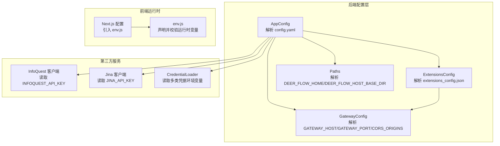
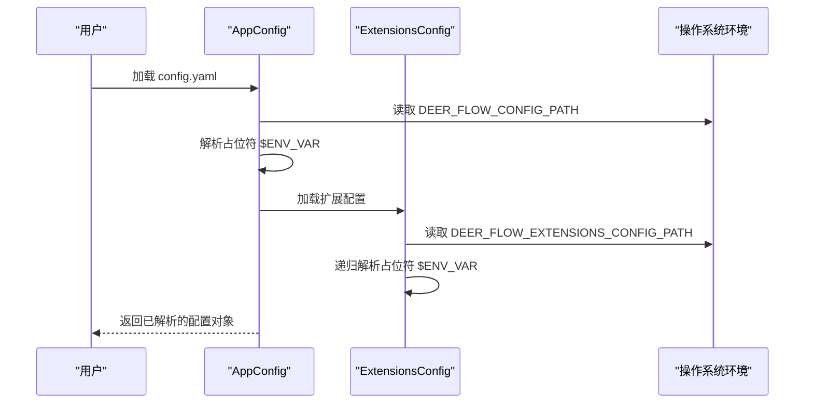
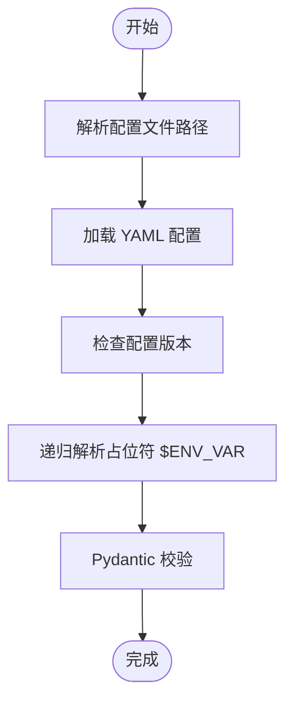
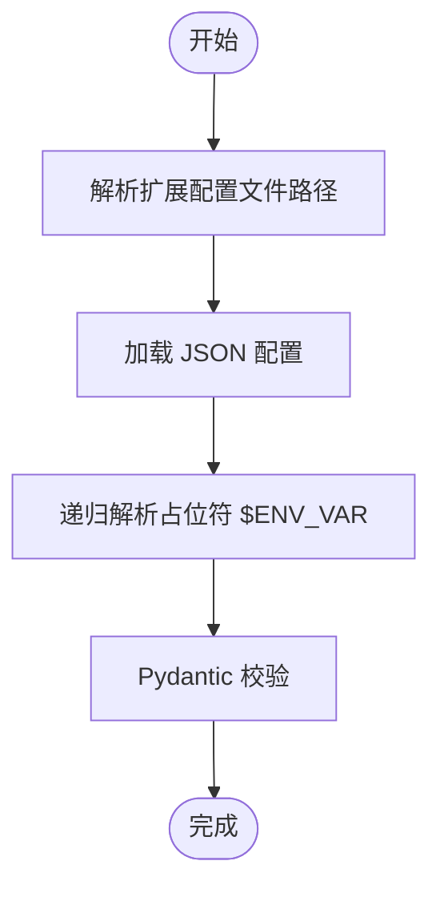
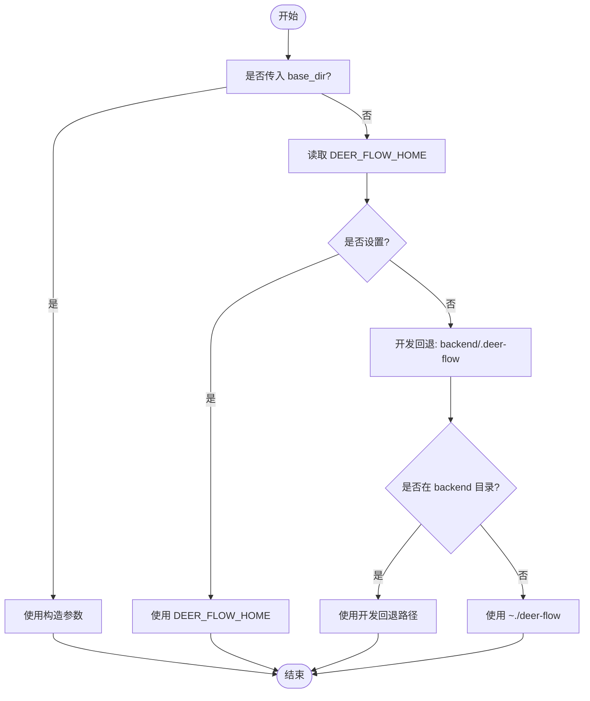
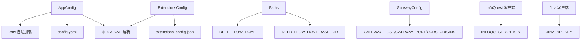

# 环境变量管理

<cite>
**本文引用的文件**
- [config.example.yaml](file://config.example.yaml)
- [app_config.py](file://backend/packages/harness/deerflow/config/app_config.py)
- [extensions_config.py](file://backend/packages/harness/deerflow/config/extensions_config.py)
- [paths.py](file://backend/packages/harness/deerflow/config/paths.py)
- [config.py](file://backend/app/gateway/config.py)
- [infoquest_client.py](file://backend/packages/harness/deerflow/community/infoquest/infoquest_client.py)
- [jina_client.py](file://backend/packages/harness/deerflow/community/jina_ai/jina_client.py)
- [credential_loader.py](file://backend/packages/harness/deerflow/models/credential_loader.py)
- [env.js](file://frontend/src/env.js)
- [next.config.js](file://frontend/next.config.js)
</cite>

## 目录
1. [简介](#简介)
2. [项目结构](#项目结构)
3. [核心组件](#核心组件)
4. [架构总览](#架构总览)
5. [详细组件分析](#详细组件分析)
6. [依赖分析](#依赖分析)
7. [性能考虑](#性能考虑)
8. [故障排查指南](#故障排查指南)
9. [结论](#结论)
10. [附录](#附录)

## 简介
本文件系统性阐述 DeerFlow 的环境变量管理体系，覆盖以下方面：
- 环境变量在配置系统中的作用与使用规则
- 在配置文件中引用环境变量的方式与变量替换优先级
- 常用环境变量清单及用途（API 密钥、数据库连接、日志级别等）
- 安全管理最佳实践与敏感信息保护方法
- 不同部署环境下的配置策略与示例

## 项目结构
DeerFlow 的环境变量管理横跨后端 Python 配置层、前端 Next.js 运行时、以及部分第三方服务客户端。关键位置如下：
- 后端应用配置：通过 YAML 配置文件加载并支持环境变量占位符解析
- 扩展配置（MCP 与技能）：独立 JSON 文件，同样支持环境变量占位符解析
- 路径与运行时目录：通过环境变量控制数据根目录与主机挂载路径
- 网关配置：直接从环境变量读取绑定地址、端口与 CORS 源
- 第三方服务客户端：从环境变量读取 API 密钥
- 前端 Next.js：通过 env.js 显式声明并校验运行时环境变量

**图表来源**
- [app_config.py:74-131](file://backend/packages/harness/deerflow/config/app_config.py#L74-L131)
- [extensions_config.py:119-144](file://backend/packages/harness/deerflow/config/extensions_config.py#L119-L144)
- [paths.py:39-70](file://backend/packages/harness/deerflow/config/paths.py#L39-L70)
- [config.py:17-27](file://backend/app/gateway/config.py#L17-L27)
- [infoquest_client.py:28-117](file://backend/packages/harness/deerflow/community/infoquest/infoquest_client.py#L28-L117)
- [jina_client.py:15-16](file://backend/packages/harness/deerflow/community/jina_ai/jina_client.py#L15-L16)
- [credential_loader.py:59-175](file://backend/packages/harness/deerflow/models/credential_loader.py#L59-L175)
- [next.config.js:1-12](file://frontend/next.config.js#L1-L12)
- [env.js:33-60](file://frontend/src/env.js#L33-L60)

**章节来源**
- [app_config.py:45-72](file://backend/packages/harness/deerflow/config/app_config.py#L45-L72)
- [extensions_config.py:70-117](file://backend/packages/harness/deerflow/config/extensions_config.py#L70-L117)
- [paths.py:39-70](file://backend/packages/harness/deerflow/config/paths.py#L39-L70)
- [config.py:17-27](file://backend/app/gateway/config.py#L17-L27)
- [infoquest_client.py:28-117](file://backend/packages/harness/deerflow/community/infoquest/infoquest_client.py#L28-L117)
- [jina_client.py:15-16](file://backend/packages/harness/deerflow/community/jina_ai/jina_client.py#L15-L16)
- [credential_loader.py:59-175](file://backend/packages/harness/deerflow/models/credential_loader.py#L59-L175)
- [next.config.js:1-12](file://frontend/next.config.js#L1-L12)
- [env.js:33-60](file://frontend/src/env.js#L33-L60)

## 核心组件
- 应用配置解析器（AppConfig）
  - 支持从 YAML 配置文件加载，并在加载前对所有字段值进行环境变量占位符解析
  - 占位符格式为 $ENV_VARNAME；当变量未设置时，会抛出错误
  - 支持通过 DEER_FLOW_CONFIG_PATH 指定配置文件路径
- 扩展配置解析器（ExtensionsConfig）
  - 支持从 JSON 配置文件加载 MCP 服务器与技能状态
  - 对字符串类型的值进行递归环境变量解析；未解析到的占位符会被替换为空字符串
  - 支持通过 DEER_FLOW_EXTENSIONS_CONFIG_PATH 指定配置文件路径
- 路径与运行时目录（Paths）
  - 通过 DEER_FLOW_HOME 控制应用数据根目录
  - 通过 DEER_FLOW_HOST_BASE_DIR 控制容器内挂载映射的主机侧路径
- 网关配置（GatewayConfig）
  - 直接从环境变量读取绑定地址、端口与 CORS 源列表
- 第三方服务客户端
  - InfoQuest 客户端与 Jina 客户端从各自 API 密钥环境变量读取凭据
- 前端 Next.js
  - 通过 env.js 显式声明并校验运行时变量，支持跳过验证用于容器构建

**章节来源**
- [app_config.py:178-201](file://backend/packages/harness/deerflow/config/app_config.py#L178-L201)
- [extensions_config.py:146-175](file://backend/packages/harness/deerflow/config/extensions_config.py#L146-L175)
- [paths.py:52-64](file://backend/packages/harness/deerflow/config/paths.py#L52-L64)
- [config.py:17-27](file://backend/app/gateway/config.py#L17-L27)
- [infoquest_client.py:28-117](file://backend/packages/harness/deerflow/community/infoquest/infoquest_client.py#L28-L117)
- [jina_client.py:15-16](file://backend/packages/harness/deerflow/community/jina_ai/jina_client.py#L15-L16)
- [env.js:33-60](file://frontend/src/env.js#L33-L60)

## 架构总览
下图展示了环境变量在配置加载流程中的作用与优先级：

**图表来源**
- [app_config.py:45-72](file://backend/packages/harness/deerflow/config/app_config.py#L45-L72)
- [app_config.py:178-201](file://backend/packages/harness/deerflow/config/app_config.py#L178-L201)
- [extensions_config.py:70-117](file://backend/packages/harness/deerflow/config/extensions_config.py#L70-L117)
- [extensions_config.py:146-175](file://backend/packages/harness/deerflow/config/extensions_config.py#L146-L175)

## 详细组件分析

### 应用配置解析器（AppConfig）
- 配置文件定位优先级
  - 参数指定路径 > 环境变量 DEER_FLOW_CONFIG_PATH > 当前目录 config.yaml > 父目录 config.yaml
- 环境变量解析规则
  - 字符串以 $ 开头即视为占位符，使用 os.getenv 解析
  - 若变量不存在，解析过程会抛出错误，阻止启动
- 典型用途
  - API 密钥、模型基础地址、工具与渠道配置等敏感或环境相关字段

**图表来源**
- [app_config.py:74-131](file://backend/packages/harness/deerflow/config/app_config.py#L74-L131)
- [app_config.py:178-201](file://backend/packages/harness/deerflow/config/app_config.py#L178-L201)

**章节来源**
- [app_config.py:45-72](file://backend/packages/harness/deerflow/config/app_config.py#L45-L72)
- [app_config.py:178-201](file://backend/packages/harness/deerflow/config/app_config.py#L178-L201)
- [config.example.yaml:6-7](file://config.example.yaml#L6-L7)

### 扩展配置解析器（ExtensionsConfig）
- 配置文件定位优先级
  - 参数指定路径 > 环境变量 DEER_FLOW_EXTENSIONS_CONFIG_PATH > 当前/父目录 extensions_config.json 或 mcp_config.json
- 环境变量解析规则
  - 递归遍历字典与数组，对字符串类型的 $ENV_VAR 占位符进行解析
  - 未解析到的占位符被替换为空字符串，避免传递原始占位符
- 典型用途
  - MCP 服务器命令参数、HTTP 头部、OAuth 凭据等

**图表来源**
- [extensions_config.py:119-144](file://backend/packages/harness/deerflow/config/extensions_config.py#L119-L144)
- [extensions_config.py:146-175](file://backend/packages/harness/deerflow/config/extensions_config.py#L146-L175)

**章节来源**
- [extensions_config.py:70-117](file://backend/packages/harness/deerflow/config/extensions_config.py#L70-L117)
- [extensions_config.py:146-175](file://backend/packages/harness/deerflow/config/extensions_config.py#L146-L175)

### 路径与运行时目录（Paths）
- 数据根目录优先级
  - 显式构造函数参数 > 环境变量 DEER_FLOW_HOME > 开发回退（backend/.deer-flow）> 用户主目录 ~/.deer-flow
- 主机挂载映射
  - 容器内挂载路径与主机侧路径不一致时，可通过 DEER_FLOW_HOST_BASE_DIR 指定主机侧路径
- 典型用途
  - 内核态持久化数据、线程工作空间、上传与输出目录等

**图表来源**
- [paths.py:39-70](file://backend/packages/harness/deerflow/config/paths.py#L39-L70)

**章节来源**
- [paths.py:39-70](file://backend/packages/harness/deerflow/config/paths.py#L39-L70)

### 网关配置（GatewayConfig）
- 直接从环境变量读取
  - 绑定地址：GATEWAY_HOST
  - 端口：GATEWAY_PORT
  - CORS 源：CORS_ORIGINS（逗号分隔）
- 典型用途
  - 控制后端网关服务的监听地址与跨域策略

**章节来源**
- [config.py:17-27](file://backend/app/gateway/config.py#L17-L27)

### 第三方服务客户端
- InfoQuest 客户端
  - 从 INFOQUEST_API_KEY 读取密钥，若存在则注入 Authorization 头
- Jina 客户端
  - 从 JINA_API_KEY 读取密钥，若存在则注入 Authorization 头
- 凭据加载器（CredentialLoader）
  - 支持多种凭据来源与覆盖路径，如 CLAUDE_CODE_CREDENTIALS_PATH、CLAUDE_CODE_OAUTH_TOKEN、ANTHROPIC_AUTH_TOKEN 等

**章节来源**
- [infoquest_client.py:28-117](file://backend/packages/harness/deerflow/community/infoquest/infoquest_client.py#L28-L117)
- [jina_client.py:15-16](file://backend/packages/harness/deerflow/community/jina_ai/jina_client.py#L15-L16)
- [credential_loader.py:59-175](file://backend/packages/harness/deerflow/models/credential_loader.py#L59-L175)

### 前端 Next.js 环境变量
- env.js 显式声明并校验运行时变量，例如：
  - 认证相关：BETTER_AUTH_SECRET、BETTER_AUTH_GITHUB_* 等
  - 前端公开变量：NEXT_PUBLIC_* 前缀
  - 后端服务地址：NEXT_PUBLIC_BACKEND_BASE_URL、NEXT_PUBLIC_LANGGRAPH_BASE_URL
  - 可选跳过校验：SKIP_ENV_VALIDATION
- next.config.js 引入 env.js 以启用校验

**章节来源**
- [env.js:33-60](file://frontend/src/env.js#L33-L60)
- [next.config.js:1-12](file://frontend/next.config.js#L1-L12)

## 依赖分析
- 配置解析链路
  - AppConfig 依赖 dotenv 自动加载 .env（在模块导入时执行），随后对 YAML 配置进行占位符解析
  - ExtensionsConfig 独立于 AppConfig，但共享相同的占位符解析策略
- 运行时依赖
  - 网关配置直接依赖环境变量，不经过文件解析
  - 路径解析依赖环境变量决定数据根目录与挂载映射
  - 第三方客户端依赖对应 API 密钥环境变量

**图表来源**
- [app_config.py:25-27](file://backend/packages/harness/deerflow/config/app_config.py#L25-L27)
- [app_config.py:93-93](file://backend/packages/harness/deerflow/config/app_config.py#L93-L93)
- [extensions_config.py:139-139](file://backend/packages/harness/deerflow/config/extensions_config.py#L139-L139)
- [paths.py:63-64](file://backend/packages/harness/deerflow/config/paths.py#L63-L64)
- [config.py:21-26](file://backend/app/gateway/config.py#L21-L26)
- [infoquest_client.py:28-117](file://backend/packages/harness/deerflow/community/infoquest/infoquest_client.py#L28-L117)
- [jina_client.py:15-16](file://backend/packages/harness/deerflow/community/jina_ai/jina_client.py#L15-L16)

**章节来源**
- [app_config.py:25-27](file://backend/packages/harness/deerflow/config/app_config.py#L25-L27)
- [extensions_config.py:139-139](file://backend/packages/harness/deerflow/config/extensions_config.py#L139-L139)
- [paths.py:63-64](file://backend/packages/harness/deerflow/config/paths.py#L63-L64)
- [config.py:21-26](file://backend/app/gateway/config.py#L21-L26)
- [infoquest_client.py:28-117](file://backend/packages/harness/deerflow/community/infoquest/infoquest_client.py#L28-L117)
- [jina_client.py:15-16](file://backend/packages/harness/deerflow/community/jina_ai/jina_client.py#L15-L16)

## 性能考虑
- 环境变量解析成本极低，主要为字符串替换与一次 os.getenv 调用
- 对于大型嵌套结构（如扩展配置），递归解析的时间复杂度与键数量线性相关
- 建议：
  - 将频繁访问的非敏感配置放入文件，仅对敏感或环境差异项使用占位符
  - 避免在配置中使用过多深层嵌套，减少解析开销

## 故障排查指南
- 启动时报错“未找到环境变量”
  - 症状：AppConfig 在解析 $ENV_VAR 时抛出错误
  - 排查：确认该环境变量已在当前 shell 或 .env 中设置
  - 参考：[app_config.py:190-196](file://backend/packages/harness/deerflow/config/app_config.py#L190-L196)
- 占位符未生效或为空
  - 症状：ExtensionsConfig 中 $ENV_VAR 未解析，最终值为空字符串
  - 排查：确认占位符格式正确且变量已设置；注意此行为与 AppConfig 不同
  - 参考：[extensions_config.py:160-168](file://backend/packages/harness/deerflow/config/extensions_config.py#L160-L168)
- 配置文件路径解析失败
  - 症状：找不到 config.yaml 或 extensions_config.json
  - 排查：检查 DEER_FLOW_CONFIG_PATH/DEER_FLOW_EXTENSIONS_CONFIG_PATH 是否正确
  - 参考：[app_config.py:58-63](file://backend/packages/harness/deerflow/config/app_config.py#L58-L63)、[extensions_config.py:90-95](file://backend/packages/harness/deerflow/config/extensions_config.py#L90-L95)
- 网关无法绑定端口或跨域异常
  - 症状：浏览器跨域报错或服务无法监听
  - 排查：检查 GATEWAY_HOST、GATEWAY_PORT、CORS_ORIGINS 设置
  - 参考：[config.py:21-26](file://backend/app/gateway/config.py#L21-L26)
- 第三方服务调用失败
  - 症状：401/403 或凭据无效
  - 排查：确认 INFOQUEST_API_KEY/JINA_API_KEY 已设置
  - 参考：[infoquest_client.py:116-117](file://backend/packages/harness/deerflow/community/infoquest/infoquest_client.py#L116-L117)、[jina_client.py:15-16](file://backend/packages/harness/deerflow/community/jina_ai/jina_client.py#L15-L16)

**章节来源**
- [app_config.py:190-196](file://backend/packages/harness/deerflow/config/app_config.py#L190-L196)
- [extensions_config.py:160-168](file://backend/packages/harness/deerflow/config/extensions_config.py#L160-L168)
- [app_config.py:58-63](file://backend/packages/harness/deerflow/config/app_config.py#L58-L63)
- [extensions_config.py:90-95](file://backend/packages/harness/deerflow/config/extensions_config.py#L90-L95)
- [config.py:21-26](file://backend/app/gateway/config.py#L21-L26)
- [infoquest_client.py:116-117](file://backend/packages/harness/deerflow/community/infoquest/infoquest_client.py#L116-L117)
- [jina_client.py:15-16](file://backend/packages/harness/deerflow/community/jina_ai/jina_client.py#L15-L16)

## 结论
DeerFlow 的环境变量管理遵循“显式、可追溯、可验证”的原则：
- 配置层统一采用 $ENV_VAR 占位符，确保敏感信息不出现在代码仓库
- 不同组件采用不同的解析策略（严格 vs 宽松），满足不同场景需求
- 通过环境变量控制路径、网关与第三方服务凭据，实现灵活部署与安全隔离

## 附录

### 环境变量清单与用途
- 应用配置与路径
  - DEER_FLOW_CONFIG_PATH：指定 config.yaml 路径
  - DEER_FLOW_EXTENSIONS_CONFIG_PATH：指定扩展配置路径
  - DEER_FLOW_HOME：应用数据根目录
  - DEER_FLOW_HOST_BASE_DIR：容器挂载映射的主机侧路径
- 网关服务
  - GATEWAY_HOST：绑定地址
  - GATEWAY_PORT：监听端口
  - CORS_ORIGINS：允许的跨域源（逗号分隔）
- 第三方服务
  - INFOQUEST_API_KEY：InfoQuest API 密钥
  - JINA_API_KEY：Jina API 密钥
- 认证与前端
  - BETTER_AUTH_SECRET：Better Auth 秘钥
  - BETTER_AUTH_GITHUB_CLIENT_ID/CLIENT_SECRET：GitHub OAuth 客户端凭据
  - NEXT_PUBLIC_BACKEND_BASE_URL/NEXT_PUBLIC_LANGGRAPH_BASE_URL：前端公开后端地址
  - SKIP_ENV_VALIDATION：跳过前端环境变量校验（容器构建常用）

**章节来源**
- [app_config.py:58-63](file://backend/packages/harness/deerflow/config/app_config.py#L58-L63)
- [extensions_config.py:90-95](file://backend/packages/harness/deerflow/config/extensions_config.py#L90-L95)
- [paths.py:52-64](file://backend/packages/harness/deerflow/config/paths.py#L52-L64)
- [config.py:21-26](file://backend/app/gateway/config.py#L21-L26)
- [infoquest_client.py:28-117](file://backend/packages/harness/deerflow/community/infoquest/infoquest_client.py#L28-L117)
- [jina_client.py:15-16](file://backend/packages/harness/deerflow/community/jina_ai/jina_client.py#L15-L16)
- [env.js:33-60](file://frontend/src/env.js#L33-L60)

### 配置文件中的占位符示例
- 模型 API 密钥示例：$OPENAI_API_KEY、$ANTHROPIC_API_KEY、$GEMINI_API_KEY 等
- 渠道令牌示例：$FEISHU_APP_ID、$FEISHU_APP_SECRET、$SLACK_BOT_TOKEN、$TELEGRAM_BOT_TOKEN 等
- 工具与沙箱环境变量示例：$TAVILY_API_KEY、$MY_API_KEY、$DATABASE_URL 等

**章节来源**
- [config.example.yaml:56-57](file://config.example.yaml#L56-L57)
- [config.example.yaml:76-77](file://config.example.yaml#L76-L77)
- [config.example.yaml:88-89](file://config.example.yaml#L88-L89)
- [config.example.yaml:101-102](file://config.example.yaml#L101-L102)
- [config.example.yaml:116-117](file://config.example.yaml#L116-L117)
- [config.example.yaml:131-132](file://config.example.yaml#L131-L132)
- [config.example.yaml:147-148](file://config.example.yaml#L147-L148)
- [config.example.yaml:165-167](file://config.example.yaml#L165-L167)
- [config.example.yaml:238-239](file://config.example.yaml#L238-L239)
- [config.example.yaml:361-363](file://config.example.yaml#L361-L363)
- [config.example.yaml:559-572](file://config.example.yaml#L559-L572)

### 变量替换优先级与规则
- 配置文件路径优先级
  - 参数 > 环境变量 > 默认路径
- 占位符解析策略
  - AppConfig：严格模式，未解析到则报错
  - ExtensionsConfig：宽松模式，未解析到则置空
- 前端校验
  - env.js 显式声明变量并可选择跳过校验

**章节来源**
- [app_config.py:45-72](file://backend/packages/harness/deerflow/config/app_config.py#L45-L72)
- [app_config.py:178-201](file://backend/packages/harness/deerflow/config/app_config.py#L178-L201)
- [extensions_config.py:70-117](file://backend/packages/harness/deerflow/config/extensions_config.py#L70-L117)
- [extensions_config.py:146-175](file://backend/packages/harness/deerflow/config/extensions_config.py#L146-L175)
- [env.js:33-60](file://frontend/src/env.js#L33-L60)

### 安全管理最佳实践
- 最小暴露原则
  - 仅在必要处使用占位符，避免在公共配置中硬编码敏感信息
- 分层隔离
  - 使用不同环境变量区分开发、测试、生产环境
- 凭据轮换
  - 定期轮换第三方服务 API 密钥与认证令牌
- 容器安全
  - 在容器编排中使用密文存储（如 Kubernetes Secrets）注入环境变量
- 前端校验
  - 仅暴露 NEXT_PUBLIC_* 前缀的变量，避免泄露后端敏感信息

### 不同部署环境下的配置策略与示例
- 开发环境
  - 使用本地 .env 注入占位符，DEER_FLOW_CONFIG_PATH 指向本地 config.yaml
  - GATEWAY_HOST 设为 0.0.0.0，CORS_ORIGINS 包含前端地址
- 测试环境
  - 通过 CI 环境变量注入 API 密钥，SKIP_ENV_VALIDATION 用于跳过前端校验
- 生产环境
  - 使用密文存储注入 DEER_FLOW_HOME、API 密钥与网关端口
  - 严格限制 CORS_ORIGINS，避免跨域风险