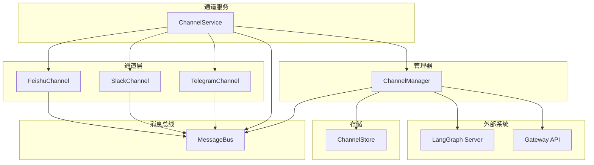
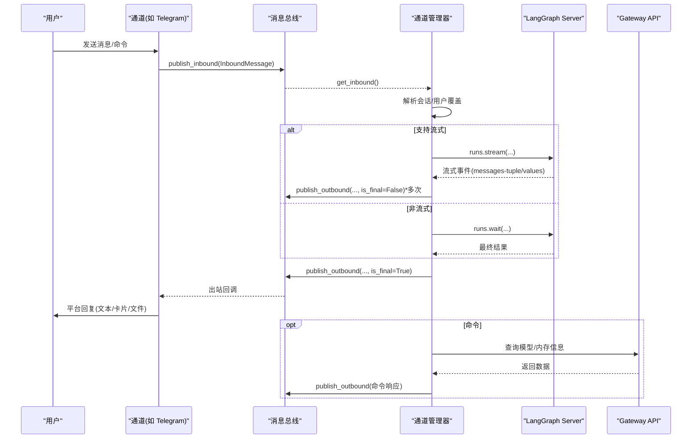
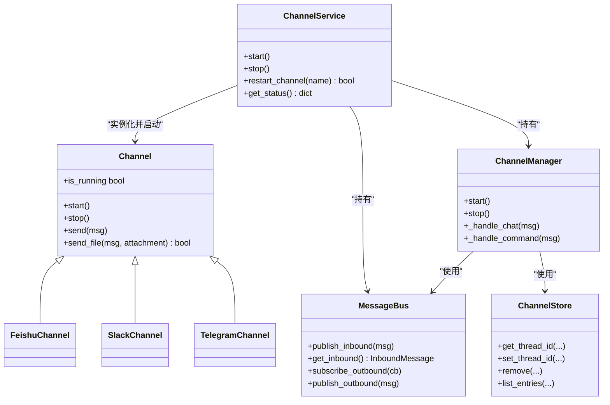
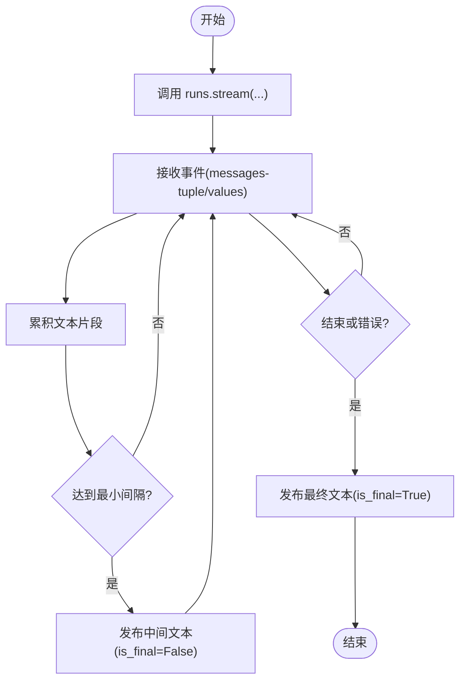

# 通道配置

<cite>
**本文引用的文件**
- [channels/__init__.py](file://backend/app/channels/__init__.py)
- [channels/base.py](file://backend/app/channels/base.py)
- [channels/manager.py](file://backend/app/channels/manager.py)
- [channels/service.py](file://backend/app/channels/service.py)
- [channels/message_bus.py](file://backend/app/channels/message_bus.py)
- [channels/feishu.py](file://backend/app/channels/feishu.py)
- [channels/slack.py](file://backend/app/channels/slack.py)
- [channels/telegram.py](file://backend/app/channels/telegram.py)
- [channels/store.py](file://backend/app/channels/store.py)
- [gateway/routers/channels.py](file://backend/app/gateway/routers/channels.py)
- [config.example.yaml](file://config.example.yaml)
- [tests/test_channels.py](file://backend/tests/test_channels.py)
</cite>

## 目录
1. [简介](#简介)
2. [项目结构](#项目结构)
3. [核心组件](#核心组件)
4. [架构总览](#架构总览)
5. [详细组件分析](#详细组件分析)
6. [依赖关系分析](#依赖关系分析)
7. [性能考量](#性能考量)
8. [故障排除指南](#故障排除指南)
9. [结论](#结论)
10. [附录](#附录)

## 简介
本文件面向 DeerFlow 的即时通讯通道配置系统，聚焦 channels 配置块与各通道（飞书、Slack、Telegram）的集成方式。内容涵盖：
- 通道配置结构与连接参数
- 认证配置与权限控制
- 会话级与用户级配置覆盖机制
- 不同通道的配置示例与最佳实践
- 通道监控、故障排除与性能优化建议
- 配置对用户体验与安全性的潜在影响

## 项目结构
通道子系统位于后端应用的 channels 包中，采用“抽象基类 + 具体通道实现 + 管理器 + 消息总线 + 存储”的分层设计。通道服务负责从应用配置加载 channels 块，并按需启动各通道；管理器负责消息路由、会话上下文合并、LangGraph 调用与流式输出；消息总线提供异步发布/订阅；存储持久化聊天到线程映射。

图表来源
- [channels/service.py:22-179](file://backend/app/channels/service.py#L22-L179)
- [channels/manager.py:317-732](file://backend/app/channels/manager.py#L317-L732)
- [channels/message_bus.py:117-174](file://backend/app/channels/message_bus.py#L117-L174)
- [channels/store.py:16-154](file://backend/app/channels/store.py#L16-L154)

章节来源
- [channels/__init__.py:1-17](file://backend/app/channels/__init__.py#L1-L17)
- [channels/service.py:22-179](file://backend/app/channels/service.py#L22-L179)
- [channels/manager.py:317-732](file://backend/app/channels/manager.py#L317-L732)
- [channels/message_bus.py:117-174](file://backend/app/channels/message_bus.py#L117-L174)
- [channels/store.py:16-154](file://backend/app/channels/store.py#L16-L154)

## 核心组件
- 抽象通道基类：定义通道生命周期（start/stop）、发送接口（send/send_file），以及入站消息构造与出站回调。
- 通道服务：从应用配置解析 channels 块，实例化并启动启用的通道，提供状态查询与重启能力。
- 通道管理器：消费入站消息，创建/复用 LangGraph 线程，调用 runs.wait 或 runs.stream，处理流式更新与附件交付，支持会话级与用户级配置覆盖。
- 消息总线：入站队列与出站监听器，解耦通道与管理器。
- 通道存储：持久化 IM 聊天到 DeerFlow 线程的映射，支持按主题区分。

章节来源
- [channels/base.py:14-109](file://backend/app/channels/base.py#L14-L109)
- [channels/service.py:22-179](file://backend/app/channels/service.py#L22-L179)
- [channels/manager.py:317-732](file://backend/app/channels/manager.py#L317-L732)
- [channels/message_bus.py:117-174](file://backend/app/channels/message_bus.py#L117-L174)
- [channels/store.py:16-154](file://backend/app/channels/store.py#L16-L154)

## 架构总览
通道系统通过“通道服务”统一入口，按配置启用具体通道；通道通过消息总线向管理器提交入站消息；管理器与 LangGraph 交互，产出文本与附件；管理器再通过消息总线将出站消息分发给对应通道进行平台回传。通道可选择性支持文件上传与流式输出。

图表来源
- [channels/manager.py:419-641](file://backend/app/channels/manager.py#L419-L641)
- [channels/message_bus.py:131-174](file://backend/app/channels/message_bus.py#L131-L174)
- [gateway/routers/channels.py:25-53](file://backend/app/gateway/routers/channels.py#L25-L53)

章节来源
- [channels/manager.py:419-641](file://backend/app/channels/manager.py#L419-L641)
- [channels/message_bus.py:131-174](file://backend/app/channels/message_bus.py#L131-L174)
- [gateway/routers/channels.py:25-53](file://backend/app/gateway/routers/channels.py#L25-L53)

## 详细组件分析

### 通道抽象与生命周期
- 抽象通道定义了 start/stop 生命周期与 send/send_file 接口；默认 send_file 返回不支持；提供 _make_inbound 工具与 _on_outbound 回调，确保仅转发目标通道的消息并顺序发送文本与文件附件。
- 通道实现需在 start 中完成平台客户端初始化与事件监听注册，在 stop 中清理资源与取消订阅。

章节来源
- [channels/base.py:14-109](file://backend/app/channels/base.py#L14-L109)

### 通道服务与配置加载
- 通道服务从应用配置中读取 channels 块，提取 langgraph_url、gateway_url、默认会话与各通道会话；按 enabled 字段决定是否启动；通过反射解析通道类路径并实例化；提供状态查询与单通道重启。
- 配置示例位于应用配置文件的 channels 段落，包含全局会话、通道级会话与用户级覆盖。

章节来源
- [channels/service.py:22-179](file://backend/app/channels/service.py#L22-L179)
- [config.example.yaml:537-589](file://config.example.yaml#L537-L589)

### 通道管理器与会话覆盖机制
- 管理器负责：
  - 从消息总线接收入站消息，创建或复用 LangGraph 线程，维护 chat_id/topic_id 到 thread_id 的映射。
  - 合并会话配置：默认会话、通道会话、用户会话三层按优先级合并，形成最终 assistant_id、run_config、run_context。
  - 非流式：调用 runs.wait 获取最终文本与产物列表，准备附件交付。
  - 流式：对支持流式的通道（如飞书）使用 runs.stream，周期性发布中间文本，最终发布 is_final=True 的完整文本。
  - 命令处理：/bootstrap、/new、/status、/models、/memory、/help 等。
- 附件交付：仅允许输出目录下的虚拟路径解析为真实文件，防止越权访问；失败时保留文本回退提示。

章节来源
- [channels/manager.py:317-732](file://backend/app/channels/manager.py#L317-L732)
- [channels/store.py:16-154](file://backend/app/channels/store.py#L16-L154)

### 消息总线与消息模型
- 入站消息类型：CHAT/COMMAND；包含平台标识、聊天/话题/用户标识、文本、附件、元数据等。
- 出站消息：携带 thread_id、附件列表、是否最终消息、线程时间戳等。
- 总线提供入站队列与出站监听器集合，异常不会导致崩溃，但会记录日志。

章节来源
- [channels/message_bus.py:22-174](file://backend/app/channels/message_bus.py#L22-L174)

### 通道实现与平台特性

#### 飞书（WebSocket）
- 连接模式：WebSocket（无需公网 IP）。
- 配置项：app_id、app_secret、verification_token（可选）。
- 特性：支持运行中卡片更新与“完成/确认”反应；文件上传支持图片与多种文档类型，带大小限制；支持线程内回复。
- 错误重试：发送失败自动指数退避重试；文件上传失败记录警告。

章节来源
- [channels/feishu.py:17-537](file://backend/app/channels/feishu.py#L17-L537)

#### Slack（Socket Mode）
- 连接模式：Socket Mode（WebSocket，无需公网 IP）。
- 配置项：bot_token（xoxb-...）、app_token（xapp-...）、allowed_users（可选，白名单）。
- 特性：支持线程内回复与“完成/确认”反应；文件上传；支持 Markdown 转换；可限制用户。
- 错误重试：发送失败自动重试并在错误时添加“×”反应。

章节来源
- [channels/slack.py:19-245](file://backend/app/channels/slack.py#L19-L245)

#### Telegram（长轮询）
- 连接模式：长轮询（无需公网 IP）。
- 配置项：bot_token、allowed_users（可选，白名单）。
- 特性：支持线程内回复（基于最后一条机器人消息）；文件上传支持图片与文档，带大小限制；内置命令处理。
- 错误重试：发送失败自动重试。

章节来源
- [channels/telegram.py:16-316](file://backend/app/channels/telegram.py#L16-L316)

### 会话级与用户级配置覆盖
- 覆盖顺序（优先级递增）：默认会话 → 通道会话 → 用户会话。
- 可覆盖字段：assistant_id、config（如 recursion_limit）、context（如 thinking_enabled、is_plan_mode、subagent_enabled）。
- 示例参考配置文件中的 channels.session 与 channels.telegram.session.users。

章节来源
- [channels/manager.py:354-382](file://backend/app/channels/manager.py#L354-L382)
- [config.example.yaml:548-589](file://config.example.yaml#L548-L589)
- [tests/test_channels.py:461-565](file://backend/tests/test_channels.py#L461-L565)

### 命令与网关集成
- 管理器内置命令：/bootstrap、/new、/status、/models、/memory、/help。
- /models 与 /memory 通过 Gateway API 查询返回，便于统一管理模型与内存状态。
- 网关路由提供通道状态查询与单通道重启接口。

章节来源
- [channels/manager.py:643-720](file://backend/app/channels/manager.py#L643-L720)
- [gateway/routers/channels.py:25-53](file://backend/app/gateway/routers/channels.py#L25-L53)

## 依赖关系分析

图表来源
- [channels/base.py:14-109](file://backend/app/channels/base.py#L14-L109)
- [channels/feishu.py:17-537](file://backend/app/channels/feishu.py#L17-L537)
- [channels/slack.py:19-245](file://backend/app/channels/slack.py#L19-L245)
- [channels/telegram.py:16-316](file://backend/app/channels/telegram.py#L16-L316)
- [channels/service.py:22-179](file://backend/app/channels/service.py#L22-L179)
- [channels/manager.py:317-732](file://backend/app/channels/manager.py#L317-L732)
- [channels/message_bus.py:117-174](file://backend/app/channels/message_bus.py#L117-L174)
- [channels/store.py:16-154](file://backend/app/channels/store.py#L16-L154)

章节来源
- [channels/base.py:14-109](file://backend/app/channels/base.py#L14-L109)
- [channels/service.py:22-179](file://backend/app/channels/service.py#L22-L179)
- [channels/manager.py:317-732](file://backend/app/channels/manager.py#L317-L732)
- [channels/message_bus.py:117-174](file://backend/app/channels/message_bus.py#L117-L174)
- [channels/store.py:16-154](file://backend/app/channels/store.py#L16-L154)

## 性能考量
- 并发控制：管理器使用信号量限制最大并发任务数，避免过载。
- 流式更新节流：流式通道在最小间隔内抑制重复发布，减少平台压力与抖动。
- 文件上传策略：先发文本，文本成功后再尝试文件上传，避免部分交付；对超限文件直接跳过并记录警告。
- 附件解析安全：仅允许输出目录内的虚拟路径解析为真实文件，防止越权访问。
- 通道能力差异：不同通道对流式与文件上传的支持不同，应据此调整期望与配置。

章节来源
- [channels/manager.py:346-403](file://backend/app/channels/manager.py#L346-L403)
- [channels/manager.py:289-315](file://backend/app/channels/manager.py#L289-L315)
- [channels/manager.py:562-605](file://backend/app/channels/manager.py#L562-L605)
- [channels/feishu.py:201-234](file://backend/app/channels/feishu.py#L201-L234)
- [channels/slack.py:131-150](file://backend/app/channels/slack.py#L131-L150)
- [channels/telegram.py:130-170](file://backend/app/channels/telegram.py#L130-L170)

## 故障排除指南
- 通道未启动
  - 检查 channels 块中 enabled 字段与必要配置项（如 app_id/app_secret/bot_token）。
  - 查看通道服务状态与重启接口。
- 发送失败
  - 飞书/Slack/Telegram 均有发送重试与错误反应（如“×”）；关注日志异常堆栈。
  - 文件过大被拒绝：检查通道文件大小限制与附件类型。
- 流式输出异常
  - 飞书流式中断仍会发布最终消息；若未收到最终消息，检查流式事件解析与最小间隔设置。
- 权限问题
  - Slack/Telegram 支持 allowed_users 白名单；非白名单用户消息会被忽略。
- 状态与重启
  - 使用网关路由查询通道状态；必要时调用重启接口恢复。

章节来源
- [channels/feishu.py:168-200](file://backend/app/channels/feishu.py#L168-L200)
- [channels/slack.py:80-130](file://backend/app/channels/slack.py#L80-L130)
- [channels/telegram.py:90-128](file://backend/app/channels/telegram.py#L90-L128)
- [channels/manager.py:635-641](file://backend/app/channels/manager.py#L635-L641)
- [gateway/routers/channels.py:25-53](file://backend/app/gateway/routers/channels.py#L25-L53)

## 结论
DeerFlow 的通道配置系统通过清晰的分层与可插拔设计，实现了多平台即时通讯的统一接入。通过会话级与用户级配置覆盖，可在不修改代码的情况下灵活调整行为；通过消息总线与管理器的解耦，保证了扩展性与稳定性。结合安全的附件解析与合理的性能策略，可在保障安全的前提下提升用户体验。

## 附录

### 配置示例与最佳实践
- channels 块结构
  - 全局：langgraph_url、gateway_url、session（默认会话）
  - 通道：feishu、slack、telegram，各自 enabled 与认证参数
  - 通道级会话：覆盖默认会话
  - 用户级覆盖：按用户 ID 细粒度定制
- 最佳实践
  - 明确指定 allowed_users 以限制访问范围
  - 对高并发场景适当提高最大并发与合理设置流式节流
  - 为飞书启用流式以获得更好的交互体验
  - 将大文件上传限制与平台限制对齐，避免失败重试风暴

章节来源
- [config.example.yaml:537-589](file://config.example.yaml#L537-L589)
- [channels/slack.py:19-245](file://backend/app/channels/slack.py#L19-L245)
- [channels/telegram.py:16-316](file://backend/app/channels/telegram.py#L16-L316)
- [channels/feishu.py:17-537](file://backend/app/channels/feishu.py#L17-L537)

### 关键流程图：流式输出（飞书）

图表来源
- [channels/manager.py:546-641](file://backend/app/channels/manager.py#L546-L641)