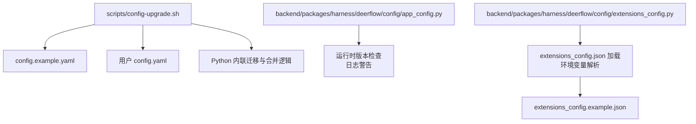
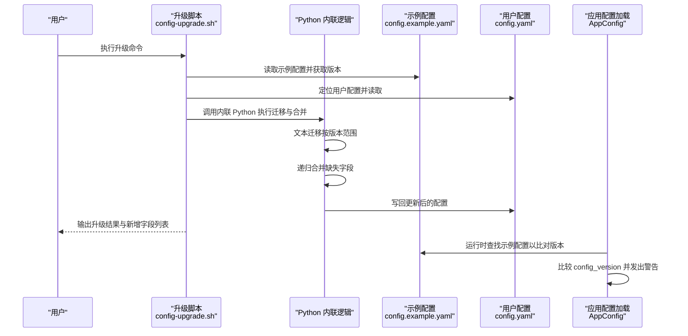
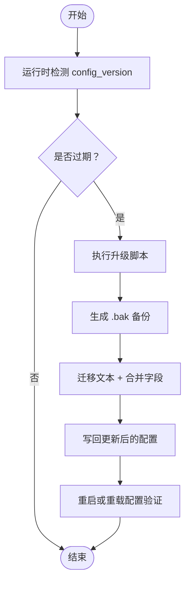
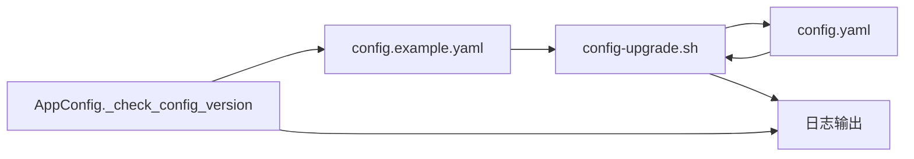

# 配置升级机制

<cite>
**本文引用的文件**
- [scripts/config-upgrade.sh](file://scripts/config-upgrade.sh)
- [config.example.yaml](file://config.example.yaml)
- [backend/packages/harness/deerflow/config/app_config.py](file://backend/packages/harness/deerflow/config/app_config.py)
- [backend/packages/harness/deerflow/config/extensions_config.py](file://backend/packages/harness/deerflow/config/extensions_config.py)
- [backend/tests/test_config_version.py](file://backend/tests/test_config_version.py)
- [extensions_config.example.json](file://extensions_config.example.json)
</cite>

## 目录
1. [简介](#简介)
2. [项目结构](#项目结构)
3. [核心组件](#核心组件)
4. [架构总览](#架构总览)
5. [详细组件分析](#详细组件分析)
6. [依赖关系分析](#依赖关系分析)
7. [性能考量](#性能考量)
8. [故障排查指南](#故障排查指南)
9. [结论](#结论)
10. [附录](#附录)

## 简介
本文件系统化阐述 DeerFlow 的配置版本与升级机制，覆盖以下关键点：
- 配置版本系统：通过 config_version 字段识别过时配置，并在运行时发出警告。
- 升级脚本：自动执行版本迁移、字段合并与备份，确保平滑升级。
- 兼容性规则与迁移策略：基于版本号范围的文本替换与递归字段合并。
- 升级流程与注意事项：从检测到备份、迁移、合并、写回的完整步骤。
- 回滚与降级：通过备份文件恢复，以及版本号回退策略。
- 对现有部署的影响与最佳实践：最小化停机、分阶段验证与安全备份。

## 项目结构
与配置升级相关的核心位置如下：
- 升级脚本：scripts/config-upgrade.sh
- 示例配置：config.example.yaml（包含当前版本号）
- 应用配置加载与版本检查：backend/packages/harness/deerflow/config/app_config.py
- 扩展配置（JSON）：backend/packages/harness/deerflow/config/extensions_config.py 及 extensions_config.example.json
- 升级逻辑测试：backend/tests/test_config_version.py

图表来源
- [scripts/config-upgrade.sh:1-147](file://scripts/config-upgrade.sh#L1-L147)
- [config.example.yaml:1-624](file://config.example.yaml#L1-L624)
- [backend/packages/harness/deerflow/config/app_config.py:134-177](file://backend/packages/harness/deerflow/config/app_config.py#L134-L177)
- [backend/packages/harness/deerflow/config/extensions_config.py:70-144](file://backend/packages/harness/deerflow/config/extensions_config.py#L70-L144)
- [extensions_config.example.json:1-42](file://extensions_config.example.json#L1-L42)

章节来源
- [scripts/config-upgrade.sh:1-147](file://scripts/config-upgrade.sh#L1-L147)
- [config.example.yaml:1-624](file://config.example.yaml#L1-L624)
- [backend/packages/harness/deerflow/config/app_config.py:134-177](file://backend/packages/harness/deerflow/config/app_config.py#L134-L177)
- [backend/packages/harness/deerflow/config/extensions_config.py:70-144](file://backend/packages/harness/deerflow/config/extensions_config.py#L70-L144)
- [extensions_config.example.json:1-42](file://extensions_config.example.json#L1-L42)

## 核心组件
- 升级脚本：负责定位用户配置、读取示例配置、按版本范围执行文本迁移、递归合并缺失字段、备份并写回。
- 运行时版本检查：在加载应用配置前检查用户配置版本，若落后则发出警告提示使用升级命令。
- 扩展配置加载：独立于主配置的 JSON 文件，支持环境变量解析与多路径解析策略。
- 测试用例：验证版本比较、警告触发与边界情况。

章节来源
- [scripts/config-upgrade.sh:38-146](file://scripts/config-upgrade.sh#L38-L146)
- [backend/packages/harness/deerflow/config/app_config.py:134-177](file://backend/packages/harness/deerflow/config/app_config.py#L134-L177)
- [backend/packages/harness/deerflow/config/extensions_config.py:70-144](file://backend/packages/harness/deerflow/config/extensions_config.py#L70-L144)
- [backend/tests/test_config_version.py:1-126](file://backend/tests/test_config_version.py#L1-L126)

## 架构总览
下图展示“检测过时配置”和“自动升级”的端到端流程：

图表来源
- [scripts/config-upgrade.sh:38-146](file://scripts/config-upgrade.sh#L38-L146)
- [config.example.yaml:15](file://config.example.yaml#L15)
- [backend/packages/harness/deerflow/config/app_config.py:134-177](file://backend/packages/harness/deerflow/config/app_config.py#L134-L177)

## 详细组件分析

### 组件一：升级脚本（config-upgrade.sh）
- 功能要点
  - 自动定位 config.yaml（优先级：环境变量 > backend/ > 仓库根目录），找不到则直接复制示例为新配置。
  - 通过内联 Python 读取用户配置与示例配置，比较 config_version。
  - 版本落后时：
    - 按版本范围顺序执行“文本替换迁移”，再进行“递归字段合并”。
    - 总是更新 config_version 为示例版本。
    - 备份原配置为 .bak 后写回。
  - 输出迁移条目、新增字段列表及最终完成信息。

- 关键实现细节
  - 配置定位：支持环境变量 DEER_FLOW_CONFIG_PATH，否则在 backend/ 与仓库根目录查找。
  - 版本比较：用户版本小于示例版本才触发升级；相等或更高则跳过。
  - 文本迁移：以版本为单位的字符串替换，适合值变更场景（如模块路径重命名）。
  - 递归合并：仅添加示例中存在而用户配置缺失的键，保持用户自定义值不变。
  - 备份策略：写回前复制为 .bak，便于回滚。

- 迁移策略与兼容性
  - 文本替换优先用于无法被字典合并捕获的值变化（例如模块路径前缀变更）。
  - 字典合并保证新增结构字段的完整性，避免遗漏导致的运行时错误。

- 注意事项
  - 升级前请确认示例配置存在且可读。
  - 若用户配置中包含敏感信息，请在升级后重新设置。
  - 建议在升级前手动备份 config.yaml。

章节来源
- [scripts/config-upgrade.sh:14-35](file://scripts/config-upgrade.sh#L14-L35)
- [scripts/config-upgrade.sh:57-61](file://scripts/config-upgrade.sh#L57-L61)
- [scripts/config-upgrade.sh:69-84](file://scripts/config-upgrade.sh#L69-L84)
- [scripts/config-upgrade.sh:88-96](file://scripts/config-upgrade.sh#L88-L96)
- [scripts/config-upgrade.sh:107-121](file://scripts/config-upgrade.sh#L107-L121)
- [scripts/config-upgrade.sh:128-134](file://scripts/config-upgrade.sh#L128-L134)
- [scripts/config-upgrade.sh:135-145](file://scripts/config-upgrade.sh#L135-L145)

### 组件二：运行时版本检查（AppConfig）
- 功能要点
  - 在加载配置前，读取示例配置中的 config_version，并与用户配置比较。
  - 用户版本低于示例版本时，记录警告日志，提示执行升级命令。
  - 支持在多层目录中查找示例配置文件，增强灵活性。

- 兼容性规则
  - 缺失 config_version 视为版本 0，确保首次使用能被正确提示。
  - 字符串类型的版本号也能安全比较，避免类型错误。
  - 新版本号高于示例版本不触发警告（防止误报）。

- 影响与最佳实践
  - 建议在 CI/CD 中集成升级检查，确保部署前完成升级。
  - 开发者可在本地启动时关注日志警告，及时处理配置过期问题。

章节来源
- [backend/packages/harness/deerflow/config/app_config.py:134-177](file://backend/packages/harness/deerflow/config/app_config.py#L134-L177)
- [backend/tests/test_config_version.py:35-51](file://backend/tests/test_config_version.py#L35-L51)
- [backend/tests/test_config_version.py:69-84](file://backend/tests/test_config_version.py#L69-L84)
- [backend/tests/test_config_version.py:100-110](file://backend/tests/test_config_version.py#L100-L110)
- [backend/tests/test_config_version.py:112-125](file://backend/tests/test_config_version.py#L112-L125)

### 组件三：扩展配置加载（ExtensionsConfig）
- 功能要点
  - 支持从 extensions_config.json 或历史 mcp_config.json 加载。
  - 提供环境变量解析能力，未解析到的占位符会被替换为空字符串，避免下游接收原始占位符。
  - 提供启用 MCP 服务器与技能状态查询接口。

- 与升级的关系
  - 扩展配置独立于主配置，但同样受示例配置指引（示例 JSON 展示了结构与字段）。
  - 升级脚本主要针对 config.yaml，扩展配置可通过手动对比示例 JSON 进行同步。

章节来源
- [backend/packages/harness/deerflow/config/extensions_config.py:70-144](file://backend/packages/harness/deerflow/config/extensions_config.py#L70-L144)
- [extensions_config.example.json:1-42](file://extensions_config.example.json#L1-L42)

### 组件四：升级流程与回滚
- 升级流程
  1) 检测：运行时检查 config_version 并发出警告。
  2) 执行：调用升级脚本，定位配置与示例，执行迁移与合并。
  3) 备份：写回前生成 .bak 备份文件。
  4) 验证：重启应用或强制重载配置，确认功能正常。
- 回滚与降级
  - 回滚：直接用 .bak 替换当前 config.yaml，恢复到升级前状态。
  - 降级：若示例版本回退（极端情况），可手动将 config_version 改为更低值并重新加载，但需确保字段兼容。

图表来源
- [backend/packages/harness/deerflow/config/app_config.py:134-177](file://backend/packages/harness/deerflow/config/app_config.py#L134-L177)
- [scripts/config-upgrade.sh:38-146](file://scripts/config-upgrade.sh#L38-L146)

## 依赖关系分析
- 升级脚本依赖
  - 示例配置：决定目标版本与新增字段。
  - 用户配置：作为迁移与合并的目标。
  - Python 环境：使用 PyYAML 进行安全解析与转储。
- 运行时依赖
  - 示例配置路径解析：在用户配置所在目录及其父目录向上搜索。
  - 日志输出：向用户提示升级需求。

图表来源
- [config.example.yaml:15](file://config.example.yaml#L15)
- [scripts/config-upgrade.sh:38-146](file://scripts/config-upgrade.sh#L38-L146)
- [backend/packages/harness/deerflow/config/app_config.py:134-177](file://backend/packages/harness/deerflow/config/app_config.py#L134-L177)

章节来源
- [scripts/config-upgrade.sh:38-146](file://scripts/config-upgrade.sh#L38-L146)
- [backend/packages/harness/deerflow/config/app_config.py:134-177](file://backend/packages/harness/deerflow/config/app_config.py#L134-L177)

## 性能考量
- 升级脚本
  - 文本替换与 YAML 解析均为轻量操作，对启动时间影响极小。
  - 递归合并仅处理缺失字段，复杂度与新增键数量线性相关。
- 运行时检查
  - 仅在加载配置时进行一次版本比较与文件查找，开销可忽略。
- 最佳实践
  - 将升级安排在维护窗口内执行，避免在高峰期影响业务。
  - 使用自动化任务定期检查版本并提醒升级。

## 故障排查指南
- 常见问题与处理
  - 示例配置不存在：升级脚本报错退出。请确认示例文件路径正确或使用默认安装。
  - 用户配置未找到：脚本会尝试多种路径，若仍失败，请设置 DEER_FLOW_CONFIG_PATH。
  - 版本比较异常：确保 config_version 为数字；字符串类型会被安全转换。
  - 环境变量未解析：扩展配置中未解析到的占位符会被置空，检查环境变量是否正确设置。
- 验证方法
  - 查看升级脚本输出的迁移与新增字段列表，确认符合预期。
  - 重启应用后观察日志，确认不再出现“配置过期”警告。
  - 运行单元测试以验证版本检查逻辑行为。

章节来源
- [backend/tests/test_config_version.py:35-51](file://backend/tests/test_config_version.py#L35-L51)
- [backend/tests/test_config_version.py:69-84](file://backend/tests/test_config_version.py#L69-L84)
- [backend/tests/test_config_version.py:100-110](file://backend/tests/test_config_version.py#L100-L110)
- [backend/tests/test_config_version.py:112-125](file://backend/tests/test_config_version.py#L112-L125)

## 结论
DeerFlow 的配置升级机制通过“版本号 + 文本迁移 + 字典合并 + 备份写回”的组合，实现了对配置演进的稳健管理。运行时的版本检查与升级脚本协同工作，既保障了兼容性，又降低了升级风险。结合回滚与降级策略，可以在生产环境中安全地推进配置迭代。

## 附录

### 配置字段兼容性与迁移策略速查
- 文本迁移优先：适用于值层面的替换（如模块路径重命名）。
- 字典合并策略：仅追加示例中新增的键，保留用户自定义值。
- 版本号规则：缺失视为 0；字符串可安全比较；更高版本不触发警告。

章节来源
- [scripts/config-upgrade.sh:69-84](file://scripts/config-upgrade.sh#L69-L84)
- [scripts/config-upgrade.sh:107-121](file://scripts/config-upgrade.sh#L107-L121)
- [config.example.yaml:15](file://config.example.yaml#L15)