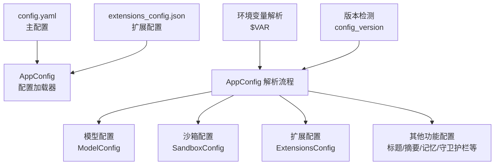
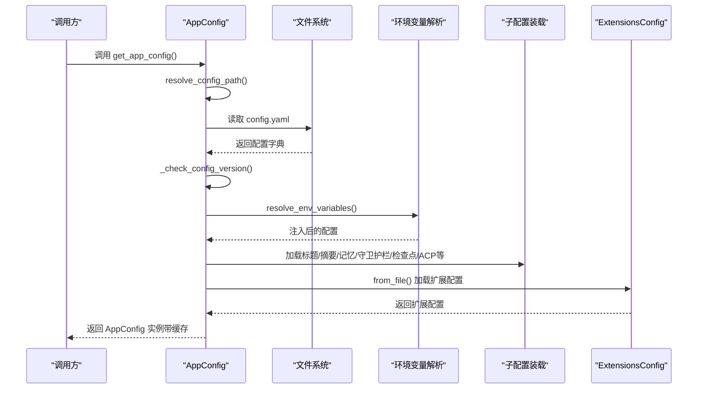
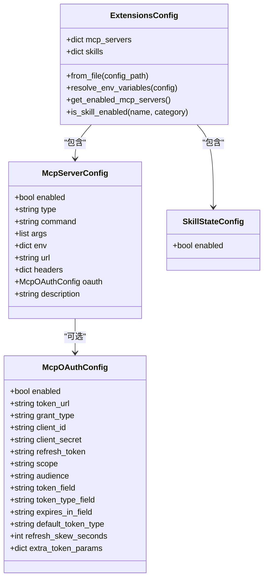
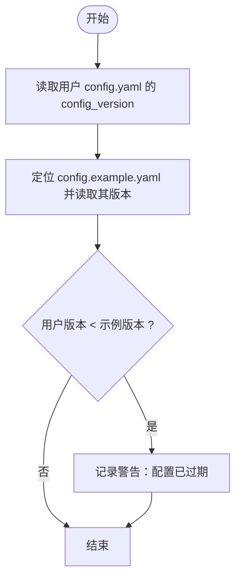
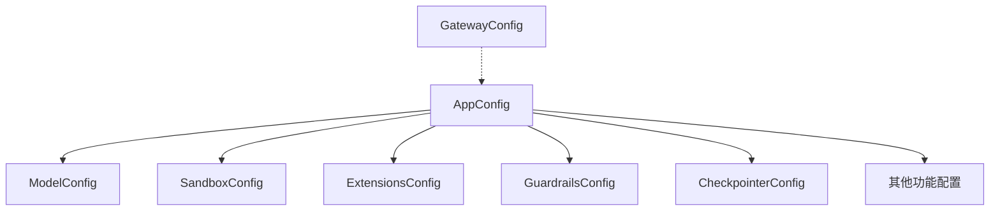

# 配置管理

<cite>
**本文引用的文件**
- [config.example.yaml](file://config.example.yaml)
- [extensions_config.example.json](file://extensions_config.example.json)
- [app_config.py](file://backend/packages/harness/deerflow/config/app_config.py)
- [model_config.py](file://backend/packages/harness/deerflow/config/model_config.py)
- [sandbox_config.py](file://backend/packages/harness/deerflow/config/sandbox_config.py)
- [extensions_config.py](file://backend/packages/harness/deerflow/config/extensions_config.py)
- [config.py](file://backend/app/gateway/config.py)
- [test_config_version.py](file://backend/tests/test_config_version.py)
- [config-upgrade.sh](file://scripts/config-upgrade.sh)
</cite>

## 目录
1. [简介](#简介)
2. [项目结构](#项目结构)
3. [核心组件](#核心组件)
4. [架构总览](#架构总览)
5. [详细组件分析](#详细组件分析)
6. [依赖关系分析](#依赖关系分析)
7. [性能考量](#性能考量)
8. [故障排查指南](#故障排查指南)
9. [结论](#结论)
10. [附录](#附录)

## 简介
本文件为 DeerFlow 配置管理系统提供全面文档，重点覆盖主配置文件 config.yaml 的结构与各配置项作用，扩展配置系统（MCP 服务器与技能）的工作原理与使用方法，环境变量管理策略，配置升级机制与版本控制，以及配置验证规则与最佳实践。读者可据此完成从开发到生产的配置部署与维护。

## 项目结构
DeerFlow 的配置体系由以下部分组成：
- 主配置：config.yaml，定义应用日志、模型、工具、沙箱、标题生成、摘要、记忆、检查点、即时通讯通道、守卫护栏等核心能力。
- 扩展配置：extensions_config.json（或历史兼容文件 mcp_config.json），统一管理 MCP 服务器与技能状态。
- 配置加载与校验：AppConfig 及其子配置类负责解析、校验、缓存与热重载。
- 环境变量：支持在 YAML/JSON 中以 $VAR 形式引用环境变量，并在运行时解析。
- 升级与迁移：通过 config_version 字段与脚本实现版本检测与字段合并。

图表来源
- [app_config.py:45-131](file://backend/packages/harness/deerflow/config/app_config.py#L45-L131)
- [extensions_config.py:69-144](file://backend/packages/harness/deerflow/config/extensions_config.py#L69-L144)

章节来源
- [config.example.yaml:1-624](file://config.example.yaml#L1-L624)
- [extensions_config.example.json:1-42](file://extensions_config.example.json#L1-L42)
- [app_config.py:45-131](file://backend/packages/harness/deerflow/config/app_config.py#L45-L131)

## 核心组件
- AppConfig：主配置入口，负责解析 config.yaml、环境变量注入、版本检测、子配置装载与缓存。
- ModelConfig：模型配置数据结构，描述模型名称、提供者类路径、特性开关与思考相关参数。
- SandboxConfig：沙箱配置数据结构，支持本地与容器沙箱，含镜像、端口、副本数、挂载与环境变量等。
- ExtensionsConfig：扩展配置数据结构，统一管理 MCP 服务器与技能状态，支持 JSON 文件解析与环境变量替换。
- GatewayConfig：网关服务配置（host/port/cors），用于前端与后端通信。

章节来源
- [app_config.py:30-44](file://backend/packages/harness/deerflow/config/app_config.py#L30-L44)
- [model_config.py:4-37](file://backend/packages/harness/deerflow/config/model_config.py#L4-L37)
- [sandbox_config.py:12-61](file://backend/packages/harness/deerflow/config/sandbox_config.py#L12-L61)
- [extensions_config.py:55-67](file://backend/packages/harness/deerflow/config/extensions_config.py#L55-L67)
- [config.py:6-27](file://backend/app/gateway/config.py#L6-L27)

## 架构总览
下图展示配置加载与解析的关键流程，包括路径解析、版本检测、环境变量替换、子配置装载与缓存更新。

图表来源
- [app_config.py:263-288](file://backend/packages/harness/deerflow/config/app_config.py#L263-L288)
- [app_config.py:45-131](file://backend/packages/harness/deerflow/config/app_config.py#L45-L131)
- [extensions_config.py:119-144](file://backend/packages/harness/deerflow/config/extensions_config.py#L119-L144)

## 详细组件分析

### 主配置文件 config.yaml 结构与配置项说明
- 版本与基础
  - config_version：用于检测配置过期并提示升级。
  - log_level：日志级别（debug/info/warning/error）。
- 模型配置（models）
  - 每个模型条目包含：唯一名称、显示名、提供者类路径、模型名、API 基础地址/密钥、温度、最大令牌、视觉支持、思考支持、推理努力支持及启用思考时的额外参数。
  - 支持多种提供商（如 OpenAI、Anthropic、Google、MiniMax、OpenRouter 等），并可按需启用 Responses API 或 OpenAI 兼容网关的思考模式。
- 工具与工具组（tools/tool_groups）
  - 工具组用于组织与访问控制；工具条目包含：名称、分组、提供者类路径、运行参数（如搜索结果数量、超时等）。
  - 示例工具：网页搜索、网页抓取、图片搜索、文件读写、Bash 执行等。
- 工具搜索（tool_search）
  - 延迟加载 MCP 工具，减少上下文开销并提升选择准确性。
- 沙箱配置（sandbox）
  - 支持本地沙箱与容器沙箱（Docker/Apple Container/AIO 沙箱），可配置镜像、端口、并发副本数、容器前缀、空闲超时、挂载目录与注入环境变量。
- 子代理配置（subagents）
  - 可设置默认超时与按代理名的超时覆盖。
- ACP 代理配置（acp_agents）
  - 外部 ACP 兼容代理的命令行与参数，便于代码实现、重构与调试。
- 技能配置（skills）
  - 主机路径与沙箱内挂载路径，便于在不同沙箱模式下访问技能。
- 标题生成（title）
  - 是否启用、最大词数/字符、使用的模型名。
- 摘要（summarization）
  - 触发条件（令牌数、消息数、比例）、保留策略（最近消息数/令牌数/比例）、摘要前裁剪、自定义提示模板。
- 记忆（memory）
  - 启用、存储路径、去抖延迟、模型名、最大事实数、置信阈值、是否注入、最大注入令牌数。
- 检查点（checkpointer）
  - 内存/SQLite/PostgreSQL 三种类型，支持多进程持久化。
- 即时通讯通道（channels）
  - 连接外部消息平台（飞书、Slack、Telegram），支持默认会话、频道级与用户级覆盖。
- 守卫护栏（guardrails）
  - 提供内置白名单、OAP 通行证或自定义提供者，支持预执行授权。

章节来源
- [config.example.yaml:10-15](file://config.example.yaml#L10-L15)
- [config.example.yaml:17-21](file://config.example.yaml#L17-L21)
- [config.example.yaml:32-216](file://config.example.yaml#L32-L216)
- [config.example.yaml:218-314](file://config.example.yaml#L218-L314)
- [config.example.yaml:316-371](file://config.example.yaml#L316-L371)
- [config.example.yaml:373-387](file://config.example.yaml#L373-L387)
- [config.example.yaml:390-412](file://config.example.yaml#L390-L412)
- [config.example.yaml:414-427](file://config.example.yaml#L414-L427)
- [config.example.yaml:430-487](file://config.example.yaml#L430-L487)
- [config.example.yaml:489-501](file://config.example.yaml#L489-L501)
- [config.example.yaml:504-535](file://config.example.yaml#L504-L535)
- [config.example.yaml:537-589](file://config.example.yaml#L537-L589)
- [config.example.yaml:591-624](file://config.example.yaml#L591-L624)

### 扩展配置系统（MCP 服务器与技能）
- 统一配置结构
  - mcp_servers：键为服务器名称，值为 McpServerConfig，包含启用状态、传输类型（stdio/sse/http）、启动命令/参数、环境变量、URL/Headers/OAuth 等。
  - skills：键为技能名称，值为 SkillStateConfig，当前仅包含启用状态。
- 环境变量解析
  - 在 JSON 中以 $VAR 形式引用，运行时解析为宿主机环境变量；未解析的占位符会被替换为空字符串，避免将原始占位符传给下游。
- 路径解析与兼容性
  - 优先级：显式路径 > 环境变量指定 > 当前目录 > 父目录；支持 extensions_config.json 与历史 mcp_config.json 兼容。
- 缓存与热重载
  - 提供 get_extensions_config()/reload_extensions_config()/reset_extensions_config()，支持注入自定义配置进行测试。

图表来源
- [extensions_config.py:55-67](file://backend/packages/harness/deerflow/config/extensions_config.py#L55-L67)
- [extensions_config.py:34-46](file://backend/packages/harness/deerflow/config/extensions_config.py#L34-L46)
- [extensions_config.py:11-31](file://backend/packages/harness/deerflow/config/extensions_config.py#L11-L31)
- [extensions_config.py:49-53](file://backend/packages/harness/deerflow/config/extensions_config.py#L49-L53)

章节来源
- [extensions_config.example.json:1-42](file://extensions_config.example.json#L1-L42)
- [extensions_config.py:69-176](file://backend/packages/harness/deerflow/config/extensions_config.py#L69-L176)
- [extensions_config.py:177-200](file://backend/packages/harness/deerflow/config/extensions_config.py#L177-L200)

### 环境变量管理
- YAML/JSON 支持 $VAR 语法，运行时通过 os.getenv 解析。
- 若变量不存在，YAML 将抛出错误；JSON 则将占位符替换为空字符串，避免传递原始占位符。
- 网关配置也支持通过环境变量覆盖 host/port/cors_origins。

章节来源
- [app_config.py:179-201](file://backend/packages/harness/deerflow/config/app_config.py#L179-L201)
- [extensions_config.py:147-175](file://backend/packages/harness/deerflow/config/extensions_config.py#L147-L175)
- [config.py:17-27](file://backend/app/gateway/config.py#L17-L27)

### 配置升级机制与版本管理
- 版本检测
  - 读取 config.yaml 的 config_version 与 config.example.yaml 的版本比较，若用户版本较低则发出警告。
- 升级脚本
  - 提供 make config-upgrade（脚本 config-upgrade.sh）用于将新版本示例中的新增字段合并到用户配置中。
- 测试保障
  - 单元测试确保版本检测逻辑正确。

图表来源
- [app_config.py:134-177](file://backend/packages/harness/deerflow/config/app_config.py#L134-L177)

章节来源
- [app_config.py:134-177](file://backend/packages/harness/deerflow/config/app_config.py#L134-L177)
- [test_config_version.py](file://backend/tests/test_config_version.py)
- [config-upgrade.sh](file://scripts/config-upgrade.sh)

### 配置验证规则
- 类型与必填字段
  - 使用 Pydantic BaseModel 校验，字段具备明确类型与默认值，缺失关键字段将触发验证错误。
- 额外字段处理
  - AppConfig/SandboxConfig 等允许额外字段（extra="allow"），便于未来扩展。
- 环境变量解析失败
  - YAML 中未解析的 $VAR 将导致 ValueError；JSON 中未解析的 $VAR 将被替换为空字符串。
- 路径解析失败
  - 显式指定的配置文件路径不存在时抛出 FileNotFoundError。

章节来源
- [app_config.py:42](file://backend/packages/harness/deerflow/config/app_config.py#L42)
- [sandbox_config.py:61](file://backend/packages/harness/deerflow/config/sandbox_config.py#L61)
- [app_config.py:54-72](file://backend/packages/harness/deerflow/config/app_config.py#L54-L72)
- [app_config.py:190-196](file://backend/packages/harness/deerflow/config/app_config.py#L190-L196)
- [extensions_config.py:86-117](file://backend/packages/harness/deerflow/config/extensions_config.py#L86-L117)
- [extensions_config.py:159-168](file://backend/packages/harness/deerflow/config/extensions_config.py#L159-L168)

### 最佳实践与常见场景
- 模型配置
  - 为每个提供商准备独立条目，区分视觉与思考能力；对 OpenAI 兼容网关启用思考时，确保提供正确的 extra_body 参数。
- 工具与工具组
  - 将工具按功能分组，结合 tool_search 减少上下文开销；对外部 API 密钥使用环境变量。
- 沙箱
  - 生产建议使用容器沙箱并限制副本数与空闲超时；必要时挂载只读目录以增强安全。
- 守卫护栏
  - 默认使用内置白名单，逐步引入更严格的策略；对第三方 OAP 提供者进行充分测试。
- 配置热重载
  - 开发阶段可利用 get_app_config() 的自动重载；生产环境建议通过重启或显式调用 reload_app_config() 更新。

章节来源
- [config.example.yaml:32-216](file://config.example.yaml#L32-L216)
- [config.example.yaml:218-314](file://config.example.yaml#L218-L314)
- [config.example.yaml:316-371](file://config.example.yaml#L316-L371)
- [config.example.yaml:591-624](file://config.example.yaml#L591-L624)

## 依赖关系分析
- 配置加载链路
  - AppConfig 作为中枢，依赖各子配置类（模型、沙箱、扩展、守卫护栏、检查点等）进行装载与校验。
  - 扩展配置独立于主配置文件，通过单独的 JSON 文件管理，降低耦合度。
- 环境变量与路径解析
  - 采用统一的解析策略，确保配置在不同环境间的一致性。
- 网关配置
  - 独立于应用配置，通过环境变量控制跨域与监听地址。

图表来源
- [app_config.py:10-23](file://backend/packages/harness/deerflow/config/app_config.py#L10-L23)
- [config.py:6-27](file://backend/app/gateway/config.py#L6-L27)

章节来源
- [app_config.py:10-23](file://backend/packages/harness/deerflow/config/app_config.py#L10-L23)
- [config.py:6-27](file://backend/app/gateway/config.py#L6-L27)

## 性能考量
- 工具搜索（tool_search）：在工具数量较多时显著降低上下文长度，提高工具选择精度。
- 摘要（summarization）：合理设置触发阈值与保留策略，平衡长对话的上下文占用与信息保留。
- 沙箱副本数与空闲超时：根据并发需求调整，避免资源浪费或过度竞争。
- 环境变量解析：避免在配置中使用过多嵌套与深层引用，减少解析成本。

## 故障排查指南
- 配置文件找不到
  - 检查 DEER_FLOW_CONFIG_PATH 或当前/父目录是否存在 config.yaml；确认路径解析逻辑。
- 环境变量未解析
  - YAML 中 $VAR 未设置将报错；JSON 中未设置将被替换为空字符串；请核对环境变量名与拼写。
- 版本过期警告
  - 运行 make config-upgrade 合并新字段；升级后重新加载配置。
- 扩展配置加载失败
  - 检查 extensions_config.json/mcp_config.json 格式与路径；确认环境变量解析是否成功。
- 网关跨域问题
  - 通过 CORS_ORIGINS、GATEWAY_HOST、GATEWAY_PORT 环境变量调整。

章节来源
- [app_config.py:54-72](file://backend/packages/harness/deerflow/config/app_config.py#L54-L72)
- [app_config.py:179-201](file://backend/packages/harness/deerflow/config/app_config.py#L179-L201)
- [extensions_config.py:131-144](file://backend/packages/harness/deerflow/config/extensions_config.py#L131-L144)
- [config.py:17-27](file://backend/app/gateway/config.py#L17-L27)

## 结论
DeerFlow 的配置系统以 YAML/JSON 为核心，结合环境变量解析、版本检测与热重载机制，提供了灵活、可扩展且易于维护的配置管理方案。通过合理的模型与工具配置、沙箱隔离与守卫护栏策略，可在保证安全性的同时满足多样化的业务场景需求。建议在团队内建立配置变更规范与升级流程，确保配置一致性与可追溯性。

## 附录
- 配置文件位置与优先级
  - 主配置：config.yaml（当前目录 > 父目录），可通过 DEER_FLOW_CONFIG_PATH 覆盖。
  - 扩展配置：extensions_config.json（当前目录 > 父目录），可通过 DEER_FLOW_EXTENSIONS_CONFIG_PATH 覆盖；兼容 mcp_config.json。
- 关键环境变量
  - DEER_FLOW_CONFIG_PATH：主配置文件路径
  - DEER_FLOW_EXTENSIONS_CONFIG_PATH：扩展配置文件路径
  - CORS_ORIGINS/GATEWAY_HOST/GATEWAY_PORT：网关服务配置
  - $VAR：在 YAML/JSON 中引用环境变量

章节来源
- [app_config.py:45-72](file://backend/packages/harness/deerflow/config/app_config.py#L45-L72)
- [extensions_config.py:69-117](file://backend/packages/harness/deerflow/config/extensions_config.py#L69-L117)
- [config.py:17-27](file://backend/app/gateway/config.py#L17-L27)