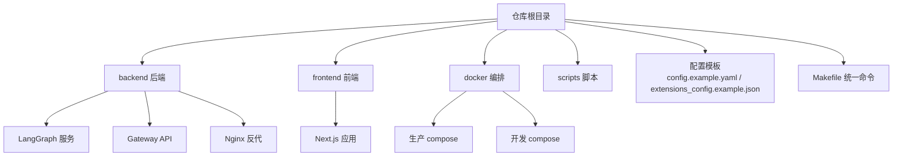
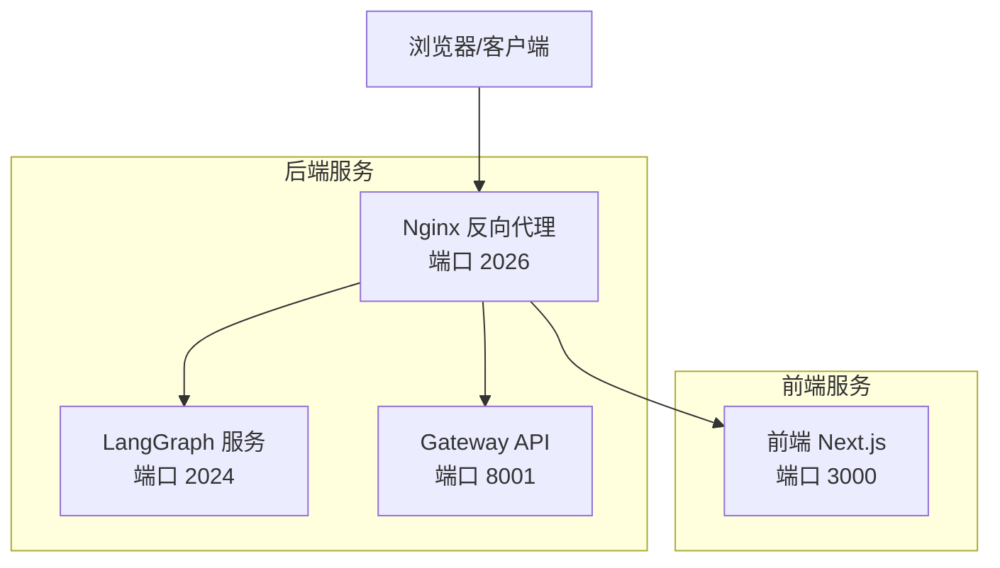
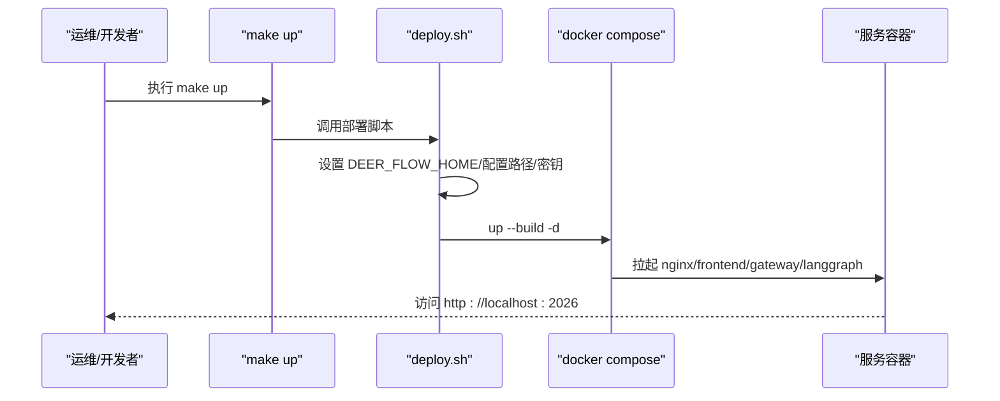
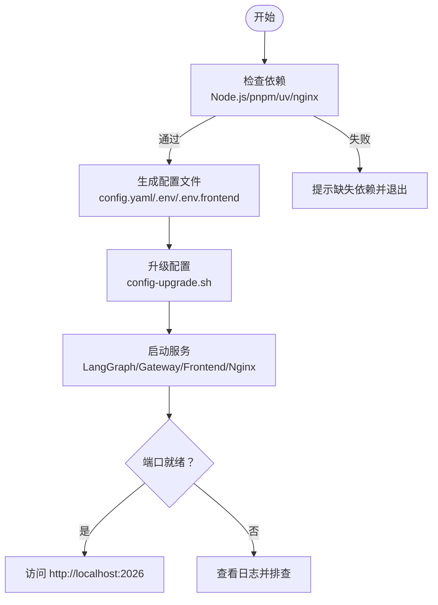
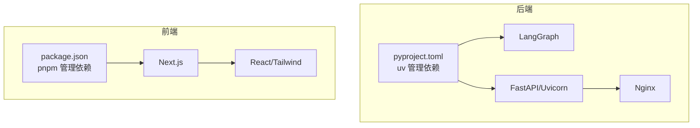

# 快速开始

<cite>
**本文引用的文件**
- [README.md](file://README.md)
- [backend/README.md](file://backend/README.md)
- [frontend/README.md](file://frontend/README.md)
- [config.example.yaml](file://config.example.yaml)
- [extensions_config.example.json](file://extensions_config.example.json)
- [Makefile](file://Makefile)
- [backend/Makefile](file://backend/Makefile)
- [frontend/Makefile](file://frontend/Makefile)
- [scripts/configure.py](file://scripts/configure.py)
- [scripts/config-upgrade.sh](file://scripts/config-upgrade.sh)
- [scripts/check.py](file://scripts/check.py)
- [scripts/serve.sh](file://scripts/serve.sh)
- [scripts/start-daemon.sh](file://scripts/start-daemon.sh)
- [scripts/deploy.sh](file://scripts/deploy.sh)
- [scripts/docker.sh](file://scripts/docker.sh)
- [docker/docker-compose.yaml](file://docker/docker-compose.yaml)
- [docker/docker-compose-dev.yaml](file://docker/docker-compose-dev.yaml)
- [backend/pyproject.toml](file://backend/pyproject.toml)
- [frontend/package.json](file://frontend/package.json)
</cite>

## 目录
1. [简介](#简介)
2. [项目结构](#项目结构)
3. [核心组件](#核心组件)
4. [架构总览](#架构总览)
5. [详细组件分析](#详细组件分析)
6. [依赖关系分析](#依赖关系分析)
7. [性能注意事项](#性能注意事项)
8. [故障排查指南](#故障排查指南)
9. [结论](#结论)
10. [附录](#附录)

## 简介
DeerFlow 是一个基于 LangGraph 的智能体超级引擎，内置子智能体编排、长期记忆与可扩展工具生态，支持沙箱执行、文件系统与多平台即时通讯通道。本“快速开始”面向首次使用者，提供从零到一的完整安装、配置与启动流程，并覆盖两种部署方式（Docker 生产模式与本地开发模式），以及一键安装脚本与常见问题排查。

## 项目结构
仓库采用前后端分离与多模块工作区组织：
- backend：后端服务（LangGraph + FastAPI + Nginx 反向代理）
- frontend：Next.js 前端应用
- docker：生产与开发用 docker-compose 配置
- scripts：一键安装、检查、启动、部署与日志查看脚本
- config.example.yaml / extensions_config.example.json：默认配置模板
- Makefile：统一命令入口

章节来源
- [README.md: 77-381:77-381](file://README.md#L77-L381)
- [Makefile: 1-180:1-180](file://Makefile#L1-L180)

## 核心组件
- 配置系统：config.yaml（主配置）、extensions_config.json（MCP/技能状态）、.env（环境变量）
- 后端：LangGraph 服务器（2024）+ Gateway API（8001）+ Nginx（2026）
- 前端：Next.js（3000），通过 Nginx 统一反代
- 沙箱：本地执行或容器沙箱（Docker/Apple Container/Kubernetes）
- 工具与技能：Web 搜索/抓取、文件操作、图像搜索、MCP 服务器、内置工具与领域技能

章节来源
- [backend/README.md: 7-137:7-137](file://backend/README.md#L7-L137)
- [config.example.yaml: 1-624:1-624](file://config.example.yaml#L1-L624)
- [extensions_config.example.json: 1-42:1-42](file://extensions_config.example.json#L1-L42)

## 架构总览
下图展示请求在 Nginx 反代后的路由与服务交互：

图表来源
- [backend/README.md: 7-41:7-41](file://backend/README.md#L7-L41)
- [docker/docker-compose.yaml: 24-148:24-148](file://docker/docker-compose.yaml#L24-L148)

章节来源
- [backend/README.md: 7-41:7-41](file://backend/README.md#L7-L41)

## 详细组件分析

### 部署方式一：Docker 生产模式（推荐）
适合生产环境或需要稳定运行的场景，镜像构建与卷挂载由 docker-compose 完成，自动检测沙箱模式并按需启用 provisioner。

- 启动命令
  - make up：构建并启动生产服务（默认端口 2026）
  - make down：停止并移除容器
- 关键点
  - 自动从 config.example.yaml 种子化 config.yaml（如不存在）
  - extensions_config.json 不存在时创建空配置
  - 生成/加载 BETTER_AUTH_SECRET 以支撑前端认证
  - 检测沙箱模式（local/aio/provisioner），必要时校验 Docker 套接字可用性

图表来源
- [Makefile: 174-179:174-179](file://Makefile#L174-L179)
- [scripts/deploy.sh: 1-213:1-213](file://scripts/deploy.sh#L1-L213)
- [docker/docker-compose.yaml: 24-148:24-148](file://docker/docker-compose.yaml#L24-L148)

章节来源
- [Makefile: 174-179:174-179](file://Makefile#L174-L179)
- [scripts/deploy.sh: 1-213:1-213](file://scripts/deploy.sh#L1-L213)
- [docker/docker-compose.yaml: 1-183:1-183](file://docker/docker-compose.yaml#L1-L183)

### 部署方式二：本地开发模式
适合本地调试与热重载，支持 dev/prod 两种模式切换。

- 开发模式（热重载）
  - make dev：启动 LangGraph（2024）+ Gateway（8001）+ 前端（3000）+ Nginx（2026）
  - make start：生产模式（无热重载）
- 关键点
  - 自动检查 Node.js 22+/pnpm/uv/nginx
  - 自动升级 config.yaml（兼容字段迁移）
  - 支持守护进程启动（make dev-daemon）

图表来源
- [scripts/check.py: 1-133:1-133](file://scripts/check.py#L1-L133)
- [scripts/configure.py: 1-59:1-59](file://scripts/configure.py#L1-L59)
- [scripts/config-upgrade.sh: 1-147:1-147](file://scripts/config-upgrade.sh#L1-L147)
- [scripts/serve.sh: 1-204:1-204](file://scripts/serve.sh#L1-L204)

章节来源
- [Makefile: 13-37:13-37](file://Makefile#L13-L37)
- [scripts/check.py: 1-133:1-133](file://scripts/check.py#L1-L133)
- [scripts/configure.py: 1-59:1-59](file://scripts/configure.py#L1-L59)
- [scripts/config-upgrade.sh: 1-147:1-147](file://scripts/config-upgrade.sh#L1-L147)
- [scripts/serve.sh: 1-204:1-204](file://scripts/serve.sh#L1-L204)

### 一键安装脚本与命令
- make config：生成本地配置文件（config.yaml/.env/.env.frontend）
- make check：检查 Node.js 22+/pnpm/uv/nginx
- make install：安装后端（uv）+ 前端（pnpm）依赖
- make setup-sandbox：预拉取沙箱镜像（可选）
- make dev / make start：开发/生产模式启动
- make dev-daemon：后台守护启动
- make docker-init / docker-start / docker-stop / docker-logs：Docker 开发模式管理

章节来源
- [Makefile: 13-180:13-180](file://Makefile#L13-L180)
- [backend/Makefile: 1-18:1-18](file://backend/Makefile#L1-L18)
- [frontend/Makefile: 1-15:1-15](file://frontend/Makefile#L1-L15)

### 配置文件生成与升级
- 生成：运行 make config 或直接调用 configure.py，复制示例模板到本地
- 升级：运行 make config-upgrade 或 scripts/config-upgrade.sh，自动迁移字段并合并新增项
- 主配置：config.yaml（模型、工具、沙箱、内存、标题生成、摘要、IM 渠道等）
- 扩展配置：extensions_config.json（MCP 服务器、技能状态）

章节来源
- [scripts/configure.py: 1-59:1-59](file://scripts/configure.py#L1-L59)
- [scripts/config-upgrade.sh: 1-147:1-147](file://scripts/config-upgrade.sh#L1-L147)
- [config.example.yaml: 1-624:1-624](file://config.example.yaml#L1-L624)
- [extensions_config.example.json: 1-42:1-42](file://extensions_config.example.json#L1-L42)

### 环境变量与 API 密钥
- 后端（Gateway/LangGraph）常用变量
  - DEER_FLOW_CONFIG_PATH：指定 config.yaml 路径
  - DEER_FLOW_EXTENSIONS_CONFIG_PATH：指定 extensions_config.json 路径
  - DEER_FLOW_HOME：运行数据目录（默认 backend/.deer-flow）
  - BETTER_AUTH_SECRET：前端认证密钥（生产自动生成）
  - DEER_FLOW_DOCKER_SOCKET：DooD 使用的 Docker 套接字路径
- 前端（Next.js）常用变量
  - NEXT_PUBLIC_BACKEND_BASE_URL：后端 API 基础地址（默认经 Nginx 代理）
  - NEXT_PUBLIC_LANGGRAPH_BASE_URL：LangGraph API 基础地址（默认经 Nginx 代理）
- 模型与工具密钥
  - OPENAI_API_KEY、ANTHROPIC_API_KEY、DEEPSEEK_API_KEY、TAVILY_API_KEY、GITHUB_TOKEN 等
  - 可在 .env 中集中管理，或直接写入 config.yaml（不推荐）

章节来源
- [backend/README.md: 308-314:308-314](file://backend/README.md#L308-L314)
- [frontend/README.md: 65-74:65-74](file://frontend/README.md#L65-L74)
- [README.md: 161-193:161-193](file://README.md#L161-L193)

### IM 渠道（可选）
- 支持 Telegram、Slack、飞书（Lark）等消息平台
- 在 config.yaml 中开启对应频道并设置令牌/密钥
- 无需公网 IP，均采用出站连接

章节来源
- [README.md: 273-381:273-381](file://README.md#L273-L381)

## 依赖关系分析
- 后端技术栈：LangGraph、LangChain、FastAPI、Uvicorn、Nginx
- 前端技术栈：Next.js 16、React 19、Tailwind CSS 4、Shadcn UI、Vercel AI Elements
- 包管理器：uv（后端）、pnpm（前端）
- 依赖检查：scripts/check.py 统一校验 Node.js/pnpm/uv/nginx

图表来源
- [backend/pyproject.toml: 1-29:1-29](file://backend/pyproject.toml#L1-L29)
- [frontend/package.json: 1-111:1-111](file://frontend/package.json#L1-L111)

章节来源
- [backend/pyproject.toml: 1-29:1-29](file://backend/pyproject.toml#L1-L29)
- [frontend/package.json: 1-111:1-111](file://frontend/package.json#L1-L111)
- [scripts/check.py: 1-133:1-133](file://scripts/check.py#L1-L133)

## 性能注意事项
- 沙箱模式选择
  - 本地执行：低延迟，适合轻量任务
  - 容器沙箱：隔离性好，首次启动有镜像拉取/初始化开销
  - Kubernetes 模式：高隔离与弹性，适合生产
- 上下文压缩与摘要
  - 合理配置摘要阈值与保留策略，避免长对话导致上下文溢出
- 并行子智能体
  - 控制并发数量与超时，避免资源争用
- 日志与追踪
  - 生产默认关闭 LangSmith 追踪；如需可在 .env 中开启

章节来源
- [config.example.yaml: 446-487:446-487](file://config.example.yaml#L446-L487)
- [docker/docker-compose.yaml: 19-21:19-21](file://docker/docker-compose.yaml#L19-L21)

## 故障排查指南
- 依赖缺失
  - 使用 make check 核对 Node.js 22+/pnpm/uv/nginx 是否安装
- 配置问题
  - 使用 make config-upgrade 升级 config.yaml，或手动比对 config.example.yaml 新增字段
  - 若出现配置版本/字段错误，根据日志提示执行升级
- 端口占用
  - LangGraph（2024）、Gateway（8001）、前端（3000）、Nginx（2026）被占用时需释放
- Docker 权限/套接字
  - AIO 沙箱需要 Docker 套接字；Linux 下需加入 docker 组
- 前端认证密钥
  - 生产模式下未设置 BETTER_AUTH_SECRET 将导致登录异常，脚本会自动生成并持久化

章节来源
- [scripts/check.py: 1-133:1-133](file://scripts/check.py#L1-L133)
- [scripts/config-upgrade.sh: 1-147:1-147](file://scripts/config-upgrade.sh#L1-L147)
- [scripts/serve.sh: 136-144:136-144](file://scripts/serve.sh#L136-L144)
- [scripts/deploy.sh: 180-188:180-188](file://scripts/deploy.sh#L180-L188)
- [README.md: 209-211:209-211](file://README.md#L209-L211)

## 结论
通过本“快速开始”，你可以在几分钟内完成 DeerFlow 的安装、配置与启动，并根据需求选择 Docker 生产模式或本地开发模式。建议优先使用 Docker 生产模式以获得更稳定的运行体验；在开发阶段使用本地模式以便热重载与调试。遇到问题时，优先参考“故障排查指南”与日志输出定位原因。

## 附录

### 常用命令速查
- 生成配置：make config
- 检查依赖：make check
- 安装依赖：make install
- 预拉取沙箱镜像：make setup-sandbox
- 开发启动：make dev
- 生产启动：make start
- 守护启动：make dev-daemon
- Docker 初始化：make docker-init
- Docker 启动：make docker-start
- Docker 查看日志：make docker-logs

章节来源
- [Makefile: 13-37:13-37](file://Makefile#L13-L37)

### 配置文件位置与优先级
- config.yaml：主配置（默认在项目根目录，可通过 DEER_FLOW_CONFIG_PATH 指定）
- extensions_config.json：扩展配置（默认在项目根目录，可通过 DEER_FLOW_EXTENSIONS_CONFIG_PATH 指定）
- .env：环境变量（后端与 Docker 环境共享）

章节来源
- [backend/README.md: 254-274:254-274](file://backend/README.md#L254-L274)