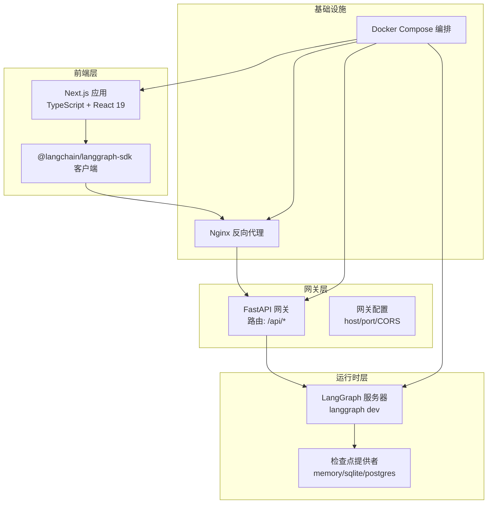
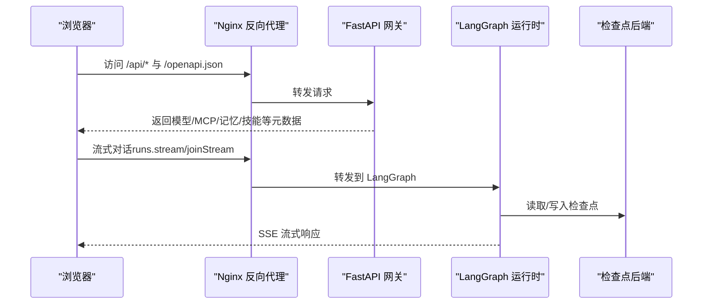
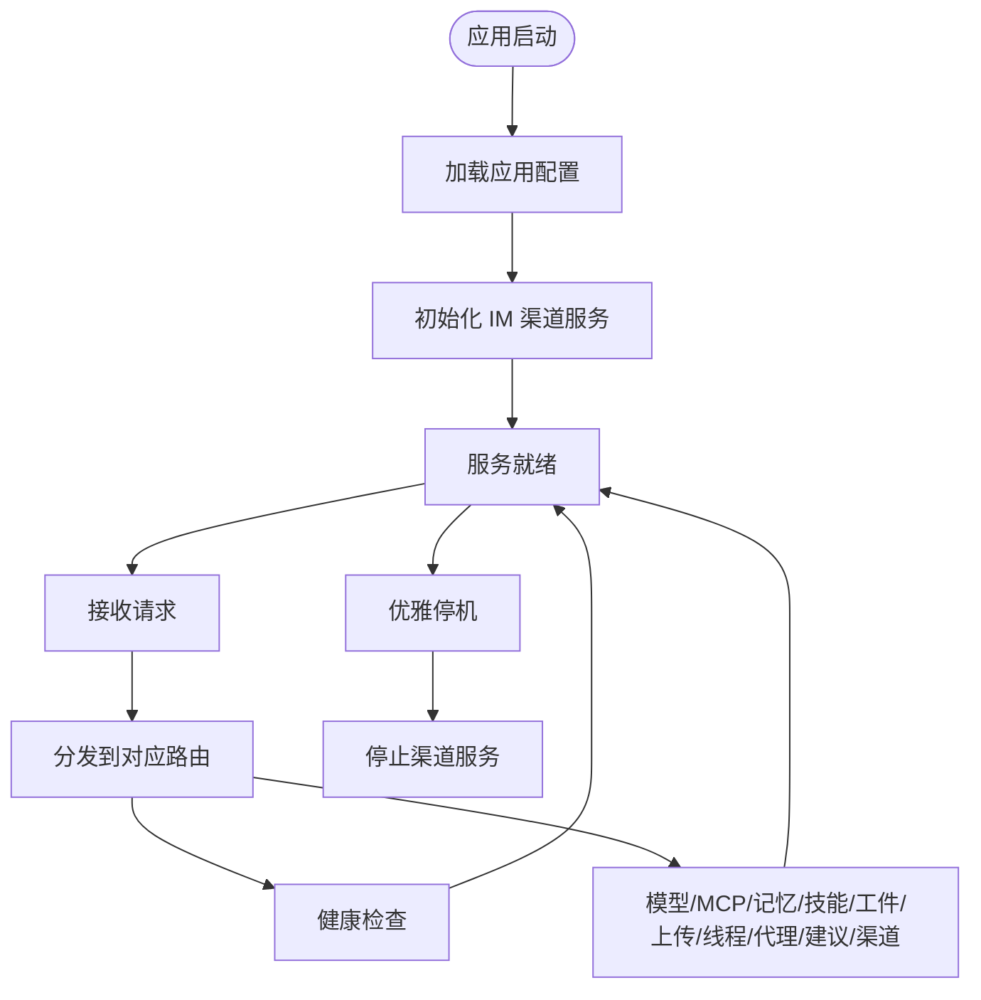
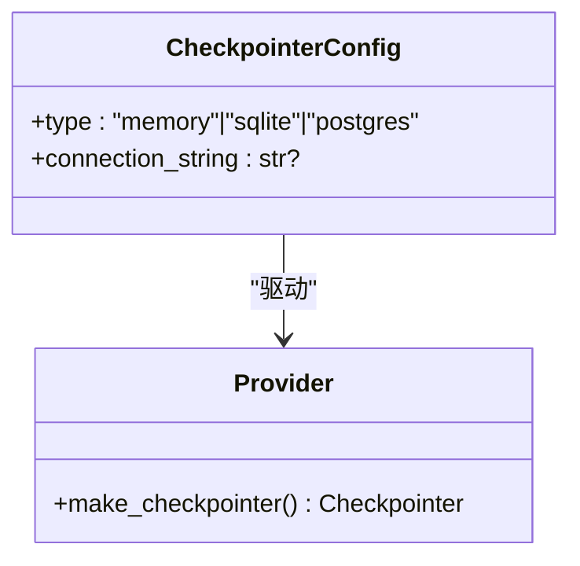
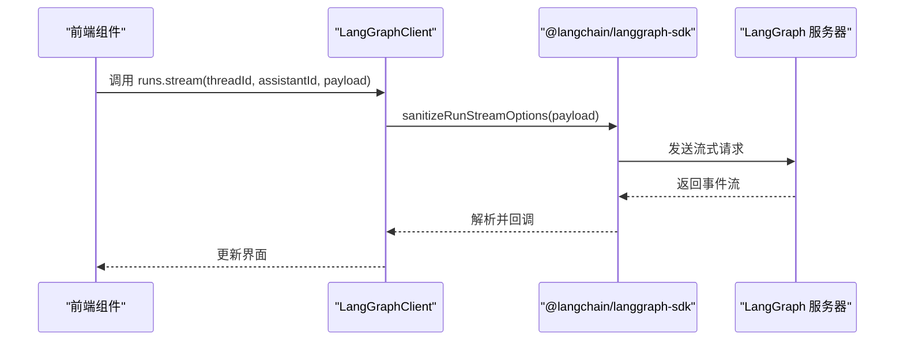
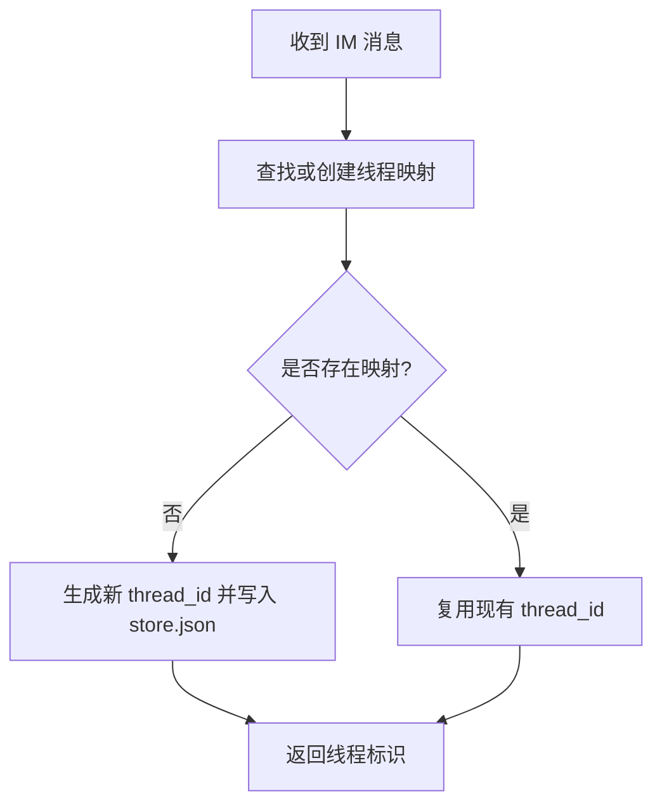
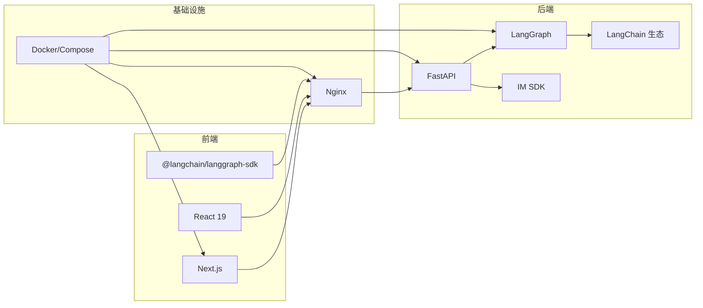

# 技术栈

<cite>
**本文引用的文件**
- [backend/pyproject.toml](file://backend/pyproject.toml)
- [backend/packages/harness/pyproject.toml](file://backend/packages/harness/pyproject.toml)
- [backend/Dockerfile](file://backend/Dockerfile)
- [backend/app/gateway/app.py](file://backend/app/gateway/app.py)
- [backend/app/gateway/config.py](file://backend/app/gateway/config.py)
- [backend/langgraph.json](file://backend/langgraph.json)
- [docker/docker-compose.yaml](file://docker/docker-compose.yaml)
- [frontend/package.json](file://frontend/package.json)
- [frontend/Dockerfile](file://frontend/Dockerfile)
- [frontend/tsconfig.json](file://frontend/tsconfig.json)
- [frontend/next.config.js](file://frontend/next.config.js)
- [frontend/src/core/api/api-client.ts](file://frontend/src/core/api/api-client.ts)
- [frontend/src/core/memory/api.ts](file://frontend/src/core/memory/api.ts)
- [frontend/src/components/workspace/workspace-container.tsx](file://frontend/src/components/workspace/workspace-container.tsx)
- [backend/app/channels/store.py](file://backend/app/channels/store.py)
- [backend/packages/harness/deerflow/config/checkpointer_config.py](file://backend/packages/harness/deerflow/config/checkpointer_config.py)
- [backend/packages/harness/deerflow/agents/checkpointer/provider.py](file://backend/packages/harness/deerflow/agents/checkpointer/provider.py)
</cite>

## 目录
1. [简介](#简介)
2. [项目结构](#项目结构)
3. [核心组件](#核心组件)
4. [架构总览](#架构总览)
5. [详细组件分析](#详细组件分析)
6. [依赖分析](#依赖分析)
7. [性能考量](#性能考量)
8. [故障排查指南](#故障排查指南)
9. [结论](#结论)
10. [附录](#附录)

## 简介
本文件系统性梳理 DeerFlow 的技术栈与架构选型，覆盖后端（Python、FastAPI、LangGraph、LangChain 生态）、前端（Next.js、React、TypeScript）、数据库与持久化、容器化与部署等。文档旨在帮助开发者快速理解整体技术布局、关键组件职责与扩展点，并提供架构图与流程图以辅助设计与排障。

## 项目结构
- 后端采用 Python 3.12，使用 FastAPI 提供网关 API，LangGraph 作为智能体运行时，LangChain 及其生态组件提供模型、工具与检查点能力；通过 Docker Compose 编排 Nginx、前端、网关、LangGraph 服务以及可选的 Kubernetes 沙箱编排器。
- 前端基于 Next.js 16、React 19、TypeScript 5，使用 Radix UI、TailwindCSS、CodeMirror、@langchain/langgraph-sdk 等构建交互式工作区与可视化界面。
- 数据与状态：内存中检查点用于开发/演示，生产可切换至 SQLite 或 PostgreSQL；IM 渠道映射存储于 JSON 文件，支持高并发场景替换为数据库。

图表来源
- [docker/docker-compose.yaml:1-183](file://docker/docker-compose.yaml#L1-L183)
- [backend/app/gateway/app.py:73-196](file://backend/app/gateway/app.py#L73-L196)
- [frontend/src/core/api/api-client.ts:9-31](file://frontend/src/core/api/api-client.ts#L9-L31)

章节来源
- [docker/docker-compose.yaml:1-183](file://docker/docker-compose.yaml#L1-L183)
- [backend/app/gateway/app.py:73-196](file://backend/app/gateway/app.py#L73-L196)

## 核心组件
- 后端框架与运行时
  - Python 3.12：统一运行环境，确保 LangGraph/LangChain 生态兼容性。
  - FastAPI：提供 REST API 网关，挂载多组路由（模型、MCP、记忆、技能、工件、上传、线程、代理、建议、渠道）。
  - LangGraph：作为智能体运行时，通过 langgraph dev 启动，支持流式执行与检查点。
  - LangChain 生态：提供模型适配器、工具库、检查点后端、解析器等。
- 前端框架与 UI
  - Next.js 16、React 19、TypeScript 5：类型安全与现代构建链。
  - UI 组件库：Radix UI、TailwindCSS、Sonner、GSAP 等。
  - LangGraph SDK：与运行时进行流式对话与状态管理。
- 容器化与部署
  - 后端镜像：基于 python:3.12-slim，内置 Node.js（用于 MCP），安装 Docker CLI（DooD 支持沙箱容器启动）。
  - 前端镜像：基于 node:22-alpine，支持 dev/prod 两阶段构建。
  - Compose 编排：Nginx、前端、网关、LangGraph、可选 Kubernetes 沙箱编排器。

章节来源
- [backend/pyproject.toml:6-29](file://backend/pyproject.toml#L6-L29)
- [backend/packages/harness/pyproject.toml:5-34](file://backend/packages/harness/pyproject.toml#L5-L34)
- [backend/Dockerfile:1-40](file://backend/Dockerfile#L1-L40)
- [frontend/package.json:17-88](file://frontend/package.json#L17-L88)
- [frontend/Dockerfile:1-36](file://frontend/Dockerfile#L1-L36)
- [docker/docker-compose.yaml:24-183](file://docker/docker-compose.yaml#L24-L183)

## 架构总览
下图展示从浏览器到后端服务的完整链路：前端通过 Nginx 反向代理访问网关，网关负责部分业务 API，LangGraph 负责智能体执行与流式输出；检查点用于状态持久化。

图表来源
- [docker/docker-compose.yaml:26-148](file://docker/docker-compose.yaml#L26-L148)
- [backend/app/gateway/app.py:156-196](file://backend/app/gateway/app.py#L156-L196)
- [frontend/src/core/api/api-client.ts:9-31](file://frontend/src/core/api/api-client.ts#L9-L31)
- [backend/packages/harness/deerflow/agents/checkpointer/provider.py:63-95](file://backend/packages/harness/deerflow/agents/checkpointer/provider.py#L63-L95)

章节来源
- [docker/docker-compose.yaml:24-148](file://docker/docker-compose.yaml#L24-L148)
- [backend/app/gateway/app.py:73-196](file://backend/app/gateway/app.py#L73-L196)

## 详细组件分析

### 后端网关（FastAPI）
- 职责
  - 配置加载与生命周期管理（启动校验配置、通道服务初始化、优雅停机）。
  - 路由组织：模型、MCP、记忆、技能、工件、上传、线程、代理、建议、渠道、健康检查。
  - 文档：OpenAPI/Swagger/ReDoc。
- 关键实现要点
  - 生命周期钩子在启动时加载应用配置并尝试启动 IM 渠道服务；关闭时停止服务。
  - 路由挂载遵循清晰的命名空间（/api/*），便于前端调用。
  - CORS 在 Nginx 层处理，避免重复中间件开销。

图表来源
- [backend/app/gateway/app.py:32-71](file://backend/app/gateway/app.py#L32-L71)
- [backend/app/gateway/app.py:156-196](file://backend/app/gateway/app.py#L156-L196)

章节来源
- [backend/app/gateway/app.py:32-71](file://backend/app/gateway/app.py#L32-L71)
- [backend/app/gateway/app.py:156-196](file://backend/app/gateway/app.py#L156-L196)
- [backend/app/gateway/config.py:17-27](file://backend/app/gateway/config.py#L17-L27)

### LangGraph 运行时与检查点
- 运行时
  - 通过 langgraph dev 启动，监听 2024 端口，支持禁用浏览器自动打开与热重载。
  - 通过 langgraph.json 指定主图入口与检查点提供者路径。
- 检查点提供者
  - 支持 memory（进程内，重启丢失）、sqlite（需依赖）、postgres（需依赖与连接串）。
  - 提供工厂/上下文管理器封装，按配置动态选择后端。

图表来源
- [backend/packages/harness/deerflow/config/checkpointer_config.py:10-25](file://backend/packages/harness/deerflow/config/checkpointer_config.py#L10-L25)
- [backend/packages/harness/deerflow/agents/checkpointer/provider.py:63-95](file://backend/packages/harness/deerflow/agents/checkpointer/provider.py#L63-L95)
- [backend/langgraph.json:8-14](file://backend/langgraph.json#L8-L14)

章节来源
- [backend/langgraph.json:1-15](file://backend/langgraph.json#L1-L15)
- [backend/packages/harness/deerflow/config/checkpointer_config.py:10-25](file://backend/packages/harness/deerflow/config/checkpointer_config.py#L10-L25)
- [backend/packages/harness/deerflow/agents/checkpointer/provider.py:63-95](file://backend/packages/harness/deerflow/agents/checkpointer/provider.py#L63-L95)

### 前端客户端与工作区
- 客户端
  - 使用 @langchain/langgraph-sdk 创建 LangGraphClient，对 runs.stream/joinStream 做参数兼容处理。
  - 通过配置函数获取运行时基础地址，支持 Mock 场景。
- 工作区
  - Next.js 页面与组件（如 WorkspaceContainer）组织导航、面包屑、侧边栏与内容区域。
  - 国际化与主题切换等横切能力集成。

图表来源
- [frontend/src/core/api/api-client.ts:9-31](file://frontend/src/core/api/api-client.ts#L9-L31)
- [frontend/package.json:25-26](file://frontend/package.json#L25-L26)

章节来源
- [frontend/src/core/api/api-client.ts:9-31](file://frontend/src/core/api/api-client.ts#L9-L31)
- [frontend/src/components/workspace/workspace-container.tsx:21-136](file://frontend/src/components/workspace/workspace-container.tsx#L21-L136)

### IM 渠道与会话映射
- ChannelStore
  - 将 IM 平台聊天与 DeerFlow 线程 ID 建立映射，采用单文件 JSON 存储，变更时原子重写。
  - 适合开发/小规模场景；高并发生产建议迁移到关系型数据库。

图表来源
- [backend/app/channels/store.py:16-80](file://backend/app/channels/store.py#L16-L80)

章节来源
- [backend/app/channels/store.py:16-80](file://backend/app/channels/store.py#L16-L80)

## 依赖分析
- 后端依赖
  - 核心：FastAPI、Uvicorn、LangGraph、LangChain 及其适配器、SSE-Starlette、IM SDK（飞书、Slack、Telegram）。
  - 开发：pytest、Ruff。
- 前端依赖
  - 核心：Next.js、React、Radix UI、TailwindCSS、@langchain/langgraph-sdk、better-auth、CodeMirror、GSAP 等。
  - 类型与构建：TypeScript、ESLint、Prettier、PostCSS、TailwindCSS v4。
- 容器与编排
  - 后端镜像包含 Node.js（MCP 服务器）、Docker CLI（DooD）。
  - Compose 编排 Nginx、前端、网关、LangGraph、可选 Kubernetes 沙箱编排器。

图表来源
- [backend/pyproject.toml:7-19](file://backend/pyproject.toml#L7-L19)
- [backend/packages/harness/pyproject.toml:6-34](file://backend/packages/harness/pyproject.toml#L6-L34)
- [frontend/package.json:17-87](file://frontend/package.json#L17-L87)
- [docker/docker-compose.yaml:24-183](file://docker/docker-compose.yaml#L24-L183)

章节来源
- [backend/pyproject.toml:7-19](file://backend/pyproject.toml#L7-L19)
- [backend/packages/harness/pyproject.toml:6-34](file://backend/packages/harness/pyproject.toml#L6-L34)
- [frontend/package.json:17-87](file://frontend/package.json#L17-L87)
- [docker/docker-compose.yaml:24-183](file://docker/docker-compose.yaml#L24-L183)

## 性能考量
- 启动与热身
  - 网关在启动阶段加载配置并初始化通道服务，避免首次请求抖动。
  - LangGraph 通过 langgraph dev 启动，建议在生产中结合反向代理与健康检查。
- 流式传输
  - 前端使用 SSE 流式接口，减少等待时间；后端通过 SSE-Starlette 提供支持。
- 持久化与并发
  - 检查点默认使用内存后端，开发友好但不持久；生产建议使用 SQLite/PostgreSQL。
  - ChannelStore 采用单文件 JSON 原子写入，适合低并发；高并发场景应迁移至数据库。
- 容器与资源
  - 后端镜像内置 Docker CLI，支持 DooD；注意安全与权限控制。
  - 前端镜像采用两阶段构建，prod 镜像最小化运行时体积。

章节来源
- [backend/app/gateway/app.py:32-71](file://backend/app/gateway/app.py#L32-L71)
- [backend/packages/harness/deerflow/agents/checkpointer/provider.py:63-95](file://backend/packages/harness/deerflow/agents/checkpointer/provider.py#L63-L95)
- [backend/app/channels/store.py:48-70](file://backend/app/channels/store.py#L48-L70)
- [backend/Dockerfile:19-23](file://backend/Dockerfile#L19-L23)
- [frontend/Dockerfile:21-35](file://frontend/Dockerfile#L21-L35)

## 故障排查指南
- 网关启动失败
  - 现象：启动日志报错“加载配置失败”。
  - 排查：确认环境变量（如配置文件路径、扩展配置路径）是否正确挂载；检查网关配置加载逻辑。
- LangGraph 无法连接
  - 现象：前端流式请求无响应或 5xx。
  - 排查：确认 Nginx 是否转发到正确的运行时端口；检查运行时健康状态与日志。
- 检查点异常
  - 现象：SQLite/Postgres 导入错误或连接串无效。
  - 排查：核对依赖是否安装；确认连接串格式与可达性；检查权限。
- IM 渠道映射问题
  - 现象：消息未关联到正确线程或 JSON 写入失败。
  - 排查：检查 store.json 权限与磁盘空间；必要时迁移至数据库。

章节来源
- [backend/app/gateway/app.py:36-43](file://backend/app/gateway/app.py#L36-L43)
- [backend/packages/harness/deerflow/agents/checkpointer/provider.py:75-95](file://backend/packages/harness/deerflow/agents/checkpointer/provider.py#L75-L95)
- [backend/app/channels/store.py:48-70](file://backend/app/channels/store.py#L48-L70)

## 结论
DeerFlow 采用“前端 Next.js + 网关 FastAPI + LangGraph 运行时”的清晰分层架构，结合 LangChain 生态与多种检查点后端，既满足开发期的快速迭代，也为生产级的可扩展性与可观测性奠定基础。通过 Docker Compose 实现端到端编排，配合 Nginx 反向代理与必要的安全配置，可稳定支撑多平台 IM 集成与智能体工作流。

## 附录
- 版本与兼容性摘要
  - Python：3.12（后端）
  - Node.js：22（后端镜像内置，前端镜像使用 22-alpine）
  - FastAPI：≥0.115.0
  - Uvicorn：标准版 ≥0.34.0
  - LangGraph：≥1.0.6 且 <1.0.10
  - LangChain：≥1.2.3
  - Next.js：^16.1.7
  - React：^19.0.0
  - TypeScript：^5.8.2
  - Docker CLI：镜像内置，支持 DooD
- 关键环境变量（示例）
  - DEER_FLOW_HOME、DEER_FLOW_CONFIG_PATH、DEER_FLOW_EXTENSIONS_CONFIG_PATH、DEER_FLOW_DOCKER_SOCKET、BETTER_AUTH_SECRET、PORT、LANGCHAIN_TRACING_V2、LANGSMITH_API_KEY 等（详见 Compose 注释）

章节来源
- [backend/pyproject.toml:6-19](file://backend/pyproject.toml#L6-L19)
- [backend/packages/harness/pyproject.toml:5-34](file://backend/packages/harness/pyproject.toml#L5-L34)
- [frontend/package.json:17-87](file://frontend/package.json#L17-L87)
- [frontend/tsconfig.json:6-22](file://frontend/tsconfig.json#L6-L22)
- [docker/docker-compose.yaml:11-22](file://docker/docker-compose.yaml#L11-L22)
- [backend/Dockerfile:4-16](file://backend/Dockerfile#L4-L16)
- [frontend/Dockerfile:9-11](file://frontend/Dockerfile#L9-L11)