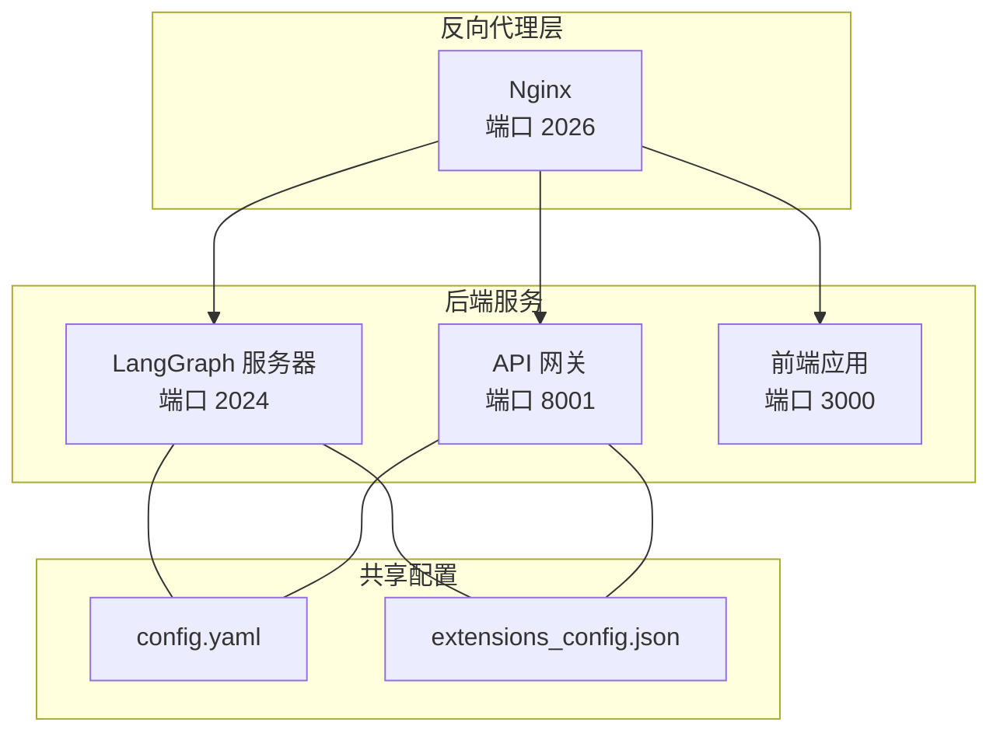
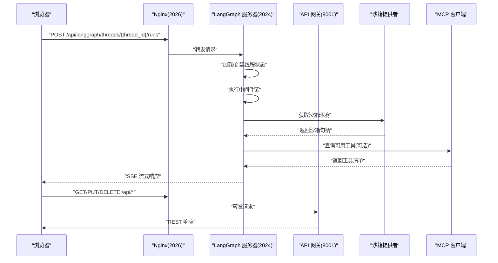
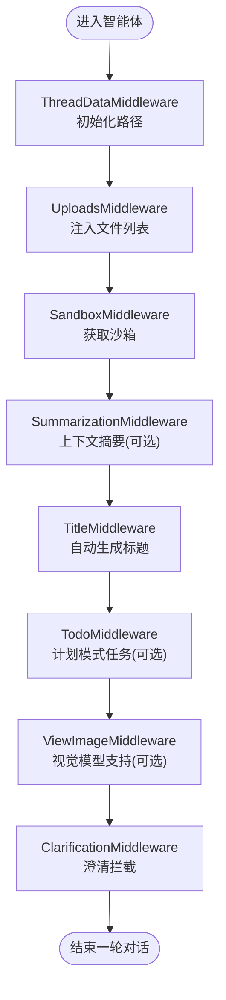
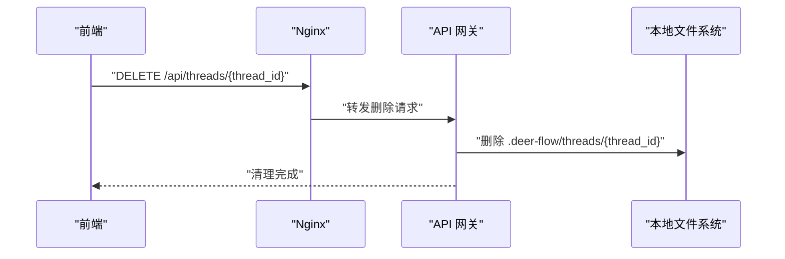
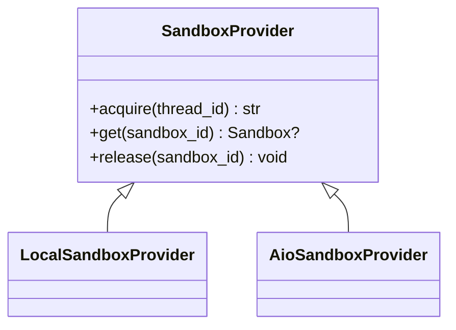
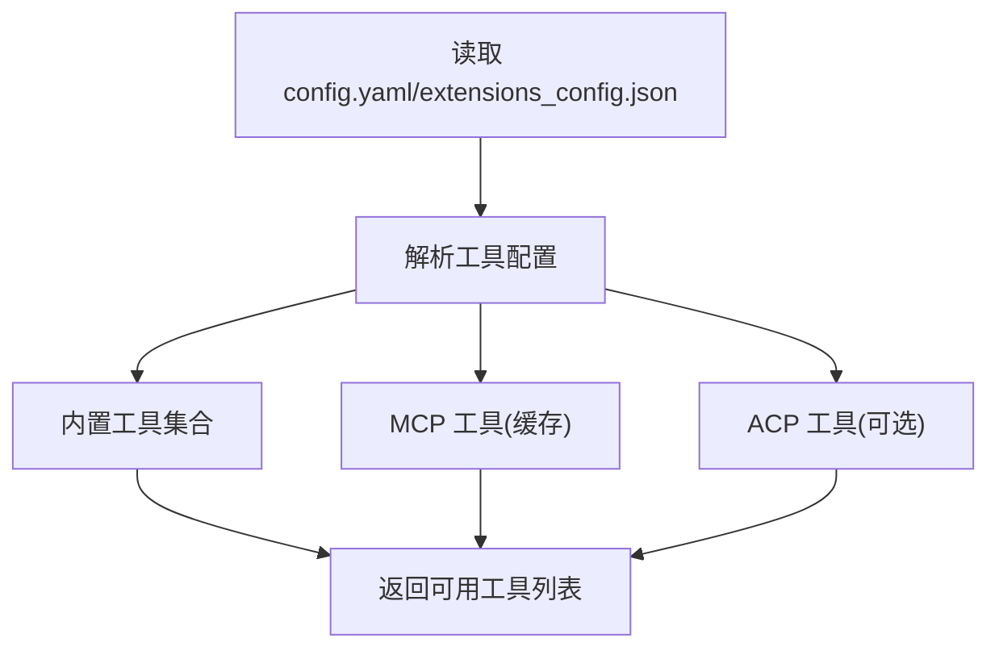
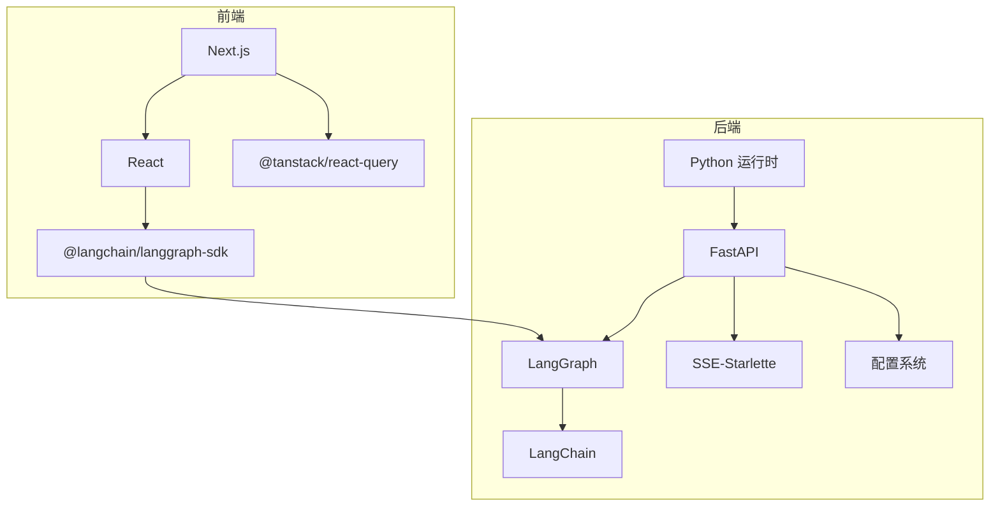

# 架构概览

<cite>
**本文档引用的文件**
- [架构总览](file://backend/docs/ARCHITECTURE.md)
- [LangGraph 配置](file://backend/langgraph.json)
- [后端项目配置](file://backend/pyproject.toml)
- [前端包配置](file://frontend/package.json)
- [生产环境编排](file://docker/docker-compose.yaml)
- [网关应用入口](file://backend/app/gateway/app.py)
- [客户端封装](file://backend/packages/harness/deerflow/client.py)
- [LangGraph 客户端](file://frontend/src/core/api/api-client.ts)
- [沙箱提供者接口](file://backend/packages/harness/deerflow/sandbox/sandbox_provider.py)
- [线程状态定义](file://backend/packages/harness/deerflow/agents/thread_state.py)
- [主代理构建器](file://backend/packages/harness/deerflow/agents/lead_agent/agent.py)
- [工具集合管理](file://backend/packages/harness/deerflow/tools/tools.py)
- [模型工厂](file://backend/packages/harness/deerflow/models/factory.py)
- [MCP 客户端参数构建](file://backend/packages/harness/deerflow/mcp/client.py)
- [前端基础配置](file://frontend/src/core/config/index.ts)
</cite>

## 目录
1. [简介](#简介)
2. [项目结构](#项目结构)
3. [核心组件](#核心组件)
4. [架构总览](#架构总览)
5. [详细组件分析](#详细组件分析)
6. [依赖关系分析](#依赖关系分析)
7. [性能考虑](#性能考虑)
8. [故障排查指南](#故障排查指南)
9. [结论](#结论)

## 简介
本文件为 DeerFlow 项目的架构概览文档，面向开发者与架构师，系统阐述基于 LangGraph 的多智能体后端、API 网关、前端交互、沙箱执行环境与 MCP 扩展集成的整体设计。重点覆盖：
- 前后端分离与反向代理统一入口
- 微服务式组件划分与职责边界
- 智能体运行时、中间件链、工具系统与沙箱隔离
- 请求处理流程、数据持久化与清理策略
- 安全与性能优化策略及扩展性设计

## 项目结构
DeerFlow 采用前后端分离与容器化部署的典型现代架构：
- 反向代理层：Nginx 统一入口，分流至 LangGraph 服务器（2024）、API 网关（8001）与前端（3000）
- 后端层：LangGraph 作为智能体运行时，Gateway 提供非代理类 REST 能力
- 前端层：Next.js 应用，通过 LangGraph SDK 与后端交互
- 配置与扩展：共享配置文件与扩展配置，支持 MCP 服务器与技能系统

图表来源
- [架构总览](file://backend/docs/ARCHITECTURE.md)
- [生产环境编排](file://docker/docker-compose.yaml)

章节来源
- [架构总览](file://backend/docs/ARCHITECTURE.md)
- [生产环境编排](file://docker/docker-compose.yaml)

## 核心组件
- LangGraph 服务器：多智能体工作流编排与运行时，负责线程状态管理、中间件链执行、工具调用与实时流式响应
- API 网关：提供模型、MCP、技能、工件、上传、线程清理等 REST 接口
- 沙箱执行环境：抽象提供者与具体实现，隔离工具执行环境，支持本地与容器两种模式
- 工具系统：内置工具、配置化工具、MCP 工具与 ACP 工具的统一聚合
- 模型工厂：按配置动态解析并实例化不同供应商的聊天模型
- 前端客户端：LangGraph SDK 客户端封装，适配流式协议与运行时选项

章节来源
- [架构总览](file://backend/docs/ARCHITECTURE.md)
- [主代理构建器](file://backend/packages/harness/deerflow/agents/lead_agent/agent.py)
- [工具集合管理](file://backend/packages/harness/deerflow/tools/tools.py)
- [模型工厂](file://backend/packages/harness/deerflow/models/factory.py)
- [沙箱提供者接口](file://backend/packages/harness/deerflow/sandbox/sandbox_provider.py)
- [LangGraph 客户端](file://frontend/src/core/api/api-client.ts)

## 架构总览
下图展示从浏览器到 LangGraph 服务器与 API 网关的完整请求路径，以及后端内部的组件交互。

图表来源
- [架构总览](file://backend/docs/ARCHITECTURE.md)
- [LangGraph 配置](file://backend/langgraph.json)
- [网关应用入口](file://backend/app/gateway/app.py)
- [LangGraph 客户端](file://frontend/src/core/api/api-client.ts)

章节来源
- [架构总览](file://backend/docs/ARCHITECTURE.md)
- [LangGraph 配置](file://backend/langgraph.json)
- [网关应用入口](file://backend/app/gateway/app.py)

## 详细组件分析

### LangGraph 服务器
- 入口与职责
  - 入口：通过 langgraph.json 指定的图函数创建运行时
  - 负责：智能体创建、线程状态管理、中间件链执行、工具调用、SSE 实时流
- 中间件链顺序与作用
  - 线程数据初始化、上传处理、沙箱获取、摘要中间件、标题生成、任务跟踪、图像处理、澄清请求拦截等
- 线程状态
  - 在 AgentState 基础上扩展沙箱、工件、工作区路径、标题、待办事项、已查看图片等字段

图表来源
- [架构总览](file://backend/docs/ARCHITECTURE.md)
- [主代理构建器](file://backend/packages/harness/deerflow/agents/lead_agent/agent.py)
- [线程状态定义](file://backend/packages/harness/deerflow/agents/thread_state.py)

章节来源
- [架构总览](file://backend/docs/ARCHITECTURE.md)
- [主代理构建器](file://backend/packages/harness/deerflow/agents/lead_agent/agent.py)
- [线程状态定义](file://backend/packages/harness/deerflow/agents/thread_state.py)

### API 网关
- 路由与职责
  - 模型管理、MCP 配置、内存管理、技能管理、工件访问、文件上传、线程清理、代理创建、建议生成、IM 渠道等
- 生命周期与启动
  - 加载应用配置、可选启动 IM 渠道服务、健康检查端点
- 与 LangGraph 的协作
  - 删除会话时先在 LangGraph 删除线程状态，再由网关清理本地 DeerFlow 文件系统数据

图表来源
- [架构总览](file://backend/docs/ARCHITECTURE.md)
- [网关应用入口](file://backend/app/gateway/app.py)

章节来源
- [架构总览](file://backend/docs/ARCHITECTURE.md)
- [网关应用入口](file://backend/app/gateway/app.py)

### 沙箱执行环境
- 抽象提供者
  - 通过配置解析具体实现，支持单例缓存与优雅关闭
- 实现类型
  - 本地沙箱：开发使用，直接执行
  - AIO 沙箱：生产使用，容器隔离，Docker-in-Docker 或 Kubernetes 模式
- 虚拟路径映射
  - 将虚拟路径映射到线程私有目录，限制文件访问范围

图表来源
- [沙箱提供者接口](file://backend/packages/harness/deerflow/sandbox/sandbox_provider.py)

章节来源
- [沙箱提供者接口](file://backend/packages/harness/deerflow/sandbox/sandbox_provider.py)
- [架构总览](file://backend/docs/ARCHITECTURE.md)

### 工具系统与 MCP 集成
- 工具来源
  - 内置工具、配置化工具、MCP 工具、ACP 工具
- MCP 客户端
  - 支持 stdio、SSE、HTTP 三种传输，按配置动态构建服务器参数
- 工具加载策略
  - 按模型能力（如视觉）动态启用相关工具；支持延迟注册与搜索工具

图表来源
- [工具集合管理](file://backend/packages/harness/deerflow/tools/tools.py)
- [MCP 客户端参数构建](file://backend/packages/harness/deerflow/mcp/client.py)
- [架构总览](file://backend/docs/ARCHITECTURE.md)

章节来源
- [工具集合管理](file://backend/packages/harness/deerflow/tools/tools.py)
- [MCP 客户端参数构建](file://backend/packages/harness/deerflow/mcp/client.py)
- [架构总览](file://backend/docs/ARCHITECTURE.md)

### 模型工厂
- 动态解析
  - 根据配置解析具体模型类，合并“思考”模式下的特殊设置
- 追踪集成
  - 可选附加 LangSmith Tracer
- 特殊适配
  - 对特定模型（如 Codex）进行推理努力度映射与参数裁剪

章节来源
- [模型工厂](file://backend/packages/harness/deerflow/models/factory.py)
- [架构总览](file://backend/docs/ARCHITECTURE.md)

### 前端交互与客户端
- 基础 URL 解析
  - 优先使用环境变量，否则回退到当前域或本地默认端口
- LangGraph 客户端
  - 包装 LangGraph SDK，统一流式运行参数，提供单例客户端

章节来源
- [前端基础配置](file://frontend/src/core/config/index.ts)
- [LangGraph 客户端](file://frontend/src/core/api/api-client.ts)

## 依赖关系分析
- 语言与框架
  - 后端：Python、FastAPI、LangGraph、LangChain、SSE-Starlette
  - 前端：Next.js、React、LangGraph SDK、TanStack Query
- 容器化与部署
  - Docker Compose 编排 Nginx、前端、网关、LangGraph 与可选沙箱供应器
- 关键依赖图

图表来源
- [后端项目配置](file://backend/pyproject.toml)
- [前端包配置](file://frontend/package.json)
- [生产环境编排](file://docker/docker-compose.yaml)

章节来源
- [后端项目配置](file://backend/pyproject.toml)
- [前端包配置](file://frontend/package.json)
- [生产环境编排](file://docker/docker-compose.yaml)

## 性能考虑
- 缓存策略
  - MCP 工具按文件时间戳缓存，配置变更触发重新初始化
  - 技能解析一次性加载并缓存
- 流式传输
  - 使用 SSE 实时推送，降低首 token 延迟，提升长任务可见性
- 上下文管理
  - 摘要中间件在接近令牌上限时压缩历史消息，保留近期信息
- 并发控制
  - 子代理并发数量限制，避免资源争用
- 沙箱隔离
  - 生产推荐容器化沙箱，减少进程间干扰

章节来源
- [架构总览](file://backend/docs/ARCHITECTURE.md)
- [主代理构建器](file://backend/packages/harness/deerflow/agents/lead_agent/agent.py)

## 故障排查指南
- 配置问题
  - 确认 config.yaml 与 extensions_config.json 路径正确，且挂载到容器内
  - 检查模型配置是否包含至少一个可用模型
- LangGraph 无法连接
  - 核对 Nginx 转发规则与 LangGraph 服务端口
  - 确保前端 LangGraph 基础 URL 正确（NEXT_PUBLIC_LANGGRAPH_BASE_URL）
- 沙箱执行失败
  - 本地模式仅用于开发；生产请确认 Docker Socket 权限与 AIO 沙箱配置
- MCP 工具不可用
  - 确认 MCP 服务器已启用且传输参数正确；检查文件时间戳缓存是否需要刷新
- 线程清理异常
  - 确保删除顺序：先 LangGraph 删除线程状态，再由网关清理本地文件

章节来源
- [架构总览](file://backend/docs/ARCHITECTURE.md)
- [前端基础配置](file://frontend/src/core/config/index.ts)
- [生产环境编排](file://docker/docker-compose.yaml)

## 结论
DeerFlow 以 LangGraph 为核心构建多智能体运行时，结合 API 网关提供丰富的非代理类能力，并通过沙箱与 MCP 扩展实现安全可控的工具执行与生态集成。前后端分离与反向代理统一入口的设计，既保证了系统的模块化与可扩展性，也便于在容器环境中进行弹性部署与运维。