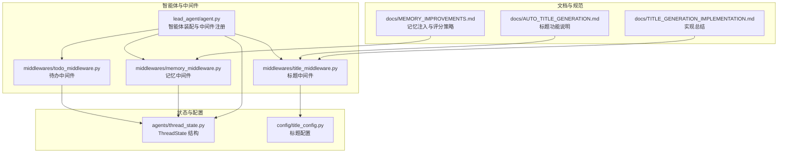
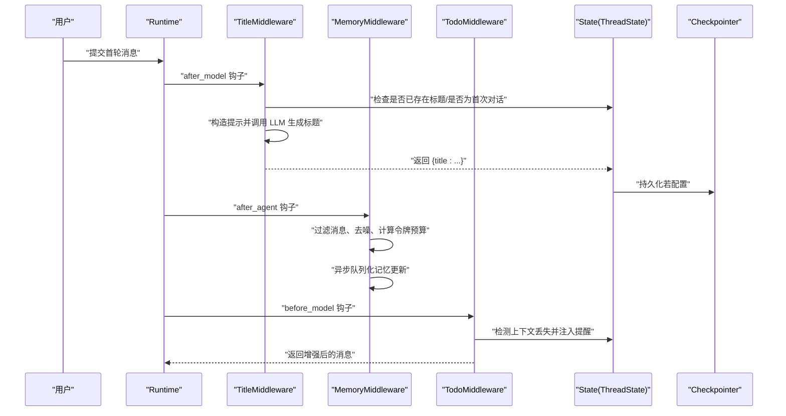
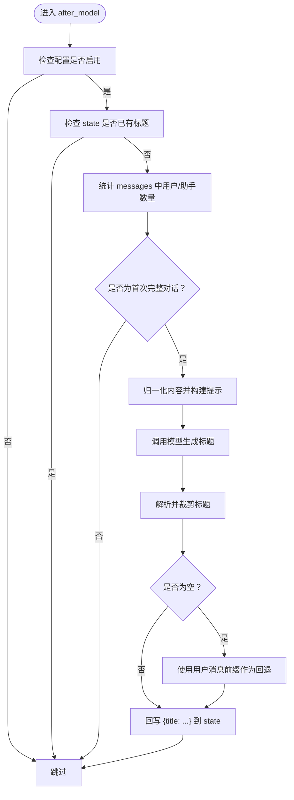
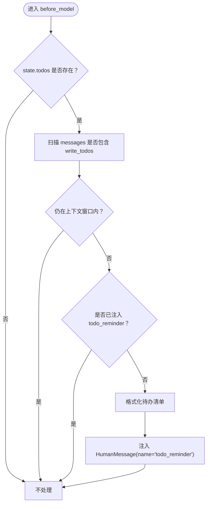
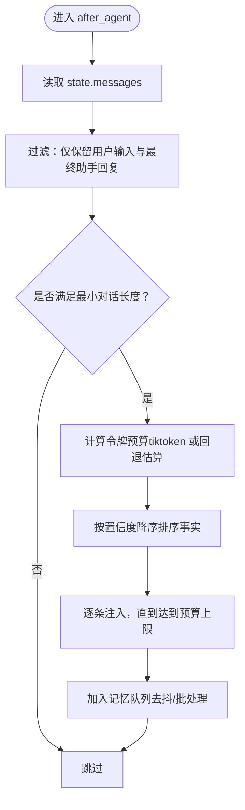
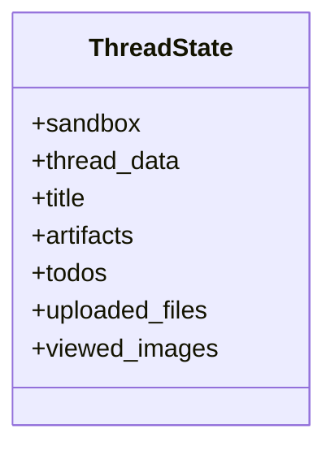
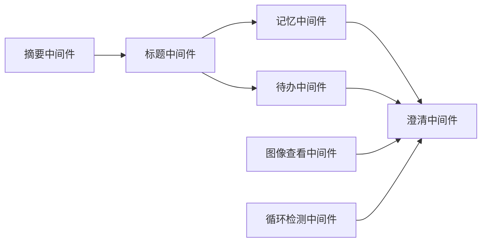
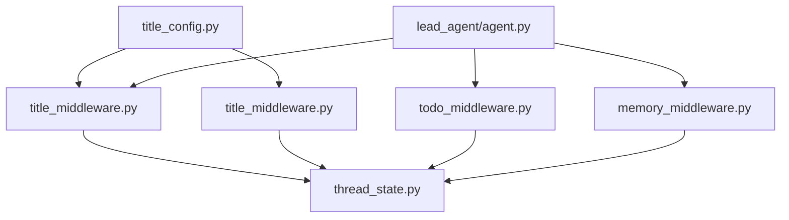

# 上下文工程

<cite>
**本文引用的文件**
- [AUTO_TITLE_GENERATION.md](file://backend/docs/AUTO_TITLE_GENERATION.md)
- [TITLE_GENERATION_IMPLEMENTATION.md](file://backend/docs/TITLE_GENERATION_IMPLEMENTATION.md)
- [thread_state.py](file://backend/packages/harness/deerflow/agents/thread_state.py)
- [title_config.py](file://backend/packages/harness/deerflow/config/title_config.py)
- [title_middleware.py](file://backend/packages/harness/deerflow/agents/middlewares/title_middleware.py)
- [todo_middleware.py](file://backend/packages/harness/deerflow/agents/middlewares/todo_middleware.py)
- [memory_middleware.py](file://backend/packages/harness/deerflow/agents/middlewares/memory_middleware.py)
- [agent.py](file://backend/packages/harness/deerflow/agents/lead_agent/agent.py)
- [MEMORY_IMPROVEMENTS.md](file://backend/docs/MEMORY_IMPROVEMENTS.md)
</cite>

## 目录
1. [引言](#引言)
2. [项目结构](#项目结构)
3. [核心组件](#核心组件)
4. [架构总览](#架构总览)
5. [详细组件分析](#详细组件分析)
6. [依赖分析](#依赖分析)
7. [性能考量](#性能考量)
8. [故障排查指南](#故障排查指南)
9. [结论](#结论)
10. [附录](#附录)

## 引言
本技术文档聚焦“上下文工程”系统，系统通过智能体与中间件协同，实现对话上下文的构建、维护与注入。重点涵盖以下方面：
- 智能体如何利用提示工程与中间件机制，构建并维护高质量的对话上下文；
- 标题中间件的自动标题生成算法与触发条件；
- 中间件的请求拦截与状态更新机制；
- 待办事项中间件的任务追踪与上下文丢失防护；
- 上下文注入策略与提示模板设计原则；
- 具体配置示例与优化建议（上下文长度控制、信息优先级排序、用户体验优化）。

## 项目结构
本项目后端采用分层与模块化组织，核心围绕“智能体 + 中间件 + 配置 + 文档”的结构展开。与上下文工程直接相关的关键模块如下：
- agents/lead_agent/agent.py：智能体装配与中间件注册顺序控制；
- agents/middlewares/*：各类中间件实现（标题、待办、记忆、图像查看等）；
- agents/thread_state.py：线程状态结构，承载标题、待办、上传文件等上下文字段；
- config/title_config.py：标题生成配置；
- docs/*：功能说明、实现总结与最佳实践文档。

**图表来源**
- [agent.py:208-265](file://backend/packages/harness/deerflow/agents/lead_agent/agent.py#L208-L265)
- [title_middleware.py:22-150](file://backend/packages/harness/deerflow/agents/middlewares/title_middleware.py#L22-L150)
- [todo_middleware.py:47-101](file://backend/packages/harness/deerflow/agents/middlewares/todo_middleware.py#L47-L101)
- [memory_middleware.py:86-150](file://backend/packages/harness/deerflow/agents/middlewares/memory_middleware.py#L86-L150)
- [thread_state.py:48-56](file://backend/packages/harness/deerflow/agents/thread_state.py#L48-L56)
- [title_config.py:6-54](file://backend/packages/harness/deerflow/config/title_config.py#L6-L54)
- [AUTO_TITLE_GENERATION.md:1-259](file://backend/docs/AUTO_TITLE_GENERATION.md#L1-L259)
- [TITLE_GENERATION_IMPLEMENTATION.md:1-223](file://backend/docs/TITLE_GENERATION_IMPLEMENTATION.md#L1-L223)
- [MEMORY_IMPROVEMENTS.md:1-66](file://backend/docs/MEMORY_IMPROVEMENTS.md#L1-L66)

**章节来源**
- [agent.py:208-265](file://backend/packages/harness/deerflow/agents/lead_agent/agent.py#L208-L265)
- [AUTO_TITLE_GENERATION.md:1-259](file://backend/docs/AUTO_TITLE_GENERATION.md#L1-L259)
- [TITLE_GENERATION_IMPLEMENTATION.md:1-223](file://backend/docs/TITLE_GENERATION_IMPLEMENTATION.md#L1-L223)
- [MEMORY_IMPROVEMENTS.md:1-66](file://backend/docs/MEMORY_IMPROVEMENTS.md#L1-L66)

## 核心组件
- 标题中间件（TitleMiddleware）：在首次完整对话后自动生成标题，并写回 ThreadState，由检查点持久化。
- 待办中间件（TodoMiddleware）：检测上下文截断导致的待办任务不可见问题，在 before_model 阶段注入提醒消息，确保任务持续跟踪。
- 记忆中间件（MemoryMiddleware）：过滤消息、去噪、异步队列化，按令牌预算注入记忆，提升上下文质量与稳定性。
- ThreadState：统一承载标题、待办、上传文件、视图图片等上下文字段，便于中间件与检查点协作。
- 标题配置（TitleConfig）：集中管理标题生成的开关、长度、模型与提示模板。

**章节来源**
- [thread_state.py:48-56](file://backend/packages/harness/deerflow/agents/thread_state.py#L48-L56)
- [title_config.py:6-54](file://backend/packages/harness/deerflow/config/title_config.py#L6-L54)
- [title_middleware.py:22-150](file://backend/packages/harness/deerflow/agents/middlewares/title_middleware.py#L22-L150)
- [todo_middleware.py:47-101](file://backend/packages/harness/deerflow/agents/middlewares/todo_middleware.py#L47-L101)
- [memory_middleware.py:86-150](file://backend/packages/harness/deerflow/agents/middlewares/memory_middleware.py#L86-L150)

## 架构总览
下图展示智能体执行链路中，中间件对状态与消息的拦截与增强，以及标题生成与记忆注入的时序关系。

**图表来源**
- [agent.py:208-265](file://backend/packages/harness/deerflow/agents/lead_agent/agent.py#L208-L265)
- [title_middleware.py:143-150](file://backend/packages/harness/deerflow/agents/middlewares/title_middleware.py#L143-L150)
- [memory_middleware.py:107-150](file://backend/packages/harness/deerflow/agents/middlewares/memory_middleware.py#L107-L150)
- [todo_middleware.py:56-92](file://backend/packages/harness/deerflow/agents/middlewares/todo_middleware.py#L56-L92)
- [thread_state.py:48-56](file://backend/packages/harness/deerflow/agents/thread_state.py#L48-L56)

## 详细组件分析

### 标题中间件（自动标题生成）
- 触发条件
  - 首次完整对话：存在且仅有1条用户消息与≥1条助手回复；
  - 状态中尚未存在标题；
  - 配置开启。
- 内容归一化
  - 将 LangChain message content 的结构化块/列表统一为纯文本，避免泄露原始repr。
- 生成与回写
  - 使用配置的提示模板与模型生成标题；
  - 解析输出并裁剪至最大字符数；
  - 回写 ThreadState.title，交由检查点持久化。
- 容错策略
  - LLM 调用异常或结果为空时，回退为用户首条消息的前缀片段。

**图表来源**
- [title_middleware.py:46-122](file://backend/packages/harness/deerflow/agents/middlewares/title_middleware.py#L46-L122)
- [title_config.py:29-32](file://backend/packages/harness/deerflow/config/title_config.py#L29-L32)

**章节来源**
- [title_middleware.py:22-150](file://backend/packages/harness/deerflow/agents/middlewares/title_middleware.py#L22-L150)
- [title_config.py:6-54](file://backend/packages/harness/deerflow/config/title_config.py#L6-L54)
- [AUTO_TITLE_GENERATION.md:9-244](file://backend/docs/AUTO_TITLE_GENERATION.md#L9-L244)
- [TITLE_GENERATION_IMPLEMENTATION.md:16-95](file://backend/docs/TITLE_GENERATION_IMPLEMENTATION.md#L16-L95)

### 待办中间件（任务追踪与上下文丢失防护）
- 目标
  - 当消息历史被截断（例如经由摘要中间件）导致原始 write_todos 工具调用消失时，注入一条提醒消息，使模型仍能感知当前待办状态。
- 机制
  - before_model 阶段扫描 messages，若发现：
    - state 中存在待办列表；
    - 历史中不再包含原始 write_todos 调用；
    - 且尚未注入过 todo_reminder；
  - 则注入一条带 name="todo_reminder" 的 HumanMessage，携带当前待办清单与继续跟踪的指令。
- 行为
  - 仅在必要时注入，避免重复与冗余；
  - 与 TodoListMiddleware 协同，保证计划模式下的实时可见性与一致性。

**图表来源**
- [todo_middleware.py:56-91](file://backend/packages/harness/deerflow/agents/middlewares/todo_middleware.py#L56-L91)

**章节来源**
- [todo_middleware.py:47-101](file://backend/packages/harness/deerflow/agents/middlewares/todo_middleware.py#L47-L101)

### 记忆中间件（上下文注入与优先级排序）
- 过滤与去噪
  - 仅保留“用户输入”与“最终助手回复”，过滤工具消息、中间步骤 AI 消息与上传块（会话级，不应进入长期记忆）。
- 令牌预算与注入
  - 基于 tiktoken 的准确计数；若不可用则回退估算；
  - 按置信度降序排列事实，逐条注入直至达到 max_injection_tokens。
- 异步更新
  - 通过队列进行去抖与批量处理，避免频繁写入。

**图表来源**
- [memory_middleware.py:107-150](file://backend/packages/harness/deerflow/agents/middlewares/memory_middleware.py#L107-L150)
- [MEMORY_IMPROVEMENTS.md:23-66](file://backend/docs/MEMORY_IMPROVEMENTS.md#L23-L66)

**章节来源**
- [memory_middleware.py:86-150](file://backend/packages/harness/deerflow/agents/middlewares/memory_middleware.py#L86-L150)
- [MEMORY_IMPROVEMENTS.md:1-66](file://backend/docs/MEMORY_IMPROVEMENTS.md#L1-L66)

### ThreadState（上下文数据模型）
- 字段
  - title：线程标题（用于自动命名与持久化）；
  - todos：待办列表（与计划模式配合）；
  - uploaded_files：上传文件元信息；
  - viewed_images：视图图片缓存；
  - artifacts：产物列表（合并去重）；
  - thread_data：线程数据路径；
  - sandbox：沙箱状态。
- 作用
  - 统一承载上下文信息，便于中间件读写；
  - 与检查点协作实现跨重启的持久化。

**图表来源**
- [thread_state.py:48-56](file://backend/packages/harness/deerflow/agents/thread_state.py#L48-L56)

**章节来源**
- [thread_state.py:48-56](file://backend/packages/harness/deerflow/agents/thread_state.py#L48-L56)

### 中间件注册与拦截顺序（提示工程与上下文控制）
- 注册顺序
  - 摘要中间件（SummarizationMiddleware）应尽早减少上下文后再进行其他处理；
  - 待办中间件应在澄清中间件之前，允许先管理任务；
  - 标题中间件在首次对话后生成标题；
  - 记忆中间件在标题之后，负责异步记忆更新；
  - 图像查看中间件在具备视觉能力的模型上启用；
  - 循环检测中间件贯穿始终；
  - 澄清中间件最后拦截澄清请求。
- 提示工程
  - 标题中间件使用可配置的提示模板，限制词数与字符数；
  - 待办中间件注入系统提醒，强调实时更新与状态一致性；
  - 记忆中间件通过过滤与排序，确保高价值信息进入上下文。

**图表来源**
- [agent.py:208-265](file://backend/packages/harness/deerflow/agents/lead_agent/agent.py#L208-L265)

**章节来源**
- [agent.py:208-265](file://backend/packages/harness/deerflow/agents/lead_agent/agent.py#L208-L265)

## 依赖分析
- 组件耦合
  - 标题中间件依赖标题配置与模型工厂，回写 ThreadState 并由检查点持久化；
  - 待办中间件依赖 TodoListMiddleware 的状态结构，通过消息注入实现上下文修复；
  - 记忆中间件依赖记忆配置与队列，过滤消息后异步更新。
- 外部依赖
  - LangGraph Runtime 与中间件钩子（after_model、after_agent、before_model）；
  - 模型工厂（create_chat_model）与检查点（checkpointer）。

**图表来源**
- [title_config.py:6-54](file://backend/packages/harness/deerflow/config/title_config.py#L6-L54)
- [title_middleware.py:22-150](file://backend/packages/harness/deerflow/agents/middlewares/title_middleware.py#L22-L150)
- [todo_middleware.py:47-101](file://backend/packages/harness/deerflow/agents/middlewares/todo_middleware.py#L47-L101)
- [memory_middleware.py:86-150](file://backend/packages/harness/deerflow/agents/middlewares/memory_middleware.py#L86-L150)
- [thread_state.py:48-56](file://backend/packages/harness/deerflow/agents/thread_state.py#L48-L56)
- [agent.py:208-265](file://backend/packages/harness/deerflow/agents/lead_agent/agent.py#L208-L265)

**章节来源**
- [title_config.py:6-54](file://backend/packages/harness/deerflow/config/title_config.py#L6-L54)
- [title_middleware.py:22-150](file://backend/packages/harness/deerflow/agents/middlewares/title_middleware.py#L22-L150)
- [todo_middleware.py:47-101](file://backend/packages/harness/deerflow/agents/middlewares/todo_middleware.py#L47-L101)
- [memory_middleware.py:86-150](file://backend/packages/harness/deerflow/agents/middlewares/memory_middleware.py#L86-L150)
- [thread_state.py:48-56](file://backend/packages/harness/deerflow/agents/thread_state.py#L48-L56)
- [agent.py:208-265](file://backend/packages/harness/deerflow/agents/lead_agent/agent.py#L208-L265)

## 性能考量
- 标题生成
  - 延迟：约 0.5–1 秒（取决于模型与网络）；
  - 优化：选用轻量模型、缩短提示、降低最大词数与字符数。
- 记忆注入
  - 精确计数：优先使用 tiktoken，不可用时回退估算；
  - 预算控制：max_injection_tokens 限制注入规模，避免上下文溢出；
  - 排序策略：按置信度降序，优先保留高价值事实。
- 待办提醒
  - 仅在上下文丢失时注入，避免重复与冗余；
  - 提示简洁明确，减少令牌消耗。

[本节为通用指导，无需具体文件来源]

## 故障排查指南
- 标题未生成
  - 检查配置 enabled 是否为真；
  - 确认是否为首次完整对话（1 条用户消息 + ≥1 条助手回复）；
  - 查看日志中“Generated thread title”或异常信息。
- 标题生成但客户端看不到
  - 确认从 state.values.title 读取，而非 thread.metadata.title；
  - 重新获取 state 并检查响应体。
- 标题重启后丢失
  - 本地开发需配置检查点（如 SQLite/PostgreSQL）；
  - 平台部署默认持久化。
- 待办提醒未生效
  - 确认 state.todos 存在且历史中已无 write_todos；
  - 检查是否已注入 todo_reminder，避免重复注入。
- 记忆注入异常
  - 检查令牌计数器是否可用（tiktoken）；
  - 调整 max_injection_tokens 与事实排序权重；
  - 确认过滤规则未误删有效消息。

**章节来源**
- [AUTO_TITLE_GENERATION.md:197-216](file://backend/docs/AUTO_TITLE_GENERATION.md#L197-L216)
- [TITLE_GENERATION_IMPLEMENTATION.md:167-186](file://backend/docs/TITLE_GENERATION_IMPLEMENTATION.md#L167-L186)
- [todo_middleware.py:56-91](file://backend/packages/harness/deerflow/agents/middlewares/todo_middleware.py#L56-L91)
- [MEMORY_IMPROVEMENTS.md:36-66](file://backend/docs/MEMORY_IMPROVEMENTS.md#L36-L66)

## 结论
本系统通过“智能体 + 中间件 + 配置 + 文档”的协同，实现了：
- 自动化的对话标题生成与持久化；
- 面向计划模式的实时任务追踪与上下文修复；
- 基于令牌预算与置信度的事实注入策略；
- 清晰的中间件注册顺序与钩子拦截机制。
建议在生产环境中结合令牌预算、提示模板与模型选择进行持续优化，并完善监控指标以保障用户体验与系统稳定性。

[本节为总结，无需具体文件来源]

## 附录

### 配置示例与优化建议
- 标题生成
  - 开关与长度：在配置中启用并设置最大词数与字符数；
  - 模型选择：可指定模型名称或使用默认模型；
  - 提示模板：可按需调整，确保简洁明确。
- 记忆注入
  - 令牌预算：根据模型上下文长度合理设置；
  - 排序权重：按置信度降序，未来可引入相似度加权；
  - 过滤规则：保留用户输入与最终助手回复，剔除工具消息与上传块。
- 待办追踪
  - 计划模式：在 is_plan_mode 下启用待办中间件；
  - 上下文修复：当 write_todos 被截断时自动注入提醒；
  - 实时更新：强调“完成后立即标记完成”，避免批量完成。
- 用户体验优化
  - 首次交互即生成标题，提升会话可读性；
  - 待办状态实时可见，减少用户等待与重复确认；
  - 控制提示长度与模型成本，平衡质量与速度。

**章节来源**
- [title_config.py:6-54](file://backend/packages/harness/deerflow/config/title_config.py#L6-L54)
- [AUTO_TITLE_GENERATION.md:61-83](file://backend/docs/AUTO_TITLE_GENERATION.md#L61-L83)
- [MEMORY_IMPROVEMENTS.md:43-56](file://backend/docs/MEMORY_IMPROVEMENTS.md#L43-L56)
- [agent.py:83-196](file://backend/packages/harness/deerflow/agents/lead_agent/agent.py#L83-L196)