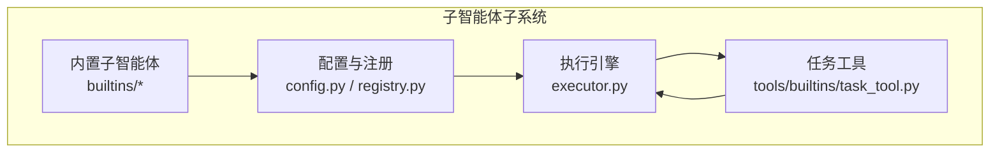
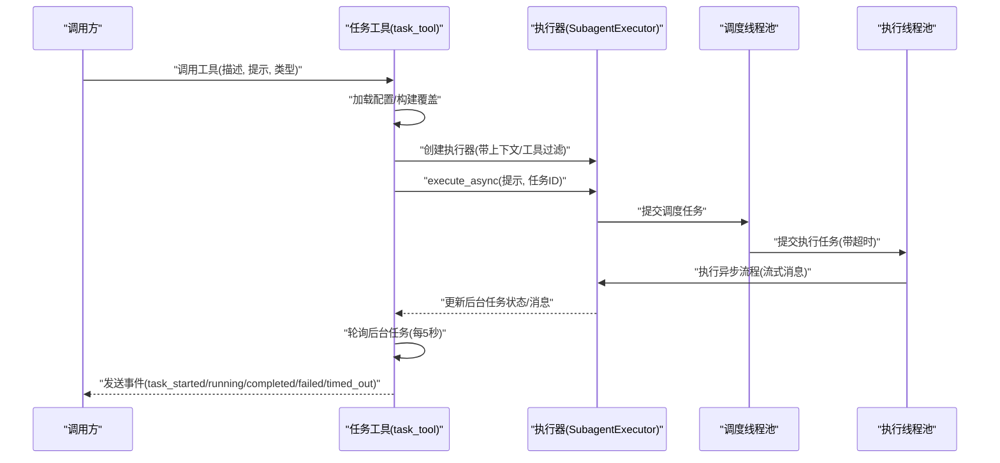
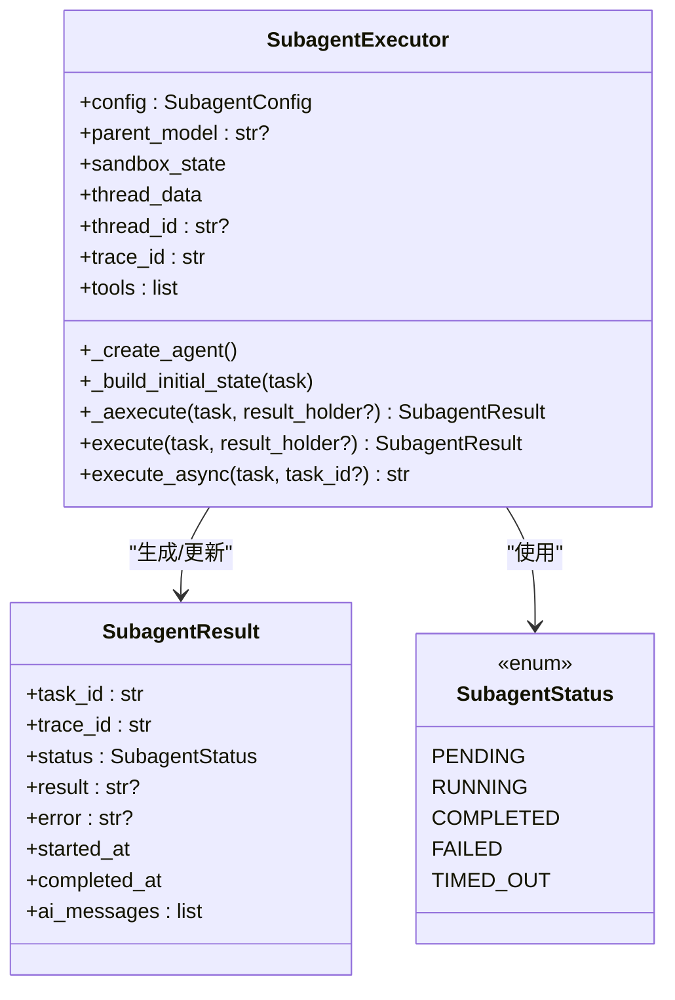
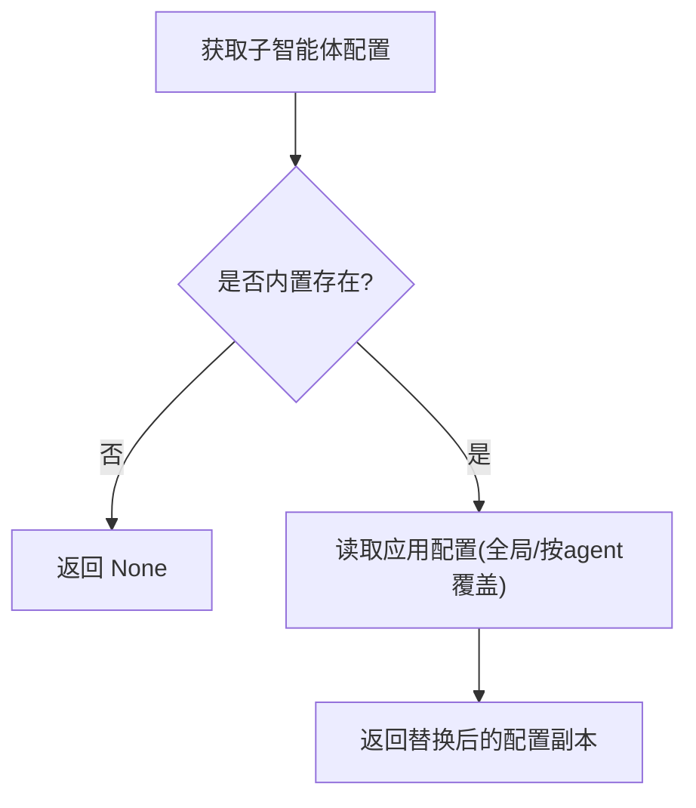
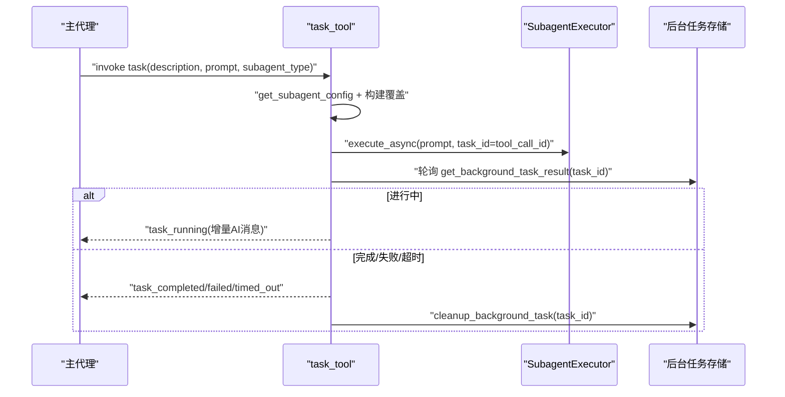
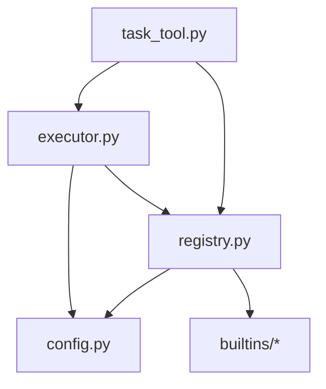

# 子智能体编排

<cite>
**本文引用的文件**
- [backend/packages/harness/deerflow/subagents/__init__.py](file://backend/packages/harness/deerflow/subagents/__init__.py)
- [backend/packages/harness/deerflow/subagents/executor.py](file://backend/packages/harness/deerflow/subagents/executor.py)
- [backend/packages/harness/deerflow/subagents/config.py](file://backend/packages/harness/deerflow/subagents/config.py)
- [backend/packages/harness/deerflow/subagents/registry.py](file://backend/packages/harness/deerflow/subagents/registry.py)
- [backend/packages/harness/deerflow/subagents/builtins/__init__.py](file://backend/packages/harness/deerflow/subagents/builtins/__init__.py)
- [backend/packages/harness/deerflow/subagents/builtins/general_purpose.py](file://backend/packages/harness/deerflow/subagents/builtins/general_purpose.py)
- [backend/packages/harness/deerflow/subagents/builtins/bash_agent.py](file://backend/packages/harness/deerflow/subagents/builtins/bash_agent.py)
- [backend/packages/harness/deerflow/config/subagents_config.py](file://backend/packages/harness/deerflow/config/subagents_config.py)
- [backend/packages/harness/deerflow/tools/builtins/task_tool.py](file://backend/packages/harness/deerflow/tools/builtins/task_tool.py)
- [backend/tests/test_subagent_executor.py](file://backend/tests/test_subagent_executor.py)
- [backend/tests/test_subagent_timeout_config.py](file://backend/tests/test_subagent_timeout_config.py)
</cite>

## 目录
1. [简介](#简介)
2. [项目结构](#项目结构)
3. [核心组件](#核心组件)
4. [架构总览](#架构总览)
5. [详细组件分析](#详细组件分析)
6. [依赖分析](#依赖分析)
7. [性能考虑](#性能考虑)
8. [故障排查指南](#故障排查指南)
9. [结论](#结论)
10. [附录：配置与使用指南](#附录配置与使用指南)

## 简介
本技术文档面向“子智能体编排”系统，聚焦于子智能体的架构设计与执行机制，涵盖异步任务委托、并发执行控制、状态跟踪与结果聚合。文档还深入解析子智能体执行器的工作原理，包括后台线程池管理、任务调度与结果聚合策略；并介绍内置子智能体（通用代理与 Bash 代理）的功能特性与适用场景。最后提供配置示例与使用指南，包括超时设置、并发限制与错误恢复机制。

## 项目结构
子智能体相关代码主要位于后端包 deerflow 的 harness 子包中，围绕以下模块组织：
- 配置与注册：定义子智能体配置、内置子智能体注册表与应用级超时覆盖
- 执行引擎：负责异步/同步执行、并发控制、状态跟踪与结果聚合
- 内置子智能体：通用代理与 Bash 代理的系统提示与工具约束
- 工具集成：任务工具用于将工作委派给子智能体，并在后端轮询结果

图表来源
- [backend/packages/harness/deerflow/subagents/config.py:1-29](file://backend/packages/harness/deerflow/subagents/config.py#L1-L29)
- [backend/packages/harness/deerflow/subagents/registry.py:1-53](file://backend/packages/harness/deerflow/subagents/registry.py#L1-L53)
- [backend/packages/harness/deerflow/subagents/executor.py:1-517](file://backend/packages/harness/deerflow/subagents/executor.py#L1-L517)
- [backend/packages/harness/deerflow/subagents/builtins/__init__.py:1-16](file://backend/packages/harness/deerflow/subagents/builtins/__init__.py#L1-L16)
- [backend/packages/harness/deerflow/tools/builtins/task_tool.py:1-196](file://backend/packages/harness/deerflow/tools/builtins/task_tool.py#L1-L196)

章节来源
- [backend/packages/harness/deerflow/subagents/__init__.py:1-12](file://backend/packages/harness/deerflow/subagents/__init__.py#L1-L12)

## 核心组件
- 子智能体配置 SubagentConfig：描述名称、系统提示、工具白/黑名单、模型继承策略、最大对话轮次与超时秒数等
- 子智能体执行器 SubagentExecutor：封装异步/同步执行、并发控制、状态跟踪与结果聚合
- 注册表 registry：提供内置子智能体查询、应用级超时覆盖与列表输出
- 内置子智能体：通用代理与 Bash 代理的系统提示与工具约束
- 任务工具 task_tool：对外暴露的工具接口，负责委派任务、启动后台执行、轮询与事件推送

章节来源
- [backend/packages/harness/deerflow/subagents/config.py:1-29](file://backend/packages/harness/deerflow/subagents/config.py#L1-L29)
- [backend/packages/harness/deerflow/subagents/executor.py:123-517](file://backend/packages/harness/deerflow/subagents/executor.py#L123-L517)
- [backend/packages/harness/deerflow/subagents/registry.py:1-53](file://backend/packages/harness/deerflow/subagents/registry.py#L1-L53)
- [backend/packages/harness/deerflow/subagents/builtins/general_purpose.py:1-48](file://backend/packages/harness/deerflow/subagents/builtins/general_purpose.py#L1-L48)
- [backend/packages/harness/deerflow/subagents/builtins/bash_agent.py:1-47](file://backend/packages/harness/deerflow/subagents/builtins/bash_agent.py#L1-L47)
- [backend/packages/harness/deerflow/tools/builtins/task_tool.py:1-196](file://backend/packages/harness/deerflow/tools/builtins/task_tool.py#L1-L196)

## 架构总览
子智能体编排采用“工具委派 + 后台执行 + 轮询反馈”的模式：
- 外部调用通过任务工具发起
- 任务工具获取子智能体配置与可用工具，构造执行器并启动后台执行
- 执行器在独立线程池中运行，支持异步工具与流式消息收集
- 任务工具在后端周期性轮询任务状态，向流写入事件，最终返回结果或错误

图表来源
- [backend/packages/harness/deerflow/tools/builtins/task_tool.py:115-195](file://backend/packages/harness/deerflow/tools/builtins/task_tool.py#L115-L195)
- [backend/packages/harness/deerflow/subagents/executor.py:391-453](file://backend/packages/harness/deerflow/subagents/executor.py#L391-L453)

## 详细组件分析

### 子智能体执行器 SubagentExecutor
- 异步执行路径：基于 LangGraph 的流式执行，逐块收集 AI 消息，最终提取最后一次 AIMessage 的内容作为结果
- 同步执行路径：在新事件循环中运行异步流程，适配线程池环境与异步工具（如 MCP 工具）
- 并发控制：两套线程池
  - 调度线程池：较小规模（默认 3），负责任务提交与状态更新
  - 执行线程池：较大规模（默认 3），实际执行子智能体并支持超时
- 超时机制：执行线程池提交任务时设置超时，超时后标记为 TIMED_OUT 并尝试取消
- 结果聚合：维护 SubagentResult，包含任务 ID、追踪 ID、状态、结果文本、错误信息、时间戳与 AI 消息列表
- 线程安全：全局后台任务字典使用锁保护，清理函数仅在终端态移除任务，避免竞态

图表来源
- [backend/packages/harness/deerflow/subagents/executor.py:123-517](file://backend/packages/harness/deerflow/subagents/executor.py#L123-L517)

章节来源
- [backend/packages/harness/deerflow/subagents/executor.py:123-517](file://backend/packages/harness/deerflow/subagents/executor.py#L123-L517)

### 子智能体配置与注册
- SubagentConfig：定义子智能体的名称、描述、系统提示、工具白/黑名单、模型继承、最大轮次与超时秒数
- 注册表 registry：提供内置子智能体查询与列表输出；从应用配置中读取 per-agent 覆盖，动态调整超时
- 应用配置 subagents_config：支持全局默认超时与按子智能体覆盖，提供单例访问与日志记录

图表来源
- [backend/packages/harness/deerflow/subagents/registry.py:12-34](file://backend/packages/harness/deerflow/subagents/registry.py#L12-L34)
- [backend/packages/harness/deerflow/config/subagents_config.py:33-45](file://backend/packages/harness/deerflow/config/subagents_config.py#L33-L45)

章节来源
- [backend/packages/harness/deerflow/subagents/config.py:1-29](file://backend/packages/harness/deerflow/subagents/config.py#L1-L29)
- [backend/packages/harness/deerflow/subagents/registry.py:1-53](file://backend/packages/harness/deerflow/subagents/registry.py#L1-L53)
- [backend/packages/harness/deerflow/config/subagents_config.py:1-66](file://backend/packages/harness/deerflow/config/subagents_config.py#L1-L66)

### 内置子智能体：通用代理与 Bash 代理
- 通用代理 general-purpose
  - 适用场景：需要探索与行动结合、复杂推理、多步骤依赖的任务
  - 系统提示强调自主完成任务、清晰结果、避免澄清请求
  - 工具策略：继承父级所有工具，禁用 task/clarification/present_files 等防止嵌套与澄清
- Bash 代理 bash
  - 适用场景：需要在隔离上下文中执行一系列 Bash 命令，如 git、npm、docker 或构建/测试/部署操作
  - 系统提示强调命令顺序执行、并行执行独立命令、报告 stdout/stderr、谨慎破坏性操作
  - 工具策略：仅允许 bash、ls、read_file、write_file、str_replace 等沙箱工具，禁用 task/clarification/present_files

章节来源
- [backend/packages/harness/deerflow/subagents/builtins/general_purpose.py:1-48](file://backend/packages/harness/deerflow/subagents/builtins/general_purpose.py#L1-L48)
- [backend/packages/harness/deerflow/subagents/builtins/bash_agent.py:1-47](file://backend/packages/harness/deerflow/subagents/builtins/bash_agent.py#L1-L47)

### 任务工具 task_tool：委派、轮询与事件推送
- 委派流程：根据子智能体类型获取配置，合并系统提示与 max_turns 覆盖，构建执行器并启动后台执行
- 轮询策略：每 5 秒轮询一次后台任务，发送 task_started、task_running、task_completed、task_failed、task_timed_out 事件
- 超时计算：轮询上限为 (执行超时 + 60) // 5 次，确保覆盖线程池超时未触发的边缘情况
- 清理策略：当任务进入终端态时由工具侧清理，避免内存泄漏

图表来源
- [backend/packages/harness/deerflow/tools/builtins/task_tool.py:115-195](file://backend/packages/harness/deerflow/tools/builtins/task_tool.py#L115-L195)
- [backend/packages/harness/deerflow/subagents/executor.py:459-517](file://backend/packages/harness/deerflow/subagents/executor.py#L459-L517)

章节来源
- [backend/packages/harness/deerflow/tools/builtins/task_tool.py:1-196](file://backend/packages/harness/deerflow/tools/builtins/task_tool.py#L1-L196)

## 依赖分析
- 组件内聚与耦合
  - 执行器与配置/注册解耦，通过 SubagentConfig 与 registry 获取配置
  - 任务工具与执行器弱耦合，仅依赖后台任务查询与清理接口
  - 内置子智能体与配置解耦，通过注册表统一暴露
- 外部依赖
  - LangGraph 流式执行与消息结构
  - 线程池并发模型与超时异常处理
  - 分布式追踪 ID 传递

图表来源
- [backend/packages/harness/deerflow/subagents/registry.py:1-53](file://backend/packages/harness/deerflow/subagents/registry.py#L1-L53)
- [backend/packages/harness/deerflow/subagents/config.py:1-29](file://backend/packages/harness/deerflow/subagents/config.py#L1-L29)
- [backend/packages/harness/deerflow/subagents/builtins/__init__.py:1-16](file://backend/packages/harness/deerflow/subagents/builtins/__init__.py#L1-L16)
- [backend/packages/harness/deerflow/subagents/executor.py:1-517](file://backend/packages/harness/deerflow/subagents/executor.py#L1-L517)
- [backend/packages/harness/deerflow/tools/builtins/task_tool.py:1-196](file://backend/packages/harness/deerflow/tools/builtins/task_tool.py#L1-L196)

章节来源
- [backend/packages/harness/deerflow/subagents/registry.py:1-53](file://backend/packages/harness/deerflow/subagents/registry.py#L1-L53)
- [backend/packages/harness/deerflow/subagents/executor.py:1-517](file://backend/packages/harness/deerflow/subagents/executor.py#L1-L517)
- [backend/packages/harness/deerflow/tools/builtins/task_tool.py:1-196](file://backend/packages/harness/deerflow/tools/builtins/task_tool.py#L1-L196)

## 性能考虑
- 并发限制：全局并发上限由 MAX_CONCURRENT_SUBAGENTS 控制（默认 3），避免资源争用
- 线程池分工：调度线程池小而稳，执行线程池大且具备超时能力，兼顾吞吐与稳定性
- 轮询开销：后端每 5 秒轮询一次，配合 (timeout + 60) // 5 的上限，平衡实时性与 CPU 占用
- 流式消息：执行器在流式阶段增量收集 AI 消息，减少一次性序列化成本
- 超时策略：线程池超时与后端轮询双重保障，确保长时间卡顿任务不会无限占用资源

## 故障排查指南
- 执行失败（FAILED）
  - 现象：任务状态为 FAILED，返回错误信息
  - 排查：检查系统提示、工具过滤、模型配置与父级上下文传递
- 超时（TIMED_OUT）
  - 现象：任务状态为 TIMED_OUT，可能伴随后端轮询超时
  - 排查：增大超时配置或优化子任务逻辑；确认异步工具正确等待
- 无响应（无最终状态）
  - 现象：最终状态为空，返回“未生成响应”
  - 排查：检查代理是否正确结束对话；确认 AIMessage 内容格式
- 竞态与内存泄漏
  - 现象：后台任务未清理导致内存增长
  - 排查：确保在工具侧调用清理函数；仅对终端态任务进行清理

章节来源
- [backend/packages/harness/deerflow/subagents/executor.py:482-517](file://backend/packages/harness/deerflow/subagents/executor.py#L482-L517)
- [backend/tests/test_subagent_executor.py:635-774](file://backend/tests/test_subagent_executor.py#L635-L774)

## 结论
子智能体编排系统通过明确的配置-执行-轮询闭环，实现了对复杂任务的异步委派与并发控制。执行器在保证线程池隔离与超时安全的同时，提供了流式消息聚合与分布式追踪能力；内置子智能体针对不同场景提供即插即用的能力边界。配合应用级超时覆盖与严格的清理策略，系统在可扩展性与稳定性之间取得良好平衡。

## 附录：配置与使用指南

### 配置项说明
- 全局默认超时：默认 900 秒（15 分钟）
- 按子智能体覆盖：支持为特定子智能体设置独立超时
- 工具过滤：可通过工具白名单与黑名单控制子智能体可用能力
- 最大轮次：限制子智能体对话轮次，避免长尾消耗

章节来源
- [backend/packages/harness/deerflow/config/subagents_config.py:20-45](file://backend/packages/harness/deerflow/config/subagents_config.py#L20-L45)
- [backend/packages/harness/deerflow/subagents/config.py:6-29](file://backend/packages/harness/deerflow/subagents/config.py#L6-L29)

### 使用示例与最佳实践
- 基本委派
  - 使用任务工具传入描述、提示与子智能体类型，自动启动后台执行
  - 在后端轮询事件，实时展示中间结果
- 超时设置
  - 通过应用配置为通用代理或 Bash 代理设置更短/更长的超时
  - 注意轮询上限公式：(timeout + 60) // 5，确保轮询窗口覆盖执行超时
- 并发限制
  - 默认并发上限为 3，可根据资源与任务特征调整线程池大小
- 错误恢复
  - 失败与超时事件会返回错误信息，建议在上层重试或降级处理
  - 对于长时间卡顿任务，后端轮询超时会兜底，避免资源泄露

章节来源
- [backend/packages/harness/deerflow/tools/builtins/task_tool.py:115-195](file://backend/packages/harness/deerflow/tools/builtins/task_tool.py#L115-L195)
- [backend/tests/test_subagent_timeout_config.py:320-355](file://backend/tests/test_subagent_timeout_config.py#L320-L355)