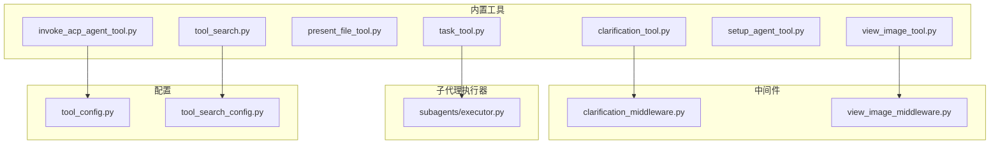
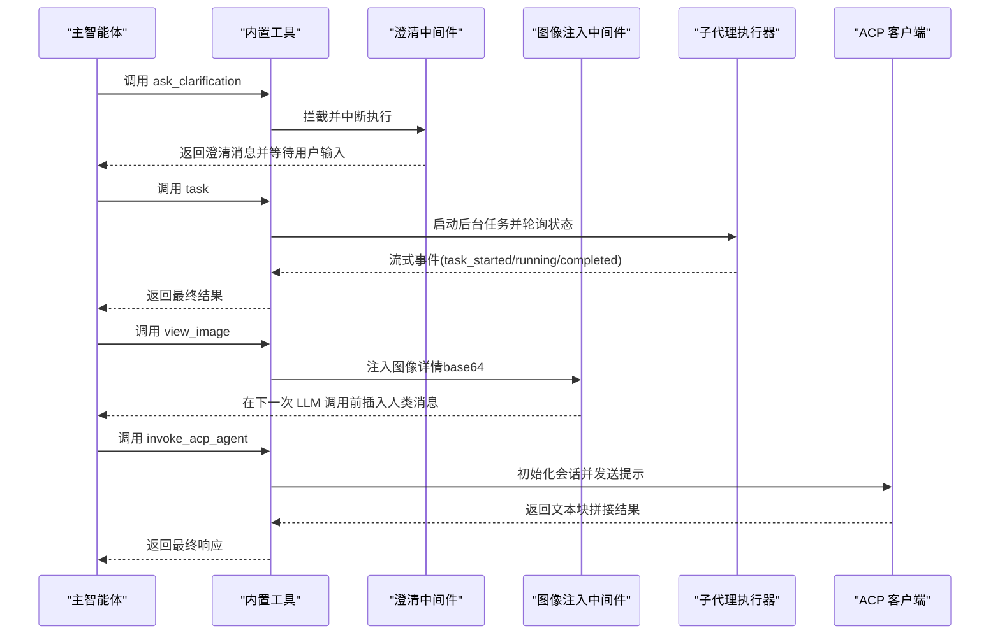
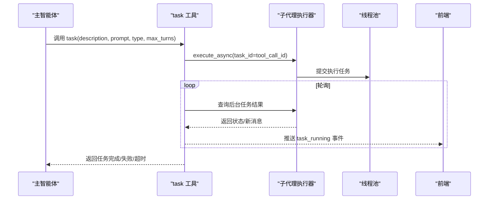
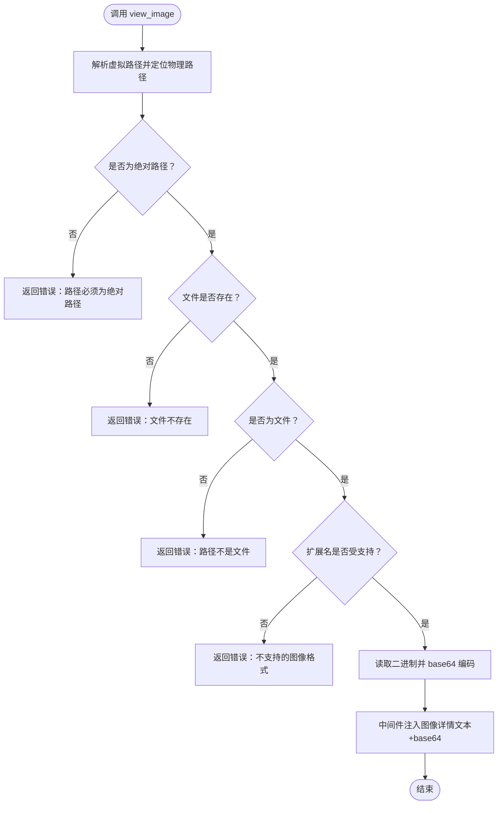
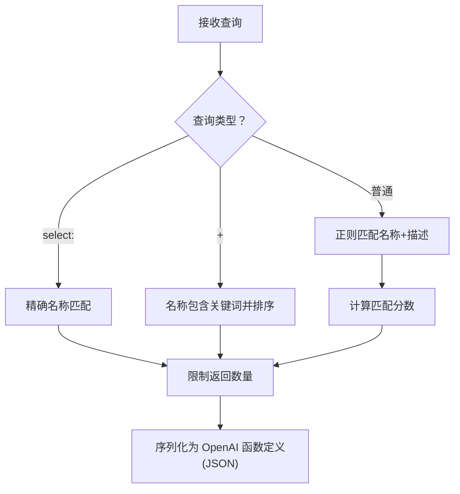
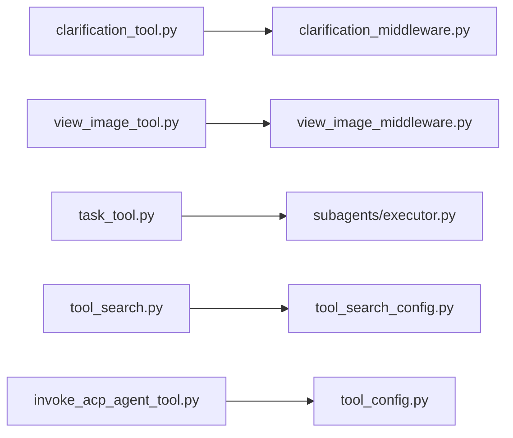

# 内置工具套件

<cite>
**本文引用的文件**
- [backend/packages/harness/deerflow/tools/builtins/__init__.py](file://backend/packages/harness/deerflow/tools/builtins/__init__.py)
- [backend/packages/harness/deerflow/tools/builtins/clarification_tool.py](file://backend/packages/harness/deerflow/tools/builtins/clarification_tool.py)
- [backend/packages/harness/deerflow/tools/builtins/present_file_tool.py](file://backend/packages/harness/deerflow/tools/builtins/present_file_tool.py)
- [backend/packages/harness/deerflow/tools/builtins/setup_agent_tool.py](file://backend/packages/harness/deerflow/tools/builtins/setup_agent_tool.py)
- [backend/packages/harness/deerflow/tools/builtins/task_tool.py](file://backend/packages/harness/deerflow/tools/builtins/task_tool.py)
- [backend/packages/harness/deerflow/tools/builtins/view_image_tool.py](file://backend/packages/harness/deerflow/tools/builtins/view_image_tool.py)
- [backend/packages/harness/deerflow/tools/builtins/tool_search.py](file://backend/packages/harness/deerflow/tools/builtins/tool_search.py)
- [backend/packages/harness/deerflow/tools/builtins/invoke_acp_agent_tool.py](file://backend/packages/harness/deerflow/tools/builtins/invoke_acp_agent_tool.py)
- [backend/packages/harness/deerflow/agents/middlewares/clarification_middleware.py](file://backend/packages/harness/deerflow/agents/middlewares/clarification_middleware.py)
- [backend/packages/harness/deerflow/agents/middlewares/view_image_middleware.py](file://backend/packages/harness/deerflow/agents/middlewares/view_image_middleware.py)
- [backend/packages/harness/deerflow/subagents/executor.py](file://backend/packages/harness/deerflow/subagents/executor.py)
- [backend/packages/harness/deerflow/config/tool_config.py](file://backend/packages/harness/deerflow/config/tool_config.py)
- [backend/packages/harness/deerflow/config/tool_search_config.py](file://backend/packages/harness/deerflow/config/tool_search_config.py)
- [backend/tests/test_tool_search.py](file://backend/tests/test_tool_search.py)
</cite>

## 目录
1. [简介](#简介)
2. [项目结构](#项目结构)
3. [核心组件](#核心组件)
4. [架构总览](#架构总览)
5. [详细组件分析](#详细组件分析)
6. [依赖分析](#依赖分析)
7. [性能考虑](#性能考虑)
8. [故障排查指南](#故障排查指南)
9. [结论](#结论)
10. [附录](#附录)

## 简介
本文件系统化梳理 DeerFlow 内置工具套件，覆盖以下工具与能力：
- 信息澄清工具：用于在需要更多信息时暂停执行并提示用户选择
- 任务工具：将复杂任务委派给专用子代理（子智能体），支持并行后台执行与状态轮询
- 文件展示工具：将生成的产物文件暴露给前端进行浏览与下载
- 图像查看工具：读取指定图像并注入到对话中供模型“观看”与分析
- ACP 代理调用工具：通过 ACP 协议调用外部兼容代理，并返回其最终响应
- 代理设置工具：在运行时写入自定义代理的配置与人格文件
- 工具搜索工具：延迟加载与动态发现工具，按查询条件返回完整函数签名

文档将从设计目的、使用场景、参数定义、返回值格式、错误处理与安全限制等方面进行说明，并提供调用示例与工具协作模式。

## 项目结构
内置工具集中于 deerflow/tools/builtins 目录，配套中间件与子代理执行器位于 deerflow/agents/middlewares 与 deerflow/subagents 下；配置项位于 deerflow/config。

图示来源
- [backend/packages/harness/deerflow/tools/builtins/clarification_tool.py:1-56](file://backend/packages/harness/deerflow/tools/builtins/clarification_tool.py#L1-L56)
- [backend/packages/harness/deerflow/tools/builtins/task_tool.py:1-196](file://backend/packages/harness/deerflow/tools/builtins/task_tool.py#L1-L196)
- [backend/packages/harness/deerflow/tools/builtins/present_file_tool.py:1-101](file://backend/packages/harness/deerflow/tools/builtins/present_file_tool.py#L1-L101)
- [backend/packages/harness/deerflow/tools/builtins/view_image_tool.py:1-95](file://backend/packages/harness/deerflow/tools/builtins/view_image_tool.py#L1-L95)
- [backend/packages/harness/deerflow/tools/builtins/invoke_acp_agent_tool.py:1-209](file://backend/packages/harness/deerflow/tools/builtins/invoke_acp_agent_tool.py#L1-L209)
- [backend/packages/harness/deerflow/tools/builtins/setup_agent_tool.py:1-63](file://backend/packages/harness/deerflow/tools/builtins/setup_agent_tool.py#L1-L63)
- [backend/packages/harness/deerflow/tools/builtins/tool_search.py:1-177](file://backend/packages/harness/deerflow/tools/builtins/tool_search.py#L1-L177)
- [backend/packages/harness/deerflow/agents/middlewares/clarification_middleware.py:1-174](file://backend/packages/harness/deerflow/agents/middlewares/clarification_middleware.py#L1-L174)
- [backend/packages/harness/deerflow/agents/middlewares/view_image_middleware.py:1-222](file://backend/packages/harness/deerflow/agents/middlewares/view_image_middleware.py#L1-L222)
- [backend/packages/harness/deerflow/subagents/executor.py:1-517](file://backend/packages/harness/deerflow/subagents/executor.py#L1-L517)
- [backend/packages/harness/deerflow/config/tool_config.py:1-21](file://backend/packages/harness/deerflow/config/tool_config.py#L1-L21)
- [backend/packages/harness/deerflow/config/tool_search_config.py:1-36](file://backend/packages/harness/deerflow/config/tool_search_config.py#L1-L36)

章节来源
- [backend/packages/harness/deerflow/tools/builtins/__init__.py:1-14](file://backend/packages/harness/deerflow/tools/builtins/__init__.py#L1-L14)

## 核心组件
- 信息澄清工具（ask_clarification）：当需要更多信息或风险确认时，拦截执行并向用户提问，等待回复后继续
- 任务工具（task）：委派复杂任务给子代理，支持并发后台执行、状态轮询与流式事件推送
- 文件展示工具（present_files）：将输出目录中的文件暴露给前端，支持多文件并行调用
- 图像查看工具（view_image）：读取指定图像，校验路径与格式，注入到对话中供模型分析
- ACP 代理调用工具（invoke_acp_agent）：通过 ACP 协议调用外部代理，自动处理权限请求与工作区隔离
- 代理设置工具（setup_agent）：在运行时写入自定义代理的配置与 SOUL.md
- 工具搜索工具（tool_search）：延迟加载工具，按查询返回 OpenAI 函数签名，支持精确选择与关键词检索

章节来源
- [backend/packages/harness/deerflow/tools/builtins/clarification_tool.py:1-56](file://backend/packages/harness/deerflow/tools/builtins/clarification_tool.py#L1-L56)
- [backend/packages/harness/deerflow/tools/builtins/task_tool.py:1-196](file://backend/packages/harness/deerflow/tools/builtins/task_tool.py#L1-L196)
- [backend/packages/harness/deerflow/tools/builtins/present_file_tool.py:1-101](file://backend/packages/harness/deerflow/tools/builtins/present_file_tool.py#L1-L101)
- [backend/packages/harness/deerflow/tools/builtins/view_image_tool.py:1-95](file://backend/packages/harness/deerflow/tools/builtins/view_image_tool.py#L1-L95)
- [backend/packages/harness/deerflow/tools/builtins/invoke_acp_agent_tool.py:1-209](file://backend/packages/harness/deerflow/tools/builtins/invoke_acp_agent_tool.py#L1-L209)
- [backend/packages/harness/deerflow/tools/builtins/setup_agent_tool.py:1-63](file://backend/packages/harness/deerflow/tools/builtins/setup_agent_tool.py#L1-L63)
- [backend/packages/harness/deerflow/tools/builtins/tool_search.py:1-177](file://backend/packages/harness/deerflow/tools/builtins/tool_search.py#L1-L177)

## 架构总览
内置工具与中间件、子代理执行器协同工作，形成“工具调用—状态注入—结果回传”的闭环。

图示来源
- [backend/packages/harness/deerflow/agents/middlewares/clarification_middleware.py:1-174](file://backend/packages/harness/deerflow/agents/middlewares/clarification_middleware.py#L1-L174)
- [backend/packages/harness/deerflow/agents/middlewares/view_image_middleware.py:1-222](file://backend/packages/harness/deerflow/agents/middlewares/view_image_middleware.py#L1-L222)
- [backend/packages/harness/deerflow/subagents/executor.py:1-517](file://backend/packages/harness/deerflow/subagents/executor.py#L1-L517)
- [backend/packages/harness/deerflow/tools/builtins/invoke_acp_agent_tool.py:1-209](file://backend/packages/harness/deerflow/tools/builtins/invoke_acp_agent_tool.py#L1-L209)

## 详细组件分析

### 信息澄清工具（ask_clarification）
- 设计目的：在缺少信息、需求模糊、存在多种实现路径、潜在风险或建议性操作时，暂停执行并请求用户明确
- 使用场景：
  - 需要文件路径、URL 或具体要求
  - 多种可行方案需用户偏好
  - 可能破坏性的操作（删除、修改生产数据）
  - 提出建议但需用户批准
- 参数定义
  - question: 明确且具体的澄清问题
  - clarification_type: 类型枚举（缺失信息、需求模糊、方案选择、风险确认、建议）
  - context: 可选背景说明，帮助用户理解情境
  - options: 可选选项列表（适用于方案选择或建议）
- 返回值格式：占位返回字符串，实际由中间件接管并中断执行
- 错误处理与安全限制
  - 仅作为占位工具，真实逻辑由 ClarificationMiddleware 拦截
  - 不直接访问文件系统或网络资源
- 使用示例
  - 场景：需要用户确认是否删除生产配置
  - 调用：传入类型为“风险确认”，options 包含“确认删除/取消”
  - 结果：执行被中断，前端显示澄清消息，等待用户回复后继续

章节来源
- [backend/packages/harness/deerflow/tools/builtins/clarification_tool.py:1-56](file://backend/packages/harness/deerflow/tools/builtins/clarification_tool.py#L1-L56)
- [backend/packages/harness/deerflow/agents/middlewares/clarification_middleware.py:1-174](file://backend/packages/harness/deerflow/agents/middlewares/clarification_middleware.py#L1-L174)

### 任务工具（task）
- 设计目的：将复杂、多步骤、可能产生冗长输出的任务委派给专用子代理，保持主会话上下文清晰
- 使用场景：
  - 需要探索与行动分离的复杂任务
  - 并行研究或探索任务
  - 命令行操作或需要隔离上下文的任务
- 参数定义
  - description: 任务简述（日志/展示用途）
  - prompt: 子代理任务描述（必须明确具体）
  - subagent_type: 子代理类型（general-purpose / bash）
  - max_turns: 可选最大轮次
- 返回值格式：字符串，包含任务状态与最终结果或错误信息
- 错误处理与安全限制
  - 不允许嵌套调用自身（排除 task 工具）
  - 轮询超时与线程池超时双重保护
  - 后台任务完成后清理内存，避免泄漏
- 使用示例
  - 场景：生成并部署一个应用
  - 调用：type 为 general-purpose，prompt 描述构建与部署流程
  - 结果：后台持续推送 task_running 事件，完成后返回最终结果
- 协作模式
  - 与子代理执行器配合，异步提交任务并轮询状态
  - 通过流式写入器向前端推送任务生命周期事件

图示来源
- [backend/packages/harness/deerflow/tools/builtins/task_tool.py:1-196](file://backend/packages/harness/deerflow/tools/builtins/task_tool.py#L1-L196)
- [backend/packages/harness/deerflow/subagents/executor.py:1-517](file://backend/packages/harness/deerflow/subagents/executor.py#L1-L517)

章节来源
- [backend/packages/harness/deerflow/tools/builtins/task_tool.py:1-196](file://backend/packages/harness/deerflow/tools/builtins/task_tool.py#L1-L196)
- [backend/packages/harness/deerflow/subagents/executor.py:1-517](file://backend/packages/harness/deerflow/subagents/executor.py#L1-L517)

### 文件展示工具（present_files）
- 设计目的：将生成的产物文件暴露给前端进行查看与下载
- 使用场景：
  - 创建报告、图表、代码等文件后立即展示
  - 批量展示多个相关文件
- 参数定义
  - filepaths: 绝对路径列表，仅限输出目录（/mnt/user-data/outputs）内文件
- 返回值格式：Command，更新 artifacts 与消息
- 错误处理与安全限制
  - 路径规范化与输出目录校验，防止越权访问
  - 并发调用安全，状态合并由 reducer 处理
- 使用示例
  - 场景：生成 HTML 报告与图片
  - 调用：传入报告与图片路径
  - 结果：前端可直接预览与下载

章节来源
- [backend/packages/harness/deerflow/tools/builtins/present_file_tool.py:1-101](file://backend/packages/harness/deerflow/tools/builtins/present_file_tool.py#L1-L101)

### 图像查看工具（view_image）
- 设计目的：读取指定图像文件，校验合法性后注入到对话中供模型分析
- 使用场景：
  - 展示并分析图表、截图、设计稿
- 参数定义
  - image_path: 绝对路径，支持常见格式（jpg/jpeg/png/webp）
- 返回值格式：Command，更新 viewed_images 与消息
- 错误处理与安全限制
  - 路径必须为绝对路径且存在
  - 仅接受文件，拒绝目录
  - 校验扩展名与 MIME 类型
  - 中间件在下一次 LLM 调用前注入混合内容（文本+图像）
- 使用示例
  - 场景：上传一张产品图进行分析
  - 调用：传入绝对路径
  - 结果：模型可在后续推理中看到该图像

图示来源
- [backend/packages/harness/deerflow/tools/builtins/view_image_tool.py:1-95](file://backend/packages/harness/deerflow/tools/builtins/view_image_tool.py#L1-L95)
- [backend/packages/harness/deerflow/agents/middlewares/view_image_middleware.py:1-222](file://backend/packages/harness/deerflow/agents/middlewares/view_image_middleware.py#L1-L222)

章节来源
- [backend/packages/harness/deerflow/tools/builtins/view_image_tool.py:1-95](file://backend/packages/harness/deerflow/tools/builtins/view_image_tool.py#L1-L95)
- [backend/packages/harness/deerflow/agents/middlewares/view_image_middleware.py:1-222](file://backend/packages/harness/deerflow/agents/middlewares/view_image_middleware.py#L1-L222)

### ACP 代理调用工具（invoke_acp_agent）
- 设计目的：通过 ACP 协议调用外部兼容代理，隔离工作空间并返回最终响应
- 使用场景：
  - 需要独立工作区与 MCP 服务器的外部任务
  - 自动处理权限请求与模型选择
- 参数定义
  - agent: ACP 代理名称（必须在可用代理列表中）
  - prompt: 简洁的任务提示
- 返回值格式：字符串，包含代理最终响应或错误信息
- 错误处理与安全限制
  - 未知代理：返回可用代理列表
  - 未安装客户端库：提示安装依赖
  - 命令未找到：提供修复建议（如安装适配器或更新配置）
  - 权限自动批准策略：可配置 auto_approve_permissions
  - 工作目录隔离：按线程隔离，避免并发冲突
- 使用示例
  - 场景：调用 codex-acp 代理执行代码任务
  - 调用：传入代理名与任务提示
  - 结果：返回代理输出文本

章节来源
- [backend/packages/harness/deerflow/tools/builtins/invoke_acp_agent_tool.py:1-209](file://backend/packages/harness/deerflow/tools/builtins/invoke_acp_agent_tool.py#L1-L209)

### 代理设置工具（setup_agent）
- 设计目的：在运行时为自定义代理写入配置与 SOUL.md
- 使用场景：
  - 动态创建或重写代理人格与描述
- 参数定义
  - soul: SOUL.md 内容
  - description: 代理描述
  - runtime: 运行时上下文（包含 agent_name）
- 返回值格式：Command，更新 created_agent_name 与消息
- 错误处理与安全限制
  - 异常时清理已创建的代理目录
  - 严格依赖运行时上下文中的 agent_name
- 使用示例
  - 场景：为新代理注入 SOUL 与描述
  - 调用：传入 soul 与 description
  - 结果：成功创建并返回消息

章节来源
- [backend/packages/harness/deerflow/tools/builtins/setup_agent_tool.py:1-63](file://backend/packages/harness/deerflow/tools/builtins/setup_agent_tool.py#L1-L63)

### 工具搜索工具（tool_search）
- 设计目的：延迟加载工具，按查询返回 OpenAI 函数签名，避免一次性加载所有工具
- 使用场景：
  - MCP 工具数量庞大时按需发现
  - 需要精确选择或关键词检索
- 查询形式
  - select:名称列表（精确匹配）
  - +关键词 其他词（名称包含关键词并按剩余词排序）
  - 关键词（正则匹配名称+描述）
- 返回值格式：JSON 字符串，包含最多 N 个工具的函数定义（OpenAI 格式）
- 错误处理与安全限制
  - 无注册表：返回“无延迟工具可用”
  - 无匹配：返回“未找到匹配工具”
  - 正则无效：退化为字面量匹配
- 使用示例
  - 场景：查找“github”相关的工具
  - 调用：传入关键词
  - 结果：返回工具函数定义数组

图示来源
- [backend/packages/harness/deerflow/tools/builtins/tool_search.py:1-177](file://backend/packages/harness/deerflow/tools/builtins/tool_search.py#L1-L177)

章节来源
- [backend/packages/harness/deerflow/tools/builtins/tool_search.py:1-177](file://backend/packages/harness/deerflow/tools/builtins/tool_search.py#L1-L177)
- [backend/packages/harness/deerflow/config/tool_search_config.py:1-36](file://backend/packages/harness/deerflow/config/tool_search_config.py#L1-L36)
- [backend/tests/test_tool_search.py:1-395](file://backend/tests/test_tool_search.py#L1-L395)

## 依赖分析
- 工具与中间件耦合
  - ask_clarification 与 ClarificationMiddleware 强耦合，前者仅占位，后者负责中断与展示
  - view_image 与 ViewImageMiddleware 协作，在 LLM 调用前注入图像详情
- 工具与执行器耦合
  - task 工具与 SubagentExecutor 强耦合，负责后台调度、轮询与事件推送
- 工具与配置耦合
  - tool_search 与 ToolSearchConfig 配置联动，决定是否启用延迟加载
  - invoke_acp_agent 与 ToolConfig/ACP 配置联动，决定可用代理与命令

图示来源
- [backend/packages/harness/deerflow/tools/builtins/clarification_tool.py:1-56](file://backend/packages/harness/deerflow/tools/builtins/clarification_tool.py#L1-L56)
- [backend/packages/harness/deerflow/agents/middlewares/clarification_middleware.py:1-174](file://backend/packages/harness/deerflow/agents/middlewares/clarification_middleware.py#L1-L174)
- [backend/packages/harness/deerflow/tools/builtins/view_image_tool.py:1-95](file://backend/packages/harness/deerflow/tools/builtins/view_image_tool.py#L1-L95)
- [backend/packages/harness/deerflow/agents/middlewares/view_image_middleware.py:1-222](file://backend/packages/harness/deerflow/agents/middlewares/view_image_middleware.py#L1-L222)
- [backend/packages/harness/deerflow/tools/builtins/task_tool.py:1-196](file://backend/packages/harness/deerflow/tools/builtins/task_tool.py#L1-L196)
- [backend/packages/harness/deerflow/subagents/executor.py:1-517](file://backend/packages/harness/deerflow/subagents/executor.py#L1-L517)
- [backend/packages/harness/deerflow/tools/builtins/tool_search.py:1-177](file://backend/packages/harness/deerflow/tools/builtins/tool_search.py#L1-L177)
- [backend/packages/harness/deerflow/config/tool_search_config.py:1-36](file://backend/packages/harness/deerflow/config/tool_search_config.py#L1-L36)
- [backend/packages/harness/deerflow/tools/builtins/invoke_acp_agent_tool.py:1-209](file://backend/packages/harness/deerflow/tools/builtins/invoke_acp_agent_tool.py#L1-L209)
- [backend/packages/harness/deerflow/config/tool_config.py:1-21](file://backend/packages/harness/deerflow/config/tool_config.py#L1-L21)

## 性能考虑
- 子代理执行器
  - 使用两个线程池：调度池与执行池，避免阻塞
  - 支持超时控制与任务清理，防止内存泄漏
  - 轮询间隔与超时上限平衡实时性与资源占用
- 工具搜索
  - 最大返回数量限制，避免过载
  - 正则评分与排序减少无效匹配
- ACP 调用
  - 工作目录隔离与自动权限响应提升安全性与吞吐
  - 文本块收集避免频繁 IO

## 故障排查指南
- ask_clarification 未生效
  - 检查是否正确安装并启用 ClarificationMiddleware
  - 确认工具调用名称为“ask_clarification”
- view_image 返回路径错误
  - 确保传入绝对路径
  - 检查文件存在性与扩展名
- task 工具长时间无响应
  - 查看轮询日志与任务状态
  - 检查子代理配置与工具集
- tool_search 返回空
  - 确认 ToolSearchConfig.enabled 为真
  - 检查注册表是否设置
- ACP 调用报命令未找到
  - 按错误提示安装适配器或更新配置
  - 校验 agent 名称与命令路径

章节来源
- [backend/packages/harness/deerflow/agents/middlewares/clarification_middleware.py:1-174](file://backend/packages/harness/deerflow/agents/middlewares/clarification_middleware.py#L1-L174)
- [backend/packages/harness/deerflow/tools/builtins/view_image_tool.py:1-95](file://backend/packages/harness/deerflow/tools/builtins/view_image_tool.py#L1-L95)
- [backend/packages/harness/deerflow/subagents/executor.py:1-517](file://backend/packages/harness/deerflow/subagents/executor.py#L1-L517)
- [backend/packages/harness/deerflow/tools/builtins/tool_search.py:1-177](file://backend/packages/harness/deerflow/tools/builtins/tool_search.py#L1-L177)
- [backend/packages/harness/deerflow/tools/builtins/invoke_acp_agent_tool.py:1-209](file://backend/packages/harness/deerflow/tools/builtins/invoke_acp_agent_tool.py#L1-L209)

## 结论
内置工具套件围绕“信息澄清—任务委派—产物展示—外部协作—动态发现—运行时配置”构建了完整的智能体执行闭环。通过中间件与执行器的解耦设计，既保证了易用性，又兼顾了安全性与可扩展性。建议在复杂任务中优先使用任务工具与子代理执行器，在需要用户确认或风险评估时使用信息澄清工具，在需要展示产物或图像时使用对应展示工具，在需要外部能力时使用 ACP 代理调用工具，并通过工具搜索实现按需发现与加载。

## 附录
- 集成要点
  - 将内置工具注册到工具列表，确保 ask_clarification 与 view_image 的中间件生效
  - 为 task 工具配置合适的子代理类型与轮询参数
  - 启用 tool_search 时，确保 ToolSearchConfig.enabled 为真并在系统提示中注入可用工具列表
  - ACP 调用时，确保 agent 命令与工作区路径正确