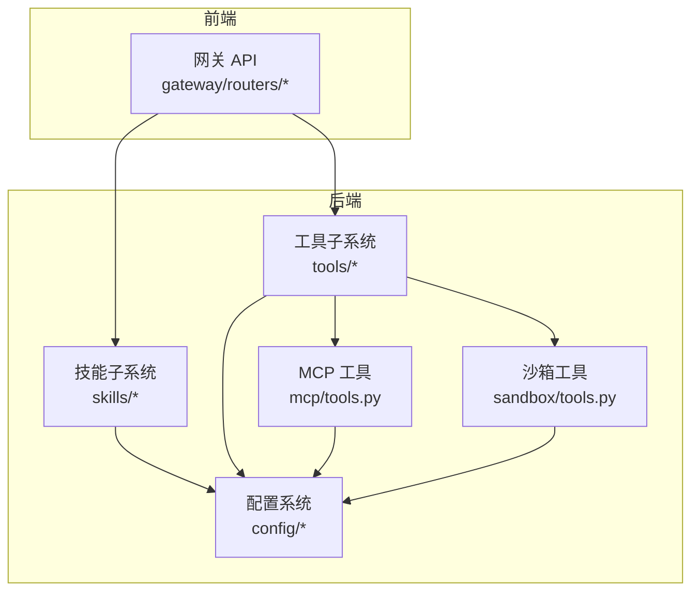
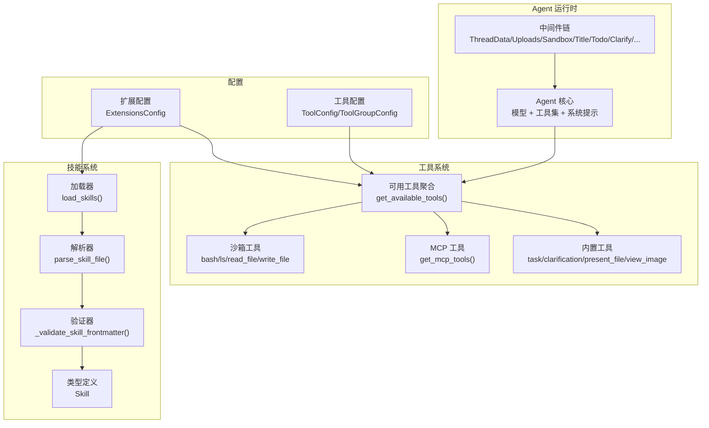
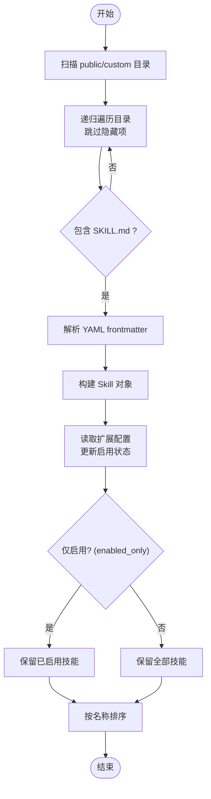
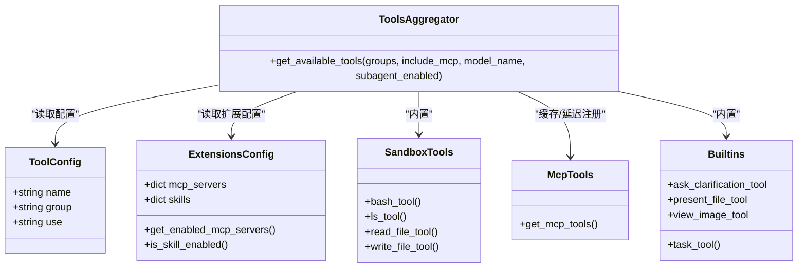
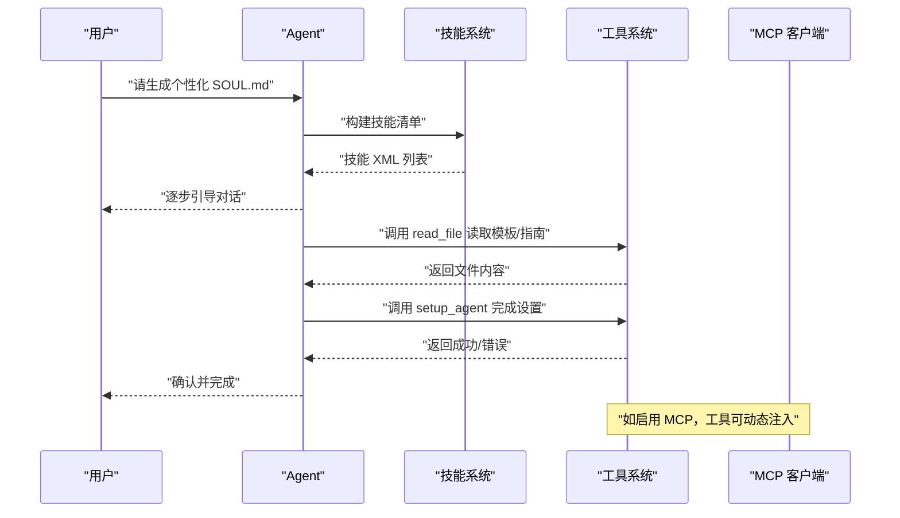
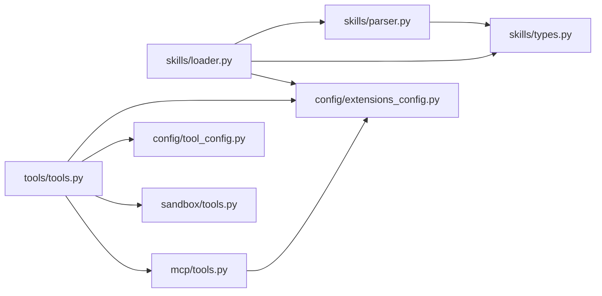

# 技能与工具系统

<cite>
**本文引用的文件**   
- [backend/packages/harness/deerflow/skills/__init__.py](file://backend/packages/harness/deerflow/skills/__init__.py)
- [backend/packages/harness/deerflow/skills/loader.py](file://backend/packages/harness/deerflow/skills/loader.py)
- [backend/packages/harness/deerflow/skills/parser.py](file://backend/packages/harness/deerflow/skills/parser.py)
- [backend/packages/harness/deerflow/skills/validation.py](file://backend/packages/harness/deerflow/skills/validation.py)
- [backend/packages/harness/deerflow/skills/types.py](file://backend/packages/harness/deerflow/skills/types.py)
- [backend/packages/harness/deerflow/tools/__init__.py](file://backend/packages/harness/deerflow/tools/__init__.py)
- [backend/packages/harness/deerflow/tools/tools.py](file://backend/packages/harness/deerflow/tools/tools.py)
- [backend/packages/harness/deerflow/tools/builtins/__init__.py](file://backend/packages/harness/deerflow/tools/builtins/__init__.py)
- [backend/packages/harness/deerflow/tools/builtins/task_tool.py](file://backend/packages/harness/deerflow/tools/builtins/task_tool.py)
- [backend/packages/harness/deerflow/mcp/tools.py](file://backend/packages/harness/deerflow/mcp/tools.py)
- [backend/packages/harness/deerflow/sandbox/tools.py](file://backend/packages/harness/deerflow/sandbox/tools.py)
- [backend/packages/harness/deerflow/config/tool_config.py](file://backend/packages/harness/deerflow/config/tool_config.py)
- [backend/packages/harness/deerflow/config/extensions_config.py](file://backend/packages/harness/deerflow/config/extensions_config.py)
- [backend/docs/ARCHITECTURE.md](file://backend/docs/ARCHITECTURE.md)
- [backend/agents/lead_agent/prompt.py](file://backend/agents/lead_agent/prompt.py)
- [skills/public/bootstrap/SKILL.md](file://skills/public/bootstrap/SKILL.md)
- [backend/tests/test_skills_loader.py](file://backend/tests/test_skills_loader.py)
</cite>

## 目录
1. [引言](#引言)
2. [项目结构](#项目结构)
3. [核心组件](#核心组件)
4. [架构总览](#架构总览)
5. [详细组件分析](#详细组件分析)
6. [依赖分析](#依赖分析)
7. [性能考虑](#性能考虑)
8. [故障排查指南](#故障排查指南)
9. [结论](#结论)
10. [附录](#附录)

## 引言
本文件面向 DeerFlow 的技能与工具系统，提供从架构到实现细节的完整技术文档。内容涵盖：
- 技能系统的发现、加载、验证与执行机制
- 工具系统的分类与实现：沙箱工具、内置工具、社区工具（MCP）、ACP 工具
- 技能与工具的协作关系及通过配置系统的灵活管理
- 自定义开发指南：技能格式规范、工具接口定义与最佳实践
- 可视化流程图与类图，帮助快速理解系统工作方式

## 项目结构
技能与工具系统主要分布在后端 harness 包中，前端通过网关 API 与后端交互。关键目录与文件如下：
- 技能系统：skills 子包负责解析、验证与加载 SKILL.md 元数据
- 工具系统：tools 子包负责聚合各类工具并按配置动态启用
- MCP 工具：通过多服务器客户端加载外部工具
- 沙箱工具：封装安全路径替换、命令执行与文件读写
- 配置系统：统一管理工具组、MCP 服务器与技能状态

**图表来源**
- [backend/docs/ARCHITECTURE.md:5-51](file://backend/docs/ARCHITECTURE.md#L5-L51)

**章节来源**
- [backend/docs/ARCHITECTURE.md:5-51](file://backend/docs/ARCHITECTURE.md#L5-L51)

## 核心组件
- 技能模块
  - 发现与加载：扫描 public/custom 目录，递归遍历并解析 SKILL.md
  - 解析：提取 YAML frontmatter，构建 Skill 数据类
  - 验证：校验 frontmatter 字段、命名规范与长度限制
  - 状态：结合扩展配置控制启用状态
- 工具模块
  - 聚合：从配置加载工具，按模型能力与运行时参数动态启用内置/子代理/MCP/ACP 工具
  - 安全：沙箱工具对路径访问与命令进行严格校验与虚拟路径替换
  - MCP：异步获取工具列表，注入 OAuth 头部，包装同步调用以适配流式客户端
- 配置模块
  - 统一扩展配置：MCP 服务器与技能状态
  - 工具配置：工具组与具体工具的提供者变量名

**章节来源**
- [backend/packages/harness/deerflow/skills/__init__.py:1-15](file://backend/packages/harness/deerflow/skills/__init__.py#L1-L15)
- [backend/packages/harness/deerflow/tools/__init__.py:1-4](file://backend/packages/harness/deerflow/tools/__init__.py#L1-L4)
- [backend/packages/harness/deerflow/config/extensions_config.py:55-68](file://backend/packages/harness/deerflow/config/extensions_config.py#L55-L68)
- [backend/packages/harness/deerflow/config/tool_config.py:11-21](file://backend/packages/harness/deerflow/config/tool_config.py#L11-L21)

## 架构总览
下图展示了技能与工具在整体系统中的位置与交互关系。

**图表来源**
- [backend/docs/ARCHITECTURE.md:96-127](file://backend/docs/ARCHITECTURE.md#L96-L127)
- [backend/packages/harness/deerflow/skills/loader.py:22-99](file://backend/packages/harness/deerflow/skills/loader.py#L22-L99)
- [backend/packages/harness/deerflow/skills/parser.py:7-66](file://backend/packages/harness/deerflow/skills/parser.py#L7-L66)
- [backend/packages/harness/deerflow/skills/validation.py:15-86](file://backend/packages/harness/deerflow/skills/validation.py#L15-L86)
- [backend/packages/harness/deerflow/skills/types.py:5-54](file://backend/packages/harness/deerflow/skills/types.py#L5-L54)
- [backend/packages/harness/deerflow/tools/tools.py:23-115](file://backend/packages/harness/deerflow/tools/tools.py#L23-L115)
- [backend/packages/harness/deerflow/mcp/tools.py:56-114](file://backend/packages/harness/deerflow/mcp/tools.py#L56-L114)
- [backend/packages/harness/deerflow/sandbox/tools.py:684-800](file://backend/packages/harness/deerflow/sandbox/tools.py#L684-L800)
- [backend/packages/harness/deerflow/config/extensions_config.py:119-200](file://backend/packages/harness/deerflow/config/extensions_config.py#L119-L200)
- [backend/packages/harness/deerflow/config/tool_config.py:11-21](file://backend/packages/harness/deerflow/config/tool_config.py#L11-L21)

## 详细组件分析

### 技能系统：发现、加载、验证与执行
- 发现与加载
  - 加载器会扫描 skills/public 与 skills/custom 两个类别，递归遍历目录，跳过隐藏目录，仅当存在 SKILL.md 时尝试解析
  - 通过扩展配置读取技能启用状态，并按名称排序返回
- 解析
  - 使用正则提取 YAML frontmatter，解析 name/description/license 等字段，构造 Skill 对象
- 验证
  - 校验 frontmatter 类型、键名白名单、必填项、命名规则与长度限制
- 执行
  - Agent 在系统提示中注入可用技能清单；用户可调用 read_file 等工具读取技能主文件与参考资源，遵循“渐进式加载”模式

**图表来源**
- [backend/packages/harness/deerflow/skills/loader.py:22-99](file://backend/packages/harness/deerflow/skills/loader.py#L22-L99)
- [backend/packages/harness/deerflow/skills/parser.py:7-66](file://backend/packages/harness/deerflow/skills/parser.py#L7-L66)
- [backend/packages/harness/deerflow/skills/validation.py:15-86](file://backend/packages/harness/deerflow/skills/validation.py#L15-L86)
- [backend/agents/lead_agent/prompt.py:387-413](file://backend/agents/lead_agent/prompt.py#L387-L413)

**章节来源**
- [backend/packages/harness/deerflow/skills/loader.py:22-99](file://backend/packages/harness/deerflow/skills/loader.py#L22-L99)
- [backend/packages/harness/deerflow/skills/parser.py:7-66](file://backend/packages/harness/deerflow/skills/parser.py#L7-L66)
- [backend/packages/harness/deerflow/skills/validation.py:15-86](file://backend/packages/harness/deerflow/skills/validation.py#L15-L86)
- [backend/agents/lead_agent/prompt.py:387-413](file://backend/agents/lead_agent/prompt.py#L387-L413)
- [backend/tests/test_skills_loader.py:30-64](file://backend/tests/test_skills_loader.py#L30-L64)

### 工具系统：分类与实现
- 沙箱工具
  - 提供 bash、ls、read_file、write_file 等，支持本地沙箱路径替换与命令安全校验
  - 严格限制对 /mnt/skills 与 /mnt/acp-workspace 的只读访问，防止路径穿越
- 内置工具
  - 包含任务委托工具 task_tool、澄清工具、文件呈现工具等
  - task_tool 支持通用与 Bash 子代理，后台异步执行并轮询结果，向前端发送事件
- 社区工具（MCP）
  - 基于多服务器 MCP 客户端动态加载工具，支持 SSE/HTTP/stdio 传输
  - 注入初始 OAuth 头部，包装异步工具为同步调用以适配流式客户端
- ACP 工具
  - 动态构建并注入，当配置中存在 ACP 代理时启用

**图表来源**
- [backend/packages/harness/deerflow/config/tool_config.py:11-21](file://backend/packages/harness/deerflow/config/tool_config.py#L11-L21)
- [backend/packages/harness/deerflow/config/extensions_config.py:55-68](file://backend/packages/harness/deerflow/config/extensions_config.py#L55-L68)
- [backend/packages/harness/deerflow/tools/tools.py:23-115](file://backend/packages/harness/deerflow/tools/tools.py#L23-L115)
- [backend/packages/harness/deerflow/sandbox/tools.py:684-800](file://backend/packages/harness/deerflow/sandbox/tools.py#L684-L800)
- [backend/packages/harness/deerflow/mcp/tools.py:56-114](file://backend/packages/harness/deerflow/mcp/tools.py#L56-L114)
- [backend/packages/harness/deerflow/tools/builtins/task_tool.py:21-196](file://backend/packages/harness/deerflow/tools/builtins/task_tool.py#L21-L196)

**章节来源**
- [backend/packages/harness/deerflow/sandbox/tools.py:368-536](file://backend/packages/harness/deerflow/sandbox/tools.py#L368-L536)
- [backend/packages/harness/deerflow/tools/builtins/task_tool.py:21-196](file://backend/packages/harness/deerflow/tools/builtins/task_tool.py#L21-L196)
- [backend/packages/harness/deerflow/mcp/tools.py:56-114](file://backend/packages/harness/deerflow/mcp/tools.py#L56-L114)
- [backend/packages/harness/deerflow/tools/tools.py:23-115](file://backend/packages/harness/deerflow/tools/tools.py#L23-L115)

### 技能与工具的协作关系
- Agent 在系统提示中注入可用技能清单，指导模型在合适时机调用 read_file 等工具读取技能主文件与参考资源
- 子代理工具 task_tool 可在执行过程中复用当前工具集，但禁用自身以避免嵌套
- MCP 工具可通过“延迟注册”与“工具搜索”在运行时动态暴露给模型

**图表来源**
- [backend/agents/lead_agent/prompt.py:387-413](file://backend/agents/lead_agent/prompt.py#L387-L413)
- [skills/public/bootstrap/SKILL.md:65-89](file://skills/public/bootstrap/SKILL.md#L65-L89)
- [backend/packages/harness/deerflow/tools/builtins/task_tool.py:98-117](file://backend/packages/harness/deerflow/tools/builtins/task_tool.py#L98-L117)
- [backend/packages/harness/deerflow/mcp/tools.py:56-114](file://backend/packages/harness/deerflow/mcp/tools.py#L56-L114)

**章节来源**
- [backend/agents/lead_agent/prompt.py:387-413](file://backend/agents/lead_agent/prompt.py#L387-L413)
- [skills/public/bootstrap/SKILL.md:65-89](file://skills/public/bootstrap/SKILL.md#L65-L89)

### 自定义开发指南

#### 开发自定义技能
- 目录结构
  - 在 skills/public 或 skills/custom 下创建以技能名为名的目录
  - 主文件为 SKILL.md，包含 YAML frontmatter 与工作流说明
- frontmatter 规范
  - 必填字段：name、description
  - 允许字段：license、allowed-tools、metadata、compatibility、version、author
  - 命名规则：小写字母、数字与短横线组合，不以短横线开头或结尾，不超过 64 字符
  - 描述规则：不含尖括号，不超过 1024 字符
- 示例参考
  - bootstrap 技能展示了模板、参考文件与生成流程的组织方式

**章节来源**
- [backend/packages/harness/deerflow/skills/validation.py:11-86](file://backend/packages/harness/deerflow/skills/validation.py#L11-L86)
- [skills/public/bootstrap/SKILL.md:1-89](file://skills/public/bootstrap/SKILL.md#L1-L89)

#### 开发自定义工具
- 工具接口定义
  - 使用装饰器声明工具函数，遵循参数顺序：runtime、description、其余业务参数
  - 返回字符串或结构化输出，错误通过统一异常处理与错误消息屏蔽
- 安全与路径
  - 沙箱工具对绝对路径进行校验，仅允许 /mnt/user-data、/mnt/skills（只读）与 /mnt/acp-workspace（只读）
  - 命令中禁止出现未授权的绝对路径，需使用虚拟路径并在本地沙箱中替换
- 集成到配置
  - 在工具配置中定义工具组与具体工具，指定 use 为提供者变量名（例如 deerflow.sandbox.tools:bash_tool）

**章节来源**
- [backend/packages/harness/deerflow/sandbox/tools.py:368-536](file://backend/packages/harness/deerflow/sandbox/tools.py#L368-L536)
- [backend/packages/harness/deerflow/config/tool_config.py:11-21](file://backend/packages/harness/deerflow/config/tool_config.py#L11-L21)

#### 最佳实践
- 技能
  - 将复杂流程拆分为多个阶段，逐步引导模型读取参考文件
  - 明确生成规则与调用工具的时机，避免直接写文件
- 工具
  - 优先使用沙箱工具的安全路径与命令校验
  - 对外暴露的 MCP 工具应具备清晰的描述与参数约束
  - 子代理工具仅在需要隔离上下文或执行长任务时启用

**章节来源**
- [skills/public/bootstrap/SKILL.md:65-89](file://skills/public/bootstrap/SKILL.md#L65-L89)
- [backend/packages/harness/deerflow/tools/builtins/task_tool.py:21-59](file://backend/packages/harness/deerflow/tools/builtins/task_tool.py#L21-L59)

## 依赖分析
- 技能系统
  - 依赖解析器与验证器，最终产出 Skill 数据类
  - 通过扩展配置控制启用状态，影响工具聚合结果
- 工具系统
  - 依赖配置系统与模型能力判断，动态启用内置/子代理/MCP/ACP 工具
  - MCP 工具依赖多服务器客户端与 OAuth 拦截器

**图表来源**
- [backend/packages/harness/deerflow/skills/loader.py:22-99](file://backend/packages/harness/deerflow/skills/loader.py#L22-L99)
- [backend/packages/harness/deerflow/skills/parser.py:7-66](file://backend/packages/harness/deerflow/skills/parser.py#L7-L66)
- [backend/packages/harness/deerflow/skills/types.py:5-54](file://backend/packages/harness/deerflow/skills/types.py#L5-L54)
- [backend/packages/harness/deerflow/tools/tools.py:23-115](file://backend/packages/harness/deerflow/tools/tools.py#L23-L115)
- [backend/packages/harness/deerflow/config/extensions_config.py:55-68](file://backend/packages/harness/deerflow/config/extensions_config.py#L55-L68)
- [backend/packages/harness/deerflow/config/tool_config.py:11-21](file://backend/packages/harness/deerflow/config/tool_config.py#L11-L21)
- [backend/packages/harness/deerflow/mcp/tools.py:56-114](file://backend/packages/harness/deerflow/mcp/tools.py#L56-L114)
- [backend/packages/harness/deerflow/sandbox/tools.py:684-800](file://backend/packages/harness/deerflow/sandbox/tools.py#L684-L800)

**章节来源**
- [backend/packages/harness/deerflow/skills/loader.py:22-99](file://backend/packages/harness/deerflow/skills/loader.py#L22-L99)
- [backend/packages/harness/deerflow/tools/tools.py:23-115](file://backend/packages/harness/deerflow/tools/tools.py#L23-L115)

## 性能考虑
- 技能加载
  - 递归遍历目录时跳过隐藏目录，减少无效扫描
  - 启用状态读取采用最新磁盘配置，避免进程间状态不同步
- 工具聚合
  - MCP 工具通过缓存与延迟注册降低初始化开销
  - 同步包装器在异步环境中使用全局线程池，避免嵌套事件循环问题
- 沙箱工具
  - 路径替换与命令校验在本地沙箱中进行，减少不必要的 I/O

[本节为通用性能建议，无需特定文件引用]

## 故障排查指南
- 技能相关
  - frontmatter 缺失或格式错误：检查 YAML 三短划线与键值格式
  - 命名不符合 hyphen-case：修正为小写、数字与短横线组合
  - 描述包含非法字符或超长：移除尖括号并缩短描述
- 工具相关
  - 路径访问被拒绝：确认使用 /mnt/user-data 或只读路径
  - 命令包含未授权绝对路径：改用虚拟路径或在本地沙箱中替换
  - MCP 工具不可用：检查 MCP 客户端安装与服务器配置
- 配置相关
  - 扩展配置文件路径：支持参数、环境变量与默认路径解析
  - 工具组与提供者变量名：确保 use 指向正确的提供者变量名

**章节来源**
- [backend/packages/harness/deerflow/skills/validation.py:15-86](file://backend/packages/harness/deerflow/skills/validation.py#L15-L86)
- [backend/packages/harness/deerflow/sandbox/tools.py:368-536](file://backend/packages/harness/deerflow/sandbox/tools.py#L368-L536)
- [backend/packages/harness/deerflow/mcp/tools.py:56-114](file://backend/packages/harness/deerflow/mcp/tools.py#L56-L114)
- [backend/packages/harness/deerflow/config/extensions_config.py:86-145](file://backend/packages/harness/deerflow/config/extensions_config.py#L86-L145)
- [backend/packages/harness/deerflow/config/tool_config.py:11-21](file://backend/packages/harness/deerflow/config/tool_config.py#L11-L21)

## 结论
DeerFlow 的技能与工具系统通过“渐进式加载 + 安全沙箱 + 动态工具聚合”的设计，在保证安全性的同时提供了强大的可扩展性。技能系统以 SKILL.md 为核心，配合严格的验证与启用控制；工具系统通过配置与扩展配置实现灵活管理，支持内置、沙箱、MCP 与 ACP 工具的协同工作。开发者可依据本文档的规范与最佳实践，快速开发高质量的自定义技能与工具。

[本节为总结性内容，无需特定文件引用]

## 附录

### 技能格式规范摘要
- 文件：SKILL.md
- 必填字段：name、description
- 允许字段：license、allowed-tools、metadata、compatibility、version、author
- 命名规则：hyphen-case，长度 ≤ 64，不含连续短横线
- 描述规则：不含尖括号，长度 ≤ 1024

**章节来源**
- [backend/packages/harness/deerflow/skills/validation.py:11-86](file://backend/packages/harness/deerflow/skills/validation.py#L11-L86)

### 工具接口定义摘要
- 参数顺序：runtime、description、其余业务参数
- 返回：字符串或结构化输出
- 安全：路径校验、命令过滤、只读策略

**章节来源**
- [backend/packages/harness/deerflow/sandbox/tools.py:368-536](file://backend/packages/harness/deerflow/sandbox/tools.py#L368-L536)