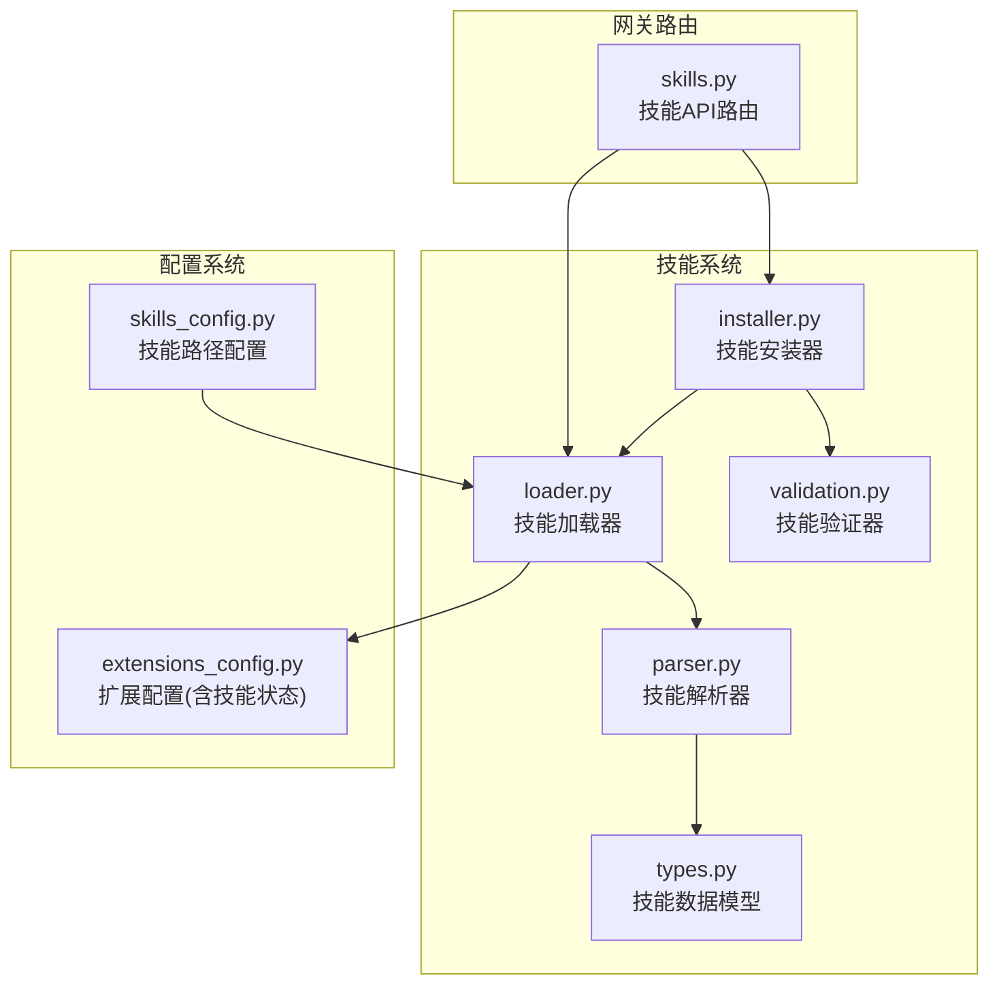
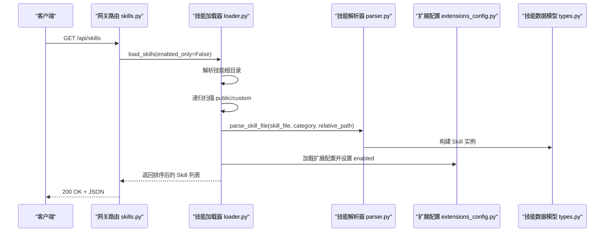
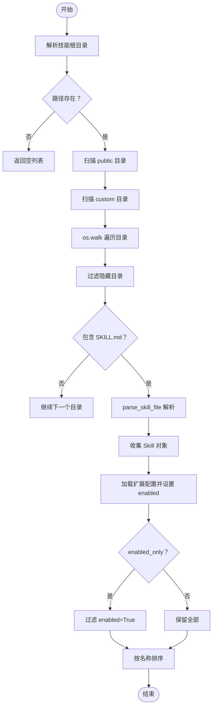
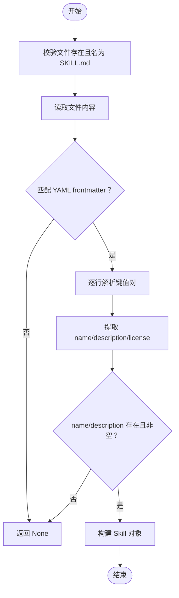
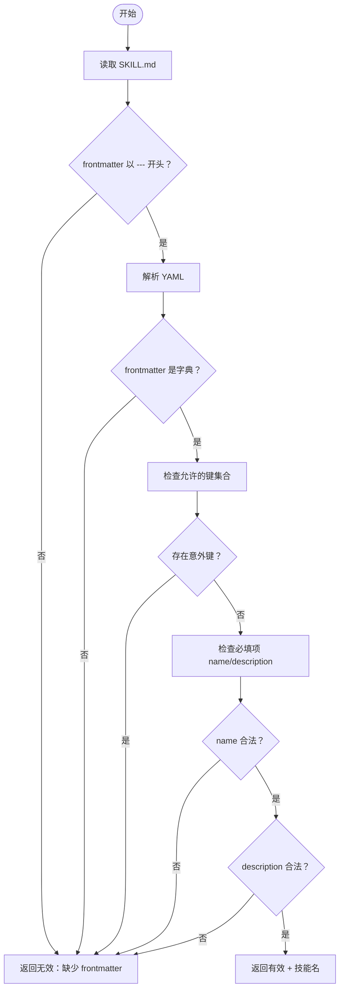
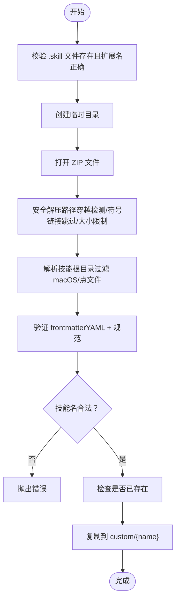
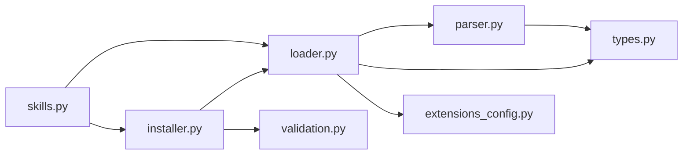

# 技能加载器与解析器

<cite>
**本文档引用的文件**
- [loader.py](file://backend/packages/harness/deerflow/skills/loader.py)
- [parser.py](file://backend/packages/harness/deerflow/skills/parser.py)
- [validation.py](file://backend/packages/harness/deerflow/skills/validation.py)
- [types.py](file://backend/packages/harness/deerflow/skills/types.py)
- [installer.py](file://backend/packages/harness/deerflow/skills/installer.py)
- [skills_config.py](file://backend/packages/harness/deerflow/config/skills_config.py)
- [extensions_config.py](file://backend/packages/harness/deerflow/config/extensions_config.py)
- [skills.py](file://backend/app/gateway/routers/skills.py)
- [test_skills_loader.py](file://backend/tests/test_skills_loader.py)
- [test_skills_parser.py](file://backend/tests/test_skills_parser.py)
- [test_skills_installer.py](file://backend/tests/test_skills_installer.py)
- [bootstrap/SKILL.md](file://skills/public/bootstrap/SKILL.md)
- [chart-visualization/SKILL.md](file://skills/public/chart-visualization/SKILL.md)
</cite>

## 目录
1. [简介](#简介)
2. [项目结构](#项目结构)
3. [核心组件](#核心组件)
4. [架构总览](#架构总览)
5. [详细组件分析](#详细组件分析)
6. [依赖分析](#依赖分析)
7. [性能考虑](#性能考虑)
8. [故障排查指南](#故障排查指南)
9. [结论](#结论)
10. [附录](#附录)

## 简介
本文件面向技能系统的技术文档，聚焦“技能加载器”与“技能解析器”的实现原理与使用方法。内容涵盖：
- 技能加载器：递归扫描 skills/{public,custom} 目录、SKILL.md 文件发现机制与路径解析逻辑
- 技能解析器：YAML 前言（frontmatter）解析、工具提取、依赖分析与元数据构建
- 技能验证器：安全检查机制（权限验证、依赖检查、配置验证）
- 错误处理、调试技巧与性能优化建议
- 具体代码示例路径与最佳实践

## 项目结构
技能系统位于后端包 deerflow 的 skills 子模块中，配合配置模块与网关路由共同工作：
- skills 模块：loader、parser、validation、types、installer
- config 模块：skills_config、extensions_config
- gateway 路由：skills.py 提供 API 接口
- 测试用例：覆盖加载、解析、安装等场景

图表来源
- [loader.py:1-99](file://backend/packages/harness/deerflow/skills/loader.py#L1-L99)
- [parser.py:1-66](file://backend/packages/harness/deerflow/skills/parser.py#L1-L66)
- [validation.py:1-86](file://backend/packages/harness/deerflow/skills/validation.py#L1-L86)
- [types.py:1-54](file://backend/packages/harness/deerflow/skills/types.py#L1-L54)
- [installer.py:1-177](file://backend/packages/harness/deerflow/skills/installer.py#L1-L177)
- [skills_config.py:1-50](file://backend/packages/harness/deerflow/config/skills_config.py#L1-L50)
- [extensions_config.py:1-259](file://backend/packages/harness/deerflow/config/extensions_config.py#L1-L259)
- [skills.py:1-174](file://backend/app/gateway/routers/skills.py#L1-L174)

章节来源
- [loader.py:1-99](file://backend/packages/harness/deerflow/skills/loader.py#L1-L99)
- [parser.py:1-66](file://backend/packages/harness/deerflow/skills/parser.py#L1-L66)
- [validation.py:1-86](file://backend/packages/harness/deerflow/skills/validation.py#L1-L86)
- [types.py:1-54](file://backend/packages/harness/deerflow/skills/types.py#L1-L54)
- [installer.py:1-177](file://backend/packages/harness/deerflow/skills/installer.py#L1-L177)
- [skills_config.py:1-50](file://backend/packages/harness/deerflow/config/skills_config.py#L1-L50)
- [extensions_config.py:1-259](file://backend/packages/harness/deerflow/config/extensions_config.py#L1-L259)
- [skills.py:1-174](file://backend/app/gateway/routers/skills.py#L1-L174)

## 核心组件
- 技能加载器（loader.py）：负责定位技能根目录、递归扫描 public/custom 目录、发现 SKILL.md 并调用解析器生成 Skill 对象，最后结合扩展配置更新启用状态。
- 技能解析器（parser.py）：从 SKILL.md 中提取 YAML frontmatter，构建 Skill 数据类实例。
- 技能验证器（validation.py）：对 SKILL.md frontmatter 进行纯逻辑校验（属性名、类型、命名规范、长度限制等）。
- 技能安装器（installer.py）：安全解压 .skill 归档、校验 frontmatter、避免路径穿越与符号链接风险，并复制到 custom 目录。
- 技能数据模型（types.py）：定义 Skill 结构，包含名称、描述、许可证、路径、分类与启用状态等字段。
- 配置模块：
  - skills_config.py：提供技能目录路径解析与容器内路径计算
  - extensions_config.py：统一管理 MCP 服务器与技能状态配置，支持从文件加载、环境变量替换、启用状态查询

章节来源
- [loader.py:22-99](file://backend/packages/harness/deerflow/skills/loader.py#L22-L99)
- [parser.py:7-66](file://backend/packages/harness/deerflow/skills/parser.py#L7-L66)
- [validation.py:15-86](file://backend/packages/harness/deerflow/skills/validation.py#L15-L86)
- [installer.py:110-177](file://backend/packages/harness/deerflow/skills/installer.py#L110-L177)
- [types.py:5-54](file://backend/packages/harness/deerflow/skills/types.py#L5-L54)
- [skills_config.py:6-50](file://backend/packages/harness/deerflow/config/skills_config.py#L6-L50)
- [extensions_config.py:55-200](file://backend/packages/harness/deerflow/config/extensions_config.py#L55-L200)

## 架构总览
技能系统通过“加载-解析-验证-安装-路由”的链路协同工作，形成可扩展、可配置且安全的技能生态。

图表来源
- [skills.py:72-78](file://backend/app/gateway/routers/skills.py#L72-L78)
- [loader.py:22-99](file://backend/packages/harness/deerflow/skills/loader.py#L22-L99)
- [parser.py:7-66](file://backend/packages/harness/deerflow/skills/parser.py#L7-L66)
- [extensions_config.py:119-144](file://backend/packages/harness/deerflow/config/extensions_config.py#L119-L144)

## 详细组件分析

### 技能加载器（loader.py）
职责与流程：
- 获取技能根目录：默认基于相对路径推导，也可通过配置覆盖
- 递归扫描：遍历 public 与 custom 两类目录，遵循 followlinks，跳过隐藏目录
- 发现与解析：仅当目录包含 SKILL.md 时才解析，使用解析器生成 Skill 对象
- 启用状态：读取扩展配置文件（extensions_config.json），按技能名与分类设置 enabled
- 过滤与排序：可按 enabled_only 过滤，最终按名称排序返回

关键点：
- 路径解析：使用 os.walk 并对子目录列表进行排序，确保遍历顺序稳定；同时过滤隐藏目录
- 配置优先级：优先使用配置中的路径，失败则回退到默认根目录
- 启用状态：采用“最新配置读取”策略，保证外部进程修改后即时生效

图表来源
- [loader.py:22-99](file://backend/packages/harness/deerflow/skills/loader.py#L22-L99)
- [parser.py:7-66](file://backend/packages/harness/deerflow/skills/parser.py#L7-L66)
- [extensions_config.py:119-144](file://backend/packages/harness/deerflow/config/extensions_config.py#L119-L144)

章节来源
- [loader.py:22-99](file://backend/packages/harness/deerflow/skills/loader.py#L22-L99)
- [test_skills_loader.py:22-65](file://backend/tests/test_skills_loader.py#L22-L65)

### 技能解析器（parser.py）
职责与流程：
- 输入：SKILL.md 文件路径、分类（public 或 custom）、相对路径
- 步骤：读取文件内容，匹配 YAML frontmatter（三短横线包裹），逐行解析键值对
- 输出：若 name 与 description 存在且非空，则构造 Skill 对象；否则返回 None

注意：
- frontmatter 必须包含 name 与 description
- license 为可选字段
- 相对路径可显式传入，否则默认为当前目录名

图表来源
- [parser.py:7-66](file://backend/packages/harness/deerflow/skills/parser.py#L7-L66)
- [types.py:5-54](file://backend/packages/harness/deerflow/skills/types.py#L5-L54)

章节来源
- [parser.py:7-66](file://backend/packages/harness/deerflow/skills/parser.py#L7-L66)
- [test_skills_parser.py:15-99](file://backend/tests/test_skills_parser.py#L15-L99)

### 技能验证器（validation.py）
职责与流程：
- 输入：技能目录路径
- 步骤：读取 SKILL.md，确认 frontmatter 以三短横线开头，使用 YAML 解析
- 校验规则：
  - 允许的属性集合（name、description、license、allowed-tools、metadata、compatibility、version、author）
  - 必填项：name、description
  - name 规范：小写字母、数字、连字符，不以连字符开头或结尾，不允许连续连字符，长度不超过 64
  - description 规范：字符串，不含尖括号，长度不超过 1024
- 输出：返回是否有效、消息与技能名

图表来源
- [validation.py:15-86](file://backend/packages/harness/deerflow/skills/validation.py#L15-L86)

章节来源
- [validation.py:15-86](file://backend/packages/harness/deerflow/skills/validation.py#L15-L86)

### 技能安装器（installer.py）
职责与流程：
- 安全解压：拒绝绝对路径与目录穿越（..），跳过符号链接，限制总解压大小（zip bomb 防护）
- 归档解析：从临时目录中定位技能根目录（过滤 macOS 元数据与点文件）
- 校验与安装：调用验证器校验 frontmatter，检查技能名合法性，复制到 custom/{name} 目录
- 错误处理：文件不存在、扩展名不符、BadZip、frontmatter 无效、重复安装等

图表来源
- [installer.py:110-177](file://backend/packages/harness/deerflow/skills/installer.py#L110-L177)
- [validation.py:15-86](file://backend/packages/harness/deerflow/skills/validation.py#L15-L86)

章节来源
- [installer.py:110-177](file://backend/packages/harness/deerflow/skills/installer.py#L110-L177)
- [test_skills_installer.py:167-224](file://backend/tests/test_skills_installer.py#L167-L224)

### 技能数据模型（types.py）
- 字段：name、description、license、skill_dir、skill_file、relative_path、category、enabled
- 方法：
  - skill_path：相对路径（从 category 根到技能目录）
  - get_container_path/get_container_file_path：计算容器内挂载路径
- 用途：作为加载器与解析器的统一数据载体，贯穿后续工具链与网关响应

章节来源
- [types.py:5-54](file://backend/packages/harness/deerflow/skills/types.py#L5-L54)

### 配置系统
- skills_config.py：提供 get_skills_path 与容器内路径计算，支持相对/绝对路径解析
- extensions_config.py：统一管理 MCP 服务器与技能状态配置，支持多级配置文件查找、环境变量替换、启用状态查询

章节来源
- [skills_config.py:6-50](file://backend/packages/harness/deerflow/config/skills_config.py#L6-L50)
- [extensions_config.py:55-200](file://backend/packages/harness/deerflow/config/extensions_config.py#L55-L200)

## 依赖分析
- 组件耦合关系
  - loader 依赖 parser 与 types，间接依赖 extensions_config
  - parser 依赖 types
  - installer 依赖 loader（获取默认根目录）、validation（frontmatter 校验）
  - router 依赖 loader 与 installer，用于 API 调用
- 外部依赖
  - Python 标准库：os、pathlib、re、yaml、zipfile、shutil、tempfile、logging
  - Pydantic：配置模型序列化与反序列化

图表来源
- [loader.py:1-99](file://backend/packages/harness/deerflow/skills/loader.py#L1-L99)
- [parser.py:1-66](file://backend/packages/harness/deerflow/skills/parser.py#L1-L66)
- [installer.py:1-177](file://backend/packages/harness/deerflow/skills/installer.py#L1-L177)
- [skills.py:1-174](file://backend/app/gateway/routers/skills.py#L1-L174)

章节来源
- [loader.py:1-99](file://backend/packages/harness/deerflow/skills/loader.py#L1-L99)
- [parser.py:1-66](file://backend/packages/harness/deerflow/skills/parser.py#L1-L66)
- [installer.py:1-177](file://backend/packages/harness/deerflow/skills/installer.py#L1-L177)
- [skills.py:1-174](file://backend/app/gateway/routers/skills.py#L1-L174)

## 性能考虑
- 遍历稳定性：使用 os.walk 并对子目录排序，避免不可预测的遍历顺序
- I/O 优化：仅在发现 SKILL.md 时才读取文件；frontmatter 解析为简单正则与逐行扫描，复杂度 O(n)
- 配置读取：加载器使用“最新配置读取”策略，避免缓存导致的状态延迟
- 安装防护：安全解压阶段限制总写入量，防止 zip bomb 攻击
- 排序成本：最终按名称排序，时间复杂度 O(n log n)，通常技能数量有限，影响可忽略

## 故障排查指南
常见问题与定位思路：
- 加载不到技能
  - 检查技能根目录是否存在与可访问
  - 确认 public/custom 目录下每个技能目录包含 SKILL.md
  - 使用 enabled_only 参数区分是否仅显示启用技能
- 解析失败
  - frontmatter 缺失或格式不正确
  - name/description 为空或缺失
  - frontmatter 中出现未允许的键
- 安装失败
  - .skill 文件扩展名错误或不是有效 ZIP
  - 归档包含绝对路径或目录穿越尝试
  - 符号链接被跳过但可能影响脚本执行
  - 技能名非法或已存在
- 启用状态异常
  - 扩展配置文件未找到或格式错误
  - 配置未及时刷新（加载器采用“最新配置读取”，网关更新后会重新加载）

调试技巧：
- 在加载器中打印中间结果（如遍历路径、解析前的 frontmatter 文本）
- 使用测试用例作为参考，构造最小化复现场景
- 通过网关路由接口验证加载与更新流程

章节来源
- [loader.py:46-53](file://backend/packages/harness/deerflow/skills/loader.py#L46-L53)
- [parser.py:18-19](file://backend/packages/harness/deerflow/skills/parser.py#L18-L19)
- [validation.py:24-35](file://backend/packages/harness/deerflow/skills/validation.py#L24-L35)
- [installer.py:132-137](file://backend/packages/harness/deerflow/skills/installer.py#L132-L137)
- [extensions_config.py:119-144](file://backend/packages/harness/deerflow/config/extensions_config.py#L119-L144)

## 结论
技能加载器与解析器通过清晰的职责划分与严格的安全校验，实现了对技能目录的可靠扫描、对 SKILL.md 的稳健解析以及对安装归档的安全处理。结合扩展配置与容器路径计算，系统具备良好的可扩展性与可维护性。建议在生产环境中：
- 保持 SKILL.md frontmatter 的完整性与规范性
- 使用 .skill 归档进行安装，避免手工篡改
- 关注扩展配置文件的变更与权限
- 在大规模技能场景下关注遍历与排序的性能表现

## 附录

### 示例：加载与解析流程（代码片段路径）
- 加载技能：[loader.py:22-99](file://backend/packages/harness/deerflow/skills/loader.py#L22-L99)
- 解析 SKILL.md：[parser.py:7-66](file://backend/packages/harness/deerflow/skills/parser.py#L7-L66)
- 验证 frontmatter：[validation.py:15-86](file://backend/packages/harness/deerflow/skills/validation.py#L15-L86)
- 安装 .skill：[installer.py:110-177](file://backend/packages/harness/deerflow/skills/installer.py#L110-L177)
- 网关 API：[skills.py:72-174](file://backend/app/gateway/routers/skills.py#L72-L174)

### 示例：SKILL.md 参考
- bootstrap 示例：[bootstrap/SKILL.md:1-89](file://skills/public/bootstrap/SKILL.md#L1-L89)
- chart-visualization 示例：[chart-visualization/SKILL.md:1-73](file://skills/public/chart-visualization/SKILL.md#L1-L73)