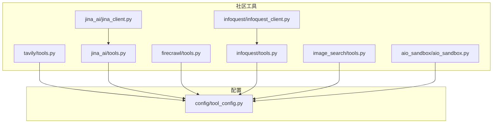
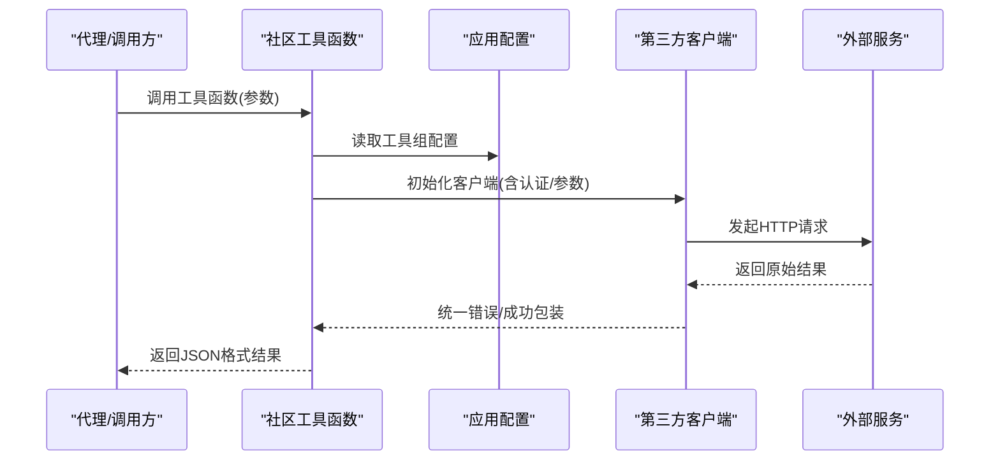
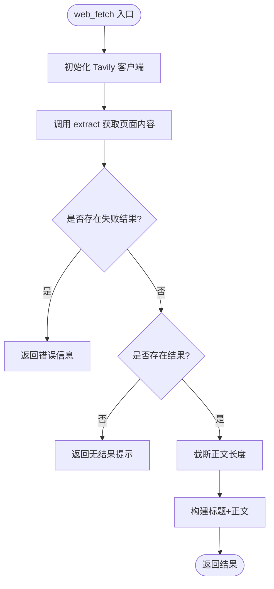
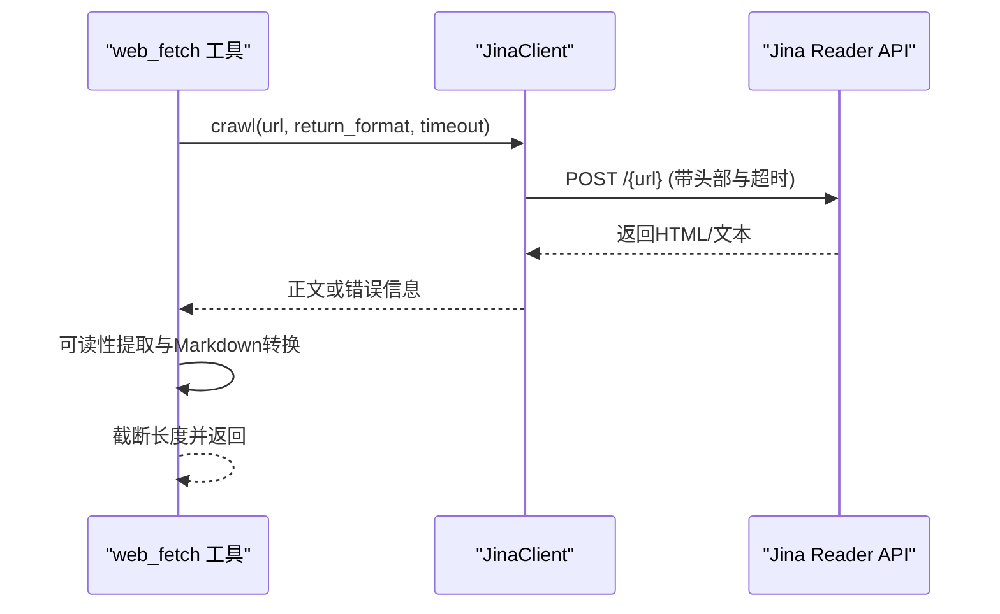
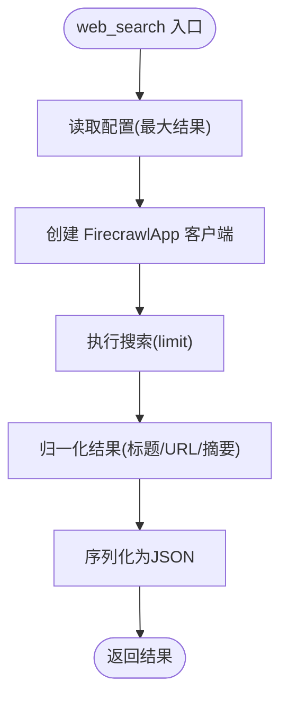
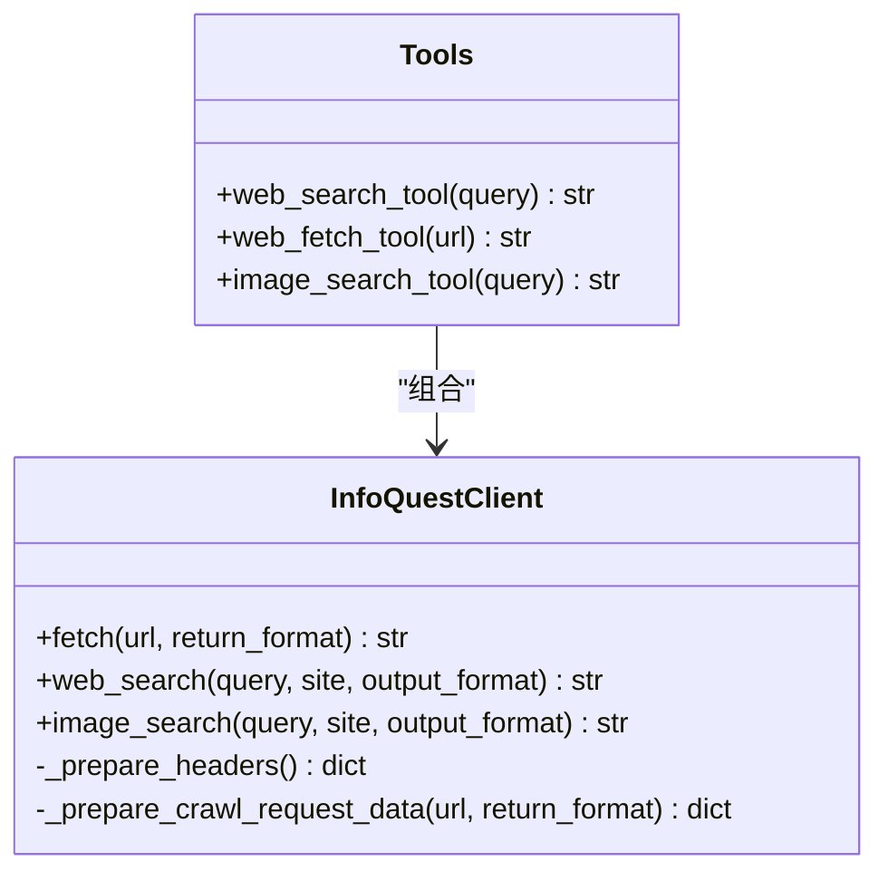
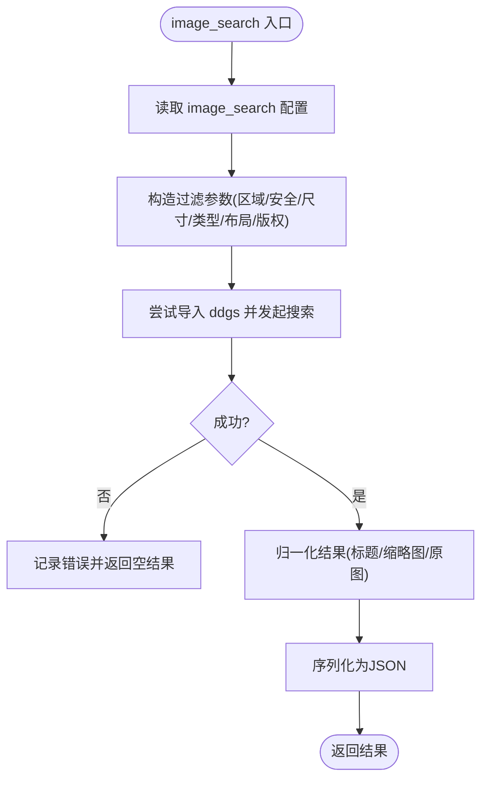
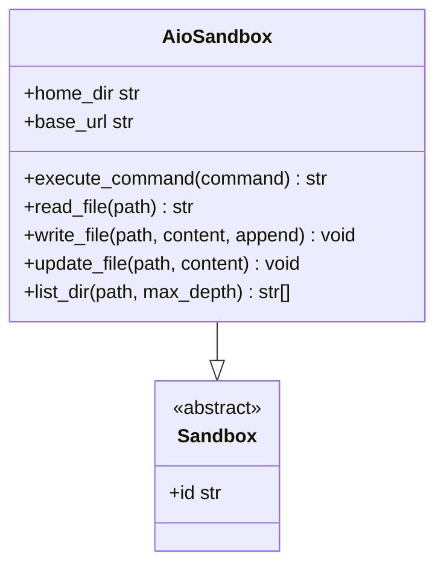
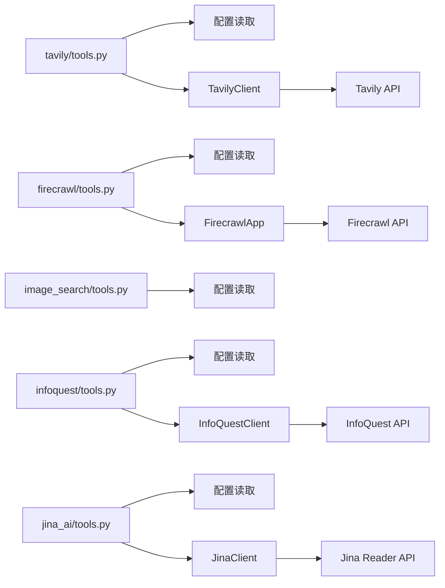

# 社区工具集成

<cite>
**本文引用的文件**
- [backend/packages/harness/deerflow/community/tavily/tools.py](file://backend/packages/harness/deerflow/community/tavily/tools.py)
- [backend/packages/harness/deerflow/community/jina_ai/tools.py](file://backend/packages/harness/deerflow/community/jina_ai/tools.py)
- [backend/packages/harness/deerflow/community/jina_ai/jina_client.py](file://backend/packages/harness/deerflow/community/jina_ai/jina_client.py)
- [backend/packages/harness/deerflow/community/firecrawl/tools.py](file://backend/packages/harness/deerflow/community/firecrawl/tools.py)
- [backend/packages/harness/deerflow/community/infoquest/tools.py](file://backend/packages/harness/deerflow/community/infoquest/tools.py)
- [backend/packages/harness/deerflow/community/infoquest/infoquest_client.py](file://backend/packages/harness/deerflow/community/infoquest/infoquest_client.py)
- [backend/packages/harness/deerflow/community/image_search/tools.py](file://backend/packages/harness/deerflow/community/image_search/tools.py)
- [backend/packages/harness/deerflow/community/aio_sandbox/aio_sandbox.py](file://backend/packages/harness/deerflow/community/aio_sandbox/aio_sandbox.py)
- [backend/packages/harness/deerflow/config/tool_config.py](file://backend/packages/harness/deerflow/config/tool_config.py)
</cite>

## 目录
1. [引言](#引言)
2. [项目结构](#项目结构)
3. [核心组件](#核心组件)
4. [架构总览](#架构总览)
5. [详细组件分析](#详细组件分析)
6. [依赖分析](#依赖分析)
7. [性能考量](#性能考量)
8. [故障排查指南](#故障排查指南)
9. [结论](#结论)
10. [附录：扩展新社区工具集成](#附录扩展新社区工具集成)

## 引言
本文件面向开发者与运维人员，系统化梳理 Deer Flow 后端中“社区工具”的集成方式与实现原理，覆盖以下能力：
- 网络搜索工具：Tavily、Jina AI、Firecrawl、InfoQuest
- 网页抓取工具：Tavily、Jina AI、Firecrawl、InfoQuest
- 图像搜索工具：InfoQuest、本地 DuckDuckGo 集成
- AIO 沙箱工具：命令执行、文件读写、目录遍历等
- 工具配置模型与加载机制
- API 接口、认证机制、使用限制、错误处理、速率限制、性能优化与安全注意事项
- 扩展新社区工具的实践步骤

## 项目结构
社区工具主要位于后端包 deerflow 的 community 子模块下，按功能分组组织：
- tavily：网络搜索与网页抓取
- jina_ai：网页抓取（基于 Jina Reader）
- firecrawl：网络搜索与网页抓取
- infoquest：网络搜索、网页抓取、图像搜索
- image_search：本地 DuckDuckGo 图像搜索
- aio_sandbox：AIO 容器沙箱封装

图表来源
- [backend/packages/harness/deerflow/community/tavily/tools.py:1-63](file://backend/packages/harness/deerflow/community/tavily/tools.py#L1-L63)
- [backend/packages/harness/deerflow/community/jina_ai/tools.py:1-29](file://backend/packages/harness/deerflow/community/jina_ai/tools.py#L1-L29)
- [backend/packages/harness/deerflow/community/jina_ai/jina_client.py:1-39](file://backend/packages/harness/deerflow/community/jina_ai/jina_client.py#L1-L39)
- [backend/packages/harness/deerflow/community/firecrawl/tools.py:1-74](file://backend/packages/harness/deerflow/community/firecrawl/tools.py#L1-L74)
- [backend/packages/harness/deerflow/community/infoquest/tools.py:1-94](file://backend/packages/harness/deerflow/community/infoquest/tools.py#L1-L94)
- [backend/packages/harness/deerflow/community/infoquest/infoquest_client.py:1-405](file://backend/packages/harness/deerflow/community/infoquest/infoquest_client.py#L1-L405)
- [backend/packages/harness/deerflow/community/image_search/tools.py:1-136](file://backend/packages/harness/deerflow/community/image_search/tools.py#L1-L136)
- [backend/packages/harness/deerflow/config/tool_config.py:1-21](file://backend/packages/harness/deerflow/config/tool_config.py#L1-L21)

章节来源
- [backend/packages/harness/deerflow/community/tavily/tools.py:1-63](file://backend/packages/harness/deerflow/community/tavily/tools.py#L1-L63)
- [backend/packages/harness/deerflow/community/jina_ai/tools.py:1-29](file://backend/packages/harness/deerflow/community/jina_ai/tools.py#L1-L29)
- [backend/packages/harness/deerflow/community/jina_ai/jina_client.py:1-39](file://backend/packages/harness/deerflow/community/jina_ai/jina_client.py#L1-L39)
- [backend/packages/harness/deerflow/community/firecrawl/tools.py:1-74](file://backend/packages/harness/deerflow/community/firecrawl/tools.py#L1-L74)
- [backend/packages/harness/deerflow/community/infoquest/tools.py:1-94](file://backend/packages/harness/deerflow/community/infoquest/tools.py#L1-L94)
- [backend/packages/harness/deerflow/community/infoquest/infoquest_client.py:1-405](file://backend/packages/harness/deerflow/community/infoquest/infoquest_client.py#L1-L405)
- [backend/packages/harness/deerflow/community/image_search/tools.py:1-136](file://backend/packages/harness/deerflow/community/image_search/tools.py#L1-L136)
- [backend/packages/harness/deerflow/config/tool_config.py:1-21](file://backend/packages/harness/deerflow/config/tool_config.py#L1-L21)

## 核心组件
- 工具注册与包装：各工具通过装饰器注册为 LangChain 工具，统一对外暴露函数签名与文档字符串解析。
- 配置驱动：通过应用配置获取工具组配置，支持从配置中读取参数（如最大结果数、超时、时间范围等）。
- 客户端封装：对第三方服务进行客户端封装，集中处理认证、请求参数、错误返回与日志记录。
- 结果归一化：将不同服务的响应转换为统一的 JSON 结构，便于上层消费。

章节来源
- [backend/packages/harness/deerflow/community/tavily/tools.py:17-40](file://backend/packages/harness/deerflow/community/tavily/tools.py#L17-L40)
- [backend/packages/harness/deerflow/community/firecrawl/tools.py:17-46](file://backend/packages/harness/deerflow/community/firecrawl/tools.py#L17-L46)
- [backend/packages/harness/deerflow/community/infoquest/tools.py:46-55](file://backend/packages/harness/deerflow/community/infoquest/tools.py#L46-L55)
- [backend/packages/harness/deerflow/community/image_search/tools.py:77-135](file://backend/packages/harness/deerflow/community/image_search/tools.py#L77-L135)
- [backend/packages/harness/deerflow/config/tool_config.py:4-21](file://backend/packages/harness/deerflow/config/tool_config.py#L4-L21)

## 架构总览
社区工具的调用链路遵循“工具函数 → 配置读取 → 第三方客户端 → 归一化输出”的模式；网页抓取工具在抓取后通常经可读性提取器进行正文抽取与 Markdown 转换。

图表来源
- [backend/packages/harness/deerflow/community/tavily/tools.py:9-40](file://backend/packages/harness/deerflow/community/tavily/tools.py#L9-L40)
- [backend/packages/harness/deerflow/community/firecrawl/tools.py:9-74](file://backend/packages/harness/deerflow/community/firecrawl/tools.py#L9-L74)
- [backend/packages/harness/deerflow/community/infoquest/tools.py:11-55](file://backend/packages/harness/deerflow/community/infoquest/tools.py#L11-L55)
- [backend/packages/harness/deerflow/community/jina_ai/tools.py:21-28](file://backend/packages/harness/deerflow/community/jina_ai/tools.py#L21-L28)

## 详细组件分析

### Tavily 网络搜索与网页抓取
- 工具函数
  - web_search：接收查询词，返回标准化的结果列表（标题、URL、摘要）。
  - web_fetch：接收 URL，返回页面标题与正文片段（限制长度）。
- 配置参数
  - 来自工具组“web_search”的配置，支持读取最大结果数等参数。
- 认证机制
  - 使用 TavilyClient，API Key 来自配置项。
- 使用限制
  - 网页抓取工具明确要求仅使用直接提供的或搜索返回的精确 URL，且不支持需要登录的内容。
- 错误处理
  - 抓取失败时返回错误信息；无结果时返回提示。

图表来源
- [backend/packages/harness/deerflow/community/tavily/tools.py:43-62](file://backend/packages/harness/deerflow/community/tavily/tools.py#L43-L62)

章节来源
- [backend/packages/harness/deerflow/community/tavily/tools.py:9-63](file://backend/packages/harness/deerflow/community/tavily/tools.py#L9-L63)

### Jina AI 网页抓取
- 工具函数
  - web_fetch：接收 URL，抓取 HTML 内容并通过可读性提取器转为 Markdown。
- 配置参数
  - 支持从“web_fetch”配置读取超时参数。
- 认证机制
  - 通过环境变量设置 API Key；未设置时会记录警告并继续请求。
- 使用限制
  - 明确抓取需遵循 URL 规范与登录墙限制。
- 错误处理
  - 对非 200 响应、空响应、异常进行统一错误包装。

图表来源
- [backend/packages/harness/deerflow/community/jina_ai/tools.py:10-28](file://backend/packages/harness/deerflow/community/jina_ai/tools.py#L10-L28)
- [backend/packages/harness/deerflow/community/jina_ai/jina_client.py:9-39](file://backend/packages/harness/deerflow/community/jina_ai/jina_client.py#L9-L39)

章节来源
- [backend/packages/harness/deerflow/community/jina_ai/tools.py:1-29](file://backend/packages/harness/deerflow/community/jina_ai/tools.py#L1-L29)
- [backend/packages/harness/deerflow/community/jina_ai/jina_client.py:1-39](file://backend/packages/harness/deerflow/community/jina_ai/jina_client.py#L1-L39)

### Firecrawl 网络搜索与网页抓取
- 工具函数
  - web_search：支持限制最大结果数，返回标准化结果。
  - web_fetch：抓取页面为 Markdown，并包含标题。
- 配置参数
  - 来自“web_search”配置，支持读取 API Key 与最大结果数。
- 认证机制
  - 通过 FirecrawlApp 初始化客户端，API Key 来自配置。
- 使用限制
  - 抓取需遵循 URL 规范与登录墙限制。
- 错误处理
  - 对异常进行捕获并返回错误信息。

图表来源
- [backend/packages/harness/deerflow/community/firecrawl/tools.py:17-46](file://backend/packages/harness/deerflow/community/firecrawl/tools.py#L17-L46)

章节来源
- [backend/packages/harness/deerflow/community/firecrawl/tools.py:1-74](file://backend/packages/harness/deerflow/community/firecrawl/tools.py#L1-L74)

### InfoQuest 搜索与抓取
- 工具函数
  - web_search：调用 InfoQuestClient 执行网络搜索。
  - web_fetch：抓取页面内容，再经可读性提取器转为 Markdown。
  - image_search：执行图片搜索，返回图片链接列表。
- 配置参数
  - 来自“web_search/web_fetch/image_search”配置，支持搜索时间范围、抓取超时、导航超时、图片尺寸等。
- 认证机制
  - 通过环境变量设置 API Key；未设置时记录警告。
- 使用限制
  - 抓取需遵循 URL 规范与登录墙限制；图片搜索支持时间范围与尺寸过滤。
- 错误处理
  - 对非 200 响应、空响应、异常进行统一错误包装；对 JSON 字段缺失进行降级处理。

图表来源
- [backend/packages/harness/deerflow/community/infoquest/infoquest_client.py:17-405](file://backend/packages/harness/deerflow/community/infoquest/infoquest_client.py#L17-L405)
- [backend/packages/harness/deerflow/community/infoquest/tools.py:46-94](file://backend/packages/harness/deerflow/community/infoquest/tools.py#L46-L94)

章节来源
- [backend/packages/harness/deerflow/community/infoquest/tools.py:1-94](file://backend/packages/harness/deerflow/community/infoquest/tools.py#L1-L94)
- [backend/packages/harness/deerflow/community/infoquest/infoquest_client.py:1-405](file://backend/packages/harness/deerflow/community/infoquest/infoquest_client.py#L1-L405)

### 图像搜索工具（本地 DuckDuckGo）
- 工具函数
  - image_search：基于 DuckDuckGo 的 images 接口进行搜索，支持区域、安全搜索、尺寸、类型、布局、版权等过滤。
- 配置参数
  - 来自“image_search”配置，支持覆盖最大结果数。
- 认证机制
  - 本地库调用，无需外部 API Key。
- 使用限制
  - 依赖 ddgs 库安装；默认超时与过滤参数可配置。
- 错误处理
  - 导入失败与异常均记录日志并返回空结果。

图表来源
- [backend/packages/harness/deerflow/community/image_search/tools.py:15-136](file://backend/packages/harness/deerflow/community/image_search/tools.py#L15-L136)

章节来源
- [backend/packages/harness/deerflow/community/image_search/tools.py:1-136](file://backend/packages/harness/deerflow/community/image_search/tools.py#L1-L136)

### AIO 沙箱工具
- 能力概述
  - 命令执行、文件读写、目录遍历、上下文获取等。
- 认证与连接
  - 通过 HTTP API 连接运行中的 AIO 沙箱容器，内部使用客户端 SDK。
- 使用限制
  - 命令执行受限于容器权限与安全策略；文件操作需绝对路径。
- 错误处理
  - 对异常进行捕获并返回错误信息；读取空输出时返回占位符。

图表来源
- [backend/packages/harness/deerflow/community/aio_sandbox/aio_sandbox.py:11-129](file://backend/packages/harness/deerflow/community/aio_sandbox/aio_sandbox.py#L11-L129)

章节来源
- [backend/packages/harness/deerflow/community/aio_sandbox/aio_sandbox.py:1-129](file://backend/packages/harness/deerflow/community/aio_sandbox/aio_sandbox.py#L1-L129)

## 依赖分析
- 工具到配置：各工具通过配置读取模块读取工具组配置，实现参数化控制。
- 工具到客户端：Tavily/Firecrawl/InfoQuest/Jina 分别封装对应客户端，集中处理认证与请求细节。
- 工具到工具：网页抓取工具在抓取后通常经可读性提取器进行正文抽取与 Markdown 转换。
- 沙箱到外部：AIO 沙箱通过 HTTP API 与容器交互，内部使用第三方 SDK。

图表来源
- [backend/packages/harness/deerflow/community/tavily/tools.py:9-14](file://backend/packages/harness/deerflow/community/tavily/tools.py#L9-L14)
- [backend/packages/harness/deerflow/community/firecrawl/tools.py:9-14](file://backend/packages/harness/deerflow/community/firecrawl/tools.py#L9-L14)
- [backend/packages/harness/deerflow/community/infoquest/tools.py:11-43](file://backend/packages/harness/deerflow/community/infoquest/tools.py#L11-L43)
- [backend/packages/harness/deerflow/community/jina_ai/tools.py:21-27](file://backend/packages/harness/deerflow/community/jina_ai/tools.py#L21-L27)
- [backend/packages/harness/deerflow/config/tool_config.py:11-21](file://backend/packages/harness/deerflow/config/tool_config.py#L11-L21)

章节来源
- [backend/packages/harness/deerflow/config/tool_config.py:1-21](file://backend/packages/harness/deerflow/config/tool_config.py#L1-L21)

## 性能考量
- 结果数量控制：多数工具支持最大结果数配置，建议根据任务需求合理设置以降低网络与解析开销。
- 超时与重试：网页抓取工具支持超时参数；建议在高延迟网络环境下适当提高超时值。
- 输出截断：网页抓取与图像搜索工具对输出长度进行截断，避免大文本影响下游处理。
- 本地依赖：图像搜索依赖本地库，确保依赖安装完整，减少运行时导入失败带来的开销。
- 日志级别：InfoQuest 客户端在调试级别下打印大量请求细节，生产环境建议降低日志级别。

## 故障排查指南
- Tavily
  - 抓取失败：检查 API Key 是否正确；确认 URL 符合规范。
  - 无结果：调整查询词或增加最大结果数。
- Jina AI
  - 未设置 API Key：查看日志警告并配置环境变量以提升配额。
  - 非 200 响应/空响应：检查目标站点可达性与登录墙。
- Firecrawl
  - 异常捕获：查看返回的错误信息，确认 API Key 与查询参数。
- InfoQuest
  - 未设置 API Key：查看日志警告并配置环境变量。
  - JSON 字段缺失：客户端已做降级处理，若仍异常请检查网络与服务状态。
  - 时间范围与尺寸参数：超出有效范围会被忽略并记录警告。
- 图像搜索
  - 依赖缺失：安装所需库；查看日志错误信息。
  - 无结果：调整关键词或过滤条件。
- AIO 沙箱
  - 命令执行失败：检查容器状态与权限；查看错误信息。
  - 文件读写异常：确认路径与编码（二进制更新采用 base64 编码）。

章节来源
- [backend/packages/harness/deerflow/community/tavily/tools.py:43-62](file://backend/packages/harness/deerflow/community/tavily/tools.py#L43-L62)
- [backend/packages/harness/deerflow/community/jina_ai/jina_client.py:16-38](file://backend/packages/harness/deerflow/community/jina_ai/jina_client.py#L16-L38)
- [backend/packages/harness/deerflow/community/firecrawl/tools.py:45-73](file://backend/packages/harness/deerflow/community/firecrawl/tools.py#L45-L73)
- [backend/packages/harness/deerflow/community/infoquest/infoquest_client.py:117-123](file://backend/packages/harness/deerflow/community/infoquest/infoquest_client.py#L117-L123)
- [backend/packages/harness/deerflow/community/image_search/tools.py:43-74](file://backend/packages/harness/deerflow/community/image_search/tools.py#L43-L74)
- [backend/packages/harness/deerflow/community/aio_sandbox/aio_sandbox.py:51-57](file://backend/packages/harness/deerflow/community/aio_sandbox/aio_sandbox.py#L51-L57)

## 结论
社区工具集成通过“配置驱动 + 客户端封装 + 结果归一化”的模式，实现了多源服务的一致接入。开发者在扩展新工具时，应遵循现有模式：定义工具函数、读取配置、封装客户端、处理错误与日志，并保证输出结构的稳定性。对于网页抓取类工具，建议统一进行可读性提取与长度截断，以提升下游处理效率与一致性。

## 附录：扩展新社区工具集成
- 新增工具文件
  - 在 community 子模块下新建目录与 tools.py，定义工具函数并使用装饰器注册。
- 配置读取
  - 在工具中通过配置读取模块获取工具组配置，支持从配置中读取参数。
- 客户端封装
  - 封装第三方客户端，集中处理认证、请求参数、错误返回与日志记录。
- 结果归一化
  - 将不同服务的响应转换为统一的 JSON 结构，便于上层消费。
- 安全与限制
  - 明确 URL 规范、登录墙限制与速率限制；在工具文档中说明使用限制。
- 测试与验证
  - 提供最小可用示例与边界条件测试，确保错误处理与日志记录完备。

章节来源
- [backend/packages/harness/deerflow/config/tool_config.py:11-21](file://backend/packages/harness/deerflow/config/tool_config.py#L11-L21)
- [backend/packages/harness/deerflow/community/tavily/tools.py:9-40](file://backend/packages/harness/deerflow/community/tavily/tools.py#L9-L40)
- [backend/packages/harness/deerflow/community/firecrawl/tools.py:9-46](file://backend/packages/harness/deerflow/community/firecrawl/tools.py#L9-L46)
- [backend/packages/harness/deerflow/community/infoquest/tools.py:11-55](file://backend/packages/harness/deerflow/community/infoquest/tools.py#L11-L55)
- [backend/packages/harness/deerflow/community/jina_ai/tools.py:21-28](file://backend/packages/harness/deerflow/community/jina_ai/tools.py#L21-L28)
- [backend/packages/harness/deerflow/community/image_search/tools.py:102-135](file://backend/packages/harness/deerflow/community/image_search/tools.py#L102-L135)
- [backend/packages/harness/deerflow/community/aio_sandbox/aio_sandbox.py:17-57](file://backend/packages/harness/deerflow/community/aio_sandbox/aio_sandbox.py#L17-L57)