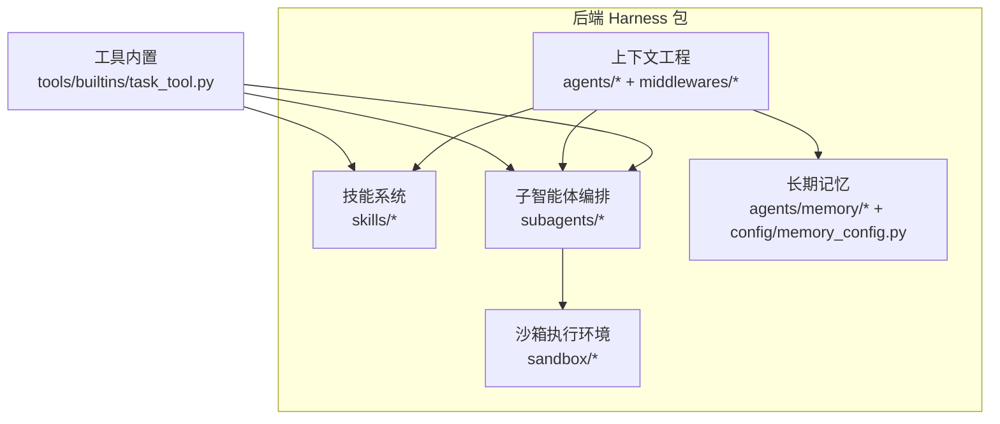
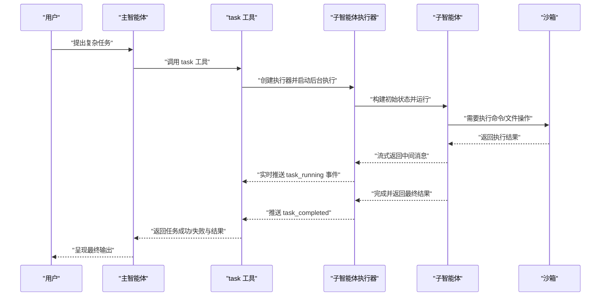
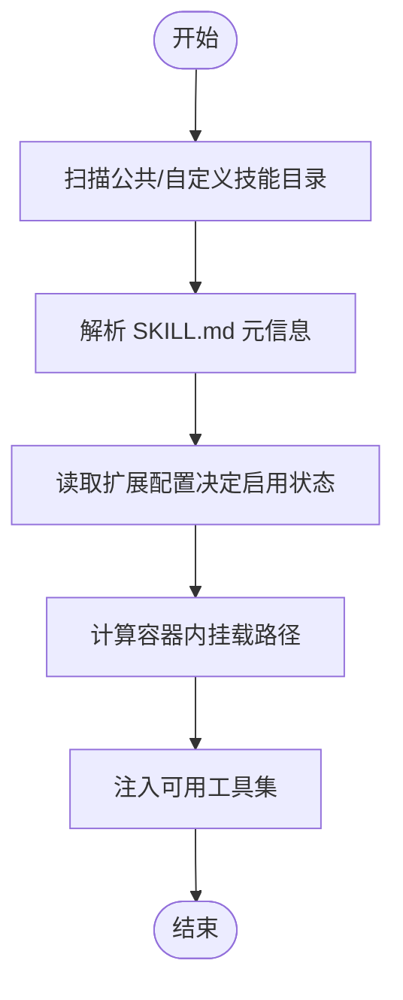
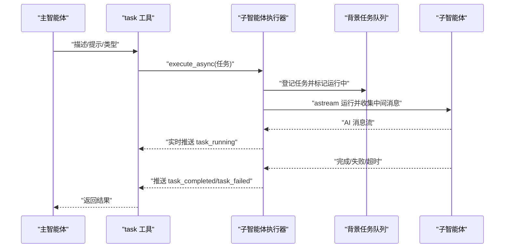
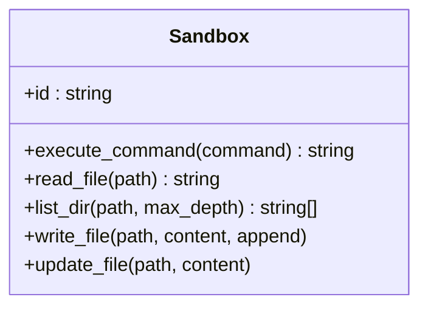
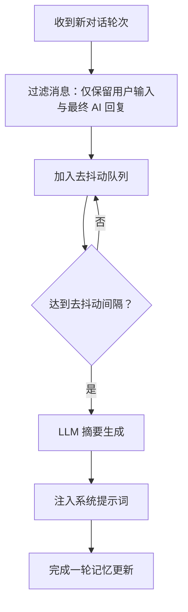
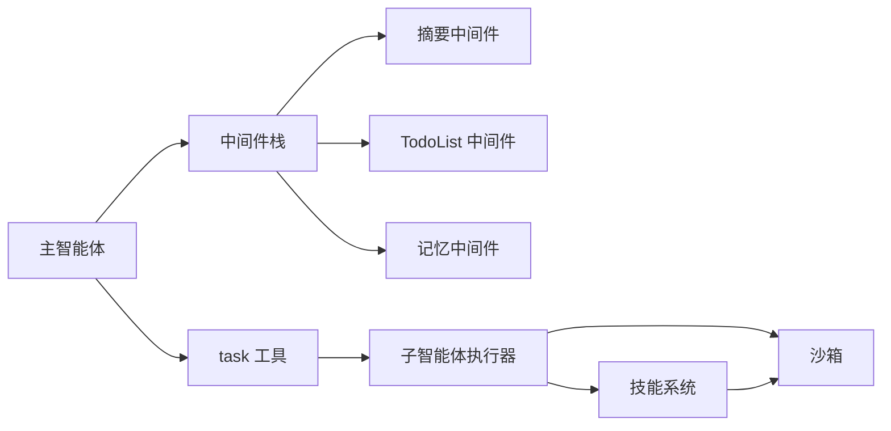

# 核心特性

<cite>
**本文引用的文件**
- [backend/packages/harness/deerflow/skills/__init__.py](file://backend/packages/harness/deerflow/skills/__init__.py)
- [backend/packages/harness/deerflow/skills/loader.py](file://backend/packages/harness/deerflow/skills/loader.py)
- [backend/packages/harness/deerflow/config/skills_config.py](file://backend/packages/harness/deerflow/config/skills_config.py)
- [backend/packages/harness/deerflow/subagents/__init__.py](file://backend/packages/harness/deerflow/subagents/__init__.py)
- [backend/packages/harness/deerflow/subagents/executor.py](file://backend/packages/harness/deerflow/subagents/executor.py)
- [backend/packages/harness/deerflow/config/subagents_config.py](file://backend/packages/harness/deerflow/config/subagents_config.py)
- [backend/packages/harness/deerflow/tools/builtins/task_tool.py](file://backend/packages/harness/deerflow/tools/builtins/task_tool.py)
- [backend/packages/harness/deerflow/sandbox/__init__.py](file://backend/packages/harness/deerflow/sandbox/__init__.py)
- [backend/packages/harness/deerflow/sandbox/sandbox.py](file://backend/packages/harness/deerflow/sandbox/sandbox.py)
- [backend/packages/harness/deerflow/config/sandbox_config.py](file://backend/packages/harness/deerflow/config/sandbox_config.py)
- [backend/packages/harness/deerflow/agents/lead_agent/agent.py](file://backend/packages/harness/deerflow/agents/lead_agent/agent.py)
- [backend/packages/harness/deerflow/agents/middlewares/memory_middleware.py](file://backend/packages/harness/deerflow/agents/middlewares/memory_middleware.py)
- [backend/packages/harness/deerflow/config/memory_config.py](file://backend/packages/harness/deerflow/config/memory_config.py)
- [backend/docs/README.md](file://backend/docs/README.md)
</cite>

## 目录
1. [引言](#引言)
2. [项目结构](#项目结构)
3. [核心组件](#核心组件)
4. [架构总览](#架构总览)
5. [详细组件分析](#详细组件分析)
6. [依赖分析](#依赖分析)
7. [性能考虑](#性能考虑)
8. [故障排查指南](#故障排查指南)
9. [结论](#结论)
10. [附录](#附录)

## 引言
本篇文档聚焦 DeerFlow 的五大核心特性：技能与工具系统、子智能体编排、沙箱执行环境、上下文工程（含计划模式与摘要）、长期记忆。我们将从技术实现原理、典型使用场景、优势特点与实际应用案例出发，系统阐述各特性如何协同工作，形成完整的智能体执行生态，并提供可操作的配置说明与参考路径，帮助读者快速理解并落地使用。

## 项目结构
DeerFlow 后端采用“Harness”包组织核心能力，前端通过 Next.js 提供交互界面。核心特性分布在以下模块：
- 技能与工具系统：技能解析、加载与启用控制，以及工具注册与分组
- 子智能体编排：子任务委派、并发限制、超时控制与结果回传
- 沙箱执行环境：抽象沙箱接口与容器化提供者配置
- 上下文工程：摘要中间件、计划模式（TodoList）、标题生成、图像注入等
- 长期记忆：消息过滤、去抖动队列、异步总结与注入

图示来源
- [backend/packages/harness/deerflow/skills/__init__.py:1-15](file://backend/packages/harness/deerflow/skills/__init__.py#L1-L15)
- [backend/packages/harness/deerflow/subagents/executor.py:1-517](file://backend/packages/harness/deerflow/subagents/executor.py#L1-L517)
- [backend/packages/harness/deerflow/sandbox/sandbox.py:1-73](file://backend/packages/harness/deerflow/sandbox/sandbox.py#L1-L73)
- [backend/packages/harness/deerflow/agents/lead_agent/agent.py:1-344](file://backend/packages/harness/deerflow/agents/lead_agent/agent.py#L1-L344)
- [backend/packages/harness/deerflow/agents/middlewares/memory_middleware.py:1-150](file://backend/packages/harness/deerflow/agents/middlewares/memory_middleware.py#L1-L150)

章节来源
- [backend/docs/README.md:1-54](file://backend/docs/README.md#L1-L54)

## 核心组件
- 技能与工具系统：负责技能目录扫描、元数据解析、启用状态管理与容器挂载路径计算；工具按模型能力与分组动态注入。
- 子智能体编排：通过内置 task 工具委派复杂任务到专用子智能体，支持并发限制、超时控制与实时流式回传。
- 沙箱执行环境：抽象命令执行、文件读写等能力，支持本地或远程容器提供者，配合挂载与环境变量。
- 上下文工程：摘要中间件降低上下文长度，计划模式（TodoList）可视化复杂任务拆解，标题自动生成，图像内容注入提升多模态理解。
- 长期记忆：过滤工具调用中间结果，仅保留用户输入与最终回复，去抖动批量更新，异步总结并注入系统提示词。

章节来源
- [backend/packages/harness/deerflow/skills/loader.py:1-99](file://backend/packages/harness/deerflow/skills/loader.py#L1-L99)
- [backend/packages/harness/deerflow/config/skills_config.py:1-50](file://backend/packages/harness/deerflow/config/skills_config.py#L1-L50)
- [backend/packages/harness/deerflow/subagents/executor.py:1-517](file://backend/packages/harness/deerflow/subagents/executor.py#L1-L517)
- [backend/packages/harness/deerflow/config/subagents_config.py:1-66](file://backend/packages/harness/deerflow/config/subagents_config.py#L1-L66)
- [backend/packages/harness/deerflow/tools/builtins/task_tool.py:1-196](file://backend/packages/harness/deerflow/tools/builtins/task_tool.py#L1-L196)
- [backend/packages/harness/deerflow/sandbox/sandbox.py:1-73](file://backend/packages/harness/deerflow/sandbox/sandbox.py#L1-L73)
- [backend/packages/harness/deerflow/config/sandbox_config.py:1-62](file://backend/packages/harness/deerflow/config/sandbox_config.py#L1-L62)
- [backend/packages/harness/deerflow/agents/lead_agent/agent.py:1-344](file://backend/packages/harness/deerflow/agents/lead_agent/agent.py#L1-L344)
- [backend/packages/harness/deerflow/agents/middlewares/memory_middleware.py:1-150](file://backend/packages/harness/deerflow/agents/middlewares/memory_middleware.py#L1-L150)
- [backend/packages/harness/deerflow/config/memory_config.py:1-79](file://backend/packages/harness/deerflow/config/memory_config.py#L1-L79)

## 架构总览
下面的序列图展示了从“主智能体”到“子智能体”的任务委派与执行流程，以及“沙箱”在其中的角色与数据通道。

图示来源
- [backend/packages/harness/deerflow/tools/builtins/task_tool.py:1-196](file://backend/packages/harness/deerflow/tools/builtins/task_tool.py#L1-L196)
- [backend/packages/harness/deerflow/subagents/executor.py:1-517](file://backend/packages/harness/deerflow/subagents/executor.py#L1-L517)
- [backend/packages/harness/deerflow/sandbox/sandbox.py:1-73](file://backend/packages/harness/deerflow/sandbox/sandbox.py#L1-L73)

## 详细组件分析

### 技能与工具系统
- 设计要点
  - 技能目录扫描：自动遍历公共与自定义两类目录，解析 SKILL.md 元信息，支持启用状态由扩展配置控制。
  - 容器挂载路径：根据配置计算技能在沙箱容器内的挂载位置，便于子任务安全访问。
  - 工具注入：按模型能力与分组动态选择可用工具，避免不兼容或冗余。
- 关键实现
  - 技能加载与启用：[load_skills:22-99](file://backend/packages/harness/deerflow/skills/loader.py#L22-L99)
  - 技能根路径与容器路径：[get_skills_root_path:8-19](file://backend/packages/harness/deerflow/skills/loader.py#L8-L19)、[get_skills_path:18-36](file://backend/packages/harness/deerflow/config/skills_config.py#L18-L36)、[get_skill_container_path:38-49](file://backend/packages/harness/deerflow/config/skills_config.py#L38-L49)
  - 导出入口：[skills/__init__.py:1-15](file://backend/packages/harness/deerflow/skills/__init__.py#L1-L15)
- 使用场景
  - 快速扩展领域能力（如数据分析、可视化、前端设计等）
  - 在子任务中隔离访问特定脚本与资源
- 优势特点
  - 可插拔、可启用/禁用、可版本化
  - 与沙箱挂载结合，保障子任务安全执行
- 实际应用案例
  - 使用内置技能模板初始化新技能，再通过 task 工具委派给子智能体执行
  - 将技能脚本打包后挂载到沙箱，避免在主环境中安装依赖

图示来源
- [backend/packages/harness/deerflow/skills/loader.py:22-99](file://backend/packages/harness/deerflow/skills/loader.py#L22-L99)
- [backend/packages/harness/deerflow/config/skills_config.py:1-50](file://backend/packages/harness/deerflow/config/skills_config.py#L1-L50)

章节来源
- [backend/packages/harness/deerflow/skills/__init__.py:1-15](file://backend/packages/harness/deerflow/skills/__init__.py#L1-L15)
- [backend/packages/harness/deerflow/skills/loader.py:1-99](file://backend/packages/harness/deerflow/skills/loader.py#L1-L99)
- [backend/packages/harness/deerflow/config/skills_config.py:1-50](file://backend/packages/harness/deerflow/config/skills_config.py#L1-L50)

### 子智能体编排
- 设计要点
  - 委派工具：task 工具将复杂任务委派给专用子智能体，避免主智能体上下文膨胀。
  - 并发与超时：线程池调度与执行池分离，支持全局与按代理覆盖的超时策略。
  - 流式回传：实时推送中间 AI 消息与任务状态，提升可观测性。
- 关键实现
  - 执行器与状态：[SubagentExecutor:123-517](file://backend/packages/harness/deerflow/subagents/executor.py#L123-L517)
  - 背景任务管理：[execute_async:391-453](file://backend/packages/harness/deerflow/subagents/executor.py#L391-L453)、[get_background_task_result:459-470](file://backend/packages/harness/deerflow/subagents/executor.py#L459-L470)、[cleanup_background_task:482-517](file://backend/packages/harness/deerflow/subagents/executor.py#L482-L517)
  - 子任务配置：[SubagentsAppConfig:20-66](file://backend/packages/harness/deerflow/config/subagents_config.py#L20-L66)
  - 委派工具：[task_tool:21-196](file://backend/packages/harness/deerflow/tools/builtins/task_tool.py#L21-L196)
- 使用场景
  - 多步骤研究、代码生成、文件处理、命令行任务
  - 需要隔离上下文或产生大量中间输出的任务
- 优势特点
  - 独立上下文、独立工具集、独立模型与回合限制
  - 支持并发上限与超时保护，避免资源耗尽
- 实际应用案例
  - “生成前端页面”：委派给通用子智能体进行设计与生成，同时在沙箱中执行构建命令
  - “数据分析”：委派给专用子智能体执行脚本，流式回传中间图表与统计结果

图示来源
- [backend/packages/harness/deerflow/tools/builtins/task_tool.py:115-196](file://backend/packages/harness/deerflow/tools/builtins/task_tool.py#L115-L196)
- [backend/packages/harness/deerflow/subagents/executor.py:391-453](file://backend/packages/harness/deerflow/subagents/executor.py#L391-L453)

章节来源
- [backend/packages/harness/deerflow/subagents/__init__.py:1-12](file://backend/packages/harness/deerflow/subagents/__init__.py#L1-L12)
- [backend/packages/harness/deerflow/subagents/executor.py:1-517](file://backend/packages/harness/deerflow/subagents/executor.py#L1-L517)
- [backend/packages/harness/deerflow/config/subagents_config.py:1-66](file://backend/packages/harness/deerflow/config/subagents_config.py#L1-L66)
- [backend/packages/harness/deerflow/tools/builtins/task_tool.py:1-196](file://backend/packages/harness/deerflow/tools/builtins/task_tool.py#L1-L196)

### 沙箱执行环境
- 设计要点
  - 抽象接口：统一命令执行、文件读写、目录列举等能力，屏蔽底层实现差异。
  - 配置驱动：支持镜像、端口、副本数、空闲释放、卷挂载与环境变量注入。
- 关键实现
  - 抽象类：[Sandbox:4-73](file://backend/packages/harness/deerflow/sandbox/sandbox.py#L4-L73)
  - 配置模型：[SandboxConfig:12-62](file://backend/packages/harness/deerflow/config/sandbox_config.py#L12-L62)
  - 导出入口：[sandbox/__init__.py:1-9](file://backend/packages/harness/deerflow/sandbox/__init__.py#L1-L9)
- 使用场景
  - 在受控环境中执行命令、读写文件、挂载共享目录
  - 与技能脚本协作，隔离执行风险
- 优势特点
  - 可热插拔提供者（本地/远程），灵活适配部署环境
  - 通过挂载与只读策略增强安全性
- 实际应用案例
  - 将技能脚本挂载到沙箱，子智能体在其中执行构建、测试或部署流程
  - 临时共享数据目录，实现前后端/工具链间的数据交换

图示来源
- [backend/packages/harness/deerflow/sandbox/sandbox.py:1-73](file://backend/packages/harness/deerflow/sandbox/sandbox.py#L1-L73)

章节来源
- [backend/packages/harness/deerflow/sandbox/__init__.py:1-9](file://backend/packages/harness/deerflow/sandbox/__init__.py#L1-L9)
- [backend/packages/harness/deerflow/sandbox/sandbox.py:1-73](file://backend/packages/harness/deerflow/sandbox/sandbox.py#L1-L73)
- [backend/packages/harness/deerflow/config/sandbox_config.py:1-62](file://backend/packages/harness/deerflow/config/sandbox_config.py#L1-L62)

### 上下文工程（摘要、计划模式、标题、图像）
- 设计要点
  - 摘要中间件：在早期阶段对长对话进行压缩，减少后续推理成本。
  - 计划模式（TodoList）：将复杂任务结构化为可追踪的待办项，实时更新状态。
  - 标题生成：在首次交互后自动生成会话标题，提升可发现性。
  - 图像注入：当模型具备视觉能力时，将图片细节注入系统提示，提升理解。
- 关键实现
  - 中间件装配：[make_lead_agent/_build_middlewares:208-265](file://backend/packages/harness/deerflow/agents/lead_agent/agent.py#L208-L265)
  - 摘要中间件构造：[summarization_middleware:41-81](file://backend/packages/harness/deerflow/agents/lead_agent/agent.py#L41-L81)
  - TodoList 中间件构造：[TodoListMiddleware:83-196](file://backend/packages/harness/deerflow/agents/lead_agent/agent.py#L83-L196)
  - 视觉支持检测：[supports_vision:243-246](file://backend/packages/harness/deerflow/agents/lead_agent/agent.py#L243-L246)
- 使用场景
  - 长对话、多轮探索、复杂分析与可视化
  - 需要清晰进度可见性的任务编排
- 优势特点
  - 降低上下文长度，提高响应稳定性
  - 结构化任务管理，减少遗漏与返工
  - 自动化标题与图像增强，改善用户体验
- 实际应用案例
  - “生成可视化图表”：先用摘要中间件压缩历史，再以 TodoList 分步生成数据、图表与报告
  - “多模态分析”：上传图片后自动注入细节，辅助模型进行图文联合分析

章节来源
- [backend/packages/harness/deerflow/agents/lead_agent/agent.py:1-344](file://backend/packages/harness/deerflow/agents/lead_agent/agent.py#L1-L344)

### 长期记忆
- 设计要点
  - 消息过滤：仅保留用户输入与最终 AI 回复，剔除工具调用中间结果与上传注入块。
  - 去抖动队列：批量合并更新，降低频繁写入与总结开销。
  - 异步总结：使用 LLM 对过滤后的对话进行摘要，注入系统提示词以增强后续推理。
- 关键实现
  - 过滤逻辑：[_filter_messages_for_memory:20-83](file://backend/packages/harness/deerflow/agents/middlewares/memory_middleware.py#L20-L83)
  - 中间件：[MemoryMiddleware:86-150](file://backend/packages/harness/deerflow/agents/middlewares/memory_middleware.py#L86-L150)
  - 配置：[MemoryConfig:6-79](file://backend/packages/harness/deerflow/config/memory_config.py#L6-L79)
- 使用场景
  - 需要跨轮次保持上下文一致性与关键事实的任务
  - 多轮协作与知识沉淀
- 优势特点
  - 有选择地存储高价值信息，避免噪声污染
  - 可配置最大条目、置信度阈值与注入令牌上限
- 实际应用案例
  - “持续跟进项目进展”：将阶段性结论与决策注入系统提示，确保后续讨论基于最新事实
  - “个性化助手”：按代理维度存储记忆，实现更贴合的对话风格

图示来源
- [backend/packages/harness/deerflow/agents/middlewares/memory_middleware.py:107-150](file://backend/packages/harness/deerflow/agents/middlewares/memory_middleware.py#L107-L150)
- [backend/packages/harness/deerflow/config/memory_config.py:1-79](file://backend/packages/harness/deerflow/config/memory_config.py#L1-L79)

章节来源
- [backend/packages/harness/deerflow/agents/middlewares/memory_middleware.py:1-150](file://backend/packages/harness/deerflow/agents/middlewares/memory_middleware.py#L1-L150)
- [backend/packages/harness/deerflow/config/memory_config.py:1-79](file://backend/packages/harness/deerflow/config/memory_config.py#L1-L79)

## 依赖分析
- 组件耦合
  - 主智能体通过工具链与子智能体编排紧密耦合，同时依赖上下文工程中间件栈
  - 子智能体执行器依赖工具集合与沙箱接口，受配置驱动
  - 技能系统与沙箱配置共同决定子任务可访问的资源范围
  - 长期记忆中间件与摘要中间件在上下文工程中处于不同阶段，但共同服务于“上下文健康”
- 外部依赖
  - 模型工厂与中间件体系来自 LangChain/LangGraph
  - 配置模型基于 Pydantic，保证参数校验与默认值

图示来源
- [backend/packages/harness/deerflow/agents/lead_agent/agent.py:208-265](file://backend/packages/harness/deerflow/agents/lead_agent/agent.py#L208-L265)
- [backend/packages/harness/deerflow/tools/builtins/task_tool.py:1-196](file://backend/packages/harness/deerflow/tools/builtins/task_tool.py#L1-L196)
- [backend/packages/harness/deerflow/subagents/executor.py:1-517](file://backend/packages/harness/deerflow/subagents/executor.py#L1-L517)
- [backend/packages/harness/deerflow/sandbox/sandbox.py:1-73](file://backend/packages/harness/deerflow/sandbox/sandbox.py#L1-L73)
- [backend/packages/harness/deerflow/skills/loader.py:1-99](file://backend/packages/harness/deerflow/skills/loader.py#L1-L99)

## 性能考虑
- 摘要中间件与记忆去抖动显著降低上下文长度与更新频率，建议开启并合理设置触发阈值与去抖间隔
- 子智能体并发与超时应结合业务负载调整，避免过度竞争导致延迟放大
- 沙箱卷挂载与只读策略可减少 I/O 开销与安全检查成本
- 工具分组与模型能力匹配可减少无效绑定与调用失败

## 故障排查指南
- 子智能体未返回结果或卡住
  - 检查任务状态轮询与超时配置，确认线程池与调度器正常
  - 参考：[execute_async:391-453](file://backend/packages/harness/deerflow/subagents/executor.py#L391-L453)、[get_background_task_result:459-470](file://backend/packages/harness/deerflow/subagents/executor.py#L459-L470)
- 任务被取消或超时
  - 核对全局与代理级超时设置，必要时增加超时时间
  - 参考：[SubagentsAppConfig:33-45](file://backend/packages/harness/deerflow/config/subagents_config.py#L33-L45)
- 沙箱命令执行失败
  - 检查镜像、端口、副本数与挂载路径配置
  - 参考：[SandboxConfig:12-62](file://backend/packages/harness/deerflow/config/sandbox_config.py#L12-L62)
- 记忆未生效或注入异常
  - 确认记忆中间件已启用，且过滤规则未误删有效消息
  - 参考：[MemoryMiddleware:86-150](file://backend/packages/harness/deerflow/agents/middlewares/memory_middleware.py#L86-L150)、[MemoryConfig:6-79](file://backend/packages/harness/deerflow/config/memory_config.py#L6-L79)

章节来源
- [backend/packages/harness/deerflow/subagents/executor.py:391-453](file://backend/packages/harness/deerflow/subagents/executor.py#L391-L453)
- [backend/packages/harness/deerflow/config/subagents_config.py:33-45](file://backend/packages/harness/deerflow/config/subagents_config.py#L33-L45)
- [backend/packages/harness/deerflow/config/sandbox_config.py:12-62](file://backend/packages/harness/deerflow/config/sandbox_config.py#L12-L62)
- [backend/packages/harness/deerflow/agents/middlewares/memory_middleware.py:86-150](file://backend/packages/harness/deerflow/agents/middlewares/memory_middleware.py#L86-L150)
- [backend/packages/harness/deerflow/config/memory_config.py:6-79](file://backend/packages/harness/deerflow/config/memory_config.py#L6-L79)

## 结论
DeerFlow 的五大核心特性围绕“可扩展技能、可编排子智能体、可信任沙箱、可治理上下文、可沉淀记忆”展开，既保证了灵活性与安全性，又兼顾了性能与可观测性。通过工具链与中间件的有机组合，系统能够稳定支撑复杂任务的端到端执行，并在长期使用中不断优化上下文质量与任务完成度。

## 附录
- 快速参考
  - 技能系统：扫描与启用、容器挂载路径计算
  - 子智能体：委派工具、并发与超时、流式回传
  - 沙箱：抽象接口与配置项
  - 上下文工程：摘要、计划模式、标题、图像
  - 长期记忆：过滤、去抖动、异步总结与注入