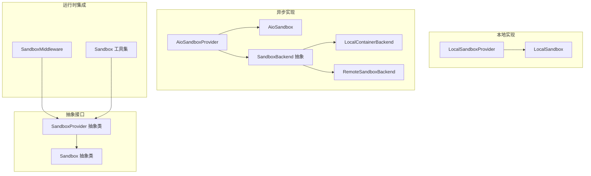
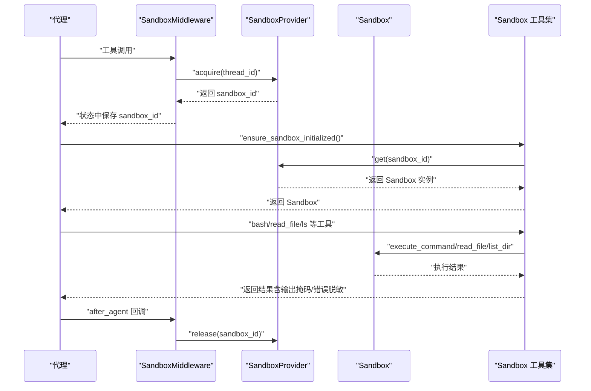
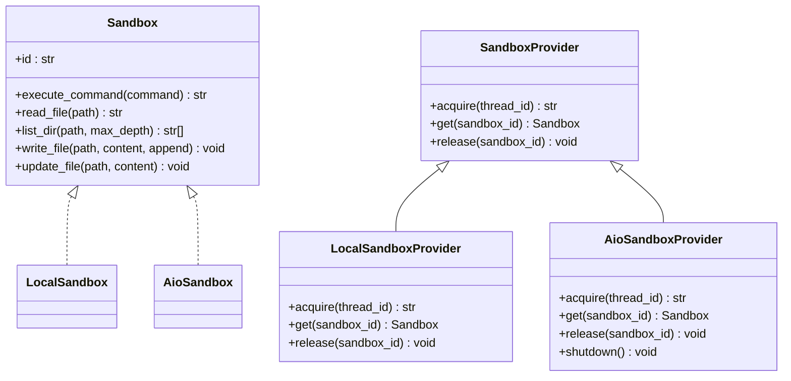
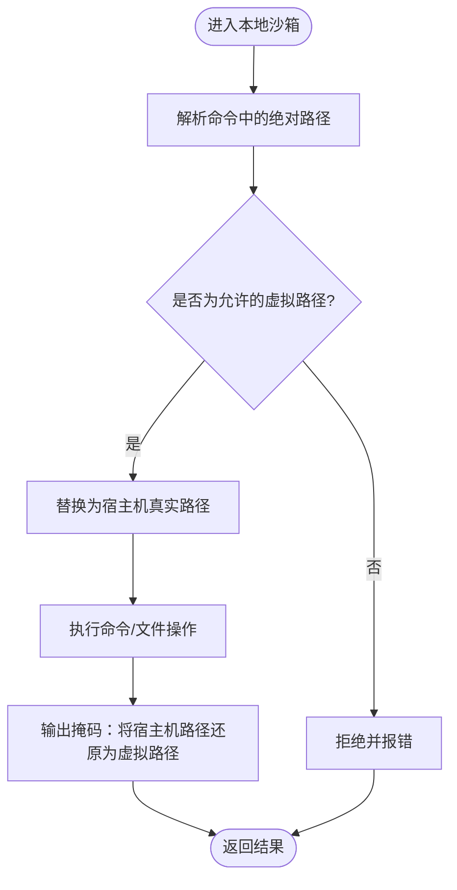
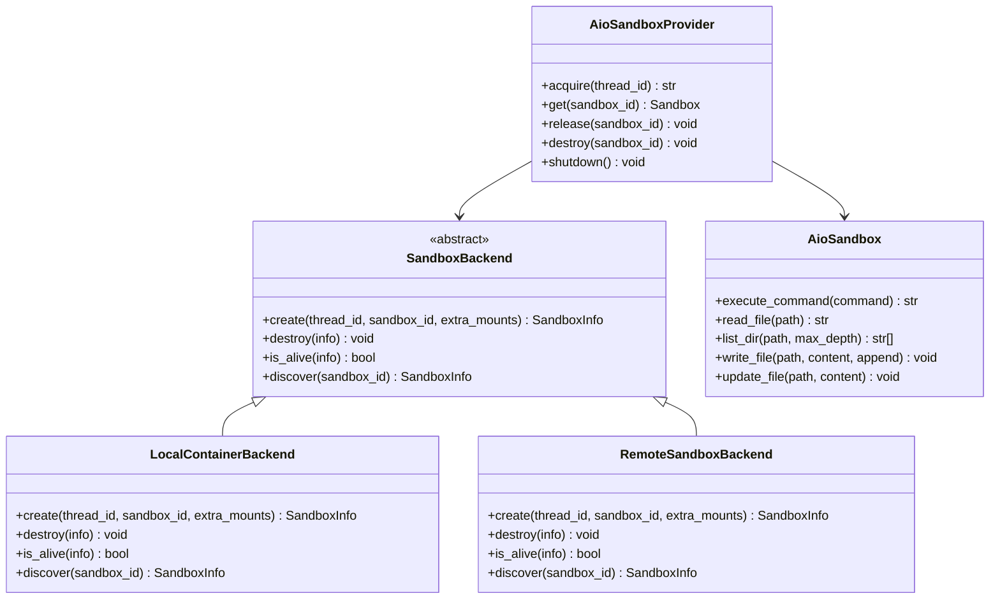
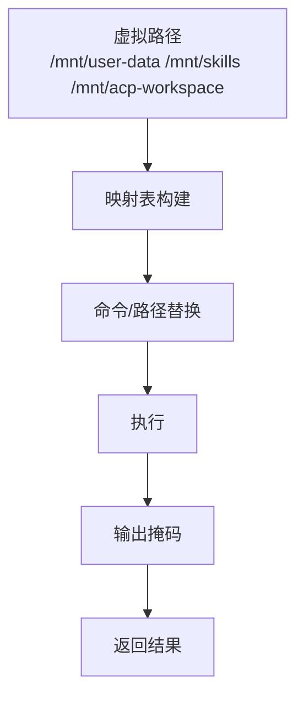
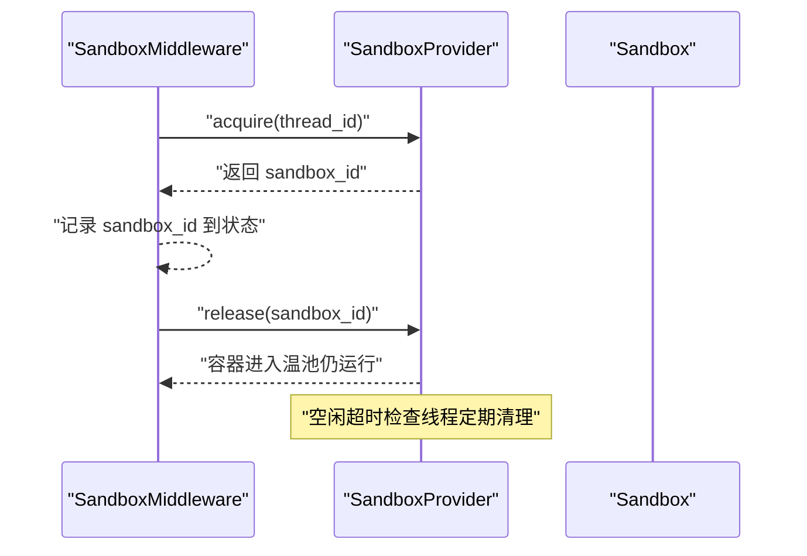
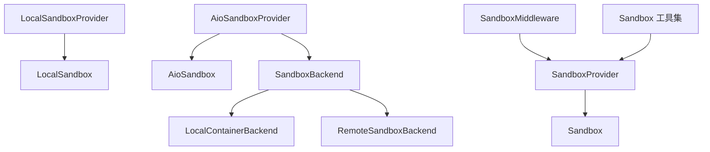

# 沙箱执行环境

<cite>
**本文引用的文件**
- [sandbox.py](file://backend/packages/harness/deerflow/sandbox/sandbox.py)
- [sandbox_provider.py](file://backend/packages/harness/deerflow/sandbox/sandbox_provider.py)
- [local_sandbox.py](file://backend/packages/harness/deerflow/sandbox/local/local_sandbox.py)
- [local_sandbox_provider.py](file://backend/packages/harness/deerflow/sandbox/local/local_sandbox_provider.py)
- [aio_sandbox.py](file://backend/packages/harness/deerflow/community/aio_sandbox/aio_sandbox.py)
- [aio_sandbox_provider.py](file://backend/packages/harness/deerflow/community/aio_sandbox/aio_sandbox_provider.py)
- [backend.py](file://backend/packages/harness/deerflow/community/aio_sandbox/backend.py)
- [local_backend.py](file://backend/packages/harness/deerflow/community/aio_sandbox/local_backend.py)
- [remote_backend.py](file://backend/packages/harness/deerflow/community/aio_sandbox/remote_backend.py)
- [middleware.py](file://backend/packages/harness/deerflow/sandbox/middleware.py)
- [tools.py](file://backend/packages/harness/deerflow/sandbox/tools.py)
- [exceptions.py](file://backend/packages/harness/deerflow/sandbox/exceptions.py)
- [paths.py](file://backend/packages/harness/deerflow/config/paths.py)
- [sandbox_config.py](file://backend/packages/harness/deerflow/config/sandbox_config.py)
- [test_sandbox_tools_security.py](file://backend/tests/test_sandbox_tools_security.py)
</cite>

## 目录
1. [简介](#简介)
2. [项目结构](#项目结构)
3. [核心组件](#核心组件)
4. [架构总览](#架构总览)
5. [详细组件分析](#详细组件分析)
6. [依赖关系分析](#依赖关系分析)
7. [性能考量](#性能考量)
8. [故障排除指南](#故障排除指南)
9. [结论](#结论)
10. [附录](#附录)

## 简介
本文件面向“沙箱执行环境”的设计与实现，系统性阐述其设计理念、安全机制（虚拟路径转换、隔离执行、资源限制）、抽象接口与提供者实现差异（本地沙箱与异步沙箱提供者），以及文件系统抽象、路径映射与技能路径/工作目录处理方式。同时提供配置示例、使用指南、安全策略、性能优化建议与故障排除方法，帮助开发者在不同运行环境中正确部署与维护沙箱系统。

## 项目结构
沙箱系统主要由以下模块构成：
- 抽象层：Sandbox 抽象类与 SandboxProvider 抽象类，定义统一接口与生命周期管理。
- 提供者实现：
  - 本地沙箱：LocalSandbox 与 LocalSandboxProvider，单例模式，直接在宿主机执行命令并进行路径映射。
  - 异步沙箱：AioSandbox 与 AioSandboxProvider，基于容器后端（本地 Docker/Apple Container 或远程 K8s）提供多进程/多容器隔离。
- 工具与中间件：SandboxMiddleware 负责在代理调用前后分配/释放沙箱；工具函数负责路径解析、权限校验与输出掩码。
- 配置与路径：通过配置模块与路径常量定义虚拟路径前缀与容器内挂载点。

**图表来源**
- [sandbox.py:1-73](file://backend/packages/harness/deerflow/sandbox/sandbox.py#L1-L73)
- [sandbox_provider.py:1-97](file://backend/packages/harness/deerflow/sandbox/sandbox_provider.py#L1-L97)
- [local_sandbox_provider.py:1-65](file://backend/packages/harness/deerflow/sandbox/local/local_sandbox_provider.py#L1-L65)
- [local_sandbox.py:1-215](file://backend/packages/harness/deerflow/sandbox/local/local_sandbox.py#L1-L215)
- [aio_sandbox_provider.py:1-613](file://backend/packages/harness/deerflow/community/aio_sandbox/aio_sandbox_provider.py#L1-L613)
- [aio_sandbox.py:1-129](file://backend/packages/harness/deerflow/community/aio_sandbox/aio_sandbox.py#L1-L129)
- [backend.py:1-99](file://backend/packages/harness/deerflow/community/aio_sandbox/backend.py#L1-L99)
- [local_backend.py:1-328](file://backend/packages/harness/deerflow/community/aio_sandbox/local_backend.py#L1-L328)
- [remote_backend.py:1-157](file://backend/packages/harness/deerflow/community/aio_sandbox/remote_backend.py#L1-L157)
- [middleware.py:1-84](file://backend/packages/harness/deerflow/sandbox/middleware.py#L1-L84)
- [tools.py:1-880](file://backend/packages/harness/deerflow/sandbox/tools.py#L1-L880)

**章节来源**
- [sandbox.py:1-73](file://backend/packages/harness/deerflow/sandbox/sandbox.py#L1-L73)
- [sandbox_provider.py:1-97](file://backend/packages/harness/deerflow/sandbox/sandbox_provider.py#L1-L97)
- [local_sandbox_provider.py:1-65](file://backend/packages/harness/deerflow/sandbox/local/local_sandbox_provider.py#L1-L65)
- [local_sandbox.py:1-215](file://backend/packages/harness/deerflow/sandbox/local/local_sandbox.py#L1-L215)
- [aio_sandbox_provider.py:1-613](file://backend/packages/harness/deerflow/community/aio_sandbox/aio_sandbox_provider.py#L1-L613)
- [aio_sandbox.py:1-129](file://backend/packages/harness/deerflow/community/aio_sandbox/aio_sandbox.py#L1-L129)
- [backend.py:1-99](file://backend/packages/harness/deerflow/community/aio_sandbox/backend.py#L1-L99)
- [local_backend.py:1-328](file://backend/packages/harness/deerflow/community/aio_sandbox/local_backend.py#L1-L328)
- [remote_backend.py:1-157](file://backend/packages/harness/deerflow/community/aio_sandbox/remote_backend.py#L1-L157)
- [middleware.py:1-84](file://backend/packages/harness/deerflow/sandbox/middleware.py#L1-L84)
- [tools.py:1-880](file://backend/packages/harness/deerflow/sandbox/tools.py#L1-L880)

## 核心组件
- Sandbox 抽象类：定义统一的命令执行、文件读写、目录列举等能力，确保不同提供者实现的一致行为契约。
- SandboxProvider 抽象类：定义 acquire/get/release 的生命周期管理，并提供全局单例获取与重置/关闭能力。
- LocalSandbox：本地实现，支持路径映射与反向映射，将容器内路径转换为宿主机实际路径执行命令与访问文件。
- LocalSandboxProvider：本地提供者，单例模式，自动建立技能目录映射。
- AioSandbox：异步实现，通过 HTTP 客户端连接远端沙箱容器，提供命令执行、文件读写、目录列举。
- AioSandboxProvider：异步提供者，支持本地容器后端与远程后端，包含线程锁、空闲清理、容量驱逐、优雅关闭等复杂生命周期管理。
- SandboxMiddleware：代理中间件，在首次工具调用时惰性获取沙箱，避免不必要的冷启动；在代理结束后释放沙箱。
- 工具集：负责虚拟路径替换、路径合法性校验、输出掩码、错误信息脱敏、线程目录创建等。

**章节来源**
- [sandbox.py:1-73](file://backend/packages/harness/deerflow/sandbox/sandbox.py#L1-L73)
- [sandbox_provider.py:1-97](file://backend/packages/harness/deerflow/sandbox/sandbox_provider.py#L1-L97)
- [local_sandbox.py:1-215](file://backend/packages/harness/deerflow/sandbox/local/local_sandbox.py#L1-L215)
- [local_sandbox_provider.py:1-65](file://backend/packages/harness/deerflow/sandbox/local/local_sandbox_provider.py#L1-L65)
- [aio_sandbox.py:1-129](file://backend/packages/harness/deerflow/community/aio_sandbox/aio_sandbox.py#L1-L129)
- [aio_sandbox_provider.py:1-613](file://backend/packages/harness/deerflow/community/aio_sandbox/aio_sandbox_provider.py#L1-L613)
- [middleware.py:1-84](file://backend/packages/harness/deerflow/sandbox/middleware.py#L1-L84)
- [tools.py:1-880](file://backend/packages/harness/deerflow/sandbox/tools.py#L1-L880)

## 架构总览
沙箱系统采用“抽象接口 + 多提供者实现”的分层设计。运行时通过 SandboxMiddleware 在代理工具调用前按需分配沙箱，工具函数在本地模式下对命令与路径进行严格校验与替换，再交由具体 Sandbox 实现执行。异步提供者通过后端抽象（本地容器或远程 K8s）实现跨进程/跨节点的隔离与复用。

**图表来源**
- [middleware.py:1-84](file://backend/packages/harness/deerflow/sandbox/middleware.py#L1-L84)
- [sandbox_provider.py:1-97](file://backend/packages/harness/deerflow/sandbox/sandbox_provider.py#L1-L97)
- [tools.py:592-644](file://backend/packages/harness/deerflow/sandbox/tools.py#L592-L644)
- [aio_sandbox_provider.py:330-511](file://backend/packages/harness/deerflow/community/aio_sandbox/aio_sandbox_provider.py#L330-L511)
- [local_sandbox_provider.py:45-64](file://backend/packages/harness/deerflow/sandbox/local/local_sandbox_provider.py#L45-L64)

## 详细组件分析

### 抽象接口与生命周期
- Sandbox 抽象类定义了命令执行、文件读写、目录列举等核心能力，确保不同实现遵循一致的契约。
- SandboxProvider 抽象类定义 acquire/get/release 生命周期，并提供全局单例获取、重置与优雅关闭能力，便于测试与应用重启场景。

**图表来源**
- [sandbox.py:1-73](file://backend/packages/harness/deerflow/sandbox/sandbox.py#L1-L73)
- [sandbox_provider.py:1-97](file://backend/packages/harness/deerflow/sandbox/sandbox_provider.py#L1-L97)
- [local_sandbox_provider.py:1-65](file://backend/packages/harness/deerflow/sandbox/local/local_sandbox_provider.py#L1-L65)
- [aio_sandbox_provider.py:1-613](file://backend/packages/harness/deerflow/community/aio_sandbox/aio_sandbox_provider.py#L1-L613)

**章节来源**
- [sandbox.py:1-73](file://backend/packages/harness/deerflow/sandbox/sandbox.py#L1-L73)
- [sandbox_provider.py:1-97](file://backend/packages/harness/deerflow/sandbox/sandbox_provider.py#L1-L97)

### 本地沙箱与路径映射
- LocalSandbox 支持可选的路径映射字典，将容器内路径（如 /mnt/skills）映射到宿主机实际路径，执行命令与文件操作前进行路径解析，执行后将宿主机绝对路径反向映射回容器内虚拟路径，避免泄露宿主机文件系统布局。
- LocalSandboxProvider 自动从配置加载技能目录与容器路径映射，形成只读挂载，保证安全性。
- 工具集在本地模式下对命令中的绝对路径进行白名单校验，仅允许 /mnt/user-data、/mnt/skills、/mnt/acp-workspace 等虚拟路径，其他绝对路径将被拒绝。

**图表来源**
- [local_sandbox.py:106-174](file://backend/packages/harness/deerflow/sandbox/local/local_sandbox.py#L106-L174)
- [tools.py:453-491](file://backend/packages/harness/deerflow/sandbox/tools.py#L453-L491)
- [tools.py:287-356](file://backend/packages/harness/deerflow/sandbox/tools.py#L287-L356)

**章节来源**
- [local_sandbox.py:1-215](file://backend/packages/harness/deerflow/sandbox/local/local_sandbox.py#L1-L215)
- [local_sandbox_provider.py:1-65](file://backend/packages/harness/deerflow/sandbox/local/local_sandbox_provider.py#L1-L65)
- [tools.py:1-880](file://backend/packages/harness/deerflow/sandbox/tools.py#L1-L880)

### 异步沙箱提供者与后端抽象
- AioSandboxProvider 支持本地容器后端与远程后端，具备跨进程容器发现、线程级锁、空闲超时清理、容量驱逐、优雅关闭等特性。
- 后端抽象 SandboxBackend 定义 create/destroy/is_alive/discover 接口，LocalContainerBackend 使用 Docker/Apple Container 管理容器生命周期，RemoteSandboxBackend 通过外部服务动态创建/销毁 Pod 并暴露 NodePort 访问。
- AioSandbox 封装 agent-infra/sandbox 客户端，通过 HTTP API 执行命令、读写文件、列举目录。

**图表来源**
- [backend.py:1-99](file://backend/packages/harness/deerflow/community/aio_sandbox/backend.py#L1-L99)
- [local_backend.py:1-328](file://backend/packages/harness/deerflow/community/aio_sandbox/local_backend.py#L1-L328)
- [remote_backend.py:1-157](file://backend/packages/harness/deerflow/community/aio_sandbox/remote_backend.py#L1-L157)
- [aio_sandbox_provider.py:1-613](file://backend/packages/harness/deerflow/community/aio_sandbox/aio_sandbox_provider.py#L1-L613)
- [aio_sandbox.py:1-129](file://backend/packages/harness/deerflow/community/aio_sandbox/aio_sandbox.py#L1-L129)

**章节来源**
- [aio_sandbox_provider.py:1-613](file://backend/packages/harness/deerflow/community/aio_sandbox/aio_sandbox_provider.py#L1-L613)
- [local_backend.py:1-328](file://backend/packages/harness/deerflow/community/aio_sandbox/local_backend.py#L1-L328)
- [remote_backend.py:1-157](file://backend/packages/harness/deerflow/community/aio_sandbox/remote_backend.py#L1-L157)
- [aio_sandbox.py:1-129](file://backend/packages/harness/deerflow/community/aio_sandbox/aio_sandbox.py#L1-L129)

### 文件系统抽象与路径映射机制
- 虚拟路径前缀：通过配置模块定义虚拟路径前缀（如 /mnt/user-data），工具集提供虚拟路径到实际路径的映射与反向映射。
- 技能路径映射：支持将 /mnt/skills 映射到宿主机技能目录，且默认只读，防止沙箱内修改宿主机代码。
- ACP 工作区映射：支持全局或线程级 ACP 工作区路径映射，工具集在解析时进行路径穿越检测，确保访问受限。
- 输出掩码：本地沙箱在返回结果时，将宿主机绝对路径替换为对应的虚拟路径，避免泄露内部文件系统结构。

**图表来源**
- [tools.py:224-284](file://backend/packages/harness/deerflow/sandbox/tools.py#L224-L284)
- [tools.py:287-356](file://backend/packages/harness/deerflow/sandbox/tools.py#L287-L356)
- [tools.py:31-104](file://backend/packages/harness/deerflow/sandbox/tools.py#L31-L104)
- [tools.py:168-204](file://backend/packages/harness/deerflow/sandbox/tools.py#L168-L204)
- [paths.py](file://backend/packages/harness/deerflow/config/paths.py)

**章节来源**
- [tools.py:1-880](file://backend/packages/harness/deerflow/sandbox/tools.py#L1-L880)
- [paths.py](file://backend/packages/harness/deerflow/config/paths.py)

### 中间件与生命周期管理
- SandboxMiddleware 支持惰性初始化（lazy_init=True，默认），在首次工具调用时获取沙箱；在代理回调 after_agent 时释放沙箱，避免频繁创建销毁带来的性能损耗。
- 提供者侧的 release 将容器保留在“温池”中，以便同一线程下次快速复用；空闲超时检查线程定期清理长时间未使用的沙箱。

**图表来源**
- [middleware.py:1-84](file://backend/packages/harness/deerflow/sandbox/middleware.py#L1-L84)
- [aio_sandbox_provider.py:528-582](file://backend/packages/harness/deerflow/community/aio_sandbox/aio_sandbox_provider.py#L528-L582)

**章节来源**
- [middleware.py:1-84](file://backend/packages/harness/deerflow/sandbox/middleware.py#L1-L84)
- [aio_sandbox_provider.py:229-296](file://backend/packages/harness/deerflow/community/aio_sandbox/aio_sandbox_provider.py#L229-L296)

### 工具与安全策略
- 命令路径校验：本地模式下，仅允许使用虚拟路径前缀与系统常见路径前缀（如 /bin、/usr/bin、/dev），拒绝其他绝对路径。
- 路径合法性：禁止路径穿越（..），并对用户数据、技能、ACP 工作区三类路径分别进行读写权限控制。
- 错误脱敏：捕获异常时对宿主机路径进行掩码，避免泄露内部文件系统布局。
- 线程目录创建：本地沙箱在首次使用时创建线程专属目录（workspace、uploads、outputs）。

**章节来源**
- [tools.py:453-491](file://backend/packages/harness/deerflow/sandbox/tools.py#L453-L491)
- [tools.py:359-412](file://backend/packages/harness/deerflow/sandbox/tools.py#L359-L412)
- [tools.py:210-222](file://backend/packages/harness/deerflow/sandbox/tools.py#L210-L222)
- [tools.py:647-682](file://backend/packages/harness/deerflow/sandbox/tools.py#L647-L682)

## 依赖关系分析
- 组件耦合：
  - SandboxProvider 与具体 Sandbox 实现解耦，通过反射解析配置类名实例化。
  - AioSandboxProvider 依赖后端抽象，支持本地与远程两种后端，便于扩展。
  - 工具集与运行时状态耦合，通过 runtime.state/context 传递沙箱上下文。
- 外部依赖：
  - 异步沙箱通过 agent-infra/sandbox 客户端访问容器 API。
  - 本地容器后端依赖 Docker/Apple Container 命令行工具。
  - 远程后端依赖外部 provisioner 服务与 K8s API。

**图表来源**
- [sandbox_provider.py:1-97](file://backend/packages/harness/deerflow/sandbox/sandbox_provider.py#L1-L97)
- [local_sandbox_provider.py:1-65](file://backend/packages/harness/deerflow/sandbox/local/local_sandbox_provider.py#L1-L65)
- [aio_sandbox_provider.py:1-613](file://backend/packages/harness/deerflow/community/aio_sandbox/aio_sandbox_provider.py#L1-L613)
- [backend.py:1-99](file://backend/packages/harness/deerflow/community/aio_sandbox/backend.py#L1-L99)
- [middleware.py:1-84](file://backend/packages/harness/deerflow/sandbox/middleware.py#L1-L84)
- [tools.py:1-880](file://backend/packages/harness/deerflow/sandbox/tools.py#L1-L880)

**章节来源**
- [sandbox_provider.py:1-97](file://backend/packages/harness/deerflow/sandbox/sandbox_provider.py#L1-L97)
- [aio_sandbox_provider.py:1-613](file://backend/packages/harness/deerflow/community/aio_sandbox/aio_sandbox_provider.py#L1-L613)
- [backend.py:1-99](file://backend/packages/harness/deerflow/community/aio_sandbox/backend.py#L1-L99)
- [middleware.py:1-84](file://backend/packages/harness/deerflow/sandbox/middleware.py#L1-L84)
- [tools.py:1-880](file://backend/packages/harness/deerflow/sandbox/tools.py#L1-L880)

## 性能考量
- 惰性初始化：SandboxMiddleware 默认惰性初始化，减少不必要的沙箱创建。
- 温池复用：AioSandboxProvider 将释放的容器放入温池，同一线程再次使用时无需冷启动。
- 空闲清理：空闲超时检查线程定期销毁长时间未使用的容器，平衡资源占用。
- 线程锁与文件锁：跨进程容器发现与创建使用文件锁避免竞态，提升一致性。
- 命令与路径替换：本地模式下提前进行路径替换与校验，减少失败重试成本。

**章节来源**
- [middleware.py:34-41](file://backend/packages/harness/deerflow/sandbox/middleware.py#L34-L41)
- [aio_sandbox_provider.py:329-395](file://backend/packages/harness/deerflow/community/aio_sandbox/aio_sandbox_provider.py#L329-L395)
- [aio_sandbox_provider.py:229-296](file://backend/packages/harness/deerflow/community/aio_sandbox/aio_sandbox_provider.py#L229-L296)
- [local_sandbox.py:106-136](file://backend/packages/harness/deerflow/sandbox/local/local_sandbox.py#L106-L136)

## 故障排除指南
- 常见错误类型：
  - SandboxNotFoundError：沙箱 ID 不存在或已被释放。
  - SandboxRuntimeError：运行时状态缺失或线程 ID 不可用。
  - PermissionError：路径穿越或非允许路径访问。
  - FileNotFoundError：路径不存在。
- 排查步骤：
  - 确认 SandboxMiddleware 是否正确初始化与释放。
  - 检查配置中的 sandbox.use 是否指向正确的提供者类。
  - 本地模式下确认命令是否使用虚拟路径前缀，避免绝对路径。
  - 异步模式下确认容器健康状态与端口映射是否正常。
  - 查看日志中的沙箱 ID 与容器 URL，定位具体问题。
- 单元测试参考：
  - 可参考测试用例验证沙箱工具的安全性与路径解析行为。

**章节来源**
- [exceptions.py](file://backend/packages/harness/deerflow/sandbox/exceptions.py)
- [middleware.py:1-84](file://backend/packages/harness/deerflow/sandbox/middleware.py#L1-L84)
- [test_sandbox_tools_security.py](file://backend/tests/test_sandbox_tools_security.py)

## 结论
该沙箱执行环境通过抽象接口与多提供者实现，实现了在本地与异步容器环境下的统一能力边界。本地沙箱强调路径映射与输出掩码，异步沙箱强调跨进程/跨节点的隔离与复用。配合严格的路径校验、错误脱敏与生命周期管理，系统在保证安全性的同时兼顾性能与可维护性。

## 附录

### 配置示例与使用指南
- 选择提供者：
  - 本地：设置 sandbox.use 指向 LocalSandboxProvider。
  - 异步：设置 sandbox.use 指向 AioSandboxProvider。
- 异步沙箱关键配置项（sandbox_config.py 对应键）：
  - image：容器镜像名称。
  - port：基础端口（用于本地容器端口分配）。
  - container_prefix：容器名称前缀。
  - idle_timeout：空闲超时时间（秒）。
  - replicas：最大并发容器数（软上限，活跃容器不会被强制停止）。
  - mounts：额外卷挂载列表（host_path、container_path、read_only）。
  - environment：容器环境变量（支持以 $ 开头的环境变量引用）。
  - provisioner_url：远程模式下 provisioner 服务地址。
- 使用建议：
  - 生产环境优先使用异步沙箱，结合远程后端实现弹性扩缩容。
  - 本地开发可使用本地沙箱，注意宿主机路径映射与权限控制。
  - 合理设置 idle_timeout 与 replicas，平衡资源占用与响应速度。
  - 在容器内启用只读挂载（尤其是技能目录），降低误改风险。

**章节来源**
- [aio_sandbox_provider.py:53-67](file://backend/packages/harness/deerflow/community/aio_sandbox/aio_sandbox_provider.py#L53-L67)
- [local_backend.py:34-57](file://backend/packages/harness/deerflow/community/aio_sandbox/local_backend.py#L34-L57)
- [remote_backend.py:36-41](file://backend/packages/harness/deerflow/community/aio_sandbox/remote_backend.py#L36-L41)